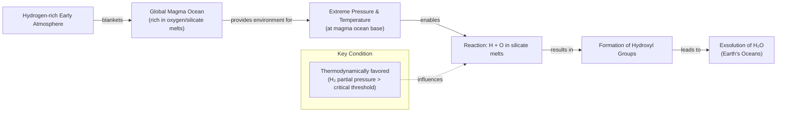

# Where Did Earth Get Its Water? A Story of Comets, Asteroids, and Homegrown Oceans

A spacecraft is currently on its way to Europa, an ice-covered moon of Jupiter believed to hide a vast subsurface ocean. Affixed to it is a plaque engraved with a poem by Ada Limón, which reads in part: “Arching under the night sky inky with black expansiveness, we point to the planets we know, we pin quick wishes on stars” [[1]](https://poets.org/poem/praise-mystery-poem-europa), [[2]](https://www.youtube.com/watch?v=EgWbeDNPD6o), [[3]](https://www.slowdownshow.org/story/2023/08/25/full-version-in-praise-of-mystery-a-poem-for-europa), [[4]](https://www.loc.gov/programs/poetry-and-literature/poet-laureate/poet-laureate-projects/a-poem-for-europa), [[5]](https://www.bookpage.com/reviews/in-praise-of-mystery-ada-limon-book-review). NASA’s decades-long search for water across the solar system is driven by a simple truth: as far as we know, water is essential for life.

It might be surprising, then, that we still do not have a definitive answer for how water first arrived here on Earth. For years, the leading theory was that our oceans were delivered by comets, icy wanderers from the dawn of the solar system. You might assume this question was settled long ago, but as our spacecraft got a closer look, the data revealed a chemical mismatch. After that, “comets sort of fell out of favor,” said Ashley King, a meteoriticist at the Natural History Museum in London [[6]](https://www.quantamagazine.org/where-did-earth-get-its-oceans-maybe-it-made-them-itself-20260612). Asteroids, which are rockier and impact Earth more frequently, became the new front-runner, as many were found to contain water that looked much more like our own [[6]](https://www.quantamagazine.org/where-did-earth-get-its-oceans-maybe-it-made-them-itself-20260612), [[7]](https://www.aaas.org/membership/member-spotlight/where-did-earths-water-come-aaas-fellow-karen-meech-investigates).

However, the asteroid theory has its own problems, particularly with matching the noble gas composition of our atmosphere. This has led to a radical new idea gaining momentum: what if Earth made its own water? Through explosive lab experiments and observations of distant worlds, we have realized that rocky planets have a way to generate water all by themselves. This has shifted the debate from a simple story of cosmic delivery to a more complex and richer narrative, challenging the entire paradigm of external delivery [[6]](https://www.quantamagazine.org/where-did-earth-get-its-oceans-maybe-it-made-them-itself-20260612).

The early cometary model dominated our thinking, but isotopic data forced a re-evaluation, opening the door to asteroidal alternatives. Now, we are exploring the possibility that Earth generated its own water internally. In this article, we will explore the showdown between these cosmic candidates and the rise of the homegrown water theory, using concrete evidence from missions and meteorites to help you evaluate each hypothesis.

## A Showdown Between Comets and Asteroids

Earth formed about 4.54 billion years ago. While much of its earliest history has been erased, the basic story is agreed upon: it began as a ball of mostly molten rock and somehow became the blue marble we know today [[6]](https://www.quantamagazine.org/where-did-earth-get-its-oceans-maybe-it-made-them-itself-20260612). The "how" has been the subject of intense scientific debate.

Comets were the early frontrunner. These icy bodies, formed in the cold outer reaches of the solar system like the Kuiper Belt and Oort cloud, are rich in water ice, often making up more than 50% of their mass. When they crash into a planet, they deliver a significant amount of water. Compared to the drier, rock-dominated asteroids, comets give you “a lot of bang for your buck,” said James Bryson, a meteoriticist at the University of Oxford [[6]](https://www.quantamagazine.org/where-did-earth-get-its-oceans-maybe-it-made-them-itself-20260612).

The key to testing this theory lies in a chemical fingerprint: the ratio of deuterium to hydrogen (D/H). Deuterium is a heavier form of hydrogen, and its proportion in water reveals where and when that water formed. If comets supplied Earth’s oceans, their D/H ratio should match ours. In 1986, the European Space Agency’s (ESA) Giotto mission flew by Halley’s comet to check. The results were a surprise. Giotto's measurements showed that Halley's water had a D/H ratio twice that of Earth's oceans. “It didn’t seem logical that today’s oceans should match the D/H … chemistry of the primordial water present at Earth’s formation,” said Karen Meech, a planetary astronomer at the University of Hawai‘i [[8]](https://research.hawaii.edu/noelo/water-and-habitability).

<https://www.quantamagazine.org/wp-content/uploads/2026/06/Giotto_launch_preparations-cr.ESA_.webp> 
<small><em>Image 1: ESA’s Giotto spacecraft (top) took the first close-up images of a cometary nucleus (bottom) as part of its mission to Halley’s comet. (Source [ESA](https://www.quantamagazine.org/where-did-earth-get-its-oceans-maybe-it-made-them-itself-20260612))</em></small>

<https://www.quantamagazine.org/wp-content/uploads/2026/06/Giotto_images_of_Comet_Halley-cr.MPAE-courtesy-Dr.-H.U.-Keller.webp> 

Over the next two decades, observations of other comets like Hale-Bopp confirmed this trend of heavy water, a form of water where one hydrogen atom is replaced by deuterium [[6]](https://www.quantamagazine.org/where-did-earth-get-its-oceans-maybe-it-made-them-itself-20260612). The final blow came in 2014 from ESA’s Rosetta mission, which orbited and landed on comet 67P/Churyumov-Gerasimenko. Its high-precision measurements revealed a D/H ratio more than three times that of Earth’s water, the highest ever recorded for a comet. This effectively ruled out comets as the primary source of our oceans [[6]](https://www.quantamagazine.org/where-did-earth-get-its-oceans-maybe-it-made-them-itself-20260612), [[9]](https://www.esa.int/Science_Exploration/Space_Science/Rosetta/Rosetta_fuels_debate_on_origin_of_Earth_s_oceans).

<https://www.quantamagazine.org/wp-content/uploads/2024/11/TheComet_crChristianStangl-Lede-2-scaled.webp> 
<small><em>Image 2: Comet 67P/Churyumov-Gerasimenko was photographed in 2014 by ESA’s Rosetta mission, which also sent a lander to the comet’s surface. (Source [ESA/Christian Stangl](https://www.quantamagazine.org/where-did-earth-get-its-oceans-maybe-it-made-them-itself-20260612))</em></small>

With comets sidelined, attention turned to asteroids. These rocky objects from the asteroid belt between Mars and Jupiter frequently impact our planet as meteorites. We have collected thousands of them and found that a particular group, carbonaceous chondrites, contains water with a D/H ratio that closely matches our own. The 2021 fall of the Winchcombe meteorite, which landed on a driveway in a small English town, provided a pristine sample. Recovered just hours after landing, its composition was largely unmodified by the terrestrial environment. Analysis showed its water had a D/H ratio nearly identical to Earth’s oceans [[6]](https://www.quantamagazine.org/where-did-earth-get-its-oceans-maybe-it-made-them-itself-20260612), [[10]](https://www.science.org/doi/10.1126/sciadv.abq3925).

This finding was powerfully confirmed by Japan's Hayabusa2 mission, which returned samples from the asteroid Ryugu in 2018. Because these samples were collected in space, they avoided any terrestrial contamination. The analysis of Ryugu's hydrous minerals yielded a D/H ratio that was, within measurement error, indistinguishable from Earth's water. This reinforced the link between Earth's oceans and water-rich asteroids from the outer solar system [[6]](https://www.quantamagazine.org/where-did-earth-get-its-oceans-maybe-it-made-them-itself-20260612), [[11]](https://iopscience.iop.org/article/10.3847/2041-8213/acc393).

<https://www.quantamagazine.org/wp-content/uploads/2026/06/arrival-bennu-full-rotation-cr.NASAs-Goddard-Space-Flight-Center_University-Of-Arizona-still.jpg> 
<small><em>Image 3: The asteroid Ryugu, visited by the Hayabusa2 spacecraft in 2018, contained water similar to the most common kind found on Earth. (Source [NASA’s Goddard Space Flight Center/University of Arizona](https://www.quantamagazine.org/where-did-earth-get-its-oceans-maybe-it-made-them-itself-20260612))</em></small>

But the asteroid-only model is not perfect. While the D/H ratio matches, other volatile elements found in asteroids, such as the noble gases xenon and krypton, do not match the composition of Earth's atmosphere [[6]](https://www.quantamagazine.org/where-did-earth-get-its-oceans-maybe-it-made-them-itself-20260612), [[12]](https://link.springer.com/article/10.1007/s11214-022-00929-9). The mismatch in noble gases is particularly puzzling. Earth’s atmospheric xenon, for example, has a unique isotopic signature, with excesses of certain heavy isotopes that cannot be fully explained by the solar wind or the radioactive decay products found in meteorites [[13]](https://earthandsolarsystem.wordpress.com/2011/05/18/xenon).

Furthermore, the theory relies on a "late veneer," a period of intense bombardment by asteroids after Earth had cooled. The scale and efficiency of this bombardment are still debated [[6]](https://www.quantamagazine.org/where-did-earth-get-its-oceans-maybe-it-made-them-itself-20260612). The contradictions in both the cometary and asteroidal models have pushed us to consider a more radical possibility: that Earth made its own water.

The debate over external delivery has left key questions unanswered, with both isotopic and dynamical models showing inconsistencies. This has led to a re-examination of Earth's own building blocks, which were previously assumed to be dry, and the possibility of an early, internal water source.

## Hydrogen, Meet Magma

When we simulate how exoplanets form, we find that many rocky worlds likely began their lives with thick, hydrogen-rich atmospheres [[14]](https://www.nature.com/articles/s41586-023-05823-0). This has led us to wonder if Earth’s early years were similar.

The idea was initially dismissed because the meteorites thought to be Earth's building blocks, known as enstatite chondrites, appeared to lack hydrogen. These meteorites have a chemical makeup suspiciously similar to Earth, suggesting they formed from the same raw materials [[15]](https://www.science.org/doi/10.1126/science.aba1948). However, recent studies, including one co-authored by James Bryson, found that hydrogen was there all along, hidden within organic molecules, silicate glasses, and sulfur compounds [[6]](https://www.quantamagazine.org/where-did-earth-get-its-oceans-maybe-it-made-them-itself-20260612), [[15]](https://www.science.org/doi/10.1126/science.aba1948), [[16]](https://www.sciencedirect.com/science/article/pii/S0019103525001356). This discovery opened the door to the possibility that early Earth was also awash in hydrogen.

This hydrogen-rich atmosphere would have blanketed a global magma ocean, which was full of oxygen bound in silicate melts. A 2023 paper explored the idea that if the atmospheric hydrogen and magmatic oxygen could mix, a planet could produce its own water [[14]](https://www.nature.com/articles/s41586-023-05823-0), [[17]](https://arxiv.org/abs/2304.07845), [[18]](https://astrobiology.com/2023/04/how-did-earth-get-its-water.html), [[19]](https://www.researchgate.net/publication/370070865_Earth_shaped_by_primordial_H_2_atmospheres). The key was recreating the extreme conditions at the boundary between the atmosphere and the magma. Researchers led by H.W. Horn and S.-H. Shim at Arizona State University suspected that immense pressure was needed to facilitate the reaction [[20]](https://doi.org/10.1038/s41586-025-09630-7).

Image 4: A flowchart illustrating the endogenous water production model on early Earth, showing the process from a hydrogen-rich atmosphere to the formation of oceans via reactions within a magma ocean.

To test this, they designed a set of daring experiments using diamond-anvil cells to put flammable hydrogen under intense pressure and then melted rock samples with lasers [[21]](https://arxiv.org/pdf/2511.01351), [[22]](https://faculty.epss.ucla.edu/~eyoung/reprints/Miozzi_etal_2025.pdf), [[23]](https://www.nature.com/articles/s41586-025-09630-7). After five years of development and many broken diamonds, they succeeded. The reaction between high-pressure hydrogen and molten rock was so efficient that it produced far more water than had been predicted—up to tens of weight percent, thousands of times higher than previous estimates [[20]](https://doi.org/10.1038/s41586-025-09630-7). Low-pressure thermodynamic models had suggested the reaction would be insignificant, but these new experiments confirmed that at pressures above a few gigapascals, the reaction becomes highly efficient. These are conditions found at the base of a magma ocean. “It doesn’t seem unreasonable [that you could] produce a huge amount of water quite quickly,” said Paul Byrne, a planetary scientist at Washington University in St. Louis. “And this is all homegrown, indigenous water” [[6]](https://www.quantamagazine.org/where-did-earth-get-its-oceans-maybe-it-made-them-itself-20260612).

But does this mean Earth created its own oceans? The authors of the study are cautious. “The paper doesn’t make strong claims about Earth,” Horn said, though he and Shim believe it’s a valid link to make [[6]](https://www.quantamagazine.org/where-did-earth-get-its-oceans-maybe-it-made-them-itself-20260612). The main issue is whether early Earth had enough gravity to hold on to a hydrogen atmosphere dense enough to create the necessary pressure. Models suggest that planets need to be at least a quarter of Earth’s mass to gravitationally hold on to a significant hydrogen envelope [[22]](https://faculty.epss.ucla.edu/~eyoung/reprints/Miozzi_etal_2025.pdf). If the hydrogen is lost to space before the magma ocean solidifies, any potential water-forming ingredients would simply remain trapped in the mantle [[24]](https://iopscience.iop.org/article/10.3847/PSJ/ac5fb1).

Sub-Neptunes, which are more massive than Earth, are better at this. “Earth is right on the edge of where that kind of thing can start happening,” Horn noted [[6]](https://www.quantamagazine.org/where-did-earth-get-its-oceans-maybe-it-made-them-itself-20260612). Some scientists are doubtful, like Anders Johansen, an astrophysicist at the University of Copenhagen, who said, “I’m a little bit doubtful whether you can have this for an Earth-mass planet.” [[6]](https://www.quantamagazine.org/where-did-earth-get-its-oceans-maybe-it-made-them-itself-20260612). However, Byrne points out that the experiments suggest the reaction is so efficient it might not need to last long. Earth could have been a water factory for just a moment, but that moment may have been enough to forge its oceans.

If this is the case, the implications are profound. It suggests that countless rocky planets could be "born water-rich," greatly expanding the number of potentially habitable worlds in the galaxy [[6]](https://www.quantamagazine.org/where-did-earth-get-its-oceans-maybe-it-made-them-itself-20260612), [[25]](https://www.mpg.de/20541783/water-discovered-in-rocky-planet-forming-zone-offers-clues-on-habitability), [[26]](https://news.mit.edu/2025/planets-without-water-could-still-produce-certain-liquids-0811), [[27]](https://pmc.ncbi.nlm.nih.gov/articles/PMC12783251), [[28]](https://www.nasa.gov/missions/kepler/about-half-of-sun-like-stars-could-host-rocky-potentially-habitable-planets), [[29]](https://eos.org/editors-vox/terrestrial-planets-guide-our-search-for-habitable-exoplanets). This mechanism also helps solve a puzzle in planet formation: it provides a way for water-rich worlds to form close to their stars, inside the "snow line," without needing to migrate from the colder, outer regions of a solar system [[30]](https://pmc.ncbi.nlm.nih.gov/articles/PMC12571897). While the endogenous mechanism is compelling, it does not exclude all external contributions. The final picture of Earth's water origins may be a blend of sources, a topic we will explore next.

## Drowning in a Sea of Possibilities

While the homegrown water theory provides a powerful new explanation, the story of Earth's water is likely a combination of sources. In a surprising twist, comets are making a comeback, though not as the main character. By the time Rosetta declared comet 67P a poor match for Earth's water, we had studied 11 other comets. All had high D/H ratios, except one. In 2011, ESA’s Herschel Space Observatory found that the water in comet Hartley 2 had an Earth-like signature [[31]](https://sci.esa.int/web/herschel/-/49386-herschel-finds-first-evidence-of-earth-like-water-in-a-comet), [[32]](https://sci.esa.int/web/herschel/-/49378-the-deuterium-to-hydrogen-ratio-in-the-solar-system), [[33]](https://www.aanda.org/articles/aa/abs/2012/08/aa19744-12/aa19744-12.html), [[34]](https://www.jpl.nasa.gov/images/pia14737-heavy-and-light-just-right), [[35]](https://herscheltelescope.org.uk/results/comet-hartley-2-and-the-oceans-of-earth).

<https://www.quantamagazine.org/wp-content/uploads/2026/06/Comet-Hartley-2-cr-NASA-JPL-Caltech-UMD-still-1.jpg> 
<small><em>Image 5: Comet Hartley 2, studied by the Herschel Space Observatory, has an Earth-like ratio of heavy to normal water. (Source [NASA/JPL-Caltech/UMD](https://www.quantamagazine.org/where-did-earth-get-its-oceans-maybe-it-made-them-itself-20260612))</em></small>

This observation seemed like an anomaly at first. However, a 2024 reanalysis of over 4,000 measurements from Rosetta found that dust in the comet's coma skewed the original data [[36]](https://www.science.org/doi/10.1126/sciadv.adp2191). Laboratory experiments confirm that heavy water (HDO), where one hydrogen atom is replaced by deuterium, preferentially adsorbs onto dust grains. This artificially enriched the D/H ratio in measurements taken close to the nucleus [[37]](https://www.aanda.org/articles/aa/full_html/2019/05/aa35554-19/aa35554-19.html). The new, well-mixed value for 67P is only 1.2 to 1.6 times that of Earth’s water, aligning the comet with other Jupiter Family Comets [[36]](https://www.science.org/doi/10.1126/sciadv.adp2191). Then, in 2025, observations of comet 12P/Pons-Brooks also detected a D/H ratio similar to Earth's oceans [[6]](https://www.quantamagazine.org/where-did-earth-get-its-oceans-maybe-it-made-them-itself-20260612).

So, where does this leave us? “I suspect it was a combination of all of them,” Meech said [[6]](https://www.quantamagazine.org/where-did-earth-get-its-oceans-maybe-it-made-them-itself-20260612). Earth's water is likely a cocktail with ingredients from multiple sources. A small fraction may have come from comets, with asteroids contributing a larger share to the oceans. Meanwhile, an endogenous source, isotopically similar to enstatite chondrites, could account for the water found deep in Earth’s primitive mantle [[38]](https://insu.hal.science/insu-03971858/file/Izidoro-Piani_2022_share.pdf).

The difficulty in finding a perfect match is compounded by Earth’s active geology. Over billions of years, processes like mantle convection, atmospheric escape, and life itself have continuously filtered and altered the original chemical signatures, erasing the forensic record [[7]](https://www.aaas.org/membership/member-spotlight/where-did-earths-water-come-aaas-fellow-karen-meech-investigates). “We may never know,” Meech admitted [[6]](https://www.quantamagazine.org/where-did-earth-get-its-oceans-maybe-it-made-them-itself-20260612).

This uncertainty mirrors the questions surrounding the origin of life. Just as science has moved from a single "warm little pond" to a network of possible pathways, the story of water has become richer and more complex. “The more you learn, the less you know—but the story becomes richer and more exciting,” Meech concluded [[6]](https://www.quantamagazine.org/where-did-earth-get-its-oceans-maybe-it-made-them-itself-20260612). This complexity is not a failure but a sign of scientific progress, generating new testable predictions for future missions.

## References

- [1] [In Praise of Mystery: A Poem for Europa](https://poets.org/poem/praise-mystery-poem-europa)
- [2] [A Poem for Europa](https://www.youtube.com/watch?v=EgWbeDNPD6o)
- [3] [In Praise of Mystery: A Poem for Europa](https://www.slowdownshow.org/story/2023/08/25/full-version-in-praise-of-mystery-a-poem-for-europa)
- [4] [A Poem for Europa](https://www.loc.gov/programs/poetry-and-literature/poet-laureate/poet-laureate-projects/a-poem-for-europa)
- [5] [In Praise of Mystery](https://www.bookpage.com/reviews/in-praise-of-mystery-ada-limon-book-review)
- [6] [Where Did Earth Get Its Oceans? Maybe It Made Them Itself.](https://www.quantamagazine.org/where-did-earth-get-its-oceans-maybe-it-made-them-itself-20260612)
- [7] [Where did Earth’s water come from? AAAS Fellow Karen Meech investigates](https://www.aaas.org/membership/member-spotlight/where-did-earths-water-come-aaas-fellow-karen-meech-investigates)
- [8] [Water and Habitability – Noelo](https://research.hawaii.edu/noelo/water-and-habitability)
- [9] [Rosetta fuels debate on origin of Earth’s oceans](https://www.esa.int/Science_Exploration/Space_Science/Rosetta/Rosetta_fuels_debate_on_origin_of_Earth_s_oceans)
- [10] [The Winchcombe meteorite, a unique and pristine witness from the outer solar system](https://www.science.org/doi/10.1126/sciadv.abq3925)
- [11] [Hydrogen Isotopic Composition of Hydrous Minerals in Asteroid Ryugu](https://iopscience.iop.org/article/10.3847/2041-8213/acc393)
- [12] [Noble Gases and Stable Isotopes Track the Origin and Early Evolution of the Venus Atmosphere](https://link.springer.com/article/10.1007/s11214-022-00929-9)
- [13] [Xenon!](https://earthandsolarsystem.wordpress.com/2011/05/18/xenon)
- [14] [Earth shaped by primordial H2 atmospheres](https://www.nature.com/articles/s41586-023-05823-0)
- [15] [Earth’s water may have been inherited from material similar to enstatite chondrite meteorites](https://www.science.org/doi/10.1126/science.aba1948)
- [16] [The source of hydrogen in earth's building blocks](https://www.sciencedirect.com/science/article/pii/S0019103525001356)
- [17] [Earth shaped by primordial H2 atmospheres](https://arxiv.org/abs/2304.07845)
- [18] [How Did Earth Get Its Water?](https://astrobiology.com/2023/04/how-did-earth-get-its-water.html)
- [19] [Earth shaped by primordial H2 atmospheres](https://www.researchgate.net/publication/370070865_Earth_shaped_by_primordial_H_2_atmospheres)
- [20] [Building wet planets through high-pressure magma–hydrogen reactions](https://doi.org/10.1038/s41586-025-09630-7)
- [21] [Building wet planets through high-pressure magma-hydrogen reactions](https://arxiv.org/pdf/2511.01351)
- [22] [Building wet planets through high-pressure magma-hydrogen reactions](https://faculty.epss.ucla.edu/~eyoung/reprints/Miozzi_etal_2025.pdf)
- [23] [Building wet planets through high-pressure magma–hydrogen reactions](https://www.nature.com/articles/s41586-025-09630-7)
- [24] [Magma ocean outgassing of H-C-N-O-S volatiles on Earth-like planets](https://iopscience.iop.org/article/10.3847/PSJ/ac5fb1)
- [25] [Water discovered in rocky planet-forming zone offers clues on habitability](https://www.mpg.de/20541783/water-discovered-in-rocky-planet-forming-zone-offers-clues-on-habitability)
- [26] [Planets without water could still produce certain liquids](https://news.mit.edu/2025/planets-without-water-could-still-produce-certain-liquids-0811)
- [27] [A nearly terrestrial D/H for comet 67P/Churyumov-Gerasimenko](https://pmc.ncbi.nlm.nih.gov/articles/PMC12783251)
- [28] [About Half of Sun-like Stars Could Host Rocky, Potentially Habitable Planets](https://www.nasa.gov/missions/kepler/about-half-of-sun-like-stars-could-host-rocky-potentially-habitable-planets)
- [29] [Terrestrial Planets Guide Our Search for Habitable Exoplanets](https://eos.org/editors-vox/terrestrial-planets-guide-our-search-for-habitable-exoplanets)
- [30] [Endogenic water production on sub-Neptunes and super-Earths](https://pmc.ncbi.nlm.nih.gov/articles/PMC12571897)
- [31] [Herschel finds first evidence of Earth-like water in a comet](https://sci.esa.int/web/herschel/-/49386-herschel-finds-first-evidence-of-earth-like-water-in-a-comet)
- [32] [The deuterium-to-hydrogen ratio in the Solar System](https://sci.esa.int/web/herschel/-/49378-the-deuterium-to-hydrogen-ratio-in-the-solar-system)
- [33] [Ocean-like water in the Jupiter-family comet 103P/Hartley 2](https://www.aanda.org/articles/aa/abs/2012/08/aa19744-12/aa19744-12.html)
- [34] [Heavy and Light, Just Right](https://www.jpl.nasa.gov/images/pia14737-heavy-and-light-just-right)
- [35] [Comet Hartley 2 and the oceans of Earth](https://herscheltelescope.org.uk/results/comet-hartley-2-and-the-oceans-of-earth)
- [36] [A nearly terrestrial D/H for comet 67P/Churyumov-Gerasimenko](https://www.science.org/doi/10.1126/sciadv.adp2191)
- [37] [Temporal variations of the D/H ratio in the coma of comet 67P/Churyumov-Gerasimenko](https://www.aanda.org/articles/aa/full_html/2019/05/aa35554-19/aa35554-19.html)
- [38] [The Jupiter-family comets and the D/H ratio of the Earth's oceans: A hybrid scenario for the origins of terrestrial water](https://insu.hal.science/insu-03971858/file/Izidoro-Piani_2022_share.pdf)