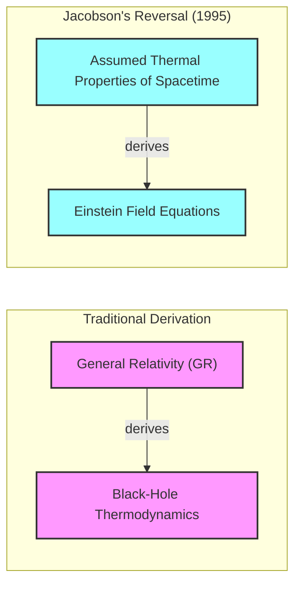
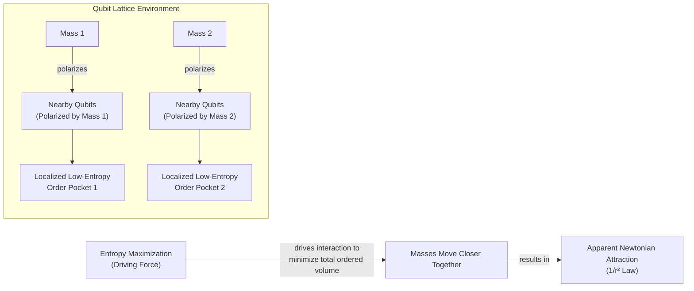
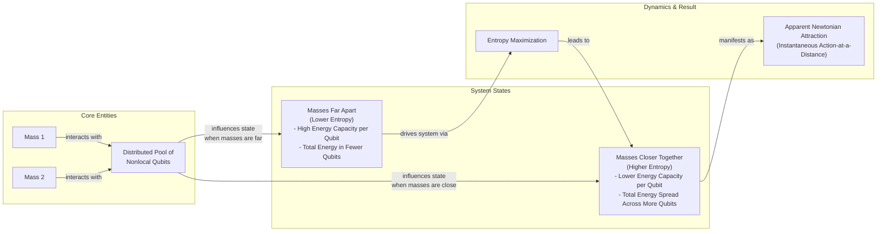

# Is Gravity an Illusion? A Look at Entropic Force Theories

Isaac Newton’s law of universal gravitation was a major achievement, yet he was never entirely happy with it. The idea of "action at a distance" deeply troubled him. In a 1692 letter, he wrote that the notion of one body acting upon another through a vacuum, without any mediating medium, was "so great an Absurdity that I believe no Man who has in philosophical Matters a competent Faculty of thinking can ever fall into it" [[1]](https://philosophy.stackexchange.com/questions/122488/what-are-the-historical-philosophical-arguments-for-and-against-action-at-a-dist). His discomfort was rooted in a mechanistic worldview where all interactions required physical contact. This spurred many of his contemporaries to devise mechanical "push" models, imagining that space was filled with invisible ether particles, corpuscular streams, or vortex pressures that physically pushed masses toward one another, creating the appearance of attraction.

Albert Einstein later provided a more profound explanation, describing gravity not as a force but as the curvature of spacetime. Objects simply follow the straightest possible path—a geodesic—through this curved geometry. This elegant picture eliminated the need for action at a distance. Yet, even Einstein's theory is incomplete. It breaks down at the center of black holes and the beginning of the universe, where curvature becomes infinite. These singularities are points where the theory loses its predictive power, signaling that general relativity is not the final word.

This brings us to a modern revival of the idea that gravity is not fundamental. A recent line of thinking, known as entropic gravity, proposes that the familiar pull between masses is a collective effect. It is an emergent phenomenon arising from the statistical behavior of microscopic components. As Daniel Carney of Lawrence Berkeley National Laboratory puts it, "There’s some kind of gas or some thermal system out there that we can’t see directly. But it’s randomly interacting with masses in some way, such that on average you see all the normal gravity things that you know about" [[2]](https://www.quantamagazine.org/is-gravity-just-entropy-rising-long-shot-idea-gets-another-look-20250613).

This project is one of many ways physicists have sought to understand gravity and spacetime as emerging from a deeper, microscopic reality. Carney’s work pegs this deeper physics to the principles of heat and disorder [[3]](https://arxiv.org/abs/2502.17575). It suggests gravity is an entropic force, resulting from the same universal tendency toward increasing entropy that governs everything from steam engines to refrigerators.

While entropic gravity is a minority view, it persists because it is difficult to dismiss entirely. Most importantly, it may be experimentally testable. These models predict subtle fluctuations that would not exist if gravity were a smooth, geometric property of spacetime. We will move from this historical dissatisfaction and swarm-like intuition to the concrete thermodynamic parallels discovered in general relativity that allow gravity to be derived from heat rather than postulated geometrically.

## A Force Emerges

The incompleteness of general relativity is most apparent at the singularities within black holes. Here, the theory's predictions for physical quantities like density and spacetime curvature become infinite, and it loses its predictive power. This breakdown strongly suggests that a more fundamental, microscopic theory is needed to describe what happens when gravity becomes overwhelmingly strong.

General relativity contains striking parallels to thermodynamics, even though not a single thermal concept went into its development. The four laws of black hole mechanics, derived from Einstein's equations, bear a formal resemblance to the laws of thermodynamics. For instance, the theory predicts that the surface area of a black hole’s event horizon can only ever increase, which mirrors the second law of thermodynamics, where entropy in a closed system always increases. When quantum mechanics is brought into the picture, the analogy becomes an identity.

Stephen Hawking showed that black holes are not truly black. They radiate energy as if they were hot objects, a phenomenon now known as Hawking radiation [[4]](https://en.wikipedia.org/wiki/Holographic_principle). The existence of temperature and radiation implies that black holes must possess entropy. Therefore, they must be composed of microscopic degrees of freedom whose statistical behavior gives rise to these thermal properties.

Physicists have pursued multiple paths to understand how spacetime might emerge from such microscopic components. The leading approach is the holographic principle, first proposed by Gerard 't Hooft and later given a precise interpretation by Leonard Susskind. It suggests that the description of a volume of space is encoded on a lower-dimensional boundary, much like a three-dimensional image is stored on a two-dimensional hologram [[4]](https://en.wikipedia.org/wiki/Holographic_principle). In this view, spacetime and gravity arise from the patterns and interactions of degrees of freedom living on this boundary.

Entropic gravity takes a related but distinct path. In a groundbreaking 1995 paper, theoretical physicist Ted Jacobson reversed the traditional logic [[5]](https://arxiv.org/abs/gr-qc/9504004). Instead of starting with Einstein's equations and deriving the laws of black hole thermodynamics, he started from the assumption that spacetime has fundamental thermal properties. By applying the thermodynamic relation δQ = TdS (heat equals temperature times change in entropy) to local Rindler horizons—causal boundaries seen by accelerating observers—he derived the Einstein field equations. This confirmed that the link between gravity and heat is more than just an analogy.


Image 1: A conceptual diagram illustrating Jacobson's 1995 reversal in the derivation of gravity, showing the traditional path from General Relativity to Black-Hole Thermodynamics, and Jacobson's reversed path from assumed thermal properties of spacetime to Einstein Field Equations.

As Carney states, "He turned black hole thermodynamics on its head. I’ve been mystified by this result for my entire adult life" [[2]](https://www.quantamagazine.org/is-gravity-just-entropy-rising-long-shot-idea-gets-another-look-20250613). Jacobson showed that Einstein's equations could be seen as an equation of state for spacetime itself. Having established the thermodynamic derivation that reframes gravity as an entropic force, we will now examine two concrete qubit-lattice implementations that operationalize this idea to reproduce Newtonian attraction through explicit entropy-maximizing mechanisms.

## Apparent Attraction

Inspired by Jacobson's thermodynamic approach, Daniel Carney and his co-authors recently put forward two concrete models demonstrating how gravitational attraction could arise from microscopic components [[3]](https://arxiv.org/abs/2502.17575).

The first model imagines space as a crystalline grid of quantum particles, or qubits. When a massive object is placed in this lattice, it influences the orientation of the qubits around it. "If you put a mass somewhere in the lattice, it causes all of the qubits nearby to get polarized — they all try to go in the same direction," Carney explains [[2]](https://www.quantamagazine.org/is-gravity-just-entropy-rising-long-shot-idea-gets-another-look-20250613). This polarization creates a small, localized "pocket of order" in an otherwise random system. High order means low entropy.


Image 2: Architecture diagram illustrating the first qubit-lattice model from Carney et al. 2025.

If two masses are present, they each create their own low-entropy pocket. The universe, however, has a fundamental tendency to maximize entropy. The most efficient way for the system to increase its overall disorder is to minimize the size of these ordered regions. Consequently, the qubits buffet the masses in a way that pushes them closer together, containing the orderliness within a smaller total volume. This collective action manifests as an attractive force. The model naturally yields an inverse-square law because the polarization effect falls off with distance, causing the entropic force, which is the gradient of the system's free energy, to reproduce the 1/r² behavior of Newtonian gravity [[3]](https://arxiv.org/abs/2502.17575).

The second model does away with the physical lattice to better capture the instantaneous, action-at-a-distance nature of Newtonian gravity. In this version, massive objects are still influenced by a collection of qubits, but these qubits are not localized and could be anywhere. The mechanism here relies on energy capacity. The distance between the masses determines how much energy each qubit can store.


Image 3: A conceptual system interaction diagram illustrating the second nonlocal-qubit model from Carney et al. 2025, showing the transition between states based on mass distance and the role of nonlocal qubits and entropy maximization.

When the masses are far apart, each qubit has a high energy capacity, so the total energy of the system can be stored in relatively few qubits. This corresponds to a state of lower entropy. As the masses move closer, the energy capacity of each qubit drops. To hold the same total energy, it must be spread across a larger number of qubits. This distribution across more microstates represents a higher entropy state. The system naturally evolves toward this higher entropy configuration, effectively pushing the masses together. In both models, the gravitational attraction we observe is not a fundamental force but an emergent phenomenon driven by the universe's relentless push toward maximum entropy. While these qubit constructions provide explicit mechanisms that recover Newtonian gravity from entropy maximization, they carry major limitations and ad-hoc elements that we must critically examine.

## Strengths and Weaknesses

While these models offer a proof of principle that gravity could emerge from statistical mechanics, they are not without major limitations. Carney himself cautions that both models are ad hoc [[3]](https://arxiv.org/abs/2502.17575). They require fine-tuning the interaction strengths between masses and qubits, and there is no independent evidence for the existence of these qubits. "It actually seems to require a peculiar engineered-looking interaction to get this to work," he admits [[2]](https://www.quantamagazine.org/is-gravity-just-entropy-rising-long-shot-idea-gets-another-look-20250613). The models are a demonstration of a possibility, not a realistic description of the universe. "The ontology of all of this is nebulous," Carney says [[2]](https://www.quantamagazine.org/is-gravity-just-entropy-rising-long-shot-idea-gets-another-look-20250613).

A major weakness is that the models only reproduce Newton's law of gravity, which is the weak-field limit of Einstein's theory. They do not yet account for the full curved spacetime of general relativity. Mark Van Raamsdonk, a physicist at the University of British Columbia, is skeptical, noting that the models lack qualities that make gravity special, like the feeling of weightlessness in free fall (the equivalence principle). This principle states that all objects fall at the same rate regardless of their mass or composition, a cornerstone of general relativity. It is unclear how a statistical force arising from qubit interactions would naturally enforce this universality. "Their construction doesn’t really have anything to do with gravity," he argues [[2]](https://www.quantamagazine.org/is-gravity-just-entropy-rising-long-shot-idea-gets-another-look-20250613).

Furthermore, the models focus on the one aspect of gravity that is already well understood. "The real challenge in gravitational physics is understanding its strong-coupling, strong-field regime," says Ramy Brustein, a theorist at Ben-Gurion University [[2]](https://www.quantamagazine.org/is-gravity-just-entropy-rising-long-shot-idea-gets-another-look-20250613). It is in the extreme environments of black holes and the early universe that gravity gets weird, and it is here that an entropic model would face its true test.

Proponents, however, offer a counter-view. Erik Verlinde of the University of Amsterdam, a pioneer of modern entropic gravity, suggests that the weak-field regime is precisely where we should look for evidence [[6]](https://www.youtube.com/watch?v=BVphTl_WGEY). If gravity is a statistical average, then we should expect tiny fluctuations around that average. "You have to go to very weak fields, because then these fluctuations might become observable," he says [[2]](https://www.quantamagazine.org/is-gravity-just-entropy-rising-long-shot-idea-gets-another-look-20250613). These fluctuations could provide a clear experimental signature to distinguish entropic gravity from the smooth, deterministic geometry of general relativity. These weaknesses notwithstanding, the entropic gravity picture makes distinctive predictions about quantum systems that open avenues for experimental tests, particularly when combined with ideas of objective wave-function collapse.

## Testing Entropic Gravity

Carney thinks the main benefit of the new models is that they "prompt conceptual questions about gravity and open up new experimental directions" [[2]](https://www.quantamagazine.org/is-gravity-just-entropy-rising-long-shot-idea-gets-another-look-20250613). One such direction involves a classic thought experiment: what happens if you place a massive object in a quantum superposition of two different locations? Does its gravitational field also split into a superposition, pulling things in two directions at once?

The entropic gravity models make a clear prediction. The underlying qubits would interact with the superposed mass and force it to "choose" a single, definite location. This happens because a classical configuration with one mass in one place creates a smaller, more localized pocket of low entropy than a quantum superposition of two masses. The system's tendency to maximize entropy would cause the superposition to collapse.

```mermaid
stateDiagram-v2
    direction LR
    [*] --> "Massive Body in Quantum Superposition<br/>(Location A + Location B)"

    "Massive Body in Quantum Superposition<br/>(Location A + Location B)" --> "Interactions with Underlying Qubits" : "Does Gravitational Field also Superpose?"

    "Interactions with Underlying Qubits" --> "Decoherence/Collapse"

    "Decoherence/Collapse" --> "Massive Body to Definite Position<br/>(Location A or Location B)"

    note right of "Decoherence/Collapse"
        "Mechanism: Entropy Maximization<br/>favors classical mass configuration"
    end

    note left of "Decoherence/Collapse"
        "Related to Objective Wave-Function<br/>Collapse Models"
    end
```
Image 4: A state diagram illustrating the thought experiment on quantum superposition collapse in the context of entropic gravity.

This idea connects directly to a class of theories known as objective-collapse models. These theories modify quantum mechanics by introducing a physical mechanism that causes wave function collapse, preventing macroscopic objects like Schrödinger's cat from existing in a superposition of states [[7]](https://postquantum.com/quantum-computing/wave-function-collapse), [[8]](https://pmc.ncbi.nlm.nih.gov/articles/PMC11305101). Some of the most prominent models, like the Diósi-Penrose model, propose that gravity itself is the cause of collapse [[9]](https://en.wikipedia.org/wiki/Objective-collapse_theory). Entropic gravity and objective collapse models predict similar testable consequences, such as an object's tendency to spontaneously collapse out of a superposition at a rate that depends on its mass.

This means that tabletop experiments already searching for signs of spontaneous collapse could also be used to test entropic gravity [[2]](https://www.quantamagazine.org/is-gravity-just-entropy-rising-long-shot-idea-gets-another-look-20250613). "The same experimental setups could, in principle, be used to test both," says Angelo Bassi of the University of Trieste, who leads such experimental efforts [[2]](https://www.quantamagazine.org/is-gravity-just-entropy-rising-long-shot-idea-gets-another-look-20250613).

Even with strong doubts, many physicists agree the approach is worth pursuing. "Since it hasn’t been established that actual gravity in our universe arises holographically, it’s certainly valuable to explore other mechanisms by which gravity might arise," says Van Raamsdonk [[2]](https://www.quantamagazine.org/is-gravity-just-entropy-rising-long-shot-idea-gets-another-look-20250613). If this long-shot theory proves correct, it would mean that gravity is not an immutable law of nature, but merely a statistical tendency.

## Conclusion

The idea that gravity might not be a fundamental force, but rather an emergent property of a deeper, statistical reality, is a profound departure from conventional physics. By framing gravity as an entropic force, it is seen as a macroscopic manifestation of the universe's tendency to maximize disorder. Theories like those proposed by Jacobson, Verlinde, and Carney challenge our most basic assumptions about the fabric of spacetime. While these models are still in their infancy and face major theoretical hurdles, their potential to be experimentally tested sets them apart from many other ideas in quantum gravity.

Ultimately, whether gravity is a fundamental law or a statistical illusion remains one of the deepest questions in science. Exploring these alternative paths, even if they are long shots, is essential. They force us to reconsider the relationship between the quantum and classical worlds, and in doing so, they may lead us to a more complete understanding of the universe.

## References

- [1] [Historical philosophical arguments for and against action at a distance](https://philosophy.stackexchange.com/questions/122488/what-are-the-historical-philosophical-arguments-for-and-against-action-at-a-dist)
- [2] [Is Gravity Just Entropy Rising? Long-Shot Idea Gets Another Look.](https://www.quantamagazine.org/is-gravity-just-entropy-rising-long-shot-idea-gets-another-look-20250613)
- [3] [Carney et al. 2025 Entropic Gravity Models](https://arxiv.org/abs/2502.17575)
- [4] [Holographic principle - Wikipedia](https://en.wikipedia.org/wiki/Holographic_principle)
- [5] [Thermodynamics of Spacetime: The Einstein Equation of State](https://arxiv.org/abs/gr-qc/9504004)
- [6] [Entropic Gravity from Quantum Entanglement! | with Professor Erik Verlinde](https://www.youtube.com/watch?v=BVphTl_WGEY)
- [7] [What is Wave Function Collapse?](https://postquantum.com/quantum-computing/wave-function-collapse)
- [8] [Gravitationally-induced wave function collapse time for molecules](https://pmc.ncbi.nlm.nih.gov/articles/PMC11305101)
- [9] [Objective-collapse theory - Wikipedia](https://en.wikipedia.org/wiki/Objective-collapse_theory)