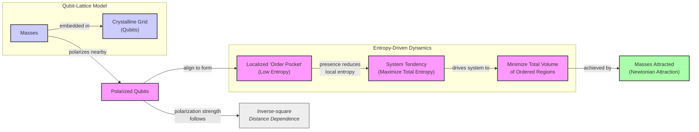
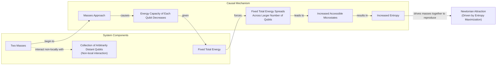
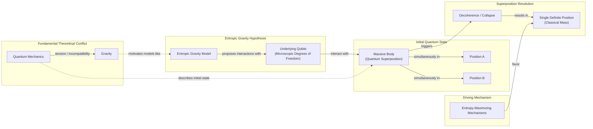

# Is Gravity Just a Statistical Illusion?

As an AI engineer, you learn to think in systems. You look for emergent properties that arise from complex interactions, rather than assuming every behavior is the result of a hard-coded, fundamental rule. This mindset—questioning assumptions and looking for deeper, simpler mechanisms—is not just for building AI. It is a powerful lens for understanding the world, even for a force as fundamental as gravity.

Isaac Newton gave the world the law of universal gravitation, yet he was never quite comfortable with it. He found the idea of "action at a distance" to be a profound absurdity. "That one body may act upon another at a distance thro' a Vacuum, without the Mediation of any thing else... is to me so great an Absurdity that I believe no Man who has in philosophical Matters a competent Faculty of thinking can ever fall into it," he wrote in a letter [[1]](https://philosophy.stackexchange.com/questions/122488/what-are-the-historical-philosophical-arguments-for-and-against-action-at-a-dist). For Newton, a purely mathematical law was incomplete without a mechanical explanation. This discomfort fueled a generation of theories where gravity was not a pull, but a push. These models invoked unseen particles or fluid pressures that physically shoved objects together, preserving a contact-only mechanistic universe [[2]](https://www.quantamagazine.org/is-gravity-just-entropy-rising-long-shot-idea-gets-another-look-20250613).

Albert Einstein provided a deeper explanation, recasting gravity as the curvature of spacetime. In this view, objects simply follow the straightest possible path through a geometry warped by mass and energy. This elegant solution eliminated the need for a mysterious force. Yet, this system also has its limits. Einstein’s theory of general relativity (GR) is incomplete. It predicts its own demise at the center of black holes, where curvature becomes infinite and the laws of physics break down. This is like an AI model hitting a catastrophic edge case—it signals that the underlying model cannot be the final word [[2]](https://www.quantamagazine.org/is-gravity-just-entropy-rising-long-shot-idea-gets-another-look-20250613).

A modern version of these ideas, known as entropic gravity, suggests that gravity is not a fundamental force but an emergent phenomenon—a statistical outcome of swarm behavior on a finer scale. A team of theoretical physicists led by Daniel Carney of Lawrence Berkeley National Laboratory recently proposed a model where gravity arises from the random jiggling of microscopic components [[2]](https://www.quantamagazine.org/is-gravity-just-entropy-rising-long-shot-idea-gets-another-look-20250613). “There’s some kind of gas or some thermal system out there that we can’t see directly,” Carney said. “But it’s randomly interacting with masses in some way, such that on average you see all the normal gravity things that you know about: The Earth orbits the sun, and so forth” [[2]](https://www.quantamagazine.org/is-gravity-just-entropy-rising-long-shot-idea-gets-another-look-20250613).

This project is one of many ways physicists have sought to understand gravity and spacetime as emerging from deeper physics. Carney’s work frames this deeper physics in terms of thermodynamics, suggesting gravity is a consequence of the universe’s tendency to maximize entropy, or disorder [[2]](https://www.quantamagazine.org/is-gravity-just-entropy-rising-long-shot-idea-gets-another-look-20250613). Though entropic gravity is a minority view, it persists because even its detractors are hesitant to dismiss it entirely. It also has the rare virtue of being experimentally testable, offering a path to see if gravity is an immutable law or just a very persistent statistical trend [[2]](https://www.quantamagazine.org/is-gravity-just-entropy-rising-long-shot-idea-gets-another-look-20250613). These ideas force you to question your fundamental assumptions, much like you do when designing complex AI systems.

## A Force Emerges

Einstein's theory of general relativity (GR) is remarkable, but it also reveals its own incompleteness. GR predicts that stars collapse into black holes, at the center of which gravity becomes infinitely strong. There, the fabric of spacetime tears open, and the theory can no longer say what happens next. This breakdown at singularities indicates that a deeper, microscopic description is needed to complete our understanding of gravity, much like how understanding the individual weights and biases in a neural network is necessary to fully explain its emergent behavior [[2]](https://www.quantamagazine.org/is-gravity-just-entropy-rising-long-shot-idea-gets-another-look-20250613).

Furthermore, GR has uncanny parallels to thermodynamics, even though not a single thermal concept went into its development. The theory predicts that the surface area of a black hole’s event horizon can only increase, an irreversibility characteristic of the second law of thermodynamics, where entropy, a measure of disorder, always grows [[2]](https://www.quantamagazine.org/is-gravity-just-entropy-rising-long-shot-idea-gets-another-look-20250613). This suggests a deep connection between the geometry of spacetime and the statistical mechanics of some underlying components.

When physicists applied quantum mechanics to the distorted spacetime around a black hole, they found that black holes radiate energy like any hot body [[3]](https://en.wikipedia.org/wiki/Holographic_principle). Because heat is the random motion of particles, these thermal effects strongly suggest that spacetime itself consists of some kind of microscopic components or "atoms of space." The statistical behavior of these hidden degrees of freedom would give rise to the thermal properties we observe, much like the collective behavior of billions of simple parameters in an LLM gives rise to complex reasoning abilities [[2]](https://www.quantamagazine.org/is-gravity-just-entropy-rising-long-shot-idea-gets-another-look-20250613).

Physicists have pursued multiple paths to understand how spacetime emerges from these components. The leading approach is the holographic principle, which states that the description of a volume of space can be encoded on a lower-dimensional boundary, much like a 3D hologram is projected from a 2D surface. In this view, gravity arises organically as part of this holographic projection [[3]](https://en.wikipedia.org/wiki/Holographic_principle), [[2]](https://www.quantamagazine.org/is-gravity-just-entropy-rising-long-shot-idea-gets-another-look-20250613), [[4]](https://plus.maths.org/quantum-gravity-can-holographic-principle).

Entropic gravity, first introduced in a 1995 paper by Ted Jacobson, takes a different path [[5]](https://arxiv.org/abs/gr-qc/9504004). Instead of starting with Einstein's theory and deriving its heat-like consequences, Jacobson reversed the logic. He started from the assumption that spacetime has thermal properties and used the fundamental thermodynamic relation `δQ = T dS` (where heat, temperature, and entropy are related) to derive the equations of GR [[6]](https://krishnamohan-parattu.weebly.com/uploads/6/4/3/1/64317995/einstein-eq-and-thermodyn.pdf), [[2]](https://www.quantamagazine.org/is-gravity-just-entropy-rising-long-shot-idea-gets-another-look-20250613). This confirmed that the parallels between gravity and heat are deeply significant [[5]](https://arxiv.org/abs/gr-qc/9504004).

The idea gained further traction in 2010 when physicist Erik Verlinde proposed a model that explicitly linked gravity to information theory. Verlinde’s theory of entropic gravity combines the thermodynamic approach with the holographic principle, suggesting that gravity emerges from the quantum entanglement of microscopic bits of spacetime information. While Jacobson derived Einstein's equations from thermodynamics, Verlinde offered a conceptual framework where gravity is a consequence of "information associated with the positions of material bodies" [[7]](https://arxiv.org/abs/1001.0785).

Jacobson’s work reframed the Einstein equation as an equation of state for spacetime itself [[5]](https://arxiv.org/abs/gr-qc/9504004). As Daniel Carney put it, “He turned black hole thermodynamics on its head. I’ve been mystified by this result for my entire adult life” [[2]](https://www.quantamagazine.org/is-gravity-just-entropy-rising-long-shot-idea-gets-another-look-20250613). Having established this thermodynamic foundation, you can now examine concrete models that build on this idea to reproduce Newtonian attraction from entropy-maximizing mechanisms.

## Apparent Attraction

Inspired by Jacobson's approach, Carney and his co-authors put forward two models demonstrating how gravitational attraction could arise from microscopic components [[8]](https://arxiv.org/abs/2502.17575).

The first model imagines space as a crystalline grid of quantum particles, or qubits. When a massive object is placed in this lattice, it causes the nearby qubits to align. “If you put a mass somewhere in the lattice, it causes all of the qubits nearby to get polarized—they all try to go in the same direction,” Carney explained [[2]](https://www.quantamagazine.org/is-gravity-just-entropy-rising-long-shot-idea-gets-another-look-20250613). This alignment creates a localized "order pocket," a region of low entropy in an otherwise random system [[8]](https://arxiv.org/abs/2502.17575). If you introduce a second mass, it creates another such pocket. The system’s natural tendency is to maximize its total entropy. To do this, it pushes the masses closer together, minimizing the total volume of these orderly, low-entropy regions. The apparent attraction between the two masses is just an emergent effect of the system trying to contain the disorder to a smaller area [[2]](https://www.quantamagazine.org/is-gravity-just-entropy-rising-long-shot-idea-gets-another-look-20250613). This mechanism naturally produces an attractive force that diminishes with the square of the distance. The polarization effect falls off with distance, causing the entropic force to reproduce the Newtonian 1/r² law as a direct statistical outcome [[8]](https://arxiv.org/abs/2502.17575).

Image 1: Diagram illustrating the mechanism of Newtonian attraction in a qubit-lattice model via entropy maximization.

The second model does away with the grid, instead proposing that massive objects interact with a collection of qubits that could be far away. This is intended to capture the non-local character of Newtonian gravity, where every object in the universe acts on every other object instantaneously [[8]](https://arxiv.org/abs/2502.17575). In this setup, the energy capacity of each qubit depends on the distance between the masses. When the masses are far apart, each qubit can store a lot of energy, so the system's total energy can be contained in just a few qubits. However, as the masses get closer, the energy capacity of each qubit drops. This forces the total energy to be spread across more qubits. Spreading the energy over more qubits increases the number of accessible microscopic states, which corresponds to a higher entropy. Therefore, the system's tendency to maximize entropy again pushes the masses together [[2]](https://www.quantamagazine.org/is-gravity-just-entropy-rising-long-shot-idea-gets-another-look-20250613).

Image 2: Diagram illustrating the second nonlocal-qubit model from Carney et al. 2025, showing how approaching masses lead to decreased qubit energy capacity, spreading of fixed total energy, increased microstates and entropy, ultimately driving Newtonian attraction.

In both models, the gravitational attraction you observe is not a fundamental force. It is a side effect, a macroscopic illusion created by the collective behavior of underlying microscopic degrees of freedom as they arrange themselves to maximize entropy. The authors note that the specific choice of qubits is for concreteness, and the underlying mechanism is more general. An analogous model where the qubits are replaced by harmonic oscillators can also produce an emergent gravitational force, suggesting that the qualitative results are not tied to one specific type of microscopic component [[8]](https://arxiv.org/abs/2502.17575). While these constructions provide explicit mechanisms for this emergence, they come with their own set of limitations and assumptions that need to be critically examined.

## Strengths and Weaknesses

Carney himself cautioned that both models are built on assumptions. They require fine-tuning the strength of the interaction between masses and qubits, and there is no independent evidence for the existence of these qubits or their specific properties. “It actually seems to require a peculiar engineered-looking interaction to get this to work,” he admitted [[2]](https://www.quantamagazine.org/is-gravity-just-entropy-rising-long-shot-idea-gets-another-look-20250613). The models are intended as a proof of principle—a demonstration that swarm behavior *can* explain gravity—rather than a realistic description of the universe. As Carney said, the underlying nature of these components is "nebulous" [[2]](https://www.quantamagazine.org/is-gravity-just-entropy-rising-long-shot-idea-gets-another-look-20250613). This is similar to building a prototype AI agent that works for a demo but isn't robust enough for production; the core mechanism is there, but the engineering is not yet complete.

A significant limitation is that the models only reproduce Newton's law of gravity, which is the weak-field limit of Einstein's theory. They do not recover the full curved spacetime of GR. Extending beyond this linear approximation is a major theoretical hurdle. In high-energy regimes, GR predicts phenomena like gravitomagnetic fields, which in some models do not obey causal evolution equations [[9]](https://web.mit.edu/edbert/GR/gr6.pdf). Furthermore, any attempt to describe gravity at the smallest scales must confront the breakdown of quantum field theory at the Planck scale, where a full theory of quantum gravity is required [[10]](https://link.springer.com/article/10.1007/s11229-024-04734-5).

Mark Van Raamsdonk, a physicist at the University of British Columbia, is doubtful the models truly capture the essence of gravity. He notes that they lack key features, such as the equivalence principle—the fact that you feel no gravitational force when in free fall. “Their construction doesn’t really have anything to do with gravity,” he said [[2]](https://www.quantamagazine.org/is-gravity-just-entropy-rising-long-shot-idea-gets-another-look-20250613).

Furthermore, the models focus on the one aspect of gravity that is already well understood. The real puzzles lie where gravity gets strong, as inside black holes, and the current entropic models have little to say about this regime. “The real challenge in gravitational physics is understanding its strong-coupling, strong-field regime,” said Ramy Brustein, a theorist at Ben-Gurion University [[2]](https://www.quantamagazine.org/is-gravity-just-entropy-rising-long-shot-idea-gets-another-look-20250613). This is analogous to testing an AI model only on benchmark datasets; the real test comes from its performance on complex, real-world problems where it is most likely to fail.

However, proponents of entropic gravity argue that the weak-field regime is precisely where the theory might be testable. If gravity is a collective statistical effect, it should exhibit fluctuations around its average behavior. These tiny random variations would be most apparent where the gravitational field is weak. “You have to go to very weak fields, because then these fluctuations might become observable,” said Erik Verlinde of the University of Amsterdam, a key figure in the development of entropic gravity [[2]](https://www.quantamagazine.org/is-gravity-just-entropy-rising-long-shot-idea-gets-another-look-20250613). Such noise would distinguish it from the smooth, deterministic geometry of GR.

## Testing Entropic Gravity

Carney thinks the main benefit of the new models is that they prompt conceptual questions about gravity and open up new experimental directions [[2]](https://www.quantamagazine.org/is-gravity-just-entropy-rising-long-shot-idea-gets-another-look-20250613). One such question arises from a thought experiment: if a massive body is placed in a quantum superposition of two different locations, what happens to its gravitational field? Does the field also enter a superposition, pulling on other objects in two directions at once? This scenario highlights the tension between quantum mechanics and gravity [[11]](https://postquantum.com/quantum-computing/wave-function-collapse).

The new entropic gravity models predict that the underlying qubits will interact with the massive body and force it to "choose" a single, definite location [[2]](https://www.quantamagazine.org/is-gravity-just-entropy-rising-long-shot-idea-gets-another-look-20250613). The system's tendency to maximize entropy favors a classical state, effectively causing the object’s wave function to collapse. This prediction links entropic gravity to objective-collapse theories, which modify quantum mechanics by positing that collapse is a real, physical process [[12]](https://en.wikipedia.org/wiki/Objective-collapse_theory). Unlike standard environmental decoherence, which is reversible, these models propose a new, irreversible physical mechanism [[13]](https://pmc.ncbi.nlm.nih.gov/articles/PMC11305101). Some proposals, notably from Roger Penrose, suggest gravity itself triggers this collapse, creating similar testable consequences [[11]](https://postquantum.com/quantum-computing/wave-function-collapse).

Image 3: A diagram illustrating the thought experiment of a massive body in quantum superposition and its resolution via the entropic gravity model.

This means that tabletop experiments designed to look for spontaneous collapse could also be used to test entropic gravity. "The same experimental setups could, in principle, be used to test both," said Angelo Bassi of the University of Trieste, who has led efforts to perform such experiments [[2]](https://www.quantamagazine.org/is-gravity-just-entropy-rising-long-shot-idea-gets-another-look-20250613).

Even with doubts, exploring these alternative ideas is valuable. “Since it hasn’t been established that actual gravity in our universe arises holographically, it’s certainly valuable to explore other mechanisms by which gravity might arise,” said Van Raamsdonk [[2]](https://www.quantamagazine.org/is-gravity-just-entropy-rising-long-shot-idea-gets-another-look-20250613). If this long-shot theory proves correct, it would reframe our understanding of the universe. Gravity would no longer be an immutable law of nature, but merely a statistical tendency.

## Conclusion

The idea that gravity might be an emergent, statistical phenomenon rather than a fundamental force is a powerful one. It challenges you to look beyond established laws and consider the underlying systems that might give rise to them. This is the same mindset required in AI engineering, where you often work with complex, emergent behaviors that arise from simple, underlying rules.

Whether entropic gravity proves to be a correct description of nature or not, its value lies in the questions it forces you to ask. It pushes the boundaries of what is testable and encourages a systems-thinking approach to even the most fundamental aspects of our universe. As you continue to build and ship AI products, remember that the most profound insights often come from questioning the "fundamental" and looking for the emergent.

## References

- [1] What are the historical-philosophical arguments for and against action at a distance? (https://philosophy.stackexchange.com/questions/122488/what-are-the-historical-philosophical-arguments-for-and-against-action-at-a-dist)
- [2] Is Gravity Just Entropy Rising? Long-Shot Idea Gets Another Look. (https://www.quantamagazine.org/is-gravity-just-entropy-rising-long-shot-idea-gets-another-look-20250613)
- [3] Holographic principle - Wikipedia (https://en.wikipedia.org/wiki/Holographic_principle)
- [4] Quantum gravity: is the holographic principle the theory of everything? (https://plus.maths.org/quantum-gravity-can-holographic-principle)
- [5] Thermodynamics of Spacetime: The Einstein Equation of State (https://arxiv.org/abs/gr-qc/9504004)
- [6] Einstein Equations from/as Thermodynamics of Spacetime (https://krishnamohan-parattu.weebly.com/uploads/6/4/3/1/64317995/einstein-eq-and-thermodyn.pdf)
- [7] On the Origin of Gravity and the Laws of Newton (https://arxiv.org/abs/1001.0785)
- [8] On the quantum mechanics of entropic forces (https://arxiv.org/abs/2502.17575)
- [9] Lecture 6: Gravitomagnetism (https://web.mit.edu/edbert/GR/gr6.pdf)
- [10] Emergence and the limits of effective field theory (https://link.springer.com/article/10.1007/s11229-024-04734-5)
- [11] What is Wave Function Collapse? (https://postquantum.com/quantum-computing/wave-function-collapse)
- [12] Objective-collapse theory - Wikipedia (https://en.wikipedia.org/wiki/Objective-collapse_theory)
- [13] Gravity-induced wave function collapse may be inconsistent with the Born rule (https://pmc.ncbi.nlm.nih.gov/articles/PMC11305101)