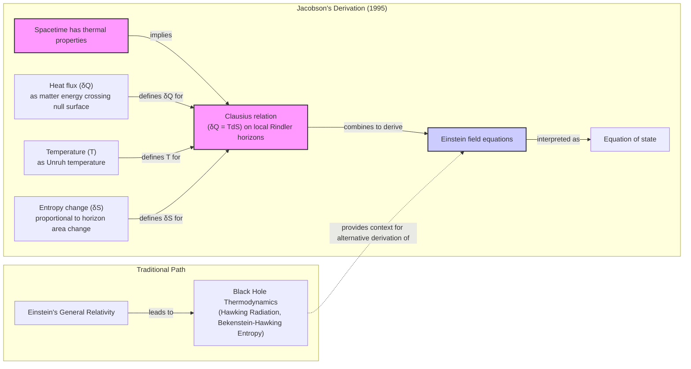
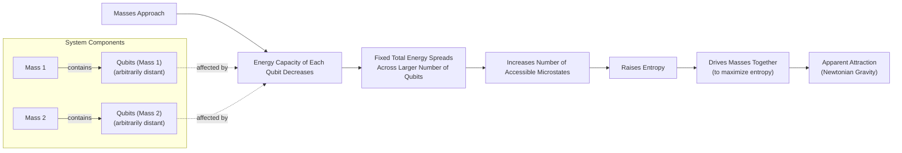

# Is Gravity an Illusion?

https://i.imgur.com/G5gE3jX.jpeg 
Image 1: The laws of physics, like gravity, might emerge from a deeper, more complex reality, much like a wave is a macroscopic behavior of countless water molecules. (Source: https://i.imgur.com/G5gE3jX.jpeg)

Isaac Newton gave us the mathematical laws of gravity, but he was deeply troubled by the concept of action-at-a-distance. He found it absurd that one body could affect another across a vacuum "without the Mediation of any thing else." In a 1692 letter to Richard Bentley, he elaborated on this discomfort, stating, "That Gravity should be innate, inherent and essential to Matter, so that one body may act upon another at a distance thro' a Vacuum... is to me so great an Absurdity that I believe no Man who has in philosophical Matters a competent Faculty of thinking can ever fall into it" [[1]](https://philosophy.stackexchange.com/questions/122488/what-are-the-historical-philosophical-arguments-for-and-against-action-at-a-dist). This philosophical dissatisfaction spurred centuries of attempts to find a mechanical explanation. Many of his contemporaries proposed "push" models, imagining that space was filled with unseen particles, corpuscular streams, or vortex pressures that bombarded objects from all sides. This created a net force that pushed them together and gave the appearance of attraction, preserving a mechanistic universe where all interactions required contact.

Einstein’s general relativity provided a more profound explanation, replacing a mysterious force with the curvature of spacetime. Matter tells spacetime how to curve, and spacetime tells matter how to move. This elegant picture solved the problem of action-at-a-distance. However, it too is incomplete. At the heart of black holes and the dawn of the universe, the theory predicts singularities where curvature becomes infinite and the laws of physics break down, signaling that a deeper theory is needed.

A radical modern idea, known as entropic gravity, proposes that gravity isn't a fundamental force at all. Instead, it might be an emergent phenomenon, a statistical consequence of a hidden microscopic world's tendency toward disorder. As physicist Daniel Carney puts it, there might be "some kind of gas or some thermal system out there that we can’t see directly... but it’s randomly interacting with masses in some way, such that on average you see all the normal gravity things that you know about" [[2]](https://www.quantamagazine.org/is-gravity-just-entropy-rising-long-shot-idea-gets-another-look-20250613). This approach models the deeper physics "as the physics of heat and entropy" [[3]](https://arxiv.org/abs/2502.17575).

This view is part of a broader effort to understand spacetime itself as emerging from something more fundamental. While the entropic approach is a minority view, it persists because it opens the door to new experimental tests. If gravity is statistical, it might fluctuate, producing tiny, observable deviations from the smooth, predictable curvature of Einstein's theory. Detractors are loath to dismiss it entirely because of this potential for testability, which could distinguish a statistical tendency from an immutable law.

This historical dissatisfaction with action-at-a-distance has led us to a point where we can question the very nature of gravity. To understand the modern entropic view, we first need to look at the unexpected thermodynamic parallels discovered within general relativity itself.

## A Force Emerges

https://i.imgur.com/g8u2u6v.jpeg 
Image 2: Isaac Newton, whose laws of gravitation were revolutionary but left him philosophically unsatisfied with the concept of action-at-a-distance. (Source: https://i.imgur.com/g8u2u6v.jpeg)

General relativity’s failure at singularities is a clear sign that it is an effective theory, not a final one. This reflects a broader principle in complexity science. The success of reductionism in physics, breaking systems down to their fundamental particles and laws, does not imply an ability to reconstruct the universe from those laws alone [[4]](https://arxiv.org/html/2507.04951v4). As physicist Philip Anderson famously stated, "more is different." New laws and properties emerge at different scales of complexity. Even a complete "Theory of Everything" unifying quantum mechanics and gravity would be insufficient to explain emergent phenomena, because macroscopic behavior is often insensitive to the fine details of the underlying microscopic rules [[4]](https://arxiv.org/html/2507.04951v4). Understanding emergence requires concepts like coarse-graining, where microscopic details are systematically discarded to reveal a simpler, predictive macroscopic theory.

The first clues that gravity might be such an emergent phenomenon came from black holes. Despite being a purely geometric theory, general relativity contains bizarre parallels to thermodynamics. The area of a black hole’s event horizon never decreases, much like entropy in a closed system always increases, as dictated by the second law of thermodynamics. When quantum mechanics entered the picture, Stephen Hawking discovered that black holes are not truly black. They radiate heat and have a temperature, cementing the link between gravity and thermodynamics [[5]](https://arxiv.org/abs/gr-qc/9504004). The existence of temperature implies a statistical underpinning. There must be microscopic constituents whose collective behavior gives rise to these thermal properties.

This has led to multiple approaches for understanding how spacetime emerges. The dominant theory is the holographic principle, first proposed by Gerard 't Hooft and later given a precise string-theoretic interpretation by Leonard Susskind. It suggests that the description of a volume of space is encoded on a lower-dimensional boundary, like a hologram [[6]](https://en.wikipedia.org/wiki/Holographic_principle). In this view, the universe we experience, including gravity, is a projection of information stored on a distant surface [[7]](https://plus.maths.org/quantum-gravity-can-holographic-principle).

However, an alternative path exists. In 1995, physicist Ted Jacobson flipped the logic of black hole thermodynamics on its head. Instead of deriving thermal properties from the laws of gravity, he started with the assumption that spacetime itself has thermodynamic properties. He demanded that the fundamental relation connecting heat, temperature, and entropy (δQ = TdS) holds for all local observers in spacetime. He defined the heat flux (δQ) as the flow of matter-energy across a local null surface, the temperature (T) as the Unruh temperature an accelerated observer would detect, and the change in entropy (dS) as being proportional to the change in the horizon's area. From these assumptions alone, he derived the entirety of Einstein's field equations [[8]](https://krishnamohan-parattu.weebly.com/uploads/6/4/3/1/64317995/einstein-eq-and-thermodyn.pdf), [[5]](https://arxiv.org/abs/gr-qc/9504004), [[9]](https://diposit.ub.edu/bitstreams/3a349666-d2a4-4667-a191-efffc065905c/download).


Image 3: A flowchart illustrating Ted Jacobson's 1995 derivation of Einstein's field equations from thermodynamic principles, contrasted with the traditional path.

This result was a powerful confirmation that the link between gravity and heat is not just an analogy. It suggests that gravity is a kind of equation of state for spacetime, much like the ideal gas law is an equation of state for a gas [[10]](https://inspirehep.net/literature/394001). As Carney notes, "He turned black hole thermodynamics on its head. I’ve been mystified by this result for my entire adult life" [[2]](https://www.quantamagazine.org/is-gravity-just-entropy-rising-long-shot-idea-gets-another-look-20250613).

Having established this deep thermodynamic connection, we can now examine concrete models that build on this idea to reproduce Newtonian attraction through explicit entropy-maximizing mechanisms.

## Apparent Attraction

Inspired by Jacobson's thermodynamic approach, Carney and his collaborators recently proposed two models that generate gravity from the behavior of microscopic quantum bits, or qubits [[3]](https://arxiv.org/abs/2502.17575). These models provide a concrete, though simplified, picture of how an apparent attractive force can emerge from statistical tendencies. The idea of an entropic force is common in soft matter physics. The elasticity of a polymer, for instance, arises not from a microscopic attraction but from the statistical tendency of the chain to adopt a high-entropy, disordered coil. Stretching it reduces entropy, creating a restorative force [[11]](https://pure.uva.nl/ws/files/1162156/105001_357036.pdf).

The first model imagines space as a crystalline grid of qubits, each with an orientation like a tiny compass needle. When a massive object is placed in this lattice, it influences the qubits around it. "If you put a mass somewhere in the lattice, it causes all of the qubits nearby to get polarized—they all try to go in the same direction," Carney explains [[2]](https://www.quantamagazine.org/is-gravity-just-entropy-rising-long-shot-idea-gets-another-look-20250613). This alignment creates a small pocket of order in an otherwise random system [[27]](https://link.aps.org/doi/10.1103/y7sy-3by1).

High order means low entropy. The universe, however, has a relentless tendency to maximize entropy. To confine this pocket of order to the smallest possible region, the system pushes the masses together. This squashing effect appears to us as gravitational attraction. Minimizing the volume of the ordered region is the most efficient way for the system to increase its overall entropy. Remarkably, this mechanism naturally reproduces Newton's inverse-square law, as the polarization effect weakens with distance [[3]](https://arxiv.org/abs/2502.17575), [[2]](https://www.quantamagazine.org/is-gravity-just-entropy-rising-long-shot-idea-gets-another-look-20250613).

```mermaid
flowchart LR
    A["3D Qubit Lattice<br/>(with oriented qubits)"]
    B["Two Masses<br/>(embedded within lattice)"]
    
    A -- "contains" --> B

    B -- "polarize nearby qubits" --> C["Localized Low-Entropy<br/>Order Pockets"]

    D["High Order = Low Entropy"]
    
    C -- "implies" --> D

    E["System's Natural Tendency<br/>to Maximize Entropy"]
    
    D -. "informs" .-> E

    E -- "drives" --> F["Masses Move Closer Together"]

    F -- "by minimizing" --> G["Total Volume of<br/>Ordered Regions"]

    G -- "results in" --> H["Apparent Attraction"]

    H -- "reproduces" --> I["Newtonian 1/r² Law"]

    %% Visual differentiation for principles
    classDef principle stroke-dasharray: 5 5
    class D,E principle
```


Image 4: A diagram illustrating the first qubit-lattice model from Carney et al. 2025, showing how masses polarize qubits, leading to an apparent attraction driven by entropy maximization.

The second model does away with the local lattice, better capturing the instantaneous "action-at-a-distance" feel of Newtonian gravity. In this version, qubits can be arbitrarily far from one another. The mechanism here relies on a change in the energy capacity of the qubits. As two masses get closer, the amount of energy each qubit can hold decreases. With the total energy of the system remaining fixed, it must be distributed across a larger number of qubits. This spreading of energy increases the number of available microscopic arrangements, thereby raising the system's total entropy. The drive to maximize this entropy pulls the masses together [[3]](https://arxiv.org/abs/2502.17575).

This connects directly to the concept of informational entropy. In statistical mechanics, entropy is a measure of missing information or the number of accessible microscopic states consistent with a macroscopic state. By forcing energy to be spread over more qubits, the system can be arranged in more ways. This combinatorial explosion of possibilities increases the Gibbs-Shannon entropy and makes that configuration statistically favorable [[12]](https://scholarsarchive.library.albany.edu/cgi/viewcontent.cgi?article=1069&context=etd).


Image 5: Conceptual diagram of the second nonlocal-qubit model, illustrating how approaching masses lead to increased entropy and apparent gravitational attraction.

In both scenarios, the gravitational force we perceive is not fundamental. It is an emergent effect, an epiphenomenon driven by the statistical mechanics of a hidden layer of reality. While these qubit constructions provide explicit mechanisms that recover Newtonian gravity, they come with significant limitations that must be examined.

## Strengths and Weaknesses

https://i.imgur.com/2s4A3sO.jpeg 
Image 6: Researchers like (from top left, clockwise) Sabrina Pasterski, Andrew Strominger, Juan Maldacena, and Erik Verlinde are exploring different facets of emergent gravity and holography. (Source: https://i.imgur.com/2s4A3sO.jpeg)

While Carney's models offer a compelling "proof-of-concept," they are far from a complete theory of gravity [[3]](https://arxiv.org/abs/2502.17575). A major weakness is their ad-hoc nature. The models require specific, fine-tuned values for the coupling strength between masses and qubits, as well as for parameters like lattice spacing. These values are chosen to make the model work. They are not derived from a more fundamental theory. This feels less like a fundamental principle of nature and more like a carefully engineered system designed to produce a known result.

Deeper mathematical issues may exist at the foundation of the thermodynamic approach. A 2016 analysis by Sean Carroll and Grant Remmen pointed out a potential inconsistency in Jacobson's original 1995 derivation. They argue that a self-consistent definition of entropy on the null surfaces used in the model leads to a value for Newton's constant in the derived Einstein's equations that conflicts with the value required by the Bekenstein-Hawking area-entropy formula, which motivated the theory in the first place [[13]](https://arxiv.org/pdf/1601.07558).

Furthermore, the models only reproduce the Newtonian weak-field limit of gravity. They do not yet describe the curved spacetime of general relativity, leaving it unclear if the entropic picture can extend beyond simple, linear approximations. The biggest challenge for entropic gravity is explaining the equivalence principle. This is the observation that all objects fall at the same rate regardless of their mass or composition. As physicist Mark Van Raamsdonk notes, the models lack the qualities that make gravity special, such as the weightlessness experienced in free-fall. "Their construction doesn’t really have anything to do with gravity," he argues [[2]](https://www.quantamagazine.org/is-gravity-just-entropy-rising-long-shot-idea-gets-another-look-20250613). It is unclear why the "pressure" from this qubit sea would be universally proportional to an object's inertial mass, rather than depending on its size, shape, or composition.

The models currently focus on the weak-field regime, an area of physics that is already understood with incredible precision. The real test lies in the strong-field environments of black holes, where singularities and the information paradox present the deepest puzzles. "The real challenge in gravitational physics is understanding its strong-coupling, strong-field regime," says theorist Ramy Brustein [[2]](https://www.quantamagazine.org/is-gravity-just-entropy-rising-long-shot-idea-gets-another-look-20250613). It is in these extreme regimes that an entropic theory might be truly confirmed or falsified.

However, there is a counter-view. If gravity is indeed statistical, the weak-field regime might be precisely where we could detect its nature. As Erik Verlinde, a key proponent of entropic gravity, argues, "You have to go to very weak fields, because then these fluctuations might become observable" [[2]](https://www.quantamagazine.org/is-gravity-just-entropy-rising-long-shot-idea-gets-another-look-20250613). A statistical force would not be perfectly smooth; it should exhibit tiny fluctuations or stochastic noise. Just as the discrete nature of water molecules is invisible in a tidal wave but causes Brownian motion for a tiny pollen grain, the statistical nature of gravity might only reveal itself through subtle noise in weak-field experiments.

Despite their weaknesses, these entropic models make distinctive predictions about the behavior of quantum systems, creating exciting new avenues for experimental verification.

## Testing Entropic Gravity

The primary benefit of these new models, as Carney emphasizes, is that they "prompt conceptual questions about gravity and open up new experimental directions" [[2]](https://www.quantamagazine.org/is-gravity-just-entropy-rising-long-shot-idea-gets-another-look-20250613). They make concrete predictions that distinguish them from standard quantum gravity, where gravity is mediated by gravitons [[3]](https://arxiv.org/abs/2502.17575).

Consider a thought experiment where a massive object is placed in a quantum superposition, existing in two locations at once. A key question in physics is whether the gravitational field created by this object also enters a superposition. Entropic gravity offers a clear prediction. The underlying sea of qubits, driven by entropy maximization, would inherently favor a single, definite classical state for the mass. Interaction with this qubit bath would quickly destroy the superposition, causing it to "decohere" or collapse into one of the two possible locations [[3]](https://arxiv.org/abs/2502.17575).

```mermaid
stateDiagram-v2
    [*] --> "Massive body in quantum superposition<br/>(|L> + |R>)"
    "Massive body in quantum superposition<br/>(|L> + |R>)" --> "Gravitational field in superposition"
    "Gravitational field in superposition" --> "Underlying qubits<br/>(entropic gravity model)" : "interacts with"
    "Underlying qubits<br/>(entropic gravity model)" --> "Entropy-maximizing mechanisms" : "activates"
    "Entropy-maximizing mechanisms" --> "Decohere or collapse toward a definite position" : "causes"
    "Decohere or collapse toward a definite position" --> "Single classical mass configuration"
    "Single classical mass configuration" --> [*]
```
Image 7: State transition diagram of a massive body in quantum superposition and its collapse due to entropic gravity.

This prediction connects entropic gravity to "objective collapse" models. These theories modify the Schrödinger equation, proposing that wave function collapse is a real physical process. One of the most notable versions is the Diósi-Penrose model, which suggests that gravity itself is the culprit that causes collapse. A superposition of a mass in two different locations would create a superposition of two different spacetime curvatures, a state Penrose argued is unstable and would spontaneously collapse. Both entropic gravity and objective collapse models predict that larger masses should decohere faster, a signature that could be sought in tabletop experiments [[14]](https://postquantum.com/quantum-computing/wave-function-collapse), [[15]](https://pmc.ncbi.nlm.nih.gov/articles/PMC11305101), [[16]](https://en.wikipedia.org/wiki/Objective-collapse_theory).

Experiments using matter-wave interferometry with large molecules are already pushing the boundaries, seeking to detect any loss of coherence beyond what standard environmental effects would predict. So far, these experiments have found no evidence for spontaneous collapse, placing tight constraints on the simplest versions of these models. However, the search continues, and these same experiments could simultaneously constrain or falsify entropic gravity models [[17]](https://www.youtube.com/watch?v=yPvRQ5nyKZY).

Even if the holographic principle remains the leading candidate for a theory of quantum gravity, exploring long-shot alternatives like entropic gravity is valuable. As Mark Van Raamsdonk concedes, "Since it hasn’t been established that actual gravity in our universe arises holographically, it’s certainly valuable to explore other mechanisms by which gravity might arise" [[2]](https://www.quantamagazine.org/is-gravity-just-entropy-rising-long-shot-idea-gets-another-look-20250613). It forces us to confront deep questions about emergence and randomness. It suggests that gravity may not be an immutable law of nature, but rather a statistical tendency—an illusion born from the chaotic dance of a hidden microscopic world.

## References

- [1] [What are the historical-philosophical arguments for and against action-at-a-distance?](https://philosophy.stackexchange.com/questions/122488/what-are-the-historical-philosophical-arguments-for-and-against-action-at-a-dist)
- [2] [Is Gravity Just Entropy Rising? Long-Shot Idea Gets Another Look.](https://www.quantamagazine.org/is-gravity-just-entropy-rising-long-shot-idea-gets-another-look-20250613)
- [3] [Carney et al. 2025 Entropic Gravity Models](https://arxiv.org/abs/2502.17575)
- [4] [What is emergence, after all?](https://arxiv.org/html/2507.04951v4)
- [5] [Thermodynamics of Spacetime: The Einstein Equation of State](https://arxiv.org/abs/gr-qc/9504004)
- [6] [Holographic principle - Wikipedia](https://en.wikipedia.org/wiki/Holographic_principle)
- [7] [What is quantum gravity and can the holographic principle help us find it?](https://plus.maths.org/quantum-gravity-can-holographic-principle)
- [8] [Einstein's Equations from Thermodynamics](https://krishnamohan-parattu.weebly.com/uploads/6/4/3/1/64317995/einstein-eq-and-thermodyn.pdf)
- [9] [The thermodynamic nature of the gravitational field](https://diposit.ub.edu/bitstreams/3a349666-d2a4-4667-a191-efffc065905c/download)
- [10] [Thermodynamics of space-time: The Einstein equation of state](https://inspirehep.net/literature/394001)
- [11] [On the Origin of Gravity and the Laws of Newton](https://pure.uva.nl/ws/files/1162156/105001_357036.pdf)
- [12] [Information Theory and Physics](https://scholarsarchive.library.albany.edu/cgi/viewcontent.cgi?article=1069&context=etd)
- [13] [What is the Entropy in Entropic Gravity?](https://arxiv.org/pdf/1601.07558)
- [14] [Wave Function Collapse: When Quantum Possibilities Become Reality](https://postquantum.com/quantum-computing/wave-function-collapse)
- [15] [The Diósi-Penrose model of gravity-related wave function collapse](https://pmc.ncbi.nlm.nih.gov/articles/PMC11305101)
- [16] [Objective-collapse theory - Wikipedia](https://en.wikipedia.org/wiki/Objective-collapse_theory)
- [17] [The Quantum Measurement Problem: How Do We Test Wave Function Collapse?](https://www.youtube.com/watch?v=yPvRQ5nyKZY)
- [18] [Is Newton's theory of gravity an action-at-a-distance theory?](https://philarchive.org/archive/SFEINO)
- [19] [How does the philosophy of emergent gravity differ from that of quantum gravity?](https://physics.stackexchange.com/questions/553104/how-does-the-philosophy-of-emergent-gravity-differ-from-that-of-quantum-gravi)
- [20] [What is Entropic Gravity?](https://curtjaimungal.substack.com/p/what-is-entropic-gravity)
- [21] [Verlinde on Entropic Gravity](https://www.math.columbia.edu/~woit/wordpress?p=3123)
- [22] [Entropic Gravity from Quantum Entanglement! | with Professor Erik Verlinde](https://www.youtube.com/watch?v=BVphTl_WGEY)
- [23] [Emergent (entropic) gravity from quantum entanglement in de Sitter space](https://physics.stackexchange.com/questions/794569/emergent-entropic-gravity-from-quantum-entanglement-in-de-sitter-space)
- [24] [Is Verlinde's emergent gravity falsifiable?](http://backreaction.blogspot.com/2017/03/is-verlindes-emergent-gravity.html)
- [25] [Roger Penrose: "The ENORMOUS conflict between Quantum Mechanics & General Relativity"](https://www.youtube.com/watch?v=TZ6mTCbZtOI&vl=en)
- [26] [On the Origin of Gravity and the Laws of Newton](https://arxiv.org/abs/1001.0785)
- [27] [Local spin entropic gravity](https://link.aps.org/doi/10.1103/y7sy-3by1)