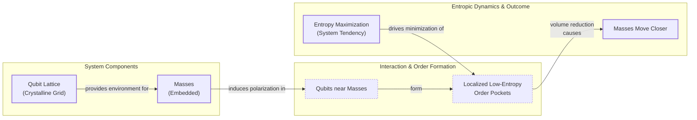

# Is Gravity an Illusion? A New Look at an Old Idea

When Isaac Newton developed his laws of gravity, he gave us the mathematics to describe the universe, but he was never comfortable with the core idea of "action at a distance." He found it an absurd idea that one object could influence another across empty space with nothing in between. In a 1692 letter, he wrote that the concept "is to me so great an Absurdity that I believe no Man who has in philosophical Matters a competent Faculty of thinking can ever fall into it" [[1]](https://philosophy.stackexchange.com/questions/122488/what-are-the-historical-philosophical-arguments-for-and-against-action-at-a-dist). This bothered him because it lacked a physical, mechanical explanation. To get around this, many of his contemporaries proposed "push gravity" theories. They imagined space was filled with a constant storm of tiny, invisible particles. In this model, objects are not pulled together; instead, they shield each other from the particles coming from the direction between them. This creates a net force that pushes them toward each other, creating the appearance of attraction.

Centuries later, Einstein gave us a much deeper picture. He did away with the "force" of gravity and replaced it with the curvature of spacetime. In his theory of general relativity, objects simply follow the straightest possible path, called a geodesic, through a geometry that is warped by mass and energy. This elegant solution removed the need for action at a distance. However, we know Einstein's theory is also incomplete. At the center of black holes and at the very beginning of the universe, the equations predict singularities—points where spacetime curvature becomes infinite and the laws of physics as we know them simply stop working. This tells us that general relativity can't be the final story.

A small group of physicists is now exploring a radical alternative: what if gravity isn't a fundamental force at all? What if it is an emergent phenomenon, a statistical effect that arises from the collective behavior of countless unseen, microscopic components? Daniel Carney, a physicist at Lawrence Berkeley National Laboratory, and his team are developing models where gravity emerges from the physics of heat and entropy. In this view, the pull you feel from the Earth is more like a swarm behavior. It is an orderly, macroscopic pattern that is the result of the chaotic, random motions of hidden individual parts [[2]](https://arxiv.org/abs/2502.17575).

This "entropic gravity" project is one of several ways we are trying to understand spacetime as emerging from a deeper, microscopic reality. While the idea is still on the fringes of theoretical physics, it refuses to go away. It persists because it is not easily dismissed and, more importantly, because it might actually be testable. If gravity is statistical, it might have fluctuations. We might be able to detect tiny, random deviations from Einstein's perfect geometric laws in delicate tabletop experiments, giving us a peek into the fundamental fabric of reality. To understand these models, we first need to look at the surprising connections between thermodynamics and general relativity that allow us to re-imagine gravity as an emergent effect of heat.

## A Force Emerges

The singularities that general relativity predicts are a clear sign that the theory is incomplete. When curvature becomes infinite, our ability to predict what happens next breaks down. This signals that we need a deeper theory of microscopic degrees of freedom to resolve these infinities. But long before we fully appreciated this problem, general relativity itself was giving us strange hints of a deep connection to thermodynamics. Even though it is a purely geometric theory, it produced laws for black holes that were mathematically identical to the laws of thermodynamics. For example, the surface area of a black hole's event horizon can never decrease, which looks exactly like the second law of thermodynamics, stating that entropy must always increase.

This connection became much more than an analogy when Stephen Hawking showed that quantum effects cause black holes to radiate energy as if they have a temperature [[3]](https://en.wikipedia.org/wiki/Black_hole_thermodynamics). This discovery implied that black holes must have entropy. If they have entropy, they must be made of microscopic components whose statistical behavior gives rise to these thermal properties. This raised a huge question: what are these microscopic parts, and how do they build spacetime itself?

The main approach we have for answering this is the holographic principle. This principle suggests that all the information describing a volume of space is encoded on a lower-dimensional boundary, much like a 3D image is stored on a 2D hologram [[4]](https://en.wikipedia.org/wiki/Holographic_principle). In this picture, spacetime and gravity emerge from the physics of these degrees of freedom living on a distant boundary.

However, in 1995, physicist Ted Jacobson showed us a different way. He completely flipped the logic. Instead of starting with general relativity to derive the laws of black hole thermodynamics, he started with the assumption that spacetime has thermal properties and used that to derive Einstein's field equations. He demonstrated that if you require the fundamental thermodynamic relation—heat equals temperature times the change in entropy—to hold for all tiny, local causal horizons in spacetime, then the geometry of spacetime must curve exactly as described by general relativity. In his model, heat is the flow of energy across a horizon, temperature is the Unruh temperature an accelerating observer would feel, and entropy is proportional to the horizon's area. This simple requirement forces the Einstein equation to be true, reframing gravity not as a fundamental force but as an equation of state, like the ideal gas law, that emerges from the statistical mechanics of hidden components [[5]](https://arxiv.org/abs/gr-qc/9504004). In 2010, Erik Verlinde took this idea even further, arguing that gravity *is* an entropic force caused by changes in information as matter moves [[10]](https://arxiv.org/abs/1001.0785). As Carney says, "The fact that you can derive the Einstein equation from thermodynamics tells you the connection is really deep" [[6]](https://www.quantamagazine.org/is-gravity-just-entropy-rising-long-shot-idea-gets-another-look-20250613). Now that we have established this powerful link, we can look at some concrete models that try to build gravity from these principles.

## Apparent Attraction

Inspired by Jacobson's thermodynamic approach, Carney and his co-authors—Manthos Karydas, Thilo Scharnhorst, Roshni Singh, and Jacob Taylor—recently proposed two microscopic models that reproduce Newtonian gravity from the statistical behavior of quantum bits, or qubits. These models give us concrete mechanisms for how an attractive force can emerge from a system's natural tendency to maximize its entropy [[2]](https://arxiv.org/abs/2502.17575).

The first model imagines space as a crystalline grid of qubits. When you place a massive object into this lattice, it interacts with the qubits around it. "If you put a mass somewhere in the lattice, it causes all of the qubits nearby to get polarized—they all try to go in the same direction," Carney explains [[6]](https://www.quantamagazine.org/is-gravity-just-entropy-rising-long-shot-idea-gets-another-look-20250613). This polarization creates a small, localized "order pocket" in the otherwise random arrangement of qubits. In thermodynamics, high order means low entropy.

Image 1: A diagram illustrating the first qubit-lattice model from Carney et al. 2025, showing masses, qubit polarization, order pocket formation, and entropic drive for mass attraction.

The fundamental drive of any thermodynamic system is to maximize its total entropy. To achieve this, the system will try to minimize the size of these low-entropy pockets. If you place two masses in the lattice, each creates its own ordered region. The system can increase its overall entropy by pushing the masses closer together, which reduces the total volume of these ordered pockets. The apparent gravitational attraction is simply an emergent effect of the qubit bath trying to become as disordered as possible. This model naturally produces Newton's inverse-square law because the polarizing effect of a mass weakens with distance, causing the entropic force to fall off as 1/r².

The second model is non-local and gets rid of the lattice. In this version, the qubits can be anywhere in space but are all coupled to the masses. This is designed to capture the "action at a distance" nature of Newtonian gravity. In this model, the presence of masses changes the energy capacity of the qubits. When two masses get closer, the energy capacity of each individual qubit decreases. If the total energy of the system is constant, that energy must be spread out over a larger number of qubits. Spreading the energy increases the number of accessible microscopic states, which in turn increases the system's entropy. So, once again, the system's tendency to maximize entropy creates an effective force that pulls the masses together. In both of these models, gravitational attraction is an emergent effect. It is a macroscopic illusion created by the statistical behavior of underlying microscopic degrees of freedom. While these models provide clear mechanisms for entropic gravity, they also have significant limitations.

## Strengths and Weaknesses

The qubit models are clever, but they are built on ad-hoc assumptions. The specific strengths of the couplings between masses and qubits, as well as the lattice spacing or the details of the non-local connections, are all fine-tuned to produce the correct result. These parameters are not derived from a more fundamental theory. As Carney himself acknowledges, the models are a "proof of principle" rather than a realistic description of how the universe actually works [[6]](https://www.quantamagazine.org/is-gravity-just-entropy-rising-long-shot-idea-gets-another-look-20250613).

A major weakness is that these models only reproduce Newtonian gravity in the weak-field limit. They do not give us the full curved-spacetime picture of general relativity. This leaves open the question of whether the entropic approach can ever be extended to describe strong gravitational fields. Furthermore, the models struggle to explain the equivalence principle. This is the cornerstone of general relativity, which states that all objects fall at the same rate regardless of their mass or what they are made of. As physicist Mark Van Raamsdonk of the University of British Columbia points out, "Their construction doesn’t really have anything to do with gravity" [[6]](https://www.quantamagazine.org/is-gravity-just-entropy-rising-long-shot-idea-gets-another-look-20250613). If gravity is a statistical force from a qubit bath, it is not clear why different materials would couple to that bath in a way that is perfectly proportional to their mass. The models do not have a natural way to enforce this universality.

Other formal challenges have also been raised. Physicist Matt Visser has argued that trying to model conservative forces in this way leads to unphysical requirements, like needing an unnatural number of different temperature baths [[8]](https://en.wikipedia.org/wiki/Entropic_gravity). Critics also argue that entropic processes should destroy quantum coherence, but there is no clear theoretical prediction for how strong this effect should be. The models focus on the weak-field regime, which we already understand very well, and avoid the hard problems of quantum gravity found in extreme environments like black holes. As theorist Ramy Brustein says, “The real challenge in gravitational physics is understanding its strong-coupling, strong-field regime,” a territory where the current entropic models have little to offer [[6]](https://www.quantamagazine.org/is-gravity-just-entropy-rising-long-shot-idea-gets-another-look-20250613). However, there is a counterargument. If gravity is truly a statistical phenomenon, the weak-field regime might be exactly where we could see its statistical nature. The force might not be perfectly smooth but could have tiny, random fluctuations. Detecting these fluctuations would be strong evidence for emergent gravity and would distinguish it from the deterministic geometry of Einstein's theory. Despite these weaknesses, the entropic gravity idea makes unique predictions about quantum systems that open up new ways for us to test it.

## Testing Entropic Gravity

"Our primary goal is to demonstrate how non-relativistic gravity can arise in detail as a thermodynamic limit of a controlled microscopic model," state Carney and his colleagues. "This in turn can explain... how such a scenario can be experimentally distinguished from ordinary virtual graviton exchange" [[2]](https://arxiv.org/abs/2502.17575). The most important benefit of these new models is that they are testable.

A key test involves quantum mechanics. Imagine you could place a massive object in a superposition of two different locations at once. According to standard quantum theory, its gravitational field should also be in a superposition. But what would entropic gravity predict? The underlying qubit bath would interact with the two versions of the mass differently, creating two different sets of ordered pockets. The system's drive to maximize entropy would favor a single, definite configuration, causing the superposition to collapse into one position. This process, called decoherence, would happen at a rate that depends on the object's mass and the model's parameters.

This prediction connects entropic gravity to another set of alternative theories called objective-collapse models. These models modify the standard Schrödinger equation with random, nonlinear terms that cause the wave function to spontaneously collapse for large systems, explaining how the classical world emerges from the quantum one [[7]](https://en.wikipedia.org/wiki/Objective-collapse_theory). Both entropic gravity and collapse models predict similar experimental signs, like mass-dependent decoherence that is not expected in standard quantum mechanics [[2]](https://arxiv.org/abs/2502.17575).

Amazingly, we are already building tabletop experiments with highly sensitive instruments like torsion pendulums to look for these exact effects [[9]](https://arxiv.org/html/2601.11366v1). These experiments test the limits of quantum superposition with larger and larger objects. They can simultaneously constrain the parameters of both collapse models and entropic gravity models. If we detect this anomalous decoherence, it would be a revolutionary discovery. If we do not, we could rule out large parts of the parameter space for these alternative theories. Even if the holographic principle remains our best bet for a theory of quantum gravity, exploring long-shot ideas like entropic gravity is still valuable. It forces us to ask deep questions about emergence and might reveal that the fixed laws we observe are just the statistical tendencies of a much richer, random, microscopic world.

## References

- [1] [What are the historical-philosophical arguments for and against action at a distance?](https://philosophy.stackexchange.com/questions/122488/what-are-the-historical-philosophical-arguments-for-and-against-action-at-a-dist)
- [2] [On the quantum mechanics of entropic forces](https://arxiv.org/abs/2502.17575)
- [3] [Black hole thermodynamics](https://en.wikipedia.org/wiki/Black_hole_thermodynamics)
- [4] [Holographic principle](https://en.wikipedia.org/wiki/Holographic_principle)
- [5] [Thermodynamics of Spacetime: The Einstein Equation of State](https://arxiv.org/abs/gr-qc/9504004)
- [6] [Is Gravity Just Entropy Rising? Long-Shot Idea Gets Another Look.](https://www.quantamagazine.org/is-gravity-just-entropy-rising-long-shot-idea-gets-another-look-20250613)
- [7] [Objective-collapse theory](https://en.wikipedia.org/wiki/Objective-collapse_theory)
- [8] [Entropic gravity](https://en.wikipedia.org/wiki/Entropic_gravity)
- [9] [Nanofabricated torsion pendulums for tabletop gravity experiments](https://arxiv.org/html/2601.11366v1)
- [10] [On the Origin of Gravity and the Laws of Newton](https://arxiv.org/abs/1001.0785)