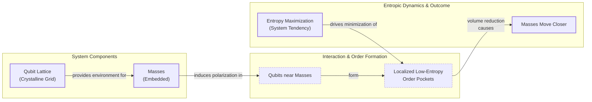

# Is Gravity an Illusion? A New Look at an Old Idea

Isaac Newton gave us the mathematical laws of gravity, but he was deeply troubled by the concept of "action at a distance." He found it inconceivable that one body could affect another across a vacuum without any mediating substance. In a 1692 letter, he wrote that the idea "is to me so great an Absurdity that I believe no Man who has in philosophical Matters a competent Faculty of thinking can ever fall into it" [[1]](https://philosophy.stackexchange.com/questions/122488/what-are-the-historical-philosophical-arguments-for-and-against-action-at-a-dist). To avoid this absurdity, many of his contemporaries imagined the universe was filled with an invisible ether or corpuscular streams that physically pushed objects toward one another, preserving a mechanistic, contact-only reality.

Centuries later, Einstein offered a more profound explanation. He replaced the "force" of gravity with the curvature of spacetime. In his theory of general relativity, objects simply follow the straightest possible path—a geodesic—through a geometry warped by mass and energy. This eliminated action at a distance, but Einstein's theory is also incomplete. At the center of black holes and the beginning of the universe, the equations predict singularities where spacetime curvature becomes infinite, and the laws of physics break down. General relativity cannot be the final word.

A small group of physicists is exploring a radical alternative: that gravity isn't a fundamental force at all but an emergent phenomenon, a statistical effect arising from the collective behavior of unseen microscopic components. Daniel Carney, a physicist at Lawrence Berkeley National Laboratory, and his colleagues are developing models where gravity emerges from the physics of heat and entropy [[2]](https://arxiv.org/abs/2502.17575). In this view, the familiar pull of the Earth is more like the coordinated movement of a swarm of bees—an orderly, macroscopic pattern produced by the chaotic, random motions of countless hidden individuals.

This "entropic gravity" project is one of several attempts to understand spacetime as emerging from a deeper, microscopic reality. While the idea remains on the fringe of theoretical physics, it persists because it is not easily dismissed and, more importantly, because it might be testable. If gravity is statistical, it might fluctuate. Tiny, random deviations from Einstein's pristine geometric laws could appear in delicate tabletop experiments, offering a glimpse into the fundamental nature of reality. To understand these models, we must first look at the surprising thermodynamic parallels within general relativity that allow gravity to be re-imagined as an emergent effect of heat.

## A Force Emerges

The singularities predicted by general relativity are a clear sign that the theory is not a complete description of nature. Where curvature becomes infinite, predictability is lost, signaling the need for a deeper theory of microscopic degrees of freedom that can resolve these infinities. Long before this breakdown was fully appreciated, however, general relativity itself contained surprising hints of a connection to thermodynamics. Despite being a purely geometric theory, it produced laws governing black holes that were mathematically identical to the laws of thermodynamics. The area of a black hole's event horizon, for instance, could never decrease, mirroring the second law's mandate that entropy must always increase.

When Stephen Hawking showed that quantum effects cause black holes to radiate as if they have a temperature, the analogy became an identity [[3]](https://en.wikipedia.org/wiki/Black_hole_thermodynamics). This discovery implied that black holes must possess entropy and, therefore, must be composed of microscopic constituents whose statistical behavior gives rise to these thermal properties. The question then became: what are these microscopic degrees of freedom, and how do they build spacetime itself?

The dominant approach to answering this question is the holographic principle. It suggests that the description of a volume of space is encoded on a lower-dimensional boundary, much like a three-dimensional image is stored on a two-dimensional hologram [[4]](https://en.wikipedia.org/wiki/Holographic_principle). In this view, spacetime and gravity emerge from the physics of degrees of freedom living on this distant boundary.

However, a different path was forged in 1995 by physicist Ted Jacobson. He completely reversed the logic. Instead of starting with general relativity and deriving the laws of black hole thermodynamics, he started with the assumption that spacetime has thermal properties and derived Einstein's field equations [[5]](https://arxiv.org/abs/gr-qc/9504004). He showed that if you demand the fundamental thermodynamic relation—that heat is equal to temperature times the change in entropy—to hold on tiny, local causal horizons everywhere in spacetime, the geometry must curve in exactly the way described by general relativity. As Carney puts it, "The fact that you can derive the Einstein equation from thermodynamics tells you the connection is really deep" [[6]](https://www.quantamagazine.org/is-gravity-just-entropy-rising-long-shot-idea-gets-another-look-20250613). This reframed gravity not as a fundamental force but as an equation of state, like the ideal gas law, emerging from the statistical mechanics of hidden components. Having established this powerful thermodynamic link, we can now examine concrete models that attempt to build gravity from the ground up using these principles.

## Apparent Attraction

Inspired by Jacobson's thermodynamic approach, Carney and his co-authors—Manthos Karydas, Thilo Scharnhorst, Roshni Singh, and Jacob Taylor—recently proposed two microscopic models that reproduce Newtonian gravity from the statistical behavior of quantum bits, or qubits [[2]](https://arxiv.org/abs/2502.17575). These models provide explicit mechanisms for how an attractive force can emerge from a system's tendency to maximize its entropy.

The first model imagines that space is filled with a crystalline grid of qubits. When a massive object is placed in this lattice, it interacts with the nearby qubits. "If you put a mass somewhere in the lattice, it causes all of the qubits nearby to get polarized—they all try to go in the same direction," Carney explains [[6]](https://www.quantamagazine.org/is-gravity-just-entropy-rising-long-shot-idea-gets-another-look-20250613). This polarization creates a small, localized "order pocket" in the otherwise random sea of qubits. High order corresponds to low entropy.

Image 1: A diagram illustrating the first qubit-lattice model from Carney et al. 2025, showing masses, qubit polarization, order pocket formation, and entropic drive for mass attraction.

The fundamental drive of any thermodynamic system is to maximize its total entropy. To do this, the system will act to minimize the size of these low-entropy pockets. If you place two masses in the lattice, they each create their own ordered region. The system can increase its overall entropy by pushing the masses together, which reduces the total volume of the ordered pockets. The apparent gravitational attraction is just an emergent effect of the qubit bath trying to eliminate disorder. This model naturally reproduces Newton's inverse-square law because the polarization effect of a mass weakens with distance, causing the entropic force to fall off as 1/r².

The second model is non-local and does away with the lattice. Here, the qubits can be anywhere in space but are all coupled to the masses. In this construction, the presence of masses changes the energy capacity of the qubits. As two masses get closer, the energy capacity of each qubit decreases. If the total energy of the system is held constant, that energy must be distributed across a larger number of qubits. This spreading of energy increases the number of accessible microscopic states, which in turn increases the system's entropy. Therefore, the system's tendency to maximize entropy again creates an effective force that pulls the masses together. In both models, gravitational attraction is an epiphenomenon—a macroscopic illusion created by the statistical shuffling of underlying microscopic degrees of freedom. While these constructions provide explicit mechanisms for entropic gravity, they come with significant limitations.

## Strengths and Weaknesses

The qubit models are clever proofs of concept, but they rely on ad-hoc assumptions. The specific coupling strengths between masses and qubits, as well as the lattice spacing or the nature of the non-local connections, are chosen by hand to produce the right answer. They are not derived from a more fundamental theory. As Carney admits, "We give both a local and non-local version of the construction... we expect that the qualitative structure we find here will hold in a much broader setting" [[2]](https://arxiv.org/abs/2502.17575). This highlights that the models are intended as demonstrations rather than realistic descriptions of nature.

A major limitation is that these models only reproduce Newtonian gravity in the weak-field limit. They do not recover the full curved-spacetime structure of general relativity, leaving it an open question whether the entropic approach can be extended to describe strong gravitational fields.

Furthermore, the models struggle to explain the equivalence principle—the cornerstone of general relativity, which states that all objects fall at the same rate regardless of their mass or composition. As physicist Mark Van Raamsdonk of the University of British Columbia notes, if gravity is a statistical force arising from interactions with a qubit bath, it is unclear why different materials would couple to that bath in a way that is precisely proportional to their mass [[6]](https://www.quantamagazine.org/is-gravity-just-entropy-rising-long-shot-idea-gets-another-look-20250613). The models do not have a natural mechanism to enforce this universal coupling.

Other formal challenges have been raised. Physicist Matt Visser has argued that extending the entropic approach to general conservative forces leads to unphysical requirements, such as an unnatural number of temperature baths. Critics also point out that entropic processes should break quantum coherence, an effect for which there is no clear theoretical prediction [[8]](https://en.wikipedia.org/wiki/Entropic_gravity).

The focus on the weak-field regime, which is already understood with incredible precision, sidesteps the hard problems of quantum gravity that appear in extreme environments like black holes. As theorist Ramy Brustein puts it, “The real challenge in gravitational physics is understanding its strong-coupling, strong-field regime,” a domain where the current entropic models have little to say [[6]](https://www.quantamagazine.org/is-gravity-just-entropy-rising-long-shot-idea-gets-another-look-20250613). However, there is a counter-view. If gravity is truly a statistical phenomenon, then the weak-field regime may be exactly where its statistical nature becomes apparent. The force might not be perfectly smooth but could exhibit tiny, random fluctuations or noise. Detecting this noise would be a smoking gun for emergent gravity and would distinguish it from the deterministic geometry of Einstein's theory. These weaknesses notwithstanding, the entropic gravity picture makes distinctive predictions about quantum systems that open new avenues for experimental tests.

## Testing Entropic Gravity

"Our primary goal is to demonstrate how non-relativistic gravity can arise in detail as a thermodynamic limit of a controlled microscopic model," state Carney and his colleagues. "This in turn can explain... how such a scenario can be experimentally distinguished from ordinary virtual graviton exchange" [[2]](https://arxiv.org/abs/2502.17575). The main benefit of these new models is their testability.

A key test involves quantum mechanics. Consider placing a massive object in a superposition of two different locations at once. According to standard quantum theory, its gravitational field should also enter a superposition. But what does entropic gravity predict? The underlying qubit bath would interact differently with the two versions of the mass, creating two different sets of order pockets. The system's drive to maximize entropy would favor a single, definite configuration, causing the superposition to collapse into one position. This process, known as decoherence, would happen at a rate dependent on the mass of the object and the parameters of the qubit model.

This prediction connects entropic gravity to another class of alternative theories known as objective-collapse models. In these models, the standard Schrödinger equation is modified with stochastic, nonlinear terms that cause the wave function to spontaneously collapse for massive or complex systems, thus explaining the emergence of the classical world from the quantum one [[7]](https://en.wikipedia.org/wiki/Objective-collapse_theory). Both approaches predict similar experimental signatures, such as mass-dependent decoherence that goes beyond what standard quantum mechanics expects [[2]](https://arxiv.org/abs/2502.17575).

Remarkably, tabletop experiments using highly sensitive instruments like torsion pendulums are already underway to search for these very effects [[9]](https://arxiv.org/html/2601.11366v1). These experiments, which test the limits of quantum superposition with increasingly massive objects, can simultaneously constrain the parameters of both collapse models and entropic gravity models. A positive detection of anomalous decoherence would be revolutionary, while a null result could rule out large portions of the parameter space for these alternative theories.

Even if the holographic principle remains the leading candidate for a theory of quantum gravity, exploring long-shot ideas like entropic gravity is valuable. It forces us to confront deep conceptual questions about emergence and may reveal that the immutable laws we observe are merely the statistical tendencies of a much richer, random, microscopic world.

## References

- [1] https://philosophy.stackexchange.com/questions/122488/what-are-the-historical-philosophical-arguments-for-and-against-action-at-a-dist
- [2] https://arxiv.org/abs/2502.17575
- [3] https://en.wikipedia.org/wiki/Black_hole_thermodynamics
- [4] https://en.wikipedia.org/wiki/Holographic_principle
- [5] https://arxiv.org/abs/gr-qc/9504004
- [6] https://www.quantamagazine.org/is-gravity-just-entropy-rising-long-shot-idea-gets-another-look-20250613
- [7] https://en.wikipedia.org/wiki/Objective-collapse_theory
- [8] https://en.wikipedia.org/wiki/Entropic_gravity
- [9] https://arxiv.org/html/2601.11366v1
</article>