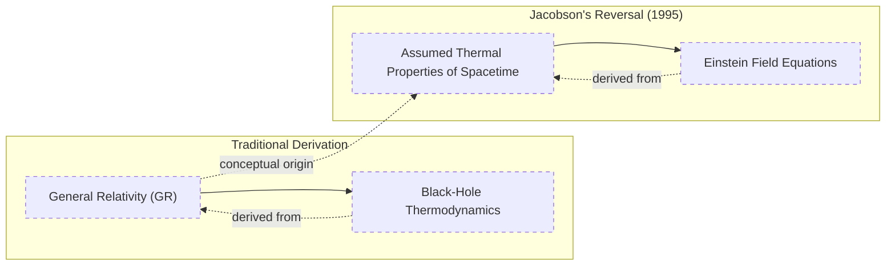
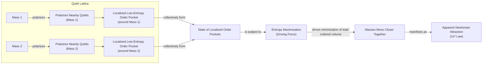
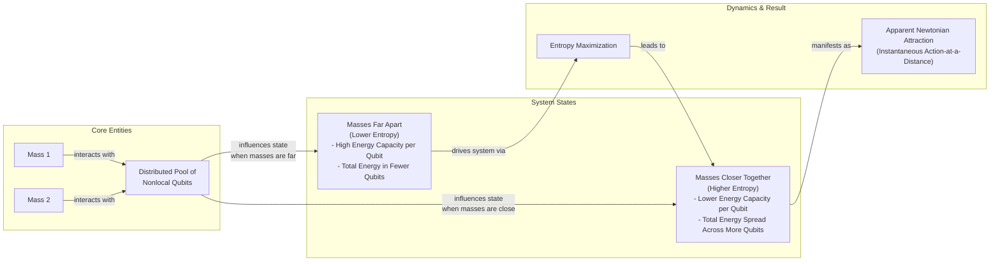

# Is Gravity an Illusion? A Look at the Entropic Force Theory

Isaac Newton was never happy with his law of universal gravitation. The idea that two objects could pull on each other across vast, empty space without any medium was, to him, a profound absurdity. In a 1692 letter, he wrote that the notion of gravity being innate and essential to matter, allowing one body to act upon another at a distance, "is to me so great an Absurdity that I believe no Man who has in philosophical Matters a competent Faculty of thinking can ever fall into it" [[1]](https://philosophy.stackexchange.com/questions/122488/what-are-the-historical-philosophical-arguments-for-and-against-action-at-a-dist). This discomfort fueled a search for a mechanical explanation. For decades, physicists proposed models where gravity was not a pull but a push, caused by unseen particles or an "ether" that bombarded objects, pushing them together [[25]](https://www.quantamagazine.org/is-gravity-just-entropy-rising-long-shot-idea-gets-another-look-20250613).

Albert Einstein provided a deeper explanation, describing gravity as the curvature of spacetime. In his theory of general relativity, objects simply follow the straightest possible path through a geometry warped by mass and energy. This elegant solution did away with action-at-a-distance. Yet, Einstein's theory is also incomplete. It predicts its own demise at the center of black holes, where curvature becomes infinite and the laws of physics break down [[25]](https://www.quantamagazine.org/is-gravity-just-entropy-rising-long-shot-idea-gets-another-look-20250613).

This incompleteness has kept alive the idea that gravity might be an emergent phenomenon. A modern take on this, known as entropic gravity, suggests that gravity is not a fundamental force but a statistical outcome of swarm behavior on a finer scale. According to Daniel Carney of Lawrence Berkeley National Laboratory, the idea is that "there’s some kind of gas or some thermal system out there that we can’t see directly, but it’s randomly interacting with masses in some way, such that on average you see all the normal gravity things that you know about" [[25]](https://www.quantamagazine.org/is-gravity-just-entropy-rising-long-shot-idea-gets-another-look-20250613).

This project is one of many ways physicists have tried to understand gravity and spacetime as emerging from deeper, microscopic physics. Carney's work, in particular, frames this deeper physics in terms of heat and the relentless rise of entropy [[25]](https://www.quantamagazine.org/is-gravity-just-entropy-rising-long-shot-idea-gets-another-look-20250613). While entropic gravity is a minority view, it persists because even its detractors are hesitant to dismiss it completely. Furthermore, it has the rare virtue of being experimentally testable, offering a path to distinguish a statistical tendency from an immutable law.

We will move from this historical dissatisfaction to the concrete thermodynamic parallels in general relativity that allow gravity to be derived from heat, setting the stage for modern entropic models.

## A Force Emerges

What makes Einstein’s theory of gravity so remarkable is not just its success, but how it points to its own incompleteness. General relativity predicts that at the center of black holes, gravity becomes infinitely strong and the fabric of spacetime tears open. The theory cannot say what happens next, signaling that a deeper, more microscopic description is needed [[25]](https://www.quantamagazine.org/is-gravity-just-entropy-rising-long-shot-idea-gets-another-look-20250613).

Intriguingly, general relativity has uncanny parallels to thermodynamics, even though no concepts of heat went into its development. Black holes only grow, never shrink—an irreversibility characteristic of the flow of heat and the rise of entropy. When physicists applied quantum mechanics to the spacetime around black holes, they found that black holes radiate energy like any hot body. This discovery of Hawking radiation suggests that black holes, and spacetime itself, must consist of some kind of microscopic components whose statistical behavior gives rise to these thermal properties [[6]](https://en.wikipedia.org/wiki/Holographic_principle), [[25]](https://www.quantamagazine.org/is-gravity-just-entropy-rising-long-shot-idea-gets-another-look-20250613).

Physicists have pursued multiple approaches to understand how spacetime emerges from these components. The leading approach is the holographic principle, which states that the description of a volume of space can be encoded on a lower-dimensional boundary, much like a 2D surface can create a 3D hologram. In this view, gravity arises organically from patterns in these microscopic boundary components [[6]](https://en.wikipedia.org/wiki/Holographic_principle), [[25]](https://www.quantamagazine.org/is-gravity-just-entropy-rising-long-shot-idea-gets-another-look-20250613).

Entropic gravity, introduced in 1995 by Ted Jacobson, takes a different path. Previously, physicists had started with Einstein's theory and derived its heat-like consequences. Jacobson went the other way. He began with the assumption that spacetime has thermal properties—specifically, that the thermodynamic relation δQ = TdS holds for local causal horizons—and used this to derive the equations of general relativity [[3]](https://krishnamohan-parattu.weebly.com/uploads/6/4/3/1/64317995/einstein-eq-and-thermodyn.pdf), [[25]](https://www.quantamagazine.org/is-gravity-just-entropy-rising-long-shot-idea-gets-another-look-20250613), [[4]](https://diposit.ub.edu/bitstreams/3a349666-d2a4-4667-a191-efffc065905c/download). His work confirmed that the parallels between gravity and heat are deeply significant.


Image 1: A conceptual diagram illustrating Jacobson's 1995 reversal in the derivation of gravity, showing the traditional path from General Relativity to Black-Hole Thermodynamics and Jacobson's reversed path from Assumed Thermal Properties of Spacetime to Einstein Field Equations.

As Daniel Carney puts it, "He turned black hole thermodynamics on its head. I’ve been mystified by this result for my entire adult life" [[25]](https://www.quantamagazine.org/is-gravity-just-entropy-rising-long-shot-idea-gets-another-look-20250613). This reframing of gravity as an equation of state, born from thermodynamics, opens the door to building concrete models of its microscopic origins.

Having established the thermodynamic derivation that reframes gravity, we will now examine two concrete qubit-based models that operationalize this idea to reproduce Newtonian attraction.

## Apparent Attraction

How might gravitational attraction arise from microscopic components? Inspired by Jacobson’s approach, Carney and his co-authors recently put forward two models [[25]](https://www.quantamagazine.org/is-gravity-just-entropy-rising-long-shot-idea-gets-another-look-20250613), [[26]](https://link.aps.org/doi/10.1103/y7sy-3by1).

In the first model, space is filled with a crystalline grid of quantum particles, or qubits. When a mass is placed in this lattice, it interacts with the qubits. "If you put a mass somewhere in the lattice, it causes all of the qubits nearby to get polarized—they all try to go in the same direction," Carney explained [[25]](https://www.quantamagazine.org/is-gravity-just-entropy-rising-long-shot-idea-gets-another-look-20250613). By reorienting these qubits, the mass creates a pocket of high order in an otherwise random grid. High order means low entropy. If you introduce a second mass, you create a second pocket of order. The system's natural tendency is to maximize entropy. To do this, the system squashes the masses closer together to confine the orderliness to a smaller region. The apparent attraction is simply the qubits doing the work to increase the overall disorder, and this effect naturally diminishes with the square of the distance, reproducing Newton's law [[25]](https://www.quantamagazine.org/is-gravity-just-entropy-rising-long-shot-idea-gets-another-look-20250613), [[26]](https://link.aps.org/doi/10.1103/y7sy-3by1).


Image 2: An architecture diagram illustrating the first qubit-lattice model from Carney et al. 2025, showing how masses polarize qubits to form order pockets, which are then subject to entropy maximization leading to apparent Newtonian attraction.

The second model does away with the grid. Here, massive objects are acted upon by qubits that do not occupy a specific location and could be far away. This feature is designed to capture the non-local nature of Newtonian gravity, where every object acts on every other object instantly [[25]](https://www.quantamagazine.org/is-gravity-just-entropy-rising-long-shot-idea-gets-another-look-20250613). In this model, each qubit can store a certain amount of energy, and this capacity depends on the distance between the masses. When the masses are far apart, each qubit's energy capacity is high, so the system's total energy can be stored in just a few qubits. When the masses are closer, the capacity of each qubit drops, forcing the energy to be spread over more qubits. This latter situation corresponds to a higher number of accessible microstates, and therefore higher entropy. The system's tendency to maximize entropy pushes the masses together, again mimicking Newtonian gravity [[25]](https://www.quantamagazine.org/is-gravity-just-entropy-rising-long-shot-idea-gets-another-look-20250613).


Image 3: A conceptual system interaction diagram illustrating the second nonlocal-qubit model from Carney et al. 2025, showing the transition between states based on mass distance and the role of nonlocal qubits and entropy maximization.

In both constructions, gravitational attraction is not a fundamental force. It is an emergent phenomenon, a statistical consequence of a microscopic system's relentless drive toward maximum entropy.

While these qubit models provide explicit mechanisms for emergent gravity, they carry significant limitations that must be critically examined.

## Strengths and Weaknesses

Carney himself cautions that both models are ad hoc, requiring fine-tuned interactions between masses and qubits without independent evidence for these components. "It actually seems to require a peculiar engineered-looking interaction to get this to work," he admits. The models are intended as a proof of principle rather than a realistic depiction of the universe. As Carney states, "The ontology of all of this is nebulous" [[25]](https://www.quantamagazine.org/is-gravity-just-entropy-rising-long-shot-idea-gets-another-look-20250613).

A major limitation is that the models only reproduce Newton's law of gravity, not the full apparatus of Einstein's theory where gravity is equivalent to the curvature of spacetime. Mark Van Raamsdonk, a physicist at the University of British Columbia, is doubtful they even represent a true proof of principle for gravity. He notes that the models lack special qualities of gravity, like the feeling of weightlessness in free fall. "Their construction doesn’t really have anything to do with gravity," he said [[25]](https://www.quantamagazine.org/is-gravity-just-entropy-rising-long-shot-idea-gets-another-look-20250613). This failure to capture the equivalence principle—the observation that all objects fall at the same rate regardless of their composition—is a significant hurdle.

Furthermore, the models focus on the weak-field regime, an aspect of gravity that physicists feel they already understand well. The real challenge lies where gravity gets strong, as inside black holes. Ramy Brustein, a theorist at Ben-Gurion University, argues, "The real challenge in gravitational physics is understanding its strong-coupling, strong-field regime" [[25]](https://www.quantamagazine.org/is-gravity-just-entropy-rising-long-shot-idea-gets-another-look-20250613). It is in these extreme environments that the entropic picture could be truly tested or falsified.

However, proponents of entropic gravity offer a compelling counter-view. Erik Verlinde of the University of Amsterdam, who argued for entropic gravity in a 2010 paper, suggests that physicists shouldn't be so sure about how gravity behaves even when it is weak [[10]](https://curtjaimungal.substack.com/p/what-is-entropic-gravity), [[12]](https://www.youtube.com/watch?v=BVphTl_WGEY). If gravity is a collective effect, the Newtonian force law is just a statistical average. The moment-to-moment effect will fluctuate around that average. "You have to go to very weak fields, because then these fluctuations might become observable," Verlinde said [[25]](https://www.quantamagazine.org/is-gravity-just-entropy-rising-long-shot-idea-gets-another-look-20250613). These tiny deviations could be the smoking gun that distinguishes a statistical effect from a fundamental law.

These weaknesses notwithstanding, the entropic gravity picture makes distinctive predictions about quantum systems that open new avenues for experimental tests.

## Testing Entropic Gravity

Carney believes the main benefit of these new models is that they "prompt conceptual questions about gravity and open up new experimental directions" [[25]](https://www.quantamagazine.org/is-gravity-just-entropy-rising-long-shot-idea-gets-another-look-20250613). One such question arises from a thought experiment: if you place a massive body in a quantum superposition of two different locations, will its gravitational field also be in a superposition?

The entropic gravity models predict a clear outcome. The interactions with the underlying qubits will act on the massive body to snap it out of its superposition and into a single, definite state. This is because the entropy-maximizing drive of the system favors a single classical configuration that minimizes the low-entropy "order pockets" [[25]](https://www.quantamagazine.org/is-gravity-just-entropy-rising-long-shot-idea-gets-another-look-20250613).

```mermaid
stateDiagram-v2
    [*] --> "Massive Body in Quantum Superposition (Location A + Location B)"

    "Massive Body in Quantum Superposition (Location A + Location B)" --> "Interactions with Underlying Qubits" : "Does Gravitational Field also Superpose?"

    "Interactions with Underlying Qubits" --> "Decoherence/Collapse"

    "Decoherence/Collapse" --> "Massive Body to Definite Position (Location A or Location B)" : "Entropy Maximization favors single classical mass configuration"

    "Massive Body to Definite Position (Location A or Location B)" --> "Objective Wave-Function Collapse Models"
```
Image 4: A state diagram illustrating the thought experiment on quantum superposition collapse in the context of entropic gravity.

This prediction connects entropic gravity to objective collapse theories, which propose that the wave function's collapse is a real physical process, not just an artifact of measurement. One of the most intriguing of these is the Diósi-Penrose model, which hypothesizes that gravity itself is the culprit that causes collapse [[15]](https://postquantum.com/quantum-computing/wave-function-collapse), [[16]](https://pmc.ncbi.nlm.nih.gov/articles/PMC11305101). The idea is that a superposition of a mass in two different places corresponds to a superposition of two different spacetimes, a situation nature might not allow to persist [[15]](https://postquantum.com/quantum-computing/wave-function-collapse). Both entropic gravity and objective collapse models predict that an isolated quantum system will eventually collapse on its own, and they have similar testable consequences [[25]](https://www.quantamagazine.org/is-gravity-just-entropy-rising-long-shot-idea-gets-another-look-20250613).

Angelo Bassi of the University of Trieste, who has led efforts to perform such experiments, notes, "The same experimental setups could, in principle, be used to test both" [[25]](https://www.quantamagazine.org/is-gravity-just-entropy-rising-long-shot-idea-gets-another-look-20250613). This opens the door for tabletop experiments to search for the subtle fluctuations or anomalous decoherence predicted by these theories.

For all his doubts, even Van Raamsdonk agrees that the approach is worthwhile. "Since it hasn’t been established that actual gravity in our universe arises holographically, it’s certainly valuable to explore other mechanisms by which gravity might arise," he said [[25]](https://www.quantamagazine.org/is-gravity-just-entropy-rising-long-shot-idea-gets-another-look-20250613). If this long-shot theory proves correct, it would reframe our understanding of the universe. Gravity would not be a law, just a statistical tendency.

## Conclusion

We have journeyed from Newton's unease with action-at-a-distance to the modern quest to understand gravity as an emergent phenomenon. The theory of entropic gravity offers a compelling, if controversial, alternative to the idea of gravity as a fundamental force. It reframes the universal attraction we experience as a statistical consequence of a microscopic system's tendency to maximize its entropy.

Recent models provide concrete, albeit simplified, mechanisms for how this might work, making testable predictions that distinguish it from standard general relativity. While the theory faces significant challenges, particularly in explaining the equivalence principle and strong-field gravity, its potential to be tested in tabletop quantum experiments keeps it a vital area of research. It reminds us that what we perceive as immutable laws of nature may, in fact, be the collective behavior of a hidden, chaotic world.

## References

- [1] [What are the historical-philosophical arguments for and against action at a distance?](https://philosophy.stackexchange.com/questions/122488/what-are-the-historical-philosophical-arguments-for-and-against-action-at-a-dist)
- [2] [Is Newton’s Rejection of Action at a Distance ‘Merely’ Methodological?](https://philarchive.org/archive/SFEINO)
- [3] [Einstein Equations from/as Thermodynamics of Spacetime](https://krishnamohan-parattu.weebly.com/uploads/6/4/3/1/64317995/einstein-eq-and-thermodyn.pdf)
- [4] [The Einstein equation as a thermodynamic relation: a new perspective](https://diposit.ub.edu/bitstreams/3a349666-d2a4-4667-a191-efffc065905c/download)
- [5] [Thermodynamics of space-time: The Einstein equation of state](https://inspirehep.net/literature/394001)
- [6] [Holographic principle - Wikipedia](https://en.wikipedia.org/wiki/Holographic_principle)
- [7] [How does the philosophy of emergent gravity differ from that of quantum gravity?](https://physics.stackexchange.com/questions/553104/how-does-the-philosophy-of-emergent-gravity-differ-from-that-of-quantum-gravi)
- [8] [Quantum gravity: a hologram at the edge of the universe?](https://plus.maths.org/content/quantum-gravity-can-holographic-principle-help)
- [9] [What is "entropic gravity"?](https://curtjaimungal.substack.com/p/what-is-entropic-gravity)
- [10] [What is "entropic gravity"?](https://curtjaimungal.substack.com/p/what-is-entropic-gravity)
- [11] [BackReAction: Verlinde's new paper](https://www.math.columbia.edu/~woit/wordpress?p=3123)
- [12] [Erik Verlinde - The Universe as a Quantum Information System (2016)](https://www.youtube.com/watch?v=BVphTl_WGEY)
- [13] [Emergent / entropic gravity from quantum entanglement in de Sitter space](https://physics.stackexchange.com/questions/794569/emergent-entropic-gravity-from-quantum-entanglement-in-de-sitter-space)
- [14] [BackReAction: Is Verlinde's emergent gravity the same as MOND? No. And yes.](http://backreaction.blogspot.com/2017/03/is-verlindes-emergent-gravity.html)
- [15] [What is Wave Function Collapse?](https://postquantum.com/quantum-computing/wave-function-collapse)
- [16] [Gravitationally-induced wave function collapse time for molecules](https://pmc.ncbi.nlm.nih.gov/articles/PMC11305101)
- [17] [Pushing the Limits of Quantum Superposition: What Do We Learn from Matter-Wave Interferometry?](https://www.youtube.com/watch?v=yPvRQ5nyKZY)
- [18] [Objective-collapse theory - Wikipedia](https://en.wikipedia.org/wiki/Objective-collapse_theory)
- [19] [Roger Penrose - Is the Universe an Accident?](https://www.youtube.com/watch?v=TZ6mTCbZtOI&vl=en)
- [20] [Carney et al. 2025 Entropic Gravity Models](https://arxiv.org/abs/2502.17575)
- [21] [Thermodynamics of Spacetime: The Einstein Equation of State](https://arxiv.org/abs/gr-qc/9504004)
- [22] [On the Origin of Gravity and the Laws of Newton](https://arxiv.org/abs/1001.0785)
- [23] [Is Gravity Just Entropy Rising? Long-Shot Idea Gets Another Look.](https://www.quantamagazine.org/is-gravity-just-entropy-rising-long-shot-idea-gets-another-look-20250613)
- [24] [Is Gravity Just Entropy Rising? Long-Shot Idea Gets Another Look.](https://www.quantamagazine.org/is-gravity-just-entropy-rising-long-shot-idea-gets-another-look-20250613)
- [25] [Is Gravity Just Entropy Rising? Long-Shot Idea Gets Another Look.](https://www.quantamagazine.org/is-gravity-just-entropy-rising-long-shot-idea-gets-another-look-20250613)
- [26] [A Set of Microscopic Models for Entropic Gravity](https://link.aps.org/doi/10.1103/y7sy-3by1)