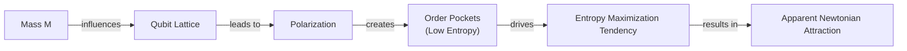
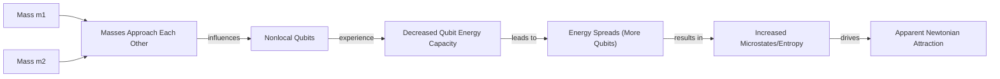
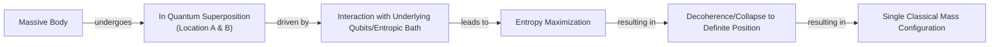

# Is Gravity an Illusion? Exploring the Strange Idea of an Entropic Force

Isaac Newton was never happy with his own law of universal gravitation. While the mathematics worked perfectly, the underlying concept of "action at a distance" troubled him deeply. In a 1692 letter, he wrote that the idea of one body acting on another through a vacuum, without any mediating substance, was "so great an Absurdity that I believe no Man who has in philosophical Matters a competent Faculty of thinking can ever fall into it" [[1]](https://philosophy.stackexchange.com/questions/122488/what-are-the-historical-philosophical-arguments-for-and-against-action-at-a-dist). This dissatisfaction spurred a search for a mechanical explanation. For decades, physicists proposed models where gravity was not a pull, but a push, caused by unseen particles or an "ether" that bombarded objects and forced them together [[2]](https://www.quantamagazine.org/is-gravity-just-entropy-rising-long-shot-idea-gets-another-look-20250613).

Albert Einstein later provided a more profound explanation, describing gravity as the curvature of spacetime. In his theory of general relativity, objects simply follow the straightest possible path through a geometry warped by mass and energy, eliminating the need for a mysterious force acting across empty space. Yet, even Einstein’s theory is incomplete. At the center of black holes, it predicts singularities where spacetime curvature becomes infinite, and the laws of physics break down. This signals that general relativity is not the final word [[2]](https://www.quantamagazine.org/is-gravity-just-entropy-rising-long-shot-idea-gets-another-look-20250613).

A modern attempt to find a deeper origin for gravity revisits the idea of a collective effect. Known as entropic gravity, this theory suggests that what we perceive as gravitational attraction is not a fundamental force but the outcome of swarm behavior on a finer scale. Earlier this year, a team led by theoretical physicist Daniel Carney of Lawrence Berkeley National Laboratory proposed that gravity could be a modern version of those old mechanical models. As Carney puts it, "There’s some kind of gas or some thermal system out there that we can’t see directly. But it’s randomly interacting with masses in some way, such that on average you see all the normal gravity things that you know about" [[2]](https://www.quantamagazine.org/is-gravity-just-entropy-rising-long-shot-idea-gets-another-look-20250613).

This project is one of many ways physicists have sought to understand gravity and spacetime as emergent from more microscopic physics. Carney's line of thinking pegs that deeper physics as the physics of heat, arguing that gravity results from the random jiggling and mixing of particles and the corresponding rise in entropy. Entropy is a measure of disorder that governs steam boilers, car engines and refrigerators [[2]](https://www.quantamagazine.org/is-gravity-just-entropy-rising-long-shot-idea-gets-another-look-20250613). Although entropic gravity is a minority view, it persists because even its detractors are hesitant to dismiss it entirely. Furthermore, it has the rare virtue of being experimentally testable, opening the door to distinguishing a statistical tendency from an immutable law [[2]](https://www.quantamagazine.org/is-gravity-just-entropy-rising-long-shot-idea-gets-another-look-20250613).

We will move from this historical dissatisfaction to the concrete thermodynamic parallels in general relativity that allow gravity to be derived from heat, setting the stage for this long-shot, idea.

## A Force Emerges

What makes Einstein’s theory of gravity so remarkable is not just that it works, but that it betrays its own incompleteness. General relativity predicts that stars can collapse to form black holes, and at their centers, gravity becomes infinitely strong. There, the spacetime continuum tears open, and the theory can no longer say what happens next [[2]](https://www.quantamagazine.org/is-gravity-just-entropy-rising-long-shot-idea-gets-another-look-20250613). This breakdown suggests that a deeper, microscopic description is needed.

Furthermore, general relativity has uncanny parallels to thermodynamics, even though not a single thermal concept went into its development. The theory predicts that the surface area of a black hole’s event horizon can only increase, never decrease, which mirrors the second law of thermodynamics, where entropy, or disorder, always tends to rise. This connection became undeniable when physicists, using quantum mechanics, discovered that black holes are not truly black. They radiate energy like any hot body, a phenomenon known as Hawking radiation [[3]](https://en.wikipedia.org/wiki/Holographic_principle), [[2]](https://www.quantamagazine.org/is-gravity-just-entropy-rising-long-shot-idea-gets-another-look-20250613). Since heat is just the random motion of particles, these thermal effects strongly suggest that black holes, and perhaps spacetime itself, are composed of some kind of microscopic components [[2]](https://www.quantamagazine.org/is-gravity-just-entropy-rising-long-shot-idea-gets-another-look-20250613).

Physicists have pursued multiple approaches to understand how spacetime emerges from these microscopic constituents. The leading approach is known as the holographic principle. It suggests that the three-dimensional world we experience is like a hologram, an image of reality encoded on a distant, two-dimensional surface. In this view, patterns in the universe's microscopic components give rise to an extra spatial dimension, which is curved, allowing gravity to arise organically [[4]](https://plus.maths.org/quantum-gravity-can-holographic-principle), [[3]](https://en.wikipedia.org/wiki/Holographic_principle), [[2]](https://www.quantamagazine.org/is-gravity-just-entropy-rising-long-shot-idea-gets-another-look-20250613).

Entropic gravity takes a related but distinct path. In 1995, theoretical physicist Ted Jacobson of the University of Maryland turned the logic of black hole thermodynamics on its head. Instead of starting with Einstein's theory to derive its heat-like consequences, Jacobson started from the assumption that spacetime has thermal properties. He showed that by applying the fundamental thermodynamic relation δQ = TdS to local causal horizons, one could derive the equations of general relativity [[5]](https://inspirehep.net/literature/394001), [[6]](https://diposit.ub.edu/bitstreams/3a349666-d2a4-4667-a191-efffc065905c/download), [[7]](https://krishnamohan-parattu.weebly.com/uploads/6/4/3/1/64317995/einstein-eq-and-thermodyn.pdf). This confirmed that the parallels between gravity and heat are deeply significant [[2]](https://www.quantamagazine.org/is-gravity-just-entropy-rising-long-shot-idea-gets-another-look-20250613). As Carney noted, "I’ve been mystified by this result for my entire adult life" [[2]](https://www.quantamagazine.org/is-gravity-just-entropy-rising-long-shot-idea-gets-another-look-20250613).

Having established this thermodynamic derivation, which reframes gravity as an entropic force, we can now examine concrete models that try to build Newtonian attraction from these principles.

## Apparent Attraction

Inspired by Jacobson's approach, Carney and his co-authors put forward two models to show how gravitational attraction might arise from microscopic components [[8]](https://link.aps.org/doi/10.1103/y7sy-3by1), [[2]](https://www.quantamagazine.org/is-gravity-just-entropy-rising-long-shot-idea-gets-another-look-20250613).

Their first model imagines that space is filled with a crystalline grid of quantum particles, or qubits. "If you put a mass somewhere in the lattice," Carney explained, "it causes all of the qubits nearby to get polarized—they all try to go in the same direction" [[2]](https://www.quantamagazine.org/is-gravity-just-entropy-rising-long-shot-idea-gets-another-look-20250613). By reorienting these qubits, a massive object creates a localized pocket of high order in an otherwise random grid. High order means low entropy. If you place two masses in the lattice, you create two such pockets [[8]](https://link.aps.org/doi/10.1103/y7sy-3by1). The system’s natural tendency is to maximize entropy. As the masses and qubits interact, the net effect is to push the masses closer together to contain this orderliness within a smaller region. The apparent attraction is simply the system settling into its most probable, highest-entropy state [[2]](https://www.quantamagazine.org/is-gravity-just-entropy-rising-long-shot-idea-gets-another-look-20250613). This model naturally produces an attraction that diminishes with the square of the distance, just as Newton's law dictates.

Image 1: A flowchart illustrating the first qubit-lattice model from Carney et al. 2025, showing the progression from a massive object to apparent Newtonian attraction through quantum effects.

The second model does away with the grid. Here, qubits are not fixed in space and can be far away from the massive objects they act upon. This feature is intended to capture the non-local character of Newtonian gravity, where every object in the universe acts on every other object [[8]](https://link.aps.org/doi/10.1103/y7sy-3by1). In this model, each qubit can store a certain amount of energy, and this capacity depends on the distance between the masses. When the masses are far apart, each qubit has a high energy capacity, so the system's total energy can fit in just a few qubits. However, as the masses get closer, the energy capacity of each qubit drops. The total energy must then be spread over more qubits. Spreading energy across more components increases the number of possible arrangements, or microstates, which corresponds to higher entropy. Thus, the system's natural tendency is to push the masses together to maximize its entropy [[2]](https://www.quantamagazine.org/is-gravity-just-entropy-rising-long-shot-idea-gets-another-look-20250613).

Image 2: A flowchart illustrating the second nonlocal-qubit model from Carney et al. 2025.

In both models, what we perceive as gravitational attraction is an epiphenomenon. It is not a fundamental force but rather the macroscopic result of a microscopic system of qubits striving to maximize its entropy. This idea is general, as analogous models can be built where the qubits are replaced by other thermal systems like oscillators [[9]](https://www.osti.gov/pages/servlets/purl/2587758). While these constructions provide explicit mechanisms for this process, they also have significant limitations that must be examined.

## Strengths and Weaknesses

Carney cautioned that both models are ad hoc, acknowledging that "it actually seems to require a peculiar engineered-looking interaction to get this to work" [[2]](https://www.quantamagazine.org/is-gravity-just-entropy-rising-long-shot-idea-gets-another-look-20250613). There is no independent evidence for the proposed qubits, and the interactions had to be fine-tuned to reproduce gravity. Specifically, the models depend on four free parameters governing temperature, length scales, and coupling strengths that must be set to specific values [[10]](https://arxiv.org/html/2502.17575v1). The models are intended as a proof of principle. It is a demonstration that it is at least possible for swarm behavior to explain gravitational attraction. It is not a realistic depiction of how the universe works. Carney admits, "The ontology of all of this is nebulous" [[2]](https://www.quantamagazine.org/is-gravity-just-entropy-rising-long-shot-idea-gets-another-look-20250613).

A major limitation is that the models only reproduce Newton's law of gravity, not the full apparatus of Einstein's theory, where gravity is equivalent to the curvature of spacetime. Mark Van Raamsdonk, a physicist at the University of British Columbia, is doubtful the models truly represent a proof of principle. He notes that the new entropic models lack the special qualities of gravity, such as the feeling of weightlessness during free fall, a consequence of the equivalence principle. "Their construction doesn’t really have anything to do with gravity," he said [[2]](https://www.quantamagazine.org/is-gravity-just-entropy-rising-long-shot-idea-gets-another-look-20250613).

Furthermore, the models dwell on the one aspect of gravity that physicists think they already understand. Newton’s law arises naturally from Einstein’s theory when gravity is weak. The real mystery lies where gravity gets strong, as in black holes, and the entropic models have nothing to say about that. Tests of gravity beyond this linear theory, such as observations of the Hulse-Taylor binary pulsar, remain outside the scope of this approach [[11]](https://web.mit.edu/edbert/GR/gr6.pdf). "The real challenge in gravitational physics is understanding its strong-coupling, strong-field regime," said a theorist at Ben-Gurion University who has cooled on the idea of entropic gravity [[2]](https://www.quantamagazine.org/is-gravity-just-entropy-rising-long-shot-idea-gets-another-look-20250613).

Proponents of entropic gravity respond that physicists should not be so sure about how gravity behaves even when it is weak. Erik Verlinde of the University of Amsterdam, who argued for entropic gravity in a 2010 paper, suggests that if gravity is a collective effect, the Newtonian force law is just a statistical average. The moment-to-moment effect will fluctuate around that average. "You have to go to very weak fields, because then these fluctuations might become observable," Verlinde said [[12]](https://curtjaimungal.substack.com/p/what-is-entropic-gravity), [[2]](https://www.quantamagazine.org/is-gravity-just-entropy-rising-long-shot-idea-gets-another-look-20250613).

These weaknesses notwithstanding, the entropic gravity picture makes distinctive predictions about quantum systems that open new avenues for experimental tests, particularly when connected to ideas of objective wave-function collapse.

## Testing Entropic Gravity

Carney thinks the main benefit of the new models is that they "prompt conceptual questions about gravity and open up new experimental directions" [[2]](https://www.quantamagazine.org/is-gravity-just-entropy-rising-long-shot-idea-gets-another-look-20250613). A key thought experiment involves placing a massive body in a quantum superposition of two different locations. Would its gravitational field also be in a superposition, pulling objects in two directions at once? The entropic models predict that the underlying qubits would act on the mass to snap it out of this state and into a single, definite position [[8]](https://link.aps.org/doi/10.1103/y7sy-3by1). This is because the system's tendency to maximize entropy favors a single classical configuration that minimizes the ordered, low-entropy regions [[2]](https://www.quantamagazine.org/is-gravity-just-entropy-rising-long-shot-idea-gets-another-look-20250613).

Image 3: A flowchart illustrating the thought experiment linking entropic gravity to objective wave-function collapse.

This prediction connects entropic gravity to objective-collapse theories, which propose that wave function collapse is a real physical process. Some of these theories, like the Diósi-Penrose model, suggest that gravity itself is what causes collapse, as nature does not tolerate superpositions of different spacetime curvatures [[13]](https://en.wikipedia.org/wiki/Objective-collapse_theory), [[14]](https://pmc.ncbi.nlm.nih.gov/articles/PMC11305101), [[15]](https://postquantum.com/quantum-computing/wave-function-collapse). Both entropic gravity and these collapse models predict that an isolated quantum system will eventually collapse on its own, with testable consequences. However, the absence of observed spontaneous collapse effects means standard quantum mechanics has passed every experimental test to date [[15]](https://postquantum.com/quantum-computing/wave-function-collapse), [[2]](https://www.quantamagazine.org/is-gravity-just-entropy-rising-long-shot-idea-gets-another-look-20250613).

Tabletop experiments are already underway to search for such spontaneous collapse effects, and these could be used to test both ideas simultaneously. For all his doubts, Van Raamsdonk agrees the approach is worthwhile. "Since it hasn’t been established that actual gravity in our universe arises holographically, it’s certainly valuable to explore other mechanisms by which gravity might arise," he said [[2]](https://www.quantamagazine.org/is-gravity-just-entropy-rising-long-shot-idea-gets-another-look-20250613). If this long-shot theory works out, gravity may not be a law, but just a statistical tendency.

## Conclusion

The journey from Newton's unease with action at a distance to modern theories of entropic gravity highlights a persistent theme in physics: the search for a deeper, mechanical explanation for the universe's fundamental workings. While Einstein's curved spacetime provided a revolutionary new framework, its breakdown at singularities tells us the story is not yet complete.

Entropic gravity offers a provocative alternative, reframing one of nature's most fundamental forces as an emergent phenomenon. In this view, gravity is not a law written into the fabric of reality but a statistical outcome of a microscopic system's relentless drive toward disorder. It is an illusion born from information and entropy. While still a fringe idea with significant theoretical hurdles, its potential to be tested experimentally makes it a valuable part of the ongoing quest to understand the true nature of spacetime and our place within it.

## References

- [1] https://philosophy.stackexchange.com/questions/122488/what-are-the-historical-philosophical-arguments-for-and-against-action-at-a-dist
- [2] https://www.quantamagazine.org/is-gravity-just-entropy-rising-long-shot-idea-gets-another-look-20250613
- [3] https://en.wikipedia.org/wiki/Holographic_principle
- [4] https://plus.maths.org/quantum-gravity-can-holographic-principle
- [5] https://inspirehep.net/literature/394001
- [6] https://diposit.ub.edu/bitstreams/3a349666-d2a4-4667-a191-efffc065905c/download
- [7] https://krishnamohan-parattu.weebly.com/uploads/6/4/3/1/64317995/einstein-eq-and-thermodyn.pdf
- [8] https://link.aps.org/doi/10.1103/y7sy-3by1
- [9] https://www.osti.gov/pages/servlets/purl/2587758
- [10] https://arxiv.org/html/2502.17575v1
- [11] https://web.mit.edu/edbert/GR/gr6.pdf
- [12] https://curtjaimungal.substack.com/p/what-is-entropic-gravity
- [13] https://en.wikipedia.org/wiki/Objective-collapse_theory
- [14] https://pmc.ncbi.nlm.nih.gov/articles/PMC11305101
- [15] https://postquantum.com/quantum-computing/wave-function-collapse