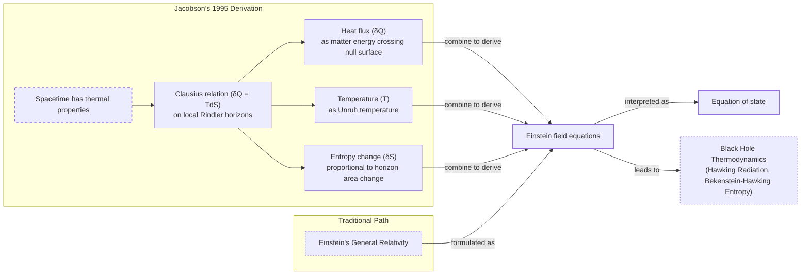

# Is Gravity an Illusion?

Back in 1692, Isaac Newton had a problem with his own theory of gravity. He wrote in a letter that the idea of one body acting on another across empty space was "so great an Absurdity that I believe no Man who has in philosophical Matters a competent Faculty of thinking can ever fall into it" [[1]](https://philosophy.stackexchange.com/questions/122488/what-are-the-historical-philosophical-arguments-for-and-against-action-at-a-dist). His equations worked perfectly, but the mechanism felt like a philosophical failure. He had a mathematical law but no physical explanation. This discomfort was not his alone. It fueled centuries of attempts to find a mechanical cause for gravity. Many of his contemporaries imagined the universe was filled with an invisible ether or streams of tiny particles that physically pushed objects toward each other, creating the appearance of attraction. These "push" models preserved a comforting, contact-based view of the universe, but they ultimately failed to produce a viable theory.

Albert Einstein later resolved the issue by recasting gravity not as a force, but as a feature of spacetime itself. In his theory of general relativity, massive objects curve the geometry of spacetime, and other objects simply follow the straightest possible paths through this curved landscape. This solution eliminated action at-a-distance. However, it also introduced its own problem: singularities. At the center of black holes or the beginning of the universe, the theory predicts infinite curvature, a point where the laws of physics break down. This signals that general relativity is not the final word.

Today, a small but persistent group of physicists is exploring a radical alternative. What if gravity is not a fundamental force at all, but an emergent statistical phenomenon? This idea, known as entropic gravity, suggests that the attraction you feel is the macroscopic result of a hidden microscopic system’s tendency to maximize its entropy, or disorder. As theoretical physicist Daniel Carney explains, “There’s some kind of gas or some thermal system out there that we can’t see directly… But it’s randomly interacting with masses in some way, such that on average you see all the normal gravity things that you know about: The Earth orbits the sun, and so forth” [[2]](https://www.quantamagazine.org/is-gravity-just-entropy-rising-long-shot-idea-gets-another-look-20250613).

In complexity science, emergence refers to collective behaviors that arise from the interactions of a system’s components but are best described by new, higher-level laws [[3]](https://arxiv.org/html/2507.04951v4). A classic example is temperature, which is meaningless for a single molecule but becomes a well-defined property for a large collection of them. Similarly, entropic gravity proposes that gravity is not part of the fundamental microscopic rulebook but a macroscopic pattern that appears after simplifying the system. This project is one of many ways physicists have sought to understand gravity and spacetime as emerging from microscopic physics, with Carney's work modeling this deeper reality through the lens of heat and entropy. While the entropic view remains on the fringe, it persists because it is not easily dismissed and, more importantly, because it might be testable. If gravity is statistical, it might fluctuate, producing tiny, observable deviations from the smooth, deterministic predictions of general relativity. This possibility keeps the idea alive as a long-shot alternative to mainstream theories. Now, let's explore the concrete thermodynamic parallels in general relativity (GR) that allow gravity to be derived from heat rather than being postulated geometrically.

## A Force Emerges

The failure of general relativity (GR) at singularities is a clear sign that the theory is incomplete. Where its equations predict infinities, physics loses its predictive power. This indicates that a more fundamental, microscopic description of spacetime is needed to resolve these breakdowns. Surprisingly, clues to this deeper theory have been hiding within GR itself, in a set of unexpected parallels to thermodynamics.

### Thermodynamic Parallels in General Relativity

Despite being a purely geometric theory with no thermodynamic inputs, GR contains features that mirror the laws of heat and disorder. For example, the total surface area of black hole event horizons can never decrease. This rule is strikingly similar to the second law of thermodynamics, which states that entropy, or disorder, always increases. This analogy became a physical identity with Stephen Hawking’s discovery that black holes are not truly black. When quantum fields are considered, black holes radiate energy as if they have a temperature, now known as Hawking temperature.

The existence of temperature and an entropy proportional to their horizon area strongly implies that black holes possess microscopic degrees of freedom [[4]](https://en.wikipedia.org/wiki/Holographic_principle). Just as the temperature of a gas is the average energy of its constituent molecules, the thermal properties of a black hole suggest it is a statistical system composed of vast numbers of hidden components. This insight has fueled the search for a theory of quantum gravity to describe these microscopic constituents. The dominant approach to this problem is the holographic principle. It proposes that the description of a volume of space is encoded on a lower-dimensional boundary, much like a three-dimensional image is stored on a two-dimensional hologram [[4]](https://en.wikipedia.org/wiki/Holographic_principle). In this view, spacetime and gravity are emergent phenomena arising from the physics of degrees of freedom living on this distant boundary.

### Deriving Gravity from Heat

A different approach reframes the connection between gravity and thermodynamics. In a groundbreaking 1995 paper, physicist Ted Jacobson turned the logic of black hole thermodynamics on its head [[5]](https://arxiv.org/abs/gr-qc/9504004). Instead of deriving thermal properties from the laws of gravity, he started by assuming that every point in spacetime has thermodynamic properties. By applying the fundamental relation δQ = TdS (heat equals temperature times change in entropy) to tiny, local causal horizons, he derived the entirety of Einstein's field equations [[6]](https://krishnamohan-parattu.weebly.com/uploads/6/4/3/1/64317995/einstein-eq-and-thermodyn.pdf).

This demonstrated that gravity could be understood not as a fundamental aspect of geometry, but as an equation of state, like the ideal gas law. It emerges from the statistical mechanics of unknown microscopic degrees of freedom. As Carney notes, “He turned black hole thermodynamics on its head. I’ve been mystified by this result for my entire adult life” [[2]](https://www.quantamagazine.org/is-gravity-just-entropy-rising-long-shot-idea-gets-another-look-20250613). However, this "thermodynamic" approach has faced criticism for inconsistencies in defining the entropy being measured. Some analyses suggest the required area-entropy relationship conflicts with the one from black hole thermodynamics, creating a potential internal contradiction [[7]](https://arxiv.org/pdf/1601.07558).


Image 1: A flowchart illustrating Ted Jacobson's 1995 derivation of Einstein's field equations from thermodynamic principles, contrasted with the traditional path.

The conceptual power of this derivation is significant. It reframes gravity as an entropic force. Having established this thermodynamic foundation, you can now examine two concrete models that implement this idea to reproduce Newtonian attraction through explicit entropy-maximizing mechanisms.

## Apparent Attraction

Inspired by Jacobson’s approach, Daniel Carney and his collaborators recently proposed two microscopic models that demonstrate how gravity can emerge from quantum information [[8]](https://arxiv.org/abs/2502.17575). These models replace the smooth fabric of spacetime with a system of quantum bits, or qubits, and show how their collective behavior can give rise to an attractive force. The concept of an entropic force is not unique to gravity. It has parallels in soft matter physics. For example, a long polymer chain resists being stretched not due to a fundamental attraction, but because the coiled, disordered state has higher entropy. The resistance you feel is a statistical, entropic force [[9]](https://pure.uva.nl/ws/files/1162156/105001_357036.pdf).

### The Local Qubit-Lattice Model

The first model imagines space as a crystalline grid of qubits, each with an orientation like a tiny compass needle. When a massive object is placed into this lattice, it interacts with the nearby qubits. “If you put a mass somewhere in the lattice, it causes all of the qubits nearby to get polarized—they all try to go in the same direction,” Carney explained [[2]](https://www.quantamagazine.org/is-gravity-just-entropy-rising-long-shot-idea-gets-another-look-20250613). This alignment creates a localized "pocket of order" in an otherwise random system. High order corresponds to low entropy.

```mermaid
flowchart LR
    %% Model Components
    subgraph "Model Setup"
        A["3D Lattice of Qubits<br/>(with orientation)"]
        B["Two Masses<br/>(embedded)"]
    end

    %% Initial Interaction & Result
    subgraph "Qubit Polarization"
        C["Masses Polarize Nearby Qubits"]
        D["Localized Low-Entropy Order Pockets"]
    end

    %% Thermodynamic Principle
    E["High Order = Low Entropy"]

    %% Driving Mechanism
    subgraph "Entropy Maximization"
        F["System's Natural Tendency<br/>(Maximize Entropy)"]
        G["Masses Driven Closer Together"]
        H["Minimizing Total Volume<br/>of Ordered Regions"]
    end

    %% Final Outcome
    subgraph "Resulting Phenomenon"
        I["Apparent Attraction"]
        J["Reproduces Newtonian 1/r² Law"]
    end

    %% Connections
    A -- "interacts with" --> B
    B -- "causes" --> C
    C -- "forms" --> D
    D -- "illustrates" --> E
    E -. "informs" .-> F
    F -- "drives" --> G
    G -- "achieved by" --> H
    H -- "leads to" --> I
    I -- "explains" --> J

    %% Class definitions for visual grouping
    classDef principle stroke-width:2px,stroke-dasharray: 5 5
    class E principle
```


Image 2: A diagram illustrating the first qubit-lattice model from Carney et al. 2025, showing how masses polarize qubits, leading to entropy maximization and apparent attraction that reproduces Newtonian gravity.

The fundamental driver of change in this system is the second law of thermodynamics: the universal tendency to maximize entropy. If two masses are placed in the lattice, they each create a pocket of low-entropy order. To maximize the overall entropy of the system, these ordered regions must be contained within the smallest possible volume. The net effect is that the masses are pushed closer together, squashing the orderly pockets and allowing the rest of the qubit sea to remain maximally disordered. This apparent attraction yields an inverse-square force law because the polarization effect weakens with distance, reproducing Newton's law as a direct statistical outcome.

### The Non-Local Qubit Model

The second model does away with the fixed lattice. This allows it to capture the instantaneous, action-at-a-distance character of Newtonian gravity. In this non-local version, qubits can be arbitrarily far from one another. The mechanism here relies on a variable energy capacity. When two masses approach each other, the energy capacity of each individual qubit decreases. If the total energy of the system is fixed, it must spread out across a larger number of qubits. This distribution increases the number of accessible microscopic states, thereby raising the system's total entropy. The masses are thus driven together because that configuration maximizes the entropy of the underlying qubit system.

```mermaid
flowchart LR
  %% Initial Setup
  subgraph "System Configuration"
    MA["Mass A"]
    MB["Mass B"]
    DQ["Distant Qubits<br/>(not fixed to lattice)"]
  end

  %% Trigger and Core Mechanism
  subgraph "Interaction Mechanism"
    AP["Masses Approach"]
    QECD["Qubit Energy Capacity Decreases"]
    FTE["Fixed Total Energy"]
    ESQ["Energy Spreads to<br/>More Qubits"]
    AMI["Accessible Microstates Increase"]
    EI["Entropy Increases"]
  end

  %% Outcome and Interpretation
  subgraph "Resulting Phenomenon"
    ME["Maximize Entropy"]
    MDT["Masses Driven Together"]
    AA["Apparent Attraction"]
    NG["Newtonian Gravity<br/>(Instantaneous Action-at-a-distance)"]
  end

  %% Connections
  MA -- "move towards" --> AP
  MB -- "move towards" --> AP
  AP -- "triggers" --> QECD
  FTE -. "constant constraint" .-> QECD
  QECD -- "forces" --> ESQ
  ESQ -- "leads to" --> AMI
  AMI -- "results in" --> EI
  EI -- "drives system to" --> ME
  ME -- "causes" --> MDT
  MDT -- "manifests as" --> AA
  AA -- "explains" --> NG

  %% Visual differentiation for key concepts
  classDef concept stroke-dasharray: 5, 5
  class DQ,FTE,ME concept
```


Image 3: A conceptual diagram illustrating the second nonlocal-qubit model from Carney et al. 2025, showing how the approach of two masses leads to an apparent attraction driven by entropy maximization.

In both models, the gravitational attraction you observe is a secondary effect, a macroscopic illusion created by the statistical behavior of hidden microscopic components. While these constructions provide explicit mechanisms for recovering Newtonian gravity, they come with significant limitations that must be critically examined.

## Strengths and Weaknesses

While the qubit models successfully reproduce Newtonian gravity, they are built on a foundation of ad-hoc assumptions. Both require fine-tuned parameters, such as the coupling strength between masses and qubits or the lattice spacing. These are chosen to make the model work rather than being derived from a more fundamental theory. Carney and his colleagues are clear that these are not realistic models but rather "explicit, proof-of-concept examples in which gravity emerges as an entropic effect" [[8]](https://arxiv.org/abs/2502.17575).

### Ad-Hoc Construction and Weak-Field Limits

A significant limitation is that the models only recover the weak-field limit of gravity described by Newton. They do not reproduce the full, dynamic, curved-spacetime structure of GR. This leaves it an open question whether the entropic approach can be extended to describe gravity in more extreme environments.

Perhaps the most pointed criticism comes from Mark Van Raamsdonk, a theoretical physicist at the University of British Columbia. He highlights the models' failure to explain the equivalence principle. This is a cornerstone of GR stating that all objects fall at the same rate regardless of their mass or composition. Van Raamsdonk argues that the models lack the essential qualities of gravity, stating, “Their construction doesn’t really have anything to do with gravity” [[2]](https://www.quantamagazine.org/is-gravity-just-entropy-rising-long-shot-idea-gets-another-look-20250613). If gravity is a statistical force arising from interactions with a sea of qubits, it is unclear why different types of matter would couple to these qubits in a precisely universal way. The models do not naturally enforce this fundamental property of gravity. Critics note that to recover GR, entropic models may have to assume the equivalence principle rather than derive it from first principles [[10]](http://backreaction.blogspot.com/2010/03/gravity-is-entropy-is-gravity-is.html).

### The Equivalence Principle and Strong-Field Challenges

Furthermore, the models focus on the weak-field regime, which is already understood with incredible precision. The real test for any new theory of gravity lies in the strong-field environments of black holes and the early universe, where GR breaks down. As theorist Ramy Brustein puts it, “The real challenge in gravitational physics is understanding its strong-coupling, strong-field regime” [[2]](https://www.quantamagazine.org/is-gravity-just-entropy-rising-long-shot-idea-gets-another-look-20250613). It is in these regimes, where singularities and information paradoxes appear, that an entropic picture might be truly tested or falsified.

On the other hand, some researchers are extending the entropic framework to address cosmological puzzles. Erik Verlinde’s model, for instance, suggests dark matter is not a particle but an emergent gravitational effect tied to the entropy of dark energy [[11]](https://arxiv.org/html/2511.05632v1).

However, there is a compelling counterargument. If gravity is indeed a statistical phenomenon, the weak-field regime might be precisely where its statistical nature becomes detectable. Instead of a perfectly smooth force, entropic gravity might produce tiny, random fluctuations or deviations from the inverse-square law. Such noise would be absent in the purely geometric picture of GR. As Erik Verlinde argued, “You have to go to very weak fields, because then these fluctuations might become observable” [[2]](https://www.quantamagazine.org/is-gravity-just-entropy-rising-long-shot-idea-gets-another-look-20250613). This opens the door to experimental tests that could distinguish between a fundamental, immutable law and a statistical, emergent tendency. These weaknesses notwithstanding, the entropic gravity picture makes distinctive predictions about quantum systems that open new avenues for experimental tests.

## Testing Entropic Gravity

The primary benefit of these new models, according to Carney, is their testability. "Our primary goal is to demonstrate how non-relativistic gravity can arise in detail as a thermodynamic limit of a controlled microscopic model," he and his co-authors write. They add that this can explain "how such a scenario can be experimentally distinguished from ordinary virtual graviton exchange" [[8]](https://arxiv.org/abs/2502.17575).

### Superposition, Collapse, and Experimental Tests

A key area for testing involves the intersection of gravity and quantum mechanics. Consider a thought experiment. A massive object is placed in a quantum superposition, existing in two locations at once. What happens to its gravitational field? Does the field also enter a superposition, curving spacetime in two ways simultaneously? Or does it remain in a single, definite state? This question exposes the deep tension between the two theories.

Entropic gravity offers a concrete prediction. The underlying qubit system, driven by entropy maximization, would interact with the superposition. The system favors a single, classical configuration for the mass, as this minimizes the low-entropy "ordered" region in the qubit bath. This interaction would cause the superposition to rapidly decohere, or collapse, into one definite position.

```mermaid
stateDiagram-v2
    [*] --> "Massive body in quantum superposition"
    "Massive body in quantum superposition" --> "Gravitational field in superposition"
    "Gravitational field in superposition" --> "Underlying qubits" : "interacts with"
    "Underlying qubits" --> "Entropy-maximizing mechanisms" : "activates"
    "Entropy-maximizing mechanisms" --> "Decohere or collapse toward a definite position" : "causes"
    "Decohere or collapse toward a definite position" --> "Single classical mass configuration"
    "Single classical mass configuration" --> [*]
```
Image 4: A state transition diagram illustrating the thought experiment of a massive body in quantum superposition and the entropic gravity model's prediction for its collapse.

This prediction aligns with a class of theories known as "objective collapse" models. These theories modify quantum mechanics, proposing that wave functions collapse spontaneously as a physical process, not because of observation [[12]](https://en.wikipedia.org/wiki/Objective-collapse_theory). The Diósi-Penrose model, for instance, posits that gravity itself triggers the collapse, as superpositions of different spacetime curvatures are unstable [[13]](https://postquantum.com/quantum-computing/wave-function-collapse/#objective-collapse-theories-nature-does-collapse-on-its-own). These models predict that the rate of collapse should depend on the mass of the object. Tabletop experiments are already being conducted to look for this mass-dependent decoherence. Their results can be used to constrain or potentially falsify entropic gravity models.

Even if the holographic principle remains the leading candidate for a theory of quantum gravity, exploring long-shot alternatives like entropic gravity is valuable. As Van Raamsdonk acknowledges, “Since it hasn’t been established that actual gravity in our universe arises holographically, it’s certainly valuable to explore other mechanisms by which gravity might arise” [[2]](https://www.quantamagazine.org/is-gravity-just-entropy-rising-long-shot-idea-gets-another-look-20250613). Such explorations deepen our understanding of emergence, revealing how macroscopic laws might arise from microscopic randomness and reframing gravity not as an immutable law, but as a statistical tendency.

## References

- [1] [Historical philosophical arguments for and against action at a distance](https://philosophy.stackexchange.com/questions/122488/what-are-the-historical-philosophical-arguments-for-and-against-action-at-a-dist)
- [2] [Is Gravity Just Entropy Rising? Long-Shot Idea Gets Another Look](https://www.quantamagazine.org/is-gravity-just-entropy-rising-long-shot-idea-gets-another-look-20250613)
- [3] [What is emergence, after all?](https://arxiv.org/html/2507.04951v4)
- [4] [Holographic principle - Wikipedia](https://en.wikipedia.org/wiki/Holographic_principle)
- [5] [Thermodynamics of Spacetime: The Einstein Equation of State](https://arxiv.org/abs/gr-qc/9504004)
- [6] [Einstein Equation from Thermodynamics](https://krishnamohan-parattu.weebly.com/uploads/6/4/3/1/64317995/einstein-eq-and-thermodyn.pdf)
- [7] [What is the Entropy in Entropic Gravity?](https://arxiv.org/pdf/1601.07558)
- [8] [Carney et al. 2025 Entropic Gravity Models](https://arxiv.org/abs/2502.17575)
- [9] [On the Origin of Gravity and the Laws of Newton](https://pure.uva.nl/ws/files/1162156/105001_357036.pdf)
- [10] [Gravity is entropy, is gravity is...](http://backreaction.blogspot.com/2010/03/gravity-is-entropy-is-gravity-is.html)
- [11] [MOND-like gravity from emergent spacetime in a de Sitter universe](https://arxiv.org/html/2511.05632v1)
- [12] [Objective-collapse theory - Wikipedia](https://en.wikipedia.org/wiki/Objective-collapse_theory)
- [13] [Wave Function Collapse: When Quantum Possibilities Become Reality](https://postquantum.com/quantum-computing/wave-function-collapse/#objective-collapse-theories-nature-does-collapse-on-its-own)