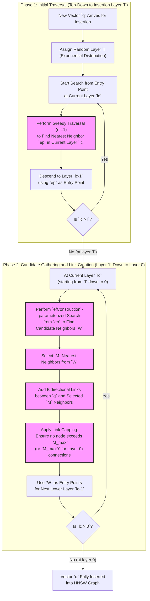

# Hierarchical Navigable Small Worlds (HNSW)

Image 1: A high-level overview of the Hierarchical Navigable Small World (HNSW) graph structure. (Source: [HNSW [[2]](https://www.pinecone.io/learn/series/faiss/hnsw/)])

Hierarchical Navigable Small World (HNSW) is a leading graph-based algorithm for Approximate Nearest Neighbor (ANN) search, known for delivering state-of-the-art recall with sub-millisecond query speeds on billion-scale vector datasets [[1]](https://arxiv.org/abs/1603.09320). Its performance surpasses methods like Inverted File (IVF) or Locality-Sensitive Hashing (LSH), making it a cornerstone of modern vector databases. Despite its widespread use, HNSW's internal mechanics, which blend probabilistic data structures with graph theory, remain complex. This article demystifies HNSW by breaking down its core principles and construction. We will also cover a practical implementation using the Faiss library, exploring the parameters that drive performance [[2]](https://www.pinecone.io/learn/series/faiss/hnsw). We begin by examining the two foundational concepts HNSW combines: probability skip lists and navigable small world graphs.

## Foundations of HNSW

In the landscape of ANN algorithms, HNSW belongs to the category of proximity graphs. In these graphs, nodes represent vectors, and edges connect vectors that are close to each other in the given metric space, such as Euclidean distance [[3]](https://publications.hse.ru/mirror/pubs/share/folder/x5p6h7thif/direct/128296059). HNSW makes a significant leap by introducing a hierarchy to this concept, drawing inspiration from two fundamental data structures: the probabilistic skip list and navigable small world graphs.

### Probabilistic Skip List

A skip list is a probabilistic data structure that enables fast search, insertion, and deletion within a sorted list, achieving an average complexity of O(log n) [[4]](https://www.geeksforgeeks.org/dsa/skip-list), [[5]](https://en.wikipedia.org/wiki/Skip_list). It combines the search efficiency of a sorted array with the flexible insertion of a linked list.

The structure consists of multiple layers of linked lists. The bottom layer is a standard sorted linked list containing all elements. Each subsequent layer acts as an "express lane," containing a subset of the elements from the layer below it. An element in layer `i` has a certain probability, `p`, of also appearing in layer `i+1`. This probability `p` is a key parameter, typically set to 0.5 or 0.25. On average, each element is present in `1 / (1 - p)` lists, creating a hierarchy where higher layers are sparse and allow for long jumps across the list [[2]](https://www.pinecone.io/learn/series/faiss/hnsw).

A search begins at the highest, most sparse layer. The algorithm traverses forward until it finds an element greater than the search key or reaches the end of the list. It then drops down to the next layer from the previous position and repeats the process. This continues until it reaches the bottom layer, where it performs a final linear search to find the target element. This layered traversal is much faster than a simple linear scan of the entire list.

Image 2: A probability skip list structure. The search for element 20 starts at the top layer, moves forward, and drops down when it would otherwise overshoot the target. (Source: [Similarity Search, Part 4: Hierarchical Navigable Small World (HNSW) [[9]](https://towardsdatascience.com/similarity-search-part-4-hierarchical-navigable-small-world-hnsw-2aad4fe87d37)])

HNSW inherits the core idea of this multi-layered structure. Instead of organizing sorted numbers in linked lists, HNSW applies this hierarchical principle to proximity graphs of high-dimensional vectors.

### Navigable Small World Graphs

Navigable Small World (NSW) graphs are networks designed for efficient decentralized routing [[8]](https://www.emergentmind.com/topics/navigable-small-world-nsw). The concept of a "small-world network," first formalized by Watts and Strogatz, describes graphs with two key properties: a high clustering coefficient (friends of a node are likely to be friends with each other) and a low average path length (any two nodes are connected by a short chain of connections) [[6]](https://en.wikipedia.org/wiki/Small-world_network), [[7]](https://www.nature.com/articles/30918). NSW graphs achieve this by combining short-range links for local navigation and long-range links to bridge distant parts of the graph. This combination allows a greedy search algorithm to find short paths with a complexity that scales polylogarithmically, `O(log^k n)` [[9]](https://towardsdatascience.com/similarity-search-part-4-hierarchical-navigable-small-world-hnsw-2aad4fe87d37).

The NSW graph is built by inserting elements one by one in a random order. Each new node is connected to its `M` nearest neighbors from the set of already existing nodes. The links created early in the construction process, when the graph is sparse, tend to be long-range. These long-range links become crucial for efficient navigation later on, acting as bridges between different regions of the graph [[3]](https://publications.hse.ru/mirror/pubs/share/folder/x5p6h7thif/direct/128296059).

Image 3: The greedy search process in a Navigable Small World graph. The search path follows the neighbors that are closest to the query. (Source: [Similarity Search, Part 4: Hierarchical Navigable Small World (HNSW) [[9]](https://towardsdatascience.com/similarity-search-part-4-hierarchical-navigable-small-world-hnsw-2aad4fe87d37)])

The search process in an NSW graph uses a greedy routing strategy. It starts at a designated entry point and, at each step, evaluates the distances from the query vector to all neighbors ("friends") of the current node. It then moves to the neighbor that is closest to the query [[2]](https://www.pinecone.io/learn/series/faiss/hnsw). This process repeats until the algorithm reaches a node where none of its neighbors are closer to the query than the node itself. This node is a local minimum and is returned as the search result.

The routing process typically has two phases. The initial "zoom-out" phase involves traversing long-range links between low-degree nodes, allowing the search to quickly cross large distances in the vector space. As the search gets closer to the target region, it enters a "zoom-in" phase, where it moves through higher-degree nodes with shorter-range links to refine the search and pinpoint the nearest neighbor [[3]](https://publications.hse.ru/mirror/pubs/share/folder/x5p6h7thif/direct/128296059).

A key challenge with this greedy approach is the risk of getting trapped in a local minimum far from the true nearest neighbor. This "early stopping" problem can reduce search accuracy, or recall, particularly in highly clustered or discontinuous data distributions [[11]](https://medium.com/thedeephub/understading-hnsw-hierarchical-navigable-small-world-ff1a72d98605). To mitigate this, the graph's connectivity must be carefully managed. Increasing the average number of connections (degree) for each node makes the graph denser, reducing the likelihood of getting stuck but also increasing the construction time and the number of distance calculations during search. This creates a fundamental tradeoff between recall, search latency, and memory usage.

### Creating HNSW

The key innovation of HNSW is the application of the skip list's hierarchical principle to Navigable Small World graphs [[1]](https://arxiv.org/abs/1603.09320). It creates a multi-layered structure where links are separated by their characteristic distance scales. The top layers contain only the long-range links, connecting distant nodes, while the bottom layers are dense with short-range links connecting close neighbors.

Image 4: The layered graph structure of HNSW. Higher layers are sparse with long-range links, while lower layers are dense with short-range links. (Source: [HNSW [[2]](https://www.pinecone.io/learn/series/faiss/hnsw/)])

The search process in HNSW mirrors this hierarchical design. It starts at an entry point in the topmost layer, which contains only the sparsest, longest links. The algorithm performs a greedy search on this layer until it finds a local minimum. This local minimum then serves as the entry point for the layer below, which has shorter links and a higher density of nodes. This process of greedy searching and descending is repeated layer by layer. To improve search quality, instead of finding only one nearest neighbor on each layer, HNSW uses a parameter `efSearch` to find a set of the closest neighbors. Each of these neighbors is then used as an entry point on the next layer, making the search more robust and less likely to get stuck in a poor local minimum [[9]](https://towardsdatascience.com/similarity-search-part-4-hierarchical-navigable-small-world-hnsw-2aad4fe87d37).

Image 5: The search process in HNSW starts at the top layer and descends, using the local minimum of each layer as the entry point for the next. (Source: [HNSW [[2]](https://www.pinecone.io/learn/series/faiss/hnsw/)])

This layered approach allows HNSW to achieve logarithmic search complexity, `O(log n)`. The initial search in the top layers quickly navigates to the approximate region of the nearest neighbor, similar to the "zoom-out" phase in NSW. The subsequent searches in the lower, denser layers refine this search, akin to the "zoom-in" phase, but in a more structured manner. By separating links by scale, HNSW avoids the high cost of traversing the entire dense graph from the start, leading to performance gains over a flat NSW structure.

With the layered foundations and search behavior clarified, we now turn to the practical iterative algorithm used to construct an HNSW graph one vector at a time.

## Graph Construction

The HNSW graph is built by inserting vectors one by one. The process for each insertion involves assigning the new vector a layer, finding its approximate neighbors, and establishing connections.

First, each new vector is randomly assigned a maximum layer `l` based on an exponentially decaying probability distribution [[1]](https://arxiv.org/abs/1603.09320), [[12]](https://zilliz.com/learn/hierarchical-navigable-small-worlds-HNSW). This ensures that very few vectors are present in the top layers, while the bottom layer (layer 0) contains all vectors. The formula used is `l = floor(-ln(uniform(0,1)) * mL)`, where `mL` is a normalization factor or level multiplier.

Image 6: A new vector is assigned a random maximum layer `l` and is inserted into all layers from `l` down to 0. (Source: [HNSW [[2]](https://www.pinecone.io/learn/series/faiss/hnsw/)])

The `mL` parameter is important for performance. The creators of HNSW found that performance is optimal when the overlap of shared neighbors between layers is minimized. A smaller `mL` pushes more vectors to lower layers, reducing overlap, but can increase the number of traversals needed during a search. The optimal value is typically set to `1/ln(M)`, which balances these factors to maintain logarithmic search complexity [[2]](https://www.pinecone.io/learn/series/faiss/hnsw).

The insertion process has two phases. In phase one, the algorithm starts at the top layer of the graph and performs a simple greedy search (using `ef=1`, meaning it only considers one nearest neighbor candidate at each step) to find the closest element. This element becomes the entry point for the layer below. This top-down traversal continues until it reaches the randomly assigned insertion layer `l` for the new vector.

In phase two, starting from layer `l` and moving down to layer 0, the algorithm performs a more thorough search for neighbors. At each layer, it uses a search parameter `efConstruction` to find a set of candidate neighbors. From this candidate set, `M` vectors are selected to be connected to the new vector. These connections are bidirectional.

The number of connections per node is capped. For all layers above the base layer, a node can have at most `M_max` connections. For the base layer (layer 0), this cap is typically doubled to `M_max0` to ensure high connectivity for fine-grained search. If adding a new connection causes a node to exceed its limit, the connections are pruned to maintain the cap. The candidates found with `efConstruction` at one layer also serve as entry points for the search in the next layer down, ensuring the graph remains navigable as it is built.

Image 7: `M` is the number of neighbors connected during insertion, while `M_max` and `M_max0` are hard limits on the total connections a node can have. (Source: [HNSW [[2]](https://www.pinecone.io/learn/series/faiss/hnsw/)])

Equipped with a clear picture of how the hierarchical graph is built, we now examine the concrete Faiss implementation, index internals, parameter controls, and empirical tradeoffs observed on real workloads.



Image 8: A flowchart illustrating the two-phase HNSW graph construction process for a new vector insertion.

## Implementation of HNSW

We will implement HNSW using the Facebook AI Similarity Search (Faiss) library and test different construction and search parameters to see how they affect index performance [[13]](https://towardsdatascience.com/ivfpq-hnsw-for-billion-scale-similarity-search-89ff2f89d90e).

1.  First, we initialize the HNSW index. The `IndexHNSWFlat` class stores the full, uncompressed vectors.
    ```python
    import faiss
    import numpy as np
    
    # setup our HNSW parameters
    d = 128 # vector size
    M = 32
    
    index = faiss.IndexHNSWFlat(d, M)
    print(index.hnsw)
    ```
    It outputs:
    ```text
    <faiss.impl.HNSW.HNSW; proxy of <Swig Object of type 'faiss::HNSW *' at 0x7f1234567890> >
    ```
    Here, `M` is the number of neighbors added to each vertex during insertion. However, the parameters `M_max` and `M_max0` are set automatically by Faiss. The `set_default_probas` method, called during initialization, sets `M_max` to `M` and `M_max0` to `2 * M` [[2]](https://www.pinecone.io/learn/series/faiss/hnsw).

2.  Before we add data to the index, it has no layers.
    ```python
    # the HNSW index starts with no levels
    print(index.hnsw.max_level)
    
    # and levels (or layers) are empty too
    levels = faiss.vector_to_array(index.hnsw.levels)
    print(np.bincount(levels))
    ```
    It outputs:
    ```text
    -1
    array([], dtype=int64)
    ```
    To run these examples, you'll need a dataset. We'll use Sift1M, which you can prepare with a script. Let's assume you have the data loaded into a NumPy array called `xb`.

3.  After building the index by adding our data, the layers are populated. This step creates the multi-layered graph structure.
    ```python
    # Assume xb is your Sift1M dataset with 1M vectors
    index.add(xb)
    
    # After adding data, we can check the levels
    print(index.hnsw.max_level)
    levels = faiss.vector_to_array(index.hnsw.levels)
    print(np.bincount(levels))
    ```
    It outputs:
    ```text
    4
    array([969141,  29680,   1135,     40,      4])
    ```
    This output shows the index has 5 layers (0 to 4). As expected from the probabilistic assignment, the vast majority of vectors (969,141) reside in the bottom layer, with exponentially fewer vectors in each higher layer.

4.  The graph also has a single entry point, which is one of the vectors in the highest layer. This node serves as the starting point for all searches.
    ```python
    print(index.hnsw.entry_point)
    ```
    It outputs:
    ```text
    118295
    ```

### Graph Structure

The distribution of vectors across layers is determined by the `set_default_probas` method, which is called when the index is initialized. It takes `M` and a level multiplier `m_L` (which Faiss calls `levelMult`) as input. By default, `m_L` is set to `1 / log(M)` [[2]](https://www.pinecone.io/learn/series/faiss/hnsw).

1.  We can replicate this logic in Python to understand how layer probabilities and cumulative neighbor counts are calculated. This function calculates the probability of a new node being assigned to each level, based on an exponential decay function. It also computes the cumulative number of neighbors a node would have if it were inserted at a given level, accounting for the fact that layer 0 has `2*M` connections while higher layers have `M`.
    ```python
    def set_default_probas(M: int, m_L: float):
        nn = 0
        cum_nneighbor_per_level = []
        level = 0
        assign_probas = []
        while True:
            proba = np.exp(-level / m_L) * (1 - np.exp(-1 / m_L))
            if proba < 1e-9:
                break
            assign_probas.append(proba)
            # In Faiss, M_max0 is 2*M, M_max is M
            M2 = 2 * M
            nn += M2 if level == 0 else M
            cum_nneighbor_per_level.append(nn)
            level += 1
        return assign_probas, cum_nneighbor_per_level
    
    assign_probas, cum_nneighbor_per_level = set_default_probas(32, 1/np.log(32))
    print(f"assign_probas: {assign_probas}")
    print(f"cum_nneighbor_per_level: {cum_nneighbor_per_level}")
    ```
    It outputs:
    ```text
    assign_probas: [0.9692332179339311, 0.02993801867137812, 0.0008226490333796853, 2.138234316914594e-05, 5.259792482833633e-07, 1.238466161476902e-08]
    cum_nneighbor_per_level: [64, 96, 128, 160, 192, 224]
    ```
    This shows the high probability of a vector being assigned to layer 0, with probabilities decaying exponentially for higher layers. `cum_nneighbor_per_level` shows the cumulative number of neighbors an element inserted at a given level would have.

2.  The `random_level` function uses these probabilities to assign a layer to a new vector. It generates a random number and determines which layer's probability bucket it falls into.
    ```python
    def random_level(assign_probas, rng):
        f = rng.random()
        for i, proba in enumerate(assign_probas):
            f -= proba
            if f < 0:
                return i
        return len(assign_probas) - 1
    ```

3.  We can simulate this to see how closely it matches the actual Faiss distribution for 1 million vectors. This helps verify our understanding of the internal mechanics.
    ```python
    rng = np.random.default_rng(123)
    levels = [random_level(assign_probas, rng) for _ in range(1000000)]
    print(np.bincount(levels))
    ```
    It outputs:
    ```text
    array([969348,  29828,    813,     11,      0,      0])
    ```
    This distribution is very close to what Faiss produces, confirming our understanding of the layer assignment mechanism. The Faiss implementation ensures that at least one vertex is placed at the highest level to act as the entry point [[2]](https://www.pinecone.io/learn/series/faiss/hnsw).

Image 9: A comparison of vertex distribution across layers between the actual Faiss implementation and a Python simulation, showing a close match. (Source: [HNSW [[2]](https://www.pinecone.io/learn/series/faiss/hnsw/)])

### HNSW Performance

To understand the practical tradeoffs, we can perform a parameter sweep on the Sift1M dataset, varying `M`, `efSearch`, and `efConstruction`. These parameters control the balance between recall, search speed, and memory usage [[14]](https://milvus.io/ai-quick-reference/what-are-the-key-configuration-parameters-for-an-hnsw-index-such-as-m-and-efconstructionefsearch-and-how-does-each-influence-the-tradeoff-between-index-size-build-time-query-speed-and-recall).

1.  The parameters are set on the Faiss index object. `efConstruction` must be set before building the index, while `efSearch` can be adjusted anytime before searching.
    ```python
    # Assume xq is your query set
    # index = faiss.IndexHNSWFlat(d, M)
    
    index.hnsw.efConstruction = 64 # efConstruction
    index.add(xb) # build the index
    
    index.hnsw.efSearch = 32 # efSearch
    # D, I = index.search(xq[:1000], k=1)
    ```

2.  The recall performance is heavily influenced by these parameters.
    
    Image 10: Recall@1 performance on Sift1M for different parameter combinations. (Source: [HNSW [[2]](https://www.pinecone.io/learn/series/faiss/hnsw/)])
    Higher values for `M` (graph connectivity) and `efSearch` (search-time beam width) substantially raise recall. A reasonably high `efConstruction` (build-time beam width) is also necessary to build a high-quality graph. Increasing `efConstruction` can often compensate for lower `M` and `efSearch` values, achieving higher recall at the cost of longer build times [[2]](https://www.pinecone.io/learn/series/faiss/hnsw).

3.  Search time also increases with these parameters.
    
    Image 11: Search time for 1000 queries on Sift1M. The y-axis is logarithmic. (Source: [HNSW [[2]](https://www.pinecone.io/learn/series/faiss/hnsw/)])
    There is a clear tradeoff between recall and search time. For a batch of 1000 queries, achieving high recall (>95%) can take tens of milliseconds. It's often assumed that `efConstruction` has little impact on search time, but this is only true for small query volumes. For larger batches, a higher `efConstruction` leads to a denser, more complex graph that takes longer to traverse.

4.  However, when searching for just a single query, the impact of `efConstruction` on latency is much smaller, especially at lower `M` values. This makes `efConstruction` a great parameter to increase for better recall if your application handles queries one by one.
    
    Image 12: Search time for a single query on Sift1M, showing the limited impact of `efConstruction`. (Source: [HNSW [[2]](https://www.pinecone.io/learn/series/faiss/hnsw/)])

5.  Finally, memory usage is a critical consideration.
    
    Image 13: Memory usage of the HNSW index on Sift1M as a function of `M`. (Source: [HNSW [[2]](https://www.pinecone.io/learn/series/faiss/hnsw/)])
    Only the `M` parameter affects the final index size. `efConstruction` and `efSearch` do not change memory usage as they only control the search process during build and query time, respectively. The memory cost is considerable: even a small `M` of 2 results in an index over 0.5GB for Sift1M, and this scales up to nearly 5GB for `M=512` [[17]](https://www.youtube.com/watch?v=QvKMwLjdK-s). This highlights the three-way tradeoff between recall, latency, and memory that engineers must balance.

### Improving Memory Usage and Search Speeds

The high memory footprint of `IndexHNSWFlat` is a primary challenge. To mitigate this, common strategies include vector compression and index partitioning. First, you can compress the stored vectors using Product Quantization (PQ). This reduces memory usage but comes at the cost of lower recall, as the distance calculations are performed on compressed, lossy vector representations.

Second, you can wrap the HNSW index within an Inverted File (IVF) structure. In this setup, HNSW is used as a coarse quantizer to quickly identify the most promising database partitions (Voronoi cells) to search, rather than searching the entire dataset. This can improve search speed, especially for very large datasets. Combining IVF and PQ with HNSW is a powerful technique for building highly optimized composite indexes, which is covered in more detail in other resources [[21]](https://www.pinecone.io/learn/series/faiss/composite-indexes/).

## References

- [1] https://arxiv.org/abs/1603.09320
- [2] https://www.pinecone.io/learn/series/faiss/hnsw
- [3] https://publications.hse.ru/mirror/pubs/share/folder/x5p6h7thif/direct/128296059
- [4] https://www.geeksforgeeks.org/dsa/skip-list
- [5] https://en.wikipedia.org/wiki/Skip_list
- [6] https://en.wikipedia.org/wiki/Small-world_network
- [7] https://www.nature.com/articles/30918
- [8] https://www.emergentmind.com/topics/navigable-small-world-nsw
- [9] https://towardsdatascience.com/similarity-search-part-4-hierarchical-navigable-small-world-hnsw-2aad4fe87d37
- [10] https://arxiv.org/html/2412.01940v2
- [11] https://medium.com/thedeephub/understading-hnsw-hierarchical-navigable-small-world-ff1a72d98605
- [12] https://zilliz.com/learn/hierarchical-navigable-small-worlds-HNSW
- [13] https://towardsdatascience.com/ivfpq-hnsw-for-billion-scale-similarity-search-89ff2f89d90e
- [14] https://milvus.io/ai-quick-reference/what-are-the-key-configuration-parameters-for-an-hnsw-index-such-as-m-and-efconstructionefsearch-and-how-does-each-influence-the-tradeoff-between-index-size-build-time-query-speed-and-recall
- [15] https://mbrenndoerfer.com/writing/hnsw-index-vector-search-architecture
- [16] https://medium.com/@aefselinates/ive-spent-months-stress-testing-vector-search-algorithms-and-hierarchical-navigable-small-worlds-b71d76a18660
- [17] https://www.youtube.com/watch?v=QvKMwLjdK-s
- [18] https://gsitechnology.com/not-all-hnsw-indices-are-made-equally
- [19] https://redis.io/blog/how-hnsw-algorithms-can-improve-search
- [20] https://developer.nvidia.com/blog/accelerating-vector-search-fine-tuning-gpu-index-algorithms
- [21] https://www.pinecone.io/learn/series/faiss/composite-indexes/