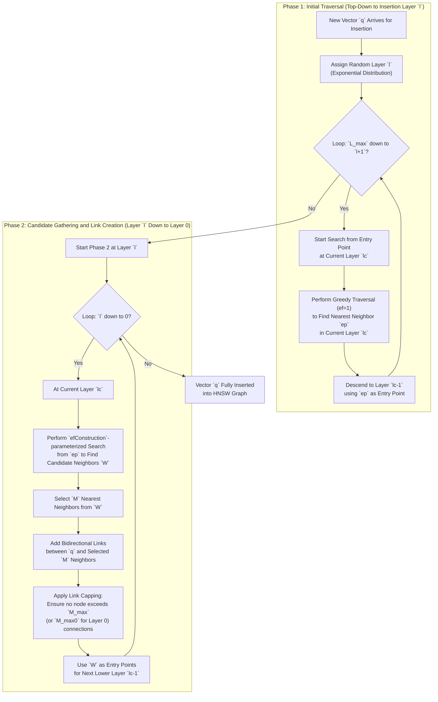

# A Deep Dive into HNSW: The Unsung Hero of Vector Search

Hierarchical Navigable Small World (HNSW) is one of the most powerful algorithms in the world of Approximate Nearest Neighbor (ANN) search. It consistently delivers state-of-the-art recall with sub-millisecond search speeds on massive vector datasets, outperforming older methods like Inverted File (IVF) indexes or Locality-Sensitive Hashing (LSH). This performance has made HNSW the engine behind many production vector databases and retrieval systems, from semantic search to large-scale recommendation engines [[25]](https://www.mongodb.com/resources/basics/hierarchical-navigable-small-world).

Image 1: Hierarchical Navigable Small World (HNSW) graph overview. (Source: [Pinecone](https://www.pinecone.io/learn/series/faiss/hnsw))

Despite its widespread adoption, the internal mechanics of HNSW can be difficult to grasp. It combines concepts from probabilistic data structures and graph theory in a non-trivial way.

This article will demystify HNSW, breaking down its theoretical foundations and the practical details of its construction. Towards the end, we will look at how to implement HNSW using Facebook AI Similarity Search (Faiss) and explore which parameter settings give us the performance we need [[15]](https://www.pinecone.io/learn/series/faiss/hnsw). Having oriented ourselves on why HNSW matters, let's examine the two core pillars it is built upon: probability skip lists and navigable small world graphs.

## Foundations of HNSW

HNSW belongs to the category of graph-based ANN algorithms, specifically proximity graphs. In these graphs, nodes represent vectors, and edges connect vectors that are close to each other based on a chosen distance metric, like Euclidean distance. HNSW takes this a step further by introducing a hierarchy, drawing inspiration from two powerful data structures: the probability skip list and navigable small world graphs.

### Probability Skip List

A probability skip list is a data structure that allows for fast search, insertion, and deletion of elements in a sorted list, achieving an average time complexity of O(log n) [[1]](https://www.geeksforgeeks.org/dsa/skip-list), [[3]](https://brilliant.org/wiki/skip-lists). It is built from multiple layers of linked lists. The bottom layer is a standard sorted linked list containing all elements. Each subsequent layer acts as an "express lane," containing a subset of the elements from the layer below it. An element in layer `i` has a fixed probability `p` (often 1/2 or 1/4) of also appearing in layer `i+1` [[2]](https://en.wikipedia.org/wiki/Skip_list).

Image 2: A probability skip list structure. We start on the top layer. If our current key is greater than the key we are searching for (or we reach the end), we drop to the next layer. (Source: [Pinecone](https://www.pinecone.io/learn/series/faiss/hnsw))

To search for an element, you start at the highest, sparsest layer. You traverse the list until you find an element greater than or equal to your target. At that point, you drop down to the next layer from the previous node and repeat the process. This allows you to quickly skip over large portions of the list, "zooming in" as you descend through the layers [[2]](https://en.wikipedia.org/wiki/Skip_list).

HNSW inherits this layered, probabilistic approach. Instead of simple linked lists, it uses graphs at each layer, and the random assignment of nodes to layers follows a similar exponentially decaying probability distribution [[27]](https://zilliz.com/learn/hierarchical-navigable-small-worlds-HNSW).

### Navigable Small World Graphs

Navigable Small World (NSW) graphs are a specific type of small-world network, a concept first formally described by Watts and Strogatz in 1998. These networks are defined by two key properties: a high clustering coefficient (friends of a friend are also likely to be friends) and a low average path length, meaning any two nodes can be connected by a short chain of connections [[50]](https://en.wikipedia.org/wiki/Small-world_network). NSW graphs apply this principle to vector spaces. They are networks designed for efficient decentralized greedy routing [[4]](https://www.emergentmind.com/topics/navigable-small-world-nsw). They combine two types of connections: short-range links that connect nearby nodes (approximating a Delaunay graph) and long-range links that bridge distant parts of the graph. This structure ensures that short paths exist between any two nodes and, crucially, that these paths can be found using only local information [[4]](https://www.emergentmind.com/topics/navigable-small-world-nsw). The search complexity in such graphs scales polylogarithmically with the number of nodes, `O(log^k |V|)` [[5]](https://www.pinecone.io/learn/series/faiss/hnsw).

Image 3: The search process through an NSW graph. Starting at a pre-defined entry point, the algorithm greedily traverses to connected vertices that are nearer to the query vector. (Source: [Pinecone](https://www.pinecone.io/learn/series/faiss/hnsw))

The search process in an NSW graph is a greedy one. It begins at a designated entry point and, at each step, moves from the current node to the neighbor that is closest to the query vector [[5]](https://www.pinecone.io/learn/series/faiss/hnsw). This process repeats until the algorithm reaches a local minimum—a node where none of its neighbors are closer to the query than the node itself. At this point, the search terminates [[6]](https://medium.com/thedeephub/understading-hnsw-hierarchical-navigable-small-world-ff1a72d98605).

This greedy routing can be seen as having two phases. The search begins with a "zoom-out" phase, traversing long-range links between low-degree vertices to quickly navigate to the general region of the target. As the search gets closer to the target, it enters a "zoom-in" phase, moving through higher-degree vertices with shorter links to refine the position [[7]](https://towardsdatascience.com/similarity-search-part-4-hierarchical-navigable-small-world-hnsw-2aad4fe87d37).

The main weakness of this approach is the risk of getting trapped in a local minimum far from the true nearest neighbor, especially if the graph lacks sufficient connectivity [[6]](https://medium.com/thedeephub/understading-hnsw-hierarchical-navigable-small-world-ff1a72d98605). Increasing the average degree of vertices (the number of neighbors) can improve recall by providing more paths, but it also increases construction time and the number of distance calculations during search. This creates a fundamental tradeoff between accuracy, speed, and memory. Furthermore, performance can degrade in very high-dimensional spaces due to the "curse of dimensionality." As dimensions increase, the distance between any two points tends to become uniform, making it difficult for the greedy search to distinguish between true neighbors and other points [[45]](https://mbrenndoerfer.com/writing/hnsw-index-vector-search-architecture).

Recent research offers a counter-intuitive perspective on this high-dimensional behavior. The "hubness" phenomenon, where a small subset of nodes (hubs) appear disproportionately in the neighbor lists of many other nodes, may create an intrinsic "highway" system within the graph. According to the "Hub Highway Hypothesis," these well-connected hubs allow for rapid traversal across the graph, potentially making the explicit hierarchy of HNSW redundant for high-dimensional data [[24]](https://arxiv.org/html/2412.01940v2).

### Creating HNSW

HNSW's key innovation is applying the hierarchical structure of a skip list to an NSW graph [[9]](https://medium.com/@EleventhHourEnthusiast/paper-review-efficient-and-robust-approximate-nearest-neighbor-search-using-hierarchical-navigable-07f7241a0baf). Instead of a single graph, HNSW builds a multi-layered structure of proximity graphs [[10]](https://khoury.northeastern.edu/home/pandey/courses/cs7270/fall25/papers/vectordb/HNSW.pdf). The top layers contain only long-range links connecting a sparse subset of nodes, while the bottom layers become progressively denser with more nodes and shorter-range links. Layer 0 contains all the nodes.

Image 4: Layered graph of HNSW. The top layer is our entry point and contains only the longest links. As we move down the layers, the link lengths become shorter and more numerous. (Source: [Pinecone](https://www.pinecone.io/learn/series/faiss/hnsw))

The search process in HNSW mirrors this structure. It starts at an entry point in the highest layer and performs a greedy search to find the nearest neighbor in that layer. This neighbor then becomes the entry point for the search in the layer below. This process repeats, descending layer by layer, until it reaches the bottom layer (layer 0). The final greedy search in the dense base layer yields the approximate nearest neighbors to the query [[7]](https://towardsdatascience.com/similarity-search-part-4-hierarchical-navigable-small-world-hnsw-2aad4fe87d37).

Image 5: The search process through the multi-layer structure of an HNSW graph. (Source: [Pinecone](https://www.pinecone.io/learn/series/faiss/hnsw))

This hierarchical approach provides a significant performance boost over a flat NSW. By starting with long-range links, the search quickly navigates to the correct region of the vector space. The progressive refinement through denser, shorter-range links at lower layers ensures high accuracy. This strategy avoids the high cost of traversing the entire dense graph from the beginning and achieves a logarithmic search complexity of O(log n) [[7]](https://towardsdatascience.com/similarity-search-part-4-hierarchical-navigable-small-world-hnsw-2aad4fe87d37).

With the layered foundations and search behavior clarified, we now turn to the iterative algorithm used to construct an HNSW graph one vector at a time.

## Graph Construction

The HNSW graph is built by inserting vectors one by one. When a new vector is added, it is assigned a maximum layer `l` drawn randomly from an exponentially decaying probability distribution. This ensures that most vectors exist only in the lower layers, while a few "tall" vectors reach the upper layers to serve as long-range links [[24]](https://arxiv.org/html/2412.01940v2), [[25]](https://www.mongodb.com/resources/basics/hierarchical-navigable-small-world), [[26]](https://medium.com/@adnanmasood/the-shortcut-through-space-hierarchical-navigable-small-worlds-hnsw-in-vector-search-4df5aa755100). The vector is then inserted into all layers from `l` down to 0.

Image 6: The probability function is repeated for each layer (other than layer 0). The vector is added to its insertion layer and every layer below it. (Source: [Pinecone](https://www.pinecone.io/learn/series/faiss/hnsw))

This probability distribution is controlled by a level multiplier parameter `m_L`. The creators of HNSW found that the best performance is achieved by minimizing the overlap of shared neighbors across layers. A rule of thumb for the optimal `m_L` value that balances this overlap with search traversals is `1/ln(M)`, where `M` is the number of neighbors connected to each new node [[37]](https://www.pinecone.io/learn/series/faiss/hnsw).

The insertion process for a new vector `q` occurs in two phases [[29]](https://www.pinecone.io/learn/series/faiss/hnsw).



Image 7: Flowchart illustrating the two-phase HNSW graph construction process for a new vector insertion.

First, the algorithm starts at the top layer and performs a simple greedy search (with a search depth parameter `ef=1`) to find the nearest node to `q`. This node becomes the entry point for the layer below. This is repeated until the algorithm reaches layer `l`.

Second, starting from layer `l` and going down to layer 0, a more thorough search is performed. At each layer, the algorithm uses the entry points from the previous layer to find a set of `efConstruction` nearest neighbors. From this candidate set, `M` neighbors are selected and bidirectionally linked to the new node `q`. These `efConstruction` candidates also serve as the entry points for the next layer down. During this process, link capping rules are applied. The number of connections for any node in the upper layers is limited to `M_max`, while nodes in the base layer (layer 0) can have up to `M_max0` connections, which is typically double `M_max` [[40]](https://www.pinecone.io/learn/series/faiss/hnsw). This allows the base layer to be denser for more accurate local search, while keeping upper layers sparse for efficient long-range traversal.

Image 8: Explanation of the number of links assigned to each vertex and the effect of M, M_max, and M_max0. (Source: [Pinecone](https://www.pinecone.io/learn/series/faiss/hnsw))

Equipped with a clear picture of how the hierarchical graph is built, we now examine the concrete Faiss implementation, index internals, parameter controls, and empirical tradeoffs observed on real workloads.

## Implementation of HNSW

We will now explore how to implement HNSW using the Faiss library and test different construction and search parameters to see how they affect performance.

1.  We start by initializing a basic HNSW index. We need to specify the vector dimensionality `d` and the number of neighbors `M` to connect for each new vertex.
    
    ```python
    import faiss
    import numpy as np
    
    # setup our HNSW parameters
    d = 128  # vector size
    M = 32
    
    index = faiss.IndexHNSWFlat(d, M)
    print(index.hnsw)
    ```
    
    It outputs:
    
    ```text
    >
    ```
    
2.  The `M` parameter sets the base number of neighbors, but the actual per-layer limits, `M_max` and `M_max0`, are set automatically by Faiss. When the index is initialized, it calls a method called `set_default_probas`, which sets `M_max` equal to `M` and `M_max0` (for layer 0) equal to `2 * M` [[15]](https://www.pinecone.io/learn/series/faiss/hnsw), [[33]](https://www.youtube.com/watch?v=QvKMwLjdK-s). Before we add any data, the index has no layers.
    
    ```python
    # the HNSW index starts with no levels
    print(index.hnsw.max_level)
    
    # and levels (or layers) are empty too
    levels = faiss.vector_to_array(index.hnsw.levels)
    print(np.bincount(levels))
    ```
    
    It outputs:
    
    ```text
    -1
    array([], dtype=int64)
    ```
    
3.  After we add our data (here `xb` represents our database vectors), Faiss builds the graph, and the layers are populated.
    
    ```python
    # xb is our 1M vector dataset
    index.add(xb)
    
    print(f"Maximum layer: {index.hnsw.max_level}")
    levels = faiss.vector_to_array(index.hnsw.levels)
    print(f"Distribution of levels: {np.bincount(levels)}")
    ```
    
    It outputs:
    
    ```text
    Maximum layer: 4
    Distribution of levels: [968132  31206   639    22     1]
    ```
    
    This shows the graph has 5 layers (0 to 4), with the vast majority of vectors residing in the bottom layer. The index also has a designated entry point, which is always a node in the highest layer.
    
    ```python
    print(f"Entry point: {index.hnsw.entry_point}")
    ```
    
    It outputs:
    
    ```text
    Entry point: 118295
    ```
    

### Graph Structure

The probabilistic assignment of vectors to layers is a core part of HNSW. The `set_default_probas` method in Faiss uses the `M` value to determine these probabilities. It passes `M` and a level multiplier `m_L` (calculated as `1 / log(M)`) to an internal function that builds the probability distribution [[31]](https://www.pinecone.io/learn/series/faiss/hnsw).

1.  We can replicate this logic in Python to understand how it works. This function calculates the probability of a new node being assigned to each level, stopping when the probability becomes negligible. It also computes the cumulative number of neighbors.
    
    ```python
    def set_default_probas(M: int, m_L: float):
        nn = 0
        cum_nneighbor_per_level = []
        level = 0
        assign_probas = []
        
        while True:
            proba = np.exp(-level / m_L) * (1 - np.exp(-1 / m_L))
            if proba < 1e-9:
                break
            assign_probas.append(proba)
            # In Faiss, M_max0 is M*2
            nn += (M * 2) if level == 0 else M
            cum_nneighbor_per_level.append(nn)
            level += 1
        return assign_probas, cum_nneighbor_per_level
    
    assign_probas, cum_nneighbor_per_level = set_default_probas(32, 1/np.log(32))
    print(f"Probas: {assign_probas}")
    print(f"Cum Neighbors: {cum_nneighbor_per_level}")
    ```
    
    It outputs:
    
    ```text
    Probas: [0.96875, 0.0302734375, 0.000946044921875, 2.956390380859375e-05, 9.238719940185547e-07]
    Cum Neighbors: [64, 96, 128, 160, 192]
    ```
    
    As you can see, the probability of being assigned to layer 0 is ~97%, decaying rapidly for higher layers.
    
2.  The `random_level` function uses this probability distribution. It generates a random number and iterates through `assign_probas` to select a layer for a new vector.
    
    ```python
    def random_level(assign_probas):
        f = np.random.random()
        for i, proba in enumerate(assign_probas):
            f -= proba
            if f < 0:
                return i
        return len(assign_probas) - 1
    ```
    
3.  Simulating this for 1,000,000 vectors gives a distribution very close to what Faiss produced internally, confirming our understanding of the mechanism.
    
    ```python
    # simulate for 1M vectors
    rng = np.random.RandomState(123)
    levels = [random_level(assign_probas) for _ in range(1000000)]
    print(np.bincount(levels))
    ```
    
    It outputs:
    
    ```text
    [968948  30403    635     14      0]
    ```
    
    
    
    Image 9: Distribution of vertices across layers in both the Faiss implementation (left) and the Python implementation (right). (Source: [Pinecone](https://www.pinecone.io/learn/series/faiss/hnsw))
    

### HNSW Performance

The performance of HNSW is controlled by three main parameters:

*   `M`: The number of connections made for each new vertex during construction.
*   `efConstruction`: The size of the candidate list to explore during index construction.
*   `efSearch`: The size of the candidate list to explore during search.

We tested these parameters on the Sift1M dataset [[20]](https://www.pinecone.io/learn/series/faiss/hnsw).

1.  The `efConstruction` value must be set before building the index, while `efSearch` can be adjusted any time before searching.
    
    ```python
    # M is set at initialization
    index = faiss.IndexHNSWFlat(d, M)
    
    # efConstruction is set before building
    index.hnsw.efConstruction = efConstruction
    index.add(xb)  # build the index
    
    # efSearch can be set before searching
    index.hnsw.efSearch = efSearch
    index.search(xq[:1000], k=1)
    ```
    
    
    
    Image 10: Recall@1 performance for various M, efConstruction, and efSearch parameters. (Source: [Pinecone](https://www.pinecone.io/learn/series/faiss/hnsw))
    
    Higher values for `M` and `efSearch` significantly improve recall. A higher `efConstruction` also boosts recall, and can compensate for lower `M` or `efSearch` values [[18]](https://milvus.io/ai-quick-reference/what-are-the-key-configuration-parameters-for-an-hnsw-index-such-as-m-and-efconstructionefsearch-and-how-does-each-influence-the-tradeoff-between-index-size-build-time-query-speed-and-recall).
    
    
    
    Image 11: Search time in µs for various M, efConstruction, and efSearch parameters when searching for 1000 queries. Note that the y-axis is using a log scale. (Source: [Pinecone](https://www.pinecone.io/learn/series/faiss/hnsw))
    
    There is a clear tradeoff between recall and search time. It is often assumed that `efConstruction` has little impact on search time, but our tests with a batch of 1000 queries show this is not always true [[20]](https://www.pinecone.io/learn/series/faiss/hnsw). However, for low query volumes, increasing `efConstruction` is an effective way to improve recall with minimal impact on latency. Hardware also plays a key role. GPU acceleration can deliver significantly higher throughput than CPU-based HNSW, especially for larger batch sizes. Benchmarks have shown that modern GPUs can achieve much higher queries-per-second (QPS) at similar recall levels, making them a strong choice for high-performance, real-time applications [[49]](https://developer.nvidia.com/blog/accelerating-vector-search-fine-tuning-gpu-index-algorithms).
    
    
    
    Image 12: efConstruction and search time when searching for only one query. When using lower M values, the search time remains almost unchanged for different efConstruction values. (Source: [Pinecone](https://www.pinecone.io/learn/series/faiss/hnsw))
    
    Memory usage is another critical factor. Only the `M` parameter affects the index size. As `M` increases, so does memory consumption, growing from over 0.5 GB at `M=2` to nearly 5 GB at `M=512` for the Sift1M dataset [[23]](https://www.youtube.com/watch?v=QvKMwLjdK-s). This highlights the three-way tradeoff between recall, latency, and memory costs.
    
    
    
    Image 13: Memory usage with increasing values of M using our Sift1M dataset. efSearch and efConstruction have no effect on the memory usage. (Source: [Pinecone](https://www.pinecone.io/learn/series/faiss/hnsw))
    

### Improving Memory Usage and Search Speeds

High memory consumption is one of HNSW's primary challenges, especially in billion-scale deployments where the index must remain performant and cost-effective [[46]](https://medium.com/vespa/billion-scale-vector-search-using-hybrid-hnsw-if-96d7058037d3). Slow index build times and difficulties with deletions also complicate operations [[47]](https://gsitechnology.com/not-all-hnsw-indices-are-made-equally), [[48]](https://redis.io/blog/how-hnsw-algorithms-can-improve-search). When the memory footprint of a standard HNSW index (`IndexHNSWFlat`) becomes too large, you can use compression techniques like Product Quantization (PQ) to reduce its size. This comes at the cost of lower recall and slightly slower search times. Alternatively, to improve search speeds on massive datasets, you can combine HNSW with an IVF index. In this setup, HNSW is used as a coarse quantizer to quickly identify the most relevant IVF cells to search, avoiding an exhaustive scan. These composite index strategies are covered in more detail in other resources [[14]](https://towardsdatascience.com/ivfpq-hnsw-for-billion-scale-similarity-search-89ff2f89d90e).

## Conclusion

HNSW is a powerful and complex algorithm that has become a cornerstone of modern vector search. By combining the layered structure of skip lists with the greedy routing of navigable small world graphs, it achieves an excellent balance of speed and accuracy. Its hierarchical design allows it to quickly navigate vast vector spaces while providing precise results.

However, its performance is not a free lunch. There is a delicate tradeoff between recall, latency, and memory, governed by the `M`, `efConstruction`, and `efSearch` parameters. Mastering HNSW requires tuning these to fit your application's needs. While its memory footprint can be a challenge, techniques like quantization offer practical solutions. Ultimately, understanding HNSW empowers engineers to build high-performance retrieval systems, even as research questions if the hierarchy is needed for high-dimensional data where "hub highways" may offer the same benefits [[24]](https://arxiv.org/html/2412.01940v2).

## References

- [1] [https://www.geeksforgeeks.org/dsa/skip-list](https://www.geeksforgeeks.org/dsa/skip-list)
- [2] [https://en.wikipedia.org/wiki/Skip_list](https://en.wikipedia.org/wiki/Skip_list)
- [3] [https://brilliant.org/wiki/skip-lists](https://brilliant.org/wiki/skip-lists)
- [4] [https://www.emergentmind.com/topics/navigable-small-world-nsw](https://www.emergentmind.com/topics/navigable-small-world-nsw)
- [5] [https://www.pinecone.io/learn/series/faiss/hnsw](https://www.pinecone.io/learn/series/faiss/hnsw)
- [6] [https://medium.com/thedeephub/understading-hnsw-hierarchical-navigable-small-world-ff1a72d98605](https://medium.com/thedeephub/understading-hnsw-hierarchical-navigable-small-world-ff1a72d98605)
- [7] [https://towardsdatascience.com/similarity-search-part-4-hierarchical-navigable-small-world-hnsw-2aad4fe87d37](https://towardsdatascience.com/similarity-search-part-4-hierarchical-navigable-small-world-hnsw-2aad4fe87d37)
- [8] [https://khoury.northeastern.edu/home/pandey/courses/cs7270/fall25/papers/vectordb/HNSW.pdf](https://khoury.northeastern.edu/home/pandey/courses/cs7270/fall25/papers/vectordb/HNSW.pdf)
- [9] [https://medium.com/@EleventhHourEnthusiast/paper-review-efficient-and-robust-approximate-nearest-neighbor-search-using-hierarchical-navigable-07f7241a0baf](https://medium.com/@EleventhHourEnthusiast/paper-review-efficient-and-robust-approximate-nearest-neighbor-search-using-hierarchical-navigable-07f7241a0baf)
- [10] [https://khoury.northeastern.edu/home/pandey/courses/cs7270/fall25/papers/vectordb/HNSW.pdf](https://khoury.northeastern.edu/home/pandey/courses/cs7270/fall25/papers/vectordb/HNSW.pdf)
- [13] [https://openreview.net/pdf/9d557864b10a646d79ecf63772864cc3c168091f.pdf](https://openreview.net/pdf/9d557864b10a646d79ecf63772864cc3c168091f.pdf)
- [14] [https://towardsdatascience.com/ivfpq-hnsw-for-billion-scale-similarity-search-89ff2f89d90e](https://towardsdatascience.com/ivfpq-hnsw-for-billion-scale-similarity-search-89ff2f89d90e)
- [15] [https://www.pinecone.io/learn/series/faiss/hnsw](https://www.pinecone.io/learn/series/faiss/hnsw)
- [16] [https://www.youtube.com/watch?v=QvKMwLjdK-s](https://www.youtube.com/watch?v=QvKMwLjdK-s)
- [18] [https://milvus.io/ai-quick-reference/what-are-the-key-configuration-parameters-for-an-hnsw-index-such-as-m-and-efconstructionefsearch-and-how-does-each-influence-the-tradeoff-between-index-size-build-time-query-speed-and-recall](https://milvus.io/ai-quick-reference/what-are-the-key-configuration-parameters-for-an-hnsw-index-such-as-m-and-efconstructionefsearch-and-how-does-each-influence-the-tradeoff-between-index-size-build-time-query-speed-and-recall)
- [19] [https://www.vldb.org/pvldb/vol15/p850-doshi.pdf](https://www.vldb.org/pvldb/vol15/p850-doshi.pdf)
- [20] [https://www.pinecone.io/learn/series/faiss/hnsw](https://www.pinecone.io/learn/series/faiss/hnsw)
- [21] [https://github.com/facebookresearch/faiss/wiki/Indexing-1M-vectors](https://github.com/facebookresearch/faiss/wiki/Indexing-1M-vectors)
- [23] [https://www.youtube.com/watch?v=QvKMwLjdK-s](https://www.youtube.com/watch?v=QvKMwLjdK-s)
- [24] [https://arxiv.org/html/2412.01940v2](https://arxiv.org/html/2412.01940v2)
- [25] [https://www.mongodb.com/resources/basics/hierarchical-navigable-small-world](https://www.mongodb.com/resources/basics/hierarchical-navigable-small-world)
- [26] [https://medium.com/@adnanmasood/the-shortcut-through-space-hierarchical-navigable-small-worlds-hnsw-in-vector-search-4df5aa755100](https://medium.com/@adnanmasood/the-shortcut-through-space-hierarchical-navigable-small-worlds-hnsw-in-vector-search-4df5aa755100)
- [27] [https://zilliz.com/learn/hierarchical-navigable-small-worlds-HNSW](https://zilliz.com/learn/hierarchical-navigable-small-worlds-HNSW)
- [28] [https://www.youtube.com/watch?v=QvKMwLjdK-s](https://www.youtube.com/watch?v=QvKMwLjdK-s)
- [29] [https://www.pinecone.io/learn/series/faiss/hnsw](https://www.pinecone.io/learn/series/faiss/hnsw)
- [31] [https://www.pinecone.io/learn/series/faiss/hnsw](https://www.pinecone.io/learn/series/faiss/hnsw)
- [32] [https://github.com/efficient/faiss-learned-termination/blob/master/HNSW.h](https://github.com/efficient/faiss-learned-termination/blob/master/HNSW.h)
- [33] [https://www.youtube.com/watch?v=QvKMwLjdK-s](https://www.youtube.com/watch?v=QvKMwLjdK-s)
- [34] [https://faiss.ai/cpp_api/struct/structfaiss_1_1HNSW.html](https://faiss.ai/cpp_api/struct/structfaiss_1_1HNSW.html)
- [35] [https://towardsdatascience.com/similarity-search-part-4-hierarchical-navigable-small-world-hnsw-2aad4fe87d37](https://towardsdatascience.com/similarity-search-part-4-hierarchical-navigable-small-world-hnsw-2aad4fe87d37)
- [36] [https://towardsdatascience.com/similarity-search-part-4-hierarchical-navigable-small-world-hnsw-2aad4fe87d37](https://towardsdatascience.com/similarity-search-part-4-hierarchical-navigable-small-world-hnsw-2aad4fe87d37)
- [37] [https://www.pinecone.io/learn/series/faiss/hnsw](https://www.pinecone.io/learn/series/faiss/hnsw)
- [38] [https://www.mongodb.com/resources/basics/hierarchical-navigable-small-world](https://www.mongodb.com/resources/basics/hierarchical-navigable-small-world)
- [39] [https://skyzh.github.io/write-you-a-vector-db/cpp-06-02-hnsw.html](https://skyzh.github.io/write-you-a-vector-db/cpp-06-02-hnsw.html)
- [40] [https://www.pinecone.io/learn/series/faiss/hnsw](https://www.pinecone.io/learn/series/faiss/hnsw)
- [41] [https://lantern.dev/blog/hnsw](https://lantern.dev/blog/hnsw)
- [42] [https://www.elastic.co/search-labs/blog/hnsw-graph](https://www.elastic.co/search-labs/blog/hnsw-graph)
- [43] [https://www.youtube.com/watch?v=QvKMwLjdK-s](https://www.youtube.com/watch?v=QvKMwLjdK-s)
- [44] [https://docs.vespa.ai/en/querying/approximate-nn-hnsw.html](https://docs.vespa.ai/en/querying/approximate-nn-hnsw.html)
- [45] [https://mbrenndoerfer.com/writing/hnsw-index-vector-search-architecture](https://mbrenndoerfer.com/writing/hnsw-index-vector-search-architecture)
- [46] [https://medium.com/vespa/billion-scale-vector-search-using-hybrid-hnsw-if-96d7058037d3](https://medium.com/vespa/billion-scale-vector-search-using-hybrid-hnsw-if-96d7058037d3)
- [47] [https://gsitechnology.com/not-all-hnsw-indices-are-made-equally](https://gsitechnology.com/not-all-hnsw-indices-are-made-equally)
- [48] [https://redis.io/blog/how-hnsw-algorithms-can-improve-search](https://redis.io/blog/how-hnsw-algorithms-can-improve-search)
- [49] [https://developer.nvidia.com/blog/accelerating-vector-search-fine-tuning-gpu-index-algorithms](https://developer.nvidia.com/blog/accelerating-vector-search-fine-tuning-gpu-index-algorithms)
- [50] [https://en.wikipedia.org/wiki/Small-world_network](https://en.wikipedia.org/wiki/Small-world_network)