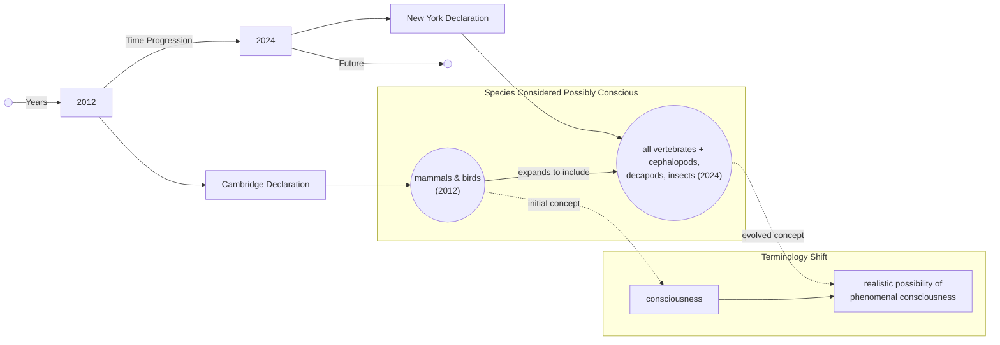

# Animal Consciousness and the AI Mirror: Lessons from the 2024 New York Declaration

As an AI engineer, you often debate the inner lives of models. But while you focus on the emergent abilities of large language models, a quiet revolution has been happening in biology. For us, it started with a 2022 study that found bumblebees voluntarily rolling small wooden balls, not for food or any immediate reward, but seemingly just for fun [[1]](https://www.scientificamerican.com/article/ball-rolling-bumble-bees-just-wanna-have-fun?ref=refind), [[2]](https://www.sciencedirect.com/science/article/pii/S0003347222002366). This behavior, so decoupled from survival, points toward complex affective states in a brain with only a million neurons. The study noted that younger bees and males showed more interest, and the activity was repeated but not stereotyped, fulfilling key criteria for play [[3]](https://www.theguardian.com/science/2022/oct/27/bumblebees-playing-wooden-balls-bees-study), [[4]](https://www.qmul.ac.uk/news/latest-news/2022/se/first-ever-study-shows-bumble-bees-play.html).

This finding is part of a wave of research that has reshaped our understanding of animal minds. For decades, scientists broadly agreed that animals similar to us, like other mammals and birds, are conscious. Recently, however, evidence has mounted for consciousness in creatures far more alien to us. This shift was formalized on April 19, 2024, with the release of the New York Declaration on Animal Consciousness [[5]](http://www.nydeclaration.com/). It states that “the empirical evidence indicates at least a realistic possibility of conscious experience in all vertebrates (including all reptiles, amphibians, and fishes) and many invertebrates (including, at minimum, cephalopod mollusks, decapod crustaceans, and insects)” [[5]](http://www.nydeclaration.com/). The declaration concludes that there is a realistic possibility of phenomenal consciousness in all vertebrates and in at least three invertebrate clades—cephalopods, decapod crustaceans, and insects—emphasizing that the declaration deliberately uses “realistic possibility” rather than absolute certainty.

The declaration was unveiled at a conference at New York University and spearheaded by philosopher Kristin Andrews, environmental scientist Jeff Sebo, and philosopher Jonathan Birch [[6]](https://www.kimmela.org/2024/05/05/a-new-declaration-on-animal-consciousness), [[7]](https://www.theatlantic.com/science/archive/2024/04/animal-consciousness-declaration-new-york/678223). It was signed by a prominent interdisciplinary group of neuroscientists, psychologists, and philosophers, including Anil Seth, Christof Koch, David Chalmers, and Peter Godfrey-Smith [[7]](https://www.theatlantic.com/science/archive/2024/04/animal-consciousness-declaration-new-york/678223). The document carefully focuses on phenomenal consciousness, the subjective character of experience. It asks if there is "something that it is like to be that organism," a question originally posed by philosopher Thomas Nagel in his 1974 essay, “What Is It Like to Be a Bat?” [[8]](https://www.informationphilosopher.com/solutions/philosophers/nagelt), [[9]](https://www.cs.ox.ac.uk/activities/ieg/e-library/sources/nagel_bat.pdf). This is distinct from higher-order capacities like self-awareness or metacognition, which require reflection upon one's own mental states. Phenomenal consciousness is simply the raw feeling of an experience, be it sensory or emotional.

This growing consensus around animal sentience provides a critical mirror for our own field. It highlights an important distinction between biological consciousness and artificial intelligence. As neuroscientist Anil Seth notes, the declaration should galvanize "an understanding and appreciation that we have much more in common with other animals than we do with things like ChatGPT” [[10]](https://www.theatlantic.com/science/archive/2024/04/animal-consciousness-declaration-new-york/678223). While LLMs excel at linguistic tasks, they show no evidence of the play, pain avoidance, or anxiety-like states now being documented across the animal kingdom. The declaration serves as a reminder that true subjective experience is rooted in biological life, a reality that current AI has yet to approach.

Image 1: A conceptual timeline illustrating the shift in understanding of consciousness from the 2012 Cambridge Declaration to the 2024 New York Declaration, showing the expansion of species considered possibly conscious and the evolution of terminology.

The 2024 Declaration is the formal culmination of a rapid accumulation of behavioral evidence gathered over the last 15 years. The next section examines that evidence in detail, explains why the field moved to a public declaration, and dismantles the old neural-complexity barrier.

## A Growing Awareness

The New York Declaration builds on over a decade of findings that challenge old assumptions about animal minds. This evidence comes not from one domain but from across a wide spectrum of species, revealing complex behaviors in creatures previously thought to be simple automatons.

One of the most compelling lines of evidence comes from studies on pain. In 2021, research on octopuses used a conditioned place preference test, a standard for assessing pain in lab rats. After an injection of acetic acid in their preferred chamber, octopuses developed a lasting aversion to it. When later given an anesthetic in a different chamber, they developed a preference for that new location, suggesting the drug provided relief [[11]](https://sites.google.com/nyu.edu/nydeclaration/background?authuser=0). This indicates not just a reflexive response to injury, but an affective, pain-like experience.

Evidence for complex memory has also been found in invertebrates. Cuttlefish have demonstrated a form of episodic-like memory, recalling not just what, where, and when a past event occurred, but also how they experienced it. In a 2020 study, they could remember whether they had previously seen or smelled a specific prey item, a capacity known as source memory [[11]](https://sites.google.com/nyu.edu/nydeclaration/background?authuser=0). This suggests a more nuanced and detailed recollection of past events than previously thought possible for cephalopods.

In the world of fish, cleaner wrasse have been shown to pass a version of the mirror-mark test. After being familiarized with a mirror, a colored mark was placed on their bodies. Upon seeing their reflection, the fish attempted to scrape the mark off, a behavior often interpreted as a form of self-recognition [[11]](https://sites.google.com/nyu.edu/nydeclaration/background?authuser=0). These findings have been supported by similar results in zebrafish, which also show signs of curiosity, voluntarily exploring new objects without any external reward [[11]](https://sites.google.com/nyu.edu/nydeclaration/background?authuser=0). Garter snakes have even passed a scent-based version of the test, investigating their own scent more when it was altered, suggesting they recognize their own smell [[11]](https://sites.google.com/nyu.edu/nydeclaration/background?authuser=0).

Insects, too, have displayed behaviors indicative of inner states. Beyond the bumblebee play behavior, studies have found that fruit flies exhibit distinct active and quiet sleep phases, similar to REM and slow-wave sleep in humans, and that their sleep patterns are disrupted by social isolation [[11]](https://sites.google.com/nyu.edu/nydeclaration/background?authuser=0). Further studies on crayfish have revealed anxiety-like states. When exposed to electric shocks, they become more averse to bright, open spaces. This behavior is reversed when they are given benzodiazepines, the same class of anti-anxiety drugs used in humans [[11]](https://sites.google.com/nyu.edu/nydeclaration/background?authuser=0).

This accumulation of evidence created a consensus among specialists that was not being communicated to the public or policymakers. Jeff Sebo, one of the declaration's organizers, noted that the goal was to formalize this agreement to encourage reflection on animal welfare [[11]](https://sites.google.com/nyu.edu/nydeclaration/background?authuser=0). The declaration aims to ensure that when a "realistic possibility" of consciousness exists, it is considered in decisions affecting that animal [[12]](https://jeffsebo.net). It is a call to move past the need for absolute certainty before taking welfare risks seriously.

This represents a significant evolution from the 2012 Cambridge Declaration on Consciousness. That document asserted that mammals and birds possess the "neuroanatomical, neurochemical, and neurophysiological substrates that generate consciousness" [[13]](http://fcmconference.org/img/CambridgeDeclarationOnConsciousness.pdf). The 2024 New York Declaration expands this scope to all vertebrates and many invertebrates, while deliberately using the more cautious phrasing "realistic possibility of conscious experience" [[5]](http://www.nydeclaration.com/). This careful wording reflects the scientific humility required when studying subjective experience, a point emphasized by signatories like Anil Seth, who supports the declaration because it "doesn't try to do science by diktat" but rather highlights what the current evidence suggests we should take seriously [[14]](https://www.quantamagazine.org/insects-and-other-animals-have-consciousness-experts-declare-20240419).

A long-standing barrier to accepting invertebrate consciousness was the assumption that their nervous systems were too simple. However, the bee brain’s million neurons, while a fraction of our 86 billion, are incredibly complex and densely interconnected, sufficient for play and social learning [[14]](https://www.quantamagazine.org/insects-and-other-animals-have-consciousness-experts-declare-20240419). Furthermore, nervous systems can be organized in radically different ways. An octopus has a highly distributed nervous system, with two-thirds of its 500 million neurons located in its arms [[15]](https://neuroscience.stanford.edu/news/octopus-brains). A severed arm can continue to perform complex actions, like grasping and avoidance, for hours, demonstrating that sophisticated motor control does not require a centralized brain [[16]](https://pmc.ncbi.nlm.nih.gov/articles/PMC8988249). This decentralized architecture challenges our vertebrate-centric model of intelligence.

The final objection, the lack of a cerebral cortex, has also been dismantled. As philosopher Kristin Andrews points out, we may not need "nearly as much equipment as we thought we did" for consciousness [[14]](https://www.quantamagazine.org/insects-and-other-animals-have-consciousness-experts-declare-20240419). Birds, reptiles, and fish have different brain structures that perform cortex-like functions.

The avian pallium, for example, comprises about 75% of the bird's telencephalic volume and has a neuroarchitecture reminiscent of the mammalian cortex, supporting high-level cognition [[17]](https://en.wikipedia.org/wiki/Avian_pallium), [[18]](https://asknature.org/strategy/bird-brains-use-unique-structure-to-support-high-intelligence). Similarly, the octopus vertical lobe serves as a center for memory and learning, proving that intelligence requires the right circuitry—dense networks and flexible connections—not a specific anatomy [[19]](https://asknature.org/strategy/complex-memory-processing-in-the-cephalopod-vertical-lobe). Philosopher Peter Godfrey-Smith argues that consciousness can arise from electrical oscillations in living brains, a feature not dependent on a specific architecture and observable in invertebrates [[20]](https://iai.tv/articles/studies-on-animal-minds-suggest-consciousness-is-not-computation-auid-3535). He notes that consciousness "can exist in an architecture that looks completely alien" to our own [[14]](https://www.quantamagazine.org/insects-and-other-animals-have-consciousness-experts-declare-20240419).

The evidentiary and architectural arguments have now shifted the scientific default. This pivot leads to downstream ethical obligations, practical tensions, and policy implications that follow once we accept the realistic possibility of consciousness in these creatures.

## Mindful Relations

Accepting that there is a realistic possibility of consciousness in a wide range of animals forces us to reconsider our relationship with them. The ethical obligations extend beyond merely preventing suffering. As Jeff Sebo argues, it is not enough to prevent pain; we must also provide "the kinds of enrichment and opportunities that allow them to express their instincts and explore their environments and engage in social systems and otherwise be the kinds of complex agents they are" [[14]](https://www.quantamagazine.org/insects-and-other-animals-have-consciousness-experts-declare-20240419). This implies a responsibility to foster positive welfare, allowing for the expression of complex behaviors like play and exploration.

However, this raises practical tensions, particularly with insects. As Peter Godfrey-Smith points out, our relationship with species like mosquitoes is "inevitably a somewhat antagonistic one" [[14]](https://www.quantamagazine.org/insects-and-other-animals-have-consciousness-experts-declare-20240419). Acknowledging their potential for experience does not eliminate the need to control disease vectors or protect crops. It does, however, force a more explicit and considered ethical calculus rather than a blanket dismissal of their welfare, moving from automatic eradication to a more nuanced consideration of harms and benefits.

This new understanding also exposes a significant welfare gap in laboratory research. While vertebrates used in experiments are protected by animal care committees, invertebrates like *Drosophila* fruit flies are not, despite their use in countless neuroscience studies [[21]](https://www.thetransmitter.org/policy/knowledge-gaps-in-cephalopod-care-could-stall-welfare-standards). There are no standardized pain assessment metrics or established guidelines for their care, a stark contrast to the growing oversight for cephalopods. This highlights an inconsistency in our current standards that needs to be addressed.

Policy can, and does, adapt to new scientific consensus. In the UK, a government-commissioned review of over 300 scientific studies concluded there was strong evidence of sentience in decapod crustaceans and cephalopod molluscs [[22]](https://www.eurogroupforanimals.org/news/uk-sentience-bill-passes-final-stages-recognise-decapod-and-cephalopod-sentience-law), [[23]](https://www.eurogroupforanimals.org/news/decapods-and-cephalopods-be-recognised-sentient-beings-under-uk-law). This led to their inclusion in the Animal Welfare (Sentience) Bill, legally recognizing animals like crabs, lobsters, and octopuses as sentient beings [[24]](https://naturewatch.org/study-confirms-animal-sentience-in-crustaceans), [[25]](https://researchbriefings.files.parliament.uk/documents/CBP-9423/CBP-9423.pdf). This provides a clear pathway for how scientific findings can translate into concrete legal protections.

For AI engineers, this shift in biology offers a cautionary tale. While Sebo and others agree that "current AI systems are very unlikely to be conscious," the rapid evolution of our understanding of animal minds "does give me pause and makes me want to approach the topic with caution and humility" [[14]](https://www.quantamagazine.org/insects-and-other-animals-have-consciousness-experts-declare-20240419). The criteria being used to identify consciousness in animals—affective states, play, and complex decision-making—are currently absent in AI. This provides a grounding framework for future debates on machine consciousness.

The path forward is clear: more research is needed. Kristin Andrews has called for scientists to use the resources they already have. "All these nematode worms and fruit flies that are in almost every university—study consciousness in them," she urges. "You already have them. Somebody in your lab is going to need a project. Make that project a consciousness project. Imagine that!” [[14]](https://www.quantamagazine.org/insects-and-other-animals-have-consciousness-experts-declare-20240419). By studying simpler models, we can make progress on one of science's oldest questions and, in doing so, better understand our place among the other minds of this world [[26]](https://www.multiverses.xyz/podcast/animal-minds-kristin-andrews-on-assuming-consciousness-in-other-species).

## References

- [1] https://www.scientificamerican.com/article/ball-rolling-bumble-bees-just-wanna-have-fun?ref=refind
- [2] https://www.sciencedirect.com/science/article/pii/S0003347222002366
- [3] https://www.theguardian.com/science/2022/oct/27/bumblebees-playing-wooden-balls-bees-study
- [4] https://www.qmul.ac.uk/news/latest-news/2022/se/first-ever-study-shows-bumble-bees-play.html
- [5] http://www.nydeclaration.com/
- [6] https://www.kimmela.org/2024/05/05/a-new-declaration-on-animal-consciousness
- [7] https://www.theatlantic.com/science/archive/2024/04/animal-consciousness-declaration-new-york/678223
- [8] https://www.informationphilosopher.com/solutions/philosophers/nagelt
- [9] https://www.cs.ox.ac.uk/activities/ieg/e-library/sources/nagel_bat.pdf
- [10] https://www.theatlantic.com/science/archive/2024/04/animal-consciousness-declaration-new-york/678223
- [11] https://sites.google.com/nyu.edu/nydeclaration/background?authuser=0
- [12] https://jeffsebo.net
- [13] http://fcmconference.org/img/CambridgeDeclarationOnConsciousness.pdf
- [14] https://www.quantamagazine.org/insects-and-other-animals-have-consciousness-experts-declare-20240419
- [15] https://neuroscience.stanford.edu/news/octopus-brains
- [16] https://pmc.ncbi.nlm.nih.gov/articles/PMC8988249/
- [17] https://en.wikipedia.org/wiki/Avian_pallium
- [18] https://asknature.org/strategy/bird-brains-use-unique-structure-to-support-high-intelligence
- [19] https://asknature.org/strategy/complex-memory-processing-in-the-cephalopod-vertical-lobe
- [20] https://iai.tv/articles/studies-on-animal-minds-suggest-consciousness-is-not-computation-auid-3535
- [21] https://www.thetransmitter.org/policy/knowledge-gaps-in-cephalopod-care-could-stall-welfare-standards
- [22] https://www.eurogroupforanimals.org/news/uk-sentience-bill-passes-final-stages-recognise-decapod-and-cephalopod-sentience-law
- [23] https://www.eurogroupforanimals.org/news/decapods-and-cephalopods-be-recognised-sentient-beings-under-uk-law
- [24] https://naturewatch.org/study-confirms-animal-sentience-in-crustaceans
- [25] https://researchbriefings.files.parliament.uk/documents/CBP-9423/CBP-9423.pdf
- [26] https://www.multiverses.xyz/podcast/animal-minds-kristin-andrews-on-assuming-consciousness-in-other-species