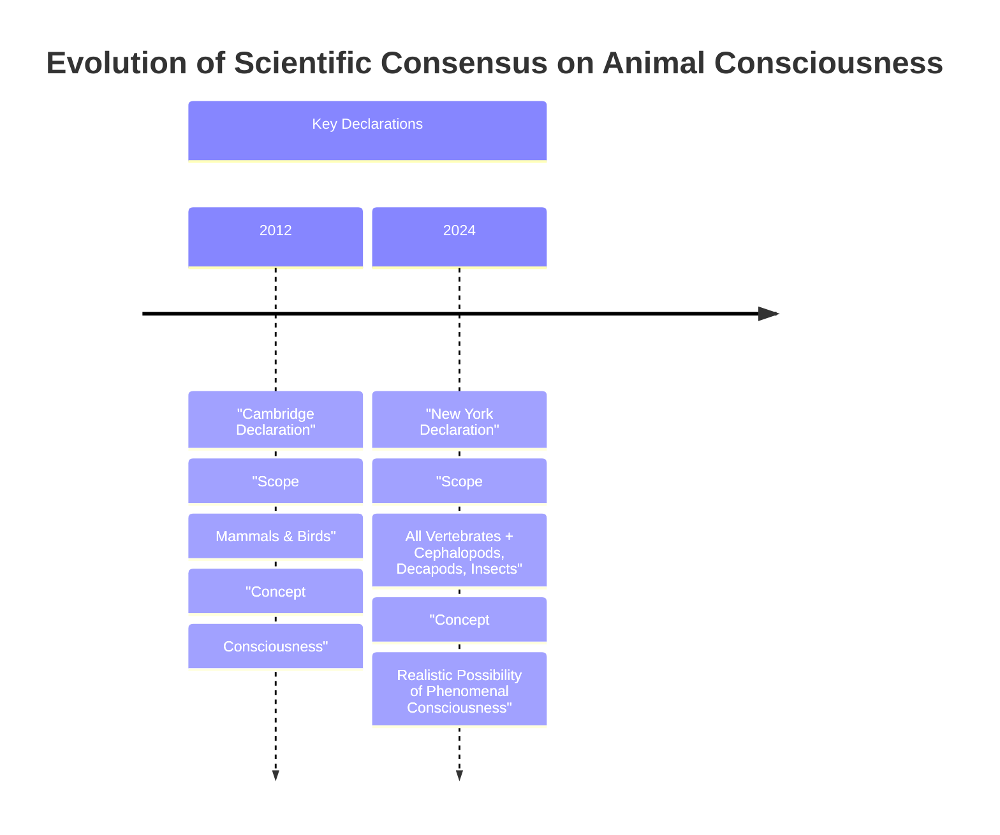

# The Expanding Circle: Why Animal Consciousness Is AI’s Humility Lesson

In 2022, researchers observed something that should make any engineer pause and reconsider their assumptions about intelligence. In a lab, bumblebees were seen pushing and rotating small wooden balls, not for food, mating, or any other survival-related reason, but seemingly just for fun. As AI engineers, we are used to thinking about complex behavior as the output of a computational process. But this discovery of apparent play in an insect is part of a wave of evidence that challenges our hardware-centric view of minds [[35], [36], [37], [38]]. It is a powerful lesson in humility for our field.

This research is a cornerstone for a major shift in scientific consensus, formalized in the 2024 New York Declaration on Animal Consciousness. For decades, we have broadly accepted that animals similar to us, like great apes, have conscious experiences. However, recent work suggests consciousness may be far more widespread. The declaration embraces this, stating that "the empirical evidence indicates at least a realistic possibility of conscious experience in all vertebrates (including all reptiles, amphibians and fishes) and many invertebrates (including, at minimum, cephalopod mollusks, decapod crustaceans, and insects)" [[1]]. This carefully chosen wording, "realistic possibility," reflects a standard of scientific rigor we can appreciate. It is not a statement of absolute certainty but a reflection of where the evidence now points [[2]].

https://i.imgur.com/vHqLg77.jpg
Image 1: A bumblebee, an insect now considered to have a realistic possibility of conscious experience. (Source: [Provided research image](https://i.imgur.com/vHqLg77.jpg))

Unveiled on April 19, 2024, at a New York University conference, the declaration was spearheaded by philosopher Kristin Andrews, environmental scientist Jeff Sebo, and philosopher Jonathan Birch. It was co-signed by dozens of the world's leading researchers in the field. The list of signatories highlights the interdisciplinary nature of this new consensus, including neuroscientists Anil Seth and Christof Koch, psychologists Nicola Clayton and Irene Pepperberg, and philosophers David Chalmers and Peter Godfrey-Smith. This is not a fringe idea; it is a new consensus among the experts who study minds for a living [[40], [41]].

https://i.imgur.com/6U9f7eJ.jpg
Image 2: The New York Declaration on Animal Consciousness was spearheaded by (from left) Kristin Andrews, Jeff Sebo, and Jonathan Birch. (Source [41])

The document focuses on what philosophers call phenomenal consciousness. This is the most basic form of subjective experience, famously defined by Thomas Nagel in his 1974 essay: "an organism has conscious mental states if and only if there is something that it is like to be that organism—something it is like for the organism." This is not about higher-order capacities like self-awareness or the ability to write a sonnet. It is about the raw capacity for feeling—pain, pleasure, hunger, or the sensory experience of seeing red [[42], [43]].

This growing understanding of biological minds throws the state of our own creations into sharp relief. Despite their incredible linguistic abilities, LLMs like ChatGPT show none of the behavioral or physiological markers of consciousness we see in animals. As neuroscientist Anil Seth puts it, the declaration should galvanize "an understanding and appreciation that we have much more in common with other animals than we do with things like ChatGPT." For us, this is a critical distinction. We are building powerful tools, but we are not building experiencing subjects [[3], [4]].

Image 3: A timeline diagram illustrating the evolution of scientific consensus on animal consciousness, highlighting the Cambridge Declaration (2012) and the New York Declaration (2024) with their respective scopes and concepts of consciousness.

The 2024 Declaration is the formal culmination of a rapid accumulation of behavioral evidence gathered over the last 10 to 15 years. To understand why this consensus shifted so quickly, we need to look at the specific experiments that convinced the scientific community and dismantled the old barriers to thinking about invertebrate minds.

## A Growing Awareness

The New York Declaration was not a sudden leap of faith but a conclusion built brick-by-brick from over a decade of striking research. These studies revealed surprisingly rich inner lives in a wide range of animals, providing a compelling body of evidence that we, as engineers and scientists, need to take seriously.

### The Accumulating Evidence

The evidence for consciousness spans a remarkable diversity of species and behaviors. In 2021, experiments showed that octopuses, after a painful injection of acetic acid, would groom the specific site of injury and later avoid the chamber where the experience occurred. They also developed a preference for a different chamber where they received a pain-relieving anesthetic, lidocaine. This pattern of behavior in a mammal would be taken as clear evidence for the subjective experience of pain. Cuttlefish demonstrated a form of episodic-like memory, remembering not just what, where, and when they last ate, but also how they experienced the prey—whether they saw it or smelled it—after a three-hour delay. This capacity, known as "source memory," suggests a more complex internal model of past events [[2]].

https://i.imgur.com/p0r4k8l.jpg
Image 4: A collage of animals, including a crayfish, octopus, zebrafish, and garter snake, now considered to have a realistic possibility of consciousness. (Source: [Provided research image](https://i.imgur.com/p0r4k8l.jpg))

Studies in fish have found that species like the cleaner wrasse can pass the four phases of the mirror test. First, they react aggressively to their reflection. This aggression then fades as they perform unusual behaviors, like swimming upside down. They then appear to study themselves before finally attempting to scrape off a colored mark they see on their body in the mirror. These successes highlight the need for species-specific tests adapted to an animal's primary sensory world. Fruit flies exhibit distinct active and quiet sleep phases, similar to REM and slow-wave sleep in humans, and their sleep patterns are disrupted by social isolation, hinting at a complex inner state. Even crayfish display anxiety-like behaviors when stressed, such as avoiding brightly lit areas of a maze, a tendency that is reversed by the same anti-anxiety drugs used in humans. And, of course, bumblebees have been observed engaging in object play with wooden balls, a behavior that appears to be intrinsically rewarding and meets five key criteria for play [[2]].

### From Informal Agreement to Public Declaration

This flood of data created an informal consensus among specialists that was not reaching the public or policymakers. Jeff Sebo, one of the declaration's initiators, explained that a public statement was needed to communicate where the field is now and where it is headed. The goal is to ensure that when there is a "realistic possibility of conscious experience in an animal, it is irresponsible to ignore that possibility in decisions affecting that animal" [[4], [16]]. For us building AI, this is a powerful principle. The possibility of sentience, even if uncertain, creates ethical responsibilities.

The new declaration updates and expands a 2012 predecessor, The Cambridge Declaration on Consciousness. That document focused on mammals and birds, asserting they possess the "neurological substrates that generate consciousness." The 2024 New York Declaration widens this circle to include all vertebrates and many invertebrates. It also carefully uses the more cautious phrasing "realistic possibility of phenomenal consciousness" to reflect the current state of evidence. This wording acknowledges that while complex behaviors are strong indicators, they are not definitive proof. As philosopher Peter Godfrey-Smith says of the octopus, its attentive engagement with the world "makes it very hard not to think that there’s quite a lot going on inside them." This epistemic caution is rooted in the "problem of other minds." This is the philosophical challenge that we can never directly access another being's subjective experience. Because consciousness is private, behavior is only an indirect proxy [[4], [50], [51]].

### Rethinking the Neural Hardware for Consciousness

This new consensus required dismantling long-held assumptions about the neural prerequisites for consciousness. The idea that a massive, human-like brain is necessary has been challenged on multiple fronts. A bee's brain, for instance, has only about a million neurons compared to our 86 billion. However, those neurons are incredibly complex and densely interconnected, forming a network sufficient for play, navigation, and social learning. It is not just the number of "processors," but the richness of their connections and the sophistication of the "software" they run [[4]].

https://i.imgur.com/KqB5k7A.png
Image 5: The transfer of neurotransmitters across a synapse, the fundamental process of neural communication. (Source: [Provided research image](https://i.imgur.com/KqB5k7A.png))

Furthermore, the architecture of the nervous system can be radically different. The octopus nervous system is highly distributed, with two-thirds of its 500 million neurons located in its arms. A severed octopus arm can continue to exhibit complex behaviors, like grasping and avoidance, for up to three hours, demonstrating that sophisticated sensory-motor control can happen without a centralized brain directing every move. This suggests that consciousness might not require a single, unified processing center [[10], [13]].

Finally, the idea that a cerebral cortex is essential for consciousness has also been refuted. Researchers have found that other brain structures can perform analogous functions. In birds, the pallium serves a role similar to the mammalian cortex, supporting high-level cognition. In cephalopods, the vertical lobe system is involved in memory and learning, functioning in a way that is homologous to the cortex. As Kristin Andrews states, we are finding that different brain structures are "doing the same kind of work that a cerebral cortex does in humans." Peter Godfrey-Smith agrees, noting that consciousness-like behaviors "can exist in an architecture that looks completely alien." This suggests consciousness might be a case of convergent evolution, much like the eye of an octopus, which evolved completely separately from our own yet serves a similar function [[4], [21], [46], [47], [48], [49], [52]].

With the evidentiary and architectural arguments now pointing toward a broader distribution of consciousness, the scientific default has shifted. This pivot raises new questions about our ethical obligations, practical relations, and policies toward these animals.

## Mindful Relations

Accepting the realistic possibility of consciousness in a vast range of animals forces us to reassess their moral standing—their status as beings that command ethical concern. For engineers and policymakers, this is not an abstract philosophical exercise. It has concrete implications for how we design systems and regulate industries [[53]].

### From Possibility to Obligation

The ethical obligations extend beyond simply preventing suffering. As Jeff Sebo argues, it is not enough to avoid inflicting pain on captive animals. We must also "provide them with the kinds of enrichment and opportunities that allow them to express their instincts and explore their environments and engage in social systems and otherwise be the kinds of complex agents they are." This principle of positive welfare is a much higher bar than mere harm avoidance and requires a deeper understanding of each species' unique needs [[4]].

However, extending these considerations to all newly recognized clades creates practical tensions. Our relationship with many insects, for example, is "inevitably a somewhat antagonistic one," as Peter Godfrey-Smith points out. Mosquitoes carry diseases, and other insects are agricultural pests. Unlike our relationship with fish or octopuses, the idea of "making peace" with mosquitoes is not straightforward. This forces us into a more complex ethical landscape of trade-offs rather than simple harm avoidance [[4]].

This new understanding also exposes a significant welfare gap in scientific research. While standards exist for laboratory rodents, insects like *Drosophila* are used in countless experiments with no protocols addressing their potential sentience. As researcher Matilda Gibbons notes, “We think about the welfare of livestock and of mice in research, but we never think about the welfare of the insects.” This stands in contrast to the growing oversight for cephalopods, which are now receiving protections in several countries. The UK provides a clear policy precedent. Following a government-commissioned review of over 300 scientific studies, the Animal Welfare (Sentience) Bill was amended in 2021 to include decapod crustaceans and cephalopod molluscs, recognizing them as sentient beings in law [[4], [6], [7], [8], [14]].

### A Cautionary Tale for AI

The rapid shift in our understanding of animal minds also offers a cautionary tale for our own field of AI. While Sebo and other researchers believe "current AI systems are very unlikely to be conscious," the biological discoveries counsel "caution and humility" when we evaluate future systems. The evidentiary standards being applied to animals—demonstrable pain avoidance, play, and complex decision-making—are currently absent in AI. Yet, the history of underestimating non-human minds should make us wary of premature certainty [[4], [15]].

Ultimately, this emerging science opens up vast new frontiers for research. As Kristin Andrews urges, we should redirect our existing laboratory infrastructure toward these questions. Nearly every university has labs with nematode worms and fruit flies. "Somebody in your lab is going to need a project. Make that project a consciousness project. Imagine that!" Jonathan Birch echoes this, arguing the declaration should stimulate research into even less-studied taxa like snails and worms, where evidence is currently limited. By studying these simpler models, we may make more progress on understanding the fundamental mechanisms of consciousness—in them, and in ourselves [[4], [54]].

## References

- [1] The New York Declaration on Animal Consciousness (http://www.nydeclaration.com/)
- [2] The Background of the New York Declaration (https://sites.google.com/nyu.edu/nydeclaration/background?authuser=0)
- [3] Animal-Consciousness Researchers Declare That Insects and Other Invertebrates Have Sentience (https://www.theatlantic.com/science/archive/2024/04/animal-consciousness-declaration-new-york/678223)
- [4] Insects and Other Animals Have Consciousness, Experts Declare (https://www.quantamagazine.org/insects-and-other-animals-have-consciousness-experts-declare-20240419)
- [5] Does sentience legislation help animals? (https://www.animalask.org/post/does-sentience-legislation-help-animals)
- [6] Study confirms animal sentience in crustaceans (https://naturewatch.org/study-confirms-animal-sentience-in-crustaceans)
- [7] UK Sentience Bill passes final stages to recognise decapod and cephalopod sentience in law (https://www.eurogroupforanimals.org/news/uk-sentience-bill-passes-final-stages-recognise-decapod-and-cephalopod-sentience-law)
- [8] Decapods and cephalopods to be recognised as sentient beings under UK law (https://www.eurogroupforanimals.org/news/decapods-and-cephalopods-be-recognised-sentient-beings-under-uk-law)
- [9] Animal Welfare (Sentience) Bill (https://researchbriefings.files.parliament.uk/documents/CBP-9423/CBP-9423.pdf)
- [10] Octopus Arms Are Controlled by a Nervous System That's Like No Other (https://www.sciencealert.com/octopus-arms-are-controlled-by-a-nervous-system-thats-like-no-other)
- [11] Octopus Brains (https://neuroscience.stanford.edu/news/octopus-brains)
- [12] The Mind of an Octopus (https://www.youtube.com/watch?v=W9Gnw7B7oGM)
- [13] Segmentation of the octopus arm nerve cord (https://www.nature.com/articles/s41467-024-55475-5)
- [14] Where Is It Like to Be an Octopus? (https://pmc.ncbi.nlm.nih.gov/articles/PMC8988249/)
- [15] Animal Minds — Kristin Andrews on assuming consciousness in other species (https://www.multiverses.xyz/podcast/animal-minds-kristin-andrews-on-assuming-consciousness-in-other-species)
- [16] Knowledge gaps in cephalopod care could stall welfare standards (https://www.thetransmitter.org/policy/knowledge-gaps-in-cephalopod-care-could-stall-welfare-standards)
- [17] Jeff Sebo on Animal, AI, and Digital Consciousness (https://www.youtube.com/watch?v=ak3WuQhtoW4)
- [18] Jeff Sebo - Home (https://jeffsebo.net)
- [19] A New Declaration on Animal Consciousness (https://www.kimmela.org/2024/05/05/a-new-declaration-on-animal-consciousness)
- [20] Peter Godfrey-Smith: The Philosophy of Biology (https://www.youtube.com/watch?v=Mi4-EOThAIc)
- [21] Notes to Chapter 6 - Living on Earth (https://petergodfreysmith.com/living-on-earth-notes-to-chapter-6)
- [22] Studies on animal minds suggest consciousness is not computation (https://iai.tv/articles/studies-on-animal-minds-suggest-consciousness-is-not-computation-auid-3535)
- [23] Peter Godfrey-Smith: The Evolution of Consciousness (https://www.youtube.com/watch?v=RkWvrt9GXsc)
- [24] Cephalopods and the Evolution of the Mind (https://petergodfreysmith.com/wp-content/uploads/2013/06/Cephalopods_PGS_PacConBio_2013.pdf)
- [25] The moral circle may be about to get a lot bigger (https://www.frontiersin.org/journals/psychology/articles/10.3389/fpsyg.2025.1700354/full)
- [26] If AI Were to Be Conscious, How Would We Know? And What Should We Do? (https://nextbigideaclub.com/magazine/ai-deserve-protection-philosopher-ethics-living-non-human-intelligence-bookbite/54074)
- [27] Jeff Sebo on using reason and evidence to help others (https://www.effectivealtruism.org/stories/jeff-sebo)
- [28] Ball-Rolling Bumble Bees Just Wanna Have Fun (https://www.scientificamerican.com/article/ball-rolling-bumble-bees-just-wanna-have-fun?ref=refind)
- [29] Bumblebees get a buzz out of playing with balls, study finds (https://www.theguardian.com/science/2022/oct/27/bumblebees-playing-wooden-balls-bees-study)
- [30] First-ever study shows bumble bees ‘play’ (https://www.qmul.ac.uk/news/latest-news/2022/se/first-ever-study-shows-bumble-bees-play.html)
- [31] Bumble bees show play-like behaviour, but it is not always a perfect indicator of positive welfare (https://www.sciencedirect.com/science/article/pii/S0003347222002366)
- [32] Bumblebees socially learn behaviour too complex to innovate alone (https://www.nature.com/articles/s41586-024-07126-4)
- [33] Hundreds of Experts Sign New York Declaration on Animal Consciousness (https://thebrooksinstitute.org/animal-law-digest/us/issue-259/hundreds-experts-sign-new-york-declaration-animal-consciousness)
- [34] Thomas Nagel (https://www.informationphilosopher.com/solutions/philosophers/nagelt)
- [35] What Is It Like to Be a Bat? (https://www.cs.ox.ac.uk/activities/ieg/e-library/sources/nagel_bat.pdf)
- [36] Thomas Nagel’s Bat and Ours (https://thephilosophicalsalon.com/thomas-nagels-bat-and-ours)
- [37] Complex memory processing in the cephalopod vertical lobe (https://asknature.org/strategy/complex-memory-processing-in-the-cephalopod-vertical-lobe)
- [38] Bird brains use unique structure to support high intelligence (https://asknature.org/strategy/bird-brains-use-unique-structure-to-support-high-intelligence)
- [39] A cortex-like canonical circuit in the avian forebrain (https://pmc.ncbi.nlm.nih.gov/articles/PMC10940863/)
- [40] The wiring of the octopus vertical lobe (https://elifesciences.org/articles/84257)
- [41] A New Declaration on Animal Consciousness (https://www.kimmela.org/2024/05/05/a-new-declaration-on-animal-consciousness)
- [42] What Is It Like to Be a Bat? (https://www.cs.ox.ac.uk/activities/ieg/e-library/sources/nagel_bat.pdf)
- [43] Thomas Nagel (https://www.informationphilosopher.com/solutions/philosophers/nagelt)
- [44] Complex memory processing in the cephalopod vertical lobe (https://asknature.org/strategy/complex-memory-processing-in-the-cephalopod-vertical-lobe)
- [45] Bird brains use unique structure to support high intelligence (https://asknature.org/strategy/bird-brains-use-unique-structure-to-support-high-intelligence)
- [46] A cortex-like canonical circuit in the avian forebrain (https://pmc.ncbi.nlm.nih.gov/articles/PMC10940863/)
- [47] The wiring of the octopus vertical lobe (https://elifesciences.org/articles/84257)
- [48] The Cambridge Declaration on Consciousness (http://fcmconference.org/img/CambridgeDeclarationOnConsciousness.pdf)
- [49] Invertebrate sentience: a review of the behavioral evidence (https://www.animal-ethics.org/invertebrate-sentience-a-review-of-the-behavioral-evidence)
- [50] Revisiting Animal Consciousness (https://advancedconsciousness.org/revisiting-animal-consciousness)
- [51] The New York Declaration on Animal Consciousness stresses the ethical implications (https://www.animal-ethics.org/the-new-york-declaration-on-animal-consciousness-stresses-the-ethical-implications)
- [52] The Ethical Puzzle of Sentient AI (https://undark.org/2023/07/14/interview-the-ethical-puzzle-of-sentient-ai)
- [53] Artificial intelligence and moral status (https://pmc.ncbi.nlm.nih.gov/articles/PMC10436038/)
- [54] Jonathan Birch - The Search for Animal Consciousness (https://www.youtube.com/watch?v=r5UoGpJ-Cwc)