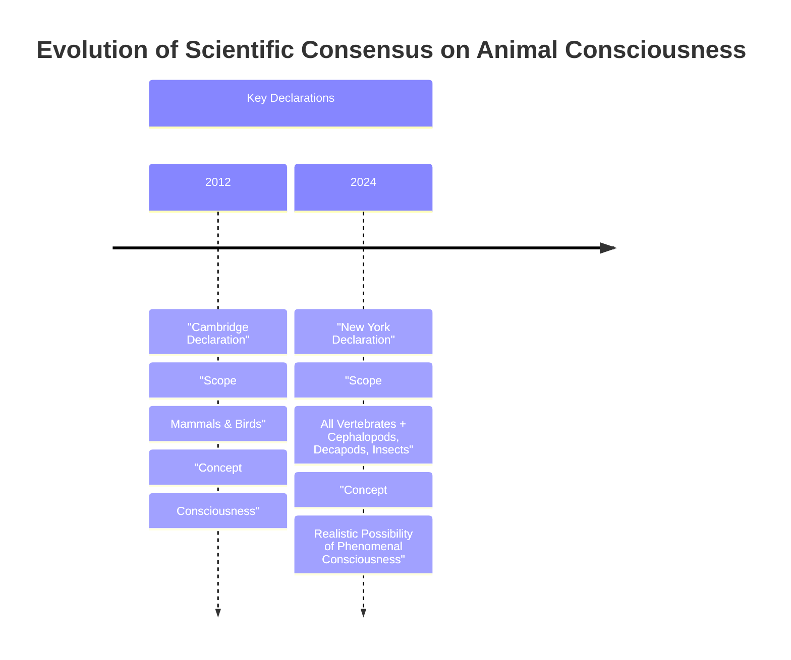

# The Expanding Circle: Why Animal Consciousness Is AI’s Humility Lesson

In 2022, researchers observed bumblebees doing something remarkable. In a lab setting, fuzzy, diminutive bees were seen pushing and rotating small wooden balls, not for any reward, mating, or survival-related reason, but seemingly just for fun [[35], [36]]. This discovery of apparent play behavior in an insect is part of a growing body of evidence that is reshaping our understanding of animal minds [[37], [38]]. For AI engineers accustomed to thinking about intelligence in computational terms, this biological revolution offers a profound lesson in humility.

This research and other similar findings have culminated in the 2024 New York Declaration on Animal Consciousness [[40]]. While for decades scientists broadly agreed that animals similar to us, like great apes, have conscious experiences, recent work suggests consciousness may be widespread among creatures very different from us. The declaration formally embraces this view, stating that "the empirical evidence indicates at least a realistic possibility of conscious experience in all vertebrates (including all reptiles, amphibians and fishes) and many invertebrates (including, at minimum, cephalopod mollusks, decapod crustaceans and insects)" [[40]]. The key phrase here is "realistic possibility," a deliberate choice reflecting scientific caution over absolute certainty [[32]].

https://i.imgur.com/vHqLg77.jpg
Image 1: A bumblebee, an insect now considered to have a realistic possibility of conscious experience.

The declaration was unveiled on April 19, 2024, at a conference at New York University [[40]]. It was spearheaded by philosopher Kristin Andrews, environmental scientist Jeff Sebo, and philosopher Jonathan Birch [[41], [42]]. It has been signed by dozens of leading researchers, including neuroscientists Anil Seth and Christof Koch, psychologists Nicola Clayton and Irene Pepperberg, and philosophers David Chalmers and Peter Godfrey-Smith [[42]].

https://i.imgur.com/6U9f7eJ.jpg
Image 2: The New York Declaration on Animal Consciousness was spearheaded by (from left) Kristin Andrews, Jeff Sebo, and Jonathan Birch. (Source [42])

The document focuses on phenomenal consciousness, the most basic form of subjective experience. This concept was famously articulated by philosopher Thomas Nagel in his 1974 essay, where he argued that "an organism has conscious mental states if and only if there is something that it is like to be that organism—something it is like for the organism" [[43], [44]]. This is distinct from more complex capacities like self-awareness or metacognition, which the declaration does not claim for these animals.

This growing understanding of animal subjectivity throws the nature of AI into sharp relief. Despite their linguistic prowess, models like ChatGPT show no evidence of the behavioral and physiological markers of consciousness we see in animals. As neuroscientist Anil Seth notes, the declaration should galvanize "an understanding and appreciation that we have much more in common with other animals than we do with things like ChatGPT" [[1], [2]].

Image 3: A timeline diagram illustrating the evolution of scientific consensus on animal consciousness, highlighting the Cambridge Declaration (2012) and the New York Declaration (2024) with their respective scopes and concepts of consciousness.

The 2024 Declaration is the formal culmination of a rapid accumulation of behavioral evidence gathered over the last 10–15 years. The next section examines that evidence in detail, explains why the field moved to a public declaration, and dismantles the old neural-complexity barrier.

## A Growing Awareness

The New York Declaration was not a sudden development but the result of over a decade of striking research findings that hinted at surprisingly rich inner lives in a wide range of animals. These studies, taken together, created a compelling case that could no longer be ignored.

The evidence spans a remarkable diversity of species and behaviors [[32]]. In 2021, experiments showed that octopuses, after an injection of acetic acid, would groom the specific site of injury and later avoid the chamber where the painful experience occurred. They also developed a preference for a different chamber where they received pain-relieving lidocaine, a pattern consistent with the experience of pain [[32]]. Cuttlefish demonstrated a form of episodic-like memory, remembering not just what, where, and when they last ate, but also whether they saw or smelled the prey, a capacity known as "source memory" [[32]].

https://i.imgur.com/p0r4k8l.jpg
Image 4: A collage of animals, including a crayfish, octopus, zebrafish, and garter snake, now considered to have a realistic possibility of consciousness.

Meanwhile, cleaner wrasse fish and garter snakes have passed versions of the mirror-mark test, a classic indicator of self-recognition. These successes highlight the need for species-specific tests adapted to an animal's primary sensory world [[54]]. The fish, after a period of familiarization, attempted to scrape off colored marks on their bodies that were only visible in a mirror [[32]]. Snakes, which rely more on scent, passed a scent-based version, spending more time investigating cotton pads bearing their own odor when it was modified with a different scent [[32], [54]]. Evidence of positive experiences has also emerged. Beyond the ball-rolling bumblebees, zebrafish have shown signs of curiosity, demonstrating sustained, unrewarded interest in novel objects [[32]]. Fruit flies exhibit distinct active and quiet sleep phases, similar to REM and slow-wave sleep in humans, and their sleep patterns are disrupted by social isolation [[32]]. Even crayfish display anxiety-like behaviors when stressed, such as avoiding brightly lit areas, a tendency that is reversed by the same anti-anxiety drugs used in humans [[32]].

This flood of data created an informal consensus among specialists that was not reaching the public or policymakers. Jeff Sebo, one of the declaration's initiators, noted that a public statement was needed to communicate where the field is now and where it is headed [[31]]. The goal is to ensure that when there is a "realistic possibility of conscious experience in an animal, it is irresponsible to ignore that possibility in decisions affecting that animal" [[22]].

The new declaration updates and expands a 2012 predecessor, The Cambridge Declaration on Consciousness [[52]]. That document focused on mammals and birds, asserting they possess the "neurological substrates that generate consciousness" [[52]]. The 2024 New York Declaration widens this circle to include all vertebrates and many invertebrates, while carefully using the more cautious phrasing "realistic possibility of phenomenal consciousness" to reflect the current state of evidence [[40]]. This wording acknowledges that while complex behaviors are strong indicators, they are not definitive proof. As philosopher Peter Godfrey-Smith puts it, the complex, attentive engagement of an octopus with the world "makes it very hard not to think that there’s quite a lot going on inside them" [[31]].

This epistemic caution is rooted in the "problem of other minds"—the philosophical challenge that we can never directly access another being's subjective experience. Because consciousness is private, behavior is only an indirect proxy [[55]]. While this is true for all non-human animals, the shared evolutionary history among them makes it plausible that similar behaviors are rooted in common conscious mechanisms, an inference less applicable to artificial systems [[55]].

https://i.imgur.com/KqB5k7A.png
Image 5: The transfer of neurotransmitters across a synapse, the fundamental process of neural communication.

This new consensus required dismantling long-held assumptions about the neural prerequisites for consciousness. The idea that a massive, human-like brain is necessary has been challenged on multiple fronts. A bee's brain, for instance, has only about a million neurons compared to a human's 86 billion. However, those neurons are incredibly complex and densely interconnected, forming a network sufficient for play, navigation, and social learning [[31]].

Furthermore, the architecture of the nervous system can be radically different. The octopus nervous system is highly distributed, with two-thirds of its neurons located in its arms [[10]]. A severed octopus arm can continue to exhibit complex behaviors, like grasping and avoidance, for up to three hours, demonstrating that sophisticated sensory-motor control can happen without a centralized brain directing every move [[13]]. This suggests that consciousness might not require a single, unified processing center.

Finally, the idea that a cerebral cortex is essential for consciousness has also been refuted. Researchers have found that other brain structures can perform analogous functions. In birds, the pallium serves a role similar to the mammalian cortex, supporting high-level cognition [[49], [50]]. In cephalopods, the vertical lobe system is involved in memory and learning, functioning in a way that is homologous to the cortex [[41], [47]]. As Kristin Andrews states, we are finding that different brain structures are "doing the same kind of work that a cerebral cortex does in humans" [[31]]. Peter Godfrey-Smith agrees, noting that consciousness-like behaviors "can exist in an architecture that looks completely alien" [[31]]. This suggests consciousness might be a case of convergent evolution, much like the eye of an octopus, which evolved completely separately from our own yet serves a similar function [[56]].

With the evidentiary and architectural arguments now pointing toward a broader distribution of consciousness, the scientific default has shifted. This pivot raises new questions about our ethical obligations, practical relations, and policies toward these animals.

## Mindful Relations

Accepting the realistic possibility of consciousness in a vast range of animals forces a reassessment of their moral standing—their status as beings that command ethical concern [[57]]. The implications go beyond simply preventing suffering. As Jeff Sebo argues, it is not enough to avoid inflicting pain on captive animals. We must also "provide them with the kinds of enrichment and opportunities that allow them to express their instincts and explore their environments and engage in social systems and otherwise be the kinds of complex agents they are" [[31]].

However, extending these considerations to all newly recognized clades creates practical tensions. Our relationship with many insects, for example, is "inevitably a somewhat antagonistic one," as Peter Godfrey-Smith points out [[31]]. Mosquitoes carry diseases and other insects are agricultural pests. Unlike our relationship with fish or octopuses, the idea of "making peace" with mosquitoes is not straightforward, forcing us into a more complex ethical landscape of trade-offs rather than simple harm avoidance [[31]].

This new understanding also exposes a significant welfare gap in scientific research. While standards exist for laboratory rodents, insects like *Drosophila* are used in countless experiments with no protocols addressing their potential sentience [[19]]. This stands in contrast to the growing oversight for cephalopods, which are now receiving protections in several countries [[19]]. The UK provides a clear policy precedent. Following a government-commissioned review of over 300 scientific studies, the Animal Welfare (Sentience) Bill was amended in 2021 to include decapod crustaceans and cephalopod molluscs, recognizing them as sentient beings in law [[6], [7], [8]]. This demonstrates a concrete pathway from scientific consensus to policy change.

The rapid shift in our understanding of animal minds also offers a cautionary tale for the field of AI. While Sebo and other researchers believe "current AI systems are very unlikely to be conscious," the biological discoveries counsel "caution and humility" when evaluating future systems [[31]]. The evidentiary standards being applied to animals—demonstrable pain avoidance, play, and complex decision-making—are currently absent in AI. Yet, the history of underestimating non-human minds should make us wary of premature certainty.

Ultimately, this emerging science opens up vast new frontiers for research. As Kristin Andrews urges, we should redirect our existing laboratory infrastructure toward these questions. Nearly every university has labs with nematode worms and fruit flies [[14]]. "Somebody in your lab is going to need a project. Make that project a consciousness project. Imagine that!" [[31]]. Jonathan Birch echoes this, arguing the declaration should stimulate research into even less-studied taxa like snails and worms, where evidence is currently limited [[58]]. By studying these simpler models, we may make more progress on understanding the fundamental mechanisms of consciousness—in them, and in ourselves.

## References

- [1] https://www.theatlantic.com/science/archive/2024/04/animal-consciousness-declaration-new-york/678223
- [2] https://www.quantamagazine.org/insects-and-other-animals-have-consciousness-experts-declare-20240419
- [3] https://www.animalask.org/post/does-sentience-legislation-help-animals
- [4] https://naturewatch.org/study-confirms-animal-sentience-in-crustaceans
- [5] https://www.eurogroupforanimals.org/news/uk-sentience-bill-passes-final-stages-recognise-decapod-and-cephalopod-sentience-law
- [6] https://www.eurogroupforanimals.org/news/decapods-and-cephalopods-be-recognised-sentient-beings-under-uk-law
- [7] https://researchbriefings.files.parliament.uk/documents/CBP-9423/CBP-9423.pdf
- [8] https://www.sciencealert.com/octopus-arms-are-controlled-by-a-nervous-system-thats-like-no-other
- [9] https://neuroscience.stanford.edu/news/octopus-brains
- [10] https://neuroscience.stanford.edu/news/octopus-brains
- [11] https://www.youtube.com/watch?v=W9Gnw7B7oGM
- [12] https://www.nature.com/articles/s41467-024-55475-5
- [13] https://pmc.ncbi.nlm.nih.gov/articles/PMC8988249/
- [14] https://www.thetransmitter.org/policy/knowledge-gaps-in-cephalopod-care-could-stall-welfare-standards
- [15] https://www.youtube.com/watch?v=ak3WuQhtoW4
- [16] https://jeffsebo.net
- [17] https://www.kimmela.org/2024/05/05/a-new-declaration-on-animal-consciousness
- [18] https://www.youtube.com/watch?v=RkWvrt9GXsc
- [19] https://www.youtube.com/watch?v=Mi4-EOThAIc
- [20] https://petergodfreysmith.com/living-on-earth-notes-to-chapter-6
- [21] https://iai.tv/articles/studies-on-animal-minds-suggest-consciousness-is-not-computation-auid-3535
- [22] https://petergodfreysmith.com/wp-content/uploads/2013/06/Cephalopods_PGS_PacConBio_2013.pdf
- [23] https://www.frontiersin.org/journals/psychology/articles/10.3389/fpsyg.2025.1700354/full
- [24] https://sites.google.com/nyu.edu/nydeclaration/background
- [25] https://nextbigideaclub.com/magazine/ai-deserve-protection-philosopher-ethics-living-non-human-intelligence-bookbite/54074
- [26] https://www.effectivealtruism.org/stories/jeff-sebo
- [27] https://www.scientificamerican.com/article/ball-rolling-bumble-bees-just-wanna-have-fun?ref=refind
- [28] https://www.theguardian.com/science/2022/oct/27/bumblebees-playing-wooden-balls-bees-study
- [29] https://www.qmul.ac.uk/news/latest-news/2022/se/first-ever-study-shows-bumble-bees-play.html
- [30] https://www.sciencedirect.com/science/article/pii/S0003347222002366
- [31] https://www.nature.com/articles/s41586-024-07126-4
- [32] https://www.nature.com/articles/s41586-024-07126-4
- [33] https://www.cs.ox.ac.uk/activities/ieg/e-library/sources/nagel_bat.pdf
- [34] https://www.informationphilosopher.com/solutions/philosophers/nagelt
- [35] https://www.sciencedirect.com/science/article/pii/S0003347222002366
- [36] https://www.qmul.ac.uk/news/latest-news/2022/se/first-ever-study-shows-bumble-bees-play.html
- [37] https://www.theguardian.com/science/2022/oct/27/bumblebees-playing-wooden-balls-bees-study
- [38] https://www.scientificamerican.com/article/ball-rolling-bumble-bees-just-wanna-have-fun?ref=refind
- [39] https://elifesciences.org/articles/84257
- [40] http://www.nydeclaration.com/
- [41] https://sites.google.com/nyu.edu/nydeclaration/background?authuser=0
- [42] https://thebrooksinstitute.org/animal-law-digest/us/issue-259/hundreds-experts-sign-new-york-declaration-animal-consciousness
- [43] https://www.cs.ox.ac.uk/activities/ieg/e-library/sources/nagel_bat.pdf
- [44] https://www.informationphilosopher.com/solutions/philosophers/nagelt
- [45] https://thephilosophicalsalon.com/thomas-nagels-bat-and-ours
- [46] https://asknature.org/strategy/complex-memory-processing-in-the-cephalopod-vertical-lobe
- [47] https://asknature.org/strategy/complex-memory-processing-in-the-cephalopod-vertical-lobe
- [48] https://asknature.org/strategy/bird-brains-use-unique-structure-to-support-high-intelligence
- [49] https://asknature.org/strategy/bird-brains-use-unique-structure-to-support-high-intelligence
- [50] https://pmc.ncbi.nlm.nih.gov/articles/PMC10940863
- [51] https://elifesciences.org/articles/84257
- [52] http://fcmconference.org/img/CambridgeDeclarationOnConsciousness.pdf
- [53] https://www.nydeclaration.com/
- [54] https://advancedconsciousness.org/revisiting-animal-consciousness
- [55] https://www.animal-ethics.org/invertebrate-sentience-a-review-of-the-behavioral-evidence
- [56] https://undark.org/2023/07/14/interview-the-ethical-puzzle-of-sentient-ai
- [57] https://pmc.ncbi.nlm.nih.gov/articles/PMC10436038
- [58] https://www.youtube.com/watch?v=r5UoGpJ-Cwc