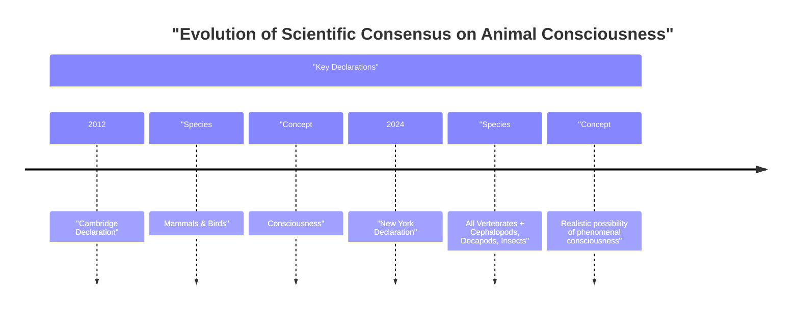

# The Animal Mind: Why Scientists Now See Consciousness in Insects and Octopuses

In 2022, researchers saw something that changed how we think about insect minds: bumblebees were playing. In a lab setting, these insects rolled small wooden balls around, not for food or any other reward, but just for fun [[1]](https://www.scientificamerican.com/article/ball-rolling-bumble-bees-just-wanna-have-fun?ref=refind), [[2]](https://www.theguardian.com/science/2022/oct/27/bumblebees-playing-wooden-balls-bees-study), [[3]](https://www.qmul.ac.uk/news/latest-news/2022/se/first-ever-study-shows-bumble-bees-play.html). The study showed that this behavior met the scientific criteria for play: it was voluntary, repeated but not stereotyped, and occurred in stress-free conditions, suggesting it was intrinsically rewarding [[4]](https://www.sciencedirect.com/science/article/pii/S0003347222002366). This simple observation is part of a larger body of evidence that is forcing us, as engineers and scientists, to reconsider where consciousness might exist.

This is a major shift away from a long-held scientific view. For centuries, the ideas of René Descartes dominated Western thought. He argued that animals were basically complex machines, or automata, without feelings or inner experiences [[5]](https://pressbooks.bccampus.ca/psychologicalroots/chapter/evolutionary-psychology-animal-consciousness). This perspective created a high barrier for accepting animal consciousness and has influenced science for a long time.

For decades, most scientists agreed that animals similar to us, like other mammals and birds, were conscious. But recent studies have pushed these boundaries. The new research suggests that consciousness might be common even in animals with very different nervous systems. This shift led to the 2024 New York Declaration on Animal Consciousness. The declaration states that “the empirical evidence indicates at least a realistic possibility of conscious experience in all vertebrates (including all reptiles, amphibians, and fishes) and many invertebrates (including, at minimum, cephalopod mollusks, decapod crustaceans, and insects)” [[6]](http://www.nydeclaration.com/). The key phrase here is “realistic possibility.” It reflects scientific caution but also acknowledges that the evidence is now too strong to ignore [[7]](https://jeffsebo.net), [[8]](https://sites.google.com/nyu.edu/nydeclaration/background).

The declaration was unveiled on April 19, 2024, at a conference at New York University. It was led by philosopher Kristin Andrews, environmental scientist Jeff Sebo, and philosopher Jonathan Birch [[9]](https://www.kimmela.org/2024/05/05/a-new-declaration-on-animal-consciousness). A prominent group of researchers signed it, including neuroscientists Anil Seth and Christof Koch, psychologists Nicola Clayton and Irene Pepperberg, zoologist Lars Chittka, and philosophers David Chalmers and Peter Godfrey-Smith [[10]](https://www.theatlantic.com/science/archive/2024/04/animal-consciousness-declaration-new-york/678223).

The focus is on phenomenal consciousness, which is the most basic kind of subjective experience. In his 1974 essay "What Is It Like to Be a Bat?", philosopher Thomas Nagel defined it perfectly: “fundamentally an organism has conscious mental states if and only if there is something that it is like to be that organism—something it is like for the organism” [[11]](https://www.informationphilosopher.com/solutions/philosophers/nagelt), [[12]](https://www.cs.ox.ac.uk/activities/ieg/e-library/sources/nagel_bat.pdf), [[13]](https://thephilosophicalsalon.com/thomas-nagels-bat-and-ours). This is about raw feeling, like pain or pleasure, not complex thoughts like self-awareness. Nagel’s point is that every subjective experience is tied to a single point of view. An objective, physical theory, by its nature, abandons that specific viewpoint, which is why explaining consciousness remains so difficult [[34]](https://www.sas.upenn.edu/~cavitch/pdf-library/Nagel_Bat.pdf).

This new understanding of animal minds creates a clear separation between biological consciousness and what we see in AI today. As neuroscientist Anil Seth puts it, the declaration helps us appreciate that "we have much more in common with other animals than we do with things like ChatGPT” [[10]](https://www.theatlantic.com/science/archive/2024/04/animal-consciousness-declaration-new-york/678223), [[14]](https://www.quantamagazine.org/insects-and-other-animals-have-consciousness-experts-declare-20240419). LLMs can generate impressive text, but they do not show any evidence of the play, pain, or anxiety-like states we now see in many animals. This distinction is rooted in the physical and evolutionary realities of living organisms, whose experiences are shaped by their bodies and environments in ways that current AI systems do not replicate.

Image 1: The evolution of scientific consensus on animal consciousness from the 2012 Cambridge Declaration to the 2024 New York Declaration.

The 2024 Declaration did not appear out of nowhere. It is the result of a rapid build-up of behavioral evidence over the last 10 to 15 years. In the next section, we will look at that evidence, understand why scientists decided a public declaration was necessary, and see why old arguments about brain complexity no longer hold up.

## A Growing Awareness

Over the past fifteen years, a wave of research has revealed rich inner lives in a wide range of animals. These discoveries provide the evidence for the New York Declaration and have forced us to rethink what kinds of minds can experience the world. This increase in research is not just a feeling. Publications on animal sentience grew tenfold in the two decades before the first declaration in 2012, turning it into a serious field of study [[15]](https://pmc.ncbi.nlm.nih.gov/articles/PMC9704368).

The evidence is powerful. For example, octopuses show clear signs of feeling pain. When injured, they not only tend to their wounds but also learn to avoid places where they were hurt. They even develop a preference for locations where they received pain relief, a behavior demonstrated through a "conditioned place preference" test originally designed for lab rats [[8]](https://sites.google.com/nyu.edu/nydeclaration/background). Cuttlefish show a form of episodic-like memory, recalling specific details of past events, including what happened, where it happened, and when it happened [[8]](https://sites.google.com/nyu.edu/nydeclaration/background). In the world of fish, some species show advanced cognitive abilities. For example, studies on zebrafish indicate they can pass variants of the mirror-mark test, which involves mark-directed behavior and suggests a degree of self-recognition [[8]](https://sites.google.com/nyu.edu/nydeclaration/background).

Invertebrates have shown equally impressive behaviors. As we have seen, bumblebees appear to play, rolling wooden balls without any reward, which suggests a positive emotional state [[1]](https://www.scientificamerican.com/article/ball-rolling-bumble-bees-just-wanna-have-fun?ref=refind), [[8]](https://sites.google.com/nyu.edu/nydeclaration/background). Fruit flies have distinct "active" and "quiet" sleep patterns that are disrupted by social isolation, similar to what happens in humans [[8]](https://sites.google.com/nyu.edu/nydeclaration/background). Crayfish show anxiety-like behaviors when they are stressed, becoming more hesitant to explore bright, open areas of a maze. These behaviors are reversed by the same anti-anxiety drugs used in humans, like benzodiazepines, which points to a shared neurochemical basis for these feelings [[8]](https://sites.google.com/nyu.edu/nydeclaration/background).

Of course, all this behavioral evidence is indirect. We face the "problem of other minds," meaning we can never directly know what another being is experiencing [[16]](https://www.animal-ethics.org/invertebrate-sentience-a-review-of-the-behavioral-evidence). A key challenge for researchers is to tell the difference between conscious states and simple, unconscious reflexes. Current theories also disagree on whether human-like brain structures are necessary for consciousness at all [[17]](https://www.frontiersin.org/journals/behavioral-neuroscience/articles/10.3389/fnbeh.2021.653041/full).

As this evidence grew, a consensus formed among specialists. However, this new understanding was not reaching policymakers or the public. Jeff Sebo, one of the declaration's organizers, said that while many scientists accepted consciousness in mammals and birds, "less attention has been paid to other vertebrate and especially invertebrate taxa" [[14]](https://www.quantamagazine.org/insects-and-other-animals-have-consciousness-experts-declare-20240419). The declaration was created to make this new consensus official and clear, with the goal of influencing research funding and animal welfare laws [[8]](https://sites.google.com/nyu.edu/nydeclaration/background). While the idea of invertebrate sentience is not new to philosophers, the recent data has shifted the conversation from a philosophical debate to a scientific one [[18]](https://www.animal-ethics.org/the-new-york-declaration-on-animal-consciousness-stresses-the-ethical-implications).

The 2024 declaration is a big step forward from the 2012 Cambridge Declaration on Consciousness. The earlier document stated that non-human animals, including all mammals and birds, have the "neurological substrates that generate consciousness" [[19]](http://fcmconference.org/img/CambridgeDeclarationOnConsciousness.pdf). The 2024 declaration expands this to include all vertebrates and many invertebrates. It also uses more careful language, stating there is a "realistic possibility of conscious experience" [[6]](http://www.nydeclaration.com/). This reflects a more measured scientific view. It is not a claim of certainty, but an acknowledgment that the probability is high enough to demand our ethical attention. As Peter Godfrey-Smith says about octopuses, their complex and attentive behaviors make it "very hard not to think that there’s quite a lot going on inside them" [[14]](https://www.quantamagazine.org/insects-and-other-animals-have-consciousness-experts-declare-20240419).

For a long time, the main argument against invertebrate consciousness was their different brain structure. But recent discoveries have broken down this barrier. A bee's brain has only about one million neurons, compared to 86 billion in a human brain. However, each bee neuron is very complex and densely connected, which is enough to support advanced behaviors like play and social learning [[14]](https://www.quantamagazine.org/insects-and-other-animals-have-consciousness-experts-declare-20240419). The octopus offers another example of a completely different architecture. Its nervous system is highly distributed, with about two-thirds of its 500 million neurons in its arms [[20]](https://neuroscience.stanford.edu/news/octopus-brains), [[21]](https://www.sciencealert.com/octopus-arms-are-controlled-by-a-nervous-system-thats-like-no-other). If an octopus arm is severed, it can continue to perform complex actions on its own, showing that sophisticated control does not require a central brain for every move [[22]](https://pmc.ncbi.nlm.nih.gov/articles/PMC8988249).

Also, a cerebral cortex, which was once thought to be required for consciousness, is not necessary. Kristin Andrews explains that animals like birds and fish have "very different brain structures" that do "the same kind of work that a cerebral cortex does in humans" [[14]](https://www.quantamagazine.org/insects-and-other-animals-have-consciousness-experts-declare-20240419). The avian pallium in birds and the vertical lobe in octopuses are structures that support advanced learning and memory, similar to the functions of the mammalian cortex [[23]](https://asknature.org/strategy/complex-memory-processing-in-the-cephalopod-vertical-lobe), [[24]](https://asknature.org/strategy/bird-brains-use-unique-structure-to-support-high-intelligence). Peter Godfrey-Smith sees cephalopods as an "independent experiment in the evolution of large and complex nervous systems," suggesting that consciousness can arise from different evolutionary paths [[25]](https://petergodfreysmith.com/wp-content/uploads/2013/06/Cephalopods_PGS_PacConBio_2013.pdf).

With both the behavioral evidence and architectural arguments pointing in the same direction, the scientific default has shifted. This change forces us to look at the ethical duties and practical policy questions that come next.

## Mindful Relations

When we accept that a wide range of animals might be conscious, our ethical responsibilities grow. It is no longer just about preventing pain. As Jeff Sebo states, "We also have to provide them with the kinds of enrichment and opportunities that allow them to express their instincts and explore their environments and engage in social systems and otherwise be the kinds of complex agents they are" [[14]](https://www.quantamagazine.org/insects-and-other-animals-have-consciousness-experts-declare-20240419). This means we need to create conditions for positive experiences, not just avoid negative ones.

This expanded ethical view, however, leads to difficult practical problems, especially with insects. As Peter Godfrey-Smith notes, our relationship with many insects is "inevitably a somewhat antagonistic one" [[14]](https://www.quantamagazine.org/insects-and-other-animals-have-consciousness-experts-declare-20240419). We cannot simply make peace with mosquitoes that spread disease or with pests that eat our crops. This forces us to make difficult trade-offs instead of just trying to avoid all harm. These issues also appear in agriculture, where the welfare of farmed invertebrates like shrimp is often ignored in discussions about sustainability [[26]](https://assets.publishing.service.gov.uk/media/5a7f9365ed915d74e33f747f/Advice_about_sustainable_agriculture_and_farm_animal_welfare_-_final_2016.pdf).

A major welfare gap also exists in science labs. While vertebrates used in research are protected by welfare committees, invertebrates like fruit flies (Drosophila) are not, even though they are used in huge numbers for neuroscience and genetics research [[27]](https://www.thetransmitter.org/policy/knowledge-gaps-in-cephalopod-care-could-stall-welfare-standards). Matilda Gibbons, a researcher at the University of Pennsylvania, highlights this inconsistency: "We think about the welfare of livestock and of mice in research, but we never think about the welfare of the insects" [[14]](https://www.quantamagazine.org/insects-and-other-animals-have-consciousness-experts-declare-20240419).

Some policies are starting to change. In the United Kingdom, a government-led review found strong evidence for sentience in cephalopods and decapod crustaceans. This led to their inclusion in the Animal Welfare (Sentience) Act of 2022, giving them legal protection [[28]](https://naturewatch.org/study-confirms-animal-sentience-in-crustaceans), [[29]](https://www.eurogroupforanimals.org/news/decapods-and-cephalopods-be-recognised-sentient-beings-under-uk-law), [[30]](https://www.eurogroupforanimals.org/news/uk-sentience-bill-passes-final-stages-recognise-decapod-and-cephalopod-sentience-law), [[31]](https://researchbriefings.files.parliament.uk/documents/CBP-9423/CBP-9423.pdf). This shows a clear path from scientific evidence to policy change.

The rapid shift in our view of animal minds also offers a lesson for the debate on AI consciousness. Sentience is often considered a key factor for moral standing, but today's AI systems are very unlikely to be conscious by the same standards we apply to animals [[32]](https://pmc.ncbi.nlm.nih.gov/articles/PMC10436038). Sebo says that what we have learned from animals "does give me pause and makes me want to approach the topic with caution and humility" [[14]](https://www.quantamagazine.org/insects-and-other-animals-have-consciousness-experts-declare-20240419). A unique problem with AI is that it can be programmed to convincingly fake pain, which could lead to calls for AI rights even if there is no real inner experience [[33]](https://undark.org/2023/07/14/interview-the-ethical-puzzle-of-sentient-ai).

The future of this field depends on more research. Kristin Andrews encourages scientists to use the animals they already have in their labs, urging them to turn routine projects on nematode worms and fruit flies into dedicated consciousness research [[14]](https://www.quantamagazine.org/insects-and-other-animals-have-consciousness-experts-declare-20240419). By studying these overlooked creatures, we may find that the circle of consciousness is even wider than we think.

## References

- [1] https://www.scientificamerican.com/article/ball-rolling-bumble-bees-just-wanna-have-fun?ref=refind
- [2] https://www.theguardian.com/science/2022/oct/27/bumblebees-playing-wooden-balls-bees-study
- [3] https://www.qmul.ac.uk/news/latest-news/2022/se/first-ever-study-shows-bumble-bees-play.html
- [4] https://www.sciencedirect.com/science/article/pii/S0003347222002366
- [5] https://pressbooks.bccampus.ca/psychologicalroots/chapter/evolutionary-psychology-animal-consciousness
- [6] http://www.nydeclaration.com/
- [7] https://jeffsebo.net
- [8] https://sites.google.com/nyu.edu/nydeclaration/background
- [9] https://www.kimmela.org/2024/05/05/a-new-declaration-on-animal-consciousness
- [10] https://www.theatlantic.com/science/archive/2024/04/animal-consciousness-declaration-new-york/678223
- [11] https://www.informationphilosopher.com/solutions/philosophers/nagelt
- [12] https://www.cs.ox.ac.uk/activities/ieg/e-library/sources/nagel_bat.pdf
- [13] https://thephilosophicalsalon.com/thomas-nagels-bat-and-ours
- [14] https://www.quantamagazine.org/insects-and-other-animals-have-consciousness-experts-declare-20240419
- [15] https://pmc.ncbi.nlm.nih.gov/articles/PMC9704368
- [16] https://www.animal-ethics.org/invertebrate-sentience-a-review-of-the-behavioral-evidence
- [17] https://www.frontiersin.org/journals/behavioral-neuroscience/articles/10.3389/fnbeh.2021.653041/full
- [18] https://www.animal-ethics.org/the-new-york-declaration-on-animal-consciousness-stresses-the-ethical-implications
- [19] http://fcmconference.org/img/CambridgeDeclarationOnConsciousness.pdf
- [20] https://neuroscience.stanford.edu/news/octopus-brains
- [21] https://www.sciencealert.com/octopus-arms-are-controlled-by-a-nervous-system-thats-like-no-other
- [22] https://pmc.ncbi.nlm.nih.gov/articles/PMC8988249
- [23] https://asknature.org/strategy/complex-memory-processing-in-the-cephalopod-vertical-lobe
- [24] https://asknature.org/strategy/bird-brains-use-unique-structure-to-support-high-intelligence
- [25] https://petergodfreysmith.com/wp-content/uploads/2013/06/Cephalopods_PGS_PacConBio_2013.pdf
- [26] https://assets.publishing.service.gov.uk/media/5a7f9365ed915d74e33f747f/Advice_about_sustainable_agriculture_and_farm_animal_welfare_-_final_2016.pdf
- [27] https://www.thetransmitter.org/policy/knowledge-gaps-in-cephalopod-care-could-stall-welfare-standards
- [28] https://naturewatch.org/study-confirms-animal-sentience-in-crustaceans
- [29] https://www.eurogroupforanimals.org/news/decapods-and-cephalopods-be-recognised-sentient-beings-under-uk-law
- [30] https://www.eurogroupforanimals.org/news/uk-sentience-bill-passes-final-stages-recognise-decapod-and-cephalopod-sentience-law
- [31] https://researchbriefings.files.parliament.uk/documents/CBP-9423/CBP-9423.pdf
- [32] https://pmc.ncbi.nlm.nih.gov/articles/PMC10436038
- [33] https://undark.org/2023/07/14/interview-the-ethical-puzzle-of-sentient-ai
- [34] https://www.sas.upenn.edu/~cavitch/pdf-library/Nagel_Bat.pdf