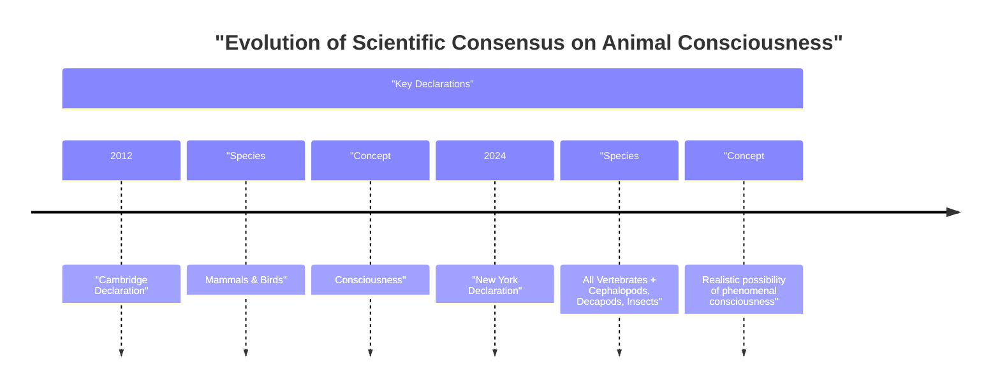

# The Animal Mind: Why Scientists Now See Consciousness in Insects and Octopuses

In 2022, researchers observed bumblebees doing something remarkable: they were playing. In a lab, these small, fuzzy insects repeatedly rolled wooden balls without any reward or connection to survival. It was, by all scientific measures, just for fun [[35]](https://www.scientificamerican.com/article/ball-rolling-bumble-bees-just-wanna-have-fun?ref=refind), [[36]](https://www.theguardian.com/science/2022/oct/27/bumblebees-playing-wooden-balls-bees-study), [[37]](https://www.qmul.ac.uk/news/latest-news/2022/se/first-ever-study-shows-bumble-bees-play.html), [[38]](https://www.sciencedirect.com/science/article/pii/S0003347222002366). This finding is part of a wave of evidence that has reshaped our understanding of animal minds, challenging long-held assumptions about where consciousness can be found.

This marks a profound break from centuries of scientific and philosophical tradition, much of which traces back to René Descartes. In the 17th century, Descartes argued that animals were mere automata—complex machines without feelings or a soul [[58]](https://pressbooks.bccampus.ca/psychologicalroots/chapter/evolutionary-psychology-animal-consciousness). This view, which separated human minds from non-human bodies, has long influenced Western thought, creating a high barrier for accepting animal consciousness.

For decades, a broad consensus held that animals similar to us, like other mammals and birds, were conscious. But recent research has pushed the boundaries, suggesting that consciousness might be widespread even in animals with vastly different nervous systems. This shift culminated in the 2024 New York Declaration on Animal Consciousness. The declaration states that “the empirical evidence indicates at least a realistic possibility of conscious experience in all vertebrates (including all reptiles, amphibians, and fishes) and many invertebrates (including, at minimum, cephalopod mollusks, decapod crustaceans, and insects)” [[52]](http://www.nydeclaration.com/). It deliberately uses the phrase “realistic possibility” to reflect scientific caution while acknowledging the strength of the new evidence [[22]](https://jeffsebo.net), [[32]](https://sites.google.com/nyu.edu/nydeclaration/background).

Unveiled on April 19, 2024, at a New York University conference, the declaration was spearheaded by philosopher Kristin Andrews, environmental scientist Jeff Sebo, and philosopher Jonathan Birch [[40]](https://www.kimmela.org/2024/05/05/a-new-declaration-on-animal-consciousness), [[24]](https://www.kimmela.org/2024/05/05/a-new-declaration-on-animal-consciousness). It was signed by a prominent group of researchers, including neuroscientists Anil Seth and Christof Koch, and philosophers David Chalmers and Peter Godfrey-Smith [[42]](https://www.theatlantic.com/science/archive/2024/04/animal-consciousness-declaration-new-york/678223).

The declaration focuses on phenomenal consciousness, the most basic form of subjective experience. Philosopher Thomas Nagel, in his 1974 essay "What Is It Like to Be a Bat?", defined it this way: “fundamentally an organism has conscious mental states if and only if there is something that it is like to be that organism—something it is like for the organism” [[43]](https://www.informationphilosopher.com/solutions/philosophers/nagelt), [[44]](https://www.cs.ox.ac.uk/activities/ieg/e-library/sources/nagel_bat.pdf), [[46]](https://thephilosophicalsalon.com/thomas-nagels-bat-and-ours). This is about raw feeling—pain, pleasure, hunger—not higher-order capacities like self-awareness.

This growing recognition of animal consciousness draws a sharp line between biological minds and artificial ones. As neuroscientist Anil Seth notes, the declaration should galvanize “an understanding and appreciation that we have much more in common with other animals than we do with things like ChatGPT” [[1]](https://www.theatlantic.com/science/archive/2024/04/animal-consciousness-declaration-new-york/678223), [[2]](https://www.quantamagazine.org/insects-and-other-animals-have-consciousness-experts-declare-20240419). While LLMs can process language, they show no evidence of the play, pain, or anxiety-like states now documented in many animals.

Image 1: A timeline diagram illustrating the evolution of scientific consensus on animal consciousness, contrasting the 2012 Cambridge Declaration with the 2024 New York Declaration.

The 2024 Declaration is the formal culmination of a rapid accumulation of behavioral evidence gathered over the last 10–15 years. The next section examines that evidence in detail, explains why the field moved to a public declaration, and dismantles the old neural-complexity barrier.

## A Growing Awareness

Over the past fifteen years, a surge of research has revealed surprisingly rich inner lives in a wide range of animals. These findings, which form the evidentiary backbone of the New York Declaration, have challenged our assumptions about what kinds of minds can experience the world. This "surge" is measurable: publications in animal sentience research increased tenfold in the two decades leading up to the first declaration in 2012, establishing it as a legitimate field of scientific study [[59]](https://pmc.ncbi.nlm.nih.gov/articles/PMC9704368).

The evidence is compelling. Octopuses, for instance, show clear signs of experiencing pain. When injured, they not only groom their wounds but also learn to avoid places where they were harmed and prefer locations where they received pain relief [[53]](https://sites.google.com/nyu.edu/nydeclaration/background?authuser=0). Cuttlefish demonstrate a form of episodic-like memory, recalling specific details of past events, including what happened, where, and when [[53]](https://sites.google.com/nyu.edu/nydeclaration/background?authuser=0). In the world of fish, cleaner wrasse appear to pass a version of the mirror-mark test, a classic indicator of self-recognition, by attempting to remove marks on their bodies after seeing their reflection [[53]](https://sites.google.com/nyu.edu/nydeclaration/background?authuser=0).

Invertebrates have shown equally impressive behaviors. As we saw, bumblebees engage in apparent play, rolling wooden balls for no reward, a behavior consistent with a positive emotional state [[35]](https://www.scientificamerican.com/article/ball-rolling-bumble-bees-just-wanna-have-fun?ref=refind), [[53]](https://sites.google.com/nyu.edu/nydeclaration/background?authuser=0). Fruit flies exhibit distinct sleep patterns—active and quiet—that are disrupted by social isolation, much like in humans [[53]](https://sites.google.com/nyu.edu/nydeclaration/background?authuser=0). Crayfish display anxiety-like behaviors when stressed, becoming more cautious and avoidant of bright, open spaces. These behaviors are reversed by the same anti-anxiety drugs used in humans, such as benzodiazepines, suggesting a shared neurochemical basis for these states [[53]](https://sites.google.com/nyu.edu/nydeclaration/background?authuser=0).

This behavioral evidence is indirect, however, facing the classic "problem of other minds"—we can never directly access another’s experience [[60]](https://www.animal-ethics.org/invertebrate-sentience-a-review-of-the-behavioral-evidence). Researchers must distinguish conscious states from unconscious reflexes, and current theories conflict on whether human-like neural structures are required for consciousness at all [[61]](https://www.frontiersin.org/journals/behavioral-neuroscience/articles/10.3389/fnbeh.2021.653041/full).

As this evidence mounted, an informal consensus grew among specialists. However, this agreement was not reaching policymakers or the broader public. Jeff Sebo, one of the declaration's organizers, noted that while many scientists accepted consciousness in mammals and birds, "less attention has been paid to other vertebrate and especially invertebrate taxa" [[54]](https://www.quantamagazine.org/insects-and-other-animals-have-consciousness-experts-declare-20240419/). The declaration was created to formalize this new consensus and communicate it clearly, aiming to influence research priorities and animal welfare policies [[32]](https://sites.google.com/nyu.edu/nydeclaration/background).

While the scientific consensus is new, the case for invertebrate sentience is not. Philosophers and activists have long argued for their moral consideration, but the recent accumulation of data has moved the discussion from the philosophical to the empirical [[62]](https://www.animal-ethics.org/the-new-york-declaration-on-animal-consciousness-stresses-the-ethical-implications).

This new declaration represents a significant expansion of the 2012 Cambridge Declaration on Consciousness. The earlier document asserted that non-human animals, including all mammals and birds, possess the "neurological substrates that generate consciousness" [[55]](CambridgeDeclarationOnConsciousness.md). The 2024 New York Declaration widens this circle to include all vertebrates and many invertebrates. It also adopts more careful phrasing, stating there is a "realistic possibility of conscious experience" [[52]](http://www.nydeclaration.com/). This reflects a nuanced scientific position: not absolute certainty, but a high enough probability to warrant serious ethical consideration. As Peter Godfrey-Smith observes, the complex, attentive behaviors of animals like octopuses make it "very hard not to think that there’s quite a lot going on inside them" [[54]](https://www.quantamagazine.org/insects-and-other-animals-have-consciousness-experts-declare-20240419).

A long-standing objection to invertebrate consciousness was the vast difference in brain structure. However, recent findings have dismantled this barrier. A bee's brain has only about one million neurons compared to a human's 86 billion, but each neuron is highly complex and densely connected, which is sufficient for sophisticated behaviors like play and social learning [[54]](https://www.quantamagazine.org/insects-and-other-animals-have-consciousness-experts-declare-20240419). The octopus provides another example of an alien architecture. Its nervous system is highly distributed, with about two-thirds of its 500 million neurons located in its arms [[10]](https://neuroscience.stanford.edu/news/octopus-brains), [[9]](https://www.sciencealert.com/octopus-arms-are-controlled-by-a-nervous-system-thats-like-no-other). A severed octopus arm can continue to perform complex actions, demonstrating that sophisticated control can occur without a centralized brain directing every move [[13]](https://pmc.ncbi.nlm.nih.gov/articles/PMC8988249).

Furthermore, a cerebral cortex—once considered essential for consciousness—is not a prerequisite. As Kristin Andrews explains, animals like birds, reptiles, and fish have "very different brain structures" that perform "the same kind of work that a cerebral cortex does in humans" [[54]](https://www.quantamagazine.org/insects-and-other-animals-have-consciousness-experts-declare-20240419). The avian pallium in birds and the vertical lobe in octopuses are examples of structures that support advanced learning, memory, and multi-sensory integration, functions analogous to those of the mammalian cortex [[47]](https://asknature.org/strategy/complex-memory-processing-in-the-cephalopod-vertical-lobe), [[49]](https://asknature.org/strategy/bird-brains-use-unique-structure-to-support-high-intelligence).

A parallel debate over plant consciousness highlights this focus on architecture. While some draw analogies between plant signaling and animal nervous systems, critics point to a lack of organizational complexity. Models of consciousness often posit a structural threshold met by invertebrates but not by organisms lacking neurons, like plants [[63]](https://news.ucsc.edu/2019/07/plant-consciousness). Peter Godfrey-Smith concludes that consciousness can arise from electrical oscillations in living brains, a process not tied to a specific architecture [[27]](https://iai.tv/articles/studies-on-animal-minds-suggest-consciousness-is-not-computation-auid-3535). He argues that cephalopods represent an "independent experiment in the evolution of large and complex nervous systems" [[29]](https://petergodfreysmith.com/wp-content/uploads/2013/06/Cephalopods_PGS_PacConBio_2013.pdf).

With the evidentiary and architectural arguments now pointing toward a broader distribution of consciousness, the scientific default has shifted. This pivot forces us to confront the downstream ethical obligations and practical policy implications that follow.

## Mindful Relations

Accepting the realistic possibility of consciousness in a wider range of animals compels a shift in our ethical framework. The obligation moves beyond simply preventing pain. As Jeff Sebo argues, "We also have to provide them with the kinds of enrichment and opportunities that allow them to express their instincts and explore their environments and engage in social systems and otherwise be the kinds of complex agents they are" [[31]](https://www.quantamagazine.org/insects-and-other-animals-have-consciousness-experts-declare-20240419). This means creating environments that allow for positive experiences, not just the absence of negative ones.

However, this expanded ethical consideration creates practical tensions, especially with insects. Our relationship with many insects is "inevitably a somewhat antagonistic one," as Peter Godfrey-Smith points out [[54]](https://www.quantamagazine.org/insects-and-other-animals-have-consciousness-experts-declare-20240419). We cannot make peace with mosquitoes that carry diseases or pests that destroy crops. This reality forces us into a difficult position of making explicit trade-offs rather than adopting a simple stance of avoiding all harm.

These tensions extend into agriculture, where the welfare of farmed invertebrates like shrimp and octopuses is often overlooked in sustainability goals [[64]](https://assets.publishing.service.gov.uk/media/5a7f9365ed915d74e33f747f/Advice_about_sustainable_agriculture_and_farm_animal_welfare_-_final_2016.pdf). The same applies to beneficial insects like bees, where welfare concerns are often driven by economic impacts like colony collapse [[65]](https://rethinkpriorities.org/research-area/next-steps-in-invertebrate-welfare-part-3-understanding-attitudes-and-possibilities).

A significant welfare gap also exists in scientific research. Vertebrates in labs are protected by welfare committees, but invertebrates like fruit flies are not, despite their central role in neuroscience [[19]](https://www.thetransmitter.org/policy/knowledge-gaps-in-cephalopod-care-could-stall-welfare-standards). This inconsistency is becoming harder to justify as evidence for their potential sentience grows.

Policy is beginning to catch up. In the UK, a government-commissioned review found strong evidence of sentience in cephalopods and decapod crustaceans, leading to their inclusion in the 2022 Animal Welfare (Sentience) Act [[5]](https://naturewatch.org/study-confirms-animal-sentience-in-crustaceans), [[7]](https://www.eurogroupforanimals.org/news/decapods-and-cephalopods-be-recognised-sentient-beings-under-uk-law), [[6]](https://www.eurogroupforanimals.org/news/uk-sentience-bill-passes-final-stages-recognise-decapod-and-cephalopod-sentience-law), [[56]](Animal%20Welfare%20(Sentience)%20Bill.md).

The rapid evolution in our understanding of animal minds serves as a cautionary tale for the debate on AI consciousness. Sentience is widely seen as a basis for **moral standing**, yet current AI systems are very unlikely to be conscious on the same evidentiary standards applied to animals [[66]](https://pmc.ncbi.nlm.nih.gov/articles/PMC10436038). Sebo notes that what we have learned from animals "does give me pause and makes me want to approach the topic with caution and humility" [[54]](https://www.quantamagazine.org/insects-and-other-animals-have-consciousness-experts-declare-20240419). A unique challenge is that AI can be programmed to convincingly mimic pain, potentially creating social pressure to grant rights even if no inner experience exists [[67]](https://undark.org/2023/07/14/interview-the-ethical-puzzle-of-sentient-ai).

The future of this field lies in expanding our research. Kristin Andrews urges scientists to use the resources they already have. "All these nematode worms and fruit flies that are in almost every university—study consciousness in them," she says. "Imagine that!" [[54]](https://www.quantamagazine.org/insects-and-other-animals-have-consciousness-experts-declare-20240419). By turning our scientific attention to these overlooked organisms, we may discover that the circle of consciousness is even wider than we currently imagine.

## References

- [1] https://www.theatlantic.com/science/archive/2024/04/animal-consciousness-declaration-new-york/678223
- [2] https://www.quantamagazine.org/insects-and-other-animals-have-consciousness-experts-declare-20240419
- [4] https://www.animalask.org/post/does-sentience-legislation-help-animals
- [5] https://naturewatch.org/study-confirms-animal-sentience-in-crustaceans
- [6] https://www.eurogroupforanimals.org/news/uk-sentience-bill-passes-final-stages-recognise-decapod-and-cephalopod-sentience-law
- [7] https://www.eurogroupforanimals.org/news/decapods-and-cephalopods-be-recognised-sentient-beings-under-uk-law
- [8] https://researchbriefings.files.parliament.uk/documents/CBP-9423/CBP-9423.pdf
- [9] https://www.sciencealert.com/octopus-arms-are-controlled-by-a-nervous-system-thats-like-no-other
- [10] https://neuroscience.stanford.edu/news/octopus-brains
- [12] https://www.nature.com/articles/s41467-024-55475-5
- [13] https://pmc.ncbi.nlm.nih.gov/articles/PMC8988249
- [14] https://www.multiverses.xyz/podcast/animal-minds-kristin-andrews-on-assuming-consciousness-in-other-species
- [19] https://www.thetransmitter.org/policy/knowledge-gaps-in-cephalopod-care-could-stall-welfare-standards
- [22] https://jeffsebo.net
- [24] https://www.kimmela.org/2024/05/05/a-new-declaration-on-animal-consciousness
- [26] https://petergodfreysmith.com/living-on-earth-notes-to-chapter-6
- [27] https://iai.tv/articles/studies-on-animal-minds-suggest-consciousness-is-not-computation-auid-3535
- [29] https://petergodfreysmith.com/wp-content/uploads/2013/06/Cephalopods_PGS_PacConBio_2013.pdf
- [30] https://www.frontiersin.org/journals/psychology/articles/10.3389/fpsyg.2025.1700354/full
- [31] https://www.quantamagazine.org/insects-and-other-animals-have-consciousness-experts-declare-20240419
- [32] https://sites.google.com/nyu.edu/nydeclaration/background
- [33] https://nextbigideaclub.com/magazine/ai-deserve-protection-philosopher-ethics-living-non-human-intelligence-bookbite/54074
- [35] https://www.scientificamerican.com/article/ball-rolling-bumble-bees-just-wanna-have-fun?ref=refind
- [36] https://www.theguardian.com/science/2022/oct/27/bumblebees-playing-wooden-balls-bees-study
- [37] https://www.qmul.ac.uk/news/latest-news/2022/se/first-ever-study-shows-bumble-bees-play.html
- [38] https://www.sciencedirect.com/science/article/pii/S0003347222002366
- [39] https://www.nature.com/articles/s41586-024-07126-4
- [40] https://www.kimmela.org/2024/05/05/a-new-declaration-on-animal-consciousness
- [41] https://thebrooksinstitute.org/animal-law-digest/us/issue-259/hundreds-experts-sign-new-york-declaration-animal-consciousness
- [42] https://www.theatlantic.com/science/archive/2024/04/animal-consciousness-declaration-new-york/678223
- [43] https://www.informationphilosopher.com/solutions/philosophers/nagelt
- [44] https://www.cs.ox.ac.uk/activities/ieg/e-library/sources/nagel_bat.pdf
- [45] https://en.wikipedia.org/wiki/What_Is_It_Like_to_Be_a_Bat%3F
- [46] https://thephilosophicalsalon.com/thomas-nagels-bat-and-ours
- [47] https://asknature.org/strategy/complex-memory-processing-in-the-cephalopod-vertical-lobe
- [48] https://en.wikipedia.org/wiki/Avian_pallium
- [49] https://asknature.org/strategy/bird-brains-use-unique-structure-to-support-high-intelligence
- [50] https://pmc.ncbi.nlm.nih.gov/articles/PMC10940863
- [51] https://elifesciences.org/articles/84257
- [52] http://www.nydeclaration.com/
- [53] https://sites.google.com/nyu.edu/nydeclaration/background?authuser=0
- [54] https://www.quantamagazine.org/insects-and-other-animals-have-consciousness-experts-declare-20240419
- [55] CambridgeDeclarationOnConsciousness.md
- [56] Animal Welfare (Sentience) Bill.md
- [57] What Is It Like to Be a Bat.md
- [58] https://pressbooks.bccampus.ca/psychologicalroots/chapter/evolutionary-psychology-animal-consciousness
- [59] https://pmc.ncbi.nlm.nih.gov/articles/PMC9704368
- [60] https://www.animal-ethics.org/invertebrate-sentience-a-review-of-the-behavioral-evidence
- [61] https://www.frontiersin.org/journals/behavioral-neuroscience/articles/10.3389/fnbeh.2021.653041/full
- [62] https://www.animal-ethics.org/the-new-york-declaration-on-animal-consciousness-stresses-the-ethical-implications
- [63] https://news.ucsc.edu/2019/07/plant-consciousness
- [64] https://assets.publishing.service.gov.uk/media/5a7f9365ed915d74e33f747f/Advice_about_sustainable_agriculture_and_farm_animal_welfare_-_final_2016.pdf
- [65] https://rethinkpriorities.org/research-area/next-steps-in-invertebrate-welfare-part-3-understanding-attitudes-and-possibilities
- [66] https://pmc.ncbi.nlm.nih.gov/articles/PMC10436038
- [67] https://undark.org/2023/07/14/interview-the-ethical-puzzle-of-sentient-ai