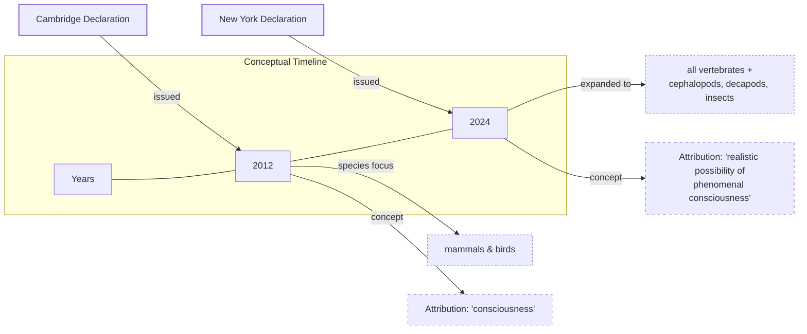

# The Widening Circle of Consciousness

In 2022, a study revealed something remarkable about bumblebees. When given small wooden balls in an arena, they pushed and rolled them around. This behavior had no connection to survival, mating, or any external reward. The bees were, for all intents and purposes, playing [[35]](https://www.scientificamerican.com/article/ball-rolling-bumble-bees-just-wanna-have-fun?ref=refind), [[36]](https://www.theguardian.com/science/2022/oct/27/bumblebees-playing-wooden-balls-bees-study), [[38]](https://www.sciencedirect.com/science/article/pii/S0003347222002366). This finding, that complex affective states might exist in tiny brains, is part of a wave of research that challenges our long-held assumptions about animal minds. However, some researchers suggest alternative interpretations, such as stress relief or instinctual problem-solving, highlighting the ongoing debate about the inner lives of invertebrates [[50]](https://www.psychologytoday.com/us/blog/animal-emotions/202211/bumble-bees-play-balls-and-may-even-enjoy-it).

For decades, scientists broadly agreed that animals similar to us, like other mammals and birds, are conscious. However, recent evidence has pushed us to acknowledge that consciousness might also be widespread among animals very different from us. This shift was formalized in the 2024 New York Declaration on Animal Consciousness, which states that there is "a realistic possibility of conscious experience in all vertebrates (including all reptiles, amphibians, and fishes) and many invertebrates (including, at minimum, cephalopod mollusks, decapod crustaceans, and insects)" [[22]](https://jeffsebo.net), [The New York Declaration on Animal Consciousness](http://www.nydeclaration.com/). The declaration deliberately uses the phrase "realistic possibility" to reflect scientific caution while still marking a significant consensus shift [[32]](https://sites.google.com/nyu.edu/nydeclaration/background).

Unveiled on April 19, 2024, at a conference at New York University, the declaration was spearheaded by philosopher Kristin Andrews, environmental scientist Jeff Sebo, and philosopher Jonathan Birch [[40]](https://www.kimmela.org/2024/05/05/a-new-declaration-on-animal-consciousness), [[42]](https://www.theatlantic.com/science/archive/2024/04/animal-consciousness-declaration-new-york/678223). It was initially signed by dozens of prominent researchers, including neuroscientists Anil Seth and Christof Koch, and philosophers David Chalmers and Peter Godfrey-Smith [[42]](https://www.theatlantic.com/science/archive/2024/04/animal-consciousness-declaration-new-york/678223). Since its launch, the declaration has gained considerable momentum, with the number of signatories growing into the hundreds, reflecting its widening influence in the scientific community [[51]](https://unfinishablemap.org/research/invertebrate-consciousness-interface-test-case-2026-04-06).

The declaration focuses on phenomenal consciousness, the most basic form of subjective experience. It addresses what philosopher Thomas Nagel, in his 1974 essay, called the "subjective character of experience": that "an organism has conscious mental states if and only if there is something that it is like to be that organism—something it is like for the organism" [[44]](https://www.cs.ox.ac.uk/activities/ieg/e-library/sources/nagel_bat.pdf), [What Is It Like to Be a Bat?](https://www.sas.upenn.edu/~cavitch/pdf-library/Nagel_Bat.pdf). This is about raw feeling, like pain or pleasure, not higher-order capacities like self-awareness or complex reasoning [[32]](https://sites.google.com/nyu.edu/nydeclaration/background).

This growing understanding of animal minds draws a sharp line between biological consciousness and artificial intelligence. As neuroscientist Anil Seth notes, the declaration should galvanize "an understanding and appreciation that we have much more in common with other animals than we do with things like ChatGPT" [[1]](https://www.theatlantic.com/science/archive/2024/04/animal-consciousness-declaration-new-york/678223), [[2]](https://www.quantamagazine.org/insects-and-other-animals-have-consciousness-experts-declare-20240419). Current LLMs can produce impressive text, but they lack the behavioral and physiological evidence of subjective experience we see in animals.

Image 1: A conceptual timeline diagram contrasting the 2012 Cambridge Declaration with the 2024 New York Declaration, illustrating the widening circle of species considered possibly conscious and the shift in attribution.

The 2024 Declaration is the formal culmination of over a decade of accumulating behavioral evidence. The next section examines that evidence, explains why the scientific community moved toward a public declaration, and dismantles the old arguments against consciousness in simpler organisms.

## A Growing Awareness

The New York Declaration did not emerge from a vacuum. The intellectual tide began turning with Charles Darwin, whose evolutionary framework implied a continuity between human and animal minds. By the late twentieth century, fueled by the rise of cognitive science and the work of ethologists like Donald Griffin, the scientific consensus began to shift, making today’s declaration possible [[52]](https://philosophy.institute/philosophy-of-mind/animal-consciousness-debate-science-philosophy). It was built on a foundation of striking behavioral research from the last 15 years that revealed surprisingly rich inner lives in a wide range of animals.

A key piece of evidence comes from octopuses. In a 2021 study, octopuses that were injected with acetic acid showed signs of pain, including avoiding the chamber where the injection occurred and grooming the affected area. When later given an anesthetic in a different chamber, they developed a lasting preference for that location, suggesting the drug provided relief [[32]](https://sites.google.com/nyu.edu/nydeclaration/background). Cuttlefish have demonstrated a form of episodic-like memory, remembering not just what, where, and when a past event occurred, but also how they experienced it—for example, whether they saw or smelled a piece of prey [[32]](https://sites.google.com/nyu.edu/nydeclaration/background).

Even fish have shown surprising cognitive abilities. The case of the cleaner wrasse passing a version of the mirror-mark test has been particularly compelling and controversial. After seeing a colored mark on their throat in a mirror, the fish attempt to scrape it off. Critics initially raised numerous objections, but follow-up studies addressed these by increasing sample sizes and ensuring the mark was ecologically relevant, resembling a parasite. These results strengthened the case that the fish were demonstrating self-recognition [[53]](https://pmc.ncbi.nlm.nih.gov/articles/PMC8853551). A 2024 study further advanced this by showing that fish who passed the test stopped attacking their own photograph while still attacking photos of strangers, suggesting they had formed a mental image of their own face [[54]](https://www.pnas.org/doi/10.1073/pnas.2208420120).

Invertebrates have also been a source of fascinating discoveries. As mentioned, bumblebees engage in what appears to be play behavior, rolling wooden balls for intrinsic reward [[35]](https://www.scientificamerican.com/article/ball-rolling-bumble-bees-just-wanna-have-fun?ref=refind), [[32]](https://sites.google.com/nyu.edu/nydeclaration/background). Fruit flies exhibit distinct active and quiet sleep patterns, which are disrupted by social isolation [[32]](https://sites.google.com/nyu.edu/nydeclaration/background). Furthermore, crayfish show "anxiety-like" states. This behavior can be induced not only by electric shocks but also by social harassment from a dominant crayfish. It is reversed when they are given benzodiazepines, the same class of drugs used to treat anxiety in humans, and can be prevented by serotonin antagonists, linking the behavior to specific neurochemical pathways shared with vertebrates [[32]](https://sites.google.com/nyu.edu/nydeclaration/background), [[55]](https://www.nature.com/articles/srep39935).

As this evidence mounted, a consensus began to form among specialists that consciousness was likely more widespread than publicly acknowledged. According to Jeff Sebo, one of the declaration's organizers, this informal agreement needed to be communicated to the wider public, scientists, and policymakers to influence research and welfare standards [[31]](https://www.quantamagazine.org/insects-and-other-animals-have-consciousness-experts-declare-20240419). The move is not without its critics, however, with some researchers arguing that the declaration is a "broad overstatement" that could hinder scientific progress by oversimplifying a complex issue [[56]](https://www.thetransmitter.org/consciousness/premature-declarations-on-animal-consciousness-hinder-progress).

The New York Declaration updates a previous consensus statement, the 2012 Cambridge Declaration on Consciousness. The 2012 document asserted that "non-human animals, including all mammals and birds, and many other creatures, including octopuses, also possess these neurological substrates" for consciousness [Cambridge Declaration on Consciousness](http://fcmconference.org/img/CambridgeDeclarationOnConsciousness.pdf). The 2024 declaration expands this scope significantly, including all vertebrates and many invertebrates, while adopting more cautious phrasing. It speaks of a "realistic possibility of conscious experience," a deliberate choice to reflect scientific rigor without demanding absolute certainty [[2]](https://www.quantamagazine.org/insects-and-other-animals-have-consciousness-experts-declare-20240419), [The New York Declaration on Animal Consciousness](http://www.nydeclaration.com/). As Peter Godfrey-Smith noted, the complex behaviors of animals like octopuses, including problem-solving and play, make it "very hard not to think that there’s quite a lot going on inside them" [[2]](https://www.quantamagazine.org/insects-and-other-animals-have-consciousness-experts-declare-20240419).

This new consensus rejects the long-held assumption that a human-like brain is a prerequisite for consciousness. A bee's brain has only about a million neurons compared to a human's 86 billion, but its neurons are incredibly complex and densely connected, enabling behaviors like play and social learning [[2]](https://www.quantamagazine.org/insects-and-other-animals-have-consciousness-experts-declare-20240419). This shows that absolute neuron count is not the deciding factor.

The octopus provides another powerful counterexample. Its nervous system is highly distributed, with about two-thirds of its 500 million neurons located in its arms [[10]](https://neuroscience.stanford.edu/news/octopus-brains), [[11]](https://www.youtube.com/watch?v=W9Gnw7B7oGM). A severed octopus arm can continue to exhibit complex behaviors, such as grasping and avoidance, for hours after amputation [[13]](https://pmc.ncbi.nlm.nih.gov/articles/PMC8988249). This demonstrates that sophisticated sensory-motor control can occur without a centralized brain, challenging our vertebrate-centric models of cognition [[13]](https://pmc.ncbi.nlm.nih.gov/articles/PMC8988249).

Furthermore, the idea that a cerebral cortex is necessary for consciousness is also being dismantled. As philosopher Kristin Andrews points out, birds, reptiles, and fish have very different brain structures, yet some of these structures perform functions analogous to the human cortex [[2]](https://www.quantamagazine.org/insects-and-other-animals-have-consciousness-experts-declare-20240419). For example, the avian pallium in birds and the vertical lobe in octopuses are involved in complex memory and learning, showing that cortex-like functions can arise from entirely different neural architectures [[47]](https://asknature.org/strategy/complex-memory-processing-in-the-cephalopod-vertical-lobe), [[49]](https://asknature.org/strategy/bird-brains-use-unique-structure-to-support-high-intelligence). Peter Godfrey-Smith argues that consciousness seems to arise from electrical oscillations in living brains, a property not dependent on a specific structure but on the right kind of dynamic activity [[27]](https://iai.tv/articles/studies-on-animal-minds-suggest-consciousness-is-not-computation-auid-3535). He concludes that behaviors indicating consciousness "can exist in an architecture that looks completely alien to vertebrate or human architecture" [[2]](https://www.quantamagazine.org/insects-and-other-animals-have-consciousness-experts-declare-20240419).

With the scientific and architectural arguments now pointing toward a more inclusive view of consciousness, the focus shifts to the ethical, practical, and policy implications of this new understanding.

## Mindful Relations

Accepting the realistic possibility of phenomenal consciousness in a wider range of animals creates new ethical obligations. The declaration states that "it is irresponsible to ignore that possibility in decisions affecting that animal" [[57]](https://sites.google.com/nyu.edu/nydeclaration/declaration). According to Jeff Sebo, this goes beyond simply preventing pain. We must also provide animals in our care with "the kinds of enrichment and opportunities that allow them to express their instincts and explore their environments and engage in social systems and otherwise be the kinds of complex agents they are" [[31]](https://www.quantamagazine.org/insects-and-other-animals-have-consciousness-experts-declare-20240419).

However, extending these considerations to all animals, especially insects, creates practical tensions. As Peter Godfrey-Smith points out, our relationship with many insects is "inevitably a somewhat antagonistic one," involving crop pests and disease-carrying mosquitoes [[2]](https://www.quantamagazine.org/insects-and-other-animals-have-consciousness-experts-declare-20240419). The idea of making "peace with the mosquitoes" is very different from doing so with fish or octopuses, forcing us into a more nuanced ethical calculus of trade-offs rather than a simple rule of non-interference [[2]](https://www.quantamagazine.org/insects-and-other-animals-have-consciousness-experts-declare-20240419).

These tensions are amplified by the emerging industry of insect farming for food and feed. Insects in these facilities are often described as "biomass" rather than animals, and their killing is termed "harvesting." This operates in a legal gray area, as invertebrates are typically excluded from animal welfare directives, leading to practices developed by trial and error without oversight [[58]](https://faunalytics.org/do-consumers-care-about-farmed-insect-welfare). This highlights how psychological biases that make it hard to accept insect sentience can directly impact their treatment [[59]](https://forum.effectivealtruism.org/posts/2RdYDcwrnvdCn2SbK/the-case-for-insect-consciousness).

This new awareness also exposes a significant welfare gap in scientific research. While standards exist for lab rodents, insects like *Drosophila melanogaster* (fruit flies) are used in countless experiments with no protocols addressing their potential sentience [[2]](https://www.quantamagazine.org/insects-and-other-animals-have-consciousness-experts-declare-20240419). In contrast, growing evidence of cephalopod and decapod sentience has already led to policy changes. In the UK, a government-commissioned review by the London School of Economics concluded there was strong evidence of sentience in these animals [[6]](https://www.eurogroupforanimals.org/news/uk-sentience-bill-passes-final-stages-recognise-decapod-and-cephalopod-sentience-law), [[7]](https://www.eurogroupforanimals.org/news/decapods-and-cephalopods-be-recognised-sentient-beings-under-uk-law). This led to their inclusion in the Animal Welfare (Sentience) Act of 2022, a concrete example of how scientific consensus can translate into law [[6]](https://www.eurogroupforanimals.org/news/uk-sentience-bill-passes-final-stages-recognise-decapod-and-cephalopod-sentience-law), [Animal Welfare (Sentience) Bill](https://researchbriefings.files.parliament.uk/documents/CBP-9423/CBP-9423.pdf).

The discussion around animal minds offers a cautionary lesson for the field of AI. While Sebo and other experts agree that "current AI systems are very unlikely to be conscious," the rapid evolution of our understanding of animal consciousness advises "caution and humility" when considering the future of AI [[2]](https://www.quantamagazine.org/insects-and-other-animals-have-consciousness-experts-declare-20240419). The core principle is that subjective experience is what matters for moral consideration, not the substrate—whether it is biological or artificial [[60]](https://www.animal-ethics.org/the-new-york-declaration-on-animal-consciousness-stresses-the-ethical-implications).

Ultimately, the path forward involves more research. Kristin Andrews has made a powerful call to action: use the animals we already have in our labs. "All these nematode worms and fruit flies that are in almost every university—study consciousness in them," she urges. "You already have them. Somebody in your lab is going to need a project. Make that project a consciousness project. Imagine that!" [[2]](https://www.quantamagazine.org/insects-and-other-animals-have-consciousness-experts-declare-20240419). This could open the door to using powerful genetic tools to test different hypotheses about consciousness and better understand its fundamental mechanisms, a pursuit that could further expand our appreciation for the vast diversity of minds on our planet [[14]](https://www.multiverses.xyz/podcast/animal-minds-kristin-andrews-on-assuming-consciousness-in-other-species), [[61]](https://pmc.ncbi.nlm.nih.gov/articles/PMC10723751).

## References

- [1] https://www.theatlantic.com/science/archive/2024/04/animal-consciousness-declaration-new-york/678223
- [2] https://www.quantamagazine.org/insects-and-other-animals-have-consciousness-experts-declare-20240419
- [3] https://advancedconsciousness.org/revisiting-animal-consciousness
- [4] https://www.animalask.org/post/does-sentience-legislation-help-animals
- [5] https://naturewatch.org/study-confirms-animal-sentience-in-crustaceans
- [6] https://www.eurogroupforanimals.org/news/uk-sentience-bill-passes-final-stages-recognise-decapod-and-cephalopod-sentience-law
- [7] https://www.eurogroupforanimals.org/news/decapods-and-cephalopods-be-recognised-sentient-beings-under-uk-law
- [8] https://researchbriefings.files.parliament.uk/documents/CBP-9423/CBP-9423.pdf
- [9] https://www.sciencealert.com/octopus-arms-are-controlled-by-a-nervous-system-thats-like-no-other
- [10] https://neuroscience.stanford.edu/news/octopus-brains
- [11] https://www.youtube.com/watch?v=W9Gnw7B7oGM
- [12] https://www.nature.com/articles/s41467-024-55475-5
- [13] https://pmc.ncbi.nlm.nih.gov/articles/PMC8988249
- [14] https://www.multiverses.xyz/podcast/animal-minds-kristin-andrews-on-assuming-consciousness-in-other-species
- [15] https://www.youtube.com/watch?v=aXAoxUXnkug
- [16] https://www.thetransmitter.org/policy/knowledge-gaps-in-cephalopod-care-could-stall-welfare-standards
- [17] https://scholar.google.com/citations?user=VkrvWREAAAAJ&hl=en
- [18] https://www.youtube.com/watch?v=ak3WuQhtoW4
- [19] https://jeffsebo.net
- [20] https://www.linkedin.com/posts/jeff-sebo-ab6081231_thrilled-to-be-able-to-share-the-2024-annual-activity-7290836697666240512-vGiu
- [21] https://www.kimmela.org/2024/05/05/a-new-declaration-on-animal-consciousness
- [22] http://www.nydeclaration.com/
- [23] https://www.youtube.com/watch?v=Mi4-EOThAIc
- [24] https://petergodfreysmith.com/living-on-earth-notes-to-chapter-6
- [25] https://iai.tv/articles/studies-on-animal-minds-suggest-consciousness-is-not-computation-auid-3535
- [26] https://www.youtube.com/watch?v=RkWvrt9GXsc
- [27] https://petergodfreysmith.com/wp-content/uploads/2013/06/Cephalopods_PGS_PacConBio_2013.pdf
- [28] https://www.frontiersin.org/journals/psychology/articles/10.3389/fpsyg.2025.1700354/full
- [29] https://sites.google.com/nyu.edu/nydeclaration/background
- [30] https://nextbigideaclub.com/magazine/ai-deserve-protection-philosopher-ethics-living-non-human-intelligence-bookbite/54074
- [31] https://www.effectivealtruism.org/stories/jeff-sebo
- [32] https://sites.google.com/nyu.edu/nydeclaration/background
- [33] https://www.scientificamerican.com/article/ball-rolling-bumble-bees-just-wanna-have-fun?ref=refind
- [34] https://www.theguardian.com/science/2022/oct/27/bumblebees-playing-wooden-balls-bees-study
- [35] https://www.qmul.ac.uk/news/latest-news/2022/se/first-ever-study-shows-bumble-bees-play.html
- [36] https://www.sciencedirect.com/science/article/pii/S0003347222002366
- [37] https://www.nature.com/articles/s41586-024-07126-4
- [38] https://thebrooksinstitute.org/animal-law-digest/us/issue-259/hundreds-experts-sign-new-york-declaration-animal-consciousness
- [39] https://www.informationphilosopher.com/solutions/philosophers/nagelt
- [40] https://www.cs.ox.ac.uk/activities/ieg/e-library/sources/nagel_bat.pdf
- [41] https://en.wikipedia.org/wiki/What_Is_It_Like_to_Be_a_Bat%3F
- [42] https://thephilosophicalsalon.com/thomas-nagels-bat-and-ours
- [43] https://asknature.org/strategy/complex-memory-processing-in-the-cephalopod-vertical-lobe
- [44] https://en.wikipedia.org/wiki/Avian_pallium
- [45] https://asknature.org/strategy/bird-brains-use-unique-structure-to-support-high-intelligence
- [46] https://pmc.ncbi.nlm.nih.gov/articles/PMC10940863
- [47] https://elifesciences.org/articles/84257
- [48] [Cambridge Declaration on Consciousness](http://fcmconference.org/img/CambridgeDeclarationOnConsciousness.pdf)
- [49] [What Is It Like to Be a Bat?](https://www.sas.upenn.edu/~cavitch/pdf-library/Nagel_Bat.pdf)
- [50] https://www.psychologytoday.com/us/blog/animal-emotions/202211/bumble-bees-play-balls-and-may-even-enjoy-it
- [51] https://unfinishablemap.org/research/invertebrate-consciousness-interface-test-case-2026-04-06
- [52] https://philosophy.institute/philosophy-of-mind/animal-consciousness-debate-science-philosophy
- [53] https://pmc.ncbi.nlm.nih.gov/articles/PMC8853551
- [54] https://www.pnas.org/doi/10.1073/pnas.2208420120
- [55] https://www.nature.com/articles/srep39935
- [56] https://www.thetransmitter.org/consciousness/premature-declarations-on-animal-consciousness-hinder-progress
- [57] https://sites.google.com/nyu.edu/nydeclaration/declaration
- [58] https://faunalytics.org/do-consumers-care-about-farmed-insect-welfare
- [59] https://forum.effectivealtruism.org/posts/2RdYDcwrnvdCn2SbK/the-case-for-insect-consciousness
- [60] https://www.animal-ethics.org/the-new-york-declaration-on-animal-consciousness-stresses-the-ethical-implications
- [61] https://pmc.ncbi.nlm.nih.gov/articles/PMC10723751