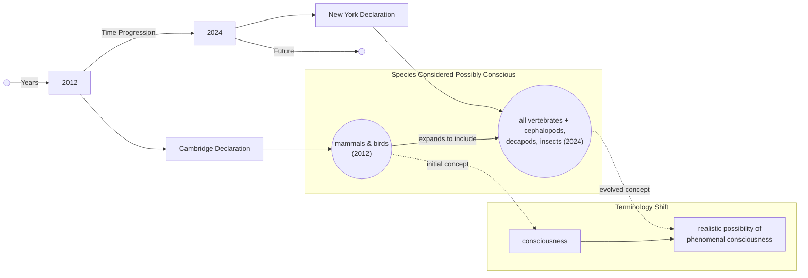

# Beyond Brains: The New Science of Animal Consciousness

In 2022, a study found that bumblebees would voluntarily roll small wooden balls, even when they were not rewarded with food or driven by any obvious survival need. This behavior, which looked a lot like play, suggested that even tiny-brained insects might have complex inner lives [[1]](https://www.scientificamerican.com/article/ball-rolling-bumble-bees-just-wanna-have-fun?ref=refind), [[2]](https://www.sciencedirect.com/science/article/pii/S0003347222002366). This finding is part of a growing body of evidence that challenges our long-held assumptions about where we can find consciousness in the animal kingdom.

For decades, scientists largely agreed that animals neurologically similar to us, like other mammals and birds, were conscious. However, recent research has begun to suggest that consciousness might be widespread even among animals very different from us. This shift led to the 2024 New York Declaration on Animal Consciousness, which formally embraces this new perspective [[3]](https://www.kimmela.org/2024/05/05/a-new-declaration-on-animal-consciousness). The declaration states: "The empirical evidence indicates at least a realistic possibility of conscious experience in all vertebrates (including all reptiles, amphibians, and fishes) and many invertebrates (including, at minimum, cephalopod mollusks, decapod crustaceans, and insects)" [[4]](http://www.nydeclaration.com/). This conclusion emphasizes a "realistic possibility" rather than absolute certainty, reflecting a cautious but significant change in scientific consensus.

The declaration was unveiled on April 19, 2024, at a conference at New York University. It was organized by philosophers Kristin Andrews, Jeff Sebo, and Jonathan Birch and was initially signed by dozens of leading researchers, including neuroscientists Anil Seth and Christof Koch, and philosophers David Chalmers and Peter Godfrey-Smith [[3]](https://www.kimmela.org/2024/05/05/a-new-declaration-on-animal-consciousness), [[5]](https://www.theatlantic.com/science/archive/2024/04/animal-consciousness-declaration-new-york/678223).

The document focuses on what we call phenomenal consciousness. This is the most basic form of subjective experience, famously defined by philosopher Thomas Nagel in his 1974 essay, "What Is It Like to Be a Bat?". Nagel argued that an organism has conscious mental states "if and only if there is something that it is like to be that organism." He added that this is "something it is like for the organism" [[6]](https://www.cs.ox.ac.uk/activities/ieg/e-library/sources/nagel_bat.pdf), [[7]](https://thephilosophicalsalon.com/thomas-nagels-bat-and-ours). This is different from more complex cognitive abilities you might think of, like self-awareness or metacognition, which the declaration does not claim for these animals.

This growing understanding of animal consciousness helps us draw a clear line between biological subjective experience and the capabilities of today's AI. While large language models like ChatGPT can process language impressively, they show none of the behavioral or physiological indicators of consciousness we see in animals. As neuroscientist Anil Seth notes, the declaration should spark "an understanding and appreciation that we have much more in common with other animals than we do with things like ChatGPT" [[5]](https://www.theatlantic.com/science/archive/2024/04/animal-consciousness-declaration-new-york/678223), [[8]](https://www.quantamagazine.org/insects-and-other-animals-have-consciousness-experts-declare-20240419).

Image 1: A conceptual timeline illustrating the shift in understanding of consciousness from the 2012 Cambridge Declaration to the 2024 New York Declaration, showing the expansion of species considered possibly conscious and the evolution of terminology.

The 2024 Declaration is the formal result of a rapid accumulation of behavioral evidence we have gathered over the last 10–15 years. In the next section, we will examine that evidence in detail, explain why the field moved to a public declaration, and dismantle the old neural-complexity barrier.

## A Growing Awareness

The New York Declaration didn't just appear out of nowhere. It was built on a foundation of striking research findings from the last 15 years that have revealed surprisingly complex behaviors in a wide range of animals. These studies give us compelling evidence for subjective experience in creatures we once thought to be simple machines.

We can see a key line of evidence in studies on pain and aversion. Research has shown that octopuses, after receiving an acidic injection in one chamber of a tank, will develop a lasting aversion to that place. They will also develop a preference for a different chamber where they were given pain relief, a pattern that in mammals we would interpret as evidence of pain experience. Cuttlefish have demonstrated a form of episodic-like memory, remembering not just what, where, and when a past event occurred, but also how they experienced it, such as whether they saw or smelled a prey item. Zebrafish have shown they can pass variants of the mirror test, which involves mark-directed behavior after training [[9]](https://sites.google.com/nyu.edu/nydeclaration/background).

Invertebrates have also displayed behaviors that indicate complex inner states. As we mentioned, bumblebees engage in what appears to be play behavior, rolling wooden balls for no apparent reason other than enjoyment [[1]](https://www.scientificamerican.com/article/ball-rolling-bumble-bees-just-wanna-have-fun?ref=refind), [[2]](https://www.sciencedirect.com/science/article/pii/S0003347222002366). Fruit flies exhibit distinct active and quiet sleep patterns, which are disrupted by social isolation, much like sleep in mammals. Furthermore, studies on crayfish have shown that they display "anxiety-like" states when exposed to stress, becoming more averse to bright, open spaces. These states can be reversed with benzodiazepines, the same class of drugs we use to treat anxiety in humans [[9]](https://sites.google.com/nyu.edu/nydeclaration/background).

As we gathered this evidence, an informal consensus began to form among specialists. However, this agreement was not being effectively communicated to the wider scientific community, policymakers, or the public. Jeff Sebo, one of the declaration's organizers, noted that while many experts accepted consciousness in mammals and birds, "less attention has been paid to other vertebrate and especially invertebrate taxa" [[8]](https://www.quantamagazine.org/insects-and-other-animals-have-consciousness-experts-declare-20240419). The declaration was intended to make this new consensus public, aiming to spark discussion and inform policy on animal welfare [[8]](https://www.quantamagazine.org/insects-and-other-animals-have-consciousness-experts-declare-20240419), [[10]](https://www.youtube.com/watch?v=ak3WuQhtoW4).

This new declaration builds on and expands the 2012 Cambridge Declaration on Consciousness. The earlier document stated that mammals and birds possess the "neurological substrates that generate consciousness". The 2024 New York Declaration widens this circle significantly, extending a "realistic possibility of conscious experience" to all vertebrates and many invertebrates. The shift in wording is deliberate, reflecting a more cautious yet broader scientific position. As Peter Godfrey-Smith commented, the complex behaviors of animals like octopuses make it "very hard not to think that there’s quite a lot going on inside them" [[8]](https://www.quantamagazine.org/insects-and-other-animals-have-consciousness-experts-declare-20240419).

For a long time, a major objection you would hear against invertebrate consciousness was their radically different and often simpler nervous systems. However, recent research has dismantled this barrier. For instance, a bee’s brain has only about a million neurons compared to a human’s 86 billion, yet each of those neurons can be incredibly complex and densely interconnected, enabling sophisticated behaviors like play and social learning [[8]](https://www.quantamagazine.org/insects-and-other-animals-have-consciousness-experts-declare-20240419). The octopus gives us another example of how different neural architectures can support complex cognition. Its nervous system is highly distributed, with two-thirds of its neurons located in its arms. A severed octopus arm can continue to perform complex actions, like grasping and moving, for hours, showing us that sophisticated control can exist without a centralized brain [[11]](https://neuroscience.stanford.edu/news/octopus-brains), [[12]](https://pmc.ncbi.nlm.nih.gov/articles/PMC8988249/).

Furthermore, you might think a cerebral cortex is essential for consciousness, but it may not be a requirement for phenomenal experience. Kristin Andrews points out that birds, reptiles, and fish have very different brain structures, yet "some of those brain structures, we’re finding, are doing the same kind of work that a cerebral cortex does in humans" [[8]](https://www.quantamagazine.org/insects-and-other-animals-have-consciousness-experts-declare-20240419). The avian pallium in birds and the vertical lobe in octopuses are examples of structures that perform cortex-like functions, such as memory processing and multi-sensory integration, despite their different anatomy [[13]](https://asknature.org/strategy/complex-memory-processing-in-the-cephalopod-vertical-lobe), [[14]](https://asknature.org/strategy/bird-brains-use-unique-structure-to-support-high-intelligence). This suggests, as Peter Godfrey-Smith argues, that consciousness arises not from a specific type of hardware but from the right kind of electrical and cellular activity, which can be realized in "an architecture that looks completely alien" to our own [[8]](https://www.quantamagazine.org/insects-and-other-animals-have-consciousness-experts-declare-20240419), [[15]](https://iai.tv/articles/studies-on-animal-minds-suggest-consciousness-is-not-computation-auid-3535).

Now that the scientific and architectural arguments have shifted, our default assumption is changing. This pivot raises important questions about our ethical obligations and practical relationships with a much wider range of living beings.

## Mindful Relations

Accepting the "realistic possibility" of consciousness in a vast array of animals forces us to reconsider our ethical responsibilities. Jeff Sebo argues that our obligations extend beyond simply preventing pain. "We also have to provide them with the kinds of enrichment and opportunities that allow them to express their instincts and explore their environments and engage in social systems and otherwise be the kinds of complex agents they are" [[8]](https://www.quantamagazine.org/insects-and-other-animals-have-consciousness-experts-declare-20240419). This means creating conditions that allow for positive experiences, not just the absence of negative ones.

However, when you try to apply this principle, it creates practical tensions, especially with insects. As Peter Godfrey-Smith notes, our relationship with many insects is "inevitably a somewhat antagonistic one" [[8]](https://www.quantamagazine.org/insects-and-other-animals-have-consciousness-experts-declare-20240419). Mosquitoes carry diseases and other insects act as crop pests. In these cases, a simple mandate to avoid all harm is not feasible, forcing us into more complex ethical calculations involving trade-offs.

This new understanding also shows us a significant welfare gap in laboratory research. While mammals used in experiments are subject to welfare regulations, invertebrates like *Drosophila* (fruit flies) are not, despite being used extensively in neuroscience and genetics research. There are no standardized guidelines for their care or pain assessment, a stark contrast to the emerging standards for cephalopods [[16]](https://www.thetransmitter.org/policy/knowledge-gaps-in-cephalopod-care-could-stall-welfare-standards). This gap highlights an inconsistency in how we apply ethical considerations across different species.

We're starting to see policy catch up with the science. The United Kingdom, for example, amended its Animal Welfare (Sentience) Bill in 2022 to include cephalopod mollusks (like octopuses) and decapod crustaceans (like crabs and lobsters) as sentient beings, granting them legal protection [[17]](https://www.eurogroupforanimals.org/news/uk-sentience-bill-passes-final-stages-recognise-decapod-and-cephalopod-sentience-law). This was a direct result of a government-commissioned review of over 300 scientific studies, which concluded there was "strong scientific evidence" for their sentience [[18]](https://www.eurogroupforanimals.org/news/decapods-and-cephalopods-be-recognised-sentient-beings-under-uk-law). This provides a clear pathway for how scientific consensus can translate into concrete policy.

The rapid shift in animal consciousness research also gives us a cautionary lesson for the field of AI. While experts like Sebo agree that "current AI systems are very unlikely to be conscious," the biological discoveries counsel "caution and humility" when we consider future, more advanced AI systems [[8]](https://www.quantamagazine.org/insects-and-other-animals-have-consciousness-experts-declare-20240419), [[10]](https://www.youtube.com/watch?v=ak3WuQhtoW4). The same evidentiary standards we now apply to animals will eventually be turned toward machines.

Ultimately, this new consensus on animal consciousness opens up new frontiers for our research. Kristin Andrews has called for scientists to leverage the organisms already present in their labs. "All these nematode worms and fruit flies that are in almost every university—study consciousness in them," she urges. "You already have them... Make that project a consciousness project" [[8]](https://www.quantamagazine.org/insects-and-other-animals-have-consciousness-experts-declare-20240419). By studying simpler models like the nematode worm *C. elegans*, which has only 302 neurons, we might uncover the fundamental neurobiological correlates of experience, which could in turn illuminate the nature of consciousness in more complex brains, including our own [[19]](https://www.multiverses.xyz/podcast/animal-minds-kristin-andrews-on-assuming-consciousness-in-other-species).

## References

- [1] https://www.scientificamerican.com/article/ball-rolling-bumble-bees-just-wanna-have-fun?ref=refind
- [2] https://www.sciencedirect.com/science/article/pii/S0003347222002366
- [3] https://www.kimmela.org/2024/05/05/a-new-declaration-on-animal-consciousness
- [4] http://www.nydeclaration.com/
- [5] https://www.theatlantic.com/science/archive/2024/04/animal-consciousness-declaration-new-york/678223
- [6] https://www.cs.ox.ac.uk/activities/ieg/e-library/sources/nagel_bat.pdf
- [7] https://thephilosophicalsalon.com/thomas-nagels-bat-and-ours
- [8] https://www.quantamagazine.org/insects-and-other-animals-have-consciousness-experts-declare-20240419
- [9] https://sites.google.com/nyu.edu/nydeclaration/background
- [10] https://www.youtube.com/watch?v=ak3WuQhtoW4
- [11] https://neuroscience.stanford.edu/news/octopus-brains
- [12] https://pmc.ncbi.nlm.nih.gov/articles/PMC8988249/
- [13] https://asknature.org/strategy/complex-memory-processing-in-the-cephalopod-vertical-lobe
- [14] https://asknature.org/strategy/bird-brains-use-unique-structure-to-support-high-intelligence
- [15] https://iai.tv/articles/studies-on-animal-minds-suggest-consciousness-is-not-computation-auid-3535
- [16] https://www.thetransmitter.org/policy/knowledge-gaps-in-cephalopod-care-could-stall-welfare-standards
- [17] https://www.eurogroupforanimals.org/news/uk-sentience-bill-passes-final-stages-recognise-decapod-and-cephalopod-sentience-law
- [18] https://www.eurogroupforanimals.org/news/decapods-and-cephalopods-be-recognised-sentient-beings-under-uk-law
- [19] https://www.multiverses.xyz/podcast/animal-minds-kristin-andrews-on-assuming-consciousness-in-other-species