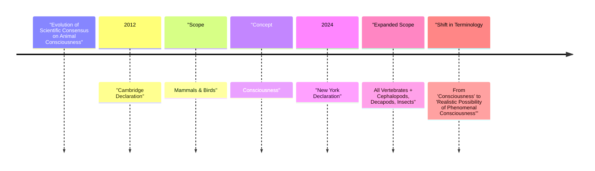

# The Widening Circle of Consciousness

In 2022, a study found that bumblebees would roll small wooden balls around, not for any reward or survival advantage, but seemingly for fun [[35]](https://www.scientificamerican.com/article/ball-rolling-bumble-bees-just-wanna-have-fun?ref=refind), [[36]](https://www.theguardian.com/science/2022/oct/27/bumblebees-playing-wooden-balls-bees-study). This behavior, fully disconnected from foraging or mating, suggested that even tiny brains might harbor complex inner states. This finding is part of a wave of research that has reshaped our understanding of animal minds, culminating in a landmark statement: The 2024 New York Declaration on Animal Consciousness [[40]](https://www.kimmela.org/2024/05/05/a-new-declaration-on-animal-consciousness), [[41]](https://thebrooksinstitute.org/animal-law-digest/us/issue-259/hundreds-experts-sign-new-york-declaration-animal-consciousness). For decades, a broad scientific consensus held that consciousness was likely present in animals similar to us, like other mammals and birds. However, recent evidence has pushed the boundaries, suggesting consciousness may be widespread even in creatures with vastly different nervous systems.

The New York Declaration formally embraces this shift. It states that "the empirical evidence indicates at least a realistic possibility of conscious experience in all vertebrates (including all reptiles, amphibians, and fishes) and many invertebrates (including, at minimum, cephalopod mollusks, decapod crustaceans, and insects)" [[32]](https://sites.google.com/nyu.edu/nydeclaration/background), [[22]](https://jeffsebo.net). The declaration deliberately uses the phrase “realistic possibility” to reflect scientific caution, avoiding absolute certainty while acknowledging the strength of the evidence.

Unveiled on April 19, 2024, at a conference at New York University, the declaration was spearheaded by philosopher and cognitive scientist Kristin Andrews, philosopher and environmental scientist Jeff Sebo, and philosopher Jonathan Birch [[42]](https://www.theatlantic.com/science/archive/2024/04/animal-consciousness-declaration-new-york/678223). The initial signatories included a diverse group of 40 world-leading experts, including neuroscientists Anil Seth and Christof Koch, psychologists Nicola Clayton and Irene Pepperberg, and philosophers David Chalmers and Peter Godfrey-Smith [[40]](https://www.kimmela.org/2024/05/05/a-new-declaration-on-animal-consciousness), [[42]](https://www.theatlantic.com/science/archive/2024/04/animal-consciousness-declaration-new-york/678223).

The declaration focuses on phenomenal consciousness, the most basic form of subjective experience. This is what philosopher Thomas Nagel, in his 1974 essay, famously described by asking, "What is it like to be a bat?" [[43]](https://www.informationphilosopher.com/solutions/philosophers/nagelt). He argued that "an organism has conscious mental states if and only if there is something that it is like to be that organism—something it is like for the organism" [[44]](https://www.cs.ox.ac.uk/activities/ieg/e-library/sources/nagel_bat.pdf), [[46]](https://thephilosophicalsalon.com/thomas-nagels-bat-and-ours). This raw feeling is distinct from higher-order capacities like self-awareness or the ability to reason about one's own thoughts, which the declaration does not claim for these animals.

This growing understanding of animal minds draws a clear line between biological consciousness and the capabilities of current AI. While large language models like ChatGPT can process language impressively, they lack the behavioral and physiological indicators of subjective experience we see in animals. As neuroscientist Anil Seth notes, the declaration should galvanize "an understanding and appreciation that we have much more in common with other animals than we do with things like ChatGPT" [[1]](https://www.theatlantic.com/science/archive/2024/04/animal-consciousness-declaration-new-york/678223), [[2]](https://www.quantamagazine.org/insects-and-other-animals-have-consciousness-experts-declare-20240419).

Image 1: A timeline illustrating the evolution of scientific consensus on animal consciousness, highlighting key declarations and the expansion of species considered conscious.

The 2024 Declaration is the formal culmination of a rapid accumulation of behavioral evidence gathered over the last 10–15 years. The next section will examine that evidence in detail, explain why the field moved to a public declaration, and dismantle the old neural-complexity barrier.

## A Growing Awareness

The New York Declaration did not emerge from a vacuum. While the most compelling results have appeared in the last 15 years, the scientific groundwork questioning invertebrate minds was laid decades earlier, with studies on topics like insect pain and cephalopod suffering appearing as early as the 1980s and 1990s [[53]](https://www.animal-ethics.org/10th-anniversary-of-the-cambridge-declaration-on-consciousness). This foundation was built on striking behavioral research that revealed surprisingly rich inner lives in a wide range of animals.
Image 2: A collection of animals now considered to have a realistic possibility of consciousness, including a crayfish, an octopus, a zebrafish, and a garter snake.

Here are some key examples:
-   **Octopuses** have shown they experience and respond to pain. In one study, octopuses that received an injection of acetic acid developed a lasting aversion to the chamber where it happened. They later developed a preference for a different chamber where they received pain-relieving lidocaine, a pattern consistent with affective pain experience [[32]](https://sites.google.com/nyu.edu/nydeclaration/background).
-   **Cuttlefish** have demonstrated a form of episodic-like memory. They can remember not just what, where, and when a past event occurred, but also how they experienced it—for instance, whether they saw or smelled a piece of prey. This capacity, known as "source memory," suggests a more detailed and personal recollection of the past [[32]](https://sites.google.com/nyu.edu/nydeclaration/background).
-   **Zebrafish** have shown signs of curiosity, a desire to seek new information. They show sustained interest in new objects in their environment, exploring them voluntarily even without an external reward. This suggests that learning itself is intrinsically rewarding for them [[32]](https://sites.google.com/nyu.edu/nydeclaration/background).
-   **Bumblebees**, as mentioned, engage in apparent play behavior. They repeatedly roll wooden balls without any incentive, a behavior that seems to be intrinsically rewarding and performed when the bees are in a relaxed state [[32]](https://sites.google.com/nyu.edu/nydeclaration/background), [[35]](https://www.scientificamerican.com/article/ball-rolling-bumble-bees-just-wanna-have-fun?ref=refind).
-   **Fruit flies** exhibit distinct sleep patterns, including "quiet" and "active" sleep, analogous to slow-wave and REM sleep in humans. Furthermore, their sleep is disrupted by social isolation, indicating their well-being is connected to their social environment [[32]](https://sites.google.com/nyu.edu/nydeclaration/background).
-   **Crayfish** display "anxiety-like" states. When exposed to stress from electric shocks, they become more averse to bright, open spaces. This behavior is reversed when they are given benzodiazepines, the same class of drugs used to treat anxiety in humans [[32]](https://sites.google.com/nyu.edu/nydeclaration/background).

Part of this progress comes from designing species-appropriate tests. For example, while a visual mirror-mark test is unsuitable for snakes, they can pass a scent-based version, and cleaner wrasse fish have passed visual variants, challenging earlier assumptions about which animals possess self-recognition [[54]](https://advancedconsciousness.org/revisiting-animal-consciousness).

This growing body of evidence created an informal consensus among specialists. The move to a public declaration was a deliberate step to communicate this new understanding to a wider audience. As one of the initiators, Jeff Sebo, explained, the goal was to signal where the field is now and where it is headed, especially for policymakers and other scientists [[31]](https://www.quantamagazine.org/insects-and-other-animals-have-consciousness-experts-declare-20240419). The declaration states that "when there is a realistic possibility of conscious experience in an animal, it is irresponsible to ignore that possibility in decisions affecting that animal" [[22]](https://jeffsebo.net).

Of course, all such behavioral tests face the "problem of other minds"—the fact that we can never directly access another being's subjective experience. The inferences are based on the assumption that because the behaviors resemble our own and stem from a shared evolutionary history, the underlying experience is likely shared as well [[55]](https://www.animal-ethics.org/invertebrate-sentience-a-review-of-the-behavioral-evidence).

The 2024 declaration significantly updates the 2012 Cambridge Declaration on Consciousness. The earlier document asserted that non-human animals, including all mammals and birds, possess the "neurological substrates that generate consciousness" [[52]](CambridgeDeclarationOnConsciousness.md). The New York Declaration expands this scope to all vertebrates and many invertebrates. It also adopts more careful phrasing, shifting from a direct assertion of consciousness to the "realistic possibility of conscious experience," reflecting a more nuanced scientific position [[42]](https://www.theatlantic.com/science/archive/2024/04/animal-consciousness-declaration-new-york/678223). Peter Godfrey-Smith, a philosopher and signatory, notes that the complex behaviors of octopuses, like problem-solving and play, make it "very hard not to think that there’s quite a lot going on inside them" [[31]](https://www.quantamagazine.org/insects-and-other-animals-have-consciousness-experts-declare-20240419).
Image 3: A close-up of a bee's head, showing its complex compound eyes and furry thorax.

A long-standing objection to invertebrate consciousness was the difference in neural hardware. However, this barrier is now being rejected. A bee's brain has only about a million neurons compared to a human's 86 billion, but its neural network is incredibly dense and complex enough to support sophisticated behaviors [[31]](https://www.quantamagazine.org/insects-and-other-animals-have-consciousness-experts-declare-20240419). Similarly, the octopus nervous system is highly distributed, with two-thirds of its neurons located in its arms. A severed octopus arm can continue to exhibit complex behaviors, like grasping and avoidance, for hours, showing that advanced sensory-motor control does not require a centralized brain [[13]](https://pmc.ncbi.nlm.nih.gov/articles/PMC8988249/), [[10]](https://neuroscience.stanford.edu/news/octopus-brains).

Furthermore, a cerebral cortex is not a prerequisite for consciousness. As philosopher Kristin Andrews points out, birds, reptiles, and fish lack a cortex but have other brain structures that perform analogous functions [[31]](https://www.quantamagazine.org/insects-and-other-animals-have-consciousness-experts-declare-20240419). The avian pallium in birds and the vertical lobe in octopuses are examples of structures that support advanced learning and memory, despite their alien architecture [[49]](https://asknature.org/strategy/bird-brains-use-unique-structure-to-support-high-intelligence), [[47]](https://asknature.org/strategy/complex-memory-processing-in-the-cephalopod-vertical-lobe). Peter Godfrey-Smith argues that consciousness can arise from "electrical oscillations moving rhythmically across cell membranes in living brains," a process that is not dependent on a specific structure but on the right kind of dynamic activity [[27]](https://iai.tv/articles/studies-on-animal-minds-suggest-consciousness-is-not-computation-auid-3535).

The evidentiary and architectural arguments have now shifted the scientific default. This pivot brings downstream ethical obligations, practical tensions, and laboratory-policy implications, which follow once we accept the realistic possibility of consciousness in these animals.

## Mindful Relations

Accepting a "realistic possibility" of consciousness in a wider range of animals shifts our ethical obligations. Jeff Sebo argues that the focus must go beyond simply preventing pain. "We also have to provide them with the kinds of enrichment and opportunities that allow them to express their instincts and explore their environments and engage in social systems and otherwise be the kinds of complex agents they are" [[31]](https://www.quantamagazine.org/insects-and-other-animals-have-consciousness-experts-declare-20240419). This means creating environments where captive animals can thrive, not just survive.

However, extending this consideration to all newly recognized clades creates practical tensions. As Peter Godfrey-Smith points out, our relationship with insects is often "inevitably a somewhat antagonistic one" [[31]](https://www.quantamagazine.org/insects-and-other-animals-have-consciousness-experts-declare-20240419). Mosquitoes carry diseases and other insects act as crop pests. It is difficult to reconcile the idea of their welfare with the need for public health and agriculture. This forces a move toward explicit trade-off reasoning rather than a simple mandate to avoid all harm.
Image 4: The three lead organizers of the New York Declaration on Animal Consciousness: Jeff Sebo, Kristin Andrews, and Jonathan Birch (from left to right). (Source [[31]](https://www.quantamagazine.org/insects-and-other-animals-have-consciousness-experts-declare-20240419))

This new consensus also highlights a significant welfare gap in laboratory settings. While vertebrates like mice are protected by welfare regulations, invertebrates such as *Drosophila* (fruit flies) and *C. elegans* (nematode worms) are used in vast numbers without similar oversight [[19]](https://www.thetransmitter.org/policy/knowledge-gaps-in-cephalopod-care-could-stall-welfare-standards). There are no standardized guidelines for their environmental care or pain assessment. This stands in contrast to the growing recognition of sentience in other invertebrates, which has led to policy changes. For example, the UK amended its Animal Welfare (Sentience) Bill to include cephalopods and decapod crustaceans after a government-commissioned report found strong evidence of their sentience [[6]](https://www.eurogroupforanimals.org/news/uk-sentience-bill-passes-final-stages-recognise-decapod-and-cephalopod-sentience-law), [[8]](https://researchbriefings.files.parliament.uk/documents/CBP-9423/CBP-9423.pdf). This sets a precedent for how scientific consensus can translate directly into legal protection.

The discussion around animal minds also offers a cautionary note for the field of AI. In ethics, sentience—the capacity for pleasure or pain—is widely seen as a crucial basis for moral standing [[56]](https://pmc.ncbi.nlm.nih.gov/articles/PMC10436038). We infer this in animals through behavior; as philosopher Jonathan Birch notes, seeing a dog lick its wounds naturally leads us to posit a state of pain [[57]](https://undark.org/2023/07/14/interview-the-ethical-puzzle-of-sentient-ai). Such inferences are reasonable due to a shared evolutionary history, but they are far less secure for AI, which may only superficially mimic conscious beings [[55]](https://www.animal-ethics.org/invertebrate-sentience-a-review-of-the-behavioral-evidence). While Sebo and others agree that "current AI systems are very unlikely to be conscious," the rapid evolution of our understanding of biological minds "does give me pause and makes me want to approach the topic with caution and humility" [[31]](https://www.quantamagazine.org/insects-and-other-animals-have-consciousness-experts-declare-20240419), [[21]](https://www.youtube.com/watch?v=ak3WuQhtoW4).

The path forward involves more research. Kristin Andrews urges scientists to use the resources they already have. "All these nematode worms and fruit flies that are in almost every university—study consciousness in them," she says. "You already have them... Make that project a consciousness project. Imagine that!" [[31]](https://www.quantamagazine.org/insects-and-other-animals-have-consciousness-experts-declare-20240419). By studying simpler models, we can make progress on understanding the fundamental mechanisms of experience, which could help us identify its presence across the vast and varied animal kingdom [[14]](https://www.multiverses.xyz/podcast/animal-minds-kristin-andrews-on-assuming-consciousness-in-other-species). Jonathan Birch adds that a key goal is to stimulate research into other under-studied invertebrates, such as snails and worms, to build a more complete picture [[58]](https://www.youtube.com/watch?v=r5UoGpJ-Cwc).

## References

- [1] [A growing number of scientists are arguing that animals have consciousness](https://www.theatlantic.com/science/archive/2024/04/animal-consciousness-declaration-new-york/678223)
- [2] [Insects and Other Animals Have Consciousness, Experts Declare](https://www.quantamagazine.org/insects-and-other-animals-have-consciousness-experts-declare-20240419)
- [3] [Ball-Rolling Bumble Bees Just Wanna Have Fun](https://www.scientificamerican.com/article/ball-rolling-bumble-bees-just-wanna-have-fun?ref=refind)
- [4] [Bumblebees get a buzz out of playing with balls, study finds](https://www.theguardian.com/science/2022/oct/27/bumblebees-playing-wooden-balls-bees-study)
- [5] [Does sentience legislation help animals?](https://www.animalask.org/post/does-sentience-legislation-help-animals)
- [6] [UK Sentience Bill passes final stages to recognise decapod and cephalopod sentience in law](https://www.eurogroupforanimals.org/news/uk-sentience-bill-passes-final-stages-recognise-decapod-and-cephalopod-sentience-law)
- [7] [Decapods and cephalopods to be recognised as sentient beings under UK law](https://www.eurogroupforanimals.org/news/decapods-and-cephalopods-be-recognised-sentient-beings-under-uk-law)
- [8] [Animal Welfare (Sentience) Bill](https://researchbriefings.files.parliament.uk/documents/CBP-9423/CBP-9423.pdf)
- [9] [Octopus arms are controlled by a nervous system that's like no other](https://www.sciencealert.com/octopus-arms-are-controlled-by-a-nervous-system-thats-like-no-other)
- [10] [Octopus Brains](https://neuroscience.stanford.edu/news/octopus-brains)
- [11] [How do octopus arms demonstrate distributed nervous systems?](https://www.youtube.com/watch?v=W9Gnw7B7oGM)
- [12] [Distributed sensorimotor reflexes in the octopus arm](https://www.nature.com/articles/s41467-024-55475-5)
- [13] [Where Is It Like to Be an Octopus?](https://pmc.ncbi.nlm.nih.gov/articles/PMC8988249/)
- [14] [Animal Minds — Kristin Andrews on assuming consciousness in other species](https://www.multiverses.xyz/podcast/animal-minds-kristin-andrews-on-assuming-consciousness-in-other-species)
- [15] [Knowledge gaps in cephalopod care could stall welfare standards](https://www.thetransmitter.org/policy/knowledge-gaps-in-cephalopod-care-could-stall-welfare-standards)
- [16] [Jeff Sebo on Animal Consciousness, AI Consciousness, and the New York Declaration](https://www.youtube.com/watch?v=ak3WuQhtoW4)
- [17] [Jeff Sebo](https://jeffsebo.net)
- [18] [A New Declaration on Animal Consciousness](https://www.kimmela.org/2024/05/05/a-new-declaration-on-animal-consciousness)
- [19] [Knowledge gaps in cephalopod care could stall welfare standards](https://www.thetransmitter.org/policy/knowledge-gaps-in-cephalopod-care-could-stall-welfare-standards)
- [20] [Peter Godfrey-Smith: Other Minds, Consciousness, and the Evolution of Life](https://www.youtube.com/watch?v=Mi4-EOThAIc)
- [21] [Jeff Sebo on Animal Consciousness, AI Consciousness, and the New York Declaration](https://www.youtube.com/watch?v=ak3WuQhtoW4)
- [22] [Jeff Sebo](https://jeffsebo.net)
- [23] [Living on Earth: Notes to Chapter 6](https://petergodfreysmith.com/living-on-earth-notes-to-chapter-6)
- [24] [Studies on animal minds suggest consciousness is not computation](https://iai.tv/articles/studies-on-animal-minds-suggest-consciousness-is-not-computation-auid-3535)
- [25] [Peter Godfrey-Smith: Metazoa, Animal Life, and the Birth of the Mind](https://www.youtube.com/watch?v=RkWvrt9GXsc)
- [26] [Cephalopods and the Evolution of the Mind](https://petergodfreysmith.com/wp-content/uploads/2013/06/Cephalopods_PGS_PacConBio_2013.pdf)
- [27] [Studies on animal minds suggest consciousness is not computation](https://iai.tv/articles/studies-on-animal-minds-suggest-consciousness-is-not-computation-auid-3535)
- [28] [The moral relevance of animal consciousness for animal ethics](https://www.frontiersin.org/journals/psychology/articles/10.3389/fpsyg.2025.1700354/full)
- [29] [Will AI Deserve Protection? A Philosopher on the Ethics of Living with Non-Human Intelligence](https://nextbigideaclub.com/magazine/ai-deserve-protection-philosopher-ethics-living-non-human-intelligence-bookbite/54074)
- [30] [Jeff Sebo on why we should take nonhuman flourishing seriously](https://www.effectivealtruism.org/stories/jeff-sebo)
- [31] [Insects and Other Animals Have Consciousness, Experts Declare](https://www.quantamagazine.org/insects-and-other-animals-have-consciousness-experts-declare-20240419)
- [32] [The Background of the New York Declaration](https://sites.google.com/nyu.edu/nydeclaration/background)
- [33] [First-ever study shows bumble bees ‘play’](https://www.qmul.ac.uk/news/latest-news/2022/se/first-ever-study-shows-bumble-bees-play.html)
- [34] [Do bumble bees play?](https://www.sciencedirect.com/science/article/pii/S0003347222002366)
- [35] [Ball-Rolling Bumble Bees Just Wanna Have Fun](https://www.scientificamerican.com/article/ball-rolling-bumble-bees-just-wanna-have-fun?ref=refind)
- [36] [Bumblebees get a buzz out of playing with balls, study finds](https://www.theguardian.com/science/2022/oct/27/bumblebees-playing-wooden-balls-bees-study)
- [37] [Associative learning in the octopus](https://www.nature.com/articles/s41586-024-07126-4)
- [38] [The New York Declaration on Animal Consciousness](http://www.nydeclaration.com/)
- [39] [Hundreds of Experts Sign New York Declaration on Animal Consciousness](https://thebrooksinstitute.org/animal-law-digest/us/issue-259/hundreds-experts-sign-new-york-declaration-animal-consciousness)
- [40] [A New Declaration on Animal Consciousness](https://www.kimmela.org/2024/05/05/a-new-declaration-on-animal-consciousness)
- [41] [Hundreds of Experts Sign New York Declaration on Animal Consciousness](https://thebrooksinstitute.org/animal-law-digest/us/issue-259/hundreds-experts-sign-new-york-declaration-animal-consciousness)
- [42] [A growing number of scientists are arguing that animals have consciousness](https://www.theatlantic.com/science/archive/2024/04/animal-consciousness-declaration-new-york/678223)
- [43] [Thomas Nagel](https://www.informationphilosopher.com/solutions/philosophers/nagelt)
- [44] [What is it like to be a bat?](https://www.cs.ox.ac.uk/activities/ieg/e-library/sources/nagel_bat.pdf)
- [45] [Thomas Nagel's Bat and Ours](https://thephilosophicalsalon.com/thomas-nagels-bat-and-ours)
- [46] [Thomas Nagel's Bat and Ours](https://thephilosophicalsalon.com/thomas-nagels-bat-and-ours)
- [47] [Complex memory processing in the cephalopod vertical lobe](https://asknature.org/strategy/complex-memory-processing-in-the-cephalopod-vertical-lobe)
- [48] [Bird brains use unique structure to support high intelligence](https://asknature.org/strategy/bird-brains-use-unique-structure-to-support-high-intelligence)
- [49] [Bird brains use unique structure to support high intelligence](https://asknature.org/strategy/bird-brains-use-unique-structure-to-support-high-intelligence)
- [50] [A cortex-like canonical circuit in the avian forebrain](https://pmc.ncbi.nlm.nih.gov/articles/PMC10940863)
- [51] [How do avian pallium and octopus vertical lobe perform cortex-like functions?](https://elifesciences.org/articles/84257)
- [52] [Cambridge Declaration on Consciousness](http://fcmconference.org/img/CambridgeDeclarationOnConsciousness.pdf)
- [53] [10th anniversary of the Cambridge Declaration on Consciousness](https://www.animal-ethics.org/10th-anniversary-of-the-cambridge-declaration-on-consciousness)
- [54] [Revisiting Animal Consciousness](https://advancedconsciousness.org/revisiting-animal-consciousness)
- [55] [Invertebrate sentience: a review of the behavioral evidence](https://www.animal-ethics.org/invertebrate-sentience-a-review-of-the-behavioral-evidence)
- [56] [How AI could have moral status](https://pmc.ncbi.nlm.nih.gov/articles/PMC10436038)
- [57] [Interview: The Ethical Puzzle of Sentient AI](https://undark.org/2023/07/14/interview-the-ethical-puzzle-of-sentient-ai)
- [58] [Jonathan Birch - Animal Consciousness and The New York Declaration](https://www.youtube.com/watch?v=r5UoGpJ-Cwc)