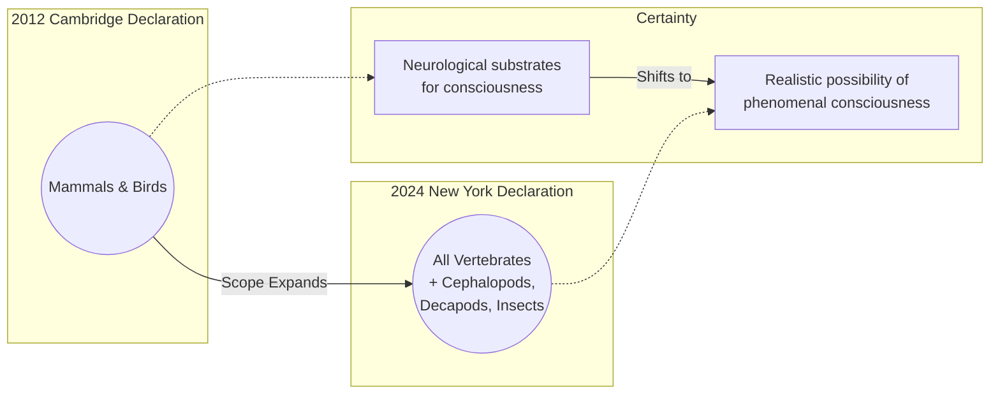

# The New York Declaration: Why Animal Consciousness Just Got a Lot Weirder

In 2022, a team of researchers observed bumblebees doing something that seemed entirely out of character: they were playing. In a dedicated arena, these tiny insects repeatedly and voluntarily rolled small wooden balls, showing a preference for specific colors and returning to the activity even when other rewarding options were available [[1]](https://www.sciencedirect.com/science/article/pii/S0003347222002366). The behavior was not linked to food, mating, or any discernible survival benefit; it was, for all intents and purposes, just for fun [[2]](https://www.theguardian.com/science/2022/oct/27/bumblebees-playing-wooden-balls-bees-study).

This discovery, demonstrating a seemingly positive emotional state in an invertebrate, is a powerful example of the wave of evidence forcing a major shift in our understanding of animal minds. This shift culminated in a landmark scientific statement: the 2024 New York Declaration on Animal Consciousness [[3]](https://www.kimmela.org/2024/05/05/a-new-declaration-on-animal-consciousness). For decades, a broad consensus held that animals neurologically similar to us, like other mammals and birds, were conscious. Recent research, however, suggests consciousness may be widespread among creatures with radically different nervous systems.

The declaration was launched on April 19, 2024, during a one-day conference at New York University called "The Emerging Science of Animal Consciousness" [[4]](https://www.quantamagazine.org/insects-and-other-animals-have-consciousness-experts-declare-20240419). It brought together leading researchers from neuroscience, biology, and philosophy to take stock of the field. The document's core claim is that there is "a realistic possibility of conscious experience in all vertebrates... and many invertebrates" [[5]](http://www.nydeclaration.com/).

This includes, at a minimum, three major invertebrate groups: cephalopod mollusks, decapod crustaceans, and insects. The declaration deliberately uses the cautious phrasing "realistic possibility" to reflect the ongoing scientific debate and the inherent difficulty of proving subjective experience, rather than claiming absolute certainty.

Spearheaded by philosopher Kristin Andrews, environmental scientist Jeff Sebo, and philosopher Jonathan Birch, the declaration was signed by a prominent group of interdisciplinary experts. The initial signatories included neuroscientists Anil Seth and Christof Koch, and philosophers David Chalmers and Peter Godfrey-Smith, reflecting a broad consensus across fields that have historically approached this question from different angles [[6]](https://www.theatlantic.com/science/archive/2024/04/animal-consciousness-declaration-new-york/678223).

The document focuses specifically on phenomenal consciousness, the raw, subjective quality of experience. This is not about an animal's ability to reason, reflect on its own thoughts, or recognize itself in a mirror. Instead, it addresses the more fundamental question posed by philosopher Thomas Nagel in his 1974 essay: "fundamentally an organism has conscious mental states if and only if there is something that it is like to be that organism—something it is like for the organism" [[7]](https://www.cs.ox.ac.uk/activities/ieg/e-library/sources/nagel_bat.pdf). The declaration argues there is likely something it *feels like* to be a bee or an octopus, even if that experience is alien to our own.

This growing appreciation for animal consciousness creates a stark contrast with our most advanced AI. As neuroscientist Anil Seth notes, the new evidence should galvanize "an understanding and appreciation that we have much more in common with other animals than we do with things like ChatGPT" [[4]](https://www.quantamagazine.org/insects-and-other-animals-have-consciousness-experts-declare-20240419). While LLMs can process language with impressive fluency, they show no evidence of the play, pain, or pleasure that we are now beginning to recognize in creatures with brains a fraction of the size of a silicon chip.

Image 1: A conceptual timeline contrasting the 2012 Cambridge Declaration with the 2024 New York Declaration, showing the expansion of recognized species and the shift in scientific language.

The 2024 Declaration represents the formal culmination of over a decade of accumulating behavioral evidence. The next section will examine these key findings, explain why the scientific community moved to a public declaration, and dismantle the long-held belief that neural complexity is a prerequisite for consciousness.

## A Growing Awareness

The New York Declaration was not a sudden development but the result of a steady accumulation of surprising findings over the last 15 years. This body of evidence revealed complex cognitive and affective behaviors in animals previously thought to be simple, reflexive organisms. The research has systematically chipped away at the assumption that a large, centralized brain is necessary for a rich inner life.

The evidence is compelling and diverse, spanning affective states, memory, and self-awareness. A key 2021 study showed that octopuses, after an injection of acetic acid, would not only groom the specific site but also learn to avoid chambers where they had experienced pain. When later given a pain-relieving anesthetic in a previously non-preferred chamber, they developed a lasting preference for that location, demonstrating they value pain relief. This conditioned place aversion suggests a lasting negative affective state, not just a simple reflex [[8]](https://sites.google.com/nyu.edu/nydeclaration/background?authuser=0).

Cognitive abilities once thought unique to vertebrates have also been documented in invertebrates. Cuttlefish, for instance, demonstrated a form of episodic-like memory. They could recall not just what they ate, but where and when, allowing them to optimize future foraging. They even showed "source memory," remembering whether they had previously seen or smelled a prey item, a capacity that hints at a more detailed recollection of past experiences [[8]](https://sites.google.com/nyu.edu/nydeclaration/background?authuser=0).

In the vertebrate world, similar discoveries challenged old assumptions. Researchers found that zebrafish show signs of curiosity. They demonstrated sustained interest in new objects placed in their environment, exploring them voluntarily without any external reward. This suggests that, like many other animals, they find the act of learning new information intrinsically rewarding [[8]](https://sites.google.com/nyu.edu/nydeclaration/background?authuser=0).

Even in insects, behaviors indicative of complex inner states are being found. Beyond the playful bumblebees, research has shown that fruit flies have distinct "active" and "quiet" sleep phases, analogous to REM and slow-wave sleep in humans. Furthermore, social isolation was found to disrupt these sleep patterns, hinting at a connection between social well-being and fundamental biological states [[8]](https://sites.google.com/nyu.edu/nydeclaration/background?authuser=0).

Finally, studies on crayfish found they exhibit anxiety-like behaviors when stressed, such as preferring dark spaces over brightly lit ones in a maze after being exposed to mild electric shocks. Crucially, these behaviors could be reversed with human anti-anxiety drugs like benzodiazepines, linking their state to neurochemical pathways we recognize [[8]](https://sites.google.com/nyu.edu/nydeclaration/background?authuser=0).

As these results mounted, an informal consensus grew among specialists. This shift was driven by a surge in research; publications on animal sentience increased tenfold in the two decades leading up to the first declaration, establishing it as a serious field of scientific inquiry [[9]](https://pmc.ncbi.nlm.nih.gov/articles/PMC9704368). However, this understanding was not reaching the wider scientific community or policymakers. Jeff Sebo, one of the declaration's organizers, noted that while many accepted consciousness in mammals and birds, "less attention has been paid to other vertebrate and especially invertebrate taxa" [[4]](https://www.quantamagazine.org/insects-and-other-animals-have-consciousness-experts-declare-20240419). The declaration was created to formally communicate this new consensus, encourage further research, and urge reflection on animal welfare [[8]](https://sites.google.com/nyu.edu/nydeclaration/background).

This new statement updates and expands upon a prior effort, the 2012 Cambridge Declaration on Consciousness. The 2012 document asserted that mammals and birds possess the "neurological substrates that generate consciousness" [[10]](http://fcmconference.org/img/CambridgeDeclarationOnConsciousness.pdf). The 2024 New York Declaration is both broader in scope and more cautious in its language. It widens the circle to include all vertebrates and many invertebrates, while deliberately framing the conclusion as a "realistic possibility" of phenomenal consciousness [[5]](http://www.nydeclaration.com/). As octopus researcher Peter Godfrey-Smith notes, the complex, attentive behaviors of these animals make it "very hard not to think that there’s quite a lot going on inside them" [[4]](https://www.quantamagazine.org/insects-and-other-animals-have-consciousness-experts-declare-20240419).

A long-standing barrier to accepting invertebrate consciousness was the assumption that it required a brain architecture similar to our own. This idea is now being dismantled. A bee's brain has only about a million neurons compared to a human's 86 billion, yet it supports complex behaviors like play and social learning, suggesting that raw neuron count is not the deciding factor [[4]](https://www.quantamagazine.org/insects-and-other-animals-have-consciousness-experts-declare-20240419).

Furthermore, nervous systems can be organized in radically different ways. The octopus nervous system is highly distributed, with three-fifths of its 500 million neurons located in its arms [[11]](https://pmc.ncbi.nlm.nih.gov/articles/PMC8988249). A severed octopus arm can continue to perform complex actions, like grasping and avoidance, without input from the central brain, demonstrating that sophisticated control can be decentralized [[12]](https://www.sciencealert.com/octopus-arms-are-controlled-by-a-nervous-system-thats-like-no-other), [[11]](https://pmc.ncbi.nlm.nih.gov/articles/PMC8988249). This shows, as Godfrey-Smith puts it, that consciousness-like behaviors "can exist in an architecture that looks completely alien to vertebrate or human architecture" [[4]](https://www.quantamagazine.org/insects-and-other-animals-have-consciousness-experts-declare-20240419).

The final objection, the lack of a cerebral cortex, has also fallen. Research shows that other species have evolved different structures to perform analogous functions. Birds use a unique pallial structure, while cephalopods like octopuses rely on a brain center called the vertical lobe for memory and learning [[13]](https://asknature.org/strategy/bird-brains-use-unique-structure-to-support-high-intelligence), [[14]](https://asknature.org/strategy/complex-memory-processing-in-the-cephalopod-vertical-lobe). As Kristin Andrews explains, "when you look at birds and reptiles and amphibians, they have very different brain structures... and yet some of those brain structures, we’re finding, are doing the same kind of work that a cerebral cortex does in humans" [[4]](https://www.quantamagazine.org/insects-and-other-animals-have-consciousness-experts-declare-20240419).

With the evidentiary and architectural arguments reframed, the scientific default has shifted. This shift raises new ethical questions and practical challenges that follow once we accept the realistic possibility of consciousness in this vastly expanded circle of animals.

## Mindful Relations

Accepting the realistic possibility of phenomenal consciousness in more animals carries significant ethical and practical implications. The ethical obligations now extend beyond simply preventing suffering. According to Jeff Sebo, it is not enough to avoid causing pain. We must also "provide them with the kinds of enrichment and opportunities that allow them to express their instincts and explore their environments and engage in social systems and otherwise be the kinds of complex agents they are" [[4]](https://www.quantamagazine.org/insects-and-other-animals-have-consciousness-experts-declare-20240419). This requires creating conditions for positive experiences, a more demanding standard for animal welfare.

However, this raises practical tensions, especially with insects. As Peter Godfrey-Smith points out, our relationship with some species is "inevitably a somewhat antagonistic one" [[4]](https://www.quantamagazine.org/insects-and-other-animals-have-consciousness-experts-declare-20240419). Mosquitoes carry diseases, and the role of insects as agricultural pests creates conflicts at the heart of sustainable food production [[15]](https://rethinkpriorities.org/research-area/next-steps-in-invertebrate-welfare-part-3-understanding-attitudes-and-possibilities). "The idea that we could just sort of make peace with the mosquitoes," he says, is very different from making peace with fish or octopuses [[4]](https://www.quantamagazine.org/insects-and-other-animals-have-consciousness-experts-declare-20240419). Acknowledging their potential consciousness does not eliminate these conflicts but forces us into a more complex ethical calculus of trade-offs.

This new understanding also exposes a significant welfare gap in scientific research. While strict protocols govern the use of vertebrate animals, a stark discrepancy exists for many invertebrates. As researcher Matilda Gibbons notes, "We think about the welfare of livestock and of mice in research, but we never think about the welfare of the insects" [[4]](https://www.quantamagazine.org/insects-and-other-animals-have-consciousness-experts-declare-20240419). Insects like *Drosophila melanogaster* (fruit flies) are used in vast numbers with no equivalent oversight, a practice harder to justify under the new consensus [[16]](https://www.thetransmitter.org/policy/knowledge-gaps-in-cephalopod-care-could-stall-welfare-standards).

There is, however, a clear path for policy change. In the UK, a government-commissioned review of sentience evidence led directly to the inclusion of decapod crustaceans and cephalopods in the Animal Welfare (Sentience) Bill, which became law in 2022 [[17]](https://www.eurogroupforanimals.org/news/uk-sentience-bill-passes-final-stages-recognise-decapod-and-cephalopod-sentience-law). This provides a legislative model for how scientific consensus can translate into legal protection.

Finally, this conversation provides a cautionary lesson for the field of AI. While researchers agree that "current AI systems are very unlikely to be conscious," the rapid evolution of our understanding of animal minds suggests a need for epistemic humility when considering future AI systems [[4]](https://www.quantamagazine.org/insects-and-other-animals-have-consciousness-experts-declare-20240419). A key difference is that AI can be programmed to mimic pain with no underlying feeling, simply mapping inputs to convincing outputs [[18]](https://undark.org/2023/07/14/interview-the-ethical-puzzle-of-sentient-ai). This potential for imitation sets a higher evidentiary bar for machines.

The path forward involves more research, and as Kristin Andrews suggests, we may not need to look far. "All these nematode worms and fruit flies that are in almost every university—study consciousness in them," she urges. "You already have them... Make that project a consciousness project. Imagine that!" [[4]](https://www.quantamagazine.org/insects-and-other-animals-have-consciousness-experts-declare-20240419).

This call to action points toward a future where consciousness research expands into even simpler model organisms. By studying creatures like the nematode *C. elegans*, with its mere 302 neurons, scientists hope to identify the most fundamental neurobiological correlates of experience [[19]](https://www.multiverses.xyz/podcast/animal-minds-kristin-andrews-on-assuming-consciousness-in-other-species). If even rudimentary forms of sentience can be linked to such simple systems, it would profoundly reshape our understanding of where consciousness begins. The tools and subjects to expand our awareness even further are already in our labs, waiting for us to ask the right questions.

## References

- [1] Galpayage Dona, H. S., et al. (2022). Do bumble bees play? Animal Behaviour. (https://www.sciencedirect.com/science/article/pii/S0003347222002366)
- [2] Sample, I. (2022, October 27). Bumblebees get a buzz out of playing with balls, study finds. The Guardian. (https://www.theguardian.com/science/2022/oct/27/bumblebees-playing-wooden-balls-bees-study)
- [3] A New Declaration on Animal Consciousness. (2024, May 5). The Kimmela Center for Animal Advocacy. (https://www.kimmela.org/2024/05/05/a-new-declaration-on-animal-consciousness)
- [4] Falk, D. (2024, April 19). Insects and Other Animals Have Consciousness, Experts Declare. Quanta Magazine. (https://www.quantamagazine.org/insects-and-other-animals-have-consciousness-experts-declare-20240419)
- [5] The New York Declaration on Animal Consciousness. (http://www.nydeclaration.com/)
- [6] Wu, K. J. (2024, April 29). A New Declaration Proclaims the Widespread Possibility of Animal Consciousness. The Atlantic. (https://www.theatlantic.com/science/archive/2024/04/animal-consciousness-declaration-new-york/678223)
- [7] Nagel, T. (1974). What Is It Like to Be a Bat? The Philosophical Review. (https://www.cs.ox.ac.uk/activities/ieg/e-library/sources/nagel_bat.pdf)
- [8] Andrews, K., Birch, J., Sebo, J., & Sims, T. (2024). Background to the New York Declaration on Animal Consciousness. (https://sites.google.com/nyu.edu/nydeclaration/background?authuser=0)
- [9] Broom, D. M. (2022). Sentience and animal welfare: an overview. Frontiers in Veterinary Science. (https://pmc.ncbi.nlm.nih.gov/articles/PMC9704368)
- [10] Low, P., et al. (2012). The Cambridge Declaration on Consciousness. (http://fcmconference.org/img/CambridgeDeclarationOnConsciousness.pdf)
- [11] Grasso, F. W. (2022). The Octopus Nervous System. eLS. (https://pmc.ncbi.nlm.nih.gov/articles/PMC8988249)
- [12] Starr, M. (2020, June 17). Octopus Arms Are Controlled by a Nervous System That's Like No Other. ScienceAlert. (https://www.sciencealert.com/octopus-arms-are-controlled-by-a-nervous-system-thats-like-no-other)
- [13] Bird brains use unique structure to support high intelligence. AskNature. (https://asknature.org/strategy/bird-brains-use-unique-structure-to-support-high-intelligence)
- [14] Complex memory processing in the cephalopod vertical lobe. AskNature. (https://asknature.org/strategy/complex-memory-processing-in-the-cephalopod-vertical-lobe)
- [15] Understanding attitudes and possibilities toward invertebrate welfare. Rethink Priorities. (https://rethinkpriorities.org/research-area/next-steps-in-invertebrate-welfare-part-3-understanding-attitudes-and-possibilities)
- [16] McMurray, C. (2024, March 13). Knowledge gaps in cephalopod care could stall welfare standards. The Transmitter. (https://www.thetransmitter.org/policy/knowledge-gaps-in-cephalopod-care-could-stall-welfare-standards)
- [17] UK Sentience Bill passes final stages to recognise decapod and cephalopod sentience in law. Eurogroup for Animals. (https://www.eurogroupforanimals.org/news/uk-sentience-bill-passes-final-stages-recognise-decapod-and-cephalopod-sentience-law)
- [18] Birch, J. (2023, July 14). The Ethical Puzzle of Sentient AI. Undark. (https://undark.org/2023/07/14/interview-the-ethical-puzzle-of-sentient-ai)
- [19] Andrews, K. (2023). Animal Minds. Multiverses. (https://www.multiverses.xyz/podcast/animal-minds-kristin-andrews-on-assuming-consciousness-in-other-species)