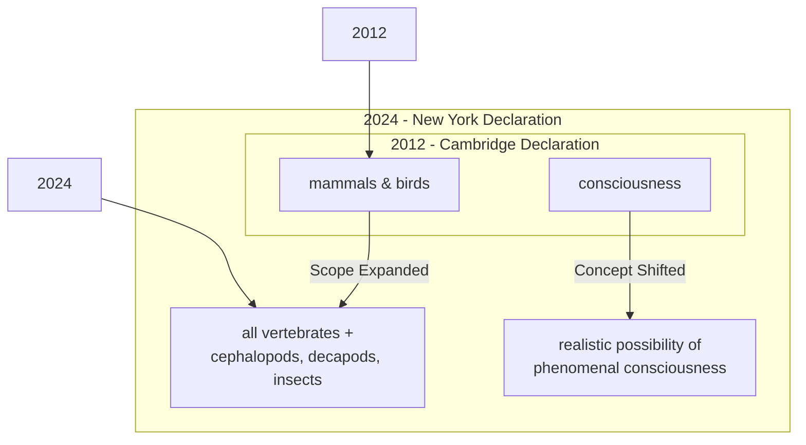

# The Expanding Circle of Consciousness: Why Scientists Now See a Spark in Insects and Octopuses

A remarkable observation researchers made in 2022 challenged long-held assumptions about the inner lives of insects. In a controlled setting, with no reward or survival pressure, bumblebees repeatedly rolled small wooden balls. This behavior, seemingly done just for fun, was a striking example of animal play, a trait once thought exclusive to "higher" animals like mammals and birds [[35]](https://www.scientificamerican.com/article/ball-rolling-bumble-bees-just-wanna-have-fun?ref=refind), [[36]](https://www.theguardian.com/science/2022/oct/27/bumblebees-playing-wooden-balls-bees-study). In the experiments, individual bees were observed rolling balls up to 117 times, suggesting the activity was intrinsically rewarding [[53]](https://www.sci.news/biology/bumblebee-play-11342.html). While some critics suggest the behavior could be a form of stress relief rather than genuine play, the results force us to reconsider the complexity of even the smallest minds [[55]](https://www.psychologytoday.com/us/blog/animal-emotions/202211/bumble-bees-play-balls-and-may-even-enjoy-it).

This finding is part of a wave of research that has reshaped our understanding of animal minds, culminating in a landmark new consensus. For decades, scientists broadly agreed that animals similar to us, like other mammals and birds, are conscious. However, recent evidence has begun to suggest that consciousness may be far more widespread. This shift was formalized on April 19, 2024, with the release of the New York Declaration on Animal Consciousness [[40]](https://www.kimmela.org/2024/05/05/a-new-declaration-on-animal-consciousness), [[42]](https://www.theatlantic.com/science/archive/2024/04/animal-consciousness-declaration-new-york/678223). The declaration states that "the empirical evidence indicates at least a realistic possibility of conscious experience in all vertebrates (including all reptiles, amphibians, and fishes) and many invertebrates (including, at minimum, cephalopod mollusks, decapod crustaceans, and insects)" [[22]](https://jeffsebo.net). Its central message is that there is a realistic possibility of phenomenal consciousness in a vast range of creatures, from fish and snakes to octopuses and bees.

Unveiled at a conference at New York University, the declaration was spearheaded by philosophers Kristin Andrews, Jeff Sebo, and Jonathan Birch [[40]](https://www.kimmela.org/2024/05/05/a-new-declaration-on-animal-consciousness). It was initially signed by dozens of leading researchers across neuroscience, psychology, and philosophy, including prominent figures like Anil Seth, Christof Koch, David Chalmers, Nicola Clayton, Irene Pepperberg, Lars Chittka, and Peter Godfrey-Smith [[42]](https://www.theatlantic.com/science/archive/2024/04/animal-consciousness-declaration-new-york/678223), [[3]](https://advancedconsciousness.org/revisiting-animal-consciousness). This interdisciplinary backing signals a major shift in the scientific mainstream, moving beyond old assumptions that tied consciousness to specific brain structures.

The document focuses on "phenomenal consciousness," the most fundamental form of subjective experience. This concept is best understood through philosopher Thomas Nagel’s famous 1974 essay, which argued that an organism is conscious "if and only if there is something that it is like to be that organism" [[43]](https://www.informationphilosopher.com/solutions/philosophers/nagelt), [[44]](https://www.cs.ox.ac.uk/activities/ieg/e-library/sources/nagel_bat.pdf). This is about raw feeling—the experience of pain, pleasure, hunger, or fear—not complex abilities like self-awareness or logical reasoning, which the declaration does not claim for these animals.

This growing understanding of animal minds helps us draw a sharp line between biological consciousness and artificial intelligence. While LLMs can generate sophisticated text, they show none of the behavioral or physiological markers of subjective experience we find in animals. As neuroscientist Anil Seth puts it, the declaration should galvanize "an understanding and appreciation that we have much more in common with other animals than we do with things like ChatGPT” [[1]](https://www.theatlantic.com/science/archive/2024/04/animal-consciousness-declaration-new-york/678223), [[2]](https://www.quantamagazine.org/insects-and-other-animals-have-consciousness-experts-declare-20240419).

Image 1: A conceptual timeline contrasting the 2012 Cambridge Declaration with the 2024 New York Declaration, showing the expansion of scope and the shift in the definition of consciousness.

The 2024 Declaration represents a formal culmination of behavioral evidence gathered over the last 15 years. In the next section, we will examine that evidence in detail, explain why the field moved to a public consensus, and dismantle old assumptions about the neural requirements for a mind.

## A Growing Awareness

The New York Declaration didn't just appear out of nowhere. It was built on a foundation of striking experimental results from the last 10 to 15 years, which have revealed surprisingly complex inner lives in a wide range of animals. This evidence includes:

1.  **Octopuses** demonstrate behaviors consistent with experiencing pain. In one study, they showed a clear aversion to a chamber where they received a noxious injection and developed a preference for a different chamber where they were given pain relief. This conditioned place preference is a standard test we use for assessing pain in lab rats [[32]](https://sites.google.com/nyu.edu/nydeclaration/background).
2.  **Cuttlefish** have shown a capacity for episodic-like memory, remembering not just what they ate and where, but also when. They can even recall how they experienced an item, such as whether they saw it or smelled it, a capacity known as source memory [[32]](https://sites.google.com/nyu.edu/nydeclaration/background).
3.  **Fish** have shown evidence of self-recognition. For example, cleaner wrasse fish have passed a version of the mirror-mark test, a classic indicator of self-awareness. After being marked, the fish see their reflection and attempt to scrape the mark off, suggesting they recognize the image as their own, though this finding remains debated [[56]](https://pmc.ncbi.nlm.nih.gov/articles/PMC8853551), [[32]](https://sites.google.com/nyu.edu/nydeclaration/background).
4.  **Bumblebees**, as we've seen, engage in apparent play behavior by rolling wooden balls, an activity that seems to be intrinsically rewarding and performed when they are relaxed [[32]](https://sites.google.com/nyu.edu/nydeclaration/background).
5.  **Fruit flies** exhibit distinct sleep patterns, including a "quiet" sleep for metabolic regulation and an "active" sleep that appears to support cognitive function. Furthermore, their sleep is disrupted by social isolation, indicating a connection between their social environment and internal states [[32]](https://sites.google.com/nyu.edu/nydeclaration/background).
6.  **Crayfish** display "anxiety-like" states when exposed to stress, becoming more averse to bright, open spaces. These behaviors are reversed by benzodiazepines, the same class of drugs we use to treat anxiety in humans [[32]](https://sites.google.com/nyu.edu/nydeclaration/background).

This shift marks a departure from 20th-century behaviorism. The rise of cognitive science and evolutionary biology created a framework for understanding mental continuity between species, paving the way for the current research [[57]](https://philosophy.institute/philosophy-of-mind/animal-consciousness-debate-science-philosophy). As this evidence mounted, an informal consensus grew among specialists. However, this agreement was not reaching the public, policymakers, or other scientists.

Jeff Sebo, one of the declaration's organizers, noted that the goal was to communicate "where we think the field is now and where the field is headed" [[31]](https://www.quantamagazine.org/insects-and-other-animals-have-consciousness-experts-declare-20240419). This communication is also needed to overcome common psychological biases, such as our tendency to dismiss the inner lives of animals that are small or physically unrelatable [[58]](https://forum.effectivealtruism.org/posts/2RdYDcwrnvdCn2SbK/the-case-for-insect-consciousness).

The 2024 declaration updates a prior consensus, the 2012 Cambridge Declaration on Consciousness. The earlier document asserted that non-human animals, including all mammals and birds, possess the "neurological substrates that generate consciousness" [[52]](CambridgeDeclarationOnConsciousness.md).

The New York Declaration expands this scope significantly, extending a "realistic possibility" of consciousness to all vertebrates and many invertebrates. The wording is deliberately cautious, reflecting scientific humility while still acknowledging the weight of evidence. As Peter Godfrey-Smith, an initial signatory, noted, the complex, attentive behaviors of octopuses make it "very hard not to think that there’s quite a lot going on inside them" [[31]](https://www.quantamagazine.org/insects-and-other-animals-have-consciousness-experts-declare-20240419). Not all scientists agree with this new consensus. Some critics argue that the declaration is a "broad overstatement" that could hinder scientific progress by making claims that outpace the available evidence [[59]](https://www.thetransmitter.org/consciousness/premature-declarations-on-animal-consciousness-hinder-progress).

For a long time, a major barrier to accepting invertebrate consciousness was the vast difference in neural architecture. A bee's brain has around one million neurons, compared to a human's 86 billion. However, this simple count is misleading. Bee neurons can be incredibly complex and densely interconnected. The new consensus rejects the idea that a human-like brain is necessary for experience [[31]](https://www.quantamagazine.org/insects-and-other-animals-have-consciousness-experts-declare-20240419). This new consensus is supported by emerging theoretical frameworks, such as Jonathan Birch's work on cognitive markers and Andrew Barron and Colin Klein's analogy between the insect and vertebrate midbrain [[60]](https://unfinishablemap.org/research/invertebrate-consciousness-interface-test-case-2026-04-06).

The octopus provides a powerful example of an alien-like nervous system. Its intelligence is highly distributed, with the arm nervous system containing three-fifths of the octopus’s 500 million neurons [[13]](https://pmc.ncbi.nlm.nih.gov/articles/PMC8988249). A severed octopus arm can continue to perform complex actions, like grasping and moving, for hours without any input from the central brain [[13]](https://pmc.ncbi.nlm.nih.gov/articles/PMC8988249). This demonstrates that sophisticated sensory-motor control can be decentralized.

Furthermore, a cerebral cortex—the outer layer of the mammalian brain associated with higher cognition—is not a prerequisite for phenomenal consciousness. As philosopher Kristin Andrews points out, birds, reptiles, and fish have different brain structures that perform "the same kind of work that a cerebral cortex does in humans" [[31]](https://www.quantamagazine.org/insects-and-other-animals-have-consciousness-experts-declare-20240419). The avian pallium in birds and the vertical lobe in octopuses are examples of structures that support complex memory and learning, despite being anatomically distinct from a cortex [[47]](https://asknature.org/strategy/complex-memory-processing-in-the-cephalopod-vertical-lobe), [[49]](https://asknature.org/strategy/bird-brains-use-unique-structure-to-support-high-intelligence). Godfrey-Smith concurs, stating that consciousness-like behaviors "can exist in an architecture that looks completely alien" [[31]](https://www.quantamagazine.org/insects-and-other-animals-have-consciousness-experts-declare-20240419).

With the evidentiary and architectural arguments now pointing toward a broader distribution of consciousness, the scientific default has shifted. This pivot raises important questions about our ethical obligations, practical relationships, and policies toward these animals.

## Mindful Relations

Accepting the realistic possibility of consciousness carries significant ethical weight, as absolute certainty is not required for moral consideration [[61]](https://www.animal-ethics.org/the-new-york-declaration-on-animal-consciousness-stresses-the-ethical-implications). The obligation extends beyond simply preventing pain. As Jeff Sebo argues, we must also provide animals in our care with "the kinds of enrichment and opportunities that allow them to express their instincts and explore their environments and engage in social systems and otherwise be the kinds of complex agents they are" [[31]](https://www.quantamagazine.org/insects-and-other-animals-have-consciousness-experts-declare-20240419). This means creating conditions for positive experiences, not just minimizing negative ones.

However, this ethical shift creates practical tensions, especially with insects. As Peter Godfrey-Smith notes, our relationship with many insects is "inevitably a somewhat antagonistic one" [[31]](https://www.quantamagazine.org/insects-and-other-animals-have-consciousness-experts-declare-20240419). We cannot simply "make peace with the mosquitoes" that carry diseases or the pests that destroy crops. Recognizing their potential for consciousness does not eliminate these conflicts but forces us into more explicit and difficult trade-off reasoning. These tensions are acute in the growing insect farming industry, where insects are often categorized as 'biomass' rather than animals, operating in a legal gray area with few binding welfare regulations [[62]](https://rethinkpriorities.org/research-area/insects-raised-for-food-and-feed), [[63]](https://faunalytics.org/do-consumers-care-about-farmed-insect-welfare).

This new awareness also exposes a significant welfare gap in laboratory research. While mammals like mice are protected by welfare committees and protocols, invertebrates like fruit flies (*Drosophila*) and nematodes (*C. elegans*) are used in vast numbers with no equivalent oversight [[19]](https://www.thetransmitter.org/policy/knowledge-gaps-in-cephalopod-care-could-stall-welfare-standards). This is despite growing evidence for complex states in these organisms. As one researcher noted, "we never think about the welfare of the insects" [[31]](https://www.quantamagazine.org/insects-and-other-animals-have-consciousness-experts-declare-20240419).

Policy is beginning to catch up, albeit slowly. The United Kingdom provides a key precedent. After reviewing over 300 scientific studies, the government amended its Animal Welfare (Sentience) Bill in 2022 to recognize cephalopods and decapod crustaceans as sentient beings, showing a direct path from science to policy [[6]](https://www.eurogroupforanimals.org/news/uk-sentience-bill-passes-final-stages-recognise-decapod-and-cephalopod-sentience-law), [[7]](https://www.eurogroupforanimals.org/news/decapods-and-cephalopods-be-recognised-sentient-beings-under-uk-law).

The conversation around animal minds also offers a cautionary lesson for us in the field of artificial intelligence. While some headlines speculate about AI consciousness, Sebo and others urge humility, noting that "current AI systems are very unlikely to be conscious" by the same evidentiary standards applied to animals [[31]](https://www.quantamagazine.org/insects-and-other-animals-have-consciousness-experts-declare-20240419). Frameworks for AI moral patienthood can learn from the animal case but must also be adapted for AI-specific evidence, such as architectural features and computational theories [[64]](https://arxiv.org/html/2411.00986v1).

The path forward lies in more research. Kristin Andrews has issued a call to action for the scientific community. Instead of overlooking the animals already present in labs everywhere, she urges researchers to start investigating their inner lives. "All these nematode worms and fruit flies that are in almost every university—study consciousness in them," she says. "You already have them... Make that project a consciousness project. Imagine that!" [[31]](https://www.quantamagazine.org/insects-and-other-animals-have-consciousness-experts-declare-20240419). By studying these simpler models, we may make more progress on the fundamental questions of consciousness than we have by focusing only on animals with brains like our own [[14]](https://www.multiverses.xyz/podcast/animal-minds-kristin-andrews-on-assuming-consciousness-in-other-species). This could involve using genetic tools to test hypotheses by studying anesthetics or mapping neural circuits [[65]](https://pmc.ncbi.nlm.nih.gov/articles/PMC10723751).

## References

- [1] https://www.theatlantic.com/science/archive/2024/04/animal-consciousness-declaration-new-york/678223
- [2] https://www.quantamagazine.org/insects-and-other-animals-have-consciousness-experts-declare-20240419
- [3] https://advancedconsciousness.org/revisiting-animal-consciousness
- [4] https://www.animalask.org/post/does-sentience-legislation-help-animals
- [5] https://naturewatch.org/study-confirms-animal-sentience-in-crustaceans
- [6] https://www.eurogroupforanimals.org/news/uk-sentience-bill-passes-final-stages-recognise-decapod-and-cephalopod-sentience-law
- [7] https://www.eurogroupforanimals.org/news/decapods-and-cephalopods-be-recognised-sentient-beings-under-uk-law
- [8] https://researchbriefings.files.parliament.uk/documents/CBP-9423/CBP-9423.pdf
- [9] https://www.sciencealert.com/octopus-arms-are-controlled-by-a-nervous-system-thats-like-no-other
- [10] https://neuroscience.stanford.edu/news/octopus-brains
- [11] https://www.youtube.com/watch?v=W9Gnw7B7oGM
- [12] https://www.nature.com/articles/s41467-024-55475-5
- [13] https://pmc.ncbi.nlm.nih.gov/articles/PMC8988249
- [14] https://www.multiverses.xyz/podcast/animal-minds-kristin-andrews-on-assuming-consciousness-in-other-species
- [15] What Is It Like to Be a Bat.md
- [16] https://www.youtube.com/watch?v=aXAoxUXnkug
- [17] http://www.nydeclaration.com/
- [18] https://sites.google.com/nyu.edu/nydeclaration/background?authuser=0
- [19] https://www.thetransmitter.org/policy/knowledge-gaps-in-cephalopod-care-could-stall-welfare-standards
- [20] https://scholar.google.com/citations?user=VkrvWREAAAAJ&hl=en
- [21] https://www.youtube.com/watch?v=ak3WuQhtoW4
- [22] https://jeffsebo.net
- [23] https://www.linkedin.com/posts/jeff-sebo-ab6081231_thrilled-to-be-able-to-share-the-2024-annual-activity-7290836697666240512-vGiu
- [24] https://www.kimmela.org/2024/05/05/a-new-declaration-on-animal-consciousness
- [25] https://www.youtube.com/watch?v=Mi4-EOThAIc
- [26] https://petergodfreysmith.com/living-on-earth-notes-to-chapter-6
- [27] https://iai.tv/articles/studies-on-animal-minds-suggest-consciousness-is-not-computation-auid-3535
- [28] https://www.youtube.com/watch?v=RkWvrt9GXsc
- [29] https://petergodfreysmith.com/wp-content/uploads/2013/06/Cephalopods_PGS_PacConBio_2013.pdf
- [30] https://www.frontiersin.org/journals/psychology/articles/10.3389/fpsyg.2025.1700354/full
- [31] https://www.quantamagazine.org/insects-and-other-animals-have-consciousness-experts-declare-20240419
- [32] https://sites.google.com/nyu.edu/nydeclaration/background
- [33] https://nextbigideaclub.com/magazine/ai-deserve-protection-philosopher-ethics-living-non-human-intelligence-bookbite/54074
- [34] https://www.effectivealtruism.org/stories/jeff-sebo
- [35] https://www.scientificamerican.com/article/ball-rolling-bumble-bees-just-wanna-have-fun?ref=refind
- [36] https://www.theguardian.com/science/2022/oct/27/bumblebees-playing-wooden-balls-bees-study
- [37] https://www.qmul.ac.uk/news/latest-news/2022/se/first-ever-study-shows-bumble-bees-play.html
- [38] https://www.sciencedirect.com/science/article/pii/S0003347222002366
- [39] https://www.nature.com/articles/s41586-024-07126-4
- [40] https://www.kimmela.org/2024/05/05/a-new-declaration-on-animal-consciousness
- [41] https://thebrooksinstitute.org/animal-law-digest/us/issue-259/hundreds-experts-sign-new-york-declaration-animal-consciousness
- [42] https://www.theatlantic.com/science/archive/2024/04/animal-consciousness-declaration-new-york/678223
- [43] https://www.informationphilosopher.com/solutions/philosophers/nagelt
- [44] https://www.cs.ox.ac.uk/activities/ieg/e-library/sources/nagel_bat.pdf
- [45] https://en.wikipedia.org/wiki/What_Is_It_Like_to_Be_a_Bat%3F
- [46] https://thephilosophicalsalon.com/thomas-nagels-bat-and-ours
- [47] https://asknature.org/strategy/complex-memory-processing-in-the-cephalopod-vertical-lobe
- [48] https://en.wikipedia.org/wiki/Avian_pallium
- [49] https://asknature.org/strategy/bird-brains-use-unique-structure-to-support-high-intelligence
- [50] https://pmc.ncbi.nlm.nih.gov/articles/PMC10940863
- [51] https://elifesciences.org/articles/84257
- [52] CambridgeDeclarationOnConsciousness.md
- [53] https://www.sci.news/biology/bumblebee-play-11342.html
- [54] https://www.cnn.com/2026/06/04/science/bumble-bees-insight-problem-solving
- [55] https://www.psychologytoday.com/us/blog/animal-emotions/202211/bumble-bees-play-balls-and-may-even-enjoy-it
- [56] https://pmc.ncbi.nlm.nih.gov/articles/PMC8853551
- [57] https://philosophy.institute/philosophy-of-mind/animal-consciousness-debate-science-philosophy
- [58] https://forum.effectivealtruism.org/posts/2RdYDcwrnvdCn2SbK/the-case-for-insect-consciousness
- [59] https://www.thetransmitter.org/consciousness/premature-declarations-on-animal-consciousness-hinder-progress
- [60] https://unfinishablemap.org/research/invertebrate-consciousness-interface-test-case-2026-04-06
- [61] https://www.animal-ethics.org/the-new-york-declaration-on-animal-consciousness-stresses-the-ethical-implications
- [62] https://rethinkpriorities.org/research-area/insects-raised-for-food-and-feed
- [63] https://faunalytics.org/do-consumers-care-about-farmed-insect-welfare
- [64] https://arxiv.org/html/2411.00986v1
- [65] https://pmc.ncbi.nlm.nih.gov/articles/PMC10723751