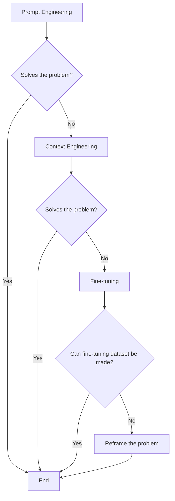
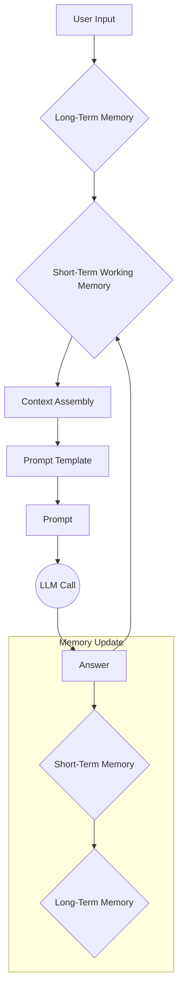
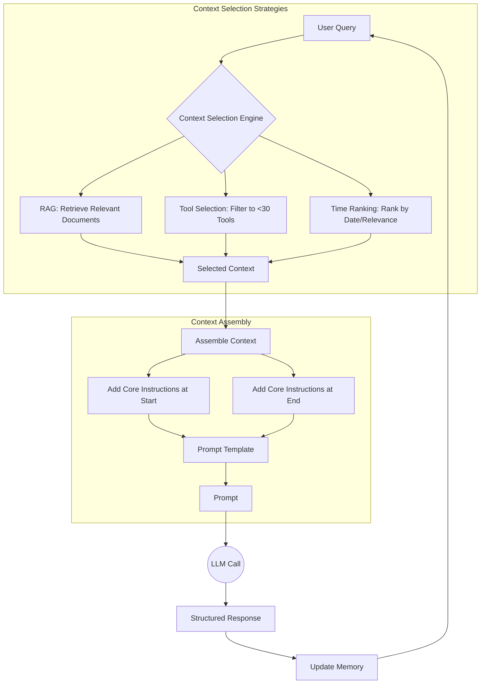
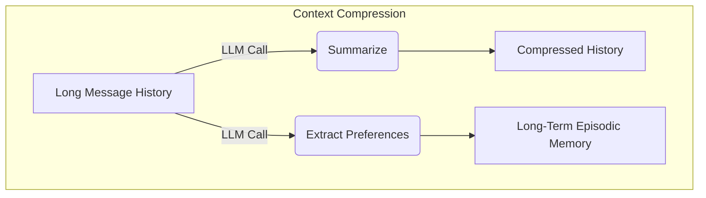
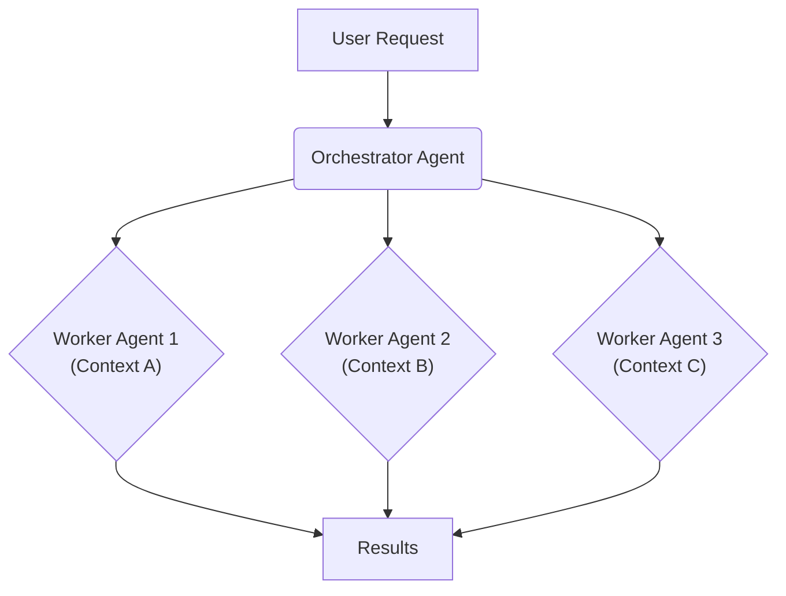

# Lesson 3: Context Engineering

## Introduction: When prompt engineering breaks

AI applications have evolved rapidly. In 2022, we had simple chatbots for question-and-answering. By 2023, Retrieval-Augmented Generation (RAG) systems connected LLMs to domain-specific knowledge [[1]](https://www.linkedin.com/posts/ai-apps-central_most-people-put-all-ai-systems-in-the-same-activity-7438555783077793792-UEUm). 2024 brought us tool-using agents that could perform actions. Now, we are building memory-enabled, stateful agents that remember past interactions and build relationships over time [[2]](https://www.securityindustry.org/2024/07/16/understanding-the-evolution-from-classic-chatbots-to-rag-chatbots-to-ai-powered-assistants/), [[3]](https://pagergpt.ai/ai-chatbot/evolution-of-ai-chatbots). This progression from simple response generation to complex, goal-driven action marks a significant shift in what we can build with AI.

In our last lesson, we explored how to choose between AI agents and LLM workflows when designing a system. As these applications grow more complex, prompt engineering, a practice that once served us well, is showing its limits. It optimizes single LLM calls but fails when managing systems with memory, actions, and long interaction histories. The sheer volume of information an agent might need has grown exponentially. This includes past conversations, user data, documents, and action descriptions. Simply stuffing all this into a prompt is not a viable strategy.

Context engineering addresses this need. It is the discipline of orchestrating this entire information ecosystem to ensure the LLM gets exactly what it needs, when it needs it. This skill is becoming a core foundation for AI engineering, moving us beyond simple "ChatGPT wrappers" and toward building robust, industrial-strength AI applications.

## From Prompt to Context Engineering

Prompt engineering, while effective for simple tasks, is designed for single, stateless interactions. It treats each call to an LLM as a new, isolated event. This approach breaks down in stateful applications where context must be preserved and managed across multiple turns. It is why context engineering is seen as the evolutionary successor to prompt engineering, enabling AI systems to handle complex, long-horizon tasks that unfold over extended interactions [[4]](https://neo4j.com/blog/agentic-ai/context-engineering-vs-prompt-engineering/).

As a conversation or task progresses, the context grows. Without a strategy to manage this growth, the LLM’s performance degrades. This is context decay, a phenomenon researchers call "context rot" [[5]](https://www.trychroma.com/research/context-rot). The model gets confused by the noise of an ever-expanding history and starts to lose track of the original instructions or key information. This happens because an LLM's attention is finite; as more information is added, its focus dilutes, and it struggles to distinguish signal from noise.

Even with large context windows, a physical limit exists for what you can include. Also, on the operational side, every token adds to the cost and latency of an LLM call [[6]](https://www.comet.com/site/blog/context-window/). An agent in a 50-step workflow that consumes 20,000 tokens per call will process 1 million tokens in total. This makes brute-force context stuffing economically and technically unfeasible. Simply putting everything into the context creates a slow, expensive, and underperforming system. We will explore these concepts in more detail in upcoming lessons, including memory in Lesson 9 and RAG in Lesson 10.

On a recent project, we learned this the hard way. We were working with a model that supported a million-token context window. We thought, "*What could go wrong?*" and stuffed everything in: our research, guidelines, examples, and user history. The result was an LLM workflow that took 30 minutes to run and produced low-quality outputs.

Context engineering becomes essential to solve these problems. It shifts the focus from crafting static prompts to building dynamic systems that manage information flow. As an AI engineer, your job is to select only the most critical pieces of context for each LLM call. This makes your applications accurate, fast, and cost-effective.

## Understanding Context Engineering

Context engineering is the formal discipline of designing and optimizing the information an LLM receives to perform a task. It is a solution to an optimization problem where you retrieve the right parts from your short-term and long-term memory to solve a specific task without overwhelming the model. For example, when you ask a cooking agent for a recipe, you do not give it the entire cookbook. Instead, you retrieve the specific recipe, along with personal context like allergies or taste preferences. This precise selection ensures the model receives only the essential information.

Andrej Karpathy explains that LLMs are like a new kind of operating system where the model is the CPU and its context window is the RAM [[7]](https://blog.langchain.com/context-engineering-for-agents/), [[8]](https://atlan.com/know/working-memory-llms/). Just as an operating system manages what fits into your computer’s limited RAM, context engineering manages what information occupies the model’s limited context window. This analogy extends further: the model's weights are like ROM (static, read-only memory), and external knowledge bases like vector stores are like disk storage, vast but requiring explicit loading into RAM to be used [[8]](https://atlan.com/know/working-memory-llms/). This reframes our work from just writing prompts to designing a rudimentary operating system for this new kind of CPU [[9]](https://www.sundeepteki.org/blog/from-vibe-coding-to-context-engineering-a-blueprint-for-production-grade-genai-systems).

How does context engineering relate to prompt engineering? It is simple. Prompt engineering is a subset of context engineering [[10]](https://www.linkedin.com/posts/denis-panjuta_prompt-engineering-vs-context-engineering-activity-7363945251180322816-1q_m). You still write effective prompts, but you also design a system that feeds the right context into those prompts. This means understanding not just *how* to phrase a task, but *what* information the model needs to perform optimally.

| Dimension | Prompt Engineering | Context Engineering |
| :--- | :--- | :--- |
| Scope | Single interaction optimization | Entire information ecosystem |
| State Management | Stateless function | Stateful due to memory |
| Focus | How to phrase tasks | What information to provide |

Table 1: A comparison of prompt engineering and context engineering.

Context engineering is the new fine-tuning. While fine-tuning has its place, it is expensive, time-consuming, and inflexible. Data changes constantly, making fine-tuning a last resort. For most enterprise use cases, you get better results faster and more cheaply with context engineering. It allows for rapid iteration and adaptation to evolving data without altering the core model, a key advantage in dynamic environments. This approach avoids the computational resources and specialized expertise required for retraining, offering a more agile path to reliable AI applications [[11]](https://memgraph.com/blog/prompt-engineering-vs-context-engineering).

When you start a new AI project, your decision-making process for guiding the LLM should look like the one presented in Image 1.


Image 1: A flowchart illustrating the decision-making workflow for choosing between Prompt Engineering, Context Engineering, and Fine-tuning when starting a new AI project.

For instance, if you build an agent to process internal Slack messages, you do not need to fine-tune a model on your company’s communication style. It is more effective to use a powerful reasoning model and engineer the context to retrieve specific messages and enable actions like creating tasks or drafting emails. Throughout this course, we will show you how to solve most industry problems using only context engineering.

## What Makes Up the Context

To master context engineering, you first need to understand what "context" actually is. It is everything the LLM sees in a single turn, dynamically assembled from various memory components before being passed to the model.

The high-level workflow, as presented in Image 2, begins when a user input triggers the system to pull relevant information from both long-term and short-term memory. This information is assembled into the final context, inserted into a prompt template, and sent to the LLM. The LLM’s answer then updates the memory, and the cycle repeats.


Image 2: The high-level workflow of how context is assembled and used in an AI system.

These components are grouped into two main categories. We will explain them intuitively for now, as we have future dedicated lessons for all of them.

### Short-Term Working Memory

Short-term working memory is the state of the agent for the current task or conversation. It is volatile and changes with each interaction, helping the agent maintain a coherent dialogue and make immediate decisions. It can include some or all of these components [[12]](https://www.datacamp.com/blog/how-does-llm-memory-work):

-   **User input:** The most recent query or command from the user. This is the immediate trigger for the agent's next action and is the most direct piece of context.
-   **Message history:** The log of the current conversation, allowing the LLM to understand the flow and previous turns. This history is crucial for maintaining coherence and avoiding repetitive questions.
-   **Agent's internal thoughts:** The reasoning steps the agent takes to decide on its next action. This is often saved to a "scratchpad" or temporary log, allowing the agent to maintain a chain of thought without cluttering the main conversation history [[13]](https://datahub.com/blog/context-window-optimization/).
-   **Action calls and outputs:** The results from any actions the agent has performed, providing information from external systems. This feedback loop is essential for agents that interact with the world, as it grounds their decisions in real-time data.

### Long-Term Memory

Long-term memory is more persistent and stores information across sessions, allowing the AI system to remember things beyond a single conversation. We divide it into three types, drawing parallels from human memory [[14]](https://www.analyticsvidhya.com/blog/2026/01/how-does-llm-memory-work/). An AI system can include some or all of them:

-   **Procedural memory:** This is knowledge encoded directly in the code and system configuration. It includes the system prompt, which sets the agent's overall behavior and personality. It also includes the definitions of available actions (tools) and schemas for structured outputs, which guide the format of its responses. This type of memory dictates the agent's fundamental capabilities and constraints [[15]](https://skymod.tech/why-memory-matters-in-llm-agents-short-term-vs-long-term-memory-architectures/).
-   **Episodic memory:** This is memory of specific past experiences, like user preferences, previous conversations, or key decisions. It is used to help the agent personalize its responses and learn from individual interactions. We typically store this in vector or graph databases for efficient retrieval, allowing the agent to recall relevant past events when needed [[16]](https://labelstud.io/learningcenter/episodic-vs-persistent-memory-in-llms/).
-   **Semantic memory:** This is the agent’s general knowledge base. It can be internal, like company documents stored in a data lake, or external, accessed via the internet through API calls or web scraping. This memory provides the factual information the agent needs to answer questions and perform tasks, grounding its responses in a verifiable body of knowledge [[17]](https://atlan.com/know/working-memory-llms/).

This entire memory architecture is inspired by neuroscience. In the human brain, the hippocampus acts as a temporary buffer for new experiences. These are later consolidated and transferred to the neocortex for permanent storage, often during sleep [[18]](https://systemweakness.com/decoding-ai-memory-why-our-brains-hold-the-key-to-the-next-generation-of-llms-a0246f1a56a2).

Similarly, effective AI systems need structured pipelines to manage the flow of information from volatile short-term memory to stable long-term storage. This prevents catastrophic forgetting and enables continuous learning [[19]](https://dev.to/joojodontoh/teaching-alfred-to-remember-with-a-neuroscience-inspired-memory-system-for-ai-agents-2o5l).

If this seems like a lot, bear with us. We will cover all these concepts in-depth in future lessons, including structured outputs (Lesson 4), actions (Lesson 6), memory (Lesson 9), and RAG (Lesson 10).

https://github.com/user-attachments/assets/0f1f193f-8e94-4044-a276-576bd7764fd0
Image 3: Context engineering encompasses a variety of techniques and information sources (Source [humanlayer/12-factor-agents [78]](https://github.com/humanlayer/12-factor-agents/blob/main/content/factor-03-own-your-context-window.md))

The key takeaway is that these components are not static. They are dynamically re-computed for every single interaction. For each conversation turn or new task, the short-term memory grows, or the long-term memory can change. Context engineering involves knowing how to select the right pieces from this vast memory pool to construct the most effective prompt for the task at hand.

## Production Implementation Challenges

Now that we understand what makes up the context, let's look at the core challenges of implementing it in production. These challenges all revolve around balancing two key principles: relevance and sufficiency [[20]](https://arxiv.org/pdf/2603.09619). Relevance means providing only the context necessary for the current task to avoid the "lost-in-the-middle" problem. Sufficiency means ensuring all critical information is present to prevent hallucination. The goal is to find the minimum sufficient context for any given decision.

Here are four common issues that come up when building AI applications:

1.  **The context window challenge:** Every AI model has a limited context window, the maximum amount of information (tokens) it can process simultaneously [[6]](https://www.comet.com/site/blog/context-window/). It is similar to your computer's RAM. If you have only 32GB of RAM on your machine, that is all you can process at one time. While models like GPT-4.1 and Gemini 2.5 Pro offer 1M token windows, even these are finite and come with performance trade-offs. The Maximum Effective Context Window (MECW)—the point where accuracy actually holds up—is often far below the advertised limit, with gaps reaching 99% on complex tasks [[21]](https://atlan.com/know/llm-context-window-limitations/).

2.  **Information overload:** Too much context reduces the performance of the LLM by confusing it. This is known as the "lost-in-the-middle" or "needle in a haystack" problem, where LLMs are known for remembering information best at the beginning and end of the context window [[22]](https://www.linkedin.com/pulse/lost-middle-lesson-failing-ai-agents-backwards-anthony-dejohn-01k2e). Research from Stanford and UC Berkeley found that accuracy can drop by over 30% when relevant information is placed in the middle of a long context [[21]](https://atlan.com/know/llm-context-window-limitations/). A 2025 study by Chroma on 18 frontier models confirmed this "context rot," showing that performance degrades non-uniformly as input length increases, even on simple tasks [[5]](https://www.trychroma.com/research/context-rot).

3.  **Context drift:** This occurs when conflicting views of truth accumulate in the memory over time [[23]](https://galileo.ai/blog/production-llm-monitoring-strategies). For example, the memory might contain two conflicting statements: "*My cat is white*" and "*My cat is black*." This is not Schrodinger's Cat quantum physics experiment; it is a data conflict that confuses the LLM. This can be caused by stale data from knowledge bases or evolving user inputs, leading to inconsistent and untrustworthy responses. Without monitoring, these subtle semantic shifts can erode user trust and cause failures to cascade across systems [[24]](https://thenewstack.io/context-rot-enterprise-ai-llms/).

4.  **Tool confusion:** The final challenge is tool confusion, which arises in two main ways. First, adding too many actions to an agent can confuse the LLM about the best one for the job. This problem often appears with over 100 tools, where the model struggles to differentiate between similar functions [[25]](https://redis.io/blog/context-window-overflow/). Second, confusion can occur when tool descriptions are poorly written or overlap. If the distinctions between actions are unclear, even a human would struggle to choose the right one.

## Key Strategies for Context Optimization

While early AI applications were simple chatbots, modern systems must manage multiple knowledge bases, tools, and complex histories. Context engineering is about managing this complexity while meeting performance, latency, and cost requirements.

Here are four popular context engineering strategies used across the industry:

### Selecting the Right Context

Retrieving the right information from memory is a critical first step. A common mistake is to provide everything at once, assuming that models with large context windows can handle it. As we have discussed, the "lost-in-the-middle" problem often leads to poor performance, increased latency, and higher costs [[21]](https://atlan.com/know/llm-context-window-limitations/).

To solve this, consider these approaches:

-   **Use structured outputs:** Define clear schemas for what the LLM should return. This allows you to pass only the necessary, structured information to downstream steps. We will cover this in detail in Lesson 4.
-   **Use RAG:** Instead of providing entire documents, use RAG to fetch only the specific chunks of text needed to answer a user's question. This technique is fundamental for grounding models in factual, up-to-date information. This is a core topic we will explore in Lesson 10.
-   **Reduce the number of available actions:** Rather than giving an agent access to every available action, use various strategies to delegate action subsets to specialized components. For example, a typical pattern is to leverage the orchestrator-worker pattern to delegate subtasks to specialized agents. Studies show that limiting the selection to under 30 tools can triple the agent's selection accuracy. Still, the ideal number of tools an agent can use can be highly dependent on what tools you provide, what LLM you use, and how well the actions are defined. That is why evaluating the performance of your AI system on core business metrics is a mandatory step that will help you pick the number. We will learn how to do this in future lessons.
-   **Rank time-sensitive data:** For time-sensitive information, rank it by date and filter out anything no longer relevant. This can be done by implementing memory pruning strategies that expire outdated information or rank it by recency and relevance [[26]](https://www.dailydoseofds.com/llmops-crash-course-part-8/).
-   **Repeat core instructions:** For the most important instructions, repeat them at both the start and the end of the prompt. This uses the model's tendency to pay more attention to the context edges, ensuring core instructions are not lost. This is a practical way to mitigate the "lost-in-the-middle" effect [[27]](https://promptmetheus.com/resources/llm-knowledge-base/lost-in-the-middle-effect).

As illustrated in Image 4, these strategies work together to create a focused and effective context for the LLM.


Image 4: A workflow showing how context selection strategies can work together to optimize information retrieval and assembly.

### Context Compression

As message history grows in short-term working memory, you must manage past interactions to keep your context window in check. You cannot simply drop past conversation turns, as the LLM still needs to remember what happened. Instead, you need ways to compress key facts from the past.

You can do this through:

-   **Creating summaries of past interactions:** Use an LLM to replace a long, detailed history with a concise overview. A study by JetBrains Research found that both summarization and a simpler technique called "observation masking" (hiding older tool outputs) could cut costs by over 50% without hurting problem-solving ability [[28]](https://blog.jetbrains.com/research/2025/12/efficient-context-management/). However, simple summarization can be lossy. Some methods risk creating fragmented context by removing key relational words, leading to incorrect reasoning. In contrast, structured summarization, which preserves the relationships between entities, has been shown to retain more useful information in long-running agent sessions without sacrificing compression efficiency [[29]](https://aclanthology.org/2025.findings-emnlp.362.pdf), [[30]](https://factory.ai/news/evaluating-compression).
-   **Moving user preferences to long-term memory:** Transfer user preferences from working memory to long-term episodic memory. This keeps the working context clean while ensuring preferences are remembered for future sessions.
-   **Deduplication:** Remove redundant information from the context to avoid repetition. This can be done using semantic deduplication techniques that cluster similar chunks of information and select a single representative, reducing token usage by 50-80% while preserving accuracy [[31]](https://oneuptime.com/blog/post/2026-01-30-context-compression/view).
-   **Implement memory decay:** Create rules to automatically down-rank or delete old, rarely used, or contradicted information to prevent context drift and keep the memory relevant [[32]](https://medium.com/@armankamran/context-is-the-new-intelligence-engineering-the-next-generation-of-generative-ai-systems-174d99634c0c).

Image 5 illustrates how summarization and preference extraction work to compress the context.


Image 5: Compressing context by summarizing history and extracting preferences to long-term memory.

### Isolating Context

Another powerful strategy is to enforce context isolation, a core principle for building autonomous multi-agent systems [[20]](https://arxiv.org/pdf/2603.09619). This technique is similar to tool isolation but it is more general, referring to the whole context. The key idea is that instead of one agent with a massive, cluttered context window, you can have a team of agents, each with a smaller, focused context.

We often implement this using an orchestrator-worker pattern, where a central orchestrator agent breaks down a problem and assigns sub-tasks to specialized worker agents [[33]](https://beam.ai/agentic-insights/multi-agent-orchestration-patterns-production). Each worker operates in its own isolated context, improving focus and allowing for parallel processing. This modular approach not only improves performance but also makes the system more scalable and easier to debug. We will cover this pattern in more detail in Lesson 5. This pattern is shown in Image 6.


Image 6: The orchestrator-worker pattern isolates context across multiple specialized agents.

### Format Optimizations

Finally, the way you format the context matters. Models are sensitive to structure, and using clear delimiters can improve performance. Common strategies are to:

-   **Use XML tags:** Wrap different pieces of context in XML-like tags (e.g., `<user_query>`, `<documents>`). This helps the model distinguish between different types of information, while making it easier for the engineer to reference context elements within the system prompt [[34]](https://www.anthropic.com/engineering/effective-context-engineering-for-ai-agents).
-   **Prefer YAML over JSON:** When providing structured data as input, YAML is often more token-efficient than JSON, which helps save space in your context window.

To conclude, you always have to understand what is passed to the LLM. Seeing exactly what occupies your context window at every step is key to mastering context engineering. Usually, this is done by properly monitoring your traces, tracking what happens at each step, and understanding what the inputs and outputs are. As this is a significant step to go from PoC to production, we will have dedicated lessons on this.

## Here is an Example

Let's connect the theory and strategies discussed earlier with concrete examples. To do that, let's consider several common real-world scenarios where context engineering is critical:

-   **Healthcare:** An AI assistant accesses a patient's medical history, current symptoms, and the latest medical literature to provide personalized diagnostic support. This requires careful management of sensitive data and integration with electronic health records to ensure advice is safe and relevant. For example, the system must be able to pull a patient's known allergies from episodic memory and cross-reference them with potential remedies from semantic memory [[35]](https://www.decodingai.com/p/context-engineering-2025s-1-skill).
-   **Financial Services:** AI systems integrate with enterprise tools like Customer Relationship Management (CRM) systems, emails, and calendars, combining real-time market data and client portfolio information to generate tailored financial advice and reports. This involves navigating complex compliance requirements and ensuring data security by, for instance, using role-based access to filter context.
-   **Project Management:** AI systems access enterprise infrastructure like CRMs, Slack, and task managers to automatically understand project requirements, then add and update project tasks. This requires maintaining context across multiple platforms and user interactions to keep projects on track, such as summarizing a long Slack thread to create a concise task description.
-   **Content Creator Assistant:** An AI agent uses your research, past content, and personality traits to understand what and how to create a given piece of content. This involves managing a diverse set of unstructured data and learning a user's unique style and voice, for example, by retrieving stylistic preferences from episodic memory.

Let's walk through a specific query to see context engineering in action with the healthcare assistant scenario. A user asks: `I have a headache. What can I do to stop it? I would prefer not to take any medicine.`

Before the AI attempts to answer, a context engineering system performs several steps [[35]](https://www.decodingai.com/p/context-engineering-2025s-1-skill):

1.  It retrieves the user's patient history, known allergies, and lifestyle habits from episodic memory.
2.  It queries a medical database for non-pharmacological headache remedies from semantic memory.
3.  It uses various tools to assemble the key units of information from both memory types into the final context.
4.  It formats this information into a structured prompt and calls the LLM.
5.  Finally, it presents a personalized, context-aware answer to the user.

Here is a simplified Python example showing how you might structure the context and prompt for the LLM, using XML tags to format the different context elements and YAML to format all input data collections.

1.  First, we define the user's query.
    ```python
    import yaml
    
    user_query = "I have a headache. What can I do to stop it? I would prefer not to take any medicine."
    ```
2.  Next, we define the patient's history, which would typically be retrieved from episodic memory.
    ```python
    patient_history = {
        "patient": {
            "name": "John Doe",
            "age": 45,
            "gender": "M",
            "conditions": ["mild_hypertension"],
            "allergies": [],
            "preferences": {
                "medication_avoidance": True,
                "preferred_treatments": "natural_remedies"
            },
            "habits": {
                "stress_level": "high",
                "work_related": True,
                "caffeine_intake": "3-4_cups_daily"
            }
        }
    }
    ```
3.  Then, we include relevant medical literature, which would be retrieved from semantic memory [[36]](https://www.mdpi.com/2079-9292/13/15/2961).
    ```python
    medical_literature = {
        "articles": [
            {
                "id": 1,
                "topic": "dehydration_headaches",
                "finding": "Dehydration is a common cause of tension headaches",
                "treatment": "Rehydration can alleviate symptoms within 30 minutes to three hours"
            },
            {
                "id": 2,
                "topic": "cold_compress",
                "finding": "Applying a cold compress to the forehead and temples can constrict blood vessels",
                "treatment": "Reduces inflammation, helping to relieve migraine pain"
            },
            {
                "id": 3,
                "topic": "caffeine_withdrawal",
                "finding": "Caffeine withdrawal can trigger headaches",
                "treatment": "For regular caffeine consumers, a small amount may alleviate withdrawal headaches"
            },
            {
                "id": 4,
                "topic": "stress_relief",
                "finding": "Stress-relief techniques are effective for tension headaches",
                "treatment": "Deep breathing, meditation, or short walks can help"
            }
        ]
    }
    ```
4.  Finally, we assemble the complete prompt, combining all elements into a structured format. Notice how we format the patient history and medical literature as YAML, instead of passing them directly as plain Python dictionaries, which are equivalent to JSON.
    ```python
    prompt = f"""
    <system_prompt>
    You are a helpful AI medical assistant. Your role is to provide safe, helpful, and personalized health advice based on the provided context. Do not give advice outside of the provided context. Prioritize non-medicinal options as per user preference.
    </system_prompt>
    
    <patient_history>
    {yaml.dump(patient_history)}
    </patient_history>
    
    <medical_literature>
    {yaml.dump(medical_literature)}
    </medical_literature>
    
    <user_query>
    {user_query}
    </user_query>
    
    <instructions>
    Based on all the information above, provide a step-by-step plan for the user to relieve their headache. Structure your response clearly.
    </instructions>
    """
    ```
5.  Ultimately, the final input sent to the LLM would look like this:
    ```xml
    <system_prompt>
    You are a helpful AI medical assistant. Your role is to provide safe, helpful, and personalized health advice based on the provided context. Do not give advice outside of the provided context. Prioritize non-medicinal options as per user preference.
    </system_prompt>
    
    <patient_history>
    patient:
      name: John Doe
      age: 45
      gender: M
      conditions:
        - mild_hypertension
      allergies: []
      preferences:
        medication_avoidance: true
        preferred_treatments: natural_remedies
      habits:
        stress_level: high
        work_related: true
        caffeine_intake: 3-4_cups_daily
    </patient_history>
    
    <medical_literature>
    articles:
      - id: 1
        topic: dehydration_headaches
        finding: "Dehydration is a common cause of tension headaches"
        treatment: "Rehydration can alleviate symptoms within 30 minutes to three hours"
      - id: 2
        topic: cold_compress
        finding: "Applying a cold compress to the forehead and temples can constrict blood vessels"
        treatment: "Reduces inflammation, helping to relieve migraine pain"
      - id: 3
        topic: caffeine_withdrawal
        finding: "Caffeine withdrawal can trigger headaches"
        treatment: "For regular caffeine consumers, a small amount may alleviate withdrawal headaches"
      - id: 4
        topic: stress_relief
        finding: "Stress-relief techniques are effective for tension headaches"
        treatment: "Deep breathing, meditation, or short walks can help"
    </medical_literature>
    
    <user_query>
    I have a headache. What can I do to stop it? I would prefer not to take any medicine.
    </user_query>
    
    <instructions>
    Based on all the information above, provide a step-by-step plan for the user to relieve their headache. Structure your response clearly.
    </instructions>
    ```

To build such a system, you need a robust tech stack. Here is a potential stack we recommend and will use throughout this course [[37]](https://blog.stackademic.com/context-engineering-in-llms-and-ai-agents-eb861f0d3e9b), [[38]](https://atlan.com/know/context-engineering-platforms-comparison/), [[39]](https://www.scalablepath.com/machine-learning/langgraph):

-   **LLM:** Gemini as a multimodal, reasoning, and cost-effective LLM API provider. Its large context window and strong reasoning capabilities make it suitable for complex, multi-turn applications.
-   **Orchestration:** LangGraph for defining stateful, agentic workflows. Its graph-based structure is ideal for managing the complex control flows and state transitions required in context engineering.
-   **Databases:** PostgreSQL, MongoDB, Redis, Qdrant, and Neo4j. Often, it is effective to keep it simple, as you can achieve much with only PostgreSQL or MongoDB for structured and unstructured data storage.
-   **Observability:** Opik or LangSmith for evaluation and trace monitoring. These tools are essential for debugging context-related issues by providing visibility into what information is in the context window at each step.

## Conclusion - Wrap-up: Connecting context engineering to AI engineering

Context engineering is a discipline that combines both intuition and systematic practice. It is about developing a feel for crafting effective prompts, selecting the right information from memory, and arranging context for optimal results. This practice helps you determine the minimal yet essential information an LLM needs to perform at its best.

It is important to understand that context engineering, or AI engineering for that matter, cannot be learned in isolation. It is a complex field that combines [[40]](https://packmind.com/context-engineering-ai-coding/what-is-contextops/), [[41]](https://www.mezmo.com/learn-observability/context-engineering-for-observability-how-to-deliver-the-right-data-to-llms/), [[42]](https://sombrainc.com/blog/ai-context-engineering-guide):

1.  **AI Engineering:** This involves implementing the core AI components of your system. You will build and fine-tune LLM workflows, design RAG pipelines for knowledge retrieval, construct AI agents that can reason and act, and set up evaluation pipelines to measure and improve performance.
2.  **Software Engineering (SWE):** Your AI product must be built on a solid software foundation. This means writing code that is not just functional but also scalable, maintainable, and testable. You will design architectures that can evolve with your product's needs, ensuring that your AI system is robust and production-ready.
3.  **Data Engineering:** The quality of your AI's memory layer depends on the data you feed it. Data engineering involves designing and building data pipelines that ingest, clean, transform, and validate data before it becomes part of the agent's context, ensuring the information is accurate and reliable.
4.  **Operations (Ops):** Deploying and managing AI systems in production requires a strong operational backbone. This includes setting up the right infrastructure, automating deployment with Continuous Integration/Continuous Deployment (CI/CD) pipelines, and implementing monitoring and observability to ensure your agents are reproducible, maintainable, and scalable.

Our goal with this course is to teach you how to combine these skills to build production-ready AI products. In the world of AI, we should all think in systems rather than isolated components, having a mindset shift from developers to architects.

In the next lesson, we will explore structured outputs, a key technique for controlling what information flows out of an LLM and into the rest of your system. This is a foundational skill for building reliable agents, as we have seen in our examples. We will also continue to build on these concepts as we cover actions in Lesson 6, memory in Lesson 9, and RAG in Lesson 10.

## References

- [1] https://www.linkedin.com/posts/ai-apps-central_most-people-put-all-ai-systems-in-the-same-activity-7438555783077793792-UEUm
- [2] https://www.securityindustry.org/2024/07/16/understanding-the-evolution-from-classic-chatbots-to-rag-chatbots-to-ai-powered-assistants/
- [3] https://pagergpt.ai/ai-chatbot/evolution-of-ai-chatbots
- [4] https://neo4j.com/blog/agentic-ai/context-engineering-vs-prompt-engineering/
- [5] https://www.trychroma.com/research/context-rot
- [6] https://www.comet.com/site/blog/context-window/
- [7] https://blog.langchain.com/context-engineering-for-agents/
- [8] https://atlan.com/know/working-memory-llms/
- [9] https://www.sundeepteki.org/blog/from-vibe-coding-to-context-engineering-a-blueprint-for-production-grade-genai-systems
- [10] https://www.linkedin.com/posts/denis-panjuta_prompt-engineering-vs-context-engineering-activity-7363945251180322816-1q_m
- [11] https://memgraph.com/blog/prompt-engineering-vs-context-engineering
- [12] https://www.datacamp.com/blog/how-does-llm-memory-work
- [13] https://datahub.com/blog/context-window-optimization/
- [14] https://www.analyticsvidhya.com/blog/2026/01/how-does-llm-memory-work/
- [15] https://skymod.tech/why-memory-matters-in-llm-agents-short-term-vs-long-term-memory-architectures/
- [16] https://labelstud.io/learningcenter/episodic-vs-persistent-memory-in-llms/
- [17] https://atlan.com/know/working-memory-llms/
- [18] https://systemweakness.com/decoding-ai-memory-why-our-brains-hold-the-key-to-the-next-generation-of-llms-a0246f1a56a2
- [19] https://dev.to/joojodontoh/teaching-alfred-to-remember-with-a-neuroscience-inspired-memory-system-for-ai-agents-2o5l
- [20] https://arxiv.org/pdf/2603.09619
- [21] https://atlan.com/know/llm-context-window-limitations/
- [22] https://www.linkedin.com/pulse/lost-middle-lesson-failing-ai-agents-backwards-anthony-dejohn-01k2e
- [23] https://galileo.ai/blog/production-llm-monitoring-strategies
- [24] https://thenewstack.io/context-rot-enterprise-ai-llms/
- [25] https://redis.io/blog/context-window-overflow/
- [26] https://www.dailydoseofds.com/llmops-crash-course-part-8/
- [27] https://promptmetheus.com/resources/llm-knowledge-base/lost-in-the-middle-effect
- [28] https://blog.jetbrains.com/research/2025/12/efficient-context-management/
- [29] https://aclanthology.org/2025.findings-emnlp.362.pdf
- [30] https://factory.ai/news/evaluating-compression
- [31] https://oneuptime.com/blog/post/2026-01-30-context-compression/view
- [32] https://medium.com/@armankamran/context-is-the-new-intelligence-engineering-the-next-generation-of-generative-ai-systems-174d99634c0c
- [33] https://beam.ai/agentic-insights/multi-agent-orchestration-patterns-production
- [34] https://www.anthropic.com/engineering/effective-context-engineering-for-ai-agents
- [35] https://www.decodingai.com/p/context-engineering-2025s-1-skill
- [36] https://www.mdpi.com/2079-9292/13/15/2961
- [37] https://blog.stackademic.com/context-engineering-in-llms-and-ai-agents-eb861f0d3e9b
- [38] https://atlan.com/know/context-engineering-platforms-comparison/
- [39] https://www.scalablepath.com/machine-learning/langgraph
- [40] https://packmind.com/context-engineering-ai-coding/what-is-contextops/
- [41] https://www.mezmo.com/learn-observability/context-engineering-for-observability-how-to-deliver-the-right-data-to-llms
- [42] https://sombrainc.com/blog/ai-context-engineering-guide
- [43] https://arxiv.org/pdf/2507.13334
- [44] https://medium.com/@sahin.samia/the-common-failure-points-of-llm-rag-systems-and-how-to-overcome-them-926d9090a88f
- [45] https://towardsdatascience.com/your-1m-context-window-llm-is-less-powerful-than-you-think/
- [46] https://www.coforge.com/what-we-know/blog/navigating-the-shifting-sands-understanding-and-mitigating-data-drift-in-llms
- [47] https://insightfinder.com/blog/hidden-cost-llm-drift-detection/
- [48] https://www.helicone.ai/blog/how-to-reduce-llm-hallucination
- [49] https://arxiv.org/html/2510.22101v1
- [50] https://www.getmaxim.ai/articles/context-window-management-strategies-for-long-context-ai-agents-and-chatbots
- [51] https://www.decube.io/post/master-data-pipeline-architecture-best-practices-for-engineers
- [52] https://www.glean.com/blog/context-engineering-ai-the-foundation-of-reliable-high-performing-models
- [53] https://www.dante-ai.com/news/when-did-ai-chatbots-start
- [54] https://www.glean.com/perspectives/context-engineering-vs-prompt-engineering-key-differences-explained
- [55] https://www.linkedin.com/pulse/context-engineering-silent-architecture-behind-every-ai-roychowdhury-lzcec
- [56] https://gurusup.com/blog/multi-agent-orchestration-guide
- [57] https://www.vellum.ai/blog/multi-agent-systems-building-with-context-engineering
- [58] https://www.praetorian.com/blog/deterministic-ai-orchestration-a-platform-architecture-for-autonomous-development/
- [59] https://arxiv.org/html/2601.13671v1
- [60] https://www.mezmo.com/learn-observability/context-engineering-for-observability-how-to-deliver-the-right-data-to-llms)
- [61] https://www.instinctools.com/blog/context-engineering/
- [62] https://bigdataboutique.com/blog/needle-in-haystack-optimizing-retrieval-and-rag-over-long-context-windows-5dfb3c
- [63] https://www.codecademy.com/article/context-engineering-in-ai
- [64] https://packmind.com/context-engineering-ai-coding/how-to-implement-context-engineering/
- [65] https://www.datacamp.com/blog/context-engineering
- [66] https://www.llamaindex.ai/blog/context-engineering-what-it-is-and-techniques-to-consider
- [67] https://blog.langchain.com/the-rise-of-context-engineering/
- [68] https://x.com/karpathy/status/1937902205765607626
- [69] https://x.com/lenadroid/status/1943685060785524824
- [70] https://github.com/humanlayer/12-factor-agents/blob/main/content/factor-03-own-your-context-window.md
- [71] https://nlp.elvissaravia.com/p/context-engineering-guide
- [72] https://www.pinecone.io/learn/context-engineering/
- [73] https://packmind.com/context-engineering-ai-coding/what-is-contextops/)
- [74] https://www.glean.com/blog/context-engineering-ai-the-foundation-of-reliable-high-performing-models
- [75] https://dev.to/thousand_miles_ai/the-lost-in-the-middle-problem-why-llms-ignore-the-middle-of-your-context-window-3al2