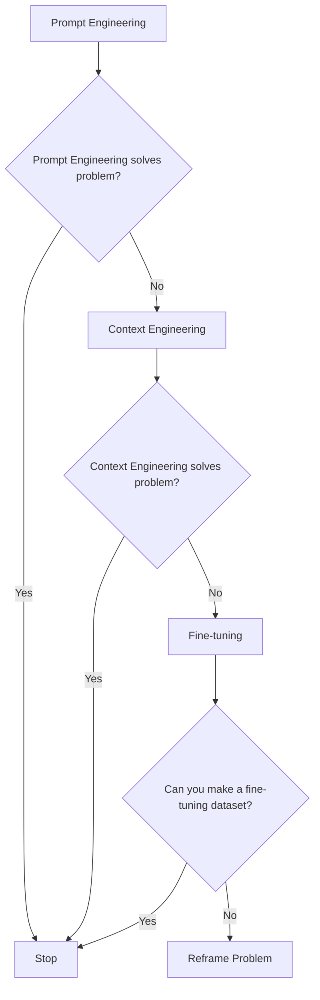
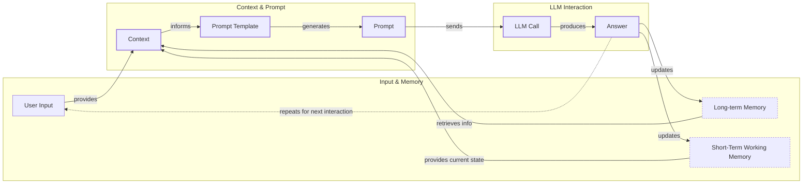
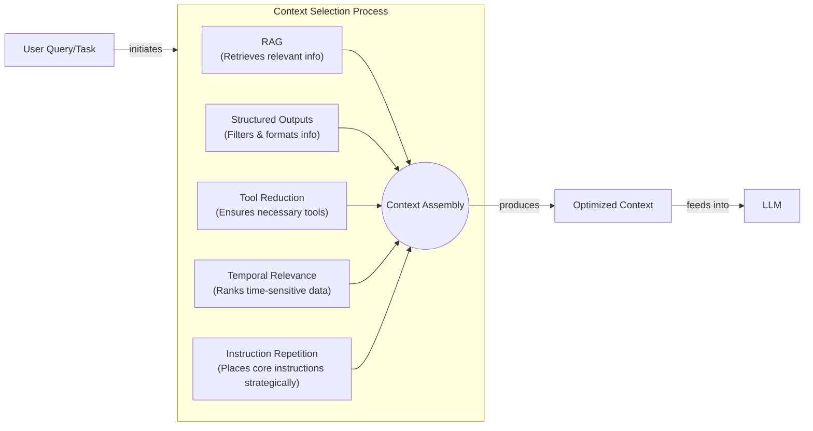
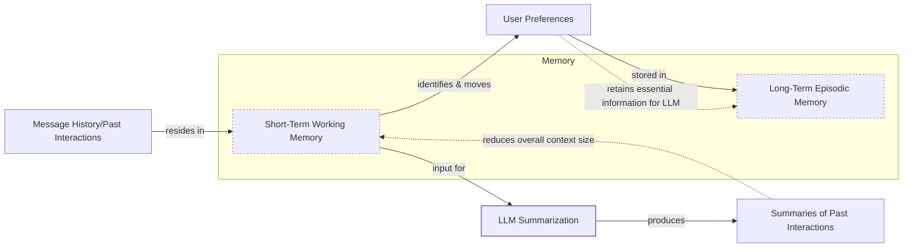
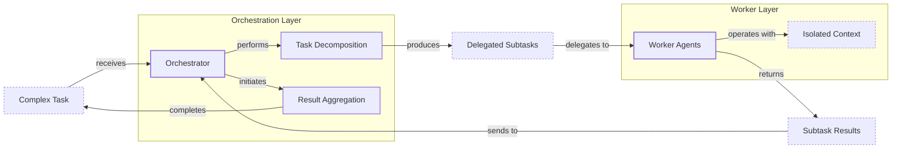

# When prompt engineering breaks

AI applications have evolved rapidly. In 2022, we had simple chatbots for question-answering. By 2023, Retrieval-Augmented Generation (RAG) systems connected LLMs to domain-specific knowledge. 2024 brought us tool-using agents that could perform actions. Now, in 2025, we are building memory-enabled agents that remember past interactions and build relationships over time [[26]](https://www.securityindustry.org/2024/07/16/understanding-the-evolution-from-classic-chatbots-to-rag-chatbots-to-ai-powered-assistants/), [[30]](https://www.linkedin.com/posts/ai-apps-central_most-people-put-all-ai-systems-in-the-same-activity-7438555783077793792-UEUm).

In our last lesson, we explored how to choose between AI agents and LLM workflows. As these applications grow more complex, prompt engineering, a practice that once served us well, is showing its limits. It optimizes single LLM calls but fails when managing systems with memory, actions, and long interaction histories. The sheer volume of information an agent might need—past conversations, user data, documents, and action descriptions—has grown exponentially. Simply stuffing all this into a prompt is not a viable strategy.

This is where context engineering comes in. It is the discipline of orchestrating this entire information ecosystem to ensure the LLM gets exactly what it needs, when it needs it. This skill is becoming a core foundation for AI engineering. As AI applications grew into complex systems, the data we have to manage grew exponentially, which directly reflects in the size of the input passed to the LLMs—the context.

## From prompt to context engineering

Prompt engineering, while effective for simple tasks, is designed for single, stateless interactions. It treats each call to an LLM as a new, isolated event. This approach breaks down in stateful applications where context must be preserved and managed across multiple turns.

As a conversation or task progresses, the context grows. Without a strategy to manage this growth, the LLM’s performance degrades. This is context decay: the model gets confused by the noise of an ever-expanding history. Research shows that models get confused by long, messy contexts, leading to hallucinations and misguided answers [[41]](https://www.decodingai.com/p/context-engineering-2025s-1-skill). It starts to lose track of the original instructions or key information.

Even with large context windows, a physical limit exists for what you can include. Also, every token adds to the cost and latency of an LLM call. Microsoft Research and Salesforce found a 39% average performance drop from single-turn to multi-turn interactions across 15 LLMs [[1]](https://atlan.com/know/llm-context-window-limitations/). Simply putting everything into the context creates a slow, expensive, and underperforming system. We will explore these concepts in more detail in upcoming lessons, including memory in Lesson 9 and RAG in Lesson 10.

On a recent project, we learned this the hard way. We were working with a model that supported a million-token context window, so we thought, "*What could go wrong*?" We stuffed everything in: our research, guidelines, examples, and user history. The result was an LLM workflow that took 30 minutes to run and produced low-quality outputs. It was unusable [[41]](https://www.decodingai.com/p/context-engineering-2025s-1-skill).

This is where context engineering becomes essential. It addresses these limitations by treating AI applications not as a series of isolated prompts, but as systems that operate through dynamic context. As AI Engineers, our job is to keep only what's essential in the context when we pass it to the LLM, making our applications accurate, fast, and cost-effective.

## Understanding context engineering

Context engineering is about finding the best way to arrange parts of your memory into the context that is passed to an LLM to get the best results. It is an optimization problem where you retrieve the right parts of your short-term and long-term memory to solve a specific task without overwhelming the model [[22]](https://arxiv.org/pdf/2507.13334). For example, when asking a cooking agent for a recipe, instead of passing the whole cookbook to the agent, we retrieve just the information for that recipe, along with personal preferences like allergies or taste.

Andrej Karpathy offered a great analogy for this: LLMs are like a new kind of operating system, where the model acts as the CPU and its context window functions as the RAM [[31]](https://www.langchain.com/blog/context-engineering-for-agents), [[41]](https://www.decodingai.com/p/context-engineering-2025s-1-skill). Just as an operating system manages what fits into RAM, context engineering curates what occupies the model’s working memory. This means we can hold information without passing it to the LLM on every turn.

This highlights a third critical skill: treating context as a scarce resource. As Anthropic explains, effective agents need the smallest useful set of high-signal tokens to produce the desired outcome [[66]](https://www.progressiverobot.com/2026/04/28/context-engineering/). Simply stuffing every available document, message, and tool result into the window causes the model to lose focus and miss the signal.

Context engineering is not replacing prompt engineering. Instead, you can see prompt engineering as a part of context engineering. You still need to learn how to write good prompts while gathering the right context and stuffing it into your prompt without breaking the LLM [[41]](https://www.decodingai.com/p/context-engineering-2025s-1-skill). The table below highlights the key differences.

Table 1: A comparison of prompt engineering and context engineering.

| Dimension | Prompt Engineering | Context Engineering |
| --- | --- | --- |
| Scope | Single interaction optimization | Entire information ecosystem |
| State Management | Stateless function | Stateful due to memory |
| Focus | How to phrase tasks | What information to provide |

Context engineering is the new fine-tuning. While fine-tuning has its place, it is expensive, time-consuming, and inflexible. Data changes constantly, making fine-tuning a last resort [[51]](https://www.linkedin.com/posts/denis-panjuta_prompt-engineering-vs-context-engineering-activity-7363945251180322816-1q_m). For most enterprise use cases, you get better results faster and more cheaply with context engineering. It allows for rapid iteration and adaptation to evolving data without altering the core model.

When you start a new AI project, your decision-making process for guiding the LLM should look like the one presented in Image 1. You start with simple prompt engineering. If that does not solve your problem, you move to context engineering. If that still fails, and you can create a high-quality dataset, fine-tuning becomes an option. Otherwise, it is time to reframe the problem.


Image 1: A flowchart illustrating the decision-making workflow for choosing an AI project strategy.

For instance, when building an agent to process internal Slack messages, you do not need to fine-tune a model on your company’s communication style. It is more effective to use a powerful reasoning model and engineer the context to retrieve specific messages and enable actions like creating tasks or drafting emails. Throughout this course, we will show you how to solve most industry problems using only context engineering.

## What makes up the context

To master context engineering, you first need to understand what "context" actually is. It is everything the LLM sees in a single turn, dynamically assembled from various memory components before being passed to the model [[25]](https://www.glean.com/blog/context-engineering-ai-the-foundation-of-reliable-high-performing-models).

The high-level workflow, as presented in Image 2, begins when user input triggers the system to pull relevant information from both long-term and short-term memory. This information is assembled into the final context, inserted into a prompt template, and sent to the LLM. The LLM’s answer then updates the memory, and the cycle repeats.


Image 2: A high-level workflow diagram showing how context is connected to the prompt template and prompt in an LLM application.

These components are grouped into two main categories. We will explain them intuitively for now, as we have future dedicated lessons for all of them.

### Short-Term Working Memory

Short-term working memory is the state of the agent for the current task or conversation. It is volatile and changes with each interaction. Insights from cognitive psychology suggest this is analogous to human working memory, where information is held and manipulated via executive control to filter relevant data and inhibit irrelevant patterns [[68]](https://medium.com/99p-labs/bridging-human-minds-and-machines-how-cognitive-psychology-shapes-the-future-of-llms-c474614fedc4). This helps the agent maintain a coherent dialogue and make immediate decisions. It can include some or all of these components [[39]](https://skymod.tech/why-memory-matters-in-llm-agents-short-term-vs-long-term-memory-architectures/):

-   **User input:** The most recent query or command from the user. Integrating this has an immediate impact on the context.
-   **Message history:** The log of the current conversation, allowing the LLM to understand the flow and previous turns.
-   **Agent's internal thoughts:** The reasoning steps the agent takes to decide on its next action, often referred to as a scratchpad. This mimics human step-by-step cognitive journeys, allowing the LLM to 'think aloud' and navigate to a conclusion even when the initial prompt lacks full context [[67]](https://promptengineering.org/memory-context-and-cognition-in-llms/).
-   **Action calls and outputs:** The results from any actions the agent has performed, providing information from external systems.

### Long-Term Memory

Long-term memory is more persistent and stores information across sessions, allowing the AI system to remember things beyond a single conversation. We divide it into three types, drawing parallels from human memory [[38]](https://www.analyticsvidhya.com/blog/2026/01/how-does-llm-memory-work/):

-   **Procedural memory:** This is knowledge encoded directly in the code, defining *how* the agent should behave. It includes the system prompt, the definitions of available actions, and schemas for structured outputs.
-   **Episodic memory:** This is memory of specific past experiences, like user preferences or previous interactions, used for personalization. This data is often persisted in vector or graph databases for efficient retrieval [[40]](https://labelstud.io/learningcenter/episodic-vs-persistent-memory-in-llms/).
-   **Semantic memory:** This is the agent’s factual knowledge base. It can be internal, like company documents stored in a database, or external, accessed via the internet through API calls or web scraping. This is the core of RAG [[37]](https://www.datacamp.com/blog/how-does-llm-memory-work).

If this seems like a lot, bear with us. We will cover all these concepts in-depth in future lessons, including structured outputs in Lesson 4, actions in Lesson 6, memory in Lesson 9, RAG in Lesson 10, and working with multimodal data in Lesson 11.
Image 3: A detailed illustration of how all the context engineering components work together inside an AI agent. (Source [Decoding ML](https://www.decodingml.com/))

The key takeaway is that these components are not static; they are dynamically re-computed for every interaction. A big part of context engineering is knowing how to select the right pieces from this vast memory pool to construct the most effective prompt for the task at hand.

## Production implementation challenges

Now that we understand what makes up the context, let's look at the core challenges of implementing it in production. These challenges all revolve around a single question: *"How can I keep my context as small as possible while providing enough information to the LLM?"*

Here are four common issues that come up when building AI applications:

1.  **The context window challenge:** Every AI model has a limited context window, the maximum amount of information (tokens) it can process at once. Think of it like your computer's RAM. If your machine has only 32GB of RAM, that is all it can use at one time [[16]](https://www.comet.com/site/blog/context-window/). While context windows are getting larger, they are not infinite, and treating them as such leads to other problems.

2.  **Information overload:** Just because you can fit a lot of information into the context does not mean you should. Too much context reduces the LLM's performance by confusing it. This is known as the *"lost-in-the-middle"* or *"needle in a haystack"* problem, where models remember information best at the beginning and end of the context window [[59]](https://atlan.com/know/llm-context-window-limitations/), [[56]](https://www.linkedin.com/pulse/lost-middle-lesson-failing-ai-agents-backwards-anthony-dejohn-01k2e). This mirrors the primacy and recency effects in human psychology, where we recall items at the start and end of a list better than those in the middle [[69]](https://arxiv.org/html/2504.02441v1). This is part of a broader challenge known as the 'comprehension-generation asymmetry': models can ingest vast contexts but struggle to generate outputs of comparable coherence [[70]](https://alphaxiv.org/overview/2507.13334v2). A 2023 study by Stanford and UC Berkeley found accuracy can drop by over 30% for information in the middle of a prompt [[58]](https://dev.to/thousand_miles_ai/the-lost-in-the-middle-problem-why-llms-ignore-the-middle-of-your-context-window-3al2).

3.  **Context drift:** This occurs when conflicting versions of the truth accumulate in the memory over time. For example, the memory might contain two conflicting statements: "*My cat is white*" and "*My cat is black*." This is not Schrodinger's Cat experiment; it is a data conflict that confuses the LLM. Without a mechanism to resolve these conflicts, the model's responses become unreliable [[6]](https://galileo.ai/blog/production-llm-monitoring-strategies), [[7]](https://www.coforge.com/what-we-know/blog/navigating-the-shifting-sands-understanding-and-mitigating-data-drift-in-llms).

4.  **Tool confusion:** The final challenge is tool confusion, which arises in two main ways. First, adding too many actions to an agent can confuse the LLM about the best one for the job. The Gorilla benchmark shows that nearly all models perform worse when given more than one tool [[41]](https://www.decodingai.com/p/context-engineering-2025s-1-skill). Second, confusion can occur when tool descriptions are poorly written or overlap. If the distinctions between actions are unclear, even a human would struggle to choose the right one.

## Key strategies for context optimization

Initially, most AI applications were chatbots over single knowledge bases. Today, modern AI solutions must manage multiple knowledge bases, tools, and complex conversational histories. Context engineering is about managing this complexity while meeting performance, latency, and cost requirements.

Here are four popular context engineering strategies used across the industry:

### Selecting the Right Context

Retrieving the right information from memory is a critical first step. A common mistake is to provide everything at once, assuming that models with large context windows can handle it. As we have discussed, the "lost-in-the-middle" problem often leads to poor performance, increased latency, and higher costs.

To solve this, consider these approaches:

-   **Use structured outputs:** Define clear schemas for what the LLM should return. This allows you to pass only the necessary, structured information to downstream steps. We will cover this in detail in Lesson 4.
-   **Use RAG:** Instead of providing entire documents, use RAG to fetch only the specific chunks of text needed to answer a user's question. This is a core topic we will explore in Lesson 10.
-   **Reduce the number of available actions:** Rather than giving an agent access to every available action, use various strategies to delegate action subsets to specialized components. For example, a typical pattern is to leverage the orchestrator-worker pattern to delegate subtasks to specialized agents. Studies have shown that applying RAG to tool descriptions and keeping the selection under 30 tools can triple the agent's selection accuracy [[31]](https://www.langchain.com/blog/context-engineering-for-agents/).
-   **Rank time-sensitive data:** For time-sensitive information, rank it by date and filter out anything no longer relevant.
-   **Repeat core instructions:** For the most important instructions, repeat them at both the start and the end of the prompt. This uses the model's tendency to pay more attention to the context edges, ensuring core instructions are not lost [[57]](https://promptmetheus.com/resources/llm-knowledge-base/lost-in-the-middle-effect).


Image 4: A system diagram illustrating how five context optimization techniques work together to select the right context for an LLM.

### Context Compression

As message history grows in short-term working memory, you must manage past interactions to keep your context window in check. You cannot simply drop past conversation turns, as the LLM still needs to remember what happened. Instead, you need ways to compress key facts from the past [[17]](https://datahub.com/blog/context-window-optimization/).

You can do this through:

-   **Creating summaries of past interactions:** Use an LLM to replace a long, detailed history with a concise overview. This is a common strategy in agents like Claude Code [[31]](https://www.langchain.com/blog/context-engineering-for-agents/).
-   **Moving user preferences to long-term memory:** Transfer user preferences from working memory to long-term episodic memory. This keeps the working context clean while ensuring preferences are remembered for future sessions.
-   **Deduplication:** Remove redundant information from the context to avoid repetition using techniques like MinHash [[41]](https://www.decodingai.com/p/context-engineering-2025s-1-skill).


Image 5: A process flow diagram illustrating context compression techniques.

### Isolating Context

Another powerful strategy is to isolate context by splitting information across multiple agents or LLM workflows. Instead of one agent with a massive, cluttered context window, you can have a team of agents, each with a smaller, focused context [[31]](https://www.langchain.com/blog/context-engineering-for-agents/).

We often implement this using an orchestrator-worker pattern, where a central orchestrator agent breaks down a problem and assigns sub-tasks to specialized worker agents [[46]](https://beam.ai/agentic-insights/multi-agent-orchestration-patterns-production). Each worker operates in its own isolated context, which prevents cross-domain hallucinations and can reduce token consumption by 60-70% compared to a single, monolithic agent [[47]](https://gurusup.com/blog/multi-agent-orchestration-guide). This improves focus and allows for parallel processing. We will cover this pattern in more detail in Lesson 5.


Image 6: An architecture diagram illustrating the orchestrator-worker pattern for context isolation in multi-agent systems.

### Format Optimization

Finally, the way you format the context matters. Models are sensitive to structure, and using clear delimiters can improve performance. Common strategies are to use XML tags to wrap different pieces of context (e.g., `<user_query>`, `<documents>`) and prefer YAML over JSON when providing structured data as input, as it can be 66% more token-efficient [[41]](https://www.decodingai.com/p/context-engineering-2025s-1-skill).

You always have to understand what is passed to the LLM. Seeing exactly what occupies your context window at every step is key to mastering context engineering. This is usually done by monitoring your traces, tracking what happens at each step, and understanding the inputs and outputs. As this is a significant step to go from PoC to production, we will have dedicated lessons on this.

## Here is an example

Let's connect the theory with a concrete example. Consider these real-world scenarios:

-   **Healthcare:** An AI assistant accesses a patient's medical history, current symptoms, and the latest medical literature to provide personalized diagnostic support.
-   **Financial Services:** AI systems integrate with enterprise tools like Customer Relationship Management (CRM) systems and calendars, combining real-time market data and client portfolio information to generate tailored financial advice [[41]](https://www.decodingai.com/p/context-engineering-2025s-1-skill).
-   **Project Management:** An AI system accesses enterprise tools like CRMs, Slack, and task managers to automatically understand project requirements and update tasks.
-   **Content Creator Assistant:** An AI agent uses your research, past content, and personality traits to understand what and how to create a given piece of content.
-   **Video Understanding:** An agent processes video archives, using text prompts and action descriptions as context to perform multimodal searches. For example, a system could scan deposition footage for specific actions while being aware of the legal case context [[71]](https://www.twelvelabs.io/blog/context-engineering-for-video-understanding).
-   **Robotics:** A system uses a context abstraction layer to mediate between high-level commands (from a user or another AI) and the robot's internal control loops. This allows the robot to function as a context-aware service without exposing its low-level complexity [[72]](https://arxiv.org/html/2506.11650v1).

Let's walk through the healthcare assistant scenario. A user asks: `I have a headache. What can I do to stop it? I would prefer not to take any medicine.`

Before the AI attempts to answer, a context engineering system performs several steps:

1.  It retrieves the user's patient history, known allergies, and lifestyle habits from episodic memory.
2.  It queries a medical database for non-pharmacological headache remedies from semantic memory.
3.  It assembles the key units of information from both memory types into the final context.
4.  It formats this information into a structured prompt and calls the LLM.
5.  Finally, it presents a personalized, context-aware answer to the user.

Here is a simplified Python example showing how you might structure the context and prompt for the LLM, using XML tags to format the different context elements [[41]](https://www.decodingai.com/p/context-engineering-2025s-1-skill).

1.  Here is the system prompt template. Notice the clear structure and ordering, with placeholders for dynamically retrieved information.

    ```python
    SYSTEM_PROMPT = """
    You are a helpful and cautious AI healthcare assistant. Your goal is to provide safe, non-medicinal advice. Do not provide medical diagnoses.
    
    <INSTRUCTIONS>
    1. Analyze the user's query and the provided context.
    2. Use the patient history to understand their health profile and preferences.
    3. Use the retrieved medical knowledge to form your recommendation.
    4. If you lack sufficient information, ask clarifying questions.
    5. Always prioritize safety and advise consulting a doctor for serious issues.
    </INSTRUCTIONS>
    
    <PATIENT_HISTORY>
    {retrieved_patient_history}
    </PATIENT_HISTORY>
    
    <MEDICAL_KNOWLEDGE>
    {retrieved_medical_articles}
    </MEDICAL_KNOWLEDGE>
    
    <CONVERSATION_HISTORY>
    {formatted_chat_history}
    </CONVERSATION_HISTORY>
    
    <USER_QUERY>
    {user_query}
    </USER_QUERY>
    
    Based on all the information above, provide a helpful response.
    """
    ```

To build such a system, you need a robust tech stack. Here is a potential stack we recommend and will use throughout this course:

-   **LLM:** Gemini as a multimodal, reasoning, and cost-effective LLM API provider.
-   **Orchestration:** LangGraph for defining stateful, agentic workflows [[65]](https://www.scalablepath.com/machine-learning/langgraph).
-   **Databases:** PostgreSQL, MongoDB, Redis, Qdrant, and Neo4j. Often, it is effective to keep it simple, as you can achieve much with only PostgreSQL or MongoDB.
-   **Observability:** Opik or LangSmith for evaluation and trace monitoring [[16]](https://www.comet.com/site/blog/context-window/), [[18]](https://www.getmaxim.ai/articles/context-window-management-strategies-for-long-context-ai-agents-and-chatbots/).

## Connecting context engineering to AI engineering

Context engineering is more of an art than a science. It is about developing the intuition to craft effective prompts, select the right information from memory, and arrange context for optimal results. This discipline helps you determine the minimal yet essential information an LLM needs to perform at its best.

It's important to understand that context engineering cannot be learned in isolation. It is a complex field that combines:

1.  **AI Engineering:** Implement practical solutions such as LLM workflows, RAG, AI Agents, and evaluation pipelines.
2.  **Software Engineering (SWE):** Build your AI product with code that is not just functional, but also scalable and maintainable, and design architectures that can grow with your product's needs.
3.  **Data Engineering:** Design data pipelines that feed curated and validated data into the memory layer.
4.  **Operations (Ops):** Deploy agents on the proper infrastructure to ensure they are reproducible, maintainable, observable, and scalable, including automating processes with CI/CD pipelines.

Our goal with this course is to teach you how to combine these skills to build production-ready AI products. In the world of AI, we should all think in systems rather than isolated components, having a mindset shift from developers to architects.

Looking ahead, the field is moving toward even more dynamic systems. This includes integrating real-time data streams and developing context-aware multimodal models that can synthesize information from text, audio, and video. Protocols are also emerging to allow specialized agents to share context, enabling more complex, collaborative problem-solving [[73]](https://snyk.io/articles/context-engineering/).

In the next lesson, we will explore structured outputs. This technique is a key part of context engineering, allowing us to control what an LLM returns and how that information is used in downstream tasks. As we progress, we will also cover actions in Lesson 6, memory in Lesson 9, and RAG in Lesson 10, all of which are essential components of a robust context engineering strategy.

## References

- [1] [LLM Context Window Limitations: Impacts, Risks, & Fixes in 2026](https://atlan.com/know/llm-context-window-limitations/)
- [2] [Cutting Through the Noise: Smarter Context Management for LLM-Powered Agents](https://blog.jetbrains.com/research/2025/12/efficient-context-management/)
- [3] [Context Rot: How Increasing Input Tokens Impacts LLM Performance](https://www.trychroma.com/research/context-rot)
- [4] [What are common real-world failures when stuffing too much data into LLM context windows for complex multi-turn applications, and what were the performance impacts?](https://www.trychroma.com/research/context-rot)
- [5] [Your 1M context window LLM is less powerful than you think](https://towardsdatascience.com/your-1m-context-window-llm-is-less-powerful-than-you-think/)
- [6] [Production LLM Monitoring Strategies to Catch Issues Before They Cost You](https://galileo.ai/blog/production-llm-monitoring-strategies)
- [7] [Navigating the Shifting Sands: Understanding and Mitigating Data Drift in LLMs](https://www.coforge.com/what-we-know/blog/navigating-the-shifting-sands-understanding-and-mitigating-data-drift-in-llms)
- [8] [Context Rot is the Silent Killer of Enterprise AI Built on LLMs](https://thenewstack.io/context-rot-enterprise-ai-llms/)
- [9] [The Hidden Cost of LLM Drift and How to Detect It](https://insightfinder.com/blog/hidden-cost-llm-drift-detection/)
- [10] [How to Reduce LLM Hallucination: A Guide to 4 Key Strategies](https://www.helicone.ai/blog/how-to-reduce-llm-hallucination)
- [11] [LLMOps Crash Course Part 8: Memory and Temporal Context in LLM Applications](https://www.dailydoseofds.com/llmops-crash-course-part-8/)
- [12] [A Survey of Context Engineering for Large Language Models](https://arxiv.org/pdf/2507.13334)
- [13] [Context Window: What It Is and Why It Matters for AI Agents](https://www.comet.com/site/blog/context-window/)
- [14] [Context Window Optimization: How to Get More from Your LLMs](https://datahub.com/blog/context-window-optimization/)
- [15] [Context Window Management Strategies for Long Context AI Agents and Chatbots](https://www.getmaxim.ai/articles/context-window-management-strategies-for-long-context-ai-agents-and-chatbots/)
- [16] [Your LLM hits the token limit. Conversation dies. What do you do?](https://www.linkedin.com/posts/aditya-santhanam_your-llm-hits-the-token-limit-conversation-activity-7425863566190260224-Pz6v)
- [17] [Context Engineering for Observability: How to Deliver the Right Data to LLMs](https://www.mezmo.com/learn-observability/context-engineering-for-observability-how-to-deliver-the-right-data-to-llms)
- [18] [AI Context Engineering: A Comprehensive Guide to Building Context-Aware AI Systems](https://sombrainc.com/blog/ai-context-engineering-guide)
- [19] [Context engineering AI: The foundation of reliable, high-performing models](https://www.glean.com/blog/context-engineering-ai-the-foundation-of-reliable-high-performing-models)
- [20] [Understanding the Evolution from Classic Chatbots to RAG Chatbots to AI-Powered Assistants](https://www.securityindustry.org/2024/07/16/understanding-the-evolution-from-classic-chatbots-to-rag-chatbots-to-ai-powered-assistants/)
- [21] [The Evolution of AI Chatbots: From Basic Responses to Proactive Problem-Solving](https://pagergpt.ai/ai-chatbot/evolution-of-ai-chatbots)
- [22] [A Survey of Context Engineering for Large Language Models](https://arxiv.org/pdf/2507.13334)
- [23] [Context Engineering vs. Prompt Engineering: Key Differences Explained](https://www.glean.com/perspectives/context-engineering-vs-prompt-engineering-key-differences-explained)
- [24] [From Vibe-Coding to Context Engineering: A Blueprint for Production-Grade GenAI Systems](https://www.sundeepteki.org/blog/from-vibe-coding-to-context-engineering-a-blueprint-for-production-grade-genai-systems)
- [25] [Context Engineering AI: The foundation of reliable, high-performing models](https://www.glean.com/blog/context-engineering-ai-the-foundation-of-reliable-high-performing-models)
- [26] [Understanding the Evolution from Classic Chatbots to RAG Chatbots to AI-Powered Assistants](https://www.securityindustry.org/2024/07/16/understanding-the-evolution-from-classic-chatbots-to-rag-chatbots-to-ai-powered-assistants/)
- [27] [The Evolution of AI Chatbots: From Basic Responses to Proactive Problem-Solving](https://pagergpt.ai/ai-chatbot/evolution-of-ai-chatbots)
- [28] [When Did AI Chatbots Start? The History of Chatbots](https://www.dante-ai.com/news/when-did-ai-chatbots-start)
- [29] [Context Engineering: A Guide With Examples](https://www.datacamp.com/blog/context-engineering)
- [30] [Most people put all AI systems in the same bucket.](https://www.linkedin.com/posts/ai-apps-central_most-people-put-all-ai-systems-in-the-same-activity-7438555783077793792-UEUm)
- [31] [Context Engineering](https://blog.langchain.com/context-engineering-for-agents/)
- [32] [How Does LLM Memory Work? A Practical Guide.](https://www.datacamp.com/blog/how-does-llm-memory-work)
- [33] [How Does LLM Memory Work?](https://www.analyticsvidhya.com/blog/2026/01/how-does-llm-memory-work/)
- [34] [Why Memory Matters in LLM Agents: Short-Term vs. Long-Term Memory Architectures](https://skymod.tech/why-memory-matters-in-llm-agents-short-term-vs-long-term-memory-architectures/)
- [35] [Episodic vs Persistent Memory in LLMs](https://labelstud.io/learningcenter/episodic-vs-persistent-memory-in-llms/)
- [36] [MDPI | An Open Access Publishing Platform](https://www.mdpi.com/2079-9292/13/15/2961)
- [37] [How Does LLM Memory Work? A Practical Guide.](https://www.datacamp.com/blog/how-does-llm-memory-work)
- [38] [How Does LLM Memory Work?](https://www.analyticsvidhya.com/blog/2026/01/how-does-llm-memory-work/)
- [39] [Why Memory Matters in LLM Agents: Short-Term vs. Long-Term Memory Architectures](https://skymod.tech/why-memory-matters-in-llm-agents-short-term-vs-long-term-memory-architectures/)
- [40] [Episodic vs Persistent Memory in LLMs](https://labelstud.io/learningcenter/episodic-vs-persistent-memory-in-llms/)
- [41] [Context Engineering: 2025’s #1 Skill in AI](https://www.decodingai.com/p/context-engineering-2025s-1-skill)
- [42] [Prompt Engineering in Healthcare: A Comprehensive Review of Techniques, Applications, and Challenges](https://www.mdpi.com/2079-9292/13/15/2961)
- [43] [Effective Context Engineering for AI Agents](https://www.anthropic.com/engineering/effective-context-engineering-for-ai-agents)
- [44] [Multi-Agent Orchestration Patterns for Production](https://beam.ai/agentic-insights/multi-agent-orchestration-patterns-production)
- [45] [The Ultimate Guide to Multi-Agent Orchestration](https://gurusup.com/blog/multi-agent-orchestration-guide)
- [46] [Multi-Agent Orchestration Patterns for Production](https://beam.ai/agentic-insights/multi-agent-orchestration-patterns-production)
- [47] [The Ultimate Guide to Multi-Agent Orchestration](https://gurusup.com/blog/multi-agent-orchestration-guide)
- [48] [How To Build Multi-Agent Systems: A Guide to Context Engineering](https://www.vellum.ai/blog/multi-agent-systems-building-with-context-engineering)
- [49] [Deterministic AI Orchestration: A Platform Architecture for Autonomous Development](https://www.praetorian.com/blog/deterministic-ai-orchestration-a-platform-architecture-for-autonomous-development/)
- [50] [A Survey of Context Engineering for Large Language Models](https://arxiv.org/html/2601.13671v1)
- [51] [Prompt Engineering vs. Context Engineering vs. Fine-tuning vs. Constraint Engineering vs. Conditional Logic](https://www.linkedin.com/posts/denis-panjuta_prompt-engineering-vs-context-engineering-activity-7363945251180322816-1q_m)
- [52] [Prompt Engineering vs Context Engineering: What’s the Difference?](https://memgraph.com/blog/prompt-engineering-vs-context-engineering)
- [53] [Context Engineering for Observability: How to Deliver the Right Data to LLMs](https://www.mezmo.com/learn-observability/context-engineering-for-observability-how-to-deliver-the-right-data-to-llms)
- [54] [Context Engineering: The Next Level of Prompting for LLMs](https://www.instinctools.com/blog/context-engineering/)
- [55] [Context Engineering vs. Prompt Engineering for Agentic AI](https://neo4j.com/blog/agentic-ai/context-engineering-vs-prompt-engineering/)
- [56] [Lost in the Middle: A Lesson in Failing AI Agents Backwards](https://www.linkedin.com/pulse/lost-middle-lesson-failing-ai-agents-backwards-anthony-dejohn-01k2e)
- [57] [Lost-in-the-Middle Effect](https://promptmetheus.com/resources/llm-knowledge-base/lost-in-the-middle-effect)
- [58] [The "Lost in the Middle" Problem: Why LLMs Ignore the Middle of Your Context Window](https://dev.to/thousand_miles_ai/the-lost-in-the-middle-problem-why-llms-ignore-the-middle-of-your-context-window-3al2)
- [59] [LLM Context Window Limitations: Impacts, Risks, & Fixes in 2026](https://atlan.com/know/llm-context-window-limitations/)
- [60] [Needle in a Haystack: Optimizing Retrieval and RAG Over Long Context Windows](https://bigdataboutique.com/blog/needle-in-haystack-optimizing-retrieval-and-rag-over-long-context-windows-5dfb3c)
- [61] [Context Engineering in AI: What It Is, How It Works, and Why It's Important](https://www.codecademy.com/article/context-engineering-in-ai)
- [62] [Context Engineering in LLMs and AI Agents.](https://blog.stackademic.com/context-engineering-in-llms-and-ai-agents-eb861f0d3e9b)
- [63] [How to Implement Context Engineering in your AI Coding Workflow](https://packmind.com/context-engineering-ai-coding/how-to-implement-context-engineering/)
- [64] [Context Engineering Platforms: A Comparison of LangChain, LlamaIndex, Mem0, Zep, Atlan, and More](https://atlan.com/know/context-engineering-platforms-comparison/)
- [65] [What is LangGraph? A Guide to the LLM Orchestration Framework](https://www.scalablepath.com/machine-learning/langgraph)
- [66] [Context Engineering](https://www.progressiverobot.com/2026/04/28/context-engineering/)
- [67] [Memory, Context, and Cognition in LLMs](https://promptengineering.org/memory-context-and-cognition-in-llms/)
- [68] [Bridging Human Minds and Machines: How Cognitive Psychology Shapes the Future of LLMs](https://medium.com/99p-labs/bridging-human-minds-and-machines-how-cognitive-psychology-shapes-the-future-of-llms-c474614fedc4)
- [69] [Can Large Language Models Simulate Sub-Rational Human Memory?](https://arxiv.org/html/2504.02441v1)
- [70] [A Survey of Context Engineering for Large Language Models](https://alphaxiv.org/overview/2507.13334v2)
- [71] [Context Engineering for Video Understanding](https://www.twelvelabs.io/blog/context-engineering-for-video-understanding)
- [72] [RCP: A Robotics-Aware Context Protocol for Multi-Agent Collaboration](https://arxiv.org/html/2506.11650v1)
- [73] [Context Engineering: The Critical Discipline for Building With LLMs](https://snyk.io/articles/context-engineering/)