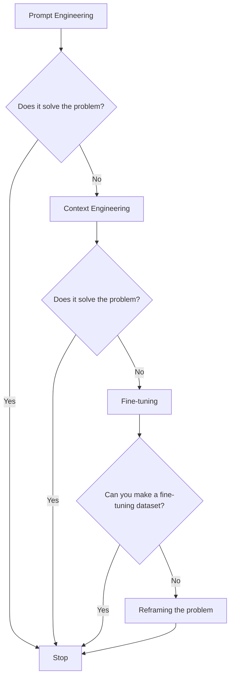
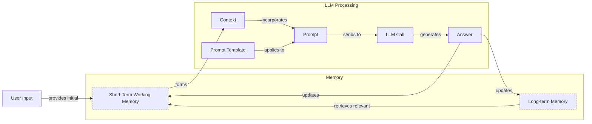
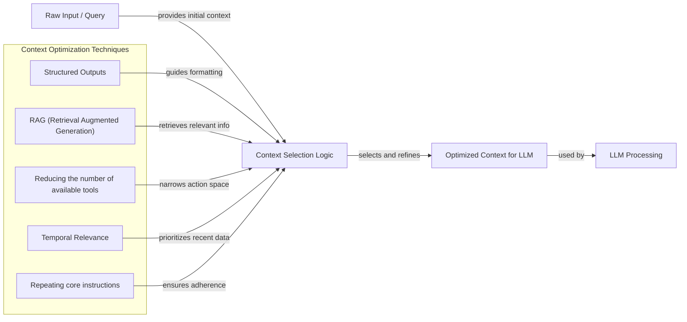
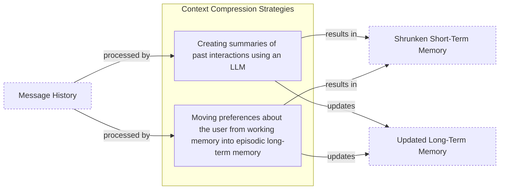
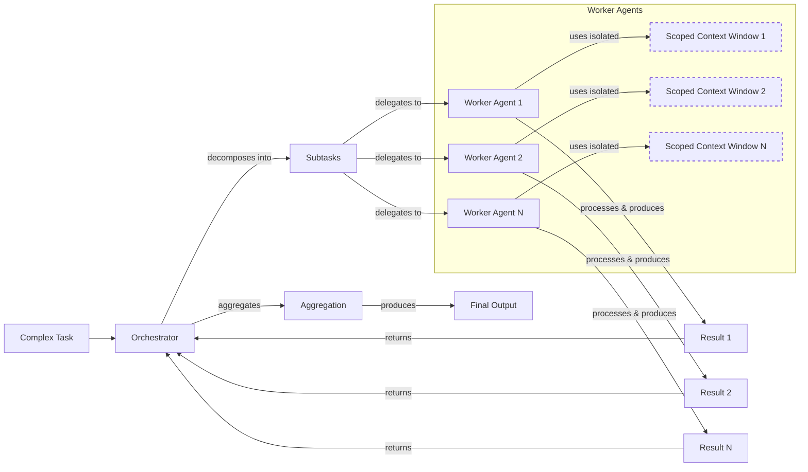

# Lesson 3: Context Engineering

## Section 1 - Introduction: When prompt engineering breaks

AI applications have evolved rapidly. In 2022, we had simple chatbots for question-answering. By 2023, Retrieval-Augmented Generation (RAG) systems connected LLMs to domain-specific knowledge. 2024 brought us agents that could perform actions. Now, we are building memory-enabled agents that remember past interactions and build relationships over time [[1]](https://www.securityindustry.org/2024/07/16/understanding-the-evolution-from-classic-chatbots-to-rag-chatbots-to-ai-powered-assistants/).

In our last lesson, we explored how to choose between AI agents and LLM workflows when designing a system. As these applications grow more complex, prompt engineering, a practice that once served us well, is showing its limits. It optimizes single LLM calls but fails when managing systems with memory, actions, and long interaction histories. The sheer volume of information an agent might need has grown exponentially. This includes past conversations, user data, documents, and action descriptions.

Simply stuffing all this into a prompt is not a viable strategy. This is where context engineering comes in. It is the discipline of orchestrating this entire information ecosystem to ensure the LLM gets exactly what it needs, when it needs it. This skill is becoming a core foundation for AI engineering, representing a shift from crafting individual prompts to architecting an AI’s entire information environment. In this lesson, we will explore why this shift is necessary, what context engineering entails, and the key strategies you need to build reliable and intelligent AI systems.

## Section 2: From prompt to context engineering

Prompt engineering, while effective for simple tasks, is designed for single, stateless interactions. It treats each call to an LLM as a new, isolated event. This approach breaks down in stateful applications where context must be preserved and managed across multiple turns [[2]](https://www.decodingai.com/p/context-engineering-2025s-1-skill).

As a conversation or task progresses, the context grows. Without a strategy to manage this growth, the LLM’s performance degrades. This is context decay: the model gets confused by the noise of an ever-expanding history. It starts to lose track of the original instructions or key information. Research from Microsoft and Salesforce found that model performance drops by an average of 39% when moving from single-turn to multi-turn conversations [[3]](https://redis.io/blog/context-window-overflow/). Studies also show that model correctness can drop significantly once the context exceeds 32,000 tokens, long before advertised limits are reached [[2]](https://www.decodingai.com/p/context-engineering-2025s-1-skill).

Even with large context windows, a physical limit exists for what you can include. The self-attention mechanism in Transformers has a quadratic computational and memory overhead, making long contexts a practical bottleneck [[4]](https://arxiv.org/pdf/2507.13334). Also, on the operational side, every token adds to the cost and latency of an LLM call. Simply putting everything into the context creates a slow, expensive, and underperforming system [[5]](https://www.comet.com/site/blog/context-window/).

We learned this the hard way on a recent project. We were working with a model that supported a two-million-token context window, so we thought, "*What could go wrong?*" We stuffed everything in: our research, guidelines, examples, and user history. The result was an LLM workflow that took 30 minutes to run and produced low-quality outputs.

A shift in approach is necessary. Context engineering addresses these limitations by treating AI applications as systems that operate through dynamic context. As an AI Engineer, your job is to select only the most critical pieces of context for each LLM call. This makes your applications accurate, fast, and cost-effective. We will explore these concepts in more detail in upcoming lessons, including memory in Lesson 9 and RAG in Lesson 10.

## Section 3: Understanding context engineering

Context engineering is about finding the best way to arrange parts of your application's memory into the context that is passed to an LLM. It is a solution to an optimization problem: you must retrieve the right parts of both your short- and long-term memory to solve a specific task without overwhelming the model [[4]](https://arxiv.org/pdf/2507.13334). For example, when you ask a cooking agent for a recipe, you do not give it the entire cookbook. Instead, you retrieve the specific recipe, along with personal context like allergies or taste preferences. This precise selection ensures the model receives only the essential information.

Andrej Karpathy offered a great analogy for this: LLMs are like a new kind of operating system, where the model acts as the CPU and its context window functions as the RAM [[6]](https://www.langchain.com/blog/context-engineering-for-agents/). Just as an operating system manages what fits into RAM, context engineering curates what occupies the model’s working memory. This reframes the task from simple prompting to a form of systems programming. It involves strategies similar to OS memory management, such as paging data from external storage (like vector databases) into the active context window (RAM) to optimize the CPU's (LLM's) performance [[7]](https://atlan.com/know/working-memory-llms/). The context is a subset of the system's total working memory; you can hold information without passing it to the LLM on every turn [[2]](https://www.decodingai.com/p/context-engineering-2025s-1-skill).

How does context engineering relate to prompt engineering? It's simple. Prompt engineering is a subset of context engineering [[2]](https://www.decodingai.com/p/context-engineering-2025s-1-skill). You still write effective prompts, but you also design a system that feeds the right context into those prompts. This means understanding not just *how* to phrase a task, but *what* information the model needs to perform optimally.

| Dimension | Prompt Engineering | Context Engineering |
| --- | --- | --- |
| Scope | Single interaction optimization | Entire information ecosystem |
| State Management | Stateless function | Stateful due to memory |
| Focus | How to phrase tasks | What information to provide |

Table 1: A comparison of prompt engineering and context engineering.

Context engineering is the new fine-tuning. While fine-tuning has its place, it is expensive, time-consuming, and inflexible. Data changes constantly, making fine-tuning a last resort [[8]](https://www.linkedin.com/posts/denis-panjuta_prompt-engineering-vs-context-engineering-activity-7363945251180322816-1q_m). For most enterprise use cases, you get better results faster and more cheaply with context engineering. It allows for rapid iteration and adaptation to evolving data without altering the core model, a key advantage in dynamic environments. This approach avoids the computational resources and specialized expertise required for retraining, offering a more agile path to reliable AI applications [[9]](https://www.mezmo.com/learn-observability/context-engineering-for-observability-how-to-deliver-the-right-data-to-llms).

When you start a new AI project, your decision-making process for guiding the LLM should look like the one presented in Image 1. The workflow prioritizes simpler, more flexible methods first. You begin with prompt engineering because it is the fastest and cheapest way to test an idea. If that fails to produce reliable results, you move to context engineering, which involves building a more sophisticated system but is still far more agile than fine-tuning. Only when both of these approaches prove insufficient, and you can justify the cost and effort of creating a high-quality dataset, should you consider fine-tuning.


Image 1: A flowchart illustrating the decision-making workflow for choosing an AI strategy.

For instance, if you build an agent to process internal Slack messages, you do not need to fine-tune a model on your company’s communication style. It is more effective to use a powerful reasoning model and engineer the context to retrieve specific messages and enable actions like creating tasks or drafting emails. Throughout this course, we will show you how to solve most industry problems using only context engineering.

## Section 4: What makes up the context

To master context engineering, you first need to understand what "context" actually is. It is everything the LLM sees in a single turn, dynamically assembled from various memory components before being passed to the model [[10]](https://www.glean.com/perspectives/context-engineering-vs-prompt-engineering-key-differences-explained).

The high-level workflow, as presented in Image 2, begins when a user input triggers the system to pull relevant information from both long-term and short-term memory. This information is assembled into the final context, inserted into a prompt template, and sent to the LLM. The LLM’s answer then updates the memory, and the cycle repeats.


Image 2: A flowchart illustrating the high-level workflow of how context is built and passed to an LLM, highlighting the cyclical nature and interaction between memory types and the LLM call.

These components are grouped into two main categories. We will explain them intuitively for now, as we have future dedicated lessons for all of them.

### Short-Term Working Memory

Short-term working memory is the state of the agent for the current task or conversation. It is volatile and changes with each interaction, helping the agent maintain a coherent dialogue and make immediate decisions [[11]](https://www.datacamp.com/blog/how-does-llm-memory-work). It can include some or all of these components:

*   **User input:** The most recent query or command from the user. This is the primary trigger for the agent's next action.
*   **Message history:** The log of the current conversation, including both user messages and agent responses. This allows the LLM to understand the flow of the dialogue and refer to previous turns.
*   **Agent's internal thoughts:** The reasoning steps the agent takes to decide on its next action. This is often maintained in a "scratchpad" to track the agent's plan and intermediate conclusions without cluttering the main conversation history [[12]](https://datahub.com/blog/context-window-optimization/).
*   **Action calls and outputs:** The results from any actions the agent has performed. When an agent calls an external tool, the output of that tool is fed back into the context to inform the next step.

### Long-Term Memory

Long-term memory is more persistent and stores information across sessions, allowing the AI system to remember things beyond a single conversation. We divide it into three types, drawing parallels from human memory [[13]](https://www.analyticsvidhya.com/blog/2026/01/how-does-llm-memory-work/). An AI system can include some or all of them:

*   **Procedural memory:** This is knowledge encoded directly in the code and system configuration. It includes the system prompt, which sets the agent's overall behavior, persona, and rules. It also includes the definitions of available actions (tools) and schemas for structured outputs, which guide the format of its responses. Think of this as the agent's built-in skills and instructions [[14]](https://skymod.tech/why-memory-matters-in-llm-agents-short-term-vs-long-term-memory-architectures/).
*   **Episodic memory:** This is memory of specific past experiences, like user preferences or previous interactions. It is used to help the agent personalize its responses based on individual users. We typically store this in vector or graph databases for efficient retrieval [[15]](https://labelstud.io/learningcenter/episodic-vs-persistent-memory-in-llms/). However, creating a persistent record of user interactions introduces significant privacy challenges. Many users expect their conversations to be ephemeral, but long-term memory can be used to build detailed profiles over time, creating a mismatch between user expectations and system behavior [[16]](https://arxiv.org/html/2508.07664v1).
*   **Semantic memory:** This is the agent’s general knowledge base. It can be internal, like company documents stored in a data lake, or external, accessed via the internet through API calls or web scraping. This memory provides the factual information the agent needs to answer questions and is the core of RAG systems [[7]](https://atlan.com/know/working-memory-llms/).

If this seems like a lot, bear with us. We will cover all these concepts in-depth in future lessons, including structured outputs in Lesson 4, actions in Lesson 6, memory in Lesson 9, RAG in Lesson 10, and working with multimodal data in Lesson 11.
Image 3: A detailed illustration of how all the context engineering components work together inside an AI agent (Source [DECODING ML](https://www.decodingml.com/))

The key takeaway is that these components are not static. They are dynamically re-computed for every single interaction. For each conversation turn or new task, the short-term memory grows, or the long-term memory can change. Context engineering involves knowing how to select the right pieces from this vast memory pool to construct the most effective prompt for the task at hand.

## Section 5: Production implementation challenges

Now that we understand what makes up the context, let's look at the core challenges of implementing it in production. These challenges all revolve around a single question: *"How can I keep my context as small as possible while providing enough information to the LLM?"*

Here are four common issues that come up when building AI applications:

1.  **The context window challenge:** Every AI model has a limited context window, the maximum amount of information it can process at once. While models like GPT-4.1 and Gemini 2.5 Pro advertise 1-million-token windows, this space is a finite and expensive resource [[17]](https://atlan.com/know/llm-context-window-limitations/). The self-attention mechanism in Transformers has a quadratic computational and memory overhead, making long contexts slow and costly [[4]](https://arxiv.org/pdf/2507.13334). Furthermore, the Maximum Effective Context Window (MECW), where a model's accuracy actually holds up, is often far smaller than the advertised limit. On complex tasks, the gap between advertised and effective context can be as high as 99% [[17]](https://atlan.com/know/llm-context-window-limitations/).
2.  **Information overload:** Just because you can fit a lot of information into the context does not mean you should. Too much context reduces the performance of the LLM by confusing it. This leads to the "lost-in-the-middle" problem, where models pay more attention to information at the beginning and end of the context, while details in the middle are often ignored [[18]](https://www.linkedin.com/pulse/lost-middle-lesson-failing-ai-agents-backwards-anthony-dejohn-01k2e), [[19]](https://dev.to/thousand_miles_ai/the-lost-in-the-middle-problem-why-llms-ignore-the-middle-of-your-context-window-3al2). A 2025 study by Chroma on 18 frontier models confirmed that this "context rot" causes accuracy to drop by 30% or more for information in mid-window positions [[20]](https://www.trychroma.com/research/context-rot). This degradation is amplified by distractors—semantically similar but irrelevant information—that actively mislead the model [[20]](https://www.trychroma.com/research/context-rot).
3.  **Context drift:** This occurs when conflicting versions of the truth accumulate in the memory over time. For example, the memory might contain two conflicting statements: "*The user's budget is $500*" and later "*The user's budget is $1,000*." This is not Schrodinger's Cat quantum physics experiment; it is a data conflict that confuses the LLM. Without a mechanism to resolve these conflicts, the model's responses become unreliable. This can be caused by changes in user behavior, evolving external data, or outdated information in the knowledge base, leading to a gradual decline in response accuracy and relevance [[21]](https://galileo.ai/blog/production-llm-monitoring-strategies), [[22]](https://www.coforge.com/what-we-know/blog/navigating-the-shifting-sands-understanding-and-mitigating-data-drift-in-llms).
4.  **Tool confusion:** The final challenge is tool confusion, which arises in two main ways. First, adding too many tools to an agent can confuse the LLM about the best one for the job [[2]](https://www.decodingai.com/p/context-engineering-2025s-1-skill). The Gorilla benchmark shows that nearly all models perform worse when given more than one tool [[2]](https://www.decodingai.com/p/context-engineering-2025s-1-skill). Second, confusion can occur when tool descriptions are poorly written or overlap. If the distinctions between actions are unclear, even a human would struggle to choose the right one [[23]](https://www.instinctools.com/blog/context-engineering/).

## Section 6: Key strategies for context optimization

Initially, most AI applications were chatbots over single knowledge bases. Today, modern AI solutions must manage multiple knowledge bases, tools, and complex conversational histories. Context engineering is all about managing this complexity while meeting performance, latency, and cost requirements.

Here are four popular context engineering strategies used across the industry.

### Selecting the right context

Retrieving the right information from memory is a critical first step. A common mistake is to provide everything at once, assuming that models with large context windows can handle it. As we have discussed, the "lost-in-the-middle" problem often leads to poor performance, increased latency, and higher costs [[17]](https://atlan.com/know/llm-context-window-limitations/).

To solve this, consider these approaches:
*   **Use structured outputs:** Define clear schemas for what the LLM should return. This allows you to pass only the necessary, structured information to downstream steps. We will cover this in detail in Lesson 4.
*   **Use RAG:** Instead of providing entire documents, use RAG to fetch only the specific chunks of text needed to answer a user's question. Techniques like re-ranking can further refine the retrieved context to ensure the most relevant information is prioritized. This is a core topic we will explore in Lesson 10.
*   **Reduce the number of available actions:** Rather than giving an agent access to every available action, use various strategies to delegate action subsets to specialized components. The Gorilla benchmark demonstrated that model performance degrades when more than one tool is provided, highlighting the need for focused toolsets [[2]](https://www.decodingai.com/p/context-engineering-2025s-1-skill).
*   **Rank time-sensitive data:** For time-sensitive information, rank it by date and filter out anything no longer relevant. This is a form of temporal ranking that ensures the context is current and prevents the model from acting on outdated information [[24]](https://www.dailydoseofds.com/llmops-crash-course-part-8/).
*   **Repeat core instructions:** For the most important instructions, repeat them at both the start and the end of the prompt. This uses the model's tendency to pay more attention to the context edges, ensuring core instructions are not lost [[25]](https://promptmetheus.com/resources/llm-knowledge-base/lost-in-the-middle-effect).


Image 4: A flowchart illustrating how various context optimization techniques work together to select the right context for an LLM.

### Context compression

As message history grows in short-term working memory, you must manage past interactions to keep your context window in check. You cannot simply drop past conversation turns, as the LLM still needs to remember what happened. Instead, you need ways to compress key facts from the past.

**Creating summaries of past interactions** is a common approach. You can use an LLM to replace a long, detailed history with a concise overview. A 2025 study by JetBrains Research compared this approach to "observation masking" (hiding older tool outputs) and found that both cut costs by over 50% compared to unmanaged context growth, though summarization can sometimes lead to longer task completion times [[26]](https://blog.jetbrains.com/research/2025/12/efficient-context-management/).

Another strategy is **moving user preferences to long-term memory**. This involves transferring user preferences from working memory to long-term episodic memory, keeping the working context clean while ensuring preferences are remembered for future sessions [[24]](https://www.dailydoseofds.com/llmops-crash-course-part-8/).

Finally, **deduplication** helps to avoid repetition by removing redundant information from the context. This can be done using techniques like semantic deduplication, which clusters similar chunks of information and selects a single representative, reducing token usage by 50-80% while preserving accuracy [[27]](https://oneuptime.com/blog/post/2026-01-30-context-compression/view).


Image 5: A flowchart illustrating context compression strategies for managing message history in short-term working memory.

### Isolating Context

Another powerful strategy is to isolate context by splitting information across multiple agents or LLM workflows. This technique is similar to tool isolation but is more general, referring to the whole context. The key idea is that instead of one agent with a massive, cluttered context window, you can have a team of agents, each with a smaller, focused context [[6]](https://www.langchain.com/blog/context-engineering-for-agents/).

We often implement this using an orchestrator-worker pattern, where a central orchestrator agent breaks down a problem and assigns sub-tasks to specialized worker agents [[28]](https://beam.ai/agentic-insights/multi-agent-orchestration-patterns-production). Each worker operates in its own isolated context, improving focus and allowing for parallel processing. However, this pattern has its own failure modes; for instance, the orchestrator can become a bottleneck and its own context window can overflow as it accumulates results from multiple workers [[28]](https://beam.ai/agentic-insights/multi-agent-orchestration-patterns-production). We will cover this pattern in more detail in Lesson 5.


Image 6: A flowchart illustrating how context isolation can be achieved using the orchestrator-worker pattern.

### Format Optimization

The way you format the context matters. Models are sensitive to structure, and using clear delimiters can improve performance. A common strategy is to use XML tags to wrap different pieces of context (e.g., `<user_query>`, `<documents>`) [[29]](https://www.anthropic.com/engineering/effective-context-engineering-for-ai-agents). This helps the model distinguish between different types of information. Also, when providing structured data as input, YAML is often more token-efficient than JSON, which helps save space in your context window [[2]](https://www.decodingai.com/p/context-engineering-2025s-1-skill).

The way you format the context also has a direct impact on inference latency and cost due to the Key-Value (KV) cache. The KV cache stores intermediate calculations for tokens that have already been processed, so they do not need to be recomputed. To maximize cache hits, you should structure your context by ordering its components from most stable to most volatile. The system prompt and action schemas, which rarely change, should come first, while the most recent user input or observation should come last. This ensures that only the newest, most volatile information invalidates a small part of the cache.

You always have to understand what is passed to the LLM. Seeing exactly what occupies your context window at every step is key to mastering context engineering. Usually, this is done by properly monitoring your traces, tracking what happens at each step, and understanding the inputs and outputs [[30]](https://www.getmaxim.ai/articles/context-window-management-strategies-for-long-context-ai-agents-and-chatbots/). As this is a significant step to go from prototype to production, we will have dedicated lessons on this.

## Section 7: Here is an example

Let's connect the theory and strategies with concrete examples. Consider several common real-world scenarios:

*   **Healthcare:** An AI assistant accesses a patient's medical history, current symptoms, and the latest medical literature to provide personalized diagnostic support [[31]](https://www.decodingai.com/p/context-engineering-2025s-1-skill). This requires careful management of sensitive data types like electronic health records and adherence to privacy regulations like HIPAA. The system must be able to distinguish between a user's stated preferences and their documented medical history, resolving conflicts to ensure safety [[32]](https://www.mdpi.com/2079-9292/13/15/2961).
*   **Financial Services:** AI systems integrate with enterprise tools like Customer Relationship Management (CRM) systems and calendars, combining real-time market data and client portfolio information to generate tailored financial advice [[31]](https://www.decodingai.com/p/context-engineering-2025s-1-skill). This involves handling structured financial data, ensuring compliance with financial regulations, and maintaining an audit trail of the context used for each recommendation.
*   **Project Management:** AI systems access enterprise tools like CRMs, Slack, and task managers to automatically understand project requirements and update tasks. This requires maintaining state across multiple platforms and APIs, and being able to parse unstructured conversations to extract structured task information [[33]](https://sombrainc.com/blog/ai-context-engineering-guide).
*   **Content Creator Assistant:** An AI agent uses your research, past content, and personality traits to understand what and how to create a given piece of content. This involves managing a diverse and evolving knowledge base of personal style guides, factual information, and audience feedback.

Let's walk through a specific query to see context engineering in action with the healthcare assistant scenario. A user asks: `I have a headache. What can I do to stop it? I would prefer not to take any medicine.`

Before the AI attempts to answer, a context engineering system performs several steps:
1.  It retrieves the user's patient history, known allergies, and lifestyle habits from episodic memory.
2.  It queries a medical database for non-pharmacological headache remedies from semantic memory.
3.  It assembles the key units of information from both memory types into the final context.
4.  It formats this information into a structured prompt and calls the LLM.
5.  Finally, it presents a personalized, context-aware answer to the user.

Here is a simplified Python example showing how you might structure the context and prompt for the LLM, using XML tags and YAML for formatting.

1.  First, we define the user's query.
    ```python
    import yaml
    
    user_query = "I have a headache. What can I do to stop it? I would prefer not to take any medicine."
    ```
2.  Next, we define the patient's history, which would typically be retrieved from episodic memory.
    ```python
    patient_history = {
        "patient": {
            "name": "John Doe",
            "age": 45,
            "conditions": ["mild_hypertension"],
            "allergies": [],
            "preferences": {
                "medication_avoidance": True,
                "preferred_treatments": "natural_remedies"
            },
            "habits": {
                "stress_level": "high",
                "caffeine_intake": "3-4_cups_daily"
            }
        }
    }
    ```
3.  Then, we include relevant medical literature, retrieved from semantic memory.
    ```python
    medical_literature = {
        "articles": [
            {"topic": "dehydration_headaches", "finding": "Dehydration is a common cause of tension headaches.", "treatment": "Rehydration can alleviate symptoms within 30 minutes to three hours."},
            {"topic": "cold_compress", "finding": "Applying a cold compress can constrict blood vessels and reduce inflammation.", "treatment": "Helps relieve migraine pain."},
            {"topic": "caffeine_withdrawal", "finding": "Caffeine withdrawal can trigger headaches.", "treatment": "A small amount may alleviate withdrawal headaches for regular consumers."},
            {"topic": "stress_relief", "finding": "Stress-relief techniques are effective for tension headaches.", "treatment": "Deep breathing or short walks can help."}
        ]
    }
    ```
4.  Finally, we assemble the complete prompt. Notice how we format the patient history and medical literature as YAML instead of JSON for token efficiency.
    ```python
    prompt = f"""
    <system_prompt>
    You are a helpful and cautious AI healthcare assistant. Your goal is to provide safe, non-medicinal advice. Do not provide medical diagnoses.
    1. Analyze the user's query and the provided context.
    2. Use the patient history to understand their health profile and preferences.
    3. Use the retrieved medical knowledge to form your recommendation.
    4. If you lack sufficient information, ask clarifying questions.
    5. Always prioritize safety and advise consulting a doctor for serious issues.
    </system_prompt>
    
    <patient_history>
    {yaml.dump(patient_history)}
    </patient_history>
    
    <medical_knowledge>
    {yaml.dump(medical_literature)}
    </medical_knowledge>
    
    <user_query>
    {user_query}
    </user_query>
    
    Based on all the information above, provide a helpful response.
    """
    ```

To build such a system, you need a robust tech stack. Here is a potential stack we recommend and will use throughout this course:
*   **LLM:** Gemini for its multimodal, reasoning, and cost-effective capabilities.
*   **Orchestration:** LangGraph for defining stateful, agentic workflows. It provides fine-grained control over the agent's state and allows for the implementation of complex context management strategies like summarization and scratchpads [[6]](https://www.langchain.com/blog/context-engineering-for-agents/).
*   **Databases:** PostgreSQL, Qdrant, or Neo4j. It is often effective to keep it simple, as you can achieve much with only PostgreSQL for both relational and vector storage.
*   **Observability:** Opik or LangSmith for evaluation and trace monitoring. These tools are essential for debugging context-related issues by allowing you to inspect what is in the context window at each step of your agent's execution [[5]](https://www.comet.com/site/blog/context-window/).

### Production Code Example: LangGraph vs. Naive Approach

Let's look at a practical code example comparing a naive context management approach with a more robust one using LangGraph. A common failure mode in conversational agents is exceeding the context window. A naive implementation might simply append every message to a list, which quickly leads to errors.

A better approach is to use a summarization strategy. Here is how you could implement this using LangGraph, a popular library for building stateful, multi-actor applications with LLMs.

1.  First, a naive approach that will fail. We define a simple function that appends messages to a list and calls the model. After a few turns, this will exceed the context limit.
    ```python
    # Naive approach (will fail with long conversations)
    from langchain_openai import ChatOpenAI
    
    model = ChatOpenAI(model="gpt-4o")
    messages = []
    
    while True:
        user_input = input("User: ")
        if user_input.lower() == "exit":
            break
        messages.append(("user", user_input))
        response = model.invoke(messages)
        messages.append(("ai", response.content))
        print(f"AI: {response.content}")
    
    ```
2.  Now, a more robust approach using LangGraph. We define a state graph that includes a summarization step. When the conversation gets too long, a separate LLM call summarizes the history, keeping the main context window lean.
    ```python
    # Robust approach with LangGraph
    from langgraph.graph import StateGraph, END
    from langgraph.checkpoint.sqlite import SqliteSaver
    from langchain_core.messages import SystemMessage, AIMessage
    
    # Define the state
    class AgentState(dict):
        messages: list
    
    # Define the summarization logic
    def summarize_if_needed(state):
        # Simple heuristic: summarize if more than 10 messages
        if len(state['messages']) > 10:
            summarizer = ChatOpenAI(model="gpt-3.5-turbo")
            summary_prompt = "Summarize the following conversation..."
            summary = summarizer.invoke([SystemMessage(content=summary_prompt)] + state['messages']).content
            # Keep system message, summary, and last 4 messages
            new_messages = state['messages'][:1] + [AIMessage(content=f"Summary: {summary}")] + state['messages'][-4:]
            return {"messages": new_messages}
        return state
    
    # Define the graph
    builder = StateGraph(AgentState)
    # ... (add nodes for chat logic)
    builder.add_node("summarize", summarize_if_needed)
    builder.add_conditional_edge("chat_node", lambda s: "summarize" if len(s['messages']) > 10 else END)
    builder.add_edge("summarize", "chat_node")
    
    # ... (compile and run the graph)
    ```
This LangGraph example demonstrates a concrete context engineering pattern—compression—using a real-world library. It is more resilient than the naive approach because it explicitly manages the size of the short-term memory, preventing context overflow and ensuring the agent can handle long-running conversations.

## Section 8 - Conclusion - Wrap-up: Connecting context engineering to AI engineering

Developing the intuition to craft effective prompts, select the right information from memory, and arrange context for optimal results is a key part of AI engineering. This discipline helps you determine the minimal yet essential information an LLM needs to perform at its best.

It is important to understand that context engineering cannot be learned in isolation. It is a complex field that combines:

1.  **AI Engineering:** This is the foundation. You need to understand LLMs, RAG, and AI agents to know what is possible. This includes implementing practical solutions like LLM workflows and evaluation pipelines to measure and improve performance.
2.  **Software Engineering (SWE):** You need to build your AI product with code that is not just functional, but also scalable and maintainable. This means designing robust architectures, writing clean code, and creating APIs that can grow with your product's needs. Context engineering is an engineering problem that requires building data pipelines and designing backend systems [[33]](https://sombrainc.com/blog/ai-context-engineering-guide).
3.  **Data Engineering:** Constructing reliable data pipelines for RAG and other memory systems is critical. This involves creating processes to filter, shape, and enrich data before it ever reaches the LLM, ensuring the context is clean and relevant [[34]](https://www.mezmo.com/learn-observability/context-engineering-for-observability-how-to-deliver-the-right-data-to-llms).
4.  **Operations (Ops):** Deploying agents on the proper infrastructure ensures they are reproducible, maintainable, observable, and scalable. This includes automating processes with CI/CD pipelines and monitoring for issues like context drift in production. The discipline of ContextOps is emerging to apply DevOps principles to the governance of AI context [[35]](https://packmind.com/context-engineering-ai-coding/what-is-contextops/).

Our goal with this course is to teach you how to combine these skills to build production-ready AI products. In the world of AI, we should all think in systems rather than isolated components, having a mindset shift from developers to architects.

In the next lesson, we will explore structured outputs, a key technique for making LLM responses reliable and machine-readable. We will also revisit context engineering principles when we cover actions in Lesson 6, memory in Lesson 9, and RAG in Lesson 10.

## References

- [1]  [Understanding the Evolution From Classic Chatbots to RAG Chatbots to AI-Powered Assistants](https://www.securityindustry.org/2024/07/16/understanding-the-evolution-from-classic-chatbots-to-rag-chatbots-to-ai-powered-assistants/)
- [2]  [Context Engineering: 2025’s #1 Skill in AI](https://www.decodingai.com/p/context-engineering-2025s-1-skill)
- [3]  [Context Window Overflow in LLM Applications](https://redis.io/blog/context-window-overflow/)
- [4]  [A Survey of Context Engineering for Large Language Models](https://arxiv.org/pdf/2507.13334)
- [5]  [Context Window: What It Is and Why It Matters for AI Agents](https://www.comet.com/site/blog/context-window/)
- [6]  [Context Engineering for Agents](https://blog.langchain.com/context-engineering-for-agents/)
- [7]  [Working Memory in LLMs](https://atlan.com/know/working-memory-llms/)
- [8]  [Prompt Engineering vs. Context Engineering](https://www.linkedin.com/posts/denis-panjuta_prompt-engineering-vs-context-engineering-activity-7363945251180322816-1q_m)
- [9]  [Context Engineering for Observability: How to Deliver the Right Data to LLMs](https://www.mezmo.com/learn-observability/context-engineering-for-observability-how-to-deliver-the-right-data-to-llms)
- [10]  [Context Engineering vs. Prompt Engineering: Key Differences Explained](https://www.glean.com/perspectives/context-engineering-vs-prompt-engineering-key-differences-explained)
- [11]  [How does LLM Memory Work?](https://www.datacamp.com/blog/how-does-llm-memory-work)
- [12]  [Context Window Optimization for LLM Applications](https://datahub.com/blog/context-window-optimization/)
- [13]  [How Does LLM Memory Work?](https://www.analyticsvidhya.com/blog/2026/01/how-does-llm-memory-work/)
- [14]  [Why Memory Matters in LLM Agents: Short-Term vs Long-Term Memory Architectures](https://skymod.tech/why-memory-matters-in-llm-agents-short-term-vs-long-term-memory-architectures/)
- [15]  [Episodic vs. Persistent Memory in LLMs](https://labelstud.io/learningcenter/episodic-vs-persistent-memory-in-llms/)
- [16]  [Memory in Large Language Models](https://arxiv.org/html/2508.07664v1)
- [17]  [LLM Context Window Limitations: Impacts, Risks, & Fixes in 2026](https://atlan.com/know/llm-context-window-limitations/)
- [18]  [Lost in the Middle: A Lesson in Failing AI Agents Backwards](https://www.linkedin.com/pulse/lost-middle-lesson-failing-ai-agents-backwards-anthony-dejohn-01k2e)
- [19]  [The "Lost in the Middle" Problem: Why LLMs Ignore the Middle of Your Context Window](https://dev.to/thousand_miles_ai/the-lost-in-the-middle-problem-why-llms-ignore-the-middle-of-your-context-window-3al2)
- [20]  [Context Rot: How Increasing Input Tokens Impacts LLM Performance](https://www.trychroma.com/research/context-rot)
- [21]  [Production LLM monitoring strategies](https://galileo.ai/blog/production-llm-monitoring-strategies)
- [22]  [Navigating the Shifting Sands: Understanding and Mitigating Data Drift in LLMs](https://www.coforge.com/what-we-know/blog/navigating-the-shifting-sands-understanding-and-mitigating-data-drift-in-llms)
- [23]  [Context Engineering](https://www.instinctools.com/blog/context-engineering/)
- [24]  [LLMOps Crash Course Part 8](https://www.dailydoseofds.com/llmops-crash-course-part-8/)
- [25]  [Lost-in-the-Middle Effect](https://promptmetheus.com/resources/llm-knowledge-base/lost-in-the-middle-effect)
- [26]  [Efficient Context Management for LLM-Powered Agents](https://blog.jetbrains.com/research/2025/12/efficient-context-management/)
- [27]  [Context Compression](https://oneuptime.com/blog/post/2026-01-30-context-compression/view)
- [28]  [6 Multi-Agent Orchestration Patterns That Actually Work in Production](https://beam.ai/agentic-insights/multi-agent-orchestration-patterns-production)
- [29]  [Effective Context Engineering for AI Agents](https://www.anthropic.com/engineering/effective-context-engineering-for-ai-agents)
- [30]  [Context Window Management Strategies for Long-Context AI Agents and Chatbots](https://www.getmaxim.ai/articles/context-window-management-strategies-for-long-context-ai-agents-and-chatbots/)
- [31]  [Context Engineering: 2025’s #1 Skill in AI](https://www.decodingai.com/p/context-engineering-2025s-1-skill)
- [32]  [Prompt Engineering in Healthcare](https://www.mdpi.com/2079-9292/13/15/2961)
- [33]  [AI Context Engineering Guide](https://sombrainc.com/blog/ai-context-engineering-guide)
- [34]  [Context Engineering for Observability: How to Deliver the Right Data to LLMs](https://www.mezmo.com/learn-observability/context-engineering-for-observability-how-to-deliver-the-right-data-to-llms)
- [35]  [Why AI coding assistants fail without context : an introduction to ContextOps](https://packmind.com/context-engineering-ai-coding/what-is-contextops/)