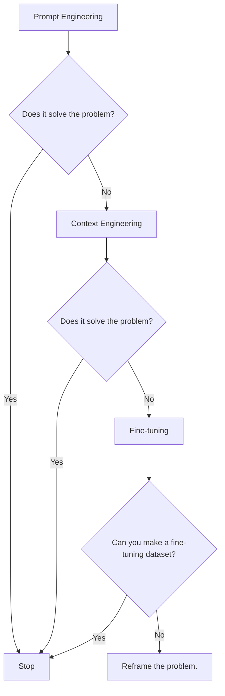
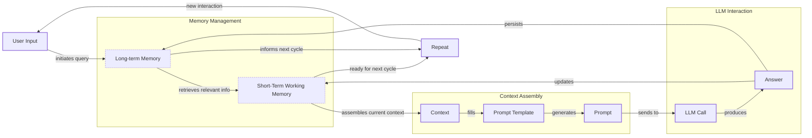
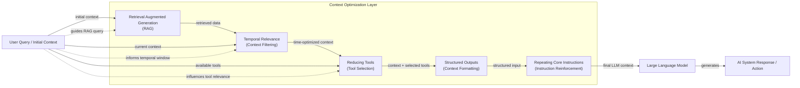
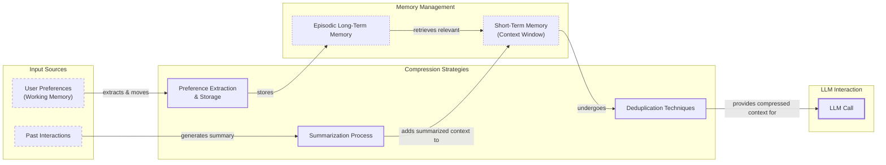
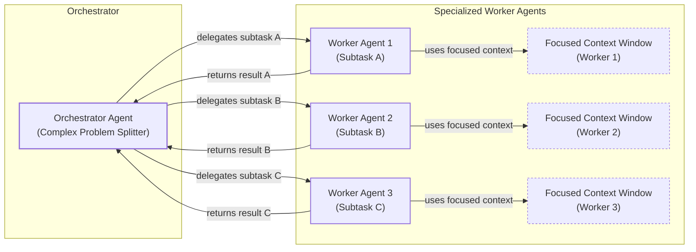

# Context Engineering: 2025’s #1 Skill in AI

## When prompt engineering breaks

AI applications have evolved rapidly. In 2022, we had simple chatbots for question-and-answering. By 2023, Retrieval-Augmented Generation (RAG) systems connected LLMs to domain-specific knowledge. 2024 brought us tool-using agents that could perform actions. Now, we are building memory-enabled agents that remember past interactions and build relationships over time [[26]](https://www.securityindustry.org/2024/07/16/understanding-the-evolution-from-classic-chatbots-to-rag-chatbots-to-ai-powered-assistants/).

In our last lesson, we explored how to choose between AI agents and LLM workflows when designing a system. As these applications grow more complex, prompt engineering, a practice that once served us well, is showing its limits. It optimizes single LLM calls but fails when managing systems with memory, actions, and long interaction histories. The sheer volume of information an agent might need has grown exponentially. This includes past conversations, user data, documents, and action descriptions.

Simply stuffing all this into a prompt is not a viable strategy. A new discipline, context engineering, orchestrates this entire information ecosystem to ensure the LLM gets exactly what it needs, when it needs it. This skill is becoming a core foundation for AI engineering, moving beyond simple prompts to architecting the flow of information that makes AI truly intelligent. It is the key to building successful AI agents and LLM workflows that manage both short-term and long-term memory to achieve the best possible performance.

## From Prompt to Context Engineering

Prompt engineering, while effective for simple tasks, is designed for single, stateless interactions. It treats each call to an LLM as a new, isolated event. This approach breaks down in stateful applications where context must be preserved and managed across multiple turns [[1]](https://blog.langchain.com/context-engineering-for-agents/).

As a conversation or task progresses, the context grows. Without a strategy to manage this growth, the LLM’s performance degrades. This is context decay: the model gets confused by the noise of an ever-expanding history and starts to lose track of the original instructions. Studies have found that model correctness can drop significantly once the context exceeds 32,000 tokens, long before advertised limits are reached [[2]](https://www.decodingai.com/p/context-engineering-2025s-1-skill).

The context window itself presents a fundamental challenge. Even with models advertising massive token limits, this space is finite. Practical implications are significant, as every piece of information, from system instructions to tool outputs, competes for this limited space. This forces careful design choices about what to include and what to leave out, directly impacting an application's ability to handle complex, multi-step tasks. Scaling becomes an issue as workflows that perform well with small contexts may fail unpredictably when real-world data pushes them closer to the limit.

Furthermore, on the operational side, every token adds to the cost and latency of an LLM call. Simply putting everything into the context creates a slow, expensive, and underperforming system [[3]](https://www.comet.com/site/blog/context-window/). We will explore these concepts in more detail in upcoming lessons, including memory in Lesson 9 and RAG in Lesson 10.

On a recent project, we learned this the hard way. We were working with a model that supported a million-token context window, so we thought, "*What could go wrong*?" We stuffed everything in: our research, guidelines, examples, and user history. The result was an LLM workflow that took 30 minutes to run and produced low-quality outputs [[2]](https://www.decodingai.com/p/context-engineering-2025s-1-skill).

This failure highlights the need for context engineering. It shifts the focus from crafting static prompts to building dynamic systems that manage information flow. As an AI engineer, your job is to select only the most critical pieces of context for each LLM call, making your applications accurate, fast, and cost-effective.

## Understanding Context Engineering

Context engineering is about finding the best way to arrange parts of your application's memory into the context that is passed to an LLM to get the best results. It is a solution to an optimization problem where you retrieve the right parts from your short-term and long-term memory to solve a specific task without overwhelming the model [[4]](https://arxiv.org/pdf/2507.13334). This formal approach moves beyond simple prompt design to the systematic optimization of the entire information payload. For example, when you ask a cooking agent for a recipe, you do not give it the entire cookbook. Instead, you retrieve the specific recipe, along with personal context like allergies or taste preferences.

Andrej Karpathy offered a great analogy for this: LLMs are a new kind of operating system, where the model is the CPU and its context window is the RAM. Just as an operating system manages what fits into RAM, context engineering curates what occupies the model’s working memory [[1]](https://blog.langchain.com/context-engineering-for-agents/). This analogy is powerful because it reframes the task from simply writing instructions to managing a finite, critical resource. It highlights the need for an engineering discipline to handle information logistics, such as loading the right data, managing memory, and ensuring the "CPU" has what it needs to perform efficiently.

How does context engineering relate to prompt engineering? Prompt engineering is a subset of context engineering. You still write effective prompts, but you also design a system that feeds the right context into those prompts [[2]](https://www.decodingai.com/p/context-engineering-2025s-1-skill). This means understanding not just *how* to phrase a task, but *what* information the model needs to perform optimally. The focus shifts from a single interaction to architecting the entire information ecosystem that supports the AI's operation over time.

| Dimension | Prompt Engineering | Context Engineering |
| --- | --- | --- |
| Scope | Single interaction optimization | Entire information ecosystem |
| State Management | Stateless function | Stateful due to memory |
| Focus | How to phrase tasks | What information to provide |

Table 1: A comparison of prompt engineering and context engineering.

Context engineering is the new fine-tuning. While fine-tuning has its place, it is expensive, time-consuming, and inflexible, especially when data changes constantly. For most enterprise use cases, you get better results faster and more cheaply with context engineering, making fine-tuning a last resort [[5]](https://www.linkedin.com/posts/denis-panjuta_prompt-engineering-vs-context-engineering-activity-7363945251180322816-1q_m). It allows for rapid iteration and adaptation without altering the core model, which is a significant advantage in dynamic environments where business requirements and data sources are constantly evolving.

When you start a new AI project, your decision-making process for guiding the LLM should look like the one presented in Image 1. You start with prompt engineering. If that fails, you move to context engineering. Only if that also fails and you can create a quality dataset should you consider fine-tuning. This workflow prioritizes flexibility and cost-effectiveness, ensuring you exhaust more agile methods before committing to the resource-intensive process of retraining a model.


Image 1: A flowchart illustrating the decision-making workflow for choosing a key strategy when starting a new AI project.

For instance, if you build an agent to process internal Slack messages, you do not need to fine-tune a model on your company’s communication style. It is more effective to use a powerful reasoning model and engineer the context to retrieve specific messages and enable actions like creating tasks or drafting emails [[6]](https://www.mezmo.com/learn-observability/context-engineering-for-observability-how-to-deliver-the-right-data-to-llms). Throughout this course, we will show you how to solve most industry problems using only context engineering.

## What Makes Up the Context

To master context engineering, you first need to understand what "context" actually is. It is everything the LLM sees in a single turn, dynamically assembled from various memory components before being passed to the model [[1]](https://blog.langchain.com/context-engineering-for-agents/).

The high-level workflow, as presented in Image 2, begins when a user input triggers the system to pull relevant information from both long-term and short-term memory. This information is assembled into the final context, inserted into a prompt template, and sent to the LLM. The LLM’s answer then updates the memory, and the cycle repeats.


Image 2: A flowchart illustrating the high-level workflow of how context is built and used in an LLM application, including memory updates and a loop for subsequent interactions.

These components are grouped into two main categories. We will explain them intuitively for now, as we have future dedicated lessons for all of them.

### Short-Term Working Memory

Short-term working memory is the state of the agent for the current task or conversation. It is volatile and changes with each interaction, helping the agent maintain a coherent dialogue and make immediate decisions. It can include some or all of these components [[7]](https://www.analyticsvidhya.com/blog/2026/01/how-does-llm-memory-work/):

The **user input** is the most recent query or command from the user. It sets the immediate task and is the primary trigger for the agent's response. How this input is integrated into the existing context is a key aspect of context engineering, as it must be balanced with other information.

**Message history** is the log of the current conversation, which allows the LLM to understand the flow and previous turns. This is crucial for maintaining conversational coherence and preventing the agent from asking repetitive questions or losing track of the user's goals.

An agent's **internal thoughts** are the reasoning steps it takes to decide on its next action. This is often called a scratchpad and provides a trace of the agent's decision-making process, which is invaluable for debugging and understanding why an agent behaved in a certain way.

Finally, **action calls and outputs** are the results from any actions the agent has performed. This includes details of the tool execution and the information returned from external systems like APIs or databases, which then becomes part of the context for the next step.

### Long-Term Memory

Long-term memory is more persistent and stores information across sessions, allowing the AI system to remember things beyond a single conversation. We divide it into three types, drawing parallels from human memory [[8]](https://www.datacamp.com/blog/how-does-llm-memory-work). An AI system can include some or all of them:

**Procedural memory** is knowledge encoded directly in the code. It includes the system prompt, which sets the agent's overall behavior and persona. It also includes the definitions of available actions and schemas for structured outputs, which guide the format of its responses. This type of memory dictates how the agent should behave and what it is capable of doing.

**Episodic memory** is the memory of specific past experiences, like user preferences or previous interactions. It is used to help the agent personalize its responses based on individual users. We typically store this in vector or graph databases for efficient retrieval, allowing the agent to recall details like a user's name, past purchases, or stated preferences to create a more tailored experience [[2]](https://www.decodingai.com/p/context-engineering-2025s-1-skill).

**Semantic memory** is the agent’s general knowledge base. It can be internal, like company documents stored in a data lake, or external, accessed via the internet through API calls. This memory provides the factual, objective information the agent needs to answer questions accurately and ground its responses in reliable data.

If this seems like a lot, bear with us. We will cover all these concepts in-depth in future lessons, including structured outputs (Lesson 4), actions (Lesson 6), memory (Lesson 9), RAG (Lesson 10), and working with multimodal data (Lesson 11).
Image 3: A detailed illustration of how all the context engineering components work together inside an AI agent. (Source [Decoding AI Magazine [[2]](https://www.decodingai.com/p/context-engineering-2025s-1-skill)])

The key takeaway is that these components are not static. They are dynamically re-computed for every single interaction. For each conversation turn or new task, the short-term memory grows, or the long-term memory can change. Context engineering involves knowing how to select the right pieces from this vast memory pool to construct the most effective prompt for the task at hand.

## Production Implementation Challenges

Now that we understand what makes up the context, let's look at the core challenges of implementing it in production. These challenges all revolve around a single question: *"How can I keep my context as small as possible while providing enough information to the LLM?"* [[2]](https://www.decodingai.com/p/context-engineering-2025s-1-skill)

A primary issue is **the context window challenge**. Every AI model has a limited context window, the maximum amount of information (tokens) it can process at once. This is similar to your computer's RAM; if you have only 32GB of RAM on your machine, that is all you can use at one time. While context windows are getting larger, they are not infinite. Treating them as such leads to other problems like increased cost and latency, as processing more tokens takes more time and money. For example, models like GPT-4.1 and Claude 4.5 have large windows, but using them to their full capacity can be prohibitively expensive for many applications [[3]](https://www.comet.com/site/blog/context-window/).

This leads to **information overload**, also known as the "lost-in-the-middle" or "needle in a haystack" problem. Too much context reduces the performance of the LLM by confusing it. Research consistently shows that LLMs remember information best at the beginning and end of the context window, while information in the middle is often overlooked. Performance can drop significantly long before the physical context limit is reached, as the model struggles to distinguish signal from noise in a crowded context [[9]](https://www.linkedin.com/pulse/lost-middle-lesson-failing-ai-agents-backwards-anthony-dejohn-01k2e).

Another subtle issue is **context drift**, where conflicting versions of the truth accumulate in the memory over time. For example, the memory might contain two conflicting statements: "*My cat is white*" and later "*My cat is black*." This is not a quantum physics experiment; it is a data conflict that confuses the LLM and makes its knowledge base unreliable. Without a mechanism to resolve or prune outdated facts, the agent's responses can become inconsistent and factually incorrect [[10]](https://galileo.ai/blog/production-llm-monitoring-strategies).

Finally, there is **tool confusion**. This arises in two main ways. First, adding too many actions to an agent can confuse the LLM about the best one for the job. The Gorilla benchmark, for instance, shows that nearly all models perform worse when given more than one tool [[2]](https://www.decodingai.com/p/context-engineering-2025s-1-skill). Second, confusion can occur when tool descriptions are poorly written or overlap. If the distinctions between actions are unclear, even a human would struggle to choose the right one, leading to failed tasks and inefficient workflows.

## Key Strategies for Context Optimization

Initially, most AI applications were chatbots over single knowledge bases. Today, modern AI solutions must manage multiple knowledge bases, tools, and complex conversational histories. Context engineering is about managing this complexity while meeting performance, latency, and cost requirements.

Here are four popular context engineering strategies used across the industry.

### Selecting the Right Context

Retrieving the right information from memory is a critical first step. A common mistake is to provide everything at once, assuming that models with large context windows can handle it. As we've discussed, the "lost-in-the-middle" problem often leads to poor performance, increased latency, and higher costs [[11]](https://atlan.com/know/llm-context-window-limitations/).

To solve this, you should **use structured outputs** to define clear schemas for what the LLM should return. This allows you to pass only the necessary, structured information to downstream steps, reducing noise and improving efficiency. We will cover this in detail in Lesson 4.

Another key strategy is to **use RAG** to fetch only the specific chunks of text needed to answer a user's question, rather than providing entire documents. This is a core topic we will explore in Lesson 10.

You should also **reduce the number of available actions** to avoid confusing the LLM. Instead of giving an agent access to every available action, use strategies like RAG-based tool selection to delegate action subsets to specialized components. Studies show that this can significantly improve an agent's selection accuracy [[1]](https://blog.langchain.com/context-engineering-for-agents/).

For time-sensitive information, **rank it by date** and filter out anything no longer relevant. This ensures the context is fresh and pertinent to the current task [[12]](https://www.dailydoseofds.com/llmops-crash-course-part-8/).

Finally, for the most important instructions, **repeat them at both the start and the end of the prompt**. This leverages the model's tendency to pay more attention to the context edges, ensuring core instructions are not lost [[13]](https://promptmetheus.com/resources/llm-knowledge-base/lost-in-the-middle-effect).


Image 4: A Mermaid diagram illustrating how various context selection techniques are combined and orchestrated within an AI system for context optimization.

### Context Compression

As message history grows in short-term working memory, you must manage past interactions to keep your context window in check. You cannot simply drop past conversation turns, as the LLM still needs to remember what happened. Instead, you need ways to compress key facts from the past [[14]](https://oneuptime.com/blog/post/2026-01-30-context-compression/view).

One approach is to **create summaries of past interactions** using an LLM to replace a long, detailed history with a concise overview. Another is to **move user preferences to long-term memory**, transferring them from working memory to episodic memory to keep the working context clean. Finally, **deduplication** techniques can be used to remove redundant information from the context to avoid repetition.


Image 5: A Mermaid diagram illustrating context compression strategies for LLMs.

For example, you can implement a summarization strategy using a framework like LangGraph. A naive approach might be to simply trim the oldest messages from the conversation history. A more sophisticated approach, however, would use a separate LLM call to summarize older parts of the conversation, retaining key information while reducing token count. The LangGraph approach is more complex to set up but provides a more intelligent way to manage context, ensuring that important details from early in the conversation are not lost.

### Isolating Context

Another powerful strategy is to isolate context by splitting information across multiple agents or LLM workflows. This technique is similar to tool isolation but applies to the entire context. Instead of one agent with a massive, cluttered context window, you can have a team of agents, each with a smaller, focused context [[1]](https://blog.langchain.com/context-engineering-for-agents/).

We often implement this using an orchestrator-worker pattern, where a central orchestrator agent breaks down a problem and assigns sub-tasks to specialized worker agents. Each worker operates in its own isolated context, improving focus and allowing for parallel processing. This modular approach not only enhances performance but also makes the system more scalable and easier to debug. We will cover this pattern in more detail in Lesson 5 [[15]](https://beam.ai/agentic-insights/multi-agent-orchestration-patterns-production).


Image 6: Mermaid diagram illustrating the orchestrator-worker pattern for context isolation, showing a central orchestrator delegating subtasks to specialized worker agents, each with its own focused context window.

### Format Optimization

Finally, the way you format the context matters. Models are sensitive to structure, and using clear delimiters can improve performance. Common strategies are to use XML tags to wrap different pieces of context (e.g., `<user_query>`, `<documents>`). This helps the model distinguish between different types of information [[16]](https://www.anthropic.com/engineering/effective-context-engineering-for-ai-agents). Also, when providing structured data as input, YAML is often more token-efficient than JSON, which helps save space in your context window [[2]](https://www.decodingai.com/p/context-engineering-2025s-1-skill).

Ultimately, you always have to understand what is passed to the LLM. Seeing exactly what occupies your context window at every step is key to mastering context engineering. Usually, this is done by properly monitoring your traces, tracking what happens at each step, and understanding the inputs and outputs. As this is a significant step to go from PoC to production, we will have dedicated lessons on this.

## Here is an Example

Let's connect the theory and strategies discussed earlier with concrete examples. Many real-world use cases require maintaining context between multiple conversation turns or user sessions.

A **healthcare** AI assistant can access a patient's medical history, current symptoms, and relevant medical literature to suggest personalized diagnoses. This requires integrating episodic memory (patient history) with semantic memory (medical literature) to provide safe and relevant advice [[2]](https://www.decodingai.com/p/context-engineering-2025s-1-skill).

In **financial services**, an agent might integrate with a company's Customer Relationship Management (CRM) system, calendars, and financial data to make decisions based on user preferences. This involves pulling data from multiple enterprise systems to create a comprehensive context for financial planning or customer support.

For **project management**, an AI system can access enterprise tools like CRMs, Slack, and task managers to automatically understand project requirements and update tasks. This requires the agent to maintain context about project status, team members, and deadlines across different platforms.

A **content creator assistant** can use your research, past content, and personality traits to understand what and how to create a given piece of content. This involves building a long-term memory of your style and knowledge base to generate content that is consistent with your brand.

Let's walk through a specific query to see context engineering in action with the healthcare assistant scenario. A user asks: `I have a headache. What can I do to stop it? I would prefer not to take any medicine.`

Before the AI attempts to answer, a context engineering system performs several steps:

1.  It retrieves the user's patient history, known allergies, and lifestyle habits from episodic memory. This step ensures the advice is personalized and safe for the individual.
2.  It queries a medical database for non-pharmacological headache remedies from semantic memory. This grounds the response in up-to-date, reliable medical information.
3.  It assembles the key units of information from both memory types into the final context. This involves selecting the most relevant pieces of data to avoid overwhelming the model.
4.  It formats this information into a structured prompt and calls the LLM. The structure helps the model differentiate between patient data, medical facts, and the user's query.
5.  Finally, it presents a personalized, context-aware answer to the user, and may update the episodic memory with new information from the interaction [[2]](https://www.decodingai.com/p/context-engineering-2025s-1-skill).

Here is a simplified Python example showing how you might structure the context and prompt for the LLM. Notice the clear structure using XML tags and the ordering of context elements.

```python
SYSTEM_PROMPT = """
You are a helpful and cautious AI healthcare assistant. Your goal is to provide safe, non-medicinal advice. Do not provide medical diagnoses.

<INSTRUCTIONS>
1. Analyze the user's query and the provided context.
2. Use the patient history to understand their health profile and preferences.
3. Use the retrieved medical knowledge to form your recommendation.
4. If you lack sufficient information, ask clarifying questions.
5. Always prioritize safety and advise consulting a doctor for serious issues.
</INSTRUCTIONS>

<PATIENT_HISTORY>
{retrieved_patient_history}
</PATIENT_HISTORY>

<MEDICAL_KNOWLEDGE>
{retrieved_medical_articles}
</MEDICAL_KNOWLEDGE>

<CONVERSATION_HISTORY>
{formatted_chat_history}
</CONVERSATION_HISTORY>

<USER_QUERY>
{user_query}
</USER_QUERY>

Based on all the information above, provide a helpful response.
"""
```

The key lies in the system around the prompt that brings in the proper context to populate these fields. To build such a system, you would use a combination of tools. An LLM like Gemini provides the reasoning engine. A framework like LangGraph orchestrates the workflow. Databases such as PostgreSQL, Qdrant, or Neo4j serve as long-term memory stores. Observability platforms like Opik or LangSmith are essential for debugging complex interactions [[17]](https://atlan.com/know/context-engineering-platforms-comparison/). It is often effective to keep it simple, as you can achieve much with only PostgreSQL or MongoDB.

## Connecting Context Engineering to AI Engineering

The process of context engineering is more about developing intuition than learning a specific algorithm. It is the practice of knowing how to structure prompts, what information to include, and how to order it for maximum impact [[2]](https://www.decodingai.com/p/context-engineering-2025s-1-skill). This discipline helps you determine the minimal yet essential information an LLM needs to perform at its best.

This skill does not exist in a vacuum. It’s a multidisciplinary practice that sits at the intersection of several key engineering fields.

**AI Engineering** is the foundation, involving the implementation of practical solutions such as LLM workflows, RAG, AI Agents, and evaluation pipelines. This is where you apply your understanding of how LLMs work to build functional systems.

**Software Engineering** is crucial for building your AI product with code that is not just functional, but also scalable and maintainable. This means applying principles like modularity, testing, and documentation to design architectures that can grow with your product's needs.

**Data Engineering** plays a vital role in constructing reliable data pipelines that feed curated and validated data into the memory layer. The quality of your context is directly dependent on the quality of your data engineering practices, including ETL processes and data governance.

**Operations (Ops)**, including MLOps, ensures that you can deploy agents on the proper infrastructure. This makes them reproducible, maintainable, observable, and scalable, including automating processes with Continuous Integration/Continuous Deployment (CI/CD) pipelines.

Our goal with this course is to teach you how to combine these skills to build production-ready AI products. In the world of AI, we should all think in systems rather than isolated components, having a mindset shift from developers to architects.

In the next lesson, we will explore structured outputs. Later, we will build on these ideas when we cover actions in Lesson 6, memory in Lesson 9, and RAG in Lesson 10.

## References

- [1] The LangChain Team. (2025, July 2). *Context Engineering*. LangChain Blog. https://blog.langchain.com/context-engineering-for-agents/
- [2] Iusztin, P. (2025). *Context Engineering: 2025’s #1 Skill in AI*. Decoding AI. https://www.decodingai.com/p/context-engineering-2025s-1-skill
- [3] Comet. (2025, December 23). *Context Window: What It Is and Why It Matters for AI Agents*. Comet Blog.
- [4] Mei, L., Yao, J., Ge, Y., et al. (2025, July 21). *A Survey of Context Engineering for Large Language Models*. https://arxiv.org/pdf/2507.13334
- [5] Panjuta, D. (2025). *Prompt Engineering vs. Context Engineering*. LinkedIn.
- [6] Mezmo. (n.d.). *Context Engineering for Observability*.
- [7] Analytics Vidhya. (2026, January). *How Does LLM Memory Work?*.
- [8] DataCamp. (n.d.). *How Does LLM Memory Work?*.
- [9] DeJohn, A. (2025). *Lost in the Middle: A Lesson in Failing AI Agents Backwards*. LinkedIn.
- [10] Galileo. (2025, July 18). *Seven Strategies to Maintain LLM Reliability Across Diverse Use Cases in Production*. Galileo Blog.
- [11] Atlan. (n.d.). *LLM Context Window Limitations*.
- [12] Daily Dose of DS. (n.d.). *LLMOps Crash Course Part 8: Context Engineering*.
- [13] Promptmetheus. (n.d.). *Lost-in-the-Middle Effect*.
- [14] OneUptime. (2026, January 30). *How to Build Context Compression*. OneUptime Blog.
- [15] Beam.ai. (n.d.). *Multi-Agent Orchestration Patterns in Production*.
- [16] Anthropic. (n.d.). *Effective Context Engineering for AI Agents*.
- [17] Atlan. (n.d.). *Context Engineering Platforms Comparison*.
- [26] Security Industry Association. (2024, July 16). *Understanding the Evolution from Classic Chatbots to RAG Chatbots to AI-Powered Assistants*.