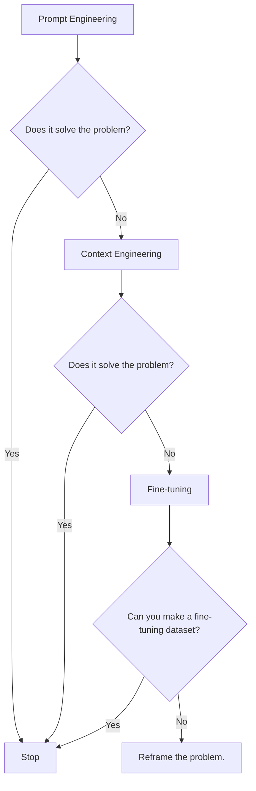
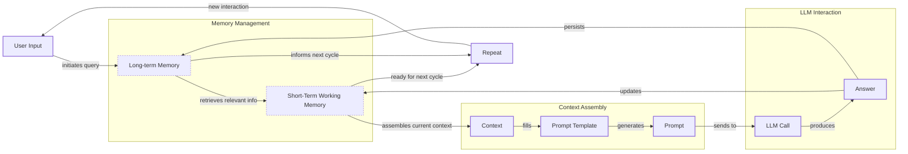
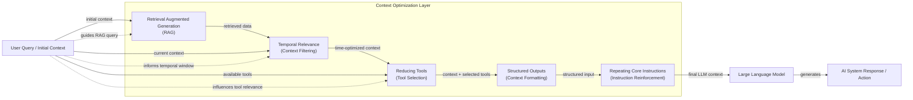
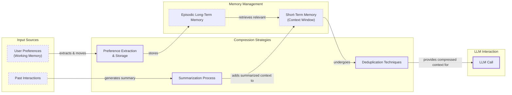
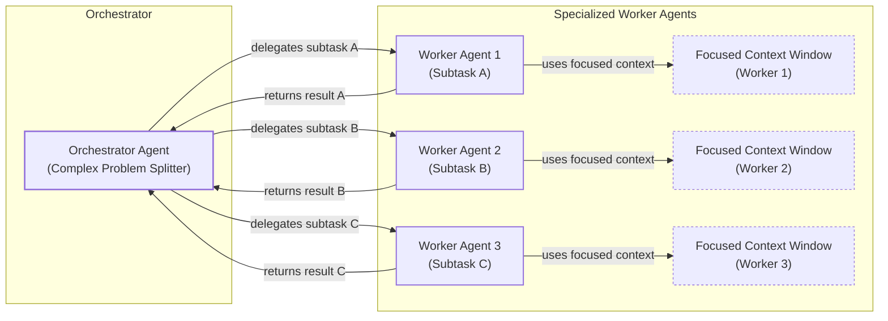

# Context Engineering: 2025’s #1 Skill in AI

## When prompt engineering breaks

AI applications have evolved rapidly. In 2022, we had simple chatbots for question-answering. By 2023, RAG systems connected LLMs to domain-specific knowledge. 2024 brought us tool-using agents that could perform actions. Now, we are building memory-enabled agents that remember past interactions and build relationships over time [[26]](https://www.securityindustry.org/2024/07/16/understanding-the-evolution-from-classic-chatbots-to-rag-chatbots-to-ai-powered-assistants/).

In our last lesson, we explored how to choose between AI agents and LLM workflows when designing a system. As these applications grow more complex, prompt engineering, a practice that once served us well, is showing its limits. It optimizes single LLM calls but fails when managing systems with memory, actions, and long interaction histories. The sheer volume of information an agent might need—past conversations, user data, documents, and action descriptions—has grown exponentially.

Simply stuffing all this into a prompt is not a viable strategy. A new discipline, context engineering, orchestrates this entire information ecosystem to ensure the LLM gets exactly what it needs, when it needs it. This skill is becoming a core foundation for AI engineering, moving beyond simple prompts to architecting the flow of information that makes AI truly intelligent.

## From Prompt to Context Engineering

Prompt engineering, while effective for simple tasks, is designed for single, stateless interactions. It treats each call to an LLM as a new, isolated event. This approach breaks down in stateful applications where context must be preserved and managed across multiple turns [[31]](https://www.langchain.com/blog/context-engineering-for-agents).

As a conversation or task progresses, the context grows. Without a strategy to manage this growth, the LLM’s performance degrades. This is context decay: the model gets confused by the noise of an ever-expanding history and starts to lose track of the original instructions. Studies have found that model correctness can drop significantly once the context exceeds 32,000 tokens, long before advertised limits are reached [[41]](https://www.decodingai.com/p/context-engineering-2025s-1-skill).

Even with large context windows, a physical limit exists for what you can include. Furthermore, on the operational side, every token adds to the cost and latency of an LLM call. Simply putting everything into the context creates a slow, expensive, and underperforming system [[16]](https://www.comet.com/site/blog/context-window/). We will explore these concepts in more detail in upcoming lessons, including memory in Lesson 9 and RAG in Lesson 10.

On a recent project, we learned this the hard way. We were working with a model that supported a million-token context window, so we thought, "*What could go wrong*?" We stuffed everything in: our research, guidelines, examples, and user history. The result was an LLM workflow that took 30 minutes to run and produced low-quality outputs [[41]](https://www.decodingai.com/p/context-engineering-2025s-1-skill).

This failure highlights the need for context engineering. It shifts the focus from crafting static prompts to building dynamic systems that manage information flow. As an AI engineer, your job is to select only the most critical pieces of context for each LLM call, making your applications accurate, fast, and cost-effective.

## Understanding Context Engineering

Context engineering is about finding the best way to arrange parts of your application's memory into the context that is passed to an LLM to get the best results. It is a solution to an optimization problem where you retrieve the right parts from your short-term and long-term memory to solve a specific task without overwhelming the model [[22]](https://arxiv.org/pdf/2507.13334). For example, when you ask a cooking agent for a recipe, you do not give it the entire cookbook. Instead, you retrieve the specific recipe, along with personal context like allergies or taste preferences.

Andrej Karpathy offered a great analogy for this: LLMs are a new kind of operating system, where the model is the CPU and its context window is the RAM. Just as an operating system manages what fits into RAM, context engineering curates what occupies the model’s working memory [[31]](https://www.langchain.com/blog/context-engineering-for-agents). This reframes the task from simply writing instructions to managing a finite, critical resource.

How does context engineering relate to prompt engineering? Prompt engineering is a subset of context engineering. You still write effective prompts, but you also design a system that feeds the right context into those prompts [[41]](https://www.decodingai.com/p/context-engineering-2025s-1-skill). This means understanding not just *how* to phrase a task, but *what* information the model needs to perform optimally.

| Dimension | Prompt Engineering | Context Engineering |
| --- | --- | --- |
| Scope | Single interaction optimization | Entire information ecosystem |
| State Management | Stateless function | Stateful due to memory |
| Focus | How to phrase tasks | What information to provide |

Table 1: A comparison of prompt engineering and context engineering.

Context engineering is the new fine-tuning. While fine-tuning has its place, it is expensive, time-consuming, and inflexible, especially when data changes constantly. For most enterprise use cases, you get better results faster and more cheaply with context engineering, making fine-tuning a last resort [[51]](https://www.linkedin.com/posts/denis-panjuta_prompt-engineering-vs-context-engineering-activity-7363945251180322816-1q_m). It allows for rapid iteration and adaptation without altering the core model.

When you start a new AI project, your decision-making process for guiding the LLM should look like the one presented in Image 1. You start with prompt engineering. If that fails, you move to context engineering. Only if that also fails and you can create a quality dataset should you consider fine-tuning.


Image 1: A flowchart illustrating the decision-making workflow for choosing a key strategy when starting a new AI project.

For instance, if you build an agent to process internal Slack messages, you do not need to fine-tune a model on your company’s communication style. It is more effective to use a powerful reasoning model and engineer the context to retrieve specific messages and enable actions like creating tasks or drafting emails [[53]](https://www.mezmo.com/learn-observability/context-engineering-for-observability-how-to-deliver-the-right-data-to-llms). Throughout this course, we will show you how to solve most industry problems using only context engineering.

## What Makes Up the Context

To master context engineering, you first need to understand what "context" actually is. It is everything the LLM sees in a single turn, dynamically assembled from various memory components before being passed to the model [[31]](https://www.langchain.com/blog/context-engineering-for-agents).

The high-level workflow, as presented in Image 2, begins when a user input triggers the system to pull relevant information from both long-term and short-term memory. This information is assembled into the final context, inserted into a prompt template, and sent to the LLM. The LLM’s answer then updates the memory, and the cycle repeats.


Image 2: A flowchart illustrating the high-level workflow of how context is built and used in an LLM application, including memory updates and a loop for subsequent interactions.

These components are grouped into two main categories. We will explain them intuitively for now, as we have future dedicated lessons for all of them.

### Short-Term Working Memory

Short-term working memory is the state of the agent for the current task or conversation. It is volatile and changes with each interaction, helping the agent maintain a coherent dialogue and make immediate decisions. It can include some or all of these components [[38]](https://www.analyticsvidhya.com/blog/2026/01/how-does-llm-memory-work/):

-   **User input:** The most recent query or command from the user, which sets the immediate task.
-   **Message history:** The log of the current conversation, allowing the LLM to understand the flow and previous turns. This is crucial for maintaining conversational coherence.
-   **Agent's internal thoughts:** The reasoning steps the agent takes to decide on its next action, often called a scratchpad. This provides a trace of the agent's decision-making process.
-   **Action calls and outputs:** The results from any actions the agent has performed, providing information from external systems like APIs or databases.

### Long-Term Memory

Long-term memory is more persistent and stores information across sessions, allowing the AI system to remember things beyond a single conversation. We divide it into three types, drawing parallels from human memory [[37]](https://www.datacamp.com/blog/how-does-llm-memory-work). An AI system can include some or all of them:

-   **Procedural memory:** This is knowledge encoded directly in the code. It includes the system prompt, which sets the agent's overall behavior and persona. It also includes the definitions of available actions and schemas for structured outputs, which guide the format of its responses. This is the agent's set of built-in skills.
-   **Episodic memory:** This is memory of specific past experiences, like user preferences or previous interactions. It is used to help the agent personalize its responses based on individual users. We typically store this in vector or graph databases for efficient retrieval [[41]](https://www.decodingai.com/p/context-engineering-2025s-1-skill).
-   **Semantic memory:** This is the agent’s general knowledge base. It can be internal, like company documents stored in a data lake, or external, accessed via the internet through API calls. This memory provides the factual information the agent needs to answer questions accurately.

If this seems like a lot, bear with us. We will cover all these concepts in-depth in future lessons, including structured outputs (Lesson 4), actions (Lesson 6), memory (Lesson 9), RAG (Lesson 10), and working with multimodal data (Lesson 11).
Image 3: A detailed illustration of how all the context engineering components work together inside an AI agent. (Source [Decoding AI Magazine [[41]](https://www.decodingai.com/p/context-engineering-2025s-1-skill)])

The key takeaway is that these components are not static. They are dynamically re-computed for every single interaction. For each conversation turn or new task, the short-term memory grows, or the long-term memory can change. Context engineering involves knowing how to select the right pieces from this vast memory pool to construct the most effective prompt for the task at hand.

## Production Implementation Challenges

Now that we understand what makes up the context, let's look at the core challenges of implementing it in production. These challenges all revolve around a single question: *"How can I keep my context as small as possible while providing enough information to the LLM?"* [[41]](https://www.decodingai.com/p/context-engineering-2025s-1-skill)

Here are four common issues that come up when building AI applications:

1.  **The context window challenge:** Every AI model has a limited context window, the maximum amount of information (tokens) it can process at once. This is like your computer's RAM; if your machine has only 32GB of RAM, that is all it can use at one time. While context windows are getting larger, they are not infinite, and treating them as such leads to other problems like increased cost and latency [[16]](https://www.comet.com/site/blog/context-window/).

2.  **Information overload:** Just because you can fit a lot of information into the context does not mean you should. Too much context reduces the performance of the LLM by confusing it. This is known as the "lost-in-the-middle" or "needle in a haystack" problem, where LLMs remember information best at the beginning and end of the context window. Information in the middle is often overlooked, and performance can drop long before the physical context limit is reached [[56]](https://www.linkedin.com/pulse/lost-middle-lesson-failing-ai-agents-backwards-anthony-dejohn-01k2e).

3.  **Context drift:** This occurs when conflicting versions of the truth accumulate in the memory over time. For example, the memory might contain two conflicting statements: "*My cat is white*" and later "*My cat is black*." This is not a quantum physics experiment; it is a data conflict that confuses the LLM and makes its knowledge base unreliable [[6]](https://galileo.ai/blog/production-llm-monitoring-strategies).

4.  **Tool confusion:** The final challenge is tool confusion, which arises in two main ways. First, adding too many actions to an agent can confuse the LLM about the best one for the job; the Gorilla benchmark shows that nearly all models perform worse when given more than one tool [[41]](https://www.decodingai.com/p/context-engineering-2025s-1-skill). Second, confusion can occur when tool descriptions are poorly written or overlap, making it difficult for even a human to choose the right one.

## Key Strategies for Context Optimization

Initially, most AI applications were chatbots over single knowledge bases. Today, modern AI solutions must manage multiple knowledge bases, tools, and complex conversational histories. Context engineering is about managing this complexity while meeting performance, latency, and cost requirements.

Here are four popular context engineering strategies used across the industry:

### Selecting the Right Context

Retrieving the right information from memory is a critical first step. A common mistake is to provide everything at once, assuming that models with large context windows can handle it. As we've discussed, the "lost-in-the-middle" problem often leads to poor performance, increased latency, and higher costs [[59]](https://atlan.com/know/llm-context-window-limitations/).

To solve this, consider these approaches:

-   **Use structured outputs:** Define clear schemas for what the LLM should return. This allows you to pass only the necessary, structured information to downstream steps. We will cover this in detail in Lesson 4.
-   **Use RAG:** Instead of providing entire documents, use RAG to fetch only the specific chunks of text needed to answer a user's question. This is a core topic we will explore in Lesson 10.
-   **Reduce the number of available actions:** Rather than giving an agent access to every available action, use various strategies to delegate action subsets to specialized components. Studies show that using RAG to select the most relevant tools can improve accuracy threefold [[31]](https://www.langchain.com/blog/context-engineering-for-agents).
-   **Rank time-sensitive data:** For time-sensitive information, rank it by date and filter out anything no longer relevant [[12]](https://www.dailydoseofds.com/llmops-crash-course-part-8/).
-   **Repeat core instructions:** For the most important instructions, repeat them at both the start and the end of the prompt. This uses the model's tendency to pay more attention to the context edges, ensuring core instructions are not lost [[57]](https://promptmetheus.com/resources/llm-knowledge-base/lost-in-the-middle-effect).


Image 4: A Mermaid diagram illustrating how various context selection techniques are combined and orchestrated within an AI system for context optimization.

### Context Compression

As message history grows in short-term working memory, you must manage past interactions to keep your context window in check. You cannot simply drop past conversation turns, as the LLM still needs to remember what happened. Instead, you need ways to compress key facts from the past [[11]](https://oneuptime.com/blog/post/2026-01-30-context-compression/view).

You can do this through:

1.  **Creating summaries of past interactions:** Use an LLM to replace a long, detailed history with a concise overview.
2.  **Moving user preferences to long-term memory:** Transfer user preferences from working memory to long-term episodic memory.
3.  **Deduplication:** Remove redundant information from the context to avoid repetition.


Image 5: A Mermaid diagram illustrating context compression strategies for LLMs.

For example, you can implement a summarization strategy using a framework like LangGraph. A naive approach might be to simply trim the oldest messages from the conversation history. A more sophisticated approach, however, would use a separate LLM call to summarize older parts of the conversation, retaining key information while reducing token count.

Here is a comparison of these two approaches. The first example shows a simple trimming function.

```python
# Naive Approach: Trimming old messages
def trim_messages(messages: list, max_tokens: int) -> list:
    # A simple implementation that would need a proper tokenizer
    # For demonstration purposes, we assume 1 message ~ 100 tokens
    max_messages = max_tokens // 100
    if len(messages) > max_messages:
        return messages[-max_messages:]
    return messages
```

The second example outlines a more robust summarization node within a LangGraph workflow.

```python
# Production Approach: Summarization with LangGraph
from langgraph.graph import StateGraph, END
from typing import TypedDict, Annotated
import operator

class AgentState(TypedDict):
    messages: Annotated[list, operator.add]
    summary: str

def summarize_context(state: AgentState):
    # Call an LLM to summarize the messages
    # This is a simplified placeholder for the actual summarization logic
    history = "\n".join([msg['content'] for msg in state['messages']])
    summary_prompt = f"Summarize the following conversation:\n{history}"
    # summary = llm.invoke(summary_prompt) 
    summary = "This is a summary of the conversation." # Placeholder
    
    # Keep the summary and the last few messages
    new_messages = state['messages'][-3:] 
    return {"messages": new_messages, "summary": summary}

# Define the graph
workflow = StateGraph(AgentState)
workflow.add_node("summarize", summarize_context)
# ... add other nodes and edges
```

The LangGraph approach is more complex to set up but provides a more intelligent way to manage context, ensuring that important details from early in the conversation are not lost.

### Isolating Context

Another powerful strategy is to isolate context by splitting information across multiple agents or LLM workflows. This technique is similar to tool isolation but applies to the entire context. Instead of one agent with a massive, cluttered context window, you can have a team of agents, each with a smaller, focused context [[31]](https://www.langchain.com/blog/context-engineering-for-agents).

We often implement this using an orchestrator-worker pattern, where a central orchestrator agent breaks down a problem and assigns sub-tasks to specialized worker agents. Each worker operates in its own isolated context, improving focus and allowing for parallel processing. We will cover this pattern in more detail in Lesson 5 [[46]](https://beam.ai/agentic-insights/multi-agent-orchestration-patterns-production).


Image 6: Mermaid diagram illustrating the orchestrator-worker pattern for context isolation, showing a central orchestrator delegating subtasks to specialized worker agents, each with its own focused context window.

### Format Optimization

Finally, the way you format the context matters. Models are sensitive to structure, and using clear delimiters can improve performance. Common strategies are to use XML tags to wrap different pieces of context (e.g., `<user_query>`, `<documents>`). This helps the model distinguish between different types of information [[44]](https://www.anthropic.com/engineering/effective-context-engineering-for-ai-agents). Also, when providing structured data as input, YAML is often more token-efficient than JSON, which helps save space in your context window [[41]](https://www.decodingai.com/p/context-engineering-2025s-1-skill).

Ultimately, you always have to understand what is passed to the LLM. Seeing exactly what occupies your context window at every step is key to mastering context engineering. Usually, this is done by properly monitoring your traces, tracking what happens at each step, and understanding the inputs and outputs. As this is a significant step to go from PoC to production, we will have dedicated lessons on this.

## Here is an Example

Let's connect the theory and strategies discussed earlier with concrete examples. Consider several common real-world scenarios:

-   **Healthcare:** An AI assistant accesses a patient's medical history, current symptoms, and relevant medical literature to suggest personalized diagnoses [[41]](https://www.decodingai.com/p/context-engineering-2025s-1-skill).
-   **Financial Services:** An agent might integrate with a company's Customer Relationship Management (CRM) system, calendars, and financial data to make decisions based on user preferences.
-   **Project Management:** An AI system can access enterprise tools like CRMs, Slack, and task managers to automatically understand project requirements and update tasks.
-   **Content Creator Assistant:** An AI agent uses your research, past content, and personality traits to understand what and how to create a given piece of content.

Let's walk through a specific query to see context engineering in action with the healthcare assistant scenario. A user asks: `I have a headache. What can I do to stop it? I would prefer not to take any medicine.`

Before the AI attempts to answer, a context engineering system performs several steps:

1.  It retrieves the user's patient history, known allergies, and lifestyle habits from episodic memory.
2.  It queries a medical database for non-pharmacological headache remedies from semantic memory.
3.  It assembles the key units of information from both memory types into the final context.
4.  It formats this information into a structured prompt and calls the LLM.
5.  Finally, it presents a personalized, context-aware answer to the user [[41]](https://www.decodingai.com/p/context-engineering-2025s-1-skill).

Here is a simplified Python example showing how you might structure the context and prompt for the LLM. Notice the clear structure using XML tags and the ordering of context elements.

```python
SYSTEM_PROMPT = """
You are a helpful and cautious AI healthcare assistant. Your goal is to provide safe, non-medicinal advice. Do not provide medical diagnoses.

<INSTRUCTIONS>
1. Analyze the user's query and the provided context.
2. Use the patient history to understand their health profile and preferences.
3. Use the retrieved medical knowledge to form your recommendation.
4. If you lack sufficient information, ask clarifying questions.
5. Always prioritize safety and advise consulting a doctor for serious issues.
</INSTRUCTIONS>

<PATIENT_HISTORY>
{retrieved_patient_history}
</PATIENT_HISTORY>

<MEDICAL_KNOWLEDGE>
{retrieved_medical_articles}
</MEDICAL_KNOWLEDGE>

<CONVERSATION_HISTORY>
{formatted_chat_history}
</CONVERSATION_HISTORY>

<USER_QUERY>
{user_query}
</USER_QUERY>

Based on all the information above, provide a helpful response.
"""
```

The key lies in the system around the prompt that brings in the proper context to populate these fields. To build such a system, you would use a combination of tools. An LLM like Gemini provides the reasoning engine. A framework like LangGraph orchestrates the workflow. Databases such as PostgreSQL, Qdrant, or Neo4j serve as long-term memory stores. Observability platforms like Opik or LangSmith are essential for debugging complex interactions [[64]](https://atlan.com/know/context-engineering-platforms-comparison/). It is often effective to keep it simple, as you can achieve much with only PostgreSQL or MongoDB.

## Connecting Context Engineering to AI Engineering

Mastering context engineering is less about learning a specific algorithm and more about building intuition. It’s the art of knowing how to structure prompts, what information to include, and how to order it for maximum impact [[41]](https://www.decodingai.com/p/context-engineering-2025s-1-skill).

This skill does not exist in a vacuum. It’s a multidisciplinary practice that sits at the intersection of several key engineering fields:

-   **AI Engineering:** Understanding LLMs, RAG, and AI agents is the foundation. This involves implementing practical solutions and evaluation pipelines to ensure they work as expected.
-   **Software Engineering:** You need to build scalable and maintainable systems to aggregate context and wrap agents in robust APIs. This includes writing clean, testable code and designing architectures that can evolve.
-   **Data Engineering:** Constructing reliable data pipelines for RAG and other memory systems is critical. This ensures that the context fed to the LLM is accurate, fresh, and relevant.
-   **MLOps:** Deploying agents on the right infrastructure and automating Continuous Integration/Continuous Deployment (CI/CD) makes them reproducible, observable, and scalable. This operational discipline is what allows AI systems to run reliably in production.

Our goal with this course is to teach you how to combine these skills to build production-ready AI products. In the world of AI, we should all think in systems rather than isolated components, having a mindset shift from developers to architects.

In the next lesson, we will explore structured outputs. Later, we will build on these ideas when we cover actions in Lesson 6, memory in Lesson 9, and RAG in Lesson 10.

## References

- [1] Microsoft Research, & Salesforce. (2025). *Simulated Conversations for LLM Performance Testing*.
- [2] Redis. (n.d.). *Context Window Overflow in Multi-Turn Applications*. Retrieved from redis.io
- [3] Chroma. (2025). *Context Rot: How Increasing Input Tokens Impacts LLM Performance*.
- [4] Sahin, S. (n.d.). *The Common Failure Points of LLM RAG Systems*. Towards Data Science.
- [5] (n.d.). *Your 1M Context Window LLM is Less Powerful Than You Think*. Towards Data Science.
- [6] Galileo. (2025, July 18). *Seven Strategies to Maintain LLM Reliability Across Diverse Use Cases in Production*. Galileo Blog.
- [7] Coforge. (n.d.). *Navigating the Shifting Sands: Understanding and Mitigating Data Drift in LLMs*.
- [8] The New Stack. (n.d.). *Context Rot in Enterprise AI LLMs*.
- [9] InsightFinder. (n.d.). *The Hidden Cost of LLM Drift Detection*.
- [11] OneUptime. (2026, January 30). *How to Build Context Compression*. OneUptime Blog.
- [12] Daily Dose of DS. (n.d.). *LLMOps Crash Course Part 8: Context Engineering*.
- [13] (2025). *Context Compression via Item Description Summarization for SLM Relevance Ranking*. arXiv.
- [14] JetBrains Research. (2025, December). *Efficient Context Management for LLM Agents*.
- [16] Comet. (2025, December 23). *Context Window: What It Is and Why It Matters for AI Agents*. Comet Blog.
- [17] DataHub. (n.d.). *Context Window Optimization*.
- [18] Maxim.ai. (n.d.). *Context Window Management Strategies for Long-Context AI Agents and Chatbots*.
- [20] JetBrains Research. (2025, December). *Efficient Context Management*.
- [21] Packmind. (n.d.). *What is ContextOps?*.
- [22] Mei, L., Yao, J., Ge, Y., et al. (2025, July 21). *A Survey of Context Engineering for Large Language Models*. https://arxiv.org/pdf/2507.13334
- [23] Sombra Inc. (n.d.). *AI Context Engineering Guide*.
- [25] Glean. (n.d.). *Context Engineering: The Foundation of Reliable, High-Performing Models*.
- [26] Security Industry Association. (2024, July 16). *Understanding the Evolution from Classic Chatbots to RAG Chatbots to AI-Powered Assistants*.
- [27] PagerGPT. (n.d.). *Evolution of AI Chatbots*.
- [29] Dante AI. (n.d.). *When Did AI Chatbots Start?*.
- [31] The LangChain Team. (2025, July 2). *Context Engineering*. LangChain Blog. https://blog.langchain.com/context-engineering-for-agents/
- [32] Glean. (n.d.). *Context Engineering vs. Prompt Engineering: Key Differences Explained*.
- [33] Atlan. (n.d.). *Working Memory in LLMs*.
- [34] Sundeep Teki. (n.d.). *From Vibe Coding to Context Engineering*.
- [35] Roychowdhury, S. (n.d.). *Context Engineering: The Silent Architecture Behind Every AI*. LinkedIn.
- [36] Atlan. (n.d.). *Working Memory in LLMs*.
- [37] DataCamp. (n.d.). *How Does LLM Memory Work?*.
- [38] Analytics Vidhya. (2026, January). *How Does LLM Memory Work?*.
- [39] Skymod. (n.d.). *Why Memory Matters in LLM Agents*.
- [40] Label Studio. (n.d.). *Episodic vs. Persistent Memory in LLMs*.
- [41] Iusztin, P. (2025). *Context Engineering: 2025’s #1 Skill in AI*. Decoding AI. https://www.decodingai.com/p/context-engineering-2025s-1-skill
- [43] (2025). *Prompt Engineering in Healthcare*. MDPI.
- [44] Anthropic. (n.d.). *Effective Context Engineering for AI Agents*.
- [46] Beam.ai. (n.d.). *Multi-Agent Orchestration Patterns in Production*.
- [47] GuruSup. (n.d.). *Multi-Agent Orchestration Guide*.
- [48] Vellum.ai. (n.d.). *Multi-Agent Systems: Building with Context Engineering*.
- [49] Praetorian. (n.d.). *Deterministic AI Orchestration*.
- [50] (2026). *Specialized Agents in Multi-Agent Systems*. arXiv.
- [51] Panjuta, D. (2025). *Prompt Engineering vs. Context Engineering*. LinkedIn.
- [52] Memgraph. (n.d.). *Prompt Engineering vs. Context Engineering*.
- [53] Mezmo. (n.d.). *Context Engineering for Observability*.
- [54] Instinctools. (n.d.). *Context Engineering*.
- [55] Neo4j. (n.d.). *Agentic AI: Context Engineering vs. Prompt Engineering*.
- [56] DeJohn, A. (2025). *Lost in the Middle: A Lesson in Failing AI Agents Backwards*. LinkedIn.
- [57] Promptmetheus. (n.d.). *Lost-in-the-Middle Effect*.
- [58] Thousand Miles AI. (n.d.). *The Lost in the Middle Problem*.
- [59] Atlan. (n.d.). *LLM Context Window Limitations*.
- [60] BigDataBoutique. (n.d.). *Needle in a Haystack: Optimizing Retrieval and RAG*.
- [61] Codecademy. (n.d.). *Context Engineering in AI*.
- [62] Stackademic. (n.d.). *Context Engineering in LLMs and AI Agents*.
- [64] Atlan. (n.d.). *Context Engineering Platforms Comparison*.
- [65] Scalable Path. (n.d.). *LangGraph*.