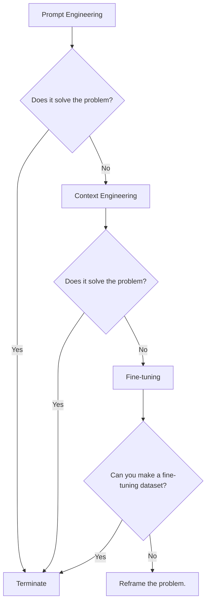
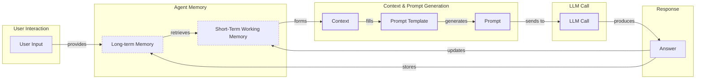
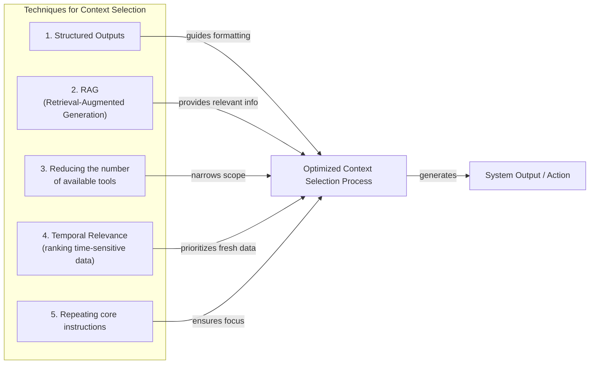
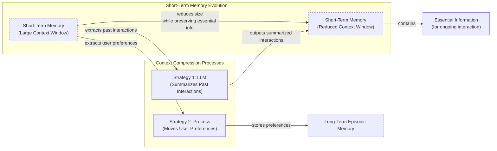
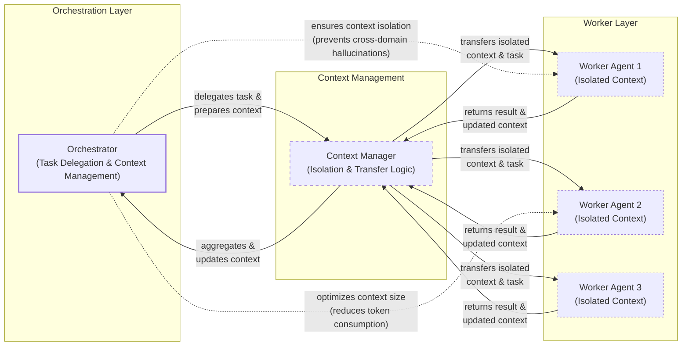

# Lesson 3: Context Engineering

AI applications have evolved rapidly. In 2022, we had simple chatbots for question-answering [[26]](https://www.securityindustry.org/2024/07/16/understanding-the-evolution-from-classic-chatbots-to-rag-chatbots-to-ai-powered-assistants/). By 2023, Retrieval-Augmented Generation (RAG) systems connected LLMs to domain-specific knowledge [[30]](https://www.linkedin.com/posts/ai-apps-central_most-people-put-all-ai-systems-in-the-same-activity-7438555783077793792-UEUm). 2024 brought us tool-using agents that could perform actions [[27]](https://pagergpt.ai/ai-chatbot/evolution-of-ai-chatbots). Now, in 2025, we are building memory-enabled agents that remember past interactions and build stateful relationships over time [[29]](https://www.dante-ai.com/news/when-did-ai-chatbots-start).

In our last lesson, we explored how to choose between AI agents and LLM workflows when designing a system. As these applications grow more complex, prompt engineering, a practice that once served us well, is showing its limits. It optimizes single LLM calls but fails when managing systems with memory, actions, and long interaction histories.

The sheer volume of information an agent might need—past conversations, user data, documents, and action descriptions—has grown exponentially. Simply stuffing all this into a prompt is not a viable strategy. This is where context engineering comes in. It is the discipline of orchestrating this entire information ecosystem to ensure the LLM gets exactly what it needs, when it needs it. This skill is becoming a core foundation for AI engineering [[20]](https://blog.langchain.com/the-rise-of-context-engineering/), [[21]](https://www.datacamp.com/blog/context-engineering).

## From prompt to context engineering

Prompt engineering, while effective for simple tasks, is designed for single, stateless interactions. It treats each call to an LLM as a new, isolated event. This approach breaks down in stateful applications where context must be preserved and managed across multiple turns. As a conversation or task progresses, the context grows. Without a strategy to manage this growth, the LLM’s performance degrades. This is context decay: the model gets confused by the noise of an ever-expanding history and starts to lose track of the original instructions or key information [[3]](https://www.trychroma.com/research/context-rot).

Even with large context windows, a physical limit exists for what you can include [[16]](https://www.comet.com/site/blog/context-window/). On the operational side, every token adds to the cost and latency of an LLM call [[16]](https://www.comet.com/site/blog/context-window/). Simply putting everything into the context creates a slow, expensive, and underperforming system. We will explore these concepts in more detail in upcoming lessons, including memory in Lesson 9 and RAG in Lesson 10.

On a recent project, we learned this the hard way. We were working with a model that supported a million-token context window, so we thought, "What could go wrong?" We stuffed everything in: our research, guidelines, examples, and user history. The result was an LLM workflow that took 30 minutes to run and produced low-quality outputs.

This is where context engineering becomes essential. It is the evolutionary successor to prompt engineering, shifting the focus from crafting static prompts to orchestrating the evolving context in ongoing interactions [[66]](https://neo4j.com/blog/agentic-ai/context-engineering-vs-prompt-engineering/). As an AI engineer, your job is to select only the most critical pieces of context for each LLM call. This makes your applications accurate, fast, and cost-effective.

## Understanding context engineering

Context engineering is about finding the best way to arrange parts of your memory into the context that is passed to the LLM to squeeze out the best results. It is a solution to an optimization problem where you have to retrieve the right parts of both your short- and long-term memory to solve a specific task without overwhelming the LLM [[22]](https://arxiv.org/pdf/2507.13334). For example, when asking a cooking agent for a recipe, instead of passing the whole cookbook, we retrieve just the information about that recipe, together with personal preferences like allergies or taste.

Andrej Karpathy explains that LLMs are like a new kind of operating system where the model is the CPU and its context window is the RAM [[31]](https://www.langchain.com/blog/context-engineering-for-agents), [[33]](https://atlan.com/know/working-memory-llms/). Just as an operating system manages what fits into your computer’s limited RAM, context engineering manages what information occupies the model’s limited context window.

Context engineering is not replacing prompt engineering. Instead, prompt engineering is a subset of context engineering [[20]](https://blog.langchain.com/the-rise-of-context-engineering/). You still work with prompts, so learning how to write them effectively is still a critical skill. But on top of that, it is important to know how to incorporate the right context into the prompt without compromising the LLM's performance.

| Dimension | Prompt Engineering | Context Engineering |
| --- | --- | --- |
| Scope | Single interaction optimization | Entire information ecosystem |
| State Management | Stateless function | Stateful due to memory |
| Focus | How to phrase tasks | What information to provide |

Table 1: A comparison of prompt engineering and context engineering.

Context engineering is the new fine-tuning. While fine-tuning has its place, it is expensive, time-consuming, and inflexible [[51]](https://www.linkedin.com/posts/denis-panjuta_prompt-engineering-vs-context-engineering-activity-7363945251180322816-1q_m). Data changes constantly, making fine-tuning a last resort. For most enterprise use cases, you get better results faster and more cheaply with context engineering. It allows for rapid iteration and adaptation to evolving data without altering the core model, a key advantage in dynamic environments [[53]](https://www.mezmo.com/learn-observability/context-engineering-for-observability-how-to-deliver-the-right-data-to-llms).

When you start a new AI project, your decision-making process for guiding the LLM should look like the one presented in Image 1.



Image 1: A flowchart illustrating the decision-making workflow for choosing an AI strategy.

For instance, when building an agent to process internal Slack messages, you do not need to fine-tune a model on your company’s communication style. It is more effective to use a powerful reasoning model and engineer the context to retrieve specific messages and enable actions like creating tasks or drafting emails [[54]](https://www.instinctools.com/blog/context-engineering/). Throughout this course, we will show you how to solve most industry problems using only context engineering.

## What makes up the context

To better understand what context engineering is, let's look at the core elements that build up the context. The high-level workflow begins when a user input triggers the system to pull relevant information from both long-term and short-term memory. This information is assembled into the final context, inserted into a prompt template, and sent to the LLM. The LLM’s answer then updates the memory, and the cycle repeats.



Image 2: A high-level workflow diagram showing the connection of context elements to the prompt and LLM call, including memory and feedback loops.

These components are grouped into two main categories. We will explain them intuitively, as we have future dedicated lessons for all of them.

### Short-Term Working Memory

Short-term working memory is the state of the agent for the current task or conversation. It is volatile and changes with each interaction, helping the agent maintain a coherent dialogue and make immediate decisions [[37]](https://www.datacamp.com/blog/how-does-llm-memory-work). It can include some or all of these components:

-   **User input:** The most recent query or command from the user.
-   **Message history:** The log of the current conversation, allowing the LLM to understand the flow and previous turns [[39]](https://skymod.tech/why-memory-matters-in-llm-agents-short-term-vs-long-term-memory-architectures/).
-   **Agent's internal thoughts:** The reasoning steps the agent takes to decide on its next action, often saved to a "scratchpad" [[17]](https://datahub.com/blog/context-window-optimization/).
-   **Action calls and outputs:** The results from any actions the agent has performed, providing information from external systems [[2]](https://redis.io/blog/context-window-overflow/).

### Long-Term Memory

Long-term memory is more persistent and stores information across sessions, allowing the AI system to remember things beyond a single conversation [[38]](https://www.analyticsvidhya.com/blog/2026/01/how-does-llm-memory-work/). We divide it into three types, drawing parallels from human memory [[36]](https://atlan.com/know/working-memory-llms/). This is inspired by biological memory consolidation, where the brain’s hippocampus acts as a temporary store for new experiences before transferring important information to the neocortex for permanent storage, often during sleep [[67]](https://systemweakness.com/decoding-ai-memory-why-our-brains-hold-the-key-to-the-next-generation-of-llms-a0246f1a56a2), [[68]](https://dev.to/joojodontoh/teaching-alfred-to-remember-with-a-neuroscience-inspired-memory-system-for-ai-agents-2o5l). An AI system can include some or all of them:

-   **Procedural memory:** This is knowledge encoded directly in the code. It includes the system prompt, which sets the agent's overall behavior. It also includes the definitions of available actions, which tell the agent what it can do, and schemas for structured outputs, which guide the format of its responses. Think of this as the agent's built-in skills [[39]](https://skymod.tech/why-memory-matters-in-llm-agents-short-term-vs-long-term-memory-architectures/).
-   **Episodic memory:** This is memory of specific past experiences, like user preferences or previous interactions. It is used to help the agent personalize its responses based on individual users. We typically store this in vector or graph databases for efficient retrieval [[40]](https://labelstud.io/learningcenter/episodic-vs-persistent-memory-in-llms/).
-   **Semantic memory:** This is the agent’s general knowledge base. It can be internal, like company documents stored in a data lake, or external, accessed via the internet through API calls or web scraping [[37]](https://www.datacamp.com/blog/how-does-llm-memory-work). This memory provides the factual information the agent needs to answer questions.

Some advanced architectures, like the proposed ZenBrain, explicitly model this with features like a "sleep consolidation loop," which replays interactions to strengthen important memories and prune weak ones, mimicking how human brains consolidate memory [[69]](https://arxiv.org/html/2604.23878v1).

If this seems like a lot, bear with us. We will cover all these concepts in-depth in future lessons, including structured outputs (Lesson 4), actions (Lesson 6), memory (Lesson 9), and RAG (Lesson 10).

https://github.com/user-attachments/assets/0f1f193f-8e94-4044-a276-576bd7764fd0

Image 3: Context engineering encompasses a variety of techniques and information sources (Source: [humanlayer/12-factor-agents](https://github.com/humanlayer/12-factor-agents/blob/main/content/factor-03-own-your-context-window.md) [[3]](https://github.com/humanlayer/12-factor-agents/blob/main/content/factor-03-own-your-context-window.md))

The key takeaway is that these components are not static. They are dynamically re-computed for every single interaction [[20]](https://blog.langchain.com/the-rise-of-context-engineering/). For each conversation turn or new task, the short-term memory grows, or the long-term memory can change. Context engineering involves knowing how to select the right pieces from this vast memory pool to construct the most effective prompt for the task at hand.

## Production implementation challenges

Now that we understand what makes up the context, let's look at the core challenges of implementing it in production. Many of these challenges become most apparent in **long-horizon tasks**—complex operations that require coherence over sequences of actions that exceed an LLM's context window, such as migrating a large codebase or conducting a comprehensive research project [[70]](https://www.anthropic.com/engineering/effective-context-engineering-for-ai-agents). For these long-horizon agents, memory management is a critical challenge [[71]](https://sequoiacap.com/podcast/context-engineering-our-way-to-long-horizon-agents-langchains-harrison-chase/). The core question is always: *"How can I keep my context as small as possible while providing enough information to the LLM?"*

Here are four common issues that come up when building AI applications:

1.  **The context window challenge:** Every AI model has a limited context window, the maximum amount of information (tokens) it can process at once. Think of it like your computer's RAM. If your machine has only 32GB of RAM, that is all it can use at one time. While context windows are getting larger, they are not infinite, and treating them as such leads to other problems [[16]](https://www.comet.com/site/blog/context-window/).
2.  **Information overload:** Just because you can fit a lot of information into the context does not mean you should. Too much context reduces the performance of the LLM by confusing it. This is known as the "lost-in-the-middle" or "needle in the haystack" problem, where LLMs are known for remembering information best at the beginning and end of the context window [[56]](https://www.linkedin.com/pulse/lost-middle-lesson-failing-ai-agents-backwards-anthony-dejohn-01k2e). Information in the middle is often overlooked, and performance can drop long before the physical context limit is reached [[58]](https://dev.to/thousand_miles_ai/the-lost-in-the-middle-problem-why-llms-ignore-the-middle-of-your-context-window-3al2), [[59]](https://atlan.com/know/llm-context-window-limitations/).
3.  **Context drift:** This occurs when conflicting views of truth accumulate in the memory over time [[8]](https://thenewstack.io/context-rot-enterprise-ai-llms/). For example, the memory might contain two conflicting statements: "My cat is white" and "My cat is black." This is not Schrodinger's Cat quantum physics experiment; it is a data conflict that confuses the LLM [[9]](https://insightfinder.com/blog/hidden-cost-llm-drift-detection/). Without a mechanism to resolve these conflicts, the model's responses become unreliable.
4.  **Tool confusion:** The final challenge is tool confusion, which arises in two main ways. First, adding too many actions to an agent can confuse the LLM about the best one for the job [[48]](https://www.vellum.ai/blog/multi-agent-systems-building-with-context-engineering). Second, confusion can occur when tool descriptions are poorly written or overlap. If the distinctions between actions are unclear, even a human would struggle to choose the right one. If two tools have descriptions like "finds user data" and "retrieves customer information," the model has no reliable way to choose, leading to unpredictable behavior.

## Key strategies for context optimization

Initially, most AI applications were chatbots over single knowledge bases. Today, modern AI solutions must manage multiple knowledge bases, tools, and complex conversational histories. Context engineering is about managing this complexity while meeting performance, latency, and cost requirements.

Here are four popular context engineering strategies used across the industry:

### Selecting the right context

Retrieving the right information from memory is a critical first step. A common mistake is to provide everything at once, assuming that models with large context windows can handle it. As we have discussed, the "lost-in-the-middle" problem often leads to poor performance, increased latency, and higher costs [[57]](https://promptmetheus.com/resources/llm-knowledge-base/lost-in-the-middle-effect).

To solve this, consider these approaches:



Image 4: A diagram illustrating how five techniques for selecting the right context work together in a larger system, contributing to an optimized context selection process.

-   **Use structured outputs:** Define clear schemas for what the LLM should return. This allows you to pass only the necessary, structured information to downstream steps. We will cover this in detail in Lesson 4.
-   **Use RAG:** Instead of providing entire documents, use RAG to fetch only the specific chunks of text needed to answer a user's question. This is a core topic we will explore in Lesson 10 [[4]](https://medium.com/@sahin.samia/the-common-failure-points-of-llm-rag-systems-and-how-to-overcome-them-926d9090a88f).
-   **Reduce the number of available actions:** Rather than giving an agent access to every available action, use various strategies to delegate action subsets to specialized components. For example, a typical pattern is to leverage the orchestrator-worker pattern to delegate subtasks to specialized agents [[46]](https://beam.ai/agentic-insights/multi-agent-orchestration-patterns-production).
-   **Rank time-sensitive data:** For time-sensitive information, rank it by date and filter out anything no longer relevant [[12]](https://www.dailydoseofds.com/llmops-crash-course-part-8/).
-   **Repeat core instructions:** For the most important instructions, repeat them at both the start and the end of the prompt. This uses the model's tendency to pay more attention to the context edges, ensuring core instructions are not lost [[57]](https://promptmetheus.com/resources/llm-knowledge-base/lost-in-the-middle-effect).
-   **Enable just-in-time exploration:** For long-horizon tasks, allow agents to explore their environment (e.g., file systems) as needed, rather than front-loading all possible information into the context [[70]](https://www.anthropic.com/engineering/effective-context-engineering-for-ai-agents), [[71]](https://sequoiacap.com/podcast/context-engineering-our-way-to-long-horizon-agents-langchains-harrison-chase/).

### Context compression

As message history grows in short-term working memory, you must manage past interactions to keep your context window in check. You cannot simply drop past conversation turns, as the LLM still needs to remember what happened. Instead, you need ways to compress key facts from the past [[11]](https://oneuptime.com/blog/post/2026-01-30-context-compression/view).



Image 5: A diagram illustrating two context compression strategies and their impact on short-term memory.

You can do this through:

-   **Creating summaries of past interactions:** Use an LLM to replace a long, detailed history with a concise overview. In evaluations of long-running agent sessions, structured summarization has been shown to retain more useful information than less-structured approaches [[14]](https://blog.jetbrains.com/research/2025/12/efficient-context-management/), [[74]](https://factory.ai/news/evaluating-compression).
-   **Moving user preferences to long-term memory:** Transfer user preferences from working memory to long-term episodic memory. This keeps the working context clean while ensuring preferences are remembered for future sessions [[12]](https://www.dailydoseofds.com/llmops-crash-course-part-8/).
-   **Deduplication:** Remove redundant information from the context to avoid repetition [[11]](https://oneuptime.com/blog/post/2026-01-30-context-compression/view).
-   **Implementing memory decay:** Create rules to automatically down-rank or delete memories that are old, rarely used, or contradicted by new facts. This helps prevent context drift and keeps the memory relevant [[73]](https://medium.com/@armankamran/context-is-the-new-intelligence-engineering-the-next-generation-of-generative-ai-systems-174d99634c0c).

However, compression must be done carefully. Some methods can be too aggressive, removing key relational words and leaving a fragmented context that misleads the LLM [[75]](https://aclanthology.org/2025.findings-emnlp.362.pdf).

### Isolating Context

Another powerful strategy is to isolate context by splitting information across multiple agents or LLM workflows. This technique is similar to tool isolation but is more general, referring to the whole context. The key idea is that instead of one agent with a massive, cluttered context window, you can have a team of agents, each with a smaller, focused context [[48]](https://www.vellum.ai/blog/multi-agent-systems-building-with-context-engineering). The guiding principle is to provide the minimum sufficient context required for a decision, which prevents distractions and reduces the risk of lost-in-the-middle degradation [[72]](https://arxiv.org/pdf/2603.09619).



Image 6: An architecture diagram illustrating the orchestrator-worker pattern for context isolation, showing how a central Orchestrator delegates tasks and manages context transfer to multiple Worker Agents to ensure isolation, prevent hallucinations, and reduce token consumption.

We often implement this using an orchestrator-worker pattern, where a central orchestrator agent breaks down a problem and assigns sub-tasks to specialized worker agents [[47]](https://gurusup.com/blog/multi-agent-orchestration-guide). Each worker operates in its own isolated context, improving focus and allowing for parallel processing. We will cover this pattern in more detail in Lesson 5.

### Format optimization for model clarity

Finally, the way you format the context matters. Models are sensitive to structure, and using clear delimiters can improve performance. Common strategies are to use XML tags to wrap different pieces of context (e.g., `<user_query>`, `<documents>`). This helps the model distinguish between different types of information [[44]](https://www.anthropic.com/engineering/effective-context-engineering-for-ai-agents). Also, when providing structured data as input, YAML is often more token-efficient than JSON, which helps save space in your context window.

You always have to understand what is passed to the LLM. Seeing exactly what occupies your context window at every step is key to mastering context engineering. Usually this is done by properly monitoring your traces, tracking what happens at each step, and understanding the inputs and outputs [[18]](https://www.getmaxim.ai/articles/context-window-management-strategies-for-long-context-ai-agents-and-chatbots/articles/context-window-management-strategies-for-long-context-ai-agents-and-chatbots). As this is a significant step to go from PoC to production, we will have dedicated lessons on this.

## Here is an example

Let's connect the theory and strategies with a concrete example. Consider these common real-world scenarios:

-   **Healthcare:** An AI assistant accesses a patient's medical history, current symptoms, and the latest medical literature to provide personalized diagnostic support [[41]](https://www.decodingai.com/p/context-engineering-2025s-1-skill).
-   **Financial Services:** AI systems integrate with enterprise tools like Customer Relationship Management (CRM) systems and calendars, combining market data and client portfolios to generate tailored financial advice [[41]](https://www.decodingai.com/p/context-engineering-2025s-1-skill).
-   **Project Management:** AI systems access enterprise infrastructure like CRMs and task managers to automatically understand project requirements, then add and update tasks.
-   **Content Creator Assistant:** An AI agent uses your research, past content, and personality traits to understand what and how to create a given piece of content.

Let's walk through the healthcare assistant scenario. A user asks: `I have a headache. What can I do to stop it? I would prefer not to take any medicine.`

Before the AI attempts to answer, a context engineering system performs several steps [[41]](https://www.decodingai.com/p/context-engineering-2025s-1-skill):

1.  It retrieves the user's patient history, known allergies, and lifestyle habits from episodic memory.
2.  It queries a medical database for non-pharmacological headache remedies from semantic memory.
3.  It assembles the key units of information from both memory types into the final context.
4.  It formats this information into a structured prompt and calls the LLM.
5.  Finally, it presents a personalized, context-aware answer to the user.

Here is a simplified Python example showing how you might structure the context and prompt, using XML tags and YAML formatting [[41]](https://www.decodingai.com/p/context-engineering-2025s-1-skill), [[43]](https://www.mdpi.com/2079-9292/13/15/2961).

1.  First, we define the user's query.
    ```python
    import yaml
    
    user_query = "I have a headache. What can I do to stop it? I would prefer not to take any medicine."
    ```
2.  Next, we define the patient's history, which would typically be retrieved from episodic memory.
    ```python
    patient_history = {
        "patient": {
            "name": "John Doe",
            "age": 45,
            "gender": "M",
            "conditions": ["mild_hypertension"],
            "allergies": [],
            "preferences": {
                "medication_avoidance": True,
                "preferred_treatments": "natural_remedies"
            },
            "habits": {
                "stress_level": "high",
                "work_related": True,
                "caffeine_intake": "3-4_cups_daily"
            }
        }
    }
    ```
3.  Then, we include relevant medical literature, which would be retrieved from semantic memory.
    ```python
    medical_literature = {
        "articles": [
            {
                "id": 1,
                "topic": "dehydration_headaches",
                "finding": "Dehydration is a common cause of tension headaches",
                "treatment": "Rehydration can alleviate symptoms within 30 minutes to three hours"
            },
            # ... other articles
        ]
    }
    ```
4.  Finally, we assemble the complete prompt, combining all elements into a structured format.
    ```python
    prompt = f"""
    <system_prompt>
    You are a helpful AI medical assistant. Your role is to provide safe, helpful, and personalized health advice based on the provided context. Do not give advice outside of the provided context. Prioritize non-medicinal options as per user preference.
    </system_prompt>
    
    <patient_history>
    {yaml.dump(patient_history)}
    </patient_history>
    
    <medical_literature>
    {yaml.dump(medical_literature)}
    </medical_literature>
    
    <user_query>
    {user_query}
    </user_query>
    
    <instructions>
    Based on all the information above, provide a step-by-step plan for the user to relieve their headache. Structure your response clearly.
    </instructions>
    """
    ```

To build such a system, you need a robust tech stack. Here is a potential stack we recommend and will use throughout this course:

-   **LLM:** Gemini as a multimodal, reasoning, and cost-effective LLM API provider.
-   **Orchestration:** LangGraph for defining stateful, agentic workflows [[65]](https://www.scalablepath.com/machine-learning/langgraph).
-   **Databases:** PostgreSQL, MongoDB, Redis, Qdrant, and Neo4j. Often, it is effective to keep it simple, as you can achieve much with only PostgreSQL or MongoDB [[62]](https://blog.stackademic.com/context-engineering-in-llms-and-ai-agents-eb861f0d3e9b).
-   **Observability:** Opik or LangSmith for evaluation and trace monitoring [[16]](https://www.comet.com/site/blog/context-window/), [[64]](https://atlan.com/know/context-engineering-platforms-comparison/).

## Connecting context engineering to AI engineering

Context engineering is more of an art than a science. It is about developing the intuition to craft effective prompts, select the right information from memory, and arrange context for optimal results. This discipline helps you determine the minimal yet essential information an LLM needs to perform at its best.

It is important to understand that context engineering cannot be learned in isolation. It is a complex field that combines:

1.  **AI Engineering:** Implement practical solutions such as LLM workflows, RAG, AI Agents, and evaluation pipelines [[61]](https://www.codecademy.com/article/context-engineering-in-ai).
2.  **Software Engineering (SWE):** Build your AI product with code that is not just functional, but also scalable and maintainable, and design architectures that can grow with your product's needs, such as implementing robust memory management systems [[23]](https://sombrainc.com/blog/ai-context-engineering-guide).
3.  **Data Engineering:** Design data pipelines that feed curated and validated data into the memory layer, ensuring data is clean, up-to-date, and efficiently retrievable [[24]](https://www.decube.io/post/master-data-pipeline-architecture-best-practices-for-engineers).
4.  **Operations (Ops):** Deploy agents on the proper infrastructure to ensure they are reproducible, maintainable, observable, and scalable, including automating processes with CI/CD pipelines to manage context-aware agents reliably [[22]](https://www.mezmo.com/learn-observability/context-engineering-for-observability-how-to-deliver-the-right-data-to-llms).

The principles of context engineering extend beyond text-based systems. In fields like robotics, for example, decision-making systems must integrate information from multiple sensory modalities—like vision, audio, and touch—to generate context-aware actions. This highlights how central context management is to building intelligent systems in any domain [[76]](https://www.frontiersin.org/journals/robotics-and-ai/articles/10.3389/frobt.2025.1604472/full).

Our goal with this course is to teach you how to combine these skills to build production-ready AI products. We like to say that in the world of AI, we should all think in systems rather than isolated components, having a mindset shift from developers to architects.

In the next lesson, we will explore structured outputs.

## References

-   [1] Karpathy, A. (2025, May 22). *+1 for "context engineering" over "prompt engineering"*. X. https://x.com/karpathy/status/1937902205765607626
-   [2] Redis. (n.d.). *Context Window Overflow in LLMs*. https://redis.io/blog/context-window-overflow/
-   [3] humanlayer. (n.d.). *12-factor-agents/content/factor-03-own-your-context-window.md*. GitHub. https://github.com/humanlayer/12-factor-agents/blob/main/content/factor-03-own-your-context-window.md
-   [4] Sahin, S. (n.d.). *The Common Failure Points of LLM RAG Systems and How to Overcome Them*. Medium. https://medium.com/@sahin.samia/the-common-failure-points-of-llm-rag-systems-and-how-to-overcome-them-926d9090a88f
-   [5] *Your 1M+ context window LLM is less powerful than you think*. (n.d.). Towards Data Science. https://towardsdatascience.com/your-1m-context-window-llm-is-less-powerful-than-you-think/
-   [6] Galileo. (n.d.). *Production LLM Monitoring Strategies*. https://galileo.ai/blog/production-llm-monitoring-strategies
-   [7] Coforge. (n.d.). *Navigating the Shifting Sands: Understanding and Mitigating Data Drift in LLMs*. https://www.coforge.com/what-we-know/blog/navigating-the-shifting-sands-understanding-and-mitigating-data-drift-in-llms
-   [8] The New Stack. (n.d.). *Context Rot: The Silent Killer of Enterprise AI LLMs*. https://thenewstack.io/context-rot-enterprise-ai-llms/
-   [9] InsightFinder. (n.d.). *The Hidden Cost of LLM Drift Detection*. https://insightfinder.com/blog/hidden-cost-llm-drift-detection/
-   [10] Helicone. (n.d.). *How to Reduce LLM Hallucination*. https://www.helicone.ai/blog/how-to-reduce-llm-hallucination
-   [11] OneUptime. (2026, January 30). *Context Compression*. https://oneuptime.com/blog/post/2026-01-30-context-compression/view
-   [12] Daily Dose of DS. (n.d.). *LLMOps Crash Course Part 8*. https://www.dailydoseofds.com/llmops-crash-course-part-8/
-   [13] *Context compression via item description summarization for SLM relevance ranking in semantic search*. (2025, October). arXiv. https://arxiv.org/html/2510.22101v1
-   [14] JetBrains Research. (2025, December). *Efficient Context Management*. https://blog.jetbrains.com/research/2025/12/efficient-context-management/
-   [15] *Comet*. (n.d.). Context Window. https://www.comet.com/site/blog/context-window/
-   [16] *Comet*. (n.d.). Context Window. https://www.comet.com/site/blog/context-window/
-   [17] DataHub. (n.d.). *Context Window Optimization*. https://datahub.com/blog/context-window-optimization/
-   [18] Maxim.ai. (n.d.). *Context Window Management Strategies for Long-Context AI Agents and Chatbots*. https://www.getmaxim.ai/articles/context-window-management-strategies-for-long-context-ai-agents-and-chatbots/articles/context-window-management-strategies-for-long-context-ai-agents-and-chatbots
-   [19] JetBrains Research. (2025, December). *Efficient Context Management*. https://blog.jetbrains.com/research/2025/12/efficient-context-management/
-   [20] Chase, H. (2025, June 23). *The rise of "context engineering"*. LangChain Blog. https://blog.langchain.com/the-rise-of-context-engineering/
-   [21] DataCamp. (n.d.). *Context Engineering: A Guide With Examples*. https://www.datacamp.com/blog/context-engineering
-   [22] Mei, L., et al. (2025, July 17). *A Survey of Context Engineering for Large Language Models*. arXiv. https://arxiv.org/pdf/2507.13334
-   [23] Sombra. (n.d.). *AI Context Engineering Guide*. https://sombrainc.com/blog/ai-context-engineering-guide
-   [24] Decube. (n.d.). *Master Data Pipeline Architecture: Best Practices for Engineers*. https://www.decube.io/post/master-data-pipeline-architecture-best-practices-for-engineers
-   [25] Glean. (n.d.). *Context Engineering AI: The Foundation of Reliable, High-Performing Models*. https://www.glean.com/blog/context-engineering-ai-the-foundation-of-reliable-high-performing-models
-   [26] Security Industry Association. (2024, July 16). *Understanding the Evolution from Classic Chatbots to RAG Chatbots to AI-Powered Assistants*. https://www.securityindustry.org/2024/07/16/understanding-the-evolution-from-classic-chatbots-to-rag-chatbots-to-ai-powered-assistants/
-   [27] pagergpt.ai. (n.d.). *Evolution of AI Chatbots*. https://pagergpt.ai/ai-chatbot/evolution-of-ai-chatbots
-   [28] *Dante AI*. (n.d.). When Did AI Chatbots Start?. https://www.dante-ai.com/news/when-did-ai-chatbots-start
-   [29] *Dante AI*. (n.d.). When Did AI Chatbots Start?. https://www.dante-ai.com/news/when-did-ai-chatbots-start
-   [30] AI Apps Central. (n.d.). *Most people put all AI systems in the same...*. LinkedIn. https://www.linkedin.com/posts/ai-apps-central_most-people-put-all-ai-systems-in-the-same-activity-7438555783077793792-UEUm
-   [31] LangChain. (2025, July 2). *Context Engineering for Agents*. https://blog.langchain.com/context-engineering-for-agents/
-   [32] Glean. (n.d.). *Context Engineering vs. Prompt Engineering: Key Differences Explained*. https://www.glean.com/perspectives/context-engineering-vs-prompt-engineering-key-differences-explained
-   [33] Atlan. (n.d.). *Working Memory in LLMs*. https://atlan.com/know/working-memory-llms/
-   [34] Sundeep Teki. (n.d.). *From Vibe Coding to Context Engineering: A Blueprint for Production-Grade GenAI Systems*. https://www.sundeepteki.org/blog/from-vibe-coding-to-context-engineering-a-blueprint-for-production-grade-genai-systems
-   [35] Roychowdhury, S. (n.d.). *Context Engineering: The Silent Architecture Behind Every AI*. LinkedIn. https://www.linkedin.com/pulse/context-engineering-silent-architecture-behind-every-ai-roychowdhury-lzcec
-   [36] Atlan. (n.d.). *Working Memory in LLMs*. https://atlan.com/know/working-memory-llms/
-   [37] DataCamp. (n.d.). *How Does LLM Memory Work?*. https://www.datacamp.com/blog/how-does-llm-memory-work
-   [38] Analytics Vidhya. (2026, January). *How Does LLM Memory Work?*. https://www.analyticsvidhya.com/blog/2026/01/how-does-llm-memory-work/
-   [39] Skymod. (n.d.). *Why Memory Matters in LLM Agents: Short-Term vs. Long-Term Memory Architectures*. https://skymod.tech/why-memory-matters-in-llm-agents-short-term-vs-long-term-memory-architectures/
-   [40] Label Studio. (n.d.). *Episodic vs. Persistent Memory in LLMs*. https://labelstud.io/learningcenter/episodic-vs-persistent-memory-in-llms/
-   [41] decodingai.com. (n.d.). *Context Engineering: 2025's #1 Skill*. https://www.decodingai.com/p/context-engineering-2025s-1-skill
-   [42] MDPI. (n.d.). *Prompt Engineering in Healthcare*. https://www.mdpi.com/2079-9292/13/15/2961
-   [43] MDPI. (n.d.). *Prompt Engineering in Healthcare*. https://www.mdpi.com/2079-9292/13/15/2961
-   [44] Anthropic. (n.d.). *Effective Context Engineering for AI Agents*. https://www.anthropic.com/engineering/effective-context-engineering-for-ai-agents
-   [45] Beam.ai. (n.d.). *Multi-Agent Orchestration Patterns for Production*. https://beam.ai/agentic-insights/multi-agent-orchestration-patterns-production
-   [46] Beam.ai. (n.d.). *Multi-Agent Orchestration Patterns for Production*. https://beam.ai/agentic-insights/multi-agent-orchestration-patterns-production
-   [47] GuruSup. (n.d.). *Multi-Agent Orchestration Guide*. https://gurusup.com/blog/multi-agent-orchestration-guide
-   [48] Vellum.ai. (n.d.). *Multi-Agent Systems: Building with Context Engineering*. https://www.vellum.ai/blog/multi-agent-systems-building-with-context-engineering
-   [49] Praetorian. (n.d.). *Deterministic AI Orchestration: A Platform Architecture for Autonomous Development*. https://www.praetorian.com/blog/deterministic-ai-orchestration-a-platform-architecture-for-autonomous-development/
-   [50] *Specialized agents*. (2026, January). arXiv. https://arxiv.org/html/2601.13671v1
-   [51] Panjuta, D. (n.d.). *Prompt Engineering vs. Context Engineering*. LinkedIn. https://www.linkedin.com/posts/denis-panjuta_prompt-engineering-vs-context-engineering-activity-7363945251180322816-1q_m
-   [52] Memgraph. (n.d.). *Prompt Engineering vs. Context Engineering*. https://memgraph.com/blog/prompt-engineering-vs-context-engineering
-   [53] Mezmo. (n.d.). *Context Engineering for Observability: How to Deliver the Right Data to LLMs*. https://www.mezmo.com/learn-observability/context-engineering-for-observability-how-to-deliver-the-right-data-to-llms
-   [54] instinctools. (n.d.). *Context Engineering*. https://www.instinctools.com/blog/context-engineering/
-   [55] Neo4j. (n.d.). *Agentic AI: Context Engineering vs. Prompt Engineering*. https://neo4j.com/blog/agentic-ai/context-engineering-vs-prompt-engineering/
-   [56] DeJohn, A. (n.d.). *Lost in the Middle: A Lesson from Failing AI Agents, Backwards*. LinkedIn. https://www.linkedin.com/pulse/lost-middle-lesson-failing-ai-agents-backwards-anthony-dejohn-01k2e
-   [57] Promptmetheus. (n.d.). *Lost-in-the-Middle Effect*. https://promptmetheus.com/resources/llm-knowledge-base/lost-in-the-middle-effect
-   [58] DEV Community. (n.d.). *The 'Lost in the Middle' Problem: Why LLMs Ignore the Middle of Your Context Window*. https://dev.to/thousand_miles_ai/the-lost-in-the-middle-problem-why-llms-ignore-the-middle-of-your-context-window-3al2
-   [59] Atlan. (2026). *LLM Context Window Limitations*. https://atlan.com/know/llm-context-window-limitations/
-   [60] BigData Boutique. (n.d.). *Needle in a Haystack: Optimizing Retrieval and RAG over Long Context Windows*. https://bigdataboutique.com/blog/needle-in-haystack-optimizing-retrieval-and-rag-over-long-context-windows-5dfb3c
-   [61] Codecademy. (n.d.). *Context Engineering in AI*. https://www.codecademy.com/article/context-engineering-in-ai
-   [62] Stackademic. (n.d.). *Context Engineering in LLMs and AI Agents*. https://blog.stackademic.com/context-engineering-in-llms-and-ai-agents-eb861f0d3e9b
-   [63] Packmind. (n.d.). *How to Implement Context Engineering*. https://packmind.com/context-engineering-ai-coding/how-to-implement-context-engineering/
-   [64] Atlan. (n.d.). *Context Engineering Platforms Comparison*. https://atlan.com/know/context-engineering-platforms-comparison/
-   [65] Scalable Path. (n.d.). *LangGraph*. https://www.scalablepath.com/machine-learning/langgraph
-   [66] Neo4j. (n.d.). *Agentic AI: Context Engineering vs. Prompt Engineering*. https://neo4j.com/blog/agentic-ai/context-engineering-vs-prompt-engineering/
-   [67] SystemWeakness. (n.d.). *Decoding AI Memory: Why Our Brains Hold the Key to the Next Generation of LLMs*. https://systemweakness.com/decoding-ai-memory-why-our-brains-hold-the-key-to-the-next-generation-of-llms-a0246f1a56a2
-   [68] Joojodontoh. (n.d.). *Teaching Alfred to Remember with a Neuroscience-Inspired Memory System for AI Agents*. dev.to. https://dev.to/joojodontoh/teaching-alfred-to-remember-with-a-neuroscience-inspired-memory-system-for-ai-agents-2o5l
-   [69] *ZenBrain: A Neuroscience-Inspired General-Purpose AI Agent*. (2026, April). arXiv. https://arxiv.org/html/2604.23878v1
-   [70] Anthropic. (n.d.). *Effective context engineering for AI agents*. https://www.anthropic.com/engineering/effective-context-engineering-for-ai-agents
-   [71] Sequoia Capital. (n.d.). *Context Engineering Our Way to Long-Horizon Agents: LangChain's Harrison Chase*. https://sequoiacap.com/podcast/context-engineering-our-way-to-long-horizon-agents-langchains-harrison-chase/
-   [72] *A Unified Framework for Building, Managing, and Operating Autonomous AI Agents*. (2026, March). arXiv. https://arxiv.org/pdf/2603.09619
-   [73] Kamran, A. (n.d.). *Context is the New Intelligence: Engineering the Next Generation of Generative AI Systems*. Medium. https://medium.com/@armankamran/context-is-the-new-intelligence-engineering-the-next-generation-of-generative-ai-systems-174d99634c0c
-   [74] Factory.ai. (n.d.). *Evaluating Context Compression for AI Agents*. https://factory.ai/news/evaluating-compression
-   [75] *QUITO-X: A New Perspective on Context Compression...*. (2025). ACL Anthology. https://aclanthology.org/2025.findings-emnlp.362.pdf
-   [76] *Multimodal Perception-Driven Decision Making in Human-Robot Interaction*. (2025). Frontiers. https://www.frontiersin.org/journals/robotics-and-ai/articles/10.3389/frobt.2025.1604472/full