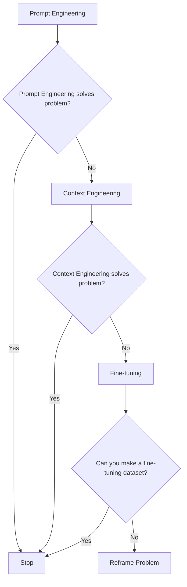
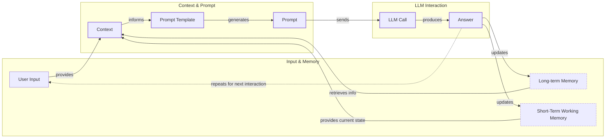
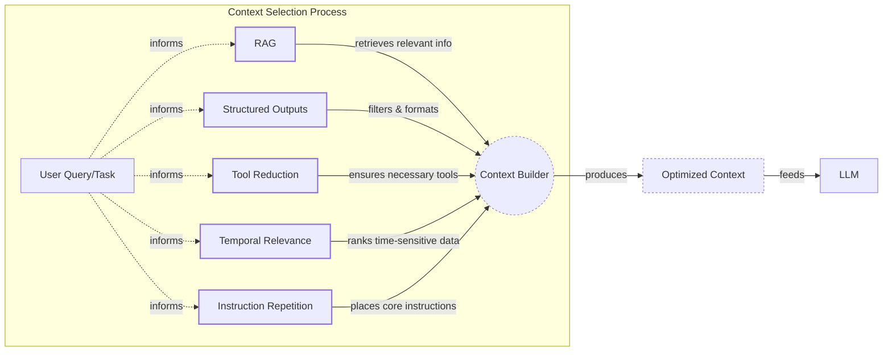
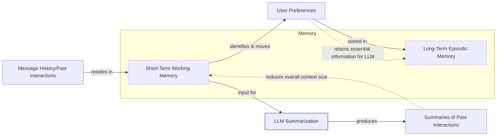
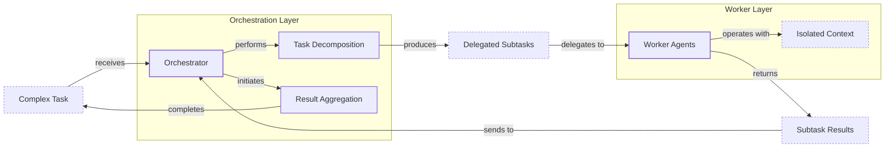

# Context Engineering: The #1 Skill for AI Engineers in 2025

AI applications have evolved rapidly. In 2022, we had simple chatbots for question-and-answering. By 2023, Retrieval-Augmented Generation (RAG) systems connected LLMs to domain-specific knowledge. 2024 brought us tool-using agents that could perform actions. Now, we are building memory-enabled agents that remember past interactions and build relationships over time [[1]](https://www.securityindustry.org/2024/07/16/understanding-the-evolution-from-classic-chatbots-to-rag-chatbots-to-ai-powered-assistants/), [[2]](https://www.linkedin.com/posts/ai-apps-central_most-people-put-all-ai-systems-in-the-same-activity-7438555783077793792-UEUm).

In our last lesson, we explored how to choose between AI agents and LLM workflows when designing a system. As these applications grow more complex, prompt engineering, a practice that once served us well, is showing its limits. It optimizes single LLM calls but fails when managing systems with memory, actions, and long interaction histories [[3]](https://memgraph.com/blog/prompt-engineering-vs-context-engineering). The sheer volume of information an agent might need—past conversations, user data, documents, and tool descriptions—has grown exponentially. Simply stuffing all this into a prompt is not a viable strategy.

This is where context engineering comes in. It is the discipline of orchestrating this entire information ecosystem to ensure the LLM gets exactly what it needs, when it needs it [[4]](https://www.glean.com/blog/context-engineering-ai-the-foundation-of-reliable-high-performing-models). As fine-tuning becomes a last resort due to its cost and inflexibility in a world of ever-changing data, context engineering is emerging as a core skill for building successful AI applications [[5]](https://www.linkedin.com/posts/denis-panjuta_prompt-engineering-vs-context-engineering-activity-7363945251180322816-1q_m).

## From Prompt to Context Engineering

Prompt engineering, while effective for simple tasks, is designed for single, stateless interactions. It treats each call to an LLM as a new, isolated event. This approach breaks down in stateful applications where context must be preserved and managed across multiple turns.

As a conversation or task progresses, the context grows. Without a strategy to manage this growth, the LLM’s performance degrades. This is context decay: the model gets confused by the noise of an ever-expanding history [[6]](https://www.decodingai.com/p/context-engineering-2025s-1-skill). It starts to lose track of the original instructions or key information, leading to hallucinations and misguided answers. A study by Microsoft Research and Salesforce found that LLM performance drops by 39% on average when moving from single-turn to multi-turn conversations [[7]](https://atlan.com/know/llm-context-window-limitations/).

Even with large context windows, a physical limit exists for what you can include. Models get confused by long, messy contexts, and research shows correctness can drop significantly once the context exceeds 32,000 tokens—long before advertised million-token limits are reached [[6]](https://www.decodingai.com/p/context-engineering-2025s-1-skill), [[8]](https://www.datacamp.com/blog/context-engineering). Also, on the operational side, every token adds to the cost and latency of an LLM call. Simply putting everything into the context creates a slow, expensive, and underperforming system. We will explore these concepts in more detail in upcoming lessons, including memory in Lesson 9 and RAG in Lesson 10.

On a recent project, we learned this the hard way. We were working with a model that supported a two-million-token context window, so we thought, "*What could go wrong*?" We stuffed everything in: our research, guidelines, examples, and user history. The result was an LLM workflow that took 30 minutes to run and produced low-quality outputs [[6]](https://www.decodingai.com/p/context-engineering-2025s-1-skill).

This is where context engineering becomes essential. It shifts the focus from crafting static prompts to building dynamic systems that manage information flow [[4]](https://www.glean.com/blog/context-engineering-ai-the-foundation-of-reliable-high-performing-models). As an AI engineer, your job is to select only the most critical pieces of context for each LLM call. This makes your applications accurate, fast, and cost-effective.

## Understanding Context Engineering

Context engineering is about finding the best way to arrange parts of your application's memory into the context that is passed to an LLM to get the best results. It is a solution to an optimization problem where you retrieve the right parts from your short-term and long-term memory to solve a specific task without overwhelming the model [[9]](https://arxiv.org/pdf/2507.13334). From a theoretical standpoint, this optimization is governed by mathematical principles. Research in information theory shows that the amount of useful information a model can capture is bounded by factors like its history state size, with formal scaling laws defining the relationship between context length and model capacity [[10]](https://openreview.net/pdf/038e427a2c56fa8157174274b5fbcf992fd0a336.pdf). For example, when you ask a cooking agent for a recipe, you do not give it the entire cookbook. Instead, you retrieve the specific recipe, along with personal context like allergies or taste preferences. This precise selection ensures the model receives only the essential information.

Andrej Karpathy offered a great analogy for this: LLMs are like a new kind of operating system, where the model acts as the CPU and its context window functions as the RAM [[11]](https://www.langchain.com/blog/context-engineering-for-agents), [[6]](https://www.decodingai.com/p/context-engineering-2025s-1-skill). Just as an operating system manages what fits into RAM, context engineering curates what occupies the model’s working memory.

Context engineering is not replacing prompt engineering. Instead, you can intuitively see prompt engineering as a part of context engineering. You still need to learn how to write good prompts while gathering the right context and stuffing it into your prompt without breaking the LLM [[6]](https://www.decodingai.com/p/context-engineering-2025s-1-skill). The key difference is the scope and state management, as detailed in Table 1.

| Dimension | Prompt Engineering | Context Engineering |
| :--- | :--- | :--- |
| Scope | Single interaction optimization | Entire information ecosystem |
| State Management | Stateless function | Stateful due to memory |
| Focus | How to phrase tasks | What information to provide |
Table 1: A comparison of prompt engineering and context engineering.

Context engineering is the new fine-tuning. While fine-tuning has its place, it is expensive, time-consuming, and inflexible [[5]](https://www.linkedin.com/posts/denis-panjuta_prompt-engineering-vs-context-engineering-activity-7363945251180322816-1q_m). Data changes constantly, making fine-tuning a last resort. For most enterprise use cases, you get better results faster and more cheaply with context engineering. It allows for rapid iteration and adaptation to evolving data without altering the core model.

When you start a new AI project, your decision-making process for guiding the LLM should look like the one presented in Image 1. You start with simple prompt engineering. If that fails, you move to context engineering. Only if that also fails, and you can create a quality dataset, should you consider fine-tuning.


Image 1: A flowchart illustrating the decision-making workflow for choosing an AI project strategy.

For instance, if you build an agent to process internal Slack messages, you do not need to fine-tune a model on your company’s communication style. It is more effective to use a powerful reasoning model and engineer the context to retrieve specific messages and enable actions like creating tasks or drafting emails. Throughout this course, we will show you how to solve most industry problems using only context engineering.

## What Makes Up the Context

To master context engineering, you first need to understand what "context" actually is. It is everything the LLM sees in a single turn, dynamically assembled from various memory components before being passed to the model.

The high-level workflow, as presented in Image 2, begins when a user input triggers the system to pull relevant information from both long-term and short-term memory. This information is assembled into the final context, inserted into a prompt template, and sent to the LLM. The LLM’s response then updates the memory, and the cycle repeats.


Image 2: A high-level workflow diagram showing how context is connected to the prompt template and prompt in an LLM application.

These components are grouped into two main categories. We will explain them intuitively for now, as we have future dedicated lessons for all of them.

### Short-Term Working Memory

Short-term working memory is the state of the agent for the current task or conversation [[12]](https://skymod.tech/why-memory-matters-in-llm-agents-short-term-vs-long-term-memory-architectures/). It is volatile and changes with each interaction, helping the agent maintain a coherent dialogue and make immediate decisions. Cognitive psychology offers a useful analogy here. This process is similar to human executive functions, where our brains actively filter for relevant information and inhibit distracting thoughts to focus on a task [[13]](https://medium.com/99p-labs/bridging-human-minds-and-machines-how-cognitive-psychology-shapes-the-future-of-llms-c474614fedc4). It can include some or all of these components:

*   **User input:** The most recent query or command from the user. Integrating user input has an immediate impact on the context.
*   **Message history:** The log of the current conversation, allowing the LLM to understand the flow and previous turns. This history is dynamic and crucial for maintaining coherence.
*   **Agent's internal thoughts:** The reasoning steps the agent takes to decide on its next action, often referred to as a scratchpad or chain-of-thought, contribute to the context for reasoning.
*   **Action calls and outputs:** The results from any actions the agent has performed, providing information from external systems.

### Long-Term Memory

Long-term memory is more persistent and stores information across sessions, allowing the AI system to remember things beyond a single conversation [[12]](https://skymod.tech/why-memory-matters-in-llm-agents-short-term-vs-long-term-memory-architectures/). We divide it into three types, drawing parallels from human memory [[6]](https://www.decodingai.com/p/context-engineering-2025s-1-skill). An AI system can include some or all of them:

*   **Procedural memory:** This is knowledge encoded directly in the code that dictates agent behavior. It includes the system prompt, which sets the agent's overall behavior, the definitions of available actions, and schemas for structured outputs [[14]](https://www.datacamp.com/blog/how-does-llm-memory-work). Think of this as the agent's built-in skills.
*   **Episodic memory:** This is memory of specific past experiences, like user preferences or previous interactions, used for personalization. We typically store this in vector or graph databases for efficient retrieval [[6]](https://www.decodingai.com/p/context-engineering-2025s-1-skill).
*   **Semantic memory:** This is the agent’s general knowledge base. It can be internal, like company documents, or external, accessed via the internet through API calls. This memory provides the factual information the agent needs to answer questions [[14]](https://www.datacamp.com/blog/how-does-llm-memory-work).

If this seems like a lot, bear with us. We will cover all these concepts in-depth in future lessons, including structured outputs in Lesson 4, actions in Lesson 6, memory in Lesson 9, RAG in Lesson 10, and working with multimodal data in Lesson 11.
Image 3: An illustration of how context components come together in an AI agent. (Source [Decoding ML](https://www.decodingml.com))

The key takeaway is that these components are not static. They are dynamically re-computed for every single interaction. For each conversation turn or new task, the short-term memory grows, or the long-term memory can change. Context engineering involves knowing how to select the right pieces from this vast memory pool to construct the most effective prompt for the task at hand.

## Production Implementation Challenges

Now that we understand what makes up the context, let's look at the core challenges of implementing it in production. These challenges all revolve around a single question: *"How can I keep my context as small as possible while providing enough information to the LLM?"*

Here are four common issues that come up when building AI applications:

1.  **The context window challenge:** Every AI model has a limited context window, the maximum amount of information (tokens) it can process at once. Think of it like your computer's RAM. If your machine has only 32GB of RAM, that is all it can use at one time. While context windows for models like GPT-4.1 and Gemini 2.5 Pro have reached 1 million tokens, this space is a finite and expensive resource [[7]](https://atlan.com/know/llm-context-window-limitations/), [[15]](https://www.comet.com/site/blog/context-window/).
2.  **Information overload:** Just because you can fit a lot of information into the context does not mean you should. Too much context reduces the performance of the LLM by confusing it. This is known as the *"lost-in-the-middle"* or *"needle in the haystack"* problem, where LLMs are known for remembering information best at the beginning and end of the context window [[16]](https://www.linkedin.com/pulse/lost-middle-lesson-failing-ai-agents-backwards-anthony-dejohn-01k2e). This phenomenon has roots in cognitive psychology, mirroring the primacy and recency effects in human memory, where we remember items at the beginning and end of a list better than those in the middle [[17]](https://arxiv.org/html/2504.02441v1). Information in the middle is often overlooked, and performance can drop long before the physical context limit is reached [[18]](https://dev.to/thousand_miles_ai/the-lost-in-the-middle-problem-why-llms-ignore-the-middle-of-your-context-window-3al2).
3.  **Context drift:** This occurs when conflicting views of truth accumulate in the memory over time [[19]](https://galileo.ai/blog/production-llm-monitoring-strategies). For example, the memory might contain two conflicting statements: "*The user's budget is $500*" and later "*The user's budget is $1,000*." This is not Schrodinger's Cat quantum physics experiment; it is a data conflict that confuses the LLM. Without a mechanism to resolve these conflicts, the model's responses become unreliable [[20]](https://thenewstack.io/context-rot-enterprise-ai-llms/).
4.  **Tool confusion:** The final challenge is tool confusion, which arises in two main ways. First, adding too many actions to an agent can confuse the LLM about the best one for the job. This problem often appears with over 100 tools [[6]](https://www.decodingai.com/p/context-engineering-2025s-1-skill). Second, confusion can occur when tool descriptions are poorly written or overlap. If the distinctions between actions are unclear, even a human would struggle to choose the right one [[8]](https://www.datacamp.com/blog/context-engineering).

## Key Strategies for Context Optimization

Initially, most AI applications were chatbots over single knowledge bases. Today, modern AI solutions must manage multiple knowledge bases, tools, and complex conversational histories. Context engineering is about managing this complexity while meeting performance, latency, and cost requirements.

Here are four popular context engineering strategies used across the industry:

### Selecting the Right Context

Retrieving the right information from memory is a critical first step. A common mistake is to provide everything at once, assuming that models with large context windows can handle it. As we have discussed, the "lost-in-the-middle" problem often leads to poor performance, increased latency, and higher costs [[7]](https://atlan.com/know/llm-context-window-limitations/). As researchers at Anthropic put it, effective agents need the "smallest useful set of high-signal tokens" to produce the desired outcome, treating context as a critical but finite resource [[21]](https://www.progressiverobot.com/2026/04/28/context-engineering/).

To solve this, consider these approaches:

*   **Use structured outputs:** Define clear schemas for what the LLM should return. This allows you to pass only the necessary, structured information to downstream steps. We will cover this in detail in Lesson 4.
*   **Use RAG:** Instead of providing entire documents, use RAG to fetch only the specific chunks of text needed to answer a user's question. This is a core topic we will explore in Lesson 10.
*   **Reduce the number of available actions:** Rather than giving an agent access to every available action, use various strategies to delegate action subsets to specialized components. For example, a typical pattern is to leverage the orchestrator-worker pattern to delegate subtasks to specialized agents. Studies have shown that applying RAG to tool descriptions and keeping selections under 30 tools can triple the agent's selection accuracy [[8]](https://www.datacamp.com/blog/context-engineering).
*   **Rank time-sensitive data:** For time-sensitive information, rank it by date and filter out anything no longer relevant [[22]](https://oneuptime.com/blog/post/2026-01-30-context-compression/view).
*   **Repeat core instructions:** For the most important instructions, repeat them at both the start and the end of the prompt. This uses the model's tendency to pay more attention to the context edges, ensuring core instructions are not lost [[23]](https://promptmetheus.com/resources/llm-knowledge-base/lost-in-the-middle-effect).


Image 4: System diagram illustrating context optimization techniques for LLM context selection.

### Context Compression

As message history grows in short-term working memory, you must manage past interactions to keep your context window in check. You cannot simply drop past conversation turns, as the LLM still needs to remember what happened. Instead, you need ways to compress key facts from the past.

You can do this through:

1.  **Creating summaries of past interactions:** Use an LLM to replace a long, detailed history with a concise overview. This is a common strategy in agents like Claude Code [[11]](https://www.langchain.com/blog/context-engineering-for-agents/).
2.  **Moving user preferences to long-term memory:** Transfer user preferences from working memory to long-term episodic memory. This keeps the working context clean while ensuring preferences are remembered for future sessions [[6]](https://www.decodingai.com/p/context-engineering-2025s-1-skill).
3.  **Deduplication:** Remove redundant information from the context to avoid repetition using techniques like MinHash [[6]](https://www.decodingai.com/p/context-engineering-2025s-1-skill).


Image 5: A process flow diagram illustrating context compression techniques.

### Isolating Context

Another powerful strategy is to isolate context by splitting information across multiple specialized agents. Instead of one agent with a massive, cluttered context window, you can have a team of agents, each with a smaller, focused context. This improves focus and allows for parallel processing [[11]](https://www.langchain.com/blog/context-engineering-for-agents/).

We often implement this using an orchestrator-worker pattern, where a central orchestrator agent breaks down a problem and assigns sub-tasks to specialized worker agents [[24]](https://beam.ai/agentic-insights/multi-agent-orchestration-patterns-production). Each worker operates in its own isolated context. We will cover this pattern in more detail in Lesson 5.


Image 6: An architecture diagram illustrating the orchestrator-worker pattern for context isolation in multi-agent systems.

### Format Optimization

Finally, the way you format the context matters. Models are sensitive to structure, and using clear delimiters can improve performance. Common strategies are to use XML tags to wrap different pieces of context (e.g., `<user_query>`, `<documents>`) and prefer YAML over JSON when providing structured data as input, as it is often more token-efficient [[6]](https://www.decodingai.com/p/context-engineering-2025s-1-skill).

You always have to understand what is passed to the LLM. Seeing exactly what occupies your context window at every step is key to mastering context engineering. This is usually done by properly monitoring your traces with observability tools, tracking what happens at each step, and understanding the inputs and outputs [[25]](https://www.getmaxim.ai/articles/context-window-management-strategies-for-long-context-ai-agents-and-chatbots/). As this is a significant step to go from PoC to production, we will have dedicated lessons on this.

## Here is an Example

Let's connect the theory and strategies with a concrete example. Context engineering is applied to build powerful AI systems in various domains:

*   **Healthcare:** An AI assistant can access a patient's history, current symptoms, and relevant medical literature to suggest personalized diagnoses [[6]](https://www.decodingai.com/p/context-engineering-2025s-1-skill).
*   **Financial Services:** An agent might integrate with a company's Customer Relationship Management (CRM) system, calendars, and financial data to make decisions based on user preferences [[6]](https://www.decodingai.com/p/context-engineering-2025s-1-skill).
*   **Project Management:** An AI system can access enterprise tools like CRMs, Slack, and task managers to automatically understand project requirements and update tasks.
*   **Content Creator Assistant:** An AI agent uses your research, past content, and personality traits to understand what and how to create a given piece of content.
*   **Advanced Applications:** In robotics, context engineering is used to create abstraction layers that allow LLMs to control robots without needing device-specific details, or to give assembly-line robots the awareness to safely collaborate with human workers [[26]](https://arxiv.org/html/2506.11650v1), [[27]](https://www.techbriefs.com/component/content/article/39462-system-provides-robots-with-context-awareness). In multimodal systems, it enables searching vast video archives by combining spoken phrases with visual actions, a process known as multimodal orchestration [[28]](https://www.twelvelabs.io/blog/context-engineering-for-video-understanding).

Let's walk through a specific query to see context engineering in action with the healthcare assistant scenario. A user asks: `I have a headache. What can I do to stop it? I would prefer not to take any medicine.`

Before the LLM even sees this query, a context engineering system gets to work:

1.  It retrieves the user's patient history, known allergies, and lifestyle habits from an **episodic memory** store [[6]](https://www.decodingai.com/p/context-engineering-2025s-1-skill).
2.  It queries a **semantic memory** of up-to-date medical literature for non-medicinal headache remedies [[6]](https://www.decodingai.com/p/context-engineering-2025s-1-skill).
3.  It assembles this information, along with the user's query and the conversation history, into a structured prompt.
4.  We send the prompt to the LLM, which generates a personalized, safe, and relevant recommendation.
5.  We log the interaction and save any new preferences back to the user's episodic memory.

Here’s a simplified Python example showing how these components might be assembled into a complete system prompt. Notice the clear structure using XML tags and the YAML format for data collections.

1.  First, we define the user's query.
    ```python
    user_query = "I have a headache. What can I do to stop it? I would prefer not to take any medicine."
    ```
2.  Next, we define the patient's history, which would typically be retrieved from episodic memory.
    ```python
    import yaml
    
    patient_history = {
        "patient": {
            "name": "John Doe",
            "age": 45,
            "gender": "M",
            "conditions": ["mild_hypertension"],
            "allergies": [],
            "preferences": {
                "medication_avoidance": True,
                "preferred_treatments": "natural_remedies"
            },
            "habits": {
                "stress_level": "high",
                "work_related": True,
                "caffeine_intake": "3-4_cups_daily"
            }
        }
    }
    ```
3.  Then, we include relevant medical literature, which would be retrieved from semantic memory.
    ```python
    medical_literature = {
        "articles": [
            {
                "id": 1,
                "topic": "dehydration_headaches",
                "finding": "Dehydration is a common cause of tension headaches",
                "treatment": "Rehydration can alleviate symptoms within 30 minutes to three hours"
            },
            # ... other articles
        ]
    }
    ```
4.  Finally, we assemble the complete prompt, combining all elements into a structured format.
    ```python
    prompt = f"""
    <system_prompt>
    You are a helpful and cautious AI healthcare assistant. Your goal is to provide safe, non-medicinal advice. Do not provide medical diagnoses.
    1. Analyze the user's query and the provided context.
    2. Use the patient history to understand their health profile and preferences.
    3. Use the retrieved medical knowledge to form your recommendation.
    4. If you lack sufficient information, ask clarifying questions.
    5. Always prioritize safety and advise consulting a doctor for serious issues.
    </system_prompt>
    
    <patient_history>
    {yaml.dump(patient_history)}
    </patient_history>
    
    <medical_literature>
    {yaml.dump(medical_literature)}
    </medical_literature>
    
    <user_query>
    {user_query}
    </user_query>
    
    Based on all the information above, provide a helpful response.
    """
    ```

To build such a system, you would use a combination of tools. An LLM like **Gemini** provides the reasoning engine. A framework like **LangGraph** orchestrates the workflow. Databases such as **PostgreSQL**, **Qdrant**, or **Neo4j** serve as long-term memory stores, though often keeping it simple with PostgreSQL or MongoDB is effective [[29]](https://blog.stackademic.com/context-engineering-in-llms-and-ai-agents-eb861f0d3e9b). Observability platforms like **Opik** or **LangSmith** are essential for debugging complex interactions [[30]](https://atlan.com/know/context-engineering-platforms-comparison/).

## Connecting Context Engineering to AI Engineering

Mastering context engineering is less about learning a specific algorithm and more about building intuition. It’s the art of knowing how to structure prompts, what information to include, and how to order it for maximum impact [[11]](https://www.langchain.com/blog/context-engineering-for-agents/). However, the field faces significant research challenges. A key one is the "comprehension-generation asymmetry": while context engineering helps LLMs understand vast information, they struggle to generate outputs of comparable sophistication. Closing this gap is a primary focus for advancing AI capabilities [[31]](https://alphaxiv.org/overview/2507.13334v2).

This skill does not exist in a vacuum. It’s a multidisciplinary practice that sits at the intersection of several key engineering fields:

*   **AI Engineering:** Understanding LLMs, RAG, and AI agents is the foundation.
*   **Software Engineering:** You need to build scalable and maintainable systems to aggregate context and wrap agents in robust APIs [[32]](https://sombrainc.com/blog/ai-context-engineering-guide).
*   **Data Engineering:** Constructing reliable data pipelines for RAG and other memory systems is critical [[33]](https://www.mezmo.com/learn-observability/context-engineering-for-observability-how-to-deliver-the-right-data-to-llms).
*   **Operations (Ops):** Deploying agents on the right infrastructure and automating Continuous Integration/Continuous Deployment (CI/CD) makes them reproducible, observable, and scalable [[34]](https://packmind.com/context-engineering-ai-coding/what-is-contextops/).

Future systems will also need to integrate real-time data streams and synthesize context across modalities like text, audio, and video, pushing the field toward dynamic information orchestration [[35]](https://snyk.io/articles/context-engineering/). Our goal with this course is to teach you how to combine these skills to build production-ready AI products. We like to say that in the world of AI, we should all think in systems rather than isolated components, having a mindset shift from developers to architects.

In the next lesson, we will explore structured outputs, a key technique for controlling what an LLM returns. We will also continue to build on these concepts in future lessons covering tools, memory, RAG, and more.

## References

- [1] [Understanding the Evolution from Classic Chatbots to RAG Chatbots to AI-Powered Assistants](https://www.securityindustry.org/2024/07/16/understanding-the-evolution-from-classic-chatbots-to-rag-chatbots-to-ai-powered-assistants/)
- [2] [Most people put all AI systems in the same bucket.](https://www.linkedin.com/posts/ai-apps-central_most-people-put-all-ai-systems-in-the-same-activity-7438555783077793792-UEUm)
- [3] [Prompt Engineering vs. Context Engineering: Which One Should You Use?](https://memgraph.com/blog/prompt-engineering-vs-context-engineering)
- [4] [Context engineering AI: The foundation of reliable, high-performing models](https://www.glean.com/blog/context-engineering-ai-the-foundation-of-reliable-high-performing-models)
- [5] [Prompt Engineering vs Context Engineering vs Fine-Tuning: What's the Difference?](https://www.linkedin.com/posts/denis-panjuta_prompt-engineering-vs-context-engineering-activity-7363945251180322816-1q_m)
- [6] [Context Engineering: 2025’s #1 Skill in AI](https://www.decodingai.com/p/context-engineering-2025s-1-skill)
- [7] [LLM Context Window Limitations: Impacts, Risks, & Fixes in 2026](https://atlan.com/know/llm-context-window-limitations/)
- [8] [Context Engineering: A Guide With Examples](https://www.datacamp.com/blog/context-engineering)
- [9] [A Survey of Context Engineering for Large Language Models](https://arxiv.org/pdf/2507.13334)
- [10] [A Mathematical Theory of Long-Context Language Modeling](https://openreview.net/pdf/038e427a2c56fa8157174274b5fbcf992fd0a336.pdf)
- [11] [Context Engineering for Agents](https://blog.langchain.com/context-engineering-for-agents/)
- [12] [Why Memory Matters in LLM Agents: Short-Term vs. Long-Term Memory Architectures](https://skymod.tech/why-memory-matters-in-llm-agents-short-term-vs-long-term-memory-architectures/)
- [13] [Bridging Human Minds and Machines: How Cognitive Psychology Shapes the Future of LLMs](https://medium.com/99p-labs/bridging-human-minds-and-machines-how-cognitive-psychology-shapes-the-future-of-llms-c474614fedc4)
- [14] [How Does LLM Memory Work?](https://www.datacamp.com/blog/how-does-llm-memory-work)
- [15] [Context Window: What It Is and Why It Matters for AI Agents](https://www.comet.com/site/blog/context-window/)
- [16] [Lost in the Middle: A Lesson in Failing AI Agents (Backwards)](https://www.linkedin.com/pulse/lost-middle-lesson-failing-ai-agents-backwards-anthony-dejohn-01k2e)
- [17] [LLM-driven Agents for Augmented Human-Computer Interaction](https://arxiv.org/html/2504.02441v1)
- [18] [The ‘Lost in the Middle’ Problem: Why LLMs Ignore the Middle of Your Context Window](https://dev.to/thousand_miles_ai/the-lost-in-the-middle-problem-why-llms-ignore-the-middle-of-your-context-window-3al2)
- [19] [Production LLM Monitoring Strategies to Catch Issues Before They Escalate](https://galileo.ai/blog/production-llm-monitoring-strategies)
- [20] [Context Rot Is the Silent Killer of Enterprise AI LLMs](https://thenewstack.io/context-rot-enterprise-ai-llms/)
- [21] [Context Engineering](https://www.progressiverobot.com/2026/04/28/context-engineering/)
- [22] [Context Compression: A Simple Method for Better LLM Application Performance](https://oneuptime.com/blog/post/2026-01-30-context-compression/view)
- [23] [Lost-in-the-Middle Effect](https://promptmetheus.com/resources/llm-knowledge-base/lost-in-the-middle-effect)
- [24] [Multi-Agent Orchestration Patterns for Production](https://beam.ai/agentic-insights/multi-agent-orchestration-patterns-production)
- [25] [Context Window Management Strategies for Long-Context AI Agents and Chatbots](https://www.getmaxim.ai/articles/context-window-management-strategies-for-long-context-ai-agents-and-chatbots/)
- [26] [RCP: A Robotics-aware Context Protocol for LLM-based Agentic Systems](https://arxiv.org/html/2506.11650v1)
- [27] [System Provides Robots With Context Awareness](https://www.techbriefs.com/component/content/article/39462-system-provides-robots-with-context-awareness)
- [28] [Context Engineering for Video Understanding](https://www.twelvelabs.io/blog/context-engineering-for-video-understanding)
- [29] [Context Engineering in LLMs and AI Agents](https://blog.stackademic.com/context-engineering-in-llms-and-ai-agents-eb861f0d3e9b)
- [30] [Context Engineering Platforms: A 2026 Comparison](https://atlan.com/know/context-engineering-platforms-comparison/)
- [31] [A Survey of Context Engineering for Large Language Models](https://alphaxiv.org/overview/2507.13334v2)
- [32] [AI Context Engineering Guide: Build Better AI Agents & Chatbots](https://sombrainc.com/blog/ai-context-engineering-guide)
- [33] [Context Engineering for Observability: How to Deliver the Right Data to LLMs](https://www.mezmo.com/learn-observability/context-engineering-for-observability-how-to-deliver-the-right-data-to-llms)
- [34] [Why AI coding assistants fail without context : an introduction to ContextOps](https://packmind.com/context-engineering-ai-coding/what-is-contextops/)
- [35] [Context Engineering: A New Frontier in AI Development](https://snyk.io/articles/context-engineering/)