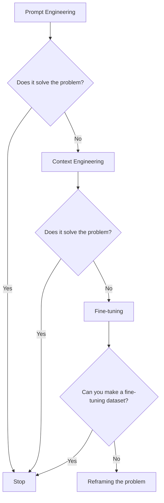
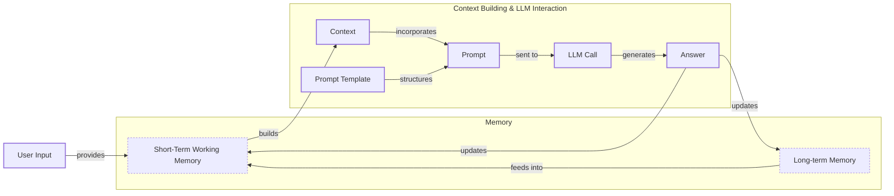
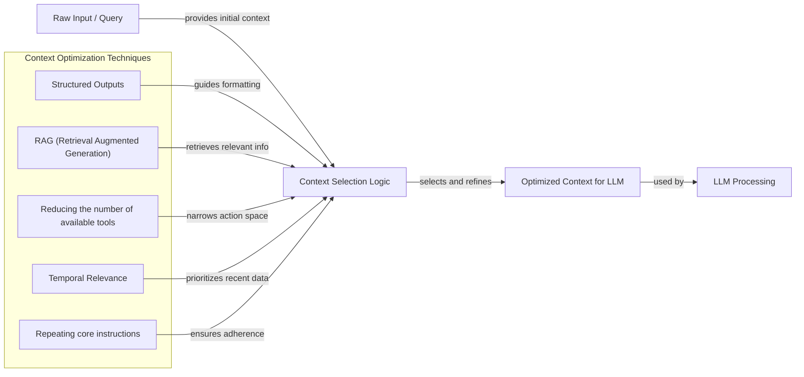
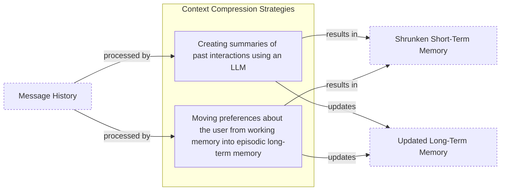
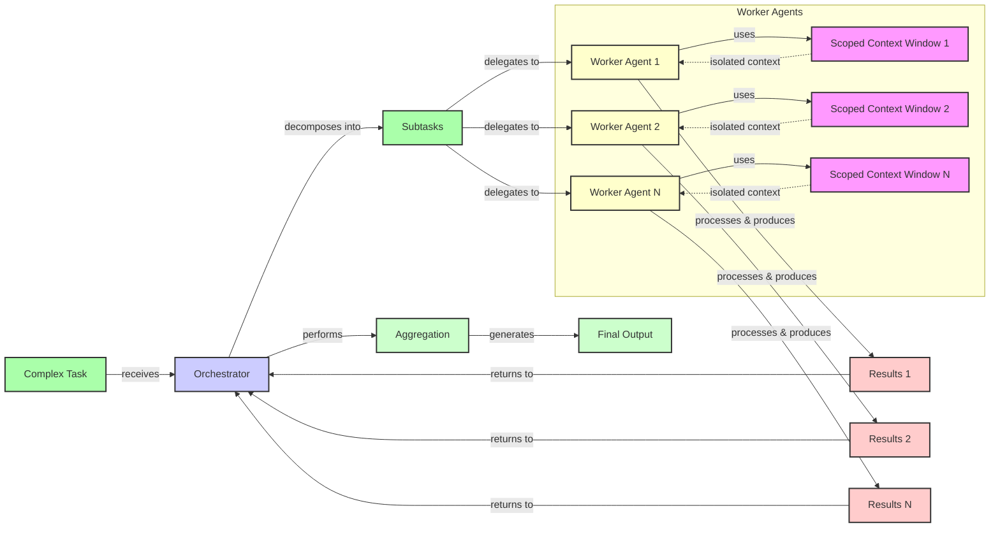

# Context Engineering: The #1 Skill for AI Engineers

AI applications have evolved rapidly. In 2022, we had simple chatbots for question-and-answering. By 2023, Retrieval-Augmented Generation (RAG) systems connected LLMs to domain-specific knowledge. 2024 brought us tool-using agents that could perform actions. Now, in 2025, we are building memory-enabled agents that remember past interactions and build relationships over time.

In our last lesson, we explored how to choose between AI agents and LLM workflows when designing a system. As these applications grow more complex, prompt engineering, a practice that once served us well, is showing its limits. It optimizes single LLM calls but fails when managing systems with memory, actions, and long interaction histories. The sheer volume of information an agent might need—past conversations, user data, documents, and action descriptions—has grown exponentially. Simply stuffing all this into a prompt is not a viable strategy.

This is where context engineering comes in. It is the discipline of orchestrating this entire information ecosystem to ensure the LLM gets exactly what it needs, when it needs it. This skill is becoming a core foundation for AI engineering, transforming how we build reliable and intelligent systems.

## From Prompt to Context Engineering

Prompt engineering, while effective for simple tasks, is designed for single, stateless interactions. It treats each call to an LLM as a new, isolated event. This approach breaks down in stateful applications where context must be preserved and managed across multiple turns.

As a conversation or task progresses, the context grows. Without a strategy to manage this growth, the LLM’s performance degrades. This is **context decay**: the model gets confused by the noise of an ever-expanding history. Information-theoretic limits are at play here; factors like positional under-training, encoding attenuation, and softmax crowding mean that as context size increases, the model's ability to ground itself in facts decays [[23]](https://arxiv.org/html/2511.12869v1). It starts to lose track of the original instructions or key information, leading to hallucinations and misguided answers [[22]](https://arxiv.org/pdf/2507.13334).

Even with large context windows, a physical limit exists for what you can include. Models get confused by long, messy contexts, and studies show that correctness can drop significantly once the context exceeds 32,000 tokens—long before advertised limits are reached [[1]](https://www.decodingai.com/p/context-engineering-2025s-1-skill). Also, on the operational side, every token adds to the cost and latency of an LLM call. Simply putting everything into the context creates a slow, expensive, and underperforming system. We will explore these concepts in more detail in upcoming lessons, including memory in Lesson 9 and RAG in Lesson 10.

We learned this the hard way on a recent project. We were working with a model that supported a two-million-token context window, so we thought, "*What could go wrong*?" We stuffed everything in: our research, guidelines, examples, and user history. The result was an LLM workflow that took 30 minutes to run and produced low-quality outputs.

This is where context engineering becomes essential. It shifts the focus from crafting static prompts to building dynamic systems that manage information flow. As an AI engineer, your job is to select only the most critical pieces of context for each LLM call. This makes your applications accurate, fast, and cost-effective.

## Understanding Context Engineering

Context engineering is about finding the best way to arrange parts of your application's memory into the context passed to an LLM to get the best results. It is a solution to an optimization problem where you retrieve the right parts from your short-term and long-term memory to solve a specific task without overwhelming the model [[22]](https://arxiv.org/pdf/2507.13334). For example, when you ask a cooking agent for a recipe, you do not give it the entire cookbook. Instead, you retrieve the specific recipe, along with personal context like allergies or taste preferences. This precise selection ensures the model receives only the essential information.

Andrej Karpathy offered a great analogy for this: LLMs are like a new kind of operating system, where the model acts as the CPU and its context window functions as the RAM [[2]](https://www.langchain.com/blog/context-engineering-for-agents/), [[1]](https://www.decodingai.com/p/context-engineering-2025s-1-skill). Just as an operating system manages what fits into RAM, context engineering curates what occupies the model’s working memory.

How does context engineering relate to prompt engineering? It's simple. Prompt engineering is a subset of context engineering. You still write effective prompts, but you also design a system that feeds the right context into them. This means understanding not just *how* to phrase a task, but *what* information the model needs to perform optimally [[22]](https://arxiv.org/pdf/2507.13334).

| Dimension | Prompt Engineering | Context Engineering |
| :--- | :--- | :--- |
| **Scope** | Single interaction optimization | Entire information ecosystem |
| **State Management** | Stateless function | Stateful due to memory |
| **Focus** | How to phrase tasks | What information to provide |

Table 1: A comparison of prompt engineering and context engineering.

Context engineering is the new fine-tuning. While fine-tuning has its place, it is expensive, time-consuming, and inflexible, making it a last resort [[3]](https://www.linkedin.com/posts/denis-panjuta_prompt-engineering-vs-context-engineering-activity-7363945251180322816-1q_m). For most use cases, you get better results faster and more cheaply with context engineering. It allows for rapid iteration and adaptation to evolving data without altering the core model.

When you start a new AI project, your decision-making process for guiding the LLM should follow a clear progression from simple to complex, as shown in Image 1.



Image 1: A flowchart illustrating the decision-making workflow for choosing an AI strategy.

For instance, if you build an agent to process internal Slack messages, you do not need to fine-tune a model on your company’s communication style. It is more effective to use a powerful reasoning model and engineer the context to retrieve specific messages and enable actions like creating tasks or drafting emails. Throughout this course, we will show you how to solve most industry problems using only context engineering.

## What Makes Up the Context

To master context engineering, you first need to understand what "context" actually is. It is everything the LLM sees in a single turn, dynamically assembled from various memory components before being passed to the model.

The high-level workflow, as presented in Image 2, begins when a user input triggers the system to pull relevant information from both long-term and short-term memory. This information is assembled into the final context, inserted into a prompt template, and sent to the LLM. The LLM’s answer then updates the memory, and the cycle repeats.



Image 2: A flowchart illustrating the high-level workflow of how context is built and passed to an LLM, highlighting the cyclical nature and interaction between memory types and the LLM call.

These components are grouped into two main categories. We will explain them intuitively for now, as we have future dedicated lessons for all of them.

### Short-Term Working Memory

Short-term working memory is the state of the agent for the current task or conversation. It is volatile and changes with each interaction, helping the agent maintain a coherent dialogue and make immediate decisions. It can include some or all of these components [[1]](https://www.decodingai.com/p/context-engineering-2025s-1-skill):

*   **User input:** The most recent query or command from the user, which initiates the agent's current reasoning cycle.
*   **Message history:** The log of the current conversation, allowing the LLM to understand the flow and previous turns.
*   **Agent's internal thoughts:** The reasoning steps the agent takes to decide on its next action, often referred to as a scratchpad or internal monologue.
*   **Action calls and outputs:** The results from any actions the agent has performed, providing information from external systems.

### Long-Term Memory

Long-term memory is more persistent and stores information across sessions, allowing the AI system to remember things beyond a single conversation. We divide it into three types, drawing parallels from human memory [[4]](https://www.datacamp.com/blog/how-does-llm-memory-work). An AI system can include some or all of them:

*   **Procedural memory:** This is knowledge encoded directly in the code. It includes the system prompt, which sets the agent's overall behavior. It also includes the definitions of available actions, which tell the agent what it can do, and schemas for structured outputs, which guide the format of its responses. Think of this as the agent's built-in skills [[1]](https://www.decodingai.com/p/context-engineering-2025s-1-skill).
*   **Episodic memory:** This is memory of specific past experiences, like user preferences or previous interactions. It's used to help the agent personalize its responses based on individual users. We typically store this in vector or graph databases for efficient retrieval [[1]](https://www.decodingai.com/p/context-engineering-2025s-1-skill).
*   **Semantic memory:** This is the agent’s general knowledge base. It can be internal, like company documents stored in a database, or external, accessed via the internet through API calls. This memory provides the factual information the agent needs to answer questions [[1]](https://www.decodingai.com/p/context-engineering-2025s-1-skill).

If this seems like a lot, bear with us. We will cover all these concepts in-depth in future lessons, including structured outputs (Lesson 4), tools (Lesson 6), memory (Lesson 9), RAG (Lesson 10), and working with multimodal data (Lesson 11).

 https://substackcdn.com/image/fetch/f_auto,q_auto:good,fl_progressive:steep/https%3A%2F%2Fsubstack-post-media.s3.amazonaws.com%2Fpublic%2Fimages%2F39dce26a-e51e-4167-ac9e-ca28c45b53a6_1115x708.png 
Image 3: A detailed illustration of how all the context engineering components work together inside an AI agent (Source [Decoding AI Magazine](https://www.decodingai.com/p/context-engineering-2025s-1-skill) [[1]](https://www.decodingai.com/p/context-engineering-2025s-1-skill))

The key takeaway is that these components are not static. They are dynamically re-computed for every single interaction. For each conversation turn or new task, the short-term memory grows, or the long-term memory can change. Context engineering involves knowing how to select the right pieces from this vast memory pool to construct the most effective prompt for the task at hand.

## Production Implementation Challenges

Now that we understand what makes up the context, let's look at the core challenges of implementing it in production. These challenges all revolve around a single question: *"How can I keep my context as small as possible while providing enough information to the LLM?"*

Here are five common issues that come up when building AI applications:

1.  **The context window challenge:** Every AI model has a limited context window, the maximum amount of information (tokens) it can process at once. Think of it like your computer's RAM. If your machine has only 32GB of RAM, that is all it can use at one time [[5]](https://www.comet.com/site/blog/context-window/). While context windows are getting larger, they are not infinite, and treating them as such leads to other problems.

2.  **Information overload:** Just because you can fit a lot of information into the context does not mean you should. Too much context reduces the performance of the LLM by confusing it. This is known as the "lost-in-the-middle" or "needle in the haystack" problem, where LLMs are known for remembering information best at the beginning and end of the context window [[6]](https://www.linkedin.com/pulse/lost-middle-lesson-failing-ai-agents-backwards-anthony-dejohn-01k2e). This happens due to computational effects like positional under-training and encoding attenuation that weaken the signal from middle-context tokens [[23]](https://arxiv.org/html/2511.12869v1). Information in the middle is often overlooked, and performance can drop long before the physical context limit is reached [[7]](https://dev.to/thousand_miles_ai/the-lost-in-the-middle-problem-why-llms-ignore-the-middle-of-your-context-window-3al2).

3.  **Context drift and poisoning:** Context drift occurs when conflicting versions of the truth accumulate over time. A more severe issue is **context poisoning**, where compromised, outdated, or irrelevant information enters the context window and is treated as truth [[24]](https://www.elastic.co/search-labs/blog/context-poisoning-llm). This can cause cascading errors, especially in long-horizon tasks where an agent might become fixated on an impossible goal based on early, poisoned information [[25]](https://www.dbreunig.com/2025/06/22/how-contexts-fail-and-how-to-fix-them.html).

4.  **Tool confusion:** The final challenge is tool confusion, which arises in two main ways. First, adding too many actions to an agent can confuse the LLM about the best one for the job. The Gorilla benchmark shows that nearly all models perform worse when given more than one tool [[1]](https://www.decodingai.com/p/context-engineering-2025s-1-skill). Second, confusion can occur when tool descriptions are poorly written or overlap. If the distinctions between actions are unclear, even a human would struggle to choose the right one.

5.  **Privacy and persistent memory:** When an agent uses episodic memory to remember user preferences across sessions, it creates a persistent, detailed profile of that user. This introduces a significant privacy challenge. Unlike a traditional data breach that might expose isolated transactions, a breach of an agent's memory could expose years of conversations, personal plans, and behavioral patterns, creating a comprehensive and sensitive user profile [[26]](https://arxiv.org/html/2508.07664v1), [[27]](https://ziptie.dev/blog/how-ai-remembers-your-content-across-sessions/).

## Key Strategies for Context Optimization

Initially, most AI applications were chatbots over single knowledge bases. Today, modern AI solutions must manage multiple knowledge bases, tools, and complex conversational histories. Context engineering is about managing this complexity while meeting performance, latency, and cost requirements.

Here are four popular context engineering strategies used across the industry:

### Selecting the Right Context

Retrieving the right information from memory is a critical first step. A common mistake is providing everything at once, which leads to poor performance from the "lost-in-the-middle" problem, plus increased latency and costs [[8]](https://atlan.com/know/llm-context-window-limitations/).

To solve this, consider these approaches:

*   **Use structured outputs:** Define clear schemas for what the LLM should return. This allows you to pass only the necessary, structured information to downstream steps. We will cover this in detail in Lesson 4.
*   **Use RAG:** Instead of providing entire documents, use RAG to fetch only the specific chunks of text needed to answer a user's question. This is a core topic we will explore in Lesson 10.
*   **Reduce the number of available actions:** Rather than giving an agent access to every available action, use strategies to delegate action subsets to specialized components. For example, a typical pattern is to leverage the orchestrator-worker pattern to delegate subtasks to specialized agents. Studies have shown that applying RAG to tool descriptions can improve tool selection accuracy threefold by keeping the selection under 30 tools [[9]](https://www.datacamp.com/blog/context-engineering).
*   **Rank time-sensitive data:** For time-sensitive information, rank it by date and filter out anything no longer relevant.
*   **Repeat core instructions:** For the most important instructions, repeat them at both the start and the end of the prompt. This uses the model's tendency to pay more attention to the context edges, ensuring core instructions are not lost [[10]](https://promptmetheus.com/resources/llm-knowledge-base/lost-in-the-middle-effect).
*   **Retrieve context just-in-time:** Instead of front-loading all possible information, give agents tools to retrieve context on demand. This allows the agent to explore and assemble understanding as needed [[11]](https://www.anthropic.com/engineering/effective-context-engineering-for-ai-agents), [[28]](https://www.firecrawl.dev/blog/context-engineering).



Image 4: A flowchart illustrating how various context optimization techniques work together to select the right context for an LLM.

### Context Compression

As message history grows in short-term working memory, you must manage past interactions to keep your context window in check. You cannot simply drop past conversation turns, as the LLM still needs to remember what happened. Instead, you need ways to compress key facts from the past.

You can do this through:

1.  **Creating summaries of past interactions:** Use an LLM to create summaries of old conversation turns, condensing a long history into a concise overview [[12]](https://www.dailydoseofds.com/llmops-crash-course-part-8/).
2.  **Moving user preferences to long-term memory:** Transfer user preferences from working memory to long-term episodic memory. This keeps the working context clean while ensuring preferences are remembered for future sessions [[1]](https://www.decodingai.com/p/context-engineering-2025s-1-skill).
3.  **Deduplication:** Remove redundant information from the context using techniques like MinHash to avoid repetition [[1]](https://www.decodingai.com/p/context-engineering-2025s-1-skill).

Beyond these techniques, emerging architectures like State-Space Models (SSMs) offer a different approach. SSMs compress prior context into a fixed-size hidden state, unlike Transformers which attend to every token. This makes them more efficient for managing extremely long histories [[29]](https://goombalab.github.io/blog/2025/tradeoffs/).



Image 5: A flowchart illustrating context compression strategies for managing message history in short-term working memory.

### Isolating Context

Another powerful strategy is to isolate context by splitting information across multiple agents or LLM workflows. This technique is similar to tool isolation but applies to the entire context. Instead of one agent with a massive, cluttered context window, you can have a team of agents, each with a smaller, focused context [[2]](https://www.langchain.com/blog/context-engineering-for-agents/).

We often implement this using an orchestrator-worker pattern, where a central orchestrator agent breaks down a problem and assigns sub-tasks to specialized worker agents [[13]](https://beam.ai/agentic-insights/multi-agent-orchestration-patterns-production). Each worker operates in its own isolated context, improving focus and allowing for parallel processing. We will cover this pattern in more detail in Lesson 5.



Image 6: A flowchart illustrating how context isolation can be achieved using the orchestrator-worker pattern.

### Format Optimization

Finally, the way you format the context matters. Models are sensitive to structure, and using clear delimiters can improve performance. Common strategies are to:

*   **Use XML tags:** Wrap different pieces of context in XML-like tags (e.g., `<user_query>`, `<documents>`). This helps the model distinguish between different types of information and makes it easier to reference context elements within the system prompt [[11]](https://www.anthropic.com/engineering/effective-context-engineering-for-ai-agents).
*   **Prefer YAML over JSON:** When providing structured data as input, YAML is often more token-efficient than JSON, which helps save space in your context window [[1]](https://www.decodingai.com/p/context-engineering-2025s-1-skill).
*   **Design for the KV cache:** A key strategy to reduce latency is designing context with the model's key-value cache in mind. By ordering context from most stable (system prompt) to most volatile (user query), you maximize cache reuse, cutting latency and cost [[30]](https://fp8.co/articles/Context-Engineering-for-AI-Agents).

You always have to understand what is passed to the LLM. Seeing exactly what occupies your context window at every step is key to mastering context engineering. This is usually done by properly monitoring your traces, tracking what happens at each step, and understanding the inputs and outputs [[14]](https://www.getmaxim.ai/articles/context-window-management-strategies-for-long-context-ai-agents-and-chatbots). As this is a significant step to go from PoC to production, we will have dedicated lessons on this.

## Here is an Example

Let's connect the theory and strategies discussed earlier with a concrete example. Consider these real-world scenarios:

*   **Healthcare:** An AI assistant accesses a patient's medical history, current symptoms, and relevant medical literature to suggest personalized diagnoses [[1]](https://www.decodingai.com/p/context-engineering-2025s-1-skill).
*   **Financial Services:** An agent might integrate with a company's Customer Relationship Management (CRM) system, calendars, and financial data to make decisions based on user preferences [[1]](https://www.decodingai.com/p/context-engineering-2025s-1-skill).
*   **Project Management:** An AI system can access enterprise tools like CRMs, Slack, Zoom, calendars, and task managers to automatically understand project requirements and update tasks.
*   **Content Creator Assistant:** An AI agent uses your research, past content, and personality traits to understand what and how to create a given piece of content.

Let's walk through a specific query to see context engineering in action with the healthcare assistant scenario. A user asks: `I have a headache. What can I do to stop it? I would prefer not to take any medicine.`

Before the LLM even sees this query, a context engineering system gets to work:

1.  It retrieves the user's patient history, known allergies, and lifestyle habits from an **episodic memory** store, often a vector or graph database [[1]](https://www.decodingai.com/p/context-engineering-2025s-1-skill).
2.  It queries a **semantic memory** of up-to-date medical literature for non-medicinal headache remedies [[1]](https://www.decodingai.com/p/context-engineering-2025s-1-skill).
3.  It assembles this information, along with the user's query and the conversation history, into a structured prompt.
4.  The prompt is sent to the LLM, which generates a personalized, safe, and relevant recommendation.
5.  The interaction is logged, and any new preferences are saved back to the user's episodic memory.

Here’s a simplified Python example showing how these components might be assembled into a complete system prompt. Notice the clear structure and ordering, using XML tags for clarity.

```python
SYSTEM_PROMPT = """
You are a helpful and cautious AI healthcare assistant. Your goal is to provide safe, non-medicinal advice. Do not provide medical diagnoses.

<INSTRUCTIONS>
1. Analyze the user's query and the provided context.
2. Use the patient history to understand their health profile and preferences.
3. Use the retrieved medical knowledge to form your recommendation.
4. If you lack sufficient information, ask clarifying questions.
5. Always prioritize safety and advise consulting a doctor for serious issues.
</INSTRUCTIONS>

<PATIENT_HISTORY>
{retrieved_patient_history}
</PATIENT_HISTORY>

<MEDICAL_KNOWLEDGE>
{retrieved_medical_articles}
</MEDICAL_KNOWLEDGE>

<CONVERSATION_HISTORY>
{formatted_chat_history}
</CONVERSATION_HISTORY>

<USER_QUERY>
{user_query}
</USER_QUERY>

Based on all the information above, provide a helpful response.
"""
```

Still, the key relies on the system around it that brings in the proper context to populate the system prompt. To build such a system, you need a robust tech stack. Here is a potential stack we recommend and will use throughout this course:

*   **LLM:** Gemini as a multimodal, reasoning, and cost-effective LLM API provider.
*   **Orchestration:** LangGraph for defining stateful, agentic workflows.
*   **Databases:** PostgreSQL, MongoDB, Redis, Qdrant, and Neo4j. Often, it is effective to keep it simple, as you can achieve much with only PostgreSQL or MongoDB.
*   **Observability:** Opik or LangSmith for evaluation and trace monitoring.

## Connecting Context Engineering to AI Engineering

Mastering context engineering is less about learning a specific algorithm and more about building intuition. It is the art of knowing how to structure prompts, what information to include, and how to order it for maximum impact. This skill helps you determine the minimal yet essential information an LLM needs to perform at its best.

This skill doesn't exist in a vacuum. It is a multidisciplinary practice that sits at the intersection of several key engineering fields:

1.  **AI Engineering:** Understanding LLMs, RAG, and AI agents is the foundation.
2.  **Software Engineering:** You need to build scalable and maintainable systems to aggregate context and wrap agents in robust APIs.
3.  **Data Engineering:** Constructing reliable data pipelines for RAG and other memory systems is critical.
4.  **MLOps:** Deploying agents on the right infrastructure and automating Continuous Integration/Continuous Deployment (CI/CD) makes them reproducible, observable, and scalable.

The hardware itself is also co-evolving with these needs. Companies are now designing custom AI accelerators specifically for large context windows and agentic workloads. For example, upcoming systems like SambaNova’s SN50 and Positron's Titan are being built to handle context lengths of over 10 million tokens, promising to reshape the physical constraints that guide our context engineering strategies today [[31]](https://aimultiple.com/ai-chip-makers).

Our goal with this course is to teach you how to combine these skills to build production-ready AI products. We like to say that in the world of AI, we should all think in systems rather than isolated components, having a mindset shift from developers to architects.

In the next lesson, we will explore structured outputs. This technique is a cornerstone of context engineering, allowing us to control how information flows out of the LLM and into other parts of our system.

## References

- [1] Iusztin, P. (2025). *Context Engineering: 2025’s #1 Skill in AI*. Decoding AI Magazine. [https://www.decodingai.com/p/context-engineering-2025s-1-skill](https://www.decodingai.com/p/context-engineering-2025s-1-skill)
- [2] The LangChain Team. (2025). *Context Engineering for Agents*. LangChain Blog. [https://blog.langchain.com/context-engineering-for-agents/](https://blog.langchain.com/context-engineering-for-agents/)
- [3] Panjuta, D. (2025). *Prompt Engineering vs. Context Engineering*. LinkedIn. [https://www.linkedin.com/posts/denis-panjuta_prompt-engineering-vs-context-engineering-activity-7363945251180322816-1q_m](https://www.linkedin.com/posts/denis-panjuta_prompt-engineering-vs-context-engineering-activity-7363945251180322816-1q_m)
- [4] DataCamp. (n.d.). *How Does LLM Memory Work?*. [https://www.datacamp.com/blog/how-does-llm-memory-work](https://www.datacamp.com/blog/how-does-llm-memory-work)
- [5] Comet. (2025). *Context Window: What It Is and Why It Matters for AI Agents*. [https://www.comet.com/site/blog/context-window/](https://www.comet.com/site/blog/context-window/)
- [6] DeJohn, A. (n.d.). *Lost in the Middle: A Lesson in Failing AI Agents Backwards*. LinkedIn. [https://www.linkedin.com/pulse/lost-middle-lesson-failing-ai-agents-backwards-anthony-dejohn-01k2e](https://www.linkedin.com/pulse/lost-middle-lesson-failing-ai-agents-backwards-anthony-dejohn-01k2e)
- [7] thousand_miles_ai. (n.d.). *The "Lost in the Middle" Problem: Why LLMs ignore the middle of your context window*. dev.to. [https://dev.to/thousand_miles_ai/the-lost-in-the-middle-problem-why-llms-ignore-the-middle-of-your-context-window-3al2](https://dev.to/thousand_miles_ai/the-lost-in-the-middle-problem-why-llms-ignore-the-middle-of-your-context-window-3al2)
- [8] Atlan. (2026). *LLM Context Window Limitations: Impacts, Risks, & Fixes in 2026*. [https://atlan.com/know/llm-context-window-limitations/](https://atlan.com/know/llm-context-window-limitations/)
- [9] DataCamp. (n.d.). *Context Engineering: A Guide With Examples*. [https://www.datacamp.com/blog/context-engineering](https://www.datacamp.com/blog/context-engineering)
- [10] Promptmetheus. (n.d.). *Lost-in-the-Middle Effect*. [https://promptmetheus.com/resources/llm-knowledge-base/lost-in-the-middle-effect](https://promptmetheus.com/resources/llm-knowledge-base/lost-in-the-middle-effect)
- [11] Anthropic. (n.d.). *Effective context engineering for AI agents*. [https://www.anthropic.com/engineering/effective-context-engineering-for-ai-agents](https://www.anthropic.com/engineering/effective-context-engineering-for-ai-agents)
- [12] Daily Dose of Data Science. (n.d.). *LLMOps Crash Course Part 8*. [https://www.dailydoseofds.com/llmops-crash-course-part-8/](https://www.dailydoseofds.com/llmops-crash-course-part-8/)
- [13] Beam.ai. (2026). *6 Multi-Agent Orchestration Patterns That Actually Work in Production*. [https://beam.ai/agentic-insights/multi-agent-orchestration-patterns-production](https://beam.ai/agentic-insights/multi-agent-orchestration-patterns-production)
- [14] Maxim. (n.d.). *Context Window Management Strategies for Long-Context AI Agents and Chatbots*. [https://www.getmaxim.ai/articles/context-window-management-strategies-for-long-context-ai-agents-and-chatbots/](https://www.getmaxim.ai/articles/context-window-management-strategies-for-long-context-ai-agents-and-chatbots/)
- [15] Galileo. (n.d.). *Production LLM Monitoring Strategies*. [https://galileo.ai/blog/production-llm-monitoring-strategies](https://galileo.ai/blog/production-llm-monitoring-strategies)
- [22] Mei, L., et al. (2025). *A Survey of Context Engineering for Large Language Models*. arXiv. [https://arxiv.org/pdf/2507.13334](https://arxiv.org/pdf/2507.13334)
- [23] Anonymous. (2025). *On the Information-Theoretic Limitations of Large Language Models*. arXiv. [https://arxiv.org/html/2511.12869v1](https://arxiv.org/html/2511.12869v1)
- [24] Elastic. (n.d.). *Context Poisoning an LLM*. [https://www.elastic.co/search-labs/blog/context-poisoning-llm](https://www.elastic.co/search-labs/blog/context-poisoning-llm)
- [25] Breunig, D. (2025). *How Contexts Fail (and How To Fix Them)*. [https://www.dbreunig.com/2025/06/22/how-contexts-fail-and-how-to-fix-them.html](https://www.dbreunig.com/2025/06/22/how-contexts-fail-and-how-to-fix-them.html)
- [26] Anonymous. (2025). *"It's a very personal relationship": User Mental Models of LLM Memory and Privacy*. arXiv. [https://arxiv.org/html/2508.07664v1](https://arxiv.org/html/2508.07664v1)
- [27] Ziptie. (n.d.). *How AI Remembers Your Content Across Sessions*. [https://ziptie.dev/blog/how-ai-remembers-your-content-across-sessions/](https://ziptie.dev/blog/how-ai-remembers-your-content-across-sessions/)
- [28] Firecrawl. (n.d.). *Context Engineering: The Missing Piece in Your Agentic AI Stack*. [https://www.firecrawl.dev/blog/context-engineering](https://www.firecrawl.dev/blog/context-engineering)
- [29] Goomba Lab. (2025). *Tradeoffs in AI*. [https://goombalab.github.io/blog/2025/tradeoffs/](https://goombalab.github.io/blog/2025/tradeoffs/)
- [30] FP8. (n.d.). *Context Engineering for AI Agents*. [https://fp8.co/articles/Context-Engineering-for-AI-Agents](https://fp8.co/articles/Context-Engineering-for-AI-Agents)
- [31] AIMultiple. (n.d.). *Top 20+ AI Chip Makers in 2026: In-depth Guide*. [https://aimultiple.com/ai-chip-makers](https://aimultiple.com/ai-chip-makers)