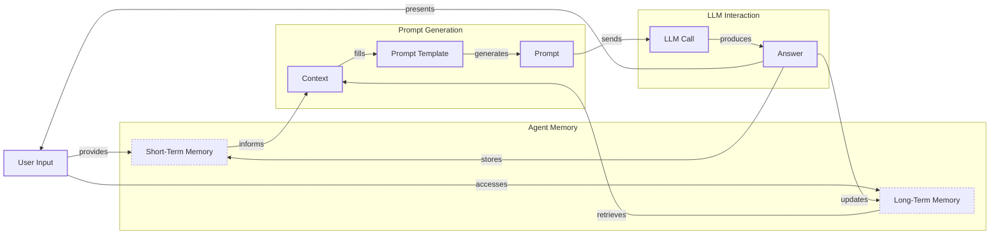
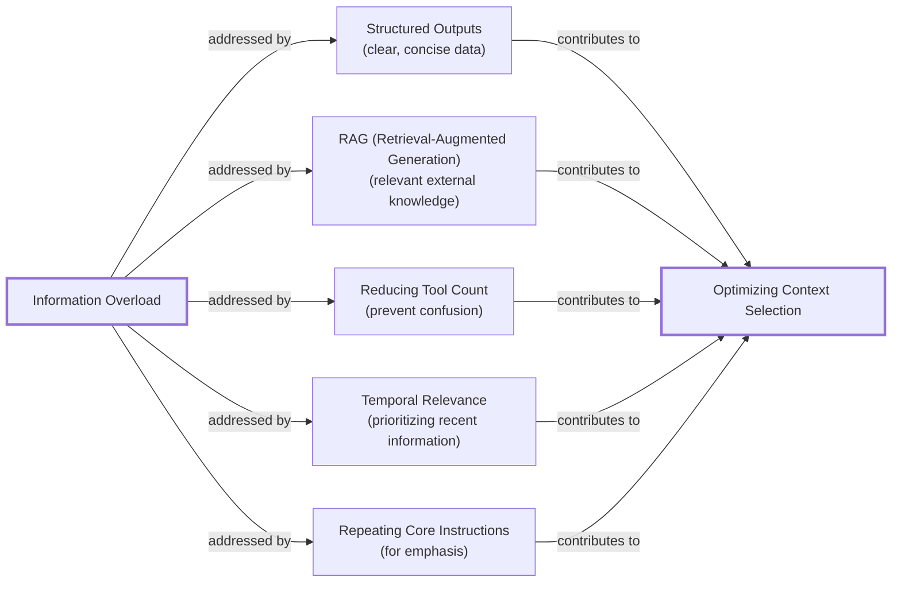
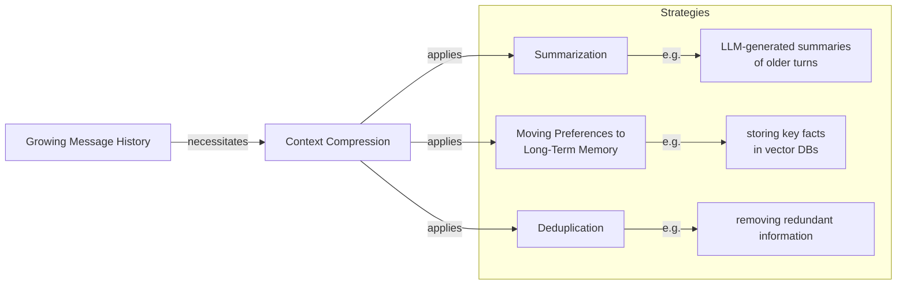
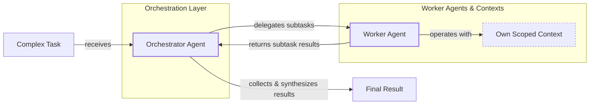

# Lesson 3: Context Engineering

AI applications have evolved rapidly. In 2022, we had simple chatbots, followed by Retrieval-Augmented Generation (RAG) systems in 2023. 2024 brought tool-using agents, and now, we build memory-enabled agents that remember past interactions. In our last lesson, we explored choosing between AI agents and LLM workflows. As applications grow more complex, prompt engineering shows its limits. It fails when managing systems with memory and long interaction histories. The volume of information an agent might need has grown exponentially. Stuffing it all into a prompt is not a viable strategy. Context engineering orchestrates this information ecosystem to ensure the LLM gets exactly what it needs [[1]](https://www.securityindustry.org/2024/07/16/understanding-the-evolution-from-classic-chatbots-to-rag-chatbots-to-ai-powered-assistants/), [[2]](https://blog.langchain.com/the-rise-of-context-engineering/).

## From prompt to context engineering

Prompt engineering is designed for single, stateless interactions, treating each LLM call as an isolated event. This approach breaks down in stateful applications where context must be managed across multiple turns [[3]](https://www.decodingai.com/p/context-engineering-2025s-1-skill).

As a conversation progresses, the context grows, and performance degrades. This is context decay: the model gets confused by the noise of an expanding history and loses track of key information [[4]](https://www.trychroma.com/research/context-rot).

Even with large context windows, every token adds to cost and latency. On a recent project, we stuffed everything into the context, resulting in a 30-minute run time. This naive approach is a recipe for failure. Context engineering shifts the focus to building dynamic systems that manage this information flow [[3]](https://www.decodingai.com/p/context-engineering-2025s-1-skill).

## Understanding context engineering

Context engineering is an optimization problem: finding the ideal way to assemble a context that maximizes the quality of the LLM's output for a given task. To put it simply, it is about strategically filling the model’s limited context window with the right information, at the right time, and in the right format. When you ask a cooking agent for a recipe, you do not give it the entire cookbook. Instead, you retrieve the specific recipe, along with personal context like allergies [[16]](https://arxiv.org/pdf/2507.13334).

Andrej Karpathy offered a great analogy: LLMs are like a new kind of operating system, where the model acts as the CPU and its context window functions as the RAM. Just as an operating system manages what fits into RAM, context engineering curates what occupies the model’s working memory [[5]](https://x.com/karpathy/status/1937902205765607626).

Prompt engineering is a subset of context engineering. You still need to write good prompts, but you also design a system that gathers the right context to feed into them [[3]](https://www.decodingai.com/p/context-engineering-2025s-1-skill).

| Dimension | Prompt Engineering | Context Engineering |
| --- | --- | --- |
| Scope | Single interaction optimization | Entire information ecosystem |
| State Management | Primarily stateless | Inherently stateful, with explicit memory management |
| Focus | How to phrase tasks | What information to provide |

Table 1: A comparison of prompt engineering and context engineering.

Context engineering is the new fine-tuning. While fine-tuning has its place, it is expensive and inflexible. For most enterprise use cases, you get better results faster and more cheaply with context engineering. When you start a new AI project, your decision-making process for guiding the LLM should look like the one in Image 1. For instance, to process internal Slack messages, you do not need to fine-tune a model. It is more effective to use context engineering to retrieve specific messages and enable actions. Throughout this course, we will show you how to solve most industry problems using only this approach [[6]](https://www.linkedin.com/posts/denis-panjuta_prompt-engineering-vs-context-engineering-activity-7363945251180322816-1q_m).

```mermaid
graph TD
    start["Start"] --> prompt_eng["Prompt Engineering"]
    prompt_eng --> prompt_insufficient{"Prompt Engineering Insufficient?"}
    prompt_insufficient -- "No" --> end["Application Built"]
    prompt_insufficient -- "Yes" --> context_eng["Context Engineering"]
    context_eng --> context_insufficient{"Context Engineering Insufficient?"}
    context_insufficient -- "No" --> end
    context_insufficient -- "Yes" --> fine_tuning["Fine-tuning"]
    fine_tuning --> end
```
Image 1: A simplified flowchart illustrating the decision-making workflow for building AI applications.

## What makes up the context

To master context engineering, you must understand what "context" is. It is everything the LLM sees in a single turn, dynamically assembled from various memory components.

The high-level workflow, presented in Image 2, begins when user input triggers the system to pull information from memory. This is assembled into the final context, inserted into a prompt template, and sent to the LLM. The LLM’s answer then updates the memory, and the cycle repeats.


Image 2: A simplified flowchart depicting the high-level workflow of an AI application.

These components are grouped into two main categories. We will cover them in-depth in future lessons.

**Short-term working memory** is the state of the agent for the current task. It is volatile and helps the agent maintain a coherent dialogue. It includes the user input, message history, agent's internal thoughts, and outputs from any actions performed [[8]](https://www.langchain.com/blog/context-engineering-for-agents/).

**Long-term memory** is more persistent and stores information across sessions. We divide it into three types, drawing parallels from human memory [[7]](https://www.datacamp.com/blog/how-does-llm-memory-work):
*   **Procedural memory:** This is knowledge encoded in the code, like the system prompt that sets the agent's behavior and the definitions of available actions.
*   **Episodic memory:** This is memory of specific past experiences, like user preferences, often stored in vector or graph databases for personalization.
*   **Semantic memory:** This is the agent’s general knowledge base, such as company documents or external data accessed via APIs. This is the core of RAG.

https://substackcdn.com/image/fetch/$s_!hR60!,w_1456,c_limit,f_auto,q_auto:good,fl_progressive:steep/https%3A%2F%2Fsubstack-post-media.s3.amazonaws.com%2Fpublic%2Fimages%2F39dce26a-e51e-4167-ac9e-ca28c45b53a6_1115x708.png
Image 3: An illustration of how context engineering components work together inside an AI agent. (Source [Decoding AI Magazine](https://www.decodingai.com/p/context-engineering-2025s-1-skill) [[3]](https://www.decodingai.com/p/context-engineering-2025s-1-skill))

The key takeaway is that these components are dynamic. Context engineering involves selecting the right pieces from this memory pool to construct the most effective prompt.

## Production implementation challenges

Now that we understand what makes up the context, let's look at the core challenges of implementing it in production. These all revolve around a single question: "How can I keep my context as small as possible while providing enough information to the LLM?"

Here are four common issues that come up when building AI applications:

1.  **The context window challenge:** Every model has a limited context window, the maximum amount of information it can process at once. This is analogous to a computer's RAM. While context windows are getting larger, they are not infinite, and treating them as such leads to other problems [[3]](https://www.decodingai.com/p/context-engineering-2025s-1-skill).
2.  **Information overload:** Just because you can fit a lot of information into the context does not mean you should. Too much context confuses the model. This is the "lost-in-the-middle" problem, where models remember information best at the beginning and end of the context. Information in the middle is often overlooked, and performance can drop long before the limit is reached [[10]](https://www.linkedin.com/pulse/lost-middle-lesson-failing-ai-agents-backwards-anthony-dejohn-01k2e).
3.  **Context drift:** This occurs when conflicting versions of the truth accumulate in the memory over time. For example, the memory might contain both "The user's budget is $500" and later "The user's budget is $1,000," which can confuse the agent [[9]](https://galileo.ai/blog/production-llm-monitoring-strategies).
4.  **Tool confusion:** This arises when an agent is given too many tools, especially with poorly written descriptions or overlapping functionalities. The agent gets paralyzed by choice or picks the wrong tool, leading to failed tasks [[3]](https://www.decodingai.com/p/context-engineering-2025s-1-skill).

## Key strategies for context optimization

Modern AI solutions must manage complexity across multiple knowledge bases and tools. Context engineering is about managing this complexity while meeting performance, latency, and cost requirements. Here are four popular strategies.

### Selecting the Right Context

Retrieving the right information is a critical first step. A common mistake is to provide everything at once. To solve this, use structured outputs to pass only necessary data downstream. Use RAG to fetch specific text chunks instead of entire documents. Reduce the number of available actions to prevent tool confusion; studies show limiting the selection can improve accuracy. For time-sensitive information, rank it by date. For the most important instructions, repeat them at the start and end of the prompt to address the "lost-in-the-middle" problem [[11]](https://promptmetheus.com/resources/llm-knowledge-base/lost-in-the-middle-effect).


Image 4: A diagram illustrating strategies for selecting the right context to combat information overload.

### Context Compression

As message history grows, you must manage past interactions to keep your context window in check. You cannot simply drop past conversation turns. Instead, you need to compress key facts. You can do this by using an LLM to create summaries of past interactions, moving user preferences to long-term memory, or using deduplication techniques to remove redundant information [[12]](https://oneuptime.com/blog/post/2026-01-30-context-compression/view).


Image 5: A diagram illustrating strategies for Context Compression.

### Isolating Context

Another powerful strategy is to isolate context by splitting information across multiple agents. Instead of one agent with a massive, cluttered context window, you can have a team of agents, each with a smaller, focused context. We often implement this using an orchestrator-worker pattern, where a central agent breaks down a problem and assigns sub-tasks to specialized workers. This improves focus and allows for parallel processing [[13]](https://beam.ai/agentic-insights/multi-agent-orchestration-patterns-production).


Image 6: A simplified diagram illustrating the Orchestrator-Worker Pattern for Isolating Context.

### Format Optimization

Finally, the way you format the context matters. Models are sensitive to structure. Using clear delimiters like XML tags helps the model distinguish between different information types, improving reasoning reliability. When providing structured data, YAML is often more token-efficient than JSON, which helps save space. Seeing exactly what occupies your context window at every step is key, which is why monitoring your application is so important [[3]](https://www.decodingai.com/p/context-engineering-2025s-1-skill).

## Here is an example

Let's connect theory with a concrete example. Consider these real-world scenarios:
*   **Healthcare:** An AI assistant accesses a patient's medical history and the latest medical literature to provide personalized diagnostic support [[3]](https://www.decodingai.com/p/context-engineering-2025s-1-skill).
*   **Financial Services:** AI systems integrate with enterprise tools like Customer Relationship Management (CRM) systems and real-time market data to generate tailored financial advice [[14]](https://www.glean.com/blog/context-engineering-ai-the-foundation-of-reliable-high-performing-models).
*   **Project Management:** AI systems access enterprise tools like Slack and task managers to automatically understand and update project tasks.

Let's walk through the healthcare assistant scenario. A user asks: `I have a headache. What can I do to stop it? I would prefer not to take any medicine.`

Before the AI answers, a context engineering system gets to work:
1.  It retrieves the user's patient history and preferences from episodic memory.
2.  It queries a medical database for non-medicinal headache remedies from semantic memory.
3.  It assembles this information into a structured prompt.
4.  It calls the LLM, which generates a personalized recommendation.
5.  It logs the interaction and saves any new preferences back to memory.

Here is a simplified snippet showing how the final context sent to the LLM might be structured, using XML for clarity and YAML for data efficiency.

```xml
<system_prompt>
You are a helpful and cautious AI healthcare assistant...
</system_prompt>

<patient_history>
patient:
  name: John Doe
  age: 45
  preferences:
    medication_avoidance: true
  habits:
    stress_level: high
</patient_history>

<medical_knowledge>
articles:
  - topic: dehydration_headaches
    finding: "Dehydration is a common cause..."
  - topic: stress_relief
    finding: "Stress-relief techniques are effective..."
</medical_knowledge>

<user_query>
I have a headache. What can I do to stop it? I would prefer not to take any medicine.
</user_query>
```

To build such a system, you would use a combination of tools. An LLM like Gemini provides the reasoning. A framework like LangGraph orchestrates the workflow. Databases such as PostgreSQL or Qdrant serve as long-term memory, and observability platforms are essential for debugging [[15]](https://blog.stackademic.com/context-engineering-in-llms-and-ai-agents-eb861f0d3e9b).

## Connecting context engineering to AI engineering

Mastering context engineering is less about learning a specific algorithm and more about building intuition. It is the art of knowing how to structure prompts, what information to include, and how to order it for maximum impact.

This skill does not exist in a vacuum. It is a multidisciplinary practice that sits at the intersection of several key engineering fields [[3]](https://www.decodingai.com/p/context-engineering-2025s-1-skill):
1.  **AI Engineering:** Understanding LLMs, RAG, and AI agents is the foundation.
2.  **Software Engineering:** You need to build scalable and maintainable systems to aggregate context.
3.  **Data Engineering:** Constructing reliable data pipelines for memory systems is critical.
4.  **Operations:** Deploying agents on the right infrastructure makes them reproducible and observable.

Our goal with this course is to teach you how to combine these skills to build production-ready AI products. In the next lesson, we will explore structured outputs, a key technique for controlling what comes *out* of an LLM.

## References

- [1] https://www.securityindustry.org/2024/07/16/understanding-the-evolution-from-classic-chatbots-to-rag-chatbots-to-ai-powered-assistants/
- [2] https://blog.langchain.com/the-rise-of-context-engineering/
- [3] https://www.decodingai.com/p/context-engineering-2025s-1-skill
- [4] https://www.trychroma.com/research/context-rot
- [5] https://x.com/karpathy/status/1937902205765607626
- [6] https://www.linkedin.com/posts/denis-panjuta_prompt-engineering-vs-context-engineering-activity-7363945251180322816-1q_m
- [7] https://www.datacamp.com/blog/how-does-llm-memory-work
- [8] https://www.langchain.com/blog/context-engineering-for-agents/
- [9] https://galileo.ai/blog/production-llm-monitoring-strategies
- [10] https://www.linkedin.com/pulse/lost-middle-lesson-failing-ai-agents-backwards-anthony-dejohn-01k2e
- [11] https://promptmetheus.com/resources/llm-knowledge-base/lost-in-the-middle-effect
- [12] https://oneuptime.com/blog/post/2026-01-30-context-compression/view
- [13] https://beam.ai/agentic-insights/multi-agent-orchestration-patterns-production
- [14] https://www.glean.com/blog/context-engineering-ai-the-foundation-of-reliable-high-performing-models
- [15] https://blog.stackademic.com/context-engineering-in-llms-and-ai-agents-eb861f0d3e9b
- [16] https://arxiv.org/pdf/2507.13334