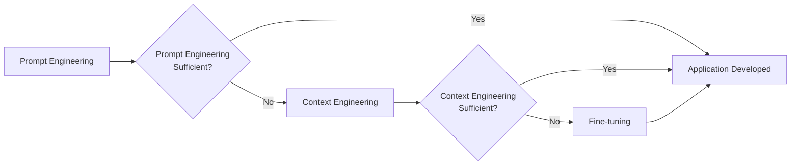
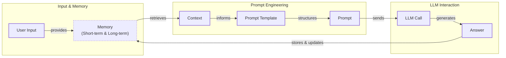
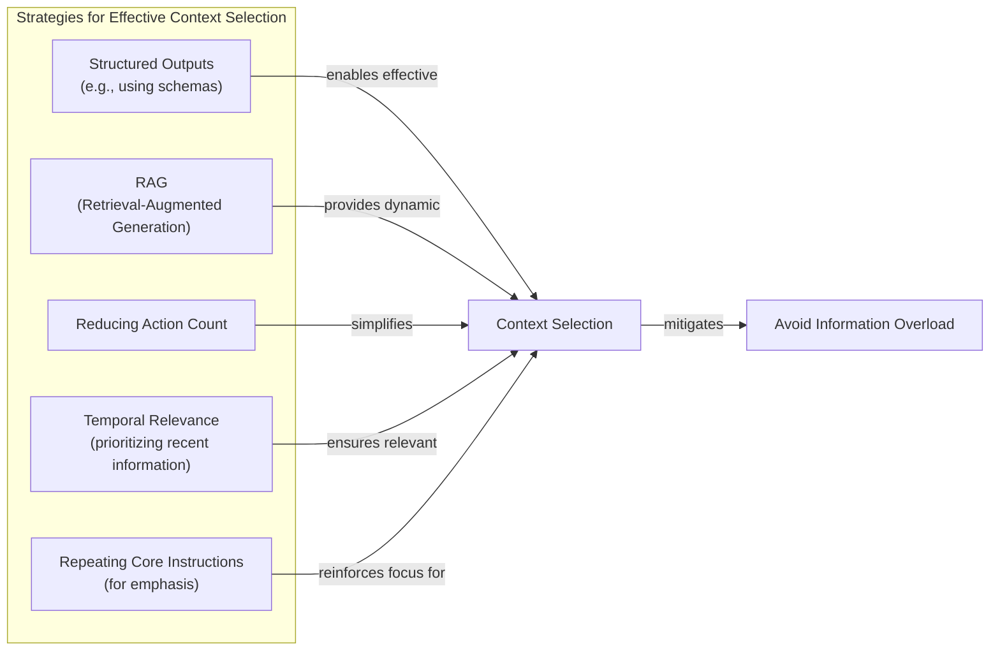
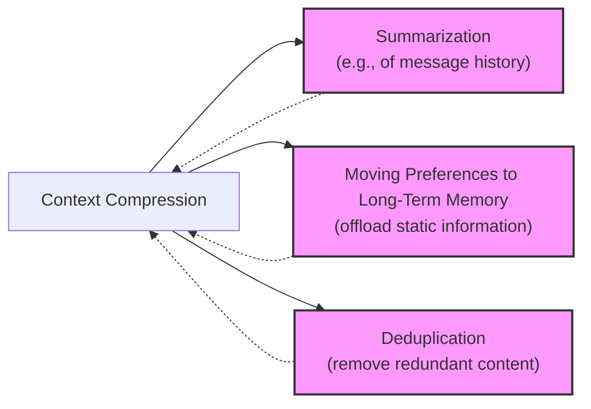
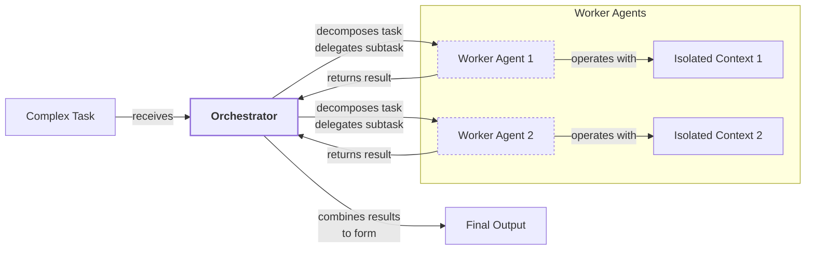

# Lesson 3: Context Engineering

## Introduction

AI applications have evolved rapidly from simple chatbots to memory-enabled agents that can perform actions [[1]](https://www.securityindustry.org/2024/07/16/understanding-the-evolution-from-classic-chatbots-to-rag-chatbots-to-ai-powered-assistants/), [[2]](https://pagergpt.ai/ai-chatbot/evolution-of-ai-chatbots). In our last lesson, we explored the difference between AI agents and LLM workflows. As these systems grow more complex, the practice of prompt engineering—optimizing single LLM calls—is showing its limits. The sheer volume of information an agent might need has grown exponentially. This lesson introduces context engineering, the discipline of orchestrating this entire information ecosystem to ensure the LLM gets exactly what it needs, when it needs it.

## When prompt engineering breaks

Prompt engineering, while effective for simple tasks, is designed for single, stateless interactions. It treats each call to an LLM as a new, isolated event. This approach breaks down in stateful applications where context must be preserved and managed across multiple turns. As a conversation or task progresses, the context grows. Without a strategy to manage this growth, the LLM’s performance degrades. This is context decay: the model gets confused by the noise of an ever-expanding history and starts to lose track of the original instructions or key information. Now that we understand the problem, let's look at why it's important to solve it.

## From prompt to context engineering

Even with large context windows, a physical limit exists. Operationally, every token adds to the cost and latency of an LLM call. Simply putting everything into the context creates a slow, expensive, and underperforming system. We will explore these concepts in more detail in future lessons.

On a recent project, we learned this the hard way. We stuffed everything into a million-token context window and the result was a workflow that took 30 minutes to run and produced low-quality outputs [[4]](https://www.trychroma.com/research/context-rot).

Context engineering shifts the focus from static prompts to dynamic systems that manage information flow. Your job is to select the most critical context for each LLM call, making applications accurate, fast, and cost-effective [[5]](https://www.mezmo.com/learn-observability/context-engineering-for-observability-how-to-deliver-the-right-data-to-llms).

## Understanding context engineering

Context engineering is the practice of arranging information from your application's memory into the context passed to an LLM [[6]](https://www.llamaindex.ai/blog/context-engineering-what-it-is-and-techniques-to-consider). It is an optimization problem where you retrieve the right parts from memory to solve a task without overwhelming the model. For example, a cooking agent retrieves a specific recipe and your allergies, not the entire cookbook.

Andrej Karpathy explains that LLMs are like a new kind of operating system where the model is the CPU and its context window is the RAM [[7]](https://x.com/karpathy/status/1937902205765607626). Context engineering manages what information occupies the model’s limited context window, much like an OS manages RAM [[8]](https://blog.langchain.com/context-engineering-for-agents/).

Prompt engineering is a subset of context engineering. You still write effective prompts, but you also design a system that feeds the right context into them.

| Dimension | Prompt Engineering | Context Engineering |
| --- | --- | --- |
| Scope | Single interaction optimization | Entire information ecosystem |
| State Management | Stateless function | Stateful due to memory |
| Focus | How to phrase tasks | What information to provide |

Table 1: A comparison of prompt engineering and context engineering.

Context engineering is the new fine-tuning. While fine-tuning has its place, it is expensive and inflexible. For most enterprise use cases, you get better results faster and more cheaply with context engineering [[9]](https://www.linkedin.com/posts/denis-panjuta_prompt-engineering-vs-context-engineering-activity-7363945251180322816-1q_m). When starting a new AI project, your decision-making process should follow the workflow in Image 1.


Image 1: A simplified flowchart illustrating the decision-making workflow for AI application development.

For instance, an agent processing Slack messages needs engineered context to retrieve specific messages, not a fine-tuned model. Throughout this course, we will focus on solving problems using context engineering.

## What makes up the context

The "context" is everything the LLM sees in a single turn, dynamically assembled from various memory components. The high-level workflow, shown in Image 2, starts when user input triggers the system to pull information from memory. This is assembled into the final context, placed in a prompt template, and sent to the LLM. The model's answer then updates the memory, and the cycle repeats.


Image 2: A simplified flowchart illustrating the high-level workflow of an AI application.

These components are grouped into two main categories.

**Short-term working memory** is the agent's state for the current task. It is volatile and includes user input, message history, internal thoughts, and action outputs, helping maintain a coherent dialogue [[10]](https://atlan.com/know/working-memory-llms/).

**Long-term memory** stores information across sessions. Drawing parallels from human memory, we divide it into three types [[11]](https://www.datacamp.com/blog/how-does-llm-memory-work):
*   **Procedural memory:** Knowledge encoded in the code, like the system prompt and action definitions.
*   **Episodic memory:** Memory of specific experiences, like user preferences, stored in databases.
*   **Semantic memory:** The agent’s general knowledge base, from internal documents or external APIs.

This parallel is not just an analogy; research integrates principles from human episodic memory to help LLMs handle vast contexts [[12]](https://openreview.net/forum?id=BI2int5SAC). We will cover these concepts in future lessons. Context engineering involves selecting the right pieces from this memory pool for each interaction.

## Production implementation challenges

Implementing context engineering in production presents several challenges, all centered on keeping the context small yet informative. Here are four common issues:

### The context window challenge
Every model has a limited context window. In long-running tasks, this limit is quickly reached as interaction history accumulates, causing other problems [[13]](https://samaya.ai/blog/lost-in-the-maze-overcoming-context-limitations-in-long-horizon-agentic-search).

### Information overload
Too much context degrades performance. This "lost-in-the-middle" problem occurs because models attend best to the beginning and end of the context, often ignoring information in the middle long before the physical limit is reached [[14]](https://www.linkedin.com/pulse/lost-middle-lesson-failing-ai-agents-backwards-anthony-dejohn-01k2e), [[4]](https://www.trychroma.com/research/context-rot).

### Context drift
Conflicting information can accumulate in memory over time, confusing the LLM and making its responses unreliable [[15]](https://galileo.ai/blog/production-llm-monitoring-strategies).

### Action confusion
An agent with too many actions, or with poorly described or overlapping ones, will struggle to choose the correct one for a given task [[3]](https://www.getmaxim.ai/articles/context-window-management-strategies-for-long-context-ai-agents-and-chatbots/).

## Key strategies for context optimization

Modern AI solutions must manage complexity across multiple knowledge bases, actions, and conversational histories. Context engineering is about managing this complexity while meeting performance, latency, and cost requirements. Here are four popular strategies:

### Selecting the Right Context
To avoid information overload, use structured outputs to define what the LLM should return, use RAG to fetch only specific text chunks, and reduce the number of available actions [[16]](https://arxiv.org/pdf/2507.13334), [[3]](https://www.getmaxim.ai/articles/context-window-management-strategies-for-long-context-ai-agents-and-chatbots/). For time-sensitive data, rank it by date. You can also repeat core instructions at the start and end of the prompt to use the model's inherent bias toward early and late tokens, ensuring they are not lost [[17]](https://promptmetheus.com/resources/llm-knowledge-base/lost-in-the-middle-effect).


Image 3: A simplified Mermaid diagram illustrating strategies for selecting the right context to avoid information overload.

### Context Compression
As message history grows, you must manage it to keep the context window in check. This requires a careful balance, as overly aggressive compression loses key information while being too lenient reduces efficiency gains [[18]](https://liner.com/review/acon-optimizing-context-compression-for-longhorizon-llm-agents). Common methods include creating summaries, moving preferences to long-term memory, or removing redundant information [[19]](https://oneuptime.com/blog/post/2026-01-30-context-compression/view), [[20]](https://www.dailydoseofds.com/llmops-crash-course-part-8/).


Image 4: A simplified Mermaid diagram illustrating key strategies for context compression, including Summarization, Moving Preferences to Long-Term Memory, and Deduplication.

### Isolating Context
Another powerful strategy is to isolate context by splitting information across multiple agents. Instead of one agent with a massive context, you can have a team of agents, each with a smaller, focused one. We often implement this using an orchestrator-worker pattern, where a central agent assigns sub-tasks to specialized workers [[21]](https://beam.ai/agentic-insights/multi-agent-orchestration-patterns-production), [[22]](https://gurusup.com/blog/multi-agent-orchestration-guide).


Image 5: A simplified Mermaid diagram illustrating the "Orchestrator-Worker" pattern for isolating context in multi-agent systems.

### Format Optimizations
The way you format the context matters. Models are sensitive to structure, and using clear delimiters can improve performance. Common strategies are to use XML tags to wrap different pieces of context or prefer YAML over JSON for structured data, as it is often more token-efficient [[23]](https://www.anthropic.com/engineering/effective-context-engineering-for-ai-agents).

Ultimately, you always have to understand what is passed to the LLM. Seeing exactly what occupies your context window at every step is key to mastering context engineering.

## Here is an example

Let's connect these ideas with a concrete example. Consider these real-world scenarios:

*   **Healthcare:** An AI assistant accesses a patient's history, symptoms, and medical literature to provide diagnostic support [[24]](https://www.decodingai.com/p/context-engineering-2025s-1-skill).
*   **Financial Services:** An AI integrates with a CRM and market data to generate tailored financial advice.
*   **Project Management:** An AI accesses Slack and task managers to automatically update project tasks.
*   **Content Creator Assistant:** An AI uses your research and past content to create new material in your style.

Let's walk through the healthcare assistant scenario. A user asks: `I have a headache. What can I do to stop it? I would prefer not to take any medicine.`

Before answering, a context engineering system performs several steps: it retrieves the user's history from episodic memory, queries a medical database from semantic memory, assembles the key information, formats it into a structured prompt, and calls the LLM [[24]](https://www.decodingai.com/p/context-engineering-2025s-1-skill). Here is a pseudocode snippet showing how the context might be structured in a prompt:

```xml
<system_prompt>
You are a helpful AI medical assistant...
</system_prompt>

<patient_history>
patient:
  name: John Doe
  age: 45
  preferences: {medication_avoidance: true}
</patient_history>

<medical_literature>
- topic: dehydration_headaches
  treatment: Rehydration can alleviate symptoms...
</medical_literature>

<user_query>
I have a headache. What can I do to stop it?
</user_query>
```

To build such a system, you need a robust tech stack. A potential stack we recommend and will use throughout this course includes:
*   **LLM:** Gemini
*   **Orchestration:** LangGraph
*   **Databases:** PostgreSQL, Qdrant, and Neo4j
*   **Observability:** Opik or LangSmith

## Conclusion - Wrap-up: Connecting context engineering to AI engineering

Context engineering is about developing the intuition to select the right information from memory and arrange it for optimal results. This discipline combines several fields:

1.  **AI Engineering:** Implementing solutions like LLM workflows and agents.
2.  **Software Engineering (SWE):** Building scalable and maintainable architectures.
3.  **Data Engineering:** Designing pipelines that feed curated data into memory.
4.  **Operations (Ops):** Deploying agents on reproducible and observable infrastructure.

Our goal is to teach you how to combine these skills to build production-ready AI products, shifting your mindset from a developer to an architect. In the next lesson, we will explore structured outputs.

## References

- [1] https://www.securityindustry.org/2024/07/16/understanding-the-evolution-from-classic-chatbots-to-rag-chatbots-to-ai-powered-assistants/
- [2] https://pagergpt.ai/ai-chatbot/evolution-of-ai-chatbots
- [3] https://www.getmaxim.ai/articles/context-window-management-strategies-for-long-context-ai-agents-and-chatbots/
- [4] https://www.trychroma.com/research/context-rot
- [5] https://www.mezmo.com/learn-observability/context-engineering-for-observability-how-to-deliver-the-right-data-to-llms
- [6] https://www.llamaindex.ai/blog/context-engineering-what-it-is-and-techniques-to-consider
- [7] https://x.com/karpathy/status/1937902205765607626
- [8] https://blog.langchain.com/context-engineering-for-agents/
- [9] https://www.linkedin.com/posts/denis-panjuta_prompt-engineering-vs-context-engineering-activity-7363945251180322816-1q_m
- [10] https://atlan.com/know/working-memory-llms/
- [11] https://www.datacamp.com/blog/how-does-llm-memory-work
- [12] https://openreview.net/forum?id=BI2int5SAC
- [13] https://samaya.ai/blog/lost-in-the-maze-overcoming-context-limitations-in-long-horizon-agentic-search
- [14] https://www.linkedin.com/pulse/lost-middle-lesson-failing-ai-agents-backwards-anthony-dejohn-01k2e
- [15] https://galileo.ai/blog/production-llm-monitoring-strategies
- [16] https://arxiv.org/pdf/2507.13334
- [17] https://promptmetheus.com/resources/llm-knowledge-base/lost-in-the-middle-effect
- [18] https://liner.com/review/acon-optimizing-context-compression-for-longhorizon-llm-agents
- [19] https://oneuptime.com/blog/post/2026-01-30-context-compression/view
- [20] https://www.dailydoseofds.com/llmops-crash-course-part-8/
- [21] https://beam.ai/agentic-insights/multi-agent-orchestration-patterns-production
- [22] https://gurusup.com/blog/multi-agent-orchestration-guide
- [23] https://www.anthropic.com/engineering/effective-context-engineering-for-ai-agents
- [24] https://www.decodingai.com/p/context-engineering-2025s-1-skill
</article>