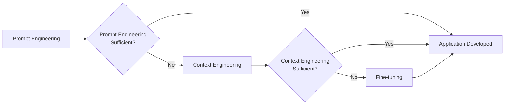
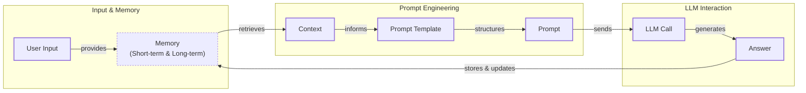
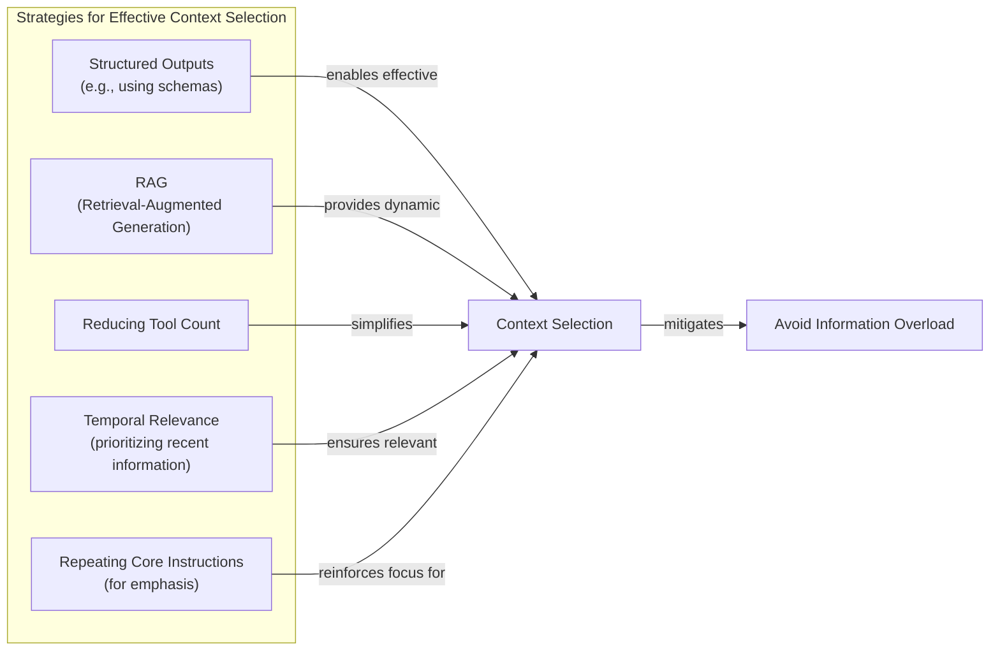
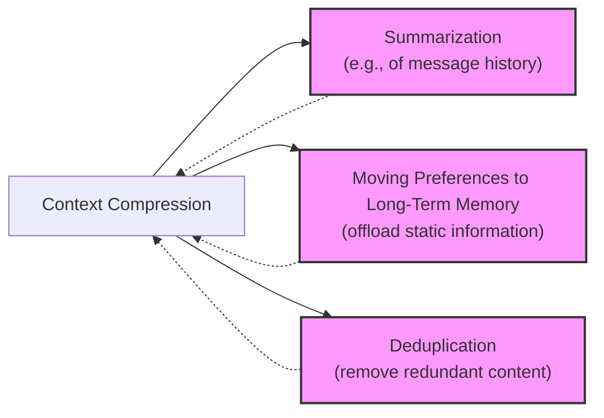
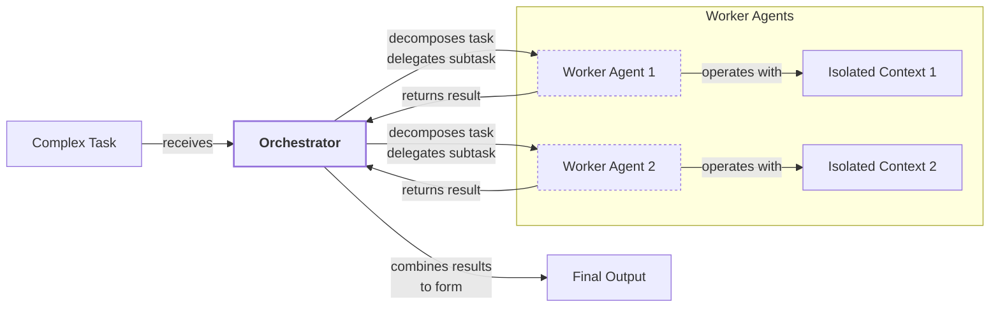

# Lesson 3: Context Engineering

AI applications have evolved rapidly. In 2022, we had simple chatbots. By 2023, RAG systems connected LLMs to domain-specific knowledge. 2024 brought us tool-using agents that could perform actions. Now, we are building memory-enabled agents that remember past interactions.

In our last lesson, we explored how to choose between AI agents and LLM workflows. As these applications grow more complex, prompt engineering is showing its limits. It optimizes single LLM calls but fails when managing systems with memory, actions, and long interaction histories [[18]](https://www.getmaxim.ai/articles/context-window-management-strategies-for-long-context-ai-agents-and-chatbots/). The volume of information an agent might need has grown exponentially. Simply stuffing everything into a prompt is not a viable strategy. This is where context engineering comes in: orchestrating this information ecosystem to ensure the LLM gets exactly what it needs.

## From prompt to context engineering

Prompt engineering is designed for single, stateless interactions, treating each LLM call as an isolated event. This approach breaks down in stateful applications where context must be managed across multiple turns [[22]](https://arxiv.org/pdf/2507.13334).

As a conversation progresses, the context grows, and performance degrades. This is context decay: the model gets confused by the noise of an expanding history. Every token also adds to the cost and latency of an LLM call. We will explore these concepts in more detail in future lessons.

On a recent project, we learned this the hard way by stuffing everything into a million-token context window. The result was a slow, expensive workflow with poor outputs. Context engineering shifts the focus to building dynamic systems that manage information flow, making applications accurate, fast, and cost-effective [[21]](https://www.datacamp.com/blog/context-engineering).

## Understanding context engineering

Context engineering is the practice of arranging information from your application's memory into the context passed to an LLM [[19]](https://www.llamaindex.ai/blog/context-engineering-what-it-is-and-techniques-to-consider). It is an optimization problem where you retrieve the right parts from memory to solve a task without overwhelming the model. For example, a cooking agent retrieves a specific recipe and your allergies, not the entire cookbook.

Andrej Karpathy explains that LLMs are like a new kind of operating system where the model is the CPU and its context window is the RAM [[23]](https://x.com/karpathy/status/1937902205765607626). Context engineering manages what information occupies the model’s limited context window, much like an OS manages RAM [[31]](https://blog.langchain.com/context-engineering-for-agents/).

Prompt engineering is a subset of context engineering. You still write effective prompts, but you also design a system that feeds the right context into them.

| Dimension | Prompt Engineering | Context Engineering |
| --- | --- | --- |
| Scope | Single interaction optimization | Entire information ecosystem |
| State Management | Stateless function | Stateful due to memory |
| Focus | How to phrase tasks | What information to provide |

Table 1: A comparison of prompt engineering and context engineering.

Context engineering is the new fine-tuning. While fine-tuning has its place, it is expensive and inflexible. For most enterprise use cases, you get better results faster and more cheaply with context engineering [[51]](https://www.linkedin.com/posts/denis-panjuta_prompt-engineering-vs-context-engineering-activity-7363945251180322816-1q_m). When starting a new AI project, your decision-making process should follow the workflow in Image 1.


Image 1: A simplified flowchart illustrating the decision-making workflow for AI application development.

For instance, an agent processing Slack messages needs engineered context to retrieve specific messages, not a fine-tuned model. Throughout this course, we will focus on solving problems using context engineering.

## What makes up the context

The "context" is everything the LLM sees in a single turn, dynamically assembled from various memory components. The high-level workflow, shown in Image 2, starts when user input triggers the system to pull information from memory. This is assembled into the final context, placed in a prompt template, and sent to the LLM. The model's answer then updates the memory, and the cycle repeats.


Image 2: A simplified flowchart illustrating the high-level workflow of an AI application.

These components are grouped into two main categories.

**Short-term working memory** is the agent's state for the current task. It is volatile and includes user input, message history, internal thoughts, and action outputs, helping maintain a coherent dialogue [[36]](https://atlan.com/know/working-memory-llms/).

**Long-term memory** stores information across sessions. Drawing parallels from human memory, we divide it into three types [[37]](https://www.datacamp.com/blog/how-does-llm-memory-work):
*   **Procedural memory:** Knowledge encoded in the code, like the system prompt and action definitions.
*   **Episodic memory:** Memory of specific experiences, like user preferences, stored in databases.
*   **Semantic memory:** The agent’s general knowledge base, from internal documents or external APIs.

This parallel is not just an analogy; research integrates principles from human episodic memory to help LLMs handle vast contexts [[88]](https://openreview.net/forum?id=BI2int5SAC). We will cover these concepts in future lessons. Context engineering involves selecting the right pieces from this memory pool for each interaction.

## Production implementation challenges

Implementing context engineering in production presents several challenges, all centered on keeping the context small yet informative. Here are four common issues:

1.  **The context window challenge:** Every model has a limited context window. In long-running tasks, this limit is quickly reached as interaction history accumulates, causing other problems [[90]](https://samaya.ai/blog/lost-in-the-maze-overcoming-context-limitations-in-long-horizon-agentic-search).
2.  **Information overload:** Too much context degrades performance. This "lost-in-the-middle" problem occurs because models attend best to the beginning and end of the context, often ignoring information in the middle long before the physical limit is reached [[56]](https://www.linkedin.com/pulse/lost-middle-lesson-failing-ai-agents-backwards-anthony-dejohn-01k2e), [[3]](https://www.trychroma.com/research/context-rot).
3.  **Context drift:** Conflicting information can accumulate in memory over time, confusing the LLM and making its responses unreliable [[6]](https://galileo.ai/blog/production-llm-monitoring-strategies).
4.  **Tool confusion:** An agent with too many actions, or with poorly described or overlapping ones, will struggle to choose the correct one for a given task [[18]](https://www.getmaxim.ai/articles/context-window-management-strategies-for-long-context-ai-agents-and-chatbots/).

## Key strategies for context optimization

Modern AI solutions must manage complexity across multiple knowledge bases, tools, and conversational histories. Context engineering is about managing this complexity while meeting performance, latency, and cost requirements. Here are four popular strategies:

1.  **Selecting the right context:** To avoid information overload, use structured outputs to define what the LLM should return, use RAG to fetch only specific text chunks, and reduce the number of available actions. For time-sensitive data, rank it by date. You can also repeat core instructions at the start and end of the prompt to leverage the model's inherent bias toward early and late tokens, ensuring they are not lost [[91]](https://dev.to/qvfagundes/positional-encodings-and-context-window-engineering-why-token-order-matters-13h).


Image 3: A simplified Mermaid diagram illustrating strategies for selecting the right context to avoid information overload.

2.  **Context compression:** As message history grows, you must manage it to keep the context window in check. This requires a careful balance, as overly aggressive compression loses key information while being too lenient reduces efficiency [[92]](https://liner.com/review/acon-optimizing-context-compression-for-longhorizon-llm-agents). Common methods include creating summaries, moving preferences to long-term memory, or removing redundant information [[11]](https://oneuptime.com/blog/post/2026-01-30-context-compression/view), [[12]](https://www.dailydoseofds.com/llmops-crash-course-part-8/).


Image 4: A simplified Mermaid diagram illustrating key strategies for context compression, including Summarization, Moving Preferences to Long-Term Memory, and Deduplication.

3.  **Isolating Context:** Another powerful strategy is to isolate context by splitting information across multiple agents. Instead of one agent with a massive context, you can have a team of agents, each with a smaller, focused one. We often implement this using an orchestrator-worker pattern, where a central agent assigns sub-tasks to specialized workers [[46]](https://beam.ai/agentic-insights/multi-agent-orchestration-patterns-production), [[47]](https://gurusup.com/blog/multi-agent-orchestration-guide).


Image 5: A simplified Mermaid diagram illustrating the "Orchestrator-Worker" pattern for isolating context in multi-agent systems.

4.  **Format optimization for model clarity:** The way you format the context matters. Models are sensitive to structure, and using clear delimiters can improve performance. Common strategies are to use XML tags to wrap different pieces of context or prefer YAML over JSON for structured data, as it is often more token-efficient [[44]](https://www.anthropic.com/engineering/effective-context-engineering-for-ai-agents).

Ultimately, you always have to understand what is passed to the LLM. Seeing exactly what occupies your context window at every step is key to mastering context engineering.

## Here is an example

Let's connect these ideas with a concrete example. Consider these real-world scenarios:

*   **Healthcare:** An AI assistant accesses a patient's history, symptoms, and medical literature to provide diagnostic support [[41]](https://www.decodingai.com/p/context-engineering-2025s-1-skill).
*   **Financial Services:** An AI integrates with a CRM and market data to generate tailored financial advice.
*   **Project Management:** An AI accesses Slack and task managers to automatically update project tasks.
*   **Content Creator Assistant:** An AI uses your research and past content to create new material in your style.

Let's walk through the healthcare assistant scenario. A user asks: `I have a headache. What can I do to stop it? I would prefer not to take any medicine.`

Before answering, a context engineering system performs several steps: it retrieves the user's history from episodic memory, queries a medical database from semantic memory, assembles the key information, formats it into a structured prompt, and calls the LLM [[41]](https://www.decodingai.com/p/context-engineering-2025s-1-skill). Here is a pseudocode snippet showing how the context might be structured in a prompt:

```xml
<system_prompt>
You are a helpful AI medical assistant...
</system_prompt>

<patient_history>
patient:
  name: John Doe
  age: 45
  preferences: {medication_avoidance: true}
</patient_history>

<medical_literature>
- topic: dehydration_headaches
  treatment: Rehydration can alleviate symptoms...
</medical_literature>

<user_query>
I have a headache. What can I do to stop it?
</user_query>
```

To build such a system, you need a robust tech stack. A potential stack we recommend and will use throughout this course includes:
*   **LLM:** Gemini
*   **Orchestration:** LangGraph
*   **Databases:** PostgreSQL, Qdrant, and Neo4j
*   **Observability:** Opik or LangSmith

## Connecting context engineering to AI engineering

Context engineering is about developing the intuition to select the right information from memory and arrange it for optimal results. This discipline combines several fields:

1.  **AI Engineering:** Implementing solutions like LLM workflows and agents.
2.  **Software Engineering (SWE):** Building scalable and maintainable architectures.
3.  **Data Engineering:** Designing pipelines that feed curated data into memory.
4.  **Operations (Ops):** Deploying agents on reproducible and observable infrastructure.

Our goal is to teach you how to combine these skills to build production-ready AI products, shifting your mindset from a developer to an architect. In the next lesson, we will explore structured outputs.

## References

- [1] [LLM Context Window Limitations: Impacts, Risks, & Fixes in 2026](https://atlan.com/know/llm-context-window-limitations/)
- [2] [What modifications might be needed to the LLM's input formatting or architecture to best take advantage of retrieved documents (for example, adding special tokens or segments to separate context)?](https://milvus.io/ai-quick-reference/what-modifications-might-be-needed-to-the-llms-input-formatting-or-architecture-to-best-take-advantage-of-retrieved-documents-for-example-adding-special-tokens-or-segments-to-separate-context)
- [3] [Context Rot: How Increasing Input Tokens Impacts LLM Performance](https://www.trychroma.com/research/context-rot)
- [4] [Four design patterns for Event-Driven, Multi-Agent systems](https://www.confluent.io/blog/event-driven-multi-agent-systems/)
- [5] [From Human Memory to AI Memory: A survey on Memory Mechanisms in the Era of LLMS](https://arxiv.org/html/2504.15965v1)
- [6] [Production LLM Monitoring Strategies for Drift, Latency, & Cost](https://galileo.ai/blog/production-llm-monitoring-strategies)
- [7] [Context, Drift, and the Illusion of Intent](https://erikjlarson.substack.com/p/context-drift-and-the-illusion-of)
- [8] [Best practices for prompt engineering with the OpenAI API](https://help.openai.com/en/articles/6654000-best-practices-for-prompt-engineering-with-the-openai-api)
- [9] [Preview AI Agent Platform Best Practices](https://support.talkdesk.com/hc/en-us/articles/39096730105115--Preview-AI-Agent-Platform-Best-Practices)
- [10] [Your AI doesn't need more Training—It needs context](https://www.tabnine.com/blog/your-ai-doesnt-need-more-training-it-needs-context/)
- [11] [Context Compression for LLM Applications](https://oneuptime.com/blog/post/2026-01-30-context-compression/view)
- [12] [LLMOps Crash Course Part 8: Memory and Temporal Context](https://www.dailydoseofds.com/llmops-crash-course-part-8/)
- [13] [The State Of AI Agents: Lots Of Potential … And Confusion](https://www.forrester.com/blogs/the-state-of-ai-agents-lots-of-potential-and-confusion/)
- [14] [Building a Business Case for AI in Financial Services | 66degrees](https://66degrees.com/building-a-business-case-for-ai-in-financial-services/)
- [15] [Context Engineering: The Complete guide](https://www.akira.ai/blog/context-engineering)
- [16] [Why Large Language Models Forget the Middle: Uncovering AI’s Hidden Blind Spot](https://www.unite.ai/why-large-language-models-forget-the-middle-uncovering-ais-hidden-blind-spot/)
- [17] [Lost-in-the-Middle Effect](https://promptmetheus.com/resources/llm-knowledge-base/lost-in-the-middle-effect)
- [18] [Context Window Management Strategies for Long-Context AI Agents and Chatbots](https://www.getmaxim.ai/articles/context-window-management-strategies-for-long-context-ai-agents-and-chatbots/)
- [19] [Context Engineering - What it is, and techniques to consider](https://www.llamaindex.ai/blog/context-engineering-what-it-is-and-techniques-to-consider)
- [20] [The rise of "context engineering"](https://blog.langchain.com/the-rise-of-context-engineering/)
- [21] [Context Engineering: A Guide With Examples](https://www.datacamp.com/blog/context-engineering)
- [22] [A Survey of Context Engineering for Large Language Models](https://arxiv.org/pdf/2507.13334)
- [23] [+1 for "context engineering" over "prompt engineering".](https://x.com/karpathy/status/1937902205765607626)
- [24] [Context Engineering 101 cheat sheet](https://x.com/lenadroid/status/1943685060785524824)
- [25] [Own your context window](https://github.com/humanlayer/12-factor-agents/blob/main/content/factor-03-own-your-context-window.md)
- [26] [Context Engineering Guide](https://nlp.elvissaravia.com/p/context-engineering-guide)
- [27] [What is Context Engineering?](https://www.pinecone.io/learn/context-engineering/)
- [28] [Context Engineering for Observability: How to Deliver the Right Data to LLMs](https://www.mezmo.com/learn-observability/context-engineering-for-observability-how-to-deliver-the-right-data-to-llms)
- [29] [Why AI coding assistants fail without context : an introduction to ContextOps](https://packmind.com/context-engineering-ai-coding/what-is-contextops/)
- [30] [HUMAN-INSPIRED EPISODIC MEMORY FOR INFINITE CONTEXT LLMS](https://openreview.net/pdf?id=BI2int5SAC)
- [31] [Context Engineering](https://blog.langchain.com/context-engineering-for-agents/)
- [32] [Context Engineering vs. Prompt Engineering: Key Differences Explained](https://www.glean.com/perspectives/context-engineering-vs-prompt-engineering-key-differences-explained)
- [33] [Working Memory in LLMs: The Engineering View](https://atlan.com/know/working-memory-llms/)
- [34] [From Vibe Coding to Context Engineering: A Blueprint for Production-Grade GenAI Systems](https://www.sundeepteki.org/blog/from-vibe-coding-to-context-engineering-a-blueprint-for-production-grade-genai-systems)
- [35] [Context Engineering: The Silent Architecture Behind Every AI Agent](https://www.linkedin.com/pulse/context-engineering-silent-architecture-behind-every-ai-roychowdhury-lzcec)
- [36] [Working Memory in LLMs: The Engineering View](https://atlan.com/know/working-memory-llms/)
- [37] [How Does LLM Memory Work? A Practical Guide](https://www.datacamp.com/blog/how-does-llm-memory-work)
- [38] [How Does LLM Memory Work?](https://www.analyticsvidhya.com/blog/2026/01/how-does-llm-memory-work/)
- [39] [Why Memory Matters in LLM Agents: Short-Term vs. Long-Term Memory Architectures](https://skymod.tech/why-memory-matters-in-llm-agents-short-term-vs-long-term-memory-architectures/)
- [40] [Episodic vs. Persistent Memory in LLMs](https://labelstud.io/learningcenter/episodic-vs-persistent-memory-in-llms/)
- [41] [Context Engineering: 2025’s #1 Skill for AI Engineers](https://www.decodingai.com/p/context-engineering-2025s-1-skill)
- [42] [Prompt engineering vs context engineering: a practical guide for AI builders](https://memgraph.com/blog/prompt-engineering-vs-context-engineering)
- [43] [Prompt Engineering in Healthcare: A Practical Guide to Crafting Effective Prompts for AI-Powered Medical Applications](https://www.mdpi.com/2079-9292/13/15/2961)
- [44] [Effective context engineering for AI agents](https://www.anthropic.com/engineering/effective-context-engineering-for-ai-agents)
- [45] [Understanding the Evolution: From Classic Chatbots to RAG Chatbots to AI-Powered Assistants - Security Industry Association](https://www.securityindustry.org/2024/07/16/understanding-the-evolution-from-classic-chatbots-to-rag-chatbots-to-ai-powered-assistants/)
- [46] [Multi-Agent Orchestration Patterns for Production](https://beam.ai/agentic-insights/multi-agent-orchestration-patterns-production)
- [47] [Multi-Agent Orchestration: The Ultimate Guide for 2026](https://gurusup.com/blog/multi-agent-orchestration-guide)
- [48] [Multi-Agent Systems: Building with Context Engineering](https://www.vellum.ai/blog/multi-agent-systems-building-with-context-engineering)
- [49] [Deterministic AI Orchestration: A Platform Architecture for Autonomous Development](https://www.praetorian.com/blog/deterministic-ai-orchestration-a-platform-architecture-for-autonomous-development/)
- [50] [Agentic AI Systems: A Survey and Taxonomy](https://arxiv.org/html/2601.13671v1)
- [51] [Prompt Engineering vs. Context Engineering vs. Fine-Tuning vs. Constraint Engineering vs. Conditional Logic](https://www.linkedin.com/posts/denis-panjuta_prompt-engineering-vs-context-engineering-activity-7363945251180322816-1q_m)
- [52] [Prompt engineering vs context engineering: a practical guide for AI builders](https://memgraph.com/blog/prompt-engineering-vs-context-engineering)
- [53] [Context Engineering for Observability: How to Deliver the Right Data to LLMs](https://www.mezmo.com/learn-observability/context-engineering-for-observability-how-to-deliver-the-right-data-to-llms)
- [54] [Context Engineering: What It Is and How It Can Help Your Business](https://www.instinctools.com/blog/context-engineering/)
- [55] [Context Engineering vs. Prompt Engineering in Agentic AI](https://neo4j.com/blog/agentic-ai/context-engineering-vs-prompt-engineering/)
- [56] [Lost in the Middle: A Lesson on Failing AI Agents (Backwards)](https://www.linkedin.com/pulse/lost-middle-lesson-failing-ai-agents-backwards-anthony-dejohn-01k2e)
- [57] [Lost-in-the-Middle Effect](https://promptmetheus.com/resources/llm-knowledge-base/lost-in-the-middle-effect)
- [58] [The 'Lost in the Middle' Problem: Why LLMs Ignore the Middle of Your Context Window](https://dev.to/thousand_miles_ai/the-lost-in-the-middle-problem-why-llms-ignore-the-middle-of-your-context-window-3al2)
- [59] [LLM Context Window Limitations: Impacts, Risks, & Fixes in 2026](https://atlan.com/know/llm-context-window-limitations/)
- [60] [Needle in a Haystack: Optimizing Retrieval and RAG over Long-Context Windows](https://bigdataboutique.com/blog/needle-in-haystack-optimizing-retrieval-and-rag-over-long-context-windows-5dfb3c)
- [61] [What is Context Engineering in AI?](https://www.codecademy.com/article/context-engineering-in-ai)
- [62] [Context Engineering in LLMs and AI Agents](https://blog.stackademic.com/context-engineering-in-llms-and-ai-agents-eb861f0d3e9b)
- [63] [How to implement context engineering in your AI coding workflow](https://packmind.com/context-engineering-ai-coding/how-to-implement-context-engineering/)
- [64] [Context Engineering Platforms: A 2026 Comparison](https://atlan.com/know/context-engineering-platforms-comparison/)
- [65] [LangGraph: A Deep Dive into the Future of AI Development](https://www.scalablepath.com/machine-learning/langgraph)
- [66] [When did AI chatbots start?](https://www.dante-ai.com/news/when-did-ai-chatbots-start)
- [67] [How to Reduce LLM Hallucination: A Guide for Engineers](https://www.helicone.ai/blog/how-to-reduce-llm-hallucination)
- [68] [The Hidden Cost of LLM Drift Detection](https://insightfinder.com/blog/hidden-cost-llm-drift-detection)
- [69] [Context Rot: The Silent Killer of Enterprise AI LLMs](https://thenewstack.io/context-rot-enterprise-ai-llms/)
- [70] [Navigating the Shifting Sands: Understanding and Mitigating Data Drift in LLMs](https://www.coforge.com/what-we-know/blog/navigating-the-shifting-sands-understanding-and-mitigating-data-drift-in-llms/)
- [71] [What are common real-world failures when stuffing too much data into LLM context windows for complex multi-turn applications, and what were the performance impacts?](https://www.trychroma.com/research/context-rot)
- [72] [What are common real-world failures when stuffing too much data into LLM context windows for complex multi-turn applications, and what were the performance impacts?](https://redis.io/blog/context-window-overflow/)
- [73] [What are common real-world failures when stuffing too much data into LLM context windows for complex multi-turn applications, and what were the performance impacts?](https://towardsdatascience.com/your-1m-context-window-llm-is-less-powerful-than-you-think/)
- [74] [What are common real-world failures when stuffing too much data into LLM context windows for complex multi-turn applications, and what were the performance impacts?](https://medium.com/@sahin.samia/the-common-failure-points-of-llm-rag-systems-and-how-to-overcome-them-926d9090a88f)
- [75] [Context Management for LLM Agents: A Comparative Study and Hybrid Approach](https://blog.jetbrains.com/research/2025/12/efficient-context-management/)
- [76] [How can AI developers monitor and inspect exactly what information occupies an LLM's context window at each step in workflows to improve cost and performance?](https://datahub.com/blog/context-window-optimization/)
- [77] [How can AI developers monitor and inspect exactly what information occupies an LLM's context window at each step in workflows to improve cost and performance?](https://www.comet.com/site/blog/context-window/)
- [78] [LLMOps Crash Course Part 8: Memory and Temporal Context](https://www.dailydoseofds.com/llmops-crash-course-part-8/)
- [79] [Context Compression through Item Description Summarization for Small Language Models](https://arxiv.org/html/2510.22101v1)
- [80] [Context Engineering for AI Coding: a Practical Intro to ContextOps](https://packmind.com/context-engineering-ai-coding/what-is-contextops/)
- [81] [Context Engineering for Observability: How to Deliver the Right Data to LLMs](https://www.mezmo.com/learn-observability/context-engineering-for-observability-how-to-deliver-the-right-data-to-llms)
- [82] [AI Context Engineering Guide for Businesses](https://sombrainc.com/blog/ai-context-engineering-guide)
- [83] [Master Data Pipeline Architecture: Best Practices for Engineers](https://www.decube.io/post/master-data-pipeline-architecture-best-practices-for-engineers)
- [84] [Context Engineering for AI: The Foundation of Reliable, High-Performing Models](https://www.glean.com/blog/context-engineering-ai-the-foundation-of-reliable-high-performing-models)
- [85] [Evolution of AI chatbots: From simple scripts to autonomous agents](https://pagergpt.ai/ai-chatbot/evolution-of-ai-chatbots)
- [86] [Evolution of AI chatbots: From simple scripts to autonomous agents](https://pagergpt.ai/ai-chatbot/evolution-of-ai-chatbots)
- [87] [Evolution of AI chatbots: From simple scripts to autonomous agents](https://pagergpt.ai/ai-chatbot/evolution-of-ai-chatbots)
- [88] [EM-LLM: A Human-Inspired Episodic Memory for Infinite-Context LLMs](https://openreview.net/forum?id=BI2int5SAC)
- [89] [Unlocking the Black Box of Position Bias in Transformers: A Graph-Theoretic Perspective](https://openreview.net/forum?id=YufVk7I6Ii)
- [90] [Lost in the Maze: Overcoming Context Limitations in Long-Horizon Agentic Search](https://samaya.ai/blog/lost-in-the-maze-overcoming-context-limitations-in-long-horizon-agentic-search)
- [91] [Positional Encodings and Context Window Engineering: Why Token Order Matters](https://dev.to/qvfagundes/positional-encodings-and-context-window-engineering-why-token-order-matters-13h)
- [92] [ACON: Optimizing Context Compression for Long-Horizon LLM Agents](https://liner.com/review/acon-optimizing-context-compression-for-longhorizon-llm-agents)
- [93] [Context engineering: Improving AI by moving beyond the prompt](https://www.cio.com/article/4080592/context-engineering-improving-ai-by-moving-beyond-the-prompt.html)