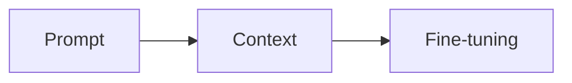
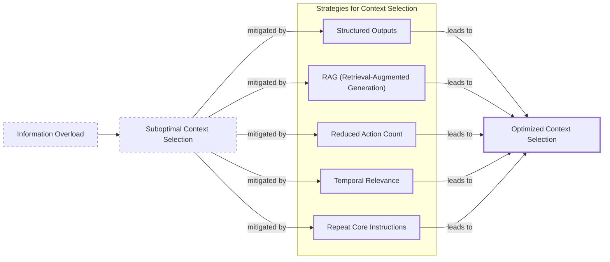
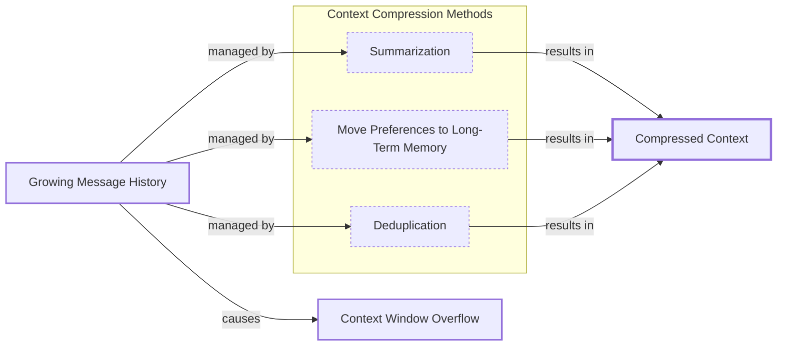
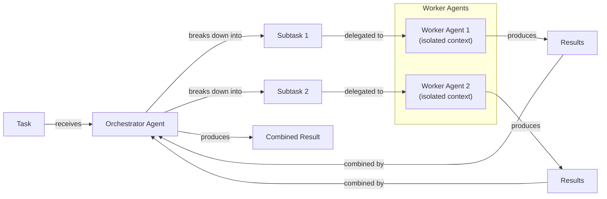

# Lesson 3: Context Engineering

## When prompt engineering breaks

AI applications have evolved rapidly. In 2022, we had simple chatbots. By 2023, Retrieval-Augmented Generation (RAG) systems connected LLMs to domain-specific knowledge. Now, we build action-using, memory-enabled agents that remember past interactions and maintain state over time [[23]](https://www.securityindustry.org/2024/07/16/understanding-the-evolution-from-classic-chatbots-to-rag-chatbots-to-ai-powered-assistants/), [[24]](https://pagergpt.ai/ai-chatbot/evolution-of-ai-chatbots), [[25]](https://www.dante-ai.com/news/when-did-ai-chatbots-start), [[26]](https://www.linkedin.com/posts/ai-apps-central_most-people-put-all-ai-systems-in-the-same-activity-7438555783077793792-UEUm).

In our last lesson, we explored how to choose between AI agents and LLM workflows. As these applications grow more complex, the volume of information an agent might need has grown exponentially. Simply stuffing everything into a prompt is not a viable strategy, as performance degrades with more context [[8]](https://www.decodingai.com/p/context-engineering-2025s-1-skill). The solution is context engineering, the discipline of orchestrating an AI’s information ecosystem to ensure the LLM gets exactly what it needs.

## From prompt to context engineering

Prompt engineering is designed for single, stateless interactions. This approach breaks down in stateful applications where context must be preserved across multiple turns. As a conversation progresses, the context grows, and without a management strategy, performance degrades. This is context decay: the model gets confused by the noise of an ever-expanding history.

Even with large context windows, every token adds to cost and latency. We learned this the hard way on a recent project, where stuffing everything into a large context window resulted in an unusable 30-minute workflow [[8]](https://www.decodingai.com/p/context-engineering-2025s-1-skill). The experience highlighted the need for context engineering, which shifts the focus from static prompts to dynamic systems. We will explore these concepts in more detail in upcoming lessons.

## Understanding context engineering

Context engineering is the process of strategically filling the model’s limited context window with the right information, at the right time, and in the right format [[1]](https://arxiv.org/pdf/2507.13334). It is an orchestration system that equips an LLM with everything it needs to succeed: clear instructions, relevant examples, retrieved knowledge, actions, memory, and historical context [[2]](https://www.linkedin.com/posts/addyosmani_ai-programming-softwareengineering-activity-7351136008320471040-kXPB). It’s an optimization problem: you retrieve the necessary pieces from memory to solve a task without overwhelming the model. For example, when you ask a cooking agent for a recipe, you do not give it the entire cookbook. Instead, you retrieve the specific recipe, along with personal context like allergies or taste preferences.

Andrej Karpathy offered a great analogy: LLMs are like a new kind of operating system, where the model is the CPU and its context window is the RAM [[3]](https://x.com/karpathy/status/1937902205765607626). Just as an operating system manages what fits into RAM, context engineering curates what occupies the model’s working memory. Prompt engineering is a subset of context engineering; you still write effective prompts, but you also design a system that feeds the right context into them.

| Dimension | Prompt Engineering | Context Engineering |
| --- | --- | --- |
| Scope | Single interaction optimization | Entire information ecosystem |
| State Management | Primarily stateless | Inherently stateful, with explicit memory management |
| Focus | How to phrase tasks | What information to provide |
Table 1: A comparison of prompt engineering and context engineering.

Context engineering is the new fine-tuning. While fine-tuning has its place, it is expensive and inflexible for most enterprise use cases where data constantly changes. You often get better results faster and more cheaply with context engineering [[4]](https://www.linkedin.com/posts/denis-panjuta_prompt-engineering-vs-context-engineering-activity-7363945251180322816-1q_m), [[5]](https://www.mezmo.com/learn-observability/context-engineering-for-observability-how-to-deliver-the-right-data-to-llms). When starting a new AI project, your decision-making process for guiding the LLM should look like the one in Image 1. For instance, to process internal Slack messages, you do not need to fine-tune a model; it is more effective to use context engineering to retrieve specific messages and enable actions.


Image 1: A flowchart illustrating the decision-making workflow in AI applications, from prompt to fine-tuning.

## What makes up the context

To master context engineering, you first need to understand what "context" is. It is everything the LLM sees in a single turn, dynamically assembled from various memory components. The high-level workflow begins when a user input triggers the system to pull relevant information from memory. This information is assembled into the final context, inserted into a prompt template, and sent to the LLM. The LLM’s answer then updates the memory, and the cycle repeats.

```mermaid
flowchart LR
  %% LLM Application Context Utilization Workflow
  "User Input" -- "processed & stored" --> "Memory"
  "Memory" -- "feeds into" --> "Context"
  "Context" -- "used by" --> "Prompt Template"
  "Prompt Template" -- "forms" --> "Prompt"
  "Prompt" -- "sent to" --> "LLM Call"
  "LLM Call" -- "generates" --> "Answer"
  "Answer" -- "fed back into" --> "Memory"
```
Image 2: A high-level workflow diagram showing the cyclical process of context utilization in an LLM application.

These components are grouped into two main categories, which we will explain intuitively for now.

### Short-Term Working Memory

Short-term working memory is the state of the agent for the current task. It is volatile and changes with each interaction, helping maintain a coherent dialogue. It includes user input, message history, the agent's internal thoughts, and the results from any actions performed.

### Long-Term Memory

Long-term memory is more persistent and stores information across sessions. We divide it into three types, drawing parallels from human memory [[6]](https://www.datacamp.com/blog/how-does-llm-memory-work), [[7]](https://www.analyticsvidhya.com/blog/2026/01/how-does-llm-memory-work/):

**Procedural memory:** This includes the system prompt, which sets the agent's behavior, and the definitions of available actions.

**Episodic memory:** This is memory of specific past experiences, like user preferences, used for personalization.

**Semantic memory:** This is the agent’s factual knowledge base, from internal documents to external data, forming the core of RAG [[8]](https://www.decodingai.com/p/context-engineering-2025s-1-skill).

We will cover these concepts in-depth in future lessons. The key takeaway is that these components are dynamically re-computed for every interaction. Context engineering involves knowing how to select the right pieces from this memory pool to construct the most effective prompt.

https://github.com/user-attachments/assets/0f1f193f-8e94-4044-a276-576bd7764fd0
Image 3: Context engineering encompasses a variety of techniques and information sources. (Source [humanlayer/12-factor-agents [27]](https://github.com/humanlayer/12-factor-agents/blob/main/content/factor-03-own-your-context-window.md))

## Production implementation challenges

Now that we understand what makes up the context, let's look at the core challenges of implementing it in production. These all revolve around a single question: *"How can I keep my context as small as possible while providing enough information to the LLM?"*

**The context window challenge** is that every model has a limited context window, but its *effective* size is often smaller than advertised. This is the point where adding more tokens actually improves results [[9]](https://arxiv.org/pdf/2509.21361). Every token adds to cost and latency [[8]](https://www.decodingai.com/p/context-engineering-2025s-1-skill).

**Information overload** leads to the "lost-in-the-middle" problem, where models ignore information in the middle. This is an inherent structural property of the transformer architecture [[10]](https://dev.to/thousand_miles_ai/the-lost-in-the-middle-problem-why-llms-ignore-the-middle-of-your-context-window-3al2), [[11]](https://www.linkedin.com/pulse/lost-middle-lesson-failing-ai-agents-backwards-anthony-dejohn-01k2e), [[12]](https://www.alphaxiv.org/overview/2603.10123v1).

**Context drift**, also known as context rot, occurs when conflicting information accumulates in memory, making responses unreliable [[13]](https://towardsdatascience.com/deep-dive-into-context-engineering-for-ai-agents/), [[14]](https://galileo.ai/blog/production-llm-monitoring-strategies), [[8]](https://www.decodingai.com/p/context-engineering-2025s-1-skill). For example, if memory contains two different user budgets, the agent gets confused.

**Tool confusion** arises when too many actions cause rule saturation, where the model ignores instructions [[15]](https://centricconsulting.com/blog/building-with-production-ready-ai-agent-systems-the-hidden-constraints_ai/). Long histories of action calls also create context pollution, and most models perform worse when given more than one action [[8]](https://www.decodingai.com/p/context-engineering-2025s-1-skill).

## Key strategies for context optimization

Modern AI solutions must manage complexity across multiple knowledge bases, actions, and conversational histories. This requires strategies to meet performance, latency, and cost requirements. Here are four popular approaches to context engineering:

### Selecting the Right Context

Retrieving the right information is a critical first step. Instead of providing everything at once, use structured outputs to pass only necessary information downstream and RAG to fetch specific text chunks. Reducing the number of available actions also helps, as studies show that limiting the selection can significantly improve accuracy [[8]](https://www.decodingai.com/p/context-engineering-2025s-1-skill). For time-sensitive data, rank it by date and filter out what is no longer relevant. Finally, to ensure core instructions are not lost, repeat them at both the start and end of the prompt. This uses the model's tendency to pay more attention to the context edges [[16]](https://promptmetheus.com/resources/llm-knowledge-base/lost-in-the-middle-effect).


Image 4: Diagram illustrating strategies to overcome information overload and achieve optimized context selection.

### Context Compression

As message history grows, you must keep the context window in check. Common methods include moving user preferences to long-term memory and deduplication [[17]](https://oneuptime.com/blog/post/2026-01-30-context-compression/view), [[18]](https://www.dailydoseofds.com/llmops-crash-course-part-8/). While LLM-based summarization is popular, simpler techniques like observation masking (hiding old action outputs) are often more cost-effective. Summaries can also cause "trajectory elongation," where agents run for more steps than necessary [[19]](https://blog.jetbrains.com/research/2025/12/efficient-context-management/).


Image 5: A diagram illustrating context compression methods for managing growing message history.

### Isolating Context

Isolating context across multiple agents using an orchestrator-worker pattern, a concept we will cover in a future lesson, can improve focus. However, this approach is often fragile. Without full context, sub-agents can make conflicting assumptions, leading to inconsistent results [[20]](https://beam.ai/agentic-insights/multi-agent-orchestration-patterns-production), [[21]](https://gurusup.com/blog/multi-agent-orchestration-guide). For this reason, many production systems favor single-threaded agents to maintain a coherent context [[22]](https://cognition.ai/blog/dont-build-multi-agents).


Image 6: An architecture diagram illustrating the Orchestrator-Worker Pattern for isolating context in multi-agent systems.

### Format Optimization

Finally, the way you format the context matters. Models are sensitive to structure, and using clear delimiters can improve performance. Common strategies are to wrap different pieces of context in XML tags (e.g., `<user_query>`) and prefer YAML over JSON when providing structured data, as it is often more token-efficient [[8]](https://www.decodingai.com/p/context-engineering-2025s-1-skill).

## Here is an example

Let's connect these strategies to concrete examples. In healthcare, an AI assistant can access a patient's history and relevant medical literature to suggest personalized diagnoses [[8]](https://www.decodingai.com/p/context-engineering-2025s-1-skill). In financial services, an agent might integrate with a company's CRM and financial data. For project management, an AI can access tools like Slack and task managers to update project tasks. A content creator assistant can use your research and past content to help create new material.

Let's walk through a query to a healthcare assistant: `I have a headache. What can I do to stop it? I would prefer not to take any medicine.` Before the LLM even sees this query, a context engineering system retrieves the user's patient history from episodic memory, queries a semantic memory of medical literature for remedies, assembles this information into a structured prompt, and sends it to the LLM to generate a personalized recommendation.

Here’s a simplified snippet showing how these components might be assembled into a system prompt. Notice the clear structure provided by the XML tags.

```
<INSTRUCTIONS>
1. Analyze the user's query and the provided context.
2. Use the patient history to understand their health profile and preferences.
3. Use the retrieved medical knowledge to form your recommendation.
4. If you lack sufficient information, ask clarifying questions.
</INSTRUCTIONS>

<PATIENT_HISTORY>
{retrieved_patient_history}
</PATIENT_HISTORY>

<MEDICAL_KNOWLEDGE>
{retrieved_medical_articles}
</MEDICAL_KNOWLEDGE>

<USER_QUERY>
{user_query}
</USER_QUERY>
```

To build such a system, you would use a combination of technologies. An LLM like Gemini provides the reasoning engine. A framework like LangGraph orchestrates the workflow. Databases such as PostgreSQL, Qdrant, or Neo4j can serve as long-term memory stores. Observability platforms are essential for debugging complex interactions.

## Connecting context engineering to AI engineering

Mastering context engineering is less about a specific algorithm and more about building intuition. It involves knowing how to structure prompts, what information to include, and how to order it for maximum impact.

This skill does not exist in a vacuum. It is a multidisciplinary practice that combines AI Engineering to implement solutions like RAG and agents, Software Engineering to build scalable systems, Data Engineering to construct reliable data pipelines, and Operations (Ops) to deploy and maintain these systems.

Our goal with this course is to teach you how to combine these skills to build production-ready AI products, shifting your mindset from a developer to an architect. In the next lesson, we will explore structured outputs.

## References

- [1] https://arxiv.org/pdf/2507.13334
- [2] https://www.linkedin.com/posts/addyosmani_ai-programming-softwareengineering-activity-7351136008320471040-kXPB
- [3] https://x.com/karpathy/status/1937902205765607626
- [4] https://www.linkedin.com/posts/denis-panjuta_prompt-engineering-vs-context-engineering-activity-7363945251180322816-1q_m
- [5] https://www.mezmo.com/learn-observability/context-engineering-for-observability-how-to-deliver-the-right-data-to-llms
- [6] https://www.datacamp.com/blog/how-does-llm-memory-work
- [7] https://www.analyticsvidhya.com/blog/2026/01/how-does-llm-memory-work/
- [8] https://www.decodingai.com/p/context-engineering-2025s-1-skill
- [9] https://arxiv.org/pdf/2509.21361
- [10] https://dev.to/thousand_miles_ai/the-lost-in-the-middle-problem-why-llms-ignore-the-middle-of-your-context-window-3al2
- [11] https://www.linkedin.com/pulse/lost-middle-lesson-failing-ai-agents-backwards-anthony-dejohn-01k2e
- [12] https://www.alphaxiv.org/overview/2603.10123v1
- [13] https://towardsdatascience.com/deep-dive-into-context-engineering-for-ai-agents/
- [14] https://galileo.ai/blog/production-llm-monitoring-strategies
- [15] https://centricconsulting.com/blog/building-with-production-ready-ai-agent-systems-the-hidden-constraints_ai/
- [16] https://promptmetheus.com/resources/llm-knowledge-base/lost-in-the-middle-effect
- [17] https://oneuptime.com/blog/post/2026-01-30-context-compression/view
- [18] https://www.dailydoseofds.com/llmops-crash-course-part-8/
- [19] https://blog.jetbrains.com/research/2025/12/efficient-context-management/
- [20] https://beam.ai/agentic-insights/multi-agent-orchestration-patterns-production
- [21] https://gurusup.com/blog/multi-agent-orchestration-guide
- [22] https://cognition.ai/blog/dont-build-multi-agents
- [23] https://www.securityindustry.org/2024/07/16/understanding-the-evolution-from-classic-chatbots-to-rag-chatbots-to-ai-powered-assistants/
- [24] https://pagergpt.ai/ai-chatbot/evolution-of-ai-chatbots
- [25] https://www.dante-ai.com/news/when-did-ai-chatbots-start
- [26] https://www.linkedin.com/posts/ai-apps-central_most-people-put-all-ai-systems-in-the-same-activity-7438555783077793792-UEUm
- [27] https://github.com/humanlayer/12-factor-agents/blob/main/content/factor-03-own-your-context-window.md
</article>