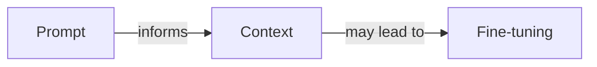
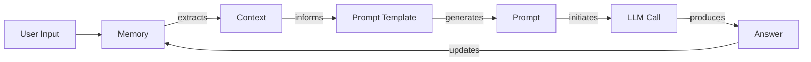
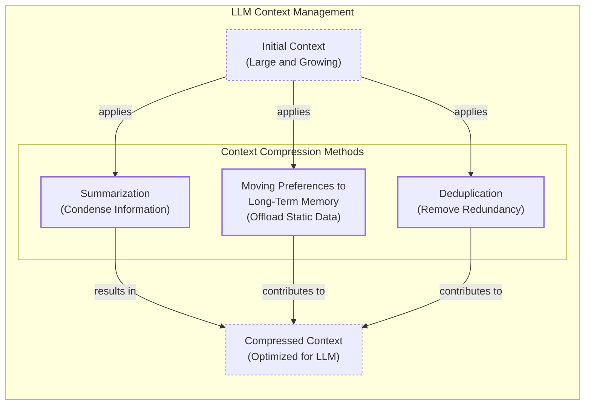
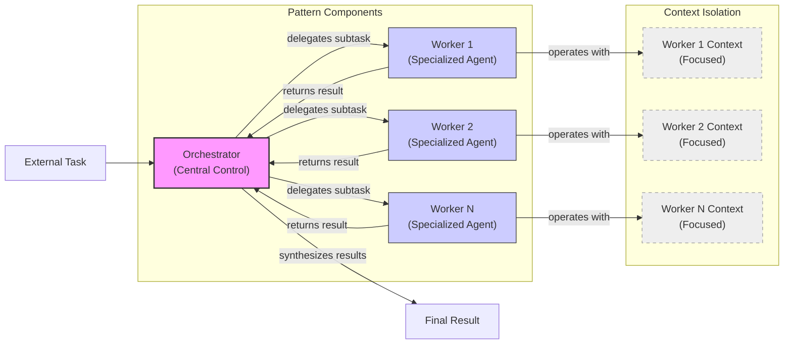

# Lesson 3: Context Engineering

## When prompt engineering breaks

AI applications have evolved rapidly. In 2022, we had simple chatbots for question-answering. By 2023, Retrieval-Augmented Generation (RAG) systems connected LLMs to domain-specific knowledge. 2024 brought us action-performing agents. Now, we are building memory-enabled agents that remember past interactions.

In our last lesson, we explored how to choose between AI agents and LLM workflows. As these applications grow more complex, prompt engineering is showing its limits. The volume of information an agent might need has grown exponentially. A new discipline, context engineering, is required to orchestrate this information ecosystem and ensure the LLM gets exactly what it needs [[1]](https://www.securityindustry.org/2024/07/16/understanding-the-evolution-from-classic-chatbots-to-rag-chatbots-to-ai-powered-assistants/), [[2]](https://pagergpt.ai/ai-chatbot/evolution-of-ai-chatbots), [[3]](https://www.mezmo.com/learn-observability/context-engineering-for-observability-how-to-deliver-the-right-data-to-llms).

## From Prompt to Context Engineering

Prompt engineering is designed for single, stateless interactions, which fails in stateful applications where context must be managed across multiple turns. As conversations progress, unmanaged context growth leads to **context rot**: the model’s ability to recall information degrades as the context window fills. Even with large context windows, every token adds to cost and latency. Stuffing the context creates a slow, expensive, and underperforming system. We will explore these concepts in more detail in future lessons. We learned this the hard way by stuffing everything into a million-token context window, resulting in a slow, low-quality workflow. Context engineering shifts the focus from static prompts to dynamic systems that manage information flow, making applications accurate, fast, and cost-effective [[4]](https://blog.langchain.com/context-engineering-for-agents/), [[5]](https://www.trychroma.com/research/context-rot), [[6]](https://www.anthropic.com/engineering/effective-context-engineering-for-ai-agents), [[7]](https://www.getmaxim.ai/articles/context-window-management-strategies-for-long-context-ai-agents-and-chatbots/), [[8]](https://towardsdatascience.com/your-1m-context-window-llm-is-less-powerful-than-you-think/), [[9]](https://www.glean.com/blog/context-engineering-ai-the-foundation-of-reliable-high-performing-models).

## Understanding Context Engineering

Context engineering is the practice of arranging information from your application's memory into the context passed to an LLM. It is an optimization problem of retrieving the right information to solve a task without overwhelming the model. For example, a cooking agent retrieves a specific recipe and user allergies, not the entire cookbook.

Andrej Karpathy explains that LLMs are like a new kind of operating system where the model is the CPU and its context window is the RAM. Context engineering manages what information occupies the model’s limited context window. Prompt engineering is a subset of this discipline; you still write effective prompts, but you also design a system that feeds the right context into them. This means understanding not just *how* to phrase a task, but *what* information the model needs to perform optimally [[10]](https://arxiv.org/abs/2603.09619), [[4]](https://blog.langchain.com/context-engineering-for-agents/), [[11]](https://atlan.com/know/working-memory-llms/).

| Dimension | Prompt Engineering | Context Engineering |
| --- | --- | --- |
| Scope | Single interaction optimization | Entire information ecosystem |
| State Management | Stateless function | Stateful due to memory |
| Focus | How to phrase tasks | What information to provide |
*Table 1: A comparison of prompt engineering and context engineering.*

**Context engineering is the new fine-tuning**. While fine-tuning has its place, it is expensive, time-consuming, and inflexible. For most enterprise use cases, context engineering yields better results faster and more cheaply. It allows for rapid iteration and adaptation to evolving data without altering the core model.

When you start a new AI project, your decision-making process for guiding the LLM should look like the one presented in Image 1.


*Image 1: A simplified flowchart illustrating the decision-making workflow in AI application development.*

For instance, to process internal Slack messages, you do not need to fine-tune a model. It is more effective to use a powerful reasoning model and engineer the context to retrieve specific messages and enable actions. Throughout this course, we will show you how to solve most industry problems using only context engineering [[12]](https://www.linkedin.com/posts/denis-panjuta_prompt-engineering-vs-context-engineering-activity-7363945251180322816-1q_m).

## What Makes Up the Context

To master context engineering, you must understand what "context" is: everything the LLM sees in a single turn, dynamically assembled from memory. The high-level workflow, shown in Image 2, starts with a user input that triggers the system to pull information from memory. This data is assembled into the context, placed in a prompt template, and sent to the LLM. The model's answer then updates the memory, and the cycle repeats.


*Image 2: A simplified workflow of context engineering.*

Context components fall into two main categories, which we will introduce intuitively now and cover in-depth in future lessons.

**Short-term working memory** is the agent's volatile state for the current task. It includes the user's input, message history, the agent's internal thoughts, and the outputs from any actions it has performed [[13]](https://atlan.com/know/working-memory-llms/).

**Long-term memory** is more persistent, storing information across sessions. Drawing parallels from human memory, we divide it into three types. **Procedural memory** is the agent's built-in skills, like its system prompt and available action definitions. **Episodic memory** stores specific past experiences, such as user preferences, to personalize responses. **Semantic memory** is the agent's general knowledge base, from internal documents to external data.

The key takeaway is that these components are dynamic. Context engineering involves selecting the right pieces from this memory pool to construct the most effective prompt [[14]](https://www.datacamp.com/blog/how-does-llm-memory-work), [[15]](https://www.analyticsvidhya.com/blog/2026/01/how-does-llm-memory-work/).

## Production Implementation Challenges

Now that we understand context, let's look at the core challenges of implementing it in production. The goal is to find the smallest set of high-signal tokens that maximizes the chance of a successful outcome.

Here are four common issues:

**The context window challenge:** The transformer architecture's quadratic (O(n²)) complexity creates a bottleneck, making large contexts slow and expensive.

**Information overload:** Every token depletes the model's "attention budget." Too much data causes the "lost-in-the-middle" problem, where the model overlooks details buried in a noisy context, degrading performance long before the physical limit is reached.

**Context pollution and drift:** Over time, memory can become polluted with irrelevant or outdated information. This noise leads to context drift, where conflicting facts accumulate and responses become unreliable.

**Action confusion:** A bloated set of actions with poorly described or overlapping functions can confuse the LLM, especially when actions return excessive data that bloats the context window [[16]](https://towardsdatascience.com/deep-dive-into-context-engineering-for-ai-agents/), [[17]](https://www.lesswrong.com/posts/XNBZPbxyYhmoqD87F/llms-and-computation-complexity), [[18]](https://towardsai.net/p/machine-learning/the-context-window-paradox-engineering-trade-offs-in-modern-llm-architecture), [[6]](https://www.anthropic.com/engineering/effective-context-engineering-for-ai-agents), [[19]](https://dev.to/thousand_miles_ai/the-lost-in-the-middle-problem-why-llms-ignore-the-middle-of-your-context-window-3al2), [[20]](https://atlan.com/know/llm-context-window-limitations/), [[21]](https://thenewstack.io/context-rot-enterprise-ai-llms/), [[22]](https://inkeep.com/blog/context-engineering-why-agents-fail), [[23]](https://medium.com/@sahin.samia/the-common-failure-points-of-llm-rag-systems-and-how-to-overcome-them-926d9090a88f).

## Key Strategies for Context Optimization

Modern AI solutions must manage complexity across multiple knowledge bases and actions while meeting performance, latency, and cost requirements. Here are four popular context engineering strategies.

```mermaid
mindmap
  root("Selecting the right context")
    "Structured Outputs"
    "RAG (Retrieval-Augmented Generation)"
    "Actions"
    "Temporal Relevance"
    "Repeating Core Instructions"
```
*Image 3: A mind map illustrating strategies for selecting the right context for an LLM.*

**Selecting the right context** is a critical first step. Instead of providing everything, use techniques like structured outputs, or Retrieval-Augmented Generation (RAG) to fetch specific text chunks. We will cover RAG in detail in a future lesson. You can also reduce the number of available actions, rank time-sensitive data, and repeat core instructions at the start and end of the prompt to leverage the model's attention bias [[24]](https://www.langchain.com/blog/context-engineering-for-agents/), [[25]](https://promptmetheus.com/resources/llm-knowledge-base/lost-in-the-middle-effect).

**Context compression** helps manage growing message history. As illustrated in Image 4, you can create summaries of past interactions, move user preferences to long-term memory, and remove redundant information. However, be aware that compression can add latency and cause "context collapse," where summarization loses critical details [[26]](https://oneuptime.com/blog/post/2026-01-30-context-compression/view), [[27]](https://www.dailydoseofds.com/llmops-crash-course-part-8/), [[28]](https://www.sitepoint.com/optimizing-token-usage-context-compression-techniques/), [[29]](https://www.linkedin.com/posts/evanahari_context-engineering-can-you-trust-long-context-activity-7353618487744892928-TPNg).


*Image 4: A diagram illustrating context compression methods for LLMs.*

**Isolating context** involves splitting information across multiple agents. Instead of one agent with a cluttered context, you can use an orchestrator-worker pattern, shown in Image 5, where a central agent assigns sub-tasks to specialized workers. Each worker has its own focused context, improving performance. We will explore this pattern in a future lesson [[30]](https://www.llamaindex.ai/blog/context-engineering-what-it-is-and-techniques-to-consider), [[31]](https://beam.ai/agentic-insights/multi-agent-orchestration-patterns-production), [[32]](https://gurusup.com/blog/multi-agent-orchestration-guide).


*Image 5: A simplified diagram illustrating the Orchestrator-Worker Pattern for isolating context.*

**Format optimizations** are also important. Using clear delimiters like XML tags and preferring token-efficient formats like YAML over JSON can improve performance. Understanding what occupies your context window at every step is key to mastering context engineering [[33]](https://www.decodingai.com/p/context-engineering-2025s-1-skill), [[4]](https://blog.langchain.com/context-engineering-for-agents/).

## Here Is an Example

Let's connect theory with a concrete example. Consider these real-world scenarios:

-   **Healthcare:** An AI assistant accesses a patient's medical history, symptoms, and medical literature to provide personalized diagnostic support.
-   **Financial Services:** AI systems integrate with CRMs and calendars, combining market data and client portfolios to generate tailored financial advice.
-   **Project Management:** AI systems access enterprise infrastructure to automatically understand project requirements and update tasks.
-   **Content Creator Assistant:** An AI agent uses your research and past content to understand what and how to create new content.

Let's walk through a query to the healthcare assistant: `I have a headache. What can I do to stop it? I would prefer not to take any medicine.`

Before answering, a context engineering system performs several steps: it retrieves the user's history from episodic memory, queries a medical database for remedies from semantic memory, assembles the key information, formats it into a structured prompt, and calls the LLM to present a personalized answer.

Here is a simplified pseudocode snippet showing how you might structure the context for the LLM, using XML and YAML for formatting [[33]](https://www.decodingai.com/p/context-engineering-2025s-1-skill):

```python
# Simplified pseudocode for context assembly
SYSTEM_PROMPT = """
You are a helpful AI healthcare assistant. Your goal is to provide safe, non-medicinal advice.
<patient_history>
{retrieved_patient_history_in_yaml}
</patient_history>
<medical_articles>
{retrieved_medical_articles_in_yaml}
</medical_articles>
<user_query>
{user_query}
</user_query>
Based on all the information above, provide a helpful response.
"""
```

To build such a system, you need a robust tech stack. A potential stack could include Gemini for the LLM, LangGraph for orchestration, various databases like PostgreSQL or Neo4j, and observability tools like Opik or LangSmith [[34]](https://atlan.com/know/context-engineering-platforms-comparison/), [[35]](https://www.scalablepath.com/machine-learning/langgraph).

## Connecting context engineering to AI engineering

Context engineering is the art of developing the intuition to craft effective prompts, select the right information from memory, and arrange context for optimal results. This discipline helps you determine the minimal information an LLM needs to perform at its best.

It draws from established software engineering principles, combining AI Engineering, Software Engineering (SWE), Data Engineering, and Operations (Ops). Our goal with this course is to teach you how to combine these skills to build production-ready AI products, shifting your mindset from a developer to an architect of AI systems.

In the next lesson, we will explore structured outputs [[36]](https://www.elastic.co/what-is/context-engineering).

## References

- [1] [Understanding the Evolution From Classic Chatbots to RAG Chatbots to AI-Powered Assistants](https://www.securityindustry.org/2024/07/16/understanding-the-evolution-from-classic-chatbots-to-rag-chatbots-to-ai-powered-assistants/)
- [2] [The Evolution of AI Chatbots](https://pagergpt.ai/ai-chatbot/evolution-of-ai-chatbots)
- [3] [Context Engineering for Observability: How to Deliver the Right Data to LLMs](https://www.mezmo.com/learn-observability/context-engineering-for-observability-how-to-deliver-the-right-data-to-llms)
- [4] [Context Engineering for Agents](https://blog.langchain.com/context-engineering-for-agents/)
- [5] [Context Rot: How Increasing Input Tokens Impacts LLM Performance](https://www.trychroma.com/research/context-rot)
- [6] [Effective Context Engineering for AI Agents](https://www.anthropic.com/engineering/effective-context-engineering-for-ai-agents)
- [7] [Context Window Management: Strategies for Long-Context AI Agents and Chatbots](https://www.getmaxim.ai/articles/context-window-management-strategies-for-long-context-ai-agents-and-chatbots/)
- [8] [Your 1M context window LLM is less powerful than you think](https://towardsdatascience.com/your-1m-context-window-llm-is-less-powerful-than-you-think/)
- [9] [Context engineering AI: The foundation of reliable, high-performing models](https://www.glean.com/blog/context-engineering-ai-the-foundation-of-reliable-high-performing-models)
- [10] [A Survey of Context Engineering for Large Language Models](https://arxiv.org/abs/2603.09619)
- [11] [Working Memory in LLMs](https://atlan.com/know/working-memory-llms/)
- [12] [Prompt Engineering vs. Context Engineering](https://www.linkedin.com/posts/denis-panjuta_prompt-engineering-vs-context-engineering-activity-7363945251180322816-1q_m)
- [13] [How Does LLM Memory Work?](https://www.datacamp.com/blog/how-does-llm-memory-work)
- [14] [How Does LLM Memory Work?](https://www.analyticsvidhya.com/blog/2026/01/how-does-llm-memory-work/)
- [15] [Deep Dive into Context Engineering for AI Agents](https://towardsdatascience.com/deep-dive-into-context-engineering-for-ai-agents/)
- [16] [LLMs and Computation Complexity](https://www.lesswrong.com/posts/XNBZPbxyYhmoqD87F/llms-and-computation-complexity)
- [17] [The Context Window Paradox: Engineering Trade-offs in Modern LLM Architecture](https://towardsai.net/p/machine-learning/the-context-window-paradox-engineering-trade-offs-in-modern-llm-architecture)
- [18] [The "Lost in the Middle" Problem: Why LLMs Ignore the Middle of Your Context Window](https://dev.to/thousand_miles_ai/the-lost-in-the-middle-problem-why-llms-ignore-the-middle-of-your-context-window-3al2)
- [19] [LLM Context Window Limitations: Impacts, Risks, & Fixes in 2026](https://atlan.com/know/llm-context-window-limitations/)
- [20] [Context Rot in Enterprise AI: Why LLMs Need a Governance Layer](https://thenewstack.io/context-rot-enterprise-ai-llms/)
- [21] [Context Engineering: Why Agents Fail](https://inkeep.com/blog/context-engineering-why-agents-fail)
- [22] [The Common Failure Points of LLM RAG Systems and How to Overcome Them](https://medium.com/@sahin.samia/the-common-failure-points-of-llm-rag-systems-and-how-to-overcome-them-926d9090a88f)
- [23] [Lost-in-the-Middle Effect](https://promptmetheus.com/resources/llm-knowledge-base/lost-in-the-middle-effect)
- [24] [How to Build Context Compression](https://oneuptime.com/blog/post/2026-01-30-context-compression/view)
- [25] [LLMOps Crash Course Part 8: Memory and Temporal Context](https://www.dailydoseofds.com/llmops-crash-course-part-8/)
- [26] [Optimizing Token Usage with Context Compression Techniques](https://www.sitepoint.com/optimizing-token-usage-context-compression-techniques/)
- [27] [Context Engineering: Can you trust long context?](https://www.linkedin.com/posts/evanahari_context-engineering-can-you-trust-long-context-activity-7353618487744892928-TPNg)
- [28] [Context Engineering - What it is, and techniques to consider](https://www.llamaindex.ai/blog/context-engineering-what-it-is-and-techniques-to-consider)
- [29] [Multi-Agent Orchestration Patterns for Production](https://beam.ai/agentic-insights/multi-agent-orchestration-patterns-production)
- [30] [Multi-Agent Orchestration Guide](https://gurusup.com/blog/multi-agent-orchestration-guide)
- [31] [Context Engineering: 2025's #1 Skill](https://www.decodingai.com/p/context-engineering-2025s-1-skill)
- [32] [Context Engineering Platforms Comparison](https://atlan.com/know/context-engineering-platforms-comparison/)
- [33] [LangGraph: A Developer’s Guide to Building Stateful, Multi-agent Workflows](https://www.scalablepath.com/machine-learning/langgraph)
- [34] [What is Context Engineering?](https://www.elastic.co/what-is/context-engineering)