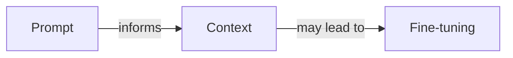
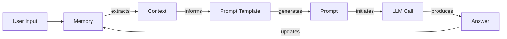
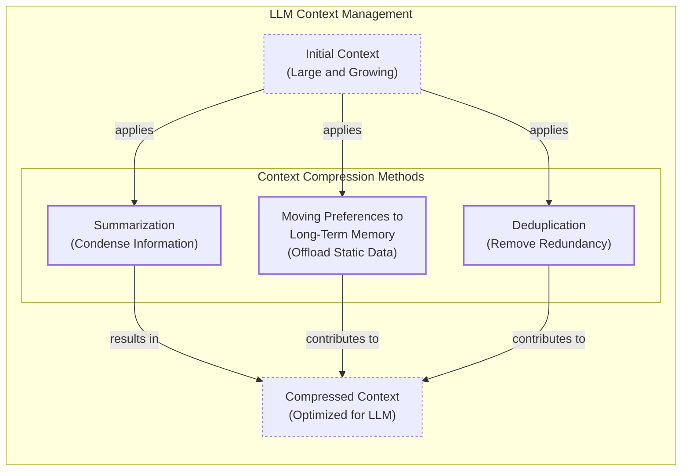
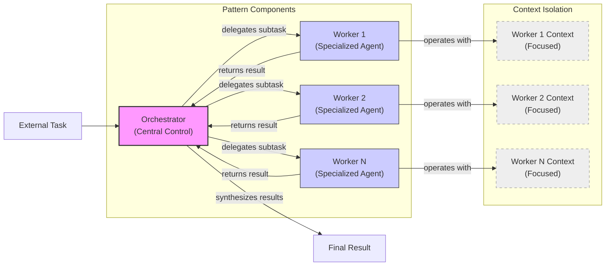

# Lesson 3: Context Engineering

AI applications have evolved rapidly. In 2022, we had simple chatbots for question-answering. By 2023, Retrieval-Augmented Generation (RAG) systems connected LLMs to domain-specific knowledge. 2024 brought us tool-using agents that could perform actions. Now, we are building memory-enabled agents that remember past interactions and build relationships over time [[26]](https://www.securityindustry.org/2024/07/16/understanding-the-evolution-from-classic-chatbots-to-rag-chatbots-to-ai-powered-assistants/), [[27]](https://pagergpt.ai/ai-chatbot/evolution-of-ai-chatbots).

In our last lesson, we explored how to choose between AI agents and LLM workflows when designing a system. As these applications grow more complex, prompt engineering, a practice that once served us well, is showing its limits. It optimizes single LLM calls but fails when managing systems with memory, actions, and long interaction histories. The sheer volume of information an agent might need—past conversations, user data, documents, and action descriptions—has grown exponentially. Simply stuffing all this into a prompt is not a viable strategy. This is where context engineering comes in. It is the discipline of orchestrating this entire information ecosystem to ensure the LLM gets exactly what it needs, when it needs it. This skill is becoming a core foundation for AI engineering [[22]](https://www.mezmo.com/learn-observability/context-engineering-for-observability-how-to-deliver-the-right-data-to-llms).

## From Prompt to Context Engineering

Prompt engineering is designed for single, stateless interactions, an approach that fails in stateful applications where context must be managed across multiple turns [[31]](https://www.langchain.com/blog/context-engineering-for-agents/). As a conversation progresses, unmanaged context growth leads to **context rot**: the model’s ability to recall information degrades as the context window fills, causing it to lose track of key information [[3]](https://www.trychroma.com/research/context-rot), [[85]](https://www.anthropic.com/engineering/effective-context-engineering-for-ai-agents).

Even with large context windows, every token adds to the cost and latency of an LLM call. Simply putting everything into the context creates a slow, expensive, and underperforming system [[18]](https://www.getmaxim.ai/articles/context-window-management-strategies-for-long-context-ai-agents-and-chatbots/). We will explore these concepts in more detail in upcoming lessons, including memory in Lesson 9 and RAG in Lesson 10.

On a recent project, we learned this the hard way. We stuffed everything into a model with a million-token context window: research, guidelines, and user history. The result was a slow workflow with low-quality outputs, a classic case of working memory overload [[5]](https://towardsdatascience.com/your-1m-context-window-llm-is-less-powerful-than-you-think/).

This is where context engineering becomes essential. It shifts the focus from crafting static prompts to building dynamic systems that manage information flow. As an AI engineer, your job is to select only the most critical pieces of context for each LLM call. This makes your applications accurate, fast, and cost-effective [[25]](https://www.glean.com/blog/context-engineering-ai-the-foundation-of-reliable-high-performing-models).

## Understanding Context Engineering

Context engineering involves finding the optimal way to arrange information from your application's memory into the context passed to an LLM. It is a solution to an optimization problem where you retrieve the right parts from your short-term and long-term memory to solve a specific task without overwhelming the model. For example, when you ask a cooking agent for a recipe, you do not give it the entire cookbook. Instead, you retrieve the specific recipe, along with personal context like allergies or taste preferences. This precise selection ensures the model receives only the essential information. A well-engineered context can be measured by five criteria: relevance, sufficiency, isolation, economy, and provenance [[82]](https://arxiv.org/abs/2603.09619).

Andrej Karpathy explains that LLMs are like a new kind of operating system where the model is the CPU and its context window is the RAM. Just as an operating system manages what fits into your computer’s limited RAM, context engineering manages what information occupies the model’s limited context window [[31]](https://www.langchain.com/blog/context-engineering-for-agents/), [[33]](https://atlan.com/know/working-memory-llms/).

How does context engineering relate to prompt engineering? It's simple. Prompt engineering is a subset of context engineering. You still write effective prompts, but you also design a system that feeds the right context into those prompts. This means understanding not just *how* to phrase a task, but *what* information the model needs to perform optimally.

| Dimension | Prompt Engineering | Context Engineering |
| --- | --- | --- |
| Scope | Single interaction optimization | Entire information ecosystem |
| State Management | Stateless function | Stateful due to memory |
| Focus | How to phrase tasks | What information to provide |
*Table 1: A comparison of prompt engineering and context engineering.*

**Context engineering is the new fine-tuning**. While fine-tuning has its place, it is expensive, time-consuming, and inflexible. Data changes constantly, making fine-tuning a last resort. For most enterprise use cases, you get better results faster and more cheaply with context engineering [[51]](https://www.linkedin.com/posts/denis-panjuta_prompt-engineering-vs-context-engineering-activity-7363945251180322816-1q_m). It allows for rapid iteration and adaptation to evolving data without altering the core model, a key advantage in dynamic environments.

When you start a new AI project, your decision-making process for guiding the LLM should look like the one presented in Image 1.


*Image 1: A simplified flowchart illustrating the decision-making workflow in AI application development.*

For instance, if you build an agent to process internal Slack messages, you do not need to fine-tune a model on your company’s communication style. It is more effective to use a powerful reasoning model and engineer the context to retrieve specific messages and enable actions like creating tasks or drafting emails. Throughout this course, we will show you how to solve most industry problems using only context engineering.

## What Makes Up the Context

To master context engineering, you first need to understand what "context" actually is. It is everything the LLM sees in a single turn, dynamically assembled from various memory components before being passed to the model.

The high-level workflow, as presented in Image 2, begins when a user input triggers the system to pull relevant information from both long-term and short-term memory. This information is assembled into the final context, inserted into a prompt template, and sent to the LLM. The LLM’s answer then updates the memory, and the cycle repeats.


*Image 2: A simplified workflow of context engineering.*

These components are grouped into two main categories. We will explain them intuitively for now, as we have future dedicated lessons for all of them.

### Short-Term Working Memory

Short-term working memory is the state of the agent for the current task or conversation. It is volatile and changes with each interaction, helping the agent maintain a coherent dialogue and make immediate decisions. It can include some or all of these components [[36]](https://atlan.com/know/working-memory-llms/):

- **User input:** The most recent query or command from the user.
- **Message history:** The log of the current conversation, allowing the LLM to understand the flow and previous turns.
- **Agent's internal thoughts:** The reasoning steps the agent takes to decide on its next action.
- **Action calls and outputs:** The results from any actions the agent has performed, providing information from external systems.

### Long-Term Memory

Long-term memory is more persistent and stores information across sessions, allowing the AI system to remember things beyond a single conversation. We divide it into three types, drawing parallels from human memory [[37]](https://www.datacamp.com/blog/how-does-llm-memory-work), [[38]](https://www.analyticsvidhya.com/blog/2026/01/how-does-llm-memory-work/):

- **Procedural memory:** This is knowledge encoded directly in the code. It includes the system prompt, which sets the agent's overall behavior. It also includes the definitions of available actions and schemas for structured outputs. Think of this as the agent's built-in skills.
- **Episodic memory:** This is memory of specific past experiences, like user preferences or previous interactions. It's used to help the agent personalize its responses based on individual users. We typically store this in vector or graph databases for efficient retrieval.
- **Semantic memory:** This is the agent’s general knowledge base. It can be internal, like company documents, or external, accessed via the internet. This memory provides the factual information the agent needs to answer questions.

We will cover all these concepts in-depth in future lessons, including structured outputs (Lesson 4), actions (Lesson 6), memory (Lesson 9), and RAG (Lesson 10). The key takeaway is that these components are not static. They are dynamically re-computed for every single interaction. Context engineering involves knowing how to select the right pieces from this vast memory pool to construct the most effective prompt for the task at hand.

## Production Implementation Challenges

Now that we understand what makes up the context, let's look at the core challenges of implementing it in production. The goal is to find the smallest possible set of high-signal tokens that maximizes the chance of a successful outcome [[83]](https://towardsdatascience.com/deep-dive-into-context-engineering-for-ai-agents/).

Here are four common issues that come up when building AI applications:

1.  **The context window challenge:** The transformer architecture has a quadratic (O(n²)) computational complexity, creating a memory bottleneck where large contexts become slow and expensive [[90]](https://www.lesswrong.com/posts/XNBZPbxyYhmoqD87F/llms-and-computation-complexity), [[92]](https://towardsai.net/p/machine-learning/the-context-window-paradox-engineering-trade-offs-in-modern-llm-architecture).
2.  **Information overload:** Every token depletes the model's limited "attention budget" [[75]](https://www.anthropic.com/engineering/effective-context-engineering-for-ai-agents). Too much data leads to the "lost-in-the-middle" problem, where the model overlooks critical details buried in a noisy context [[58]](https://dev.to/thousand_miles_ai/the-lost-in-the-middle-problem-why-llms-ignore-the-middle-of-your-context-window-3al2), [[59]](https://atlan.com/know/llm-context-window-limitations/).
3.  **Context pollution and drift:** Over time, memory can become polluted with irrelevant or outdated information. Without maintenance, this noise leads to context drift, where responses become unreliable [[8]](https://thenewstack.io/context-rot-enterprise-ai-llms/), [[94]](https://inkeep.com/blog/context-engineering-why-agents-fail).
4.  **Tool confusion:** A bloated tool set with poorly described or overlapping actions can confuse the LLM. The problem is worse when tools return excessive data, bloating the context window with low-signal information [[4]](https://medium.com/@sahin.samia/the-common-failure-points-of-llm-rag-systems-and-how-to-overcome-them-926d9090a88f), [[96]](https://www.anthropic.com/engineering/effective-context-engineering-for-ai-agents).

## Key Strategies for Context Optimization

Modern AI solutions must manage multiple knowledge bases, tools, and complex conversational histories. Context engineering is about managing this complexity while meeting performance, latency, and cost requirements. Here are four popular context engineering strategies used across the industry [[31]](https://www.langchain.com/blog/context-engineering-for-agents/):

```mermaid
mindmap
  root("Selecting the right context")
    "Structured Outputs"
    "RAG (Retrieval-Augmented Generation)"
    "Tools"
    "Temporal Relevance"
    "Repeating Core Instructions"
```
*Image 3: A mind map illustrating strategies for selecting the right context for an LLM.*

### Selecting the Right Context

Retrieving the right information from memory is a critical first step. A common mistake is to provide everything at once. To solve this, consider these approaches: use structured outputs to pass only necessary data; use RAG to fetch specific text chunks; reduce the number of available tools or use RAG to fetch only the most relevant tool descriptions for the task [[76]](https://www.langchain.com/blog/context-engineering-for-agents/); rank time-sensitive data by date; and repeat core instructions at the start and end of the prompt to leverage the model's attention bias [[57]](https://promptmetheus.com/resources/llm-knowledge-base/lost-in-the-middle-effect).

### Context Compression

As message history grows, you must manage past interactions to keep your context window in check. You cannot simply drop past conversation turns; instead, you need ways to compress key facts. You can do this by creating summaries of past interactions, moving user preferences to long-term memory, and removing redundant information through deduplication [[11]](https://oneuptime.com/blog/post/2026-01-30-context-compression/view), [[12]](https://www.dailydoseofds.com/llmops-crash-course-part-8/). Be aware that compression adds latency and can cause "context collapse," where summarization loses critical details [[89]](https://www.sitepoint.com/optimizing-token-usage-context-compression-techniques/), [[95]](https://www.linkedin.com/posts/evanahari_context-engineering-can-you-trust-long-context-activity-7353618487744892928-TPNg).


*Image 4: A diagram illustrating context compression methods for LLMs, including summarization, moving preferences to long-term memory, and deduplication.*

### Isolating Context

Another powerful strategy is to isolate context by splitting information across multiple agents or LLM workflows [[77]](https://www.llamaindex.ai/blog/context-engineering-what-it-is-and-techniques-to-consider). Instead of one agent with a massive, cluttered context window, you can have a team of agents, each with a smaller, focused context. We often implement this using an orchestrator-worker pattern, where a central orchestrator agent assigns sub-tasks to specialized worker agents. Each worker operates in its own isolated context, improving focus and allowing for parallel processing [[46]](https://beam.ai/agentic-insights/multi-agent-orchestration-patterns-production), [[47]](https://gurusup.com/blog/multi-agent-orchestration-guide).


*Image 5: A simplified diagram illustrating the Orchestrator-Worker Pattern for isolating context.*

### Format Optimizations

Finally, the way you format the context matters. Models are sensitive to structure, and using clear delimiters can improve performance. Common strategies are to use XML tags to wrap different pieces of context (e.g., `<user_query>`) and prefer YAML over JSON for structured data, as it is often more token-efficient [[41]](https://www.decodingai.com/p/context-engineering-2025s-1-skill). You always have to understand what is passed to the LLM. Seeing exactly what occupies your context window at every step is key to mastering context engineering.

## Here Is an Example

Let's connect theory with a concrete example. Consider these real-world scenarios:

-   **Healthcare:** An AI assistant accesses a patient's medical history, symptoms, and medical literature to provide personalized diagnostic support [[41]](https://www.decodingai.com/p/context-engineering-2025s-1-skill).
-   **Financial Services:** AI systems integrate with CRMs and calendars, combining market data and client portfolios to generate tailored financial advice.
-   **Project Management:** AI systems access enterprise tools to automatically understand project requirements and update tasks.
-   **Content Creator Assistant:** An AI agent uses your research and past content to understand what and how to create new content.

Let's walk through a query to the healthcare assistant: `I have a headache. What can I do to stop it? I would prefer not to take any medicine.`

Before answering, a context engineering system performs several steps: it retrieves the user's history from episodic memory, queries a medical database for remedies from semantic memory, assembles the key information, formats it into a structured prompt, and calls the LLM to present a personalized answer [[41]](https://www.decodingai.com/p/context-engineering-2025s-1-skill).

Here is a simplified pseudocode snippet showing how you might structure the context for the LLM, using XML and YAML for formatting:

```python
# Simplified pseudocode for context assembly
SYSTEM_PROMPT = """
You are a helpful AI healthcare assistant. Your goal is to provide safe, non-medicinal advice.
<patient_history>
{retrieved_patient_history_in_yaml}
</patient_history>
<medical_articles>
{retrieved_medical_articles_in_yaml}
</medical_articles>
<user_query>
{user_query}
</user_query>
Based on all the information above, provide a helpful response.
"""
```

To build such a system, you need a robust tech stack. A potential stack could include Gemini for the LLM, LangGraph for orchestration, various databases like PostgreSQL or Neo4j, and observability tools like Opik or LangSmith [[64]](https://atlan.com/know/context-engineering-platforms-comparison/), [[65]](https://www.scalablepath.com/machine-learning/langgraph).

## Connecting Context Engineering to AI Engineering

Context engineering is more of an art than a science. It is about developing the intuition to craft effective prompts, select the right information from memory, and arrange context for optimal results. This discipline helps you determine the minimal yet essential information an LLM needs to perform at its best.

Context engineering draws inspiration from established software engineering principles. Just as developers architect databases and data pipelines, context engineers design the information architecture that powers intelligent agents [[84]](https://www.elastic.co/what-is/context-engineering). This discipline combines:

1.  **AI Engineering:** Implement practical solutions such as LLM workflows, RAG, AI Agents, and evaluation pipelines.
2.  **Software Engineering (SWE):** Build your AI product with code that is scalable and maintainable.
3.  **Data Engineering:** Design data pipelines that feed curated and validated data into the memory layer.
4.  **Operations (Ops):** Deploy agents on the proper infrastructure to ensure they are reproducible, maintainable, observable, and scalable.

Our goal with this course is to teach you how to combine these skills to build production-ready AI products, shifting your mindset from a developer to an architect of AI systems.

In the next lesson, we will explore structured outputs.

## References

- [1] Mei, L., Yao, J., Ge, Y., Wang, Y., Bi, B., Cai, Y., Liu, J., Li, M., Li, Z., Zhang, D., Zhou, C., Mao, J., Xia, T., Guo, J., & Liu, S. (2025, July 17). A survey of context engineering for large language models. arXiv.org. https://arxiv.org/pdf/2507.13334
- [2] Accounts, L. (2025, July 28). Context engineering. LangChain Blog. https://blog.langchain.com/context-engineering-for-agents/
- [3] Hong, K., Troynikov, A., & Huber, J. (2025, July). Context Rot: How Increasing Input Tokens Impacts LLM Performance. Chroma. https://www.trychroma.com/research/context-rot
- [4] Sahin, S. (2025, May 22). The Common Failure Points of LLM RAG Systems and How to Overcome Them. Medium. https://medium.com/@sahin.samia/the-common-failure-points-of-llm-rag-systems-and-how-to-overcome-them-926d9090a88f
- [5] Your 1M context window LLM is less powerful than you think. (2025, April 1). Towards Data Science. https://towardsdatascience.com/your-1m-context-window-llm-is-less-powerful-than-you-think/
- [6] Galileo. (n.d.). Production LLM Monitoring Strategies. https://galileo.ai/blog/production-llm-monitoring-strategies
- [7] Navigating the Shifting Sands: Understanding and Mitigating Data Drift in LLMs. (n.d.). Coforge. https://www.coforge.com/what-we-know/blog/navigating-the-shifting-sands-understanding-and-mitigating-data-drift-in-llms
- [8] Context Rot: What It Is and How to Fix It in Enterprise AI and LLMs. (n.d.). The New Stack. https://thenewstack.io/context-rot-enterprise-ai-llms/
- [9] The Hidden Cost of LLM Drift Detection. (n.d.). InsightFinder. https://insightfinder.com/blog/hidden-cost-llm-drift-detection
- [10] How to Reduce LLM Hallucination: A Guide for Developers. (n.d.). Helicone. https://www.helicone.ai/blog/how-to-reduce-llm-hallucination
- [11] How to Build Context Compression. (2026, January 30). OneUptime. https://oneuptime.com/blog/post/2026-01-30-context-compression/view
- [12] LLMOps Crash Course Part 8: Context Engineering. (n.d.). Daily Dose of DS. https://www.dailydoseofds.com/llmops-crash-course-part-8/
- [13] Context Compression via Item Description Summarization for SLM Relevance Ranking. (2025, October). arXiv. https://arxiv.org/html/2510.22101v1
- [14] Fraser, K., & Lindenbauer, T. (2025, December 1). Cutting Through the Noise: Smarter Context Management for LLM-Powered Agents. JetBrains Research. https://blog.jetbrains.com/research/2025/12/efficient-context-management/
- [16] Opik: The LLM Observability Platform for Building Reliable AI Agents. (n.d.). Comet. https://www.comet.com/site/blog/context-window/
- [17] Mastering Context Window Optimization for LLM Applications. (n.d.). DataHub. https://datahub.com/blog/context-window-optimization/
- [18] Context Window Management: Strategies for Long-Context AI Agents and Chatbots. (n.d.). Maxim.ai. https://www.getmaxim.ai/articles/context-window-management-strategies-for-long-context-ai-agents-and-chatbots/
- [20] Fraser, K., & Lindenbauer, T. (2025, December 1). Cutting Through the Noise: Smarter Context Management for LLM-Powered Agents. JetBrains Research. https://blog.jetbrains.com/research/2025/12/efficient-context-management/
- [21] Py, L. (n.d.). Why AI coding assistants fail without context: an introduction to ContextOps. Packmind. https://packmind.com/context-engineering-ai-coding/what-is-contextops/
- [22] Context Engineering for Observability: How to Deliver the Right Data to LLMs. (n.d.). Mezmo. https://www.mezmo.com/learn-observability/context-engineering-for-observability-how-to-deliver-the-right-data-to-llms
- [23] AI Context Engineering: A Comprehensive Guide for 2025. (n.d.). Sombra. https://sombrainc.com/blog/ai-context-engineering-guide
- [25] Context engineering AI: The foundation of reliable, high-performing models. (n.d.). Glean. https://www.glean.com/blog/context-engineering-ai-the-foundation-of-reliable-high-performing-models
- [26] Understanding the Evolution from Classic Chatbots to RAG Chatbots to AI-Powered Assistants. (2024, July 16). Security Industry Association. https://www.securityindustry.org/2024/07/16/understanding-the-evolution-from-classic-chatbots-to-rag-chatbots-to-ai-powered-assistants/
- [27] The Evolution of AI Chatbots: From Simple Scripts to Autonomous Agents. (n.d.). PagerGPT. https://pagergpt.ai/ai-chatbot/evolution-of-ai-chatbots
- [29] When Did AI Chatbots Start: A Quick History of AI Chatbots. (n.d.). Dante AI. https://www.dante-ai.com/news/when-did-ai-chatbots-start
- [31] Context Engineering. (2025, July 2). LangChain Blog. https://blog.langchain.com/context-engineering-for-agents/
- [32] Context Engineering vs. Prompt Engineering: Key Differences Explained. (n.d.). Glean. https://www.glean.com/perspectives/context-engineering-vs-prompt-engineering-key-differences-explained
- [33] Working Memory in LLMs: The Engineering View. (n.d.). Atlan. https://atlan.com/know/working-memory-llms/
- [34] From Vibe Coding to Context Engineering: A Blueprint for Production-Grade GenAI Systems. (n.d.). Sundeep Teki. https://www.sundeepteki.org/blog/from-vibe-coding-to-context-engineering-a-blueprint-for-production-grade-genai-systems
- [35] Context Engineering: The Silent Architecture Behind Every AI Agent. (2025, July 16). LinkedIn. https://www.linkedin.com/pulse/context-engineering-silent-architecture-behind-every-ai-roychowdhury-lzcec
- [36] Working Memory in LLMs: The Engineering View. (n.d.). Atlan. https://atlan.com/know/working-memory-llms/
- [37] How Does LLM Memory Work? (n.d.). DataCamp. https://www.datacamp.com/blog/how-does-llm-memory-work
- [38] How Does LLM Memory Work? A Deep Dive into Memory Mechanisms. (2026, January). Analytics Vidhya. https://www.analyticsvidhya.com/blog/2026/01/how-does-llm-memory-work/
- [39] Why Memory Matters in LLM Agents: Short-Term vs. Long-Term Memory Architectures. (n.d.). Skymod. https://skymod.tech/why-memory-matters-in-llm-agents-short-term-vs-long-term-memory-architectures/
- [40] Episodic vs. Persistent Memory in LLMs. (n.d.). Label Studio. https://labelstud.io/learningcenter/episodic-vs-persistent-memory-in-llms/
- [41] Context Engineering: 2025's #1 Skill for AI Engineers. (n.d.). Decoding AI. https://www.decodingai.com/p/context-engineering-2025s-1-skill
- [43] Prompt Engineering in Healthcare: A Comprehensive Review of Techniques, Applications, and Challenges. (2025, July). MDPI. https://www.mdpi.com/2079-9292/13/15/2961
- [44] Effective Context Engineering for AI Agents. (n.d.). Anthropic. https://www.anthropic.com/engineering/effective-context-engineering-for-ai-agents
- [46] Multi-Agent Orchestration Patterns for Production. (n.d.). Beam.ai. https://beam.ai/agentic-insights/multi-agent-orchestration-patterns-production
- [47] Multi-Agent Orchestration Guide. (n.d.). GuruSup. https://gurusup.com/blog/multi-agent-orchestration-guide
- [48] Multi-Agent Systems: Building with Context Engineering. (n.d.). Vellum.ai. https://www.vellum.ai/blog/multi-agent-systems-building-with-context-engineering
- [49] Deterministic AI Orchestration: A Platform Architecture for Autonomous Development. (n.d.). Praetorian. https://www.praetorian.com/blog/deterministic-ai-orchestration-a-platform-architecture-for-autonomous-development/
- [50] Specialized Agents for AI Workflows. (2026, January). arXiv. https://arxiv.org/html/2601.13671v1
- [51] Panjuta, D. (2025, July). Prompt Engineering vs. Context Engineering. LinkedIn. https://www.linkedin.com/posts/denis-panjuta_prompt-engineering-vs-context-engineering-activity-7363945251180322816-1q_m
- [52] Prompt Engineering vs. Context Engineering. (n.d.). Memgraph. https://memgraph.com/blog/prompt-engineering-vs-context-engineering
- [53] Context Engineering for Observability: How to Deliver the Right Data to LLMs. (n.d.). Mezmo. https://www.mezmo.com/learn-observability/context-engineering-for-observability-how-to-deliver-the-right-data-to-llms
- [54] Context Engineering: The Key to Building Advanced AI Agents. (n.d.). Instinctools. https://www.instinctools.com/blog/context-engineering/
- [55] Context Engineering vs. Prompt Engineering for Agentic AI. (n.d.). Neo4j. https://neo4j.com/blog/agentic-ai/context-engineering-vs-prompt-engineering/
- [56] DeJohn, A. (2025, July). Lost in the Middle: A Lesson in Failing AI Agents Backwards. LinkedIn. https://www.linkedin.com/pulse/lost-middle-lesson-failing-ai-agents-backwards-anthony-dejohn-01k2e
- [57] Lost-in-the-Middle Effect. (n.d.). Promptmetheus. https://promptmetheus.com/resources/llm-knowledge-base/lost-in-the-middle-effect
- [58] The "Lost in the Middle" Problem: Why LLMs Ignore the Middle of Your Context Window. (n.d.). DEV Community. https://dev.to/thousand_miles_ai/the-lost-in-the-middle-problem-why-llms-ignore-the-middle-of-your-context-window-3al2
- [59] LLM Context Window Limitations: Impacts, Risks, & Fixes in 2026. (n.d.). Atlan. https://atlan.com/know/llm-context-window-limitations/
- [60] Needle in a Haystack: Optimizing Retrieval and RAG over Long Context Windows. (n.d.). Bigdataboutique. https://bigdataboutique.com/blog/needle-in-haystack-optimizing-retrieval-and-rag-over-long-context-windows-5dfb3c
- [61] Context Engineering in AI. (n.d.). Codecademy. https://www.codecademy.com/article/context-engineering-in-ai
- [62] Context Engineering in LLMs and AI Agents. (n.d.). Stackademic. https://blog.stackademic.com/context-engineering-in-llms-and-ai-agents-eb861f0d3e9b
- [63] How to Implement Context Engineering for AI Coding. (n.d.). Packmind. https://packmind.com/context-engineering-ai-coding/how-to-implement-context-engineering/
- [64] Context Engineering Platforms Comparison. (n.d.). Atlan. https://atlan.com/know/context-engineering-platforms-comparison/
- [65] LangGraph: Orchestrating Multi-Agent Workflows. (n.d.). Scalable Path. https://www.scalablepath.com/machine-learning/langgraph
- [75] Effective Context Engineering for AI Agents. (n.d.). Anthropic. https://www.anthropic.com/engineering/effective-context-engineering-for-ai-agents
- [76] Context Engineering. (2025, July 2). LangChain Blog. https://www.langchain.com/blog/context-engineering-for-agents/
- [77] Context Engineering — What it is, and techniques to consider. (n.d.). LlamaIndex. https://www.llamaindex.ai/blog/context-engineering-what-it-is-and-techniques-to-consider
- [82] Context Engineering for Autonomous AI. (2026, March). arXiv. https://arxiv.org/abs/2603.09619
- [83] Deep Dive into Context Engineering for AI Agents. (n.d.). Towards Data Science. https://towardsdatascience.com/deep-dive-into-context-engineering-for-ai-agents/
- [84] What is context engineering? (n.d.). Elastic. https://www.elastic.co/what-is/context-engineering
- [85] Effective Context Engineering for AI Agents. (n.d.). Anthropic. https://www.anthropic.com/engineering/effective-context-engineering-for-ai-agents
- [89] Optimizing Token Usage: Context Compression Techniques. (n.d.). SitePoint. https://www.sitepoint.com/optimizing-token-usage-context-compression-techniques/
- [90] LLMs and Computation Complexity. (n.d.). LessWrong. https://www.lesswrong.com/posts/XNBZPbxyYhmoqD87F/llms-and-computation-complexity
- [92] The Context Window Paradox: Engineering Trade-Offs in Modern LLM Architecture. (n.d.). Towards AI. https://towardsai.net/p/machine-learning/the-context-window-paradox-engineering-trade-offs-in-modern-llm-architecture
- [94] Context Engineering: Why Agents Fail & How to Fix Them. (n.d.). Inkeep. https://inkeep.com/blog/context-engineering-why-agents-fail
- [95] Context Engineering: Can you trust long context LLMs? (2025, July). LinkedIn. https://www.linkedin.com/posts/evanahari_context-engineering-can-you-trust-long-context-activity-7353618487744892928-TPNg
- [96] Effective Context Engineering for AI Agents. (n.d.). Anthropic. https://www.anthropic.com/engineering/effective-context-engineering-for-ai-agents