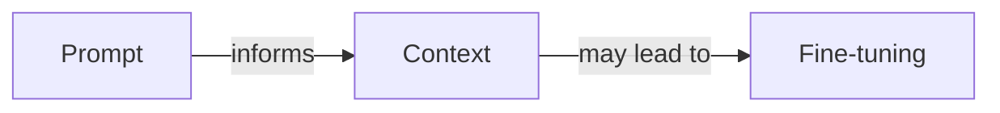
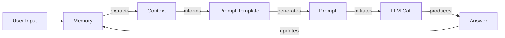
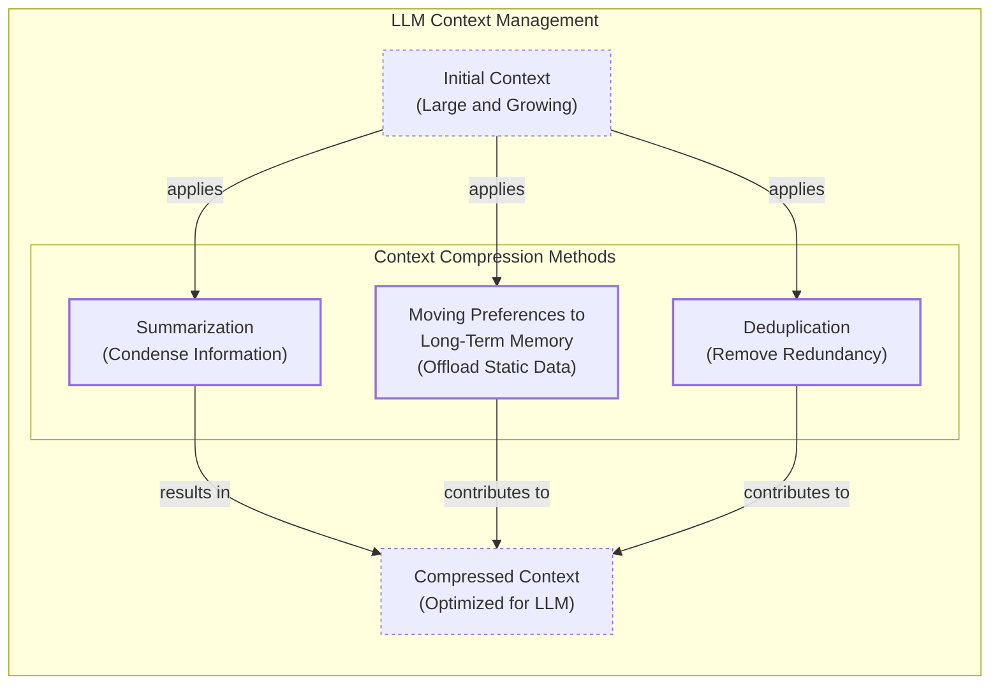
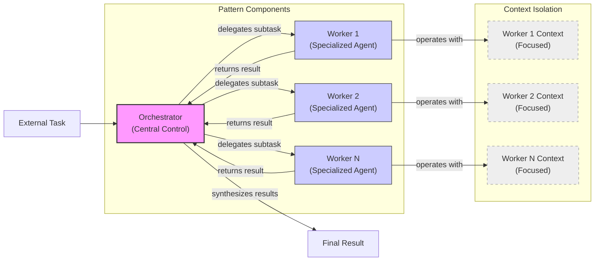

# Lesson 3: Context Engineering

## When prompt engineering breaks

AI applications have evolved rapidly. In 2022, we had simple chatbots for question-answering. By 2023, Retrieval-Augmented Generation (RAG) systems connected LLMs to domain-specific knowledge. 2024 brought us action-performing agents. Now, we are building memory-enabled agents that remember past interactions.

In our last lesson, we explored how to choose between AI agents and LLM workflows. As these applications grow more complex, prompt engineering is showing its limits. The volume of information an agent might need has grown exponentially. A new discipline, context engineering, is required to orchestrate this information ecosystem and ensure the LLM gets exactly what it needs [[26]](https://www.securityindustry.org/2024/07/16/understanding-the-evolution-from-classic-chatbots-to-rag-chatbots-to-ai-powered-assistants/), [[27]](https://pagergpt.ai/ai-chatbot/evolution-of-ai-chatbots), [[22]](https://www.mezmo.com/learn-observability/context-engineering-for-observability-how-to-deliver-the-right-data-to-llms).

## From Prompt to Context Engineering

Prompt engineering is designed for single, stateless interactions, an approach that fails in stateful applications where context must be managed across multiple turns. As a conversation progresses, unmanaged context growth leads to **context rot**: the model’s ability to recall information degrades as the context window fills, causing it to lose track of key information.

Even with large context windows, every token adds to the cost and latency of an LLM call. Simply putting everything into the context creates a slow, expensive, and underperforming system. We will explore these concepts in more detail in upcoming lessons. On a recent project, we learned this the hard way by stuffing everything into a model with a million-token context window, resulting in a slow workflow with low-quality outputs. Context engineering provides a solution by shifting the focus from static prompts to dynamic systems that manage information flow, making applications accurate, fast, and cost-effective [[31]](https://www.langchain.com/blog/context-engineering-for-agents/), [[3]](https://www.trychroma.com/research/context-rot), [[85]](https://www.anthropic.com/engineering/effective-context-engineering-for-ai-agents), [[18]](https://www.getmaxim.ai/articles/context-window-management-strategies-for-long-context-ai-agents-and-chatbots/), [[5]](https://towardsdatascience.com/your-1m-context-window-llm-is-less-powerful-than-you-think/), [[25]](https://www.glean.com/blog/context-engineering-ai-the-foundation-of-reliable-high-performing-models).

## Understanding Context Engineering

Context engineering involves finding the optimal way to arrange information from your application's memory into the context passed to an LLM. It is an optimization problem where you retrieve the right parts from memory to solve a task without overwhelming the model. For example, a cooking agent retrieves a specific recipe and user allergies, not the entire cookbook.

Andrej Karpathy explains that LLMs are like a new kind of operating system where the model is the CPU and its context window is the RAM. Context engineering manages what information occupies the model’s limited context window. Prompt engineering is a subset of this discipline; you still write effective prompts, but you also design a system that feeds the right context into them. This means understanding not just *how* to phrase a task, but *what* information the model needs to perform optimally [[82]](https://arxiv.org/abs/2603.09619), [[31]](https://www.langchain.com/blog/context-engineering-for-agents/), [[33]](https://atlan.com/know/working-memory-llms/).

| Dimension | Prompt Engineering | Context Engineering |
| --- | --- | --- |
| Scope | Single interaction optimization | Entire information ecosystem |
| State Management | Stateless function | Stateful due to memory |
| Focus | How to phrase tasks | What information to provide |
*Table 1: A comparison of prompt engineering and context engineering.*

**Context engineering is the new fine-tuning**. While fine-tuning has its place, it is expensive, time-consuming, and inflexible. For most enterprise use cases, you get better results faster and more cheaply with context engineering. It allows for rapid iteration and adaptation to evolving data without altering the core model.

When you start a new AI project, your decision-making process for guiding the LLM should look like the one presented in Image 1.


*Image 1: A simplified flowchart illustrating the decision-making workflow in AI application development.*

For instance, to process internal Slack messages, you do not need to fine-tune a model. It is more effective to use a powerful reasoning model and engineer the context to retrieve specific messages and enable actions. Throughout this course, we will show you how to solve most industry problems using only context engineering [[51]](https://www.linkedin.com/posts/denis-panjuta_prompt-engineering-vs-context-engineering-activity-7363945251180322816-1q_m).

## What Makes Up the Context

To master context engineering, you first need to understand what "context" actually is. It is everything the LLM sees in a single turn, dynamically assembled from various memory components before being passed to the model.

The high-level workflow, as presented in Image 2, begins when a user input triggers the system to pull relevant information from memory. This information is assembled into the final context, inserted into a prompt template, and sent to the LLM. The LLM’s answer then updates the memory, and the cycle repeats.


*Image 2: A simplified workflow of context engineering.*

These components are grouped into two main categories. We will explain them intuitively for now, as we have future dedicated lessons for all of them.

### Short-Term Working Memory

Short-term working memory is the state of the agent for the current task or conversation. It is volatile and changes with each interaction, helping the agent maintain a coherent dialogue and make immediate decisions. It can include some or all of these components: user input, message history, the agent's internal thoughts, and action calls and outputs [[36]](https://atlan.com/know/working-memory-llms/).

### Long-Term Memory

Long-term memory is more persistent and stores information across sessions. We divide it into three types, drawing parallels from human memory:

-   **Procedural memory:** This is knowledge encoded directly in the code, including the system prompt, definitions of available actions, and schemas for structured outputs. It represents the agent's built-in skills.
-   **Episodic memory:** This is memory of specific past experiences, like user preferences. It's used to help the agent personalize its responses and is typically stored in vector or graph databases.
-   **Semantic memory:** This is the agent’s general knowledge base, such as internal company documents or external information accessed via the internet.

We will cover these concepts in-depth in future lessons. The key takeaway is that these components are dynamic. Context engineering involves selecting the right pieces from this vast memory pool to construct the most effective prompt for the task at hand [[37]](https://www.datacamp.com/blog/how-does-llm-memory-work), [[38]](https://www.analyticsvidhya.com/blog/2026/01/how-does-llm-memory-work/).

## Production Implementation Challenges

Now that we understand what makes up the context, let's look at the core challenges of implementing it in production. The goal is to find the smallest possible set of high-signal tokens that maximizes the chance of a successful outcome.

Here are four common issues that come up when building AI applications:

1.  **The context window challenge:** The transformer architecture has a quadratic (O(n²)) computational complexity. This creates a memory bottleneck where large contexts become slow and expensive, limiting how much information a model can process at once.
2.  **Information overload:** Every token depletes the model's limited "attention budget." Too much data leads to the "lost-in-the-middle" problem, where the model overlooks critical details buried in a noisy context, causing performance to drop long before the physical limit is reached.
3.  **Context pollution and drift:** Over time, memory can become polluted with irrelevant or outdated information. Without maintenance, this noise leads to context drift, where conflicting facts accumulate and responses become unreliable.
4.  **Action confusion:** A bloated set of actions with poorly described or overlapping functions can confuse the LLM. The problem is worse when actions return excessive data, bloating the context window with low-signal information [[83]](https://towardsdatascience.com/deep-dive-into-context-engineering-for-ai-agents/), [[90]](https://www.lesswrong.com/posts/XNBZPbxyYhmoqD87F/llms-and-computation-complexity), [[92]](https://towardsai.net/p/machine-learning/the-context-window-paradox-engineering-trade-offs-in-modern-llm-architecture), [[75]](https://www.anthropic.com/engineering/effective-context-engineering-for-ai-agents), [[58]](https://dev.to/thousand_miles_ai/the-lost-in-the-middle-problem-why-llms-ignore-the-middle-of-your-context-window-3al2), [[59]](https://atlan.com/know/llm-context-window-limitations/), [[8]](https://thenewstack.io/context-rot-enterprise-ai-llms/), [[94]](https://inkeep.com/blog/context-engineering-why-agents-fail), [[4]](https://medium.com/@sahin.samia/the-common-failure-points-of-llm-rag-systems-and-how-to-overcome-them-926d9090a88f), [[96]](https://www.anthropic.com/engineering/effective-context-engineering-for-ai-agents).

## Key Strategies for Context Optimization

Modern AI solutions must manage complexity across multiple knowledge bases and actions. Context engineering is about managing this complexity while meeting performance, latency, and cost requirements. Here are four popular context engineering strategies used across the industry.

```mermaid
mindmap
  root("Selecting the right context")
    "Structured Outputs"
    "RAG (Retrieval-Augmented Generation)"
    "Actions"
    "Temporal Relevance"
    "Repeating Core Instructions"
```
*Image 3: A mind map illustrating strategies for selecting the right context for an LLM.*

### Selecting the Right Context

Retrieving the right information from memory is a critical first step. A common mistake is to provide everything at once. To solve this, as shown in Image 3, consider these approaches: use structured outputs to pass only necessary data; use RAG to fetch specific text chunks; reduce the number of available actions or use RAG to fetch only the most relevant action descriptions for the task; rank time-sensitive data by date; and repeat core instructions at the start and end of the prompt to leverage the model's attention bias [[76]](https://www.langchain.com/blog/context-engineering-for-agents/), [[57]](https://promptmetheus.com/resources/llm-knowledge-base/lost-in-the-middle-effect).

### Context Compression

As message history grows, you must manage past interactions to keep your context window in check. You cannot simply drop past conversation turns; instead, you need ways to compress key facts. As illustrated in Image 4, you can do this by creating summaries of past interactions, moving user preferences to long-term memory, and removing redundant information through deduplication. Be aware that compression adds latency and can cause "context collapse," where summarization loses critical details [[11]](https://oneuptime.com/blog/post/2026-01-30-context-compression/view), [[12]](https://www.dailydoseofds.com/llmops-crash-course-part-8/), [[89]](https://www.sitepoint.com/optimizing-token-usage-context-compression-techniques/), [[95]](https://www.linkedin.com/posts/evanahari_context-engineering-can-you-trust-long-context-activity-7353618487744892928-TPNg).


*Image 4: A diagram illustrating context compression methods for LLMs.*

### Isolating Context

Another powerful strategy is to isolate context by splitting information across multiple agents or LLM workflows. Instead of one agent with a massive, cluttered context window, you can have a team of agents, each with a smaller, focused context. We often implement this using an orchestrator-worker pattern, shown in Image 5, where a central orchestrator agent assigns sub-tasks to specialized worker agents. Each worker operates in its own isolated context, improving focus and allowing for parallel processing [[77]](https://www.llamaindex.ai/blog/context-engineering-what-it-is-and-techniques-to-consider), [[46]](https://beam.ai/agentic-insights/multi-agent-orchestration-patterns-production), [[47]](https://gurusup.com/blog/multi-agent-orchestration-guide).


*Image 5: A simplified diagram illustrating the Orchestrator-Worker Pattern for isolating context.*

### Format Optimizations

Finally, the way you format the context matters. Models are sensitive to structure, and using clear delimiters can improve performance. Common strategies are to use XML tags to wrap different pieces of context (e.g., `<user_query>`) and prefer YAML over JSON for structured data, as it is often more token-efficient. You always have to understand what is passed to the LLM. Seeing exactly what occupies your context window at every step is key to mastering context engineering [[41]](https://www.decodingai.com/p/context-engineering-2025s-1-skill), [[31]](https://www.langchain.com/blog/context-engineering-for-agents/).

## Here Is an Example

Let's connect theory with a concrete example. Consider these real-world scenarios:

-   **Healthcare:** An AI assistant accesses a patient's medical history, symptoms, and medical literature to provide personalized diagnostic support.
-   **Financial Services:** AI systems integrate with CRMs and calendars, combining market data and client portfolios to generate tailored financial advice.
-   **Project Management:** AI systems access enterprise infrastructure to automatically understand project requirements and update tasks.
-   **Content Creator Assistant:** An AI agent uses your research and past content to understand what and how to create new content.

Let's walk through a query to the healthcare assistant: `I have a headache. What can I do to stop it? I would prefer not to take any medicine.`

Before answering, a context engineering system performs several steps: it retrieves the user's history from episodic memory, queries a medical database for remedies from semantic memory, assembles the key information, formats it into a structured prompt, and calls the LLM to present a personalized answer.

Here is a simplified pseudocode snippet showing how you might structure the context for the LLM, using XML and YAML for formatting [[41]](https://www.decodingai.com/p/context-engineering-2025s-1-skill):

```python
# Simplified pseudocode for context assembly
SYSTEM_PROMPT = """
You are a helpful AI healthcare assistant. Your goal is to provide safe, non-medicinal advice.
<patient_history>
{retrieved_patient_history_in_yaml}
</patient_history>
<medical_articles>
{retrieved_medical_articles_in_yaml}
</medical_articles>
<user_query>
{user_query}
</user_query>
Based on all the information above, provide a helpful response.
"""
```

To build such a system, you need a robust tech stack. A potential stack could include Gemini for the LLM, LangGraph for orchestration, various databases like PostgreSQL or Neo4j, and observability tools like Opik or LangSmith [[64]](https://atlan.com/know/context-engineering-platforms-comparison/), [[65]](https://www.scalablepath.com/machine-learning/langgraph).

## Conclusion

Context engineering is about developing the intuition to craft effective prompts, select the right information from memory, and arrange context for optimal results. This discipline helps you determine the minimal yet essential information an LLM needs to perform at its best.

Context engineering draws inspiration from established software engineering principles. Just as developers architect databases and data pipelines, context engineers design the information architecture that powers intelligent agents. This discipline combines AI Engineering, Software Engineering (SWE), Data Engineering, and Operations (Ops). Our goal with this course is to teach you how to combine these skills to build production-ready AI products, shifting your mindset from a developer to an architect of AI systems.

In the next lesson, we will explore structured outputs [[84]](https://www.elastic.co/what-is/context-engineering).

## References

- [1] https://arxiv.org/pdf/2507.13334
- [2] https://blog.langchain.com/context-engineering-for-agents/
- [3] https://www.trychroma.com/research/context-rot
- [4] https://medium.com/@sahin.samia/the-common-failure-points-of-llm-rag-systems-and-how-to-overcome-them-926d9090a88f
- [5] https://towardsdatascience.com/your-1m-context-window-llm-is-less-powerful-than-you-think/
- [6] https://galileo.ai/blog/production-llm-monitoring-strategies
- [7] https://www.coforge.com/what-we-know/blog/navigating-the-shifting-sands-understanding-and-mitigating-data-drift-in-llms
- [8] https://thenewstack.io/context-rot-enterprise-ai-llms/
- [9] https://insightfinder.com/blog/hidden-cost-llm-drift-detection
- [10] https://www.helicone.ai/blog/how-to-reduce-llm-hallucination
- [11] https://oneuptime.com/blog/post/2026-01-30-context-compression/view
- [12] https://www.dailydoseofds.com/llmops-crash-course-part-8/
- [13] https://arxiv.org/html/2510.22101v1
- [14] https://blog.jetbrains.com/research/2025/12/efficient-context-management/
- [16] https://www.comet.com/site/blog/context-window/
- [17] https://datahub.com/blog/context-window-optimization/
- [18] https://www.getmaxim.ai/articles/context-window-management-strategies-for-long-context-ai-agents-and-chatbots/
- [20] https://blog.jetbrains.com/research/2025/12/efficient-context-management/
- [21] https://packmind.com/context-engineering-ai-coding/what-is-contextops/
- [22] https://www.mezmo.com/learn-observability/context-engineering-for-observability-how-to-deliver-the-right-data-to-llms
- [23] https://sombrainc.com/blog/ai-context-engineering-guide
- [25] https://www.glean.com/blog/context-engineering-ai-the-foundation-of-reliable-high-performing-models
- [26] https://www.securityindustry.org/2024/07/16/understanding-the-evolution-from-classic-chatbots-to-rag-chatbots-to-ai-powered-assistants/
- [27] https://pagergpt.ai/ai-chatbot/evolution-of-ai-chatbots
- [29] https://www.dante-ai.com/news/when-did-ai-chatbots-start
- [31] https://www.langchain.com/blog/context-engineering-for-agents/
- [32] https://www.glean.com/perspectives/context-engineering-vs-prompt-engineering-key-differences-explained
- [33] https://atlan.com/know/working-memory-llms/
- [34] https://www.sundeepteki.org/blog/from-vibe-coding-to-context-engineering-a-blueprint-for-production-grade-genai-systems
- [35] https://www.linkedin.com/pulse/context-engineering-silent-architecture-behind-every-ai-roychowdhury-lzcec
- [36] https://atlan.com/know/working-memory-llms/
- [37] https://www.datacamp.com/blog/how-does-llm-memory-work
- [38] https://www.analyticsvidhya.com/blog/2026/01/how-does-llm-memory-work/
- [39] https://skymod.tech/why-memory-matters-in-llm-agents-short-term-vs-long-term-memory-architectures/
- [40] https://labelstud.io/learningcenter/episodic-vs-persistent-memory-in-llms/
- [41] https://www.decodingai.com/p/context-engineering-2025s-1-skill
- [43] https://www.mdpi.com/2079-9292/13/15/2961
- [44] https://www.anthropic.com/engineering/effective-context-engineering-for-ai-agents
- [46] https://beam.ai/agentic-insights/multi-agent-orchestration-patterns-production
- [47] https://gurusup.com/blog/multi-agent-orchestration-guide
- [48] https://www.vellum.ai/blog/multi-agent-systems-building-with-context-engineering
- [49] https://www.praetorian.com/blog/deterministic-ai-orchestration-a-platform-architecture-for-autonomous-development/
- [50] https://arxiv.org/html/2601.13671v1
- [51] https://www.linkedin.com/posts/denis-panjuta_prompt-engineering-vs-context-engineering-activity-7363945251180322816-1q_m
- [52] https://memgraph.com/blog/prompt-engineering-vs-context-engineering
- [53] https://www.mezmo.com/learn-observability/context-engineering-for-observability-how-to-deliver-the-right-data-to-llms
- [54] https://www.instinctools.com/blog/context-engineering/
- [55] https://neo4j.com/blog/agentic-ai/context-engineering-vs-prompt-engineering/
- [56] https://www.linkedin.com/pulse/lost-middle-lesson-failing-ai-agents-backwards-anthony-dejohn-01k2e
- [57] https://promptmetheus.com/resources/llm-knowledge-base/lost-in-the-middle-effect
- [58] https://dev.to/thousand_miles_ai/the-lost-in-the-middle-problem-why-llms-ignore-the-middle-of-your-context-window-3al2
- [59] https://atlan.com/know/llm-context-window-limitations/
- [60] https://bigdataboutique.com/blog/needle-in-haystack-optimizing-retrieval-and-rag-over-long-context-windows-5dfb3c
- [61] https://www.codecademy.com/article/context-engineering-in-ai
- [62] https://blog.stackademic.com/context-engineering-in-llms-and-ai-agents-eb861f0d3e9b
- [63] https://packmind.com/context-engineering-ai-coding/how-to-implement-context-engineering/
- [64] https://atlan.com/know/context-engineering-platforms-comparison/
- [65] https://www.scalablepath.com/machine-learning/langgraph
- [75] https://www.anthropic.com/engineering/effective-context-engineering-for-ai-agents
- [76] https://www.langchain.com/blog/context-engineering-for-agents/
- [77] https://www.llamaindex.ai/blog/context-engineering-what-it-is-and-techniques-to-consider
- [82] https://arxiv.org/abs/2603.09619
- [83] https://towardsdatascience.com/deep-dive-into-context-engineering-for-ai-agents/
- [84] https://www.elastic.co/what-is/context-engineering
- [85] https://www.anthropic.com/engineering/effective-context-engineering-for-ai-agents
- [89] https://www.sitepoint.com/optimizing-token-usage-context-compression-techniques/
- [90] https://www.lesswrong.com/posts/XNBZPbxyYhmoqD87F/llms-and-computation-complexity
- [92] https://towardsai.net/p/machine-learning/the-context-window-paradox-engineering-trade-offs-in-modern-llm-architecture
- [94] https://inkeep.com/blog/context-engineering-why-agents-fail
- [95] https://www.linkedin.com/posts/evanahari_context-engineering-can-you-trust-long-context-activity-7353618487744892928-TPNg
- [96] https://www.anthropic.com/engineering/effective-context-engineering-for-ai-agents