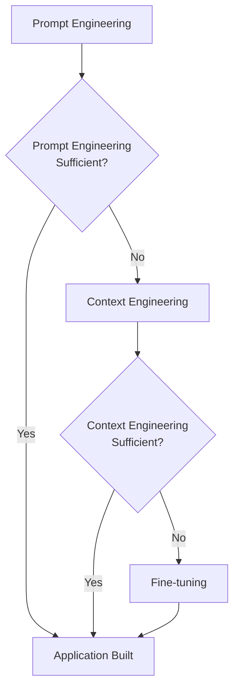
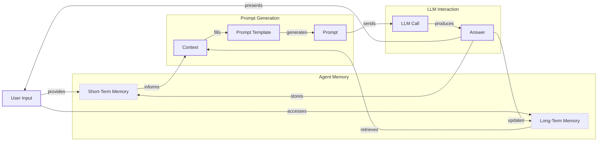
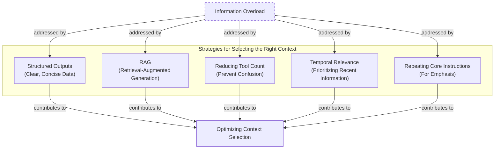
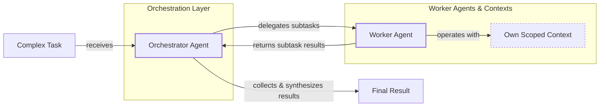

# Lesson 3: Context Engineering

## When prompt engineering breaks

AI applications have evolved rapidly. In 2022, we had simple chatbots. By 2023, Retrieval-Augmented Generation (RAG) systems appeared, a topic we will explore in a future lesson. Now, we build memory-enabled agents that maintain state over time.

In our last lesson, we explored how to choose between AI agents and LLM workflows. As these systems grow more complex, prompt engineering is showing its limits. It excels at single LLM calls but fails with memory and long histories. The information an agent needs has grown exponentially, from user data to documents. Simply stuffing everything into a prompt is not viable. Context engineering is essential for orchestrating this information ecosystem.

## From prompt to context engineering

Prompt engineering is designed for single, stateless interactions. This approach fails in stateful applications where context must be managed across multiple turns. As a conversation progresses, the context grows, leading to context decay where the model gets confused by the noise of an expanding history [[1]].

Every token also adds to the cost and latency of an LLM call [[2]]. We will explore these concepts in more detail in upcoming lessons. Stuffing everything into the context creates a slow and expensive system. We learned this the hard way on a project where a large context led to a 30-minute runtime and poor results [[3]].

Context engineering solves these issues by shifting focus to dynamic systems that manage information flow. Your job becomes selecting only the most critical context for each LLM call, making applications accurate, fast, and cost-effective.

## Understanding context engineering

Context engineering is the optimization problem of arranging information from memory into the context passed to an LLM [[2]]. For example, a cooking agent retrieves a specific recipe and user allergies, not the entire cookbook. This ensures the model receives only essential information.

Andrej Karpathy offers a useful analogy: LLMs are a new operating system, where the model is the CPU and the context window is the RAM [[4]]. Context engineering manages what occupies this limited working memory.

Prompt engineering is a subset of context engineering [[5]]. You still write good prompts, but you also design a system that feeds the right context into them.

| Dimension | Prompt Engineering | Context Engineering |
| --- | --- | --- |
| Scope | Single interaction optimization | Entire information ecosystem |
| State Management | Primarily stateless | Inherently stateful, with explicit memory management |
| Focus | How to phrase tasks | What information to provide |

Table 1: A comparison of prompt engineering and context engineering.

Context engineering is also the new fine-tuning. Fine-tuning is expensive and inflexible, making it a last resort in a world of constantly changing data [[6]]. For most enterprise cases, context engineering delivers better results faster and more cheaply [[7]]. It allows for rapid iteration without altering the core model.

When starting a new AI project, your decision-making process should follow the workflow in Image 1.



Image 1: A simplified flowchart illustrating the decision-making workflow for building AI applications.

For instance, to process Slack messages, you don't need to fine-tune a model. It is more effective to engineer the context to retrieve specific messages and enable actions. Throughout this course, we will focus on solving problems with context engineering.

## What makes up the context

To master context engineering, you must understand what "context" is. It is everything the LLM sees in a single turn, dynamically assembled from various memory components. We will present these concepts intuitively, as they will be covered in depth in future lessons. The high-level workflow, shown in Image 2, starts with a user input that triggers retrieval from memory. This information is assembled into a prompt, sent to the LLM, and the response updates the memory.



Image 2: A simplified flowchart depicting the high-level workflow of an AI application.

Context components are grouped into two main categories. **Short-term working memory** is the volatile state for the current task. It includes the user's input, the ongoing message history, the agent's internal thoughts, and the outputs from any actions it has performed [[8]]. This allows the agent to maintain a coherent dialogue.

**Long-term memory** is more persistent, storing information across sessions. It includes procedural memory, which defines the agent's built-in skills like its system prompt and action definitions. It also contains episodic memory for specific past experiences like user preferences, and semantic memory, which is the agent's general knowledge base from documents or APIs [[9], [10]].

These components are not static; they are re-computed for every interaction. Context engineering is the skill of selecting the right pieces from this memory pool.

## Production implementation challenges

Implementing context engineering in production presents several challenges, all centered on keeping the context small yet informative.

First is **the context window challenge**. Every model has a limited context window, the maximum tokens it can process at once. This is like your computer's RAM. While context windows are growing, they are not infinite [[2]].

Second, **information overload** reduces LLM performance. This "lost-in-the-middle" problem means models often ignore information in the middle of a long context, with performance dropping long before the token limit is reached [[1], [11]].

Third, **context drift** occurs when conflicting information accumulates in memory over time, such as two different budget amounts for a user. Without a way to resolve these conflicts, the agent's knowledge becomes unreliable [[12]].

Finally, **action confusion** arises when an agent has too many actions, or when their descriptions are poor or overlapping. This can paralyze the agent or cause it to pick the wrong action, leading to failed tasks [[3]].

## Key strategies for context optimization

Initially, most AI applications were chatbots over single knowledge bases. Today, modern AI solutions must manage multiple knowledge bases, actions, and complex conversational histories. Context engineering is about managing this complexity while meeting performance, latency, and cost requirements.

Here are four popular context engineering strategies used across the industry:

### Selecting the Right Context

Retrieving the right information from memory is a critical first step. A common mistake is to provide everything at once. To solve this, consider the approaches shown in Image 3. These include using structured outputs, applying RAG to fetch specific text chunks, reducing the number of available actions, ranking time-sensitive data, and repeating core instructions at the start and end of the prompt [[13], [14], [15]].



Image 3: A diagram illustrating strategies for selecting the right context to combat information overload.

We will cover structured outputs in our next lesson and RAG in a future one.

### Context Compression

As message history grows, you must manage past interactions to keep your context window in check. As illustrated in Image 4, you can do this through summarization of past interactions, moving user preferences to long-term memory, or deduplication to remove redundant information [[16]].

```mermaid
flowchart LR
    %% Problem statement
    A["Growing Message History"]

    %% Overall Goal/Process
    B["Context Compression"]

    %% Strategies
    subgraph "Context Compression Strategies"
        C["Summarization"]
        D["Moving Preferences to Long-Term Memory"]
        E["Deduplication"]
    end

    %% Examples
    subgraph "Implementation Examples"
        C1["LLM-generated summaries<br/>of older turns"]
        D1["Storing key facts<br/>in vector DBs"]
        E1["Removing redundant information"]
    end

    %% Outcome
    F["Reduced Context Size"]

    A -- "necessitates" --> B
    B -- "employs" --> C
    B -- "employs" --> D
    B -- "employs" --> E

    C -- "e.g." --> C1
    D -- "e.g." --> D1
    E -- "e.g." --> E1

    C1 --> F
    D1 --> F
    E1 --> F

    %% Visual grouping (without custom styling)
    classDef problem
    classDef process
    classDef strategy
    classDef example
    classDef outcome

    class A problem
    class B process
    class C,D,E strategy
    class C1,D1,E1 example
    class F outcome
```

Image 4: A diagram illustrating strategies for context compression.

### Isolating Context

Another powerful strategy is to isolate context by splitting information across multiple agents or LLM workflows [[17]]. As shown in Image 5, we often implement this using an orchestrator-worker pattern, where a central orchestrator agent breaks down a problem and assigns sub-tasks to specialized worker agents [[18]].



Image 5: A simplified diagram illustrating the Orchestrator-Worker Pattern for Isolating Context.

### Format Optimizations

Finally, the way you format the context matters. Models are sensitive to structure, and using clear delimiters can improve performance. Common strategies are to use XML tags to wrap different pieces of context and prefer YAML over JSON, as it can be more token-efficient [[3]].

## Here is an example

Let's connect theory with concrete examples. Context engineering is applied in many real-world scenarios, from healthcare assistants providing diagnostic support to financial agents integrating with Customer Relationship Management (CRM) systems [[19]].

Let's walk through a query with a healthcare assistant. A user asks: `I have a headache. What can I do to stop it? I would prefer not to take any medicine.`

Before answering, a context engineering system gets to work. It retrieves the user's patient history from episodic memory and queries a medical database for non-medicinal remedies from semantic memory [[8], [10]]. This information is assembled into a structured prompt, sent to the LLM, which then generates a personalized answer.

Here is a simplified pseudocode snippet showing how you might structure the prompt using XML tags and YAML:

```python
SYSTEM_PROMPT = """
You are a helpful and cautious AI healthcare assistant.
Your goal is to provide safe, non-medicinal advice.

<PATIENT_HISTORY>
{retrieved_patient_history_in_yaml}
</PATIENT_HISTORY>

<MEDICAL_KNOWLEDGE>
{retrieved_medical_articles_in_yaml}
</MEDICAL_KNOWLEDGE>

<USER_QUERY>
{user_query}
</USER_QUERY>

Based on all the information above, provide a helpful response.
"""
```

To build such a system, you need a robust tech stack. This typically includes an LLM like Gemini, an orchestration framework like LangGraph, databases for long-term memory, and observability platforms for debugging [[20], [21], [22]].

## Connecting context engineering to AI engineering

Context engineering is about developing the intuition to structure prompts and select the right information for optimal results. This discipline is not learned in isolation; it is a multidisciplinary practice that combines AI Engineering, Software Engineering, Data Engineering, and MLOps [[23]].

Our goal with this course is to teach you how to integrate these skills to build production-ready AI products, shifting your mindset from a developer to an architect. By mastering context engineering, you build the foundation for creating intelligent systems that are not only powerful but also reliable and efficient. In the next lesson, we will explore structured outputs.

## References

- [1] https://www.trychroma.com/research/context-rot
- [2] https://arxiv.org/pdf/2507.13334
- [3] https://www.decodingai.com/p/context-engineering-2025s-1-skill
- [4] https://x.com/karpathy/status/1937902205765607626
- [5] https://www.glean.com/blog/context-engineering-ai-the-foundation-of-reliable-high-performing-models
- [6] https://www.instinctools.com/blog/context-engineering/
- [7] https://neo4j.com/blog/agentic-ai/context-engineering-vs-prompt-engineering/
- [8] https://labelstud.io/learningcenter/episodic-vs-persistent-memory-in-llms/
- [9] https://www.analyticsvidhya.com/blog/2026/01/how-does-llm-memory-work/
- [10] https://skymod.tech/why-memory-matters-in-llm-agents-short-term-vs-long-term-memory-architectures/
- [11] https://bigdataboutique.com/blog/needle-in-haystack-optimizing-retrieval-and-rag-over-long-context-windows-5dfb3c
- [12] https://galileo.ai/blog/production-llm-monitoring-strategies
- [13] https://www.mezmo.com/learn-observability/context-engineering-for-observability-how-to-deliver-the-right-data-to-llms
- [14] https://www.dailydoseofds.com/llmops-crash-course-part-8/
- [15] https://promptmetheus.com/resources/llm-knowledge-base/lost-in-the-middle-effect
- [16] https://oneuptime.com/blog/post/2026-01-30-context-compression/view
- [17] https://www.vellum.ai/blog/multi-agent-systems-building-with-context-engineering
- [18] https://beam.ai/agentic-insights/multi-agent-orchestration-patterns-production
- [19] https://sombrainc.com/blog/ai-context-engineering-guide
- [20] https://blog.stackademic.com/context-engineering-in-llms-and-ai-agents-eb861f0d3e9b
- [21] https://atlan.com/know/context-engineering-platforms-comparison/
- [22] https://www.scalablepath.com/machine-learning/langgraph
- [23] https://packmind.com/context-engineering-ai-coding/what-is-contextops/