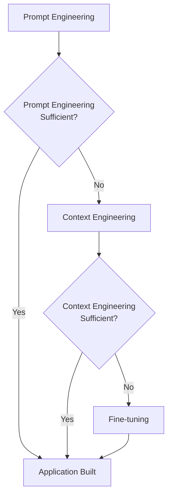
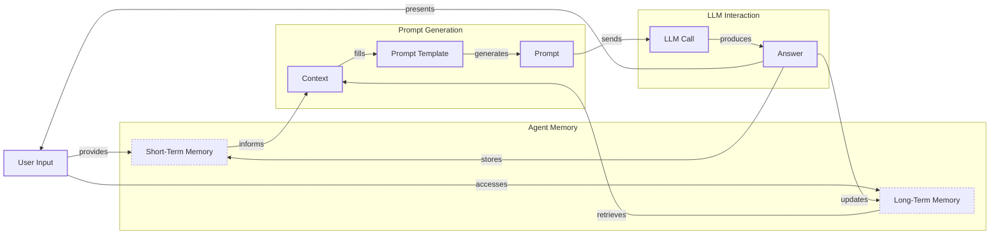
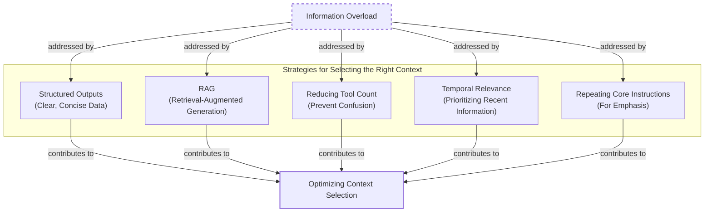
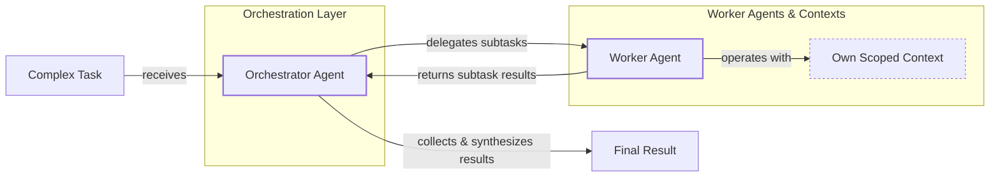

# Lesson 3: Context Engineering

AI applications have evolved rapidly. In 2022, we had simple chatbots for question-answering. By 2023, Retrieval-Augmented Generation (RAG) systems connected LLMs to domain-specific knowledge. Now, we are building memory-enabled agents that remember past interactions and build relationships over time.

In our last lesson, we explored how to choose between AI agents and LLM workflows when designing a system. As these applications grow more complex, prompt engineering, a practice that once served us well, is showing its limits. It optimizes single LLM calls but fails when managing systems with memory, actions, and long interaction histories. The sheer volume of information an agent might need—past conversations, user data, documents, and action descriptions—has grown exponentially. Simply stuffing all this into a prompt is not a viable strategy. This is where context engineering comes in. It is the discipline of orchestrating this entire information ecosystem to ensure the LLM gets exactly what it needs, when it needs it. This skill is becoming a core foundation for AI engineering.

## From prompt to context engineering

Prompt engineering, while effective for simple tasks, is designed for single, stateless interactions. It treats each call to an LLM as a new, isolated event. This approach breaks down in stateful applications where context must be preserved and managed across multiple turns.

As a conversation or task progresses, the context grows. Without a strategy to manage this growth, the LLM’s performance degrades. This is context decay: the model gets confused by the noise of an ever-expanding history and starts to lose track of the original instructions or key information [[3]].

Even with large context windows, a physical limit exists for what you can include. Also, on the operational side, every token adds to the cost and latency of an LLM call [[22]]. Simply putting everything into the context creates a slow, expensive, and underperforming system. We will explore these concepts in more detail in upcoming lessons, including memory and RAG.

On a recent project, we learned this the hard way. We were working with a model that supported a million-token context window, so we thought, "*What could go wrong*?" We stuffed everything in: our research, guidelines, examples, and user history. The result was an LLM workflow that took 30 minutes to run and produced low-quality outputs [[41]].

This is where context engineering becomes essential. It shifts the focus from crafting static prompts to building dynamic systems that manage information flow from various sources. As an AI engineer, your job is to select only the most critical pieces of context for each LLM call. This makes your applications accurate, fast, and cost-effective.

## Understanding context engineering

Context engineering involves finding the optimal way to arrange information from your application's memory into the context passed to an LLM. It is a solution to an optimization problem where you retrieve the right parts from your short-term and long-term memory to solve a specific task without overwhelming the model [[22]]. For example, when you ask a cooking agent for a recipe, you do not give it the entire cookbook. Instead, you retrieve the specific recipe, along with personal context like allergies or taste preferences. This precise selection ensures the model receives only the essential information.

Andrej Karpathy explains that LLMs are like a new kind of operating system where the model is the CPU and its context window is the RAM [[23]]. Just as an operating system manages what fits into your computer’s limited RAM, context engineering manages what information occupies the model’s limited context window.

How does context engineering relate to prompt engineering? It's simple. Prompt engineering is a subset of context engineering [[20]]. You still write effective prompts, but you also design a system that feeds the right context into those prompts. This means understanding not just *how* to phrase a task, but *what* information the model needs to perform optimally.

| Dimension | Prompt Engineering | Context Engineering |
| --- | --- | --- |
| Scope | Single interaction optimization | Entire information ecosystem |
| State Management | Primarily stateless | Inherently stateful, with explicit memory management |
| Focus | How to phrase tasks | What information to provide |

Table 1: A comparison of prompt engineering and context engineering.

Context engineering is the new fine-tuning. While fine-tuning has its place, it is expensive, time-consuming, and inflexible. Data changes constantly, making fine-tuning a last resort [[51]]. For most enterprise use cases, you get better results faster and more cheaply with context engineering [[52]]. It allows for rapid iteration and adaptation to evolving data without altering the core model, a key advantage in dynamic environments.

When you start a new AI project, your decision-making process for guiding the LLM should look like the one presented in Image 1.



Image 1: A simplified flowchart illustrating the decision-making workflow for building AI applications.

For instance, if you build an agent to process internal Slack messages, you do not need to fine-tune a model on your company’s communication style. It is more effective to use a powerful reasoning model and engineer the context to retrieve specific messages and enable actions like creating tasks or drafting emails. Throughout this course, we will show you how to solve most industry problems using only context engineering.

## What makes up the context

To master context engineering, you first need to understand what "context" actually is. It is everything the LLM sees in a single turn, dynamically assembled from various memory components before being passed to the model.

The high-level workflow, as presented in Image 2, begins when a user input triggers the system to pull relevant information from both long-term and short-term memory. This information is assembled into the final context, inserted into a prompt template, and sent to the LLM. The LLM’s answer then updates the memory, and the cycle repeats.



Image 2: A simplified flowchart depicting the high-level workflow of an AI application.

These components are grouped into two main categories. We will explain them intuitively for now, as we have future dedicated lessons for all of them.

### Short-Term Working Memory

Short-term working memory is the state of the agent for the current task or conversation. It is volatile and changes with each interaction, helping the agent maintain a coherent dialogue and make immediate decisions. It can include some or all of these components [[39]]:

*   **User input:** The most recent query or command from the user.
*   **Message history:** The log of the current conversation, allowing the LLM to understand the flow and previous turns.
*   **Agent's internal thoughts:** The reasoning steps the agent takes to decide on its next action.
*   **Action calls and outputs:** The results from any actions the agent has performed, providing information from external systems.

### Long-Term Memory

Long-term memory is more persistent and stores information across sessions, allowing the AI system to remember things beyond a single conversation. We divide it into three types, drawing parallels from human memory [[37]]. An AI system can include some or all of them:

*   **Procedural memory:** This is knowledge encoded directly in the code. It includes the system prompt, which sets the agent's overall behavior. It also includes the definitions of available actions, which tell the agent what it can do, and schemas for structured outputs, which guide the format of its responses. Think of this as the agent's built-in skills.
*   **Episodic memory:** This is memory of specific past experiences, like user preferences or previous interactions. It's used to help the agent personalize its responses based on individual users. We typically store this in vector or graph databases for efficient retrieval.
*   **Semantic memory:** This is the agent’s general knowledge base. It can be internal, like company documents stored in a data lake, or external, accessed via the internet through API calls or web scraping. This memory provides the factual information the agent needs to answer questions.

If this seems like a lot, bear with us. We will cover all these concepts in-depth in future lessons, including structured outputs, actions, memory, and RAG.

The key takeaway is that these components are not static. They are dynamically re-computed for every single interaction. For each conversation turn or new task, the short-term memory grows, or the long-term memory can change. Context engineering involves knowing how to select the right pieces from this vast memory pool to construct the most effective prompt for the task at hand.

## Production implementation challenges

Now that we understand what makes up the context, let's look at the core challenges of implementing it in production. These challenges all revolve around a single question: *"How can I keep my context as small as possible while providing enough information to the LLM?"*

Here are four common issues that come up when building AI applications:

1.  **The context window challenge:** Every AI model has a limited context window, the maximum amount of information (tokens) it can process at once. Think of it like your computer's RAM. While context windows are getting larger, they are not infinite, and treating them as such leads to other problems [[22]].
2.  **Information overload:** Just because you can fit a lot of information into the context does not mean you should. Too much context reduces the performance of the LLM by confusing it. This is known as the *"lost-in-the-middle"* or *"needle in the haystack"* problem, where LLMs are known for remembering information best at the beginning and end of the context window. Information in the middle is often overlooked, and performance can drop long before the physical context limit is reached [[56], [3]].
3.  **Context drift:** This occurs when conflicting views of truth accumulate in the memory over time [[8]]. For example, the memory might contain two conflicting statements: "*The user's budget is $500*" and later "*The user's budget is $1,000*." This is a data conflict that confuses the LLM. Without a mechanism to resolve these conflicts, the model's responses become unreliable [[6]].
4.  **Tool confusion:** The final challenge is tool confusion, which arises when an agent has too many actions with poorly written descriptions or overlapping functionalities. The Gorilla benchmark shows that nearly all models perform worse when given more than one tool [[41]]. The agent gets paralyzed by choice or picks the wrong tool, leading to failed tasks.

## Key strategies for context optimization

Initially, most AI applications were chatbots over single knowledge bases. Today, modern AI solutions must manage multiple knowledge bases, tools, and complex conversational histories. Context engineering is about managing this complexity while meeting performance, latency, and cost requirements.

Here are four popular context engineering strategies used across the industry:

### Selecting the Right Context

Retrieving the right information from memory is a critical first step. A common mistake is to provide everything at once, assuming that models with large context windows can handle it. To solve this, consider these approaches:

*   **Use structured outputs:** Define clear schemas for what the LLM should return. This allows you to pass only the necessary, structured information to downstream steps. We will cover this in detail in a future lesson.
*   **Use RAG:** Instead of providing entire documents, use RAG to fetch only the specific chunks of text needed to answer a user's question. This is a core topic we will explore in a future lesson.
*   **Reduce the number of available actions:** Rather than giving an agent access to every available action, use various strategies to delegate action subsets to specialized components. Studies show that limiting the selection to under 30 tools can triple the agent's selection accuracy [[21]].
*   **Rank time-sensitive data:** For time-sensitive information, rank it by date and filter out anything no longer relevant [[12]].
*   **Repeat core instructions:** For the most important instructions, repeat them at both the start and the end of the prompt. This uses the model's tendency to pay more attention to the context edges, ensuring core instructions are not lost [[57]].



Image 3: A diagram illustrating strategies for selecting the right context to combat information overload.

### Context Compression

As message history grows in short-term working memory, you must manage past interactions to keep your context window in check. You cannot simply drop past conversation turns, as the LLM still needs to remember what happened. Instead, you need ways to compress key facts from the past. You can do this through summarization of past interactions, moving user preferences to long-term memory, or deduplication to remove redundant information [[11]].

```mermaid
flowchart LR
    %% Problem statement
    A["Growing Message History"]

    %% Overall Goal/Process
    B["Context Compression"]

    %% Strategies
    subgraph "Context Compression Strategies"
        C["Summarization"]
        D["Moving Preferences to Long-Term Memory"]
        E["Deduplication"]
    end

    %% Examples
    subgraph "Implementation Examples"
        C1["LLM-generated summaries<br/>of older turns"]
        D1["Storing key facts<br/>in vector DBs"]
        E1["Removing redundant information"]
    end

    %% Outcome
    F["Reduced Context Size"]

    A -- "necessitates" --> B
    B -- "employs" --> C
    B -- "employs" --> D
    B -- "employs" --> E

    C -- "e.g." --> C1
    D -- "e.g." --> D1
    E -- "e.g." --> E1

    C1 --> F
    D1 --> F
    E1 --> F

    %% Visual grouping (without custom styling)
    classDef problem
    classDef process
    classDef strategy
    classDef example
    classDef outcome

    class A problem
    class B process
    class C,D,E strategy
    class C1,D1,E1 example
    class F outcome
```

Image 4: A diagram illustrating strategies for context compression.

### Isolating Context

Another powerful strategy is to isolate context by splitting information across multiple agents or LLM workflows. Instead of one agent with a massive, cluttered context window, you can have a team of agents, each with a smaller, focused context [[48]]. We often implement this using an orchestrator-worker pattern, where a central orchestrator agent breaks down a problem and assigns sub-tasks to specialized worker agents [[46]].



Image 5: A simplified diagram illustrating the Orchestrator-Worker Pattern for Isolating Context.

### Format Optimizations

Finally, the way you format the context matters. Models are sensitive to structure, and using clear delimiters can improve performance. Common strategies are to use XML tags to wrap different pieces of context and prefer YAML over JSON, as it can be more token-efficient [[41]].

## Here is an example

Let's connect the theory and strategies discussed earlier with a concrete example. Consider a healthcare assistant scenario. A user asks: `I have a headache. What can I do to stop it? I would prefer not to take any medicine.`

Before the AI attempts to answer, a context engineering system performs several steps:

1.  It retrieves the user's patient history, known allergies, and lifestyle habits from episodic memory [[39]].
2.  It queries a medical database for non-pharmacological headache remedies from semantic memory [[38]].
3.  It assembles the key units of information from both memory types into the final context.
4.  It formats this information into a structured prompt and calls the LLM.
5.  Finally, it presents a personalized, context-aware answer to the user.

Here is a simplified pseudocode snippet showing how you might structure the context and prompt for the LLM, using XML tags and YAML to format the context elements:

```python
SYSTEM_PROMPT = """
You are a helpful and cautious AI healthcare assistant.
Your goal is to provide safe, non-medicinal advice.

<PATIENT_HISTORY>
{retrieved_patient_history_in_yaml}
</PATIENT_HISTORY>

<MEDICAL_KNOWLEDGE>
{retrieved_medical_articles_in_yaml}
</MEDICAL_KNOWLEDGE>

<USER_QUERY>
{user_query}
</USER_QUERY>

Based on all the information above, provide a helpful response.
"""
```

To build such a system, you would use a combination of tools. An LLM like Gemini provides the reasoning engine. A framework like LangGraph orchestrates the workflow. Databases such as PostgreSQL, Qdrant, or Neo4j serve as long-term memory stores. Observability platforms like LangSmith are essential for debugging complex interactions [[62], [64], [65]].

## Connecting context engineering to AI engineering

Mastering context engineering is less about learning a specific algorithm and more about building intuition. It’s the art of knowing how to structure prompts, what information to include, and how to order it for maximum impact.

This skill doesn't exist in a vacuum. It’s a multidisciplinary practice that sits at the intersection of several key engineering fields [[23]]:

*   **AI Engineering:** Understanding LLMs, RAG, and AI agents is the foundation.
*   **Software Engineering:** You need to build scalable and maintainable systems to aggregate context and wrap agents in robust APIs.
*   **Data Engineering:** Constructing reliable data pipelines for RAG and other memory systems is critical.
*   **MLOps:** Deploying agents on the right infrastructure and automating CI/CD makes them reproducible, observable, and scalable.

Our goal with this course is to teach you how to combine these skills to build production-ready AI products. We like to say that in the world of AI, we should all think in systems rather than isolated components. In the next lesson, we will explore structured outputs.

## References

- [1] The LangChain Team. (2025, July 2). Context Engineering. LangChain Blog. [https://blog.langchain.com/context-engineering-for-agents/](https://blog.langchain.com/context-engineering-for-agents/)
- [2] LlamaIndex. (n.d.). Context Engineering - What it is, and techniques to consider. [https://www.llamaindex.ai/blog/context-engineering-what-it-is-and-techniques-to-consider](https://www.llamaindex.ai/blog/context-engineering-what-it-is-and-techniques-to-consider)
- [3] Hong, K., Troynikov, A., & Huber, J. (2025, July). Context Rot: How Increasing Input Tokens Impacts LLM Performance. Chroma. [https://www.trychroma.com/research/context-rot](https://www.trychroma.com/research/context-rot)
- [4] Chase, H. (2025, June 23). The rise of "context engineering". LangChain Blog. [https://blog.langchain.com/the-rise-of-context-engineering/](https://blog.langchain.com/the-rise-of-context-engineering/)
- [5] DataCamp. (n.d.). Context Engineering: A Guide With Examples. [https://www.datacamp.com/blog/context-engineering](https://www.datacamp.com/blog/context-engineering)
- [6] Galileo. (2025, July 18). Seven Strategies to Maintain LLM Reliability Across Diverse Use Cases in Production. [https://galileo.ai/blog/production-llm-monitoring-strategies](https://galileo.ai/blog/production-llm-monitoring-strategies)
- [7] Coforge. (n.d.). Navigating the Shifting Sands: Understanding and Mitigating Data Drift in LLMs. [https://www.coforge.com/what-we-know/blog/navigating-the-shifting-sands-understanding-and-mitigating-data-drift-in-llms](https://www.coforge.com/what-we-know/blog/navigating-the-shifting-sands-understanding-and-mitigating-data-drift-in-llms)
- [8] The New Stack. (n.d.). Context Rot: The Silent Killer of Enterprise AI LLMs. [https://thenewstack.io/context-rot-enterprise-ai-llms/](https://thenewstack.io/context-rot-enterprise-ai-llms/)
- [9] InsightFinder. (n.d.). The Hidden Cost of LLM Drift and Why Early Detection is Key. [https://insightfinder.com/blog/hidden-cost-llm-drift-detection/](https://insightfinder.com/blog/hidden-cost-llm-drift-detection/)
- [10] Helicone. (n.d.). How to Reduce LLM Hallucination: A Practical Guide. [https://www.helicone.ai/blog/how-to-reduce-llm-hallucination](https://www.helicone.ai/blog/how-to-reduce-llm-hallucination)
- [11] OneUptime. (2026, January 30). Context Compression in LLM Applications: Reduce Token Usage by 50-80% Without Sacrificing Accuracy. [https://oneuptime.com/blog/post/2026-01-30-context-compression/view](https://oneuptime.com/blog/post/2026-01-30-context-compression/view)
- [12] Daily Dose of DS. (n.d.). LLMops Crash Course — Part 8: Memory and Temporal Context. [https://www.dailydoseofds.com/llmops-crash-course-part-8/](https://www.dailydoseofds.com/llmops-crash-course-part-8/)
- [13] arXiv. (2025, October). Compressing Item Descriptions for SLM-based Relevance Ranking. [https://arxiv.org/html/2510.22101v1](https://arxiv.org/html/2510.22101v1)
- [14] JetBrains Research. (2025, December). Cutting Through the Noise: Smarter Context Management for LLM-Powered Agents. [https://blog.jetbrains.com/research/2025/12/efficient-context-management/](https://blog.jetbrains.com/research/2025/12/efficient-context-management/)
- [15] Comet. (n.d.). LLM Context Window: Why It Matters and What to Do When You Hit Its Limit. [https://www.comet.com/site/blog/context-window/](https://www.comet.com/site/blog/context-window/)
- [16] DataHub. (n.d.). Context Window Optimization: A Framework for Maximizing LLM Performance. [https://datahub.com/blog/context-window-optimization/](https://datahub.com/blog/context-window-optimization/)
- [17] Maxim.ai. (n.d.). Context Window Management Strategies for Long-Context AI Agents and Chatbots. [https://www.getmaxim.ai/articles/context-window-management-strategies-for-long-context-ai-agents-and-chatbots/](https://www.getmaxim.ai/articles/context-window-management-strategies-for-long-context-ai-agents-and-chatbots/)
- [18] Santhanam, A. (n.d.). Your LLM hits the token limit. LinkedIn. [https://www.linkedin.com/posts/aditya-santhanam_your-llm-hits-the-token-limit-conversation-activity-7425863566190260224-Pz6v](https://www.linkedin.com/posts/aditya-santhanam_your-llm-hits-the-token-limit-conversation-activity-7425863566190260224-Pz6v)
- [19] Packmind. (n.d.). Why AI coding assistants fail without context: an introduction to ContextOps. [https://packmind.com/context-engineering-ai-coding/what-is-contextops/](https://packmind.com/context-engineering-ai-coding/what-is-contextops/)
- [20] Glean. (n.d.). Context engineering AI: The foundation of reliable, high-performing models. [https://www.glean.com/blog/context-engineering-ai-the-foundation-of-reliable-high-performing-models](https://www.glean.com/blog/context-engineering-ai-the-foundation-of-reliable-high-performing-models)
- [21] Mezmo. (n.d.). Context Engineering for Observability: How to Deliver the Right Data to LLMs. [https://www.mezmo.com/learn-observability/context-engineering-for-observability-how-to-deliver-the-right-data-to-llms](https://www.mezmo.com/learn-observability/context-engineering-for-observability-how-to-deliver-the-right-data-to-llms)
- [22] Mei, L., Yao, J., Ge, Y., et al. (2025, July 17). A Survey of Context Engineering for Large Language Models. arXiv. [https://arxiv.org/pdf/2507.13334](https://arxiv.org/pdf/2507.13334)
- [23] Karpathy, A. (n.d.). X. [https://x.com/karpathy/status/1937902205765607626](https://x.com/karpathy/status/1937902205765607626)
- [24] Lena. (n.d.). X. [https://x.com/lenadroid/status/1943685060785524824](https://x.com/lenadroid/status/1943685060785524824)
- [25] Horthy, D. (n.d.). 12-factor-agents/content/factor-03-own-your-context-window.md. GitHub. [https://github.com/humanlayer/12-factor-agents/blob/main/content/factor-03-own-your-context-window.md](https://github.com/humanlayer/12-factor-agents/blob/main/content/factor-03-own-your-context-window.md)
- [26] Security Industry Association. (2024, July 16). Understanding the Evolution from Classic Chatbots to RAG Chatbots to AI-Powered Assistants. [https://www.securityindustry.org/2024/07/16/understanding-the-evolution-from-classic-chatbots-to-rag-chatbots-to-ai-powered-assistants/](https://www.securityindustry.org/2024/07/16/understanding-the-evolution-from-classic-chatbots-to-rag-chatbots-to-ai-powered-assistants/)
- [27] Saravia, E. (2025, July 5). Context Engineering Guide. AI Newsletter. [https://nlp.elvissaravia.com/p/context-engineering-guide](https://nlp.elvissaravia.com/p/context-engineering-guide)
- [28] Pinecone. (n.d.). What is Context Engineering? [https://www.pinecone.io/learn/context-engineering/](https://www.pinecone.io/learn/context-engineering/)
- [29] Atlan. (n.d.). LLM Context Window Limitations And How To Overcome Them. [https://atlan.com/know/llm-context-window-limitations/](https://atlan.com/know/llm-context-window-limitations/)
- [30] AI Apps Central. (n.d.). Most people put all AI systems in the same bucket. LinkedIn. [https://www.linkedin.com/posts/ai-apps-central_most-people-put-all-ai-systems-in-the-same-activity-7438555783077793792-UEUm](https://www.linkedin.com/posts/ai-apps-central_most-people-put-all-ai-systems-in-the-same-activity-7438555783077793792-UEUm)
- [31] LangChain. (2025, July 2). Context Engineering for Agents. [https://blog.langchain.com/context-engineering-for-agents/](https://blog.langchain.com/context-engineering-for-agents/)
- [32] Glean. (n.d.). Context Engineering vs. Prompt Engineering: Key Differences Explained. [https://www.glean.com/perspectives/context-engineering-vs-prompt-engineering-key-differences-explained](https://www.glean.com/perspectives/context-engineering-vs-prompt-engineering-key-differences-explained)
- [33] Atlan. (n.d.). Working Memory in LLMs: The Context Window as Cognitive Architecture. [https://atlan.com/know/working-memory-llms/](https://atlan.com/know/working-memory-llms/)
- [34] Teki, S. (n.d.). From Vibe-Coding to Context Engineering: A Blueprint for Production-Grade GenAI Systems. [https://www.sundeepteki.org/blog/from-vibe-coding-to-context-engineering-a-blueprint-for-production-grade-genai-systems](https://www.sundeepteki.org/blog/from-vibe-coding-to-context-engineering-a-blueprint-for-production-grade-genai-systems)
- [35] Roychowdhury, S. (n.d.). Context Engineering: The Silent Architecture Behind Every AI Agent. LinkedIn. [https://www.linkedin.com/pulse/context-engineering-silent-architecture-behind-every-ai-roychowdhury-lzcec](https://www.linkedin.com/pulse/context-engineering-silent-architecture-behind-every-ai-roychowdhury-lzcec)
- [36] DataCamp. (n.d.). How Does LLM Memory Work? [https://www.datacamp.com/blog/how-does-llm-memory-work](https://www.datacamp.com/blog/how-does-llm-memory-work)
- [37] Analytics Vidhya. (2026, January). How Does LLM Memory Work? [https://www.analyticsvidhya.com/blog/2026/01/how-does-llm-memory-work/](https://www.analyticsvidhya.com/blog/2026/01/how-does-llm-memory-work/)
- [38] Skymod. (n.d.). Why Memory Matters in LLM Agents: Short-Term vs. Long-Term Memory Architectures. [https://skymod.tech/why-memory-matters-in-llm-agents-short-term-vs-long-term-memory-architectures/](https://skymod.tech/why-memory-matters-in-llm-agents-short-term-vs-long-term-memory-architectures/)
- [39] Label Studio. (n.d.). Episodic vs. Persistent Memory in LLMs. [https://labelstud.io/learningcenter/episodic-vs-persistent-memory-in-llms/](https://labelstud.io/learningcenter/episodic-vs-persistent-memory-in-llms/)
- [40] Sombra. (n.d.). AI Context Engineering: A Comprehensive Guide for 2025. [https://sombrainc.com/blog/ai-context-engineering-guide](https://sombrainc.com/blog/ai-context-engineering-guide)
- [41] Iusztin, P. (2025, July 22). Context Engineering: 2025’s #1 Skill in AI. Decoding AI. [https://www.decodingai.com/p/context-engineering-2025s-1-skill](https://www.decodingai.com/p/context-engineering-2025s-1-skill)
- [42] MDPI. (2025). Prompt Engineering in Healthcare: A Comprehensive Guide. [https://www.mdpi.com/2079-9292/13/15/2961](https://www.mdpi.com/2079-9292/13/15/2961)
- [43] Anthropic. (n.d.). Effective context engineering for AI agents. [https://www.anthropic.com/engineering/effective-context-engineering-for-ai-agents](https://www.anthropic.com/engineering/effective-context-engineering-for-ai-agents)
- [44] Beam.ai. (n.d.). Multi-Agent Orchestration Patterns for Production. [https://beam.ai/agentic-insights/multi-agent-orchestration-patterns-production](https://beam.ai/agentic-insights/multi-agent-orchestration-patterns-production)
- [45] GuruSup. (n.d.). The Definitive Guide to Multi-Agent Orchestration. [https://gurusup.com/blog/multi-agent-orchestration-guide](https://gurusup.com/blog/multi-agent-orchestration-guide)
- [46] Vellum. (n.d.). Multi-Agent Systems: Building with Context Engineering. [https://www.vellum.ai/blog/multi-agent-systems-building-with-context-engineering](https://www.vellum.ai/blog/multi-agent-systems-building-with-context-engineering)
- [47] Praetorian. (n.d.). Deterministic AI Orchestration: A Platform Architecture for Autonomous Development. [https://www.praetorian.com/blog/deterministic-ai-orchestration-a-platform-architecture-for-autonomous-development/](https://www.praetorian.com/blog/deterministic-ai-orchestration-a-platform-architecture-for-autonomous-development/)
- [48] arXiv. (2026, January). A Framework for Building and Operating LLM-powered Autonomous Agents. [https://arxiv.org/html/2601.13671v1](https://arxiv.org/html/2601.13671v1)
- [49] Panjuta, D. (n.d.). Prompt Engineering vs. Context Engineering. LinkedIn. [https://www.linkedin.com/posts/denis-panjuta_prompt-engineering-vs-context-engineering-activity-7363945251180322816-1q_m](https://www.linkedin.com/posts/denis-panjuta_prompt-engineering-vs-context-engineering-activity-7363945251180322816-1q_m)
- [50] Memgraph. (n.d.). Prompt Engineering vs. Context Engineering: Which is Right for You? [https://memgraph.com/blog/prompt-engineering-vs-context-engineering](https://memgraph.com/blog/prompt-engineering-vs-context-engineering)
- [51] instinctools. (n.d.). Context Engineering: The Key to Unlocking AI Agent Potential. [https://www.instinctools.com/blog/context-engineering/](https://www.instinctools.com/blog/context-engineering/)
- [52] Neo4j. (n.d.). Agentic AI: Context Engineering vs. Prompt Engineering. [https://neo4j.com/blog/agentic-ai/context-engineering-vs-prompt-engineering/](https://neo4j.com/blog/agentic-ai/context-engineering-vs-prompt-engineering/)
- [53] Dejohn, A. (n.d.). Lost in the Middle: A Lesson in Failing AI Agents Backwards. LinkedIn. [https://www.linkedin.com/pulse/lost-middle-lesson-failing-ai-agents-backwards-anthony-dejohn-01k2e](https://www.linkedin.com/pulse/lost-middle-lesson-failing-ai-agents-backwards-anthony-dejohn-01k2e)
- [54] Promptmetheus. (n.d.). Lost-in-the-Middle Effect. [https://promptmetheus.com/resources/llm-knowledge-base/lost-in-the-middle-effect](https://promptmetheus.com/resources/llm-knowledge-base/lost-in-the-middle-effect)
- [55] dev.to. (n.d.). The 'Lost in the Middle' Problem: Why LLMs Ignore the Middle of Your Context Window. [https://dev.to/thousand_miles_ai/the-lost-in-the-middle-problem-why-llms-ignore-the-middle-of-your-context-window-3al2](https://dev.to/thousand_miles_ai/the-lost-in-the-middle-problem-why-llms-ignore-the-middle-of-your-context-window-3al2)
- [56] BigData Boutique. (n.d.). Needle in a Haystack: Optimizing Retrieval and RAG over Long Context Windows. [https://bigdataboutique.com/blog/needle-in-haystack-optimizing-retrieval-and-rag-over-long-context-windows-5dfb3c](https://bigdataboutique.com/blog/needle-in-haystack-optimizing-retrieval-and-rag-over-long-context-windows-5dfb3c)
- [57] Stackademic. (n.d.). Context Engineering in LLMs and AI Agents. [https://blog.stackademic.com/context-engineering-in-llms-and-ai-agents-eb861f0d3e9b](https://blog.stackademic.com/context-engineering-in-llms-and-ai-agents-eb861f0d3e9b)
- [58] Packmind. (n.d.). How to implement context engineering for AI coding. [https://packmind.com/context-engineering-ai-coding/how-to-implement-context-engineering/](https://packmind.com/context-engineering-ai-coding/how-to-implement-context-engineering/)
- [59] Atlan. (n.d.). Context Engineering Platforms: A Comparison of LangChain, LlamaIndex, Mem0, and More. [https://atlan.com/know/context-engineering-platforms-comparison/](https://atlan.com/know/context-engineering-platforms-comparison/)
- [60] Scalable Path. (n.d.). LangGraph: A Deep Dive into Building Stateful, Multi-Agent Workflows. [https://www.scalablepath.com/machine-learning/langgraph](https://www.scalablepath.com/machine-learning/langgraph)
- [61] Redis. (n.d.). How to Handle Context Window Overflow in Multi-Turn LLM Applications. [https://redis.io/blog/context-window-overflow/](https://redis.io/blog/context-window-overflow/)
- [62] Towards Data Science. (n.d.). Your 1M Context Window LLM is Less Powerful Than You Think. [https://towardsdatascience.com/your-1m-context-window-llm-is-less-powerful-than-you-think/](https://towardsdatascience.com/your-1m-context-window-llm-is-less-powerful-than-you-think/)
- [63] Atlan. (n.d.). LLM Context Window Limitations And How To Overcome Them. [https://atlan.com/know/llm-context-window-limitations/](https://atlan.com/know/llm-context-window-limitations/)