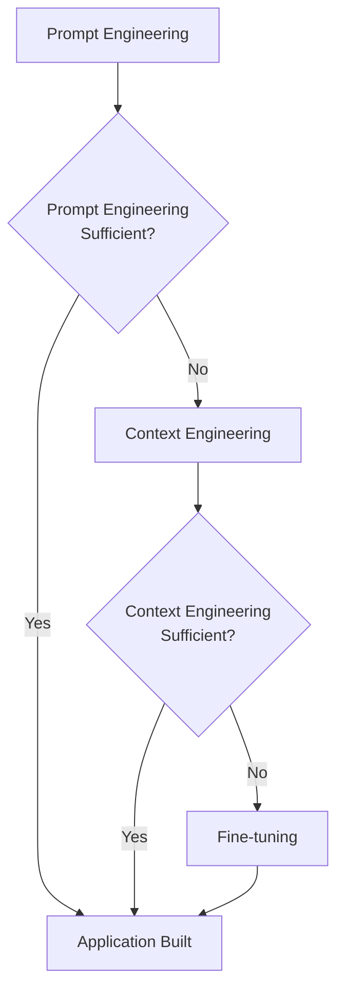
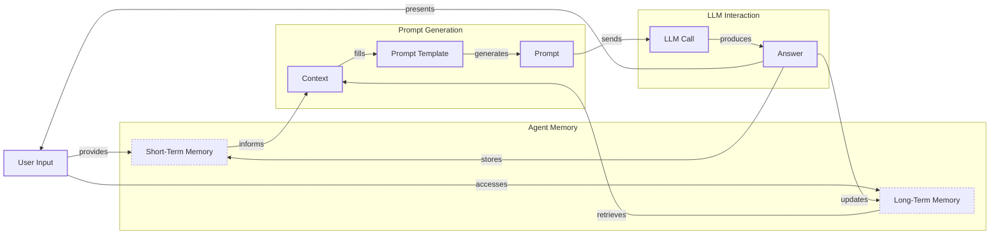
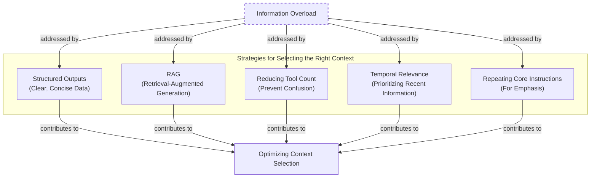
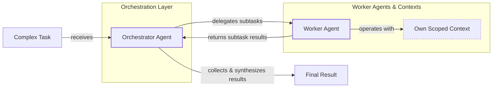

# Lesson 3: Context Engineering

## When prompt engineering breaks

AI applications have evolved rapidly. In 2022, we had simple chatbots. By 2023, Retrieval-Augmented Generation (RAG) systems arrived. Now, we build memory-enabled agents that maintain state over time.

In our last lesson, we explored how to choose between AI agents and LLM workflows. As these systems grow more complex, prompt engineering is showing its limits. It excels at single LLM calls but fails with memory, actions, and long histories. The volume of information an agent might need has grown exponentially. This includes past conversations, user data, and documents. Stuffing everything into a prompt is not a viable strategy. Context engineering orchestrates this information ecosystem, ensuring the LLM gets what it needs, when it needs it.

## From prompt to context engineering

Prompt engineering is designed for single, stateless interactions, treating each LLM call as an isolated event. This approach fails in stateful applications where context must be managed across multiple turns. As a conversation progresses, the context grows, leading to context decay. The model gets confused by the noise of an expanding history and loses track of key information [[3]].

Furthermore, every token adds to the cost and latency of an LLM call [[22]]. Stuffing everything into the context creates a slow and expensive system. We learned this the hard way on a project where a million-token context led to a 30-minute runtime and poor results [[41]].

Context engineering solves these issues by shifting focus from static prompts to dynamic systems that manage information flow. Your job becomes selecting only the most critical context for each LLM call, making applications accurate, fast, and cost-effective.

## Understanding context engineering

Context engineering is the optimization problem of arranging information from memory into the context passed to an LLM [[22]]. For example, a cooking agent retrieves a specific recipe and user allergies, not the entire cookbook. This ensures the model receives only essential information.

Andrej Karpathy offers a useful analogy: LLMs are a new operating system, where the model is the CPU and the context window is the RAM [[23]]. Context engineering manages what occupies this limited working memory.

Prompt engineering is a subset of context engineering [[20]]. You still write good prompts, but you also design a system that feeds the right context into them.

| Dimension | Prompt Engineering | Context Engineering |
| --- | --- | --- |
| Scope | Single interaction optimization | Entire information ecosystem |
| State Management | Primarily stateless | Inherently stateful, with explicit memory management |
| Focus | How to phrase tasks | What information to provide |

Table 1: A comparison of prompt engineering and context engineering.

Context engineering is also the new fine-tuning. Fine-tuning is expensive and inflexible, making it a last resort in a world of constantly changing data [[51]]. For most enterprise cases, context engineering delivers better results faster and more cheaply [[52]]. It allows for rapid iteration without altering the core model.

When starting a new AI project, your decision-making process should follow the workflow in Image 1.



Image 1: A simplified flowchart illustrating the decision-making workflow for building AI applications.

For instance, to process Slack messages, you don't need to fine-tune a model. It is more effective to engineer the context to retrieve specific messages and enable actions. Throughout this course, we will focus on solving problems with context engineering.

## What makes up the context

To master context engineering, you must understand what "context" is. It is everything the LLM sees in a single turn, dynamically assembled from various memory components. The high-level workflow, shown in Image 2, starts with a user input that triggers retrieval from memory. This information is assembled into a prompt, sent to the LLM, and the response updates the memory.



Image 2: A simplified flowchart depicting the high-level workflow of an AI application.

Context components are grouped into two main categories. **Short-term working memory** is the agent's state for the current task, including user input, message history, internal thoughts, and action outputs [[39]]. **Long-term memory** is more persistent, storing information across sessions. It includes procedural memory (the agent's built-in skills like its system prompt and action definitions), episodic memory (specific past experiences like user preferences), and semantic memory (the agent's general knowledge base) [[37]].

These components are not static; they are re-computed for every interaction. Context engineering is the skill of selecting the right pieces from this memory pool. We will cover these concepts in depth in future lessons.

## Production implementation challenges

Implementing context engineering in production presents several challenges, all centered on keeping the context small yet informative.

First is **the context window challenge**. Every model has a limited context window, the maximum tokens it can process at once. This is like your computer's RAM; while windows are growing, they are not infinite [[22]].

Second, **information overload** reduces LLM performance. This "lost-in-the-middle" problem means models often ignore information in the middle of a long context, with performance dropping long before the token limit is reached [[56], [3]].

Third, **context drift** occurs when conflicting information accumulates in memory over time, such as two different budget amounts for a user. Without a way to resolve these conflicts, the agent's knowledge becomes unreliable [[6]].

Finally, **action confusion** arises when an agent has too many actions, or when their descriptions are poor or overlapping. This can paralyze the agent or cause it to pick the wrong action, leading to failed tasks [[41]].

## Key strategies for context optimization

Initially, most AI applications were chatbots over single knowledge bases. Today, modern AI solutions must manage multiple knowledge bases, actions, and complex conversational histories. Context engineering is about managing this complexity while meeting performance, latency, and cost requirements.

Here are four popular context engineering strategies used across the industry:

### Selecting the Right Context

Retrieving the right information from memory is a critical first step. A common mistake is to provide everything at once. To solve this, consider the approaches shown in Image 3. These include using structured outputs, applying RAG to fetch specific text chunks, reducing the number of available actions to under 30, ranking time-sensitive data, and repeating core instructions at the start and end of the prompt [[21], [12], [57]].



Image 3: A diagram illustrating strategies for selecting the right context to combat information overload.

### Context Compression

As message history grows, you must manage past interactions to keep your context window in check. As illustrated in Image 4, you can do this through summarization of past interactions, moving user preferences to long-term memory, or deduplication to remove redundant information [[11]].

```mermaid
flowchart LR
    %% Problem statement
    A["Growing Message History"]

    %% Overall Goal/Process
    B["Context Compression"]

    %% Strategies
    subgraph "Context Compression Strategies"
        C["Summarization"]
        D["Moving Preferences to Long-Term Memory"]
        E["Deduplication"]
    end

    %% Examples
    subgraph "Implementation Examples"
        C1["LLM-generated summaries<br/>of older turns"]
        D1["Storing key facts<br/>in vector DBs"]
        E1["Removing redundant information"]
    end

    %% Outcome
    F["Reduced Context Size"]

    A -- "necessitates" --> B
    B -- "employs" --> C
    B -- "employs" --> D
    B -- "employs" --> E

    C -- "e.g." --> C1
    D -- "e.g." --> D1
    E -- "e.g." --> E1

    C1 --> F
    D1 --> F
    E1 --> F

    %% Visual grouping (without custom styling)
    classDef problem
    classDef process
    classDef strategy
    classDef example
    classDef outcome

    class A problem
    class B process
    class C,D,E strategy
    class C1,D1,E1 example
    class F outcome
```

Image 4: A diagram illustrating strategies for context compression.

### Isolating Context

Another powerful strategy is to isolate context by splitting information across multiple agents or LLM workflows [[48]]. As shown in Image 5, we often implement this using an orchestrator-worker pattern, where a central orchestrator agent breaks down a problem and assigns sub-tasks to specialized worker agents [[46]].



Image 5: A simplified diagram illustrating the Orchestrator-Worker Pattern for Isolating Context.

### Format Optimizations

Finally, the way you format the context matters. Models are sensitive to structure, and using clear delimiters can improve performance. Common strategies are to use XML tags to wrap different pieces of context and prefer YAML over JSON, as it can be more token-efficient [[41]].

## Here is an example

Let's connect the theory and strategies with concrete examples. Context engineering is applied in many real-world scenarios:

*   **Healthcare:** An AI assistant accesses a patient's medical history and the latest medical literature to provide personalized diagnostic support.
*   **Financial Services:** AI systems integrate with enterprise tools like CRMs to combine market data and client information for tailored financial advice.
*   **Project Management:** AI systems access tools like Slack and task managers to automatically understand project requirements and update tasks.
*   **Content Creator Assistant:** An AI agent uses your research and past content to understand what and how to create a new piece of content.

Let's walk through a specific query with the healthcare assistant. A user asks: `I have a headache. What can I do to stop it? I would prefer not to take any medicine.`

Before the AI attempts to answer, a context engineering system performs several steps:

1.  It retrieves the user's patient history, known allergies, and lifestyle habits from episodic memory [[39]].
2.  It queries a medical database for non-pharmacological headache remedies from semantic memory [[38]].
3.  It assembles the key units of information from both memory types into the final context.
4.  It formats this information into a structured prompt and calls the LLM.
5.  Finally, it presents a personalized, context-aware answer to the user.

Here is a simplified pseudocode snippet showing how you might structure the context and prompt for the LLM, using XML tags and YAML to format the context elements:

```python
SYSTEM_PROMPT = """
You are a helpful and cautious AI healthcare assistant.
Your goal is to provide safe, non-medicinal advice.

<PATIENT_HISTORY>
{retrieved_patient_history_in_yaml}
</PATIENT_HISTORY>

<MEDICAL_KNOWLEDGE>
{retrieved_medical_articles_in_yaml}
</MEDICAL_KNOWLEDGE>

<USER_QUERY>
{user_query}
</USER_QUERY>

Based on all the information above, provide a helpful response.
"""
```

To build such a system, you would use a combination of tools. An LLM like Gemini provides the reasoning engine. A framework like LangGraph orchestrates the workflow. Databases such as PostgreSQL, Qdrant, or Neo4j serve as long-term memory stores. Observability platforms like LangSmith are essential for debugging complex interactions [[62], [64], [65]].

## Conclusion - Wrap-up: Connecting context engineering to AI engineering

Context engineering is about developing the intuition to structure prompts and select the right information for optimal results. This discipline is not learned in isolation; it is a multidisciplinary practice that combines AI Engineering, Software Engineering, Data Engineering, and MLOps [[23]].

Our goal with this course is to teach you how to integrate these skills to build production-ready AI products, shifting your mindset from a developer to an architect. By mastering context engineering, you build the foundation for creating intelligent systems that are not only powerful but also reliable and efficient. In the next lesson, we will explore structured outputs.

## References

- [1] https://blog.langchain.com/context-engineering-for-agents/
- [2] https://www.llamaindex.ai/blog/context-engineering-what-it-is-and-techniques-to-consider
- [3] https://www.trychroma.com/research/context-rot
- [4] https://blog.langchain.com/the-rise-of-context-engineering/
- [5] https://www.datacamp.com/blog/context-engineering
- [6] https://galileo.ai/blog/production-llm-monitoring-strategies
- [7] https://www.coforge.com/what-we-know/blog/navigating-the-shifting-sands-understanding-and-mitigating-data-drift-in-llms
- [8] https://thenewstack.io/context-rot-enterprise-ai-llms/
- [9] https://insightfinder.com/blog/hidden-cost-llm-drift-detection/
- [10] https://www.helicone.ai/blog/how-to-reduce-llm-hallucination
- [11] https://oneuptime.com/blog/post/2026-01-30-context-compression/view
- [12] https://www.dailydoseofds.com/llmops-crash-course-part-8/
- [13] https://arxiv.org/html/2510.22101v1
- [14] https://blog.jetbrains.com/research/2025/12/efficient-context-management/
- [15] https://www.comet.com/site/blog/context-window/
- [16] https://datahub.com/blog/context-window-optimization/
- [17] https://www.getmaxim.ai/articles/context-window-management-strategies-for-long-context-ai-agents-and-chatbots/
- [18] https://www.linkedin.com/posts/aditya-santhanam_your-llm-hits-the-token-limit-conversation-activity-7425863566190260224-Pz6v
- [19] https://packmind.com/context-engineering-ai-coding/what-is-contextops/
- [20] https://www.glean.com/blog/context-engineering-ai-the-foundation-of-reliable-high-performing-models
- [21] https://www.mezmo.com/learn-observability/context-engineering-for-observability-how-to-deliver-the-right-data-to-llms
- [22] https://arxiv.org/pdf/2507.13334
- [23] https://x.com/karpathy/status/1937902205765607626
- [24] https://x.com/lenadroid/status/1943685060785524824
- [25] https://github.com/humanlayer/12-factor-agents/blob/main/content/factor-03-own-your-context-window.md
- [26] https://www.securityindustry.org/2024/07/16/understanding-the-evolution-from-classic-chatbots-to-rag-chatbots-to-ai-powered-assistants/
- [27] https://nlp.elvissaravia.com/p/context-engineering-guide
- [28] https://www.pinecone.io/learn/context-engineering/
- [29] https://atlan.com/know/llm-context-window-limitations/
- [30] https://www.linkedin.com/posts/ai-apps-central_most-people-put-all-ai-systems-in-the-same-activity-7438555783077793792-UEUm
- [31] https://blog.langchain.com/context-engineering-for-agents/
- [32] https://www.glean.com/perspectives/context-engineering-vs-prompt-engineering-key-differences-explained
- [33] https://atlan.com/know/working-memory-llms/
- [34] https://www.sundeepteki.org/blog/from-vibe-coding-to-context-engineering-a-blueprint-for-production-grade-genai-systems
- [35] https://www.linkedin.com/pulse/context-engineering-silent-architecture-behind-every-ai-roychowdhury-lzcec
- [36] https://www.datacamp.com/blog/how-does-llm-memory-work
- [37] https://www.analyticsvidhya.com/blog/2026/01/how-does-llm-memory-work/
- [38] https://skymod.tech/why-memory-matters-in-llm-agents-short-term-vs-long-term-memory-architectures/
- [39] https://labelstud.io/learningcenter/episodic-vs-persistent-memory-in-llms/
- [40] https://sombrainc.com/blog/ai-context-engineering-guide
- [41] https://www.decodingai.com/p/context-engineering-2025s-1-skill
- [42] https://www.mdpi.com/2079-9292/13/15/2961
- [43] https://www.anthropic.com/engineering/effective-context-engineering-for-ai-agents
- [44] https://beam.ai/agentic-insights/multi-agent-orchestration-patterns-production
- [45] https://gurusup.com/blog/multi-agent-orchestration-guide
- [46] https://www.vellum.ai/blog/multi-agent-systems-building-with-context-engineering
- [47] https://www.praetorian.com/blog/deterministic-ai-orchestration-a-platform-architecture-for-autonomous-development/
- [48] https://arxiv.org/html/2601.13671v1
- [49] https://www.linkedin.com/posts/denis-panjuta_prompt-engineering-vs-context-engineering-activity-7363945251180322816-1q_m
- [50] https://memgraph.com/blog/prompt-engineering-vs-context-engineering
- [51] https://www.instinctools.com/blog/context-engineering/
- [52] https://neo4j.com/blog/agentic-ai/context-engineering-vs-prompt-engineering/
- [53] https://www.linkedin.com/pulse/lost-middle-lesson-failing-ai-agents-backwards-anthony-dejohn-01k2e
- [54] https://promptmetheus.com/resources/llm-knowledge-base/lost-in-the-middle-effect
- [55] https://dev.to/thousand_miles_ai/the-lost-in-the-middle-problem-why-llms-ignore-the-middle-of-your-context-window-3al2
- [56] https://bigdataboutique.com/blog/needle-in-haystack-optimizing-retrieval-and-rag-over-long-context-windows-5dfb3c
- [57] https://blog.stackademic.com/context-engineering-in-llms-and-ai-agents-eb861f0d3e9b
- [58] https://packmind.com/context-engineering-ai-coding/how-to-implement-context-engineering/
- [59] https://atlan.com/know/context-engineering-platforms-comparison/
- [60] https://www.scalablepath.com/machine-learning/langgraph
- [61] https://redis.io/blog/context-window-overflow/
- [62] https://towardsdatascience.com/your-1m-context-window-llm-is-less-powerful-than-you-think/
- [63] https://atlan.com/know/llm-context-window-limitations/
- [64] https://blog.stackademic.com/context-engineering-in-llms-and-ai-agents-eb861f0d3e9b
- [65] https://www.scalablepath.com/machine-learning/langgraph