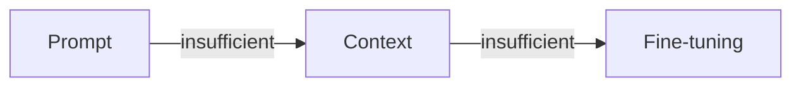
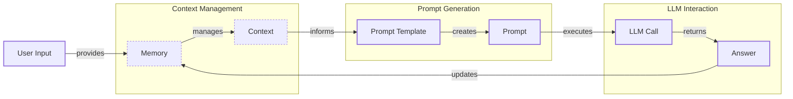
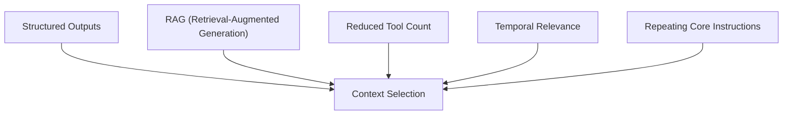
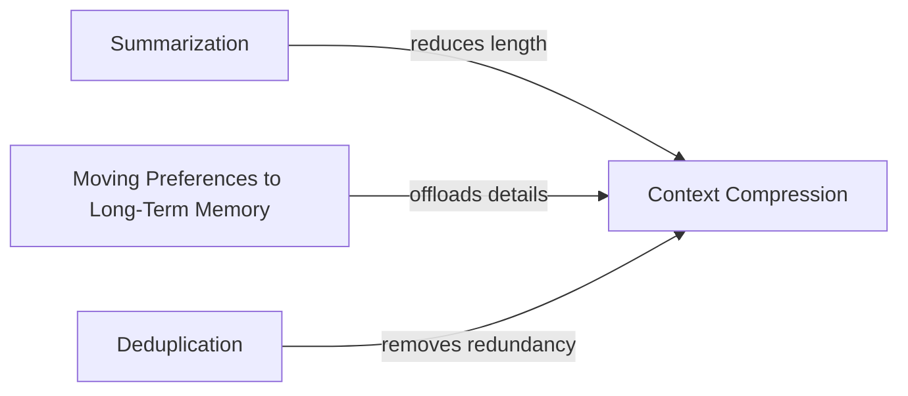
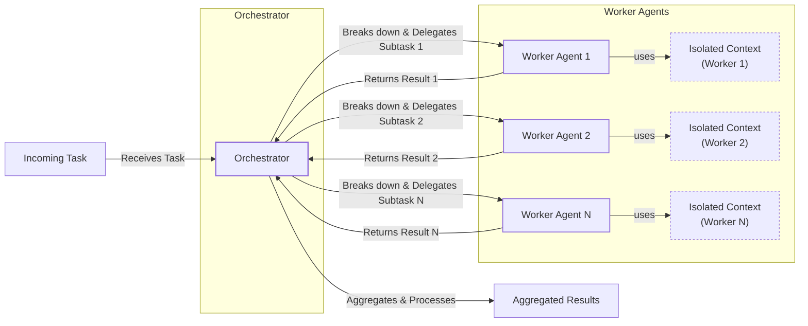

AI applications have evolved rapidly. In 2022, we had simple chatbots for question-answering. By 2023, Retrieval-Augmented Generation (RAG) systems connected LLMs to domain-specific knowledge. 2024 brought us agents that could perform actions. Now, we are building memory-enabled agents that remember past interactions and build relationships over time [[26]](https://www.securityindustry.org/2024/07/16/understanding-the-evolution-from-classic-chatbots-to-rag-chatbots-to-ai-powered-assistants/), [[27]](https://pagergpt.ai/ai-chatbot/evolution-of-ai-chatbots).

In our last lesson, we explored AI agents and LLM workflows. As these applications grow more complex, prompt engineering, which optimizes single LLM calls, is no longer enough. The volume of information an agent might need has grown exponentially, and a new discipline is needed to orchestrate this information flow.

## From prompt to context engineering

Prompt engineering, while effective for simple tasks, is designed for single, stateless interactions. It treats each call to an LLM as a new, isolated event. This approach breaks down in stateful applications where context must be preserved and managed across multiple turns [[22]](https://www.mezmo.com/learn-observability/context-engineering-for-observability-how-to-deliver-the-right-data-to-llms), [[52]](https://memgraph.com/blog/prompt-engineering-vs-context-engineering).

As a conversation progresses, the context grows. Without a strategy to manage this growth, the LLM’s performance degrades. This is context decay: the model gets confused by the noise of an ever-expanding history and loses track of the original instructions [[3]](https://www.trychroma.com/research/context-rot). Even with large context windows, every token adds to the cost and latency of an LLM call. A focus on building dynamic systems that manage information flow is essential. This makes applications accurate, fast, and cost-effective. We will explore these concepts in more detail in upcoming lessons.

## Understanding context engineering

Context engineering is the practice of designing systems that decide what information an AI model sees before it generates a response. It is a solution to an optimization problem where you retrieve the right parts from your application's memory to solve a specific task without overwhelming the model. For example, when you ask a cooking agent for a recipe, you do not give it the entire cookbook. Instead, you retrieve the specific recipe, along with personal context like allergies. This precise selection ensures the model receives only the essential information.

Andrej Karpathy explains that LLMs are like a new kind of operating system where the model is the CPU and its context window is the RAM [[31]](https://www.langchain.com/blog/context-engineering-for-agents/), [[33]](https://atlan.com/know/working-memory-llms/). Just as an operating system manages what fits into your computer’s limited RAM, context engineering manages what information occupies the model’s limited context window.

Prompt engineering is a subset of context engineering. You still write effective prompts, but you also design a system that feeds the right context into those prompts. This means understanding not just *how* to phrase a task, but *what* information the model needs to perform optimally.

Table 1: A comparison of prompt engineering and context engineering.

| Dimension | Prompt Engineering | Context Engineering |
| :--- | :--- |
| Scope | Single interaction optimization | Entire information ecosystem |
| State Management | Stateless function | Stateful due to memory |
| Focus | How to phrase tasks | What information to provide |

Context engineering is often preferred over fine-tuning. While fine-tuning has its place, it is expensive and inflexible, making it a last resort when data changes constantly [[51]](https://www.linkedin.com/posts/denis-panjuta_prompt-engineering-vs-context-engineering-activity-7363945251180322816-1q_m). Context engineering allows for rapid iteration without altering the core model. When starting a new AI project, your decision-making process should follow the workflow in Image 1.


Image 1: Decision-making workflow for AI application development

For instance, if you build an agent to process internal Slack messages, you do not need to fine-tune a model on your company’s communication style. It is more effective to use a powerful reasoning model and engineer the context to retrieve specific messages and enable actions. Throughout this course, we will show you how to solve most industry problems using only context engineering.

## What makes up the context

To master context engineering, you first need to understand what "context" is. It is everything the LLM sees in a single turn, dynamically assembled from various memory components before being passed to the model. The high-level workflow begins when user input triggers the system to pull relevant information from memory. This information is assembled into the final context, inserted into a prompt template, and sent to the LLM. The LLM’s answer then updates the memory, and the cycle repeats.


Image 2: A simplified Mermaid diagram illustrating the high-level workflow of how context is processed in an AI application.

These components are grouped into two main categories. We will explain them intuitively for now, as we have dedicated lessons for all of them.

**Short-term working memory** is the state of the agent for the current task or conversation. It is volatile and changes with each interaction, helping the agent maintain a coherent dialogue and make immediate decisions. It includes the user's most recent query, the log of the current conversation, the reasoning steps the agent takes, and the results from any actions performed [[36]](https://atlan.com/know/working-memory-llms/).

**Long-term memory** is persistent and stores information across sessions. We divide it into three types, drawing parallels from human memory [[37]](https://www.datacamp.com/blog/how-does-llm-memory-work/), [[38]](https://www.analyticsvidhya.com/blog/2026/01/how-does-llm-memory-work/).

**Procedural memory** is knowledge encoded in the code. This includes the system prompt that sets the agent's behavior and the definitions of available actions.

**Episodic memory** contains specific past experiences, like user preferences. Research inspired by human cognition explores organizing this memory into "episodic events" to improve retrieval and handle vast contexts [[7]](https://openreview.net/pdf?id=BI2int5SAC).

**Semantic memory** is the agent’s general knowledge base. It can be internal company documents or external information accessed via the internet.

We will cover these concepts in-depth in future lessons. The key takeaway is that these components are dynamic. Context engineering involves selecting the right pieces from this memory pool to construct the most effective prompt.
Image 3: Context engineering encompasses a variety of techniques and information sources (Source [humanlayer/12-factor-agents [5]](https://github.com/humanlayer/12-factor-agents/blob/main/content/factor-03-own-your-context-window.md))

## Production implementation challenges

Now that we understand what makes up the context, let's look at the core challenges of implementing it in production. These all revolve around a single question: *"How can I keep my context as small as possible while providing enough information to the LLM?"*

**The context window challenge** is a primary concern. Every model has a limited context window, and long-running agents can quickly fill it, leading to information loss [[1]](https://atlan.com/know/llm-context-window-limitations/), [[2]](https://redis.io/blog/context-window-overflow/). Researchers are developing new architectures inspired by human episodic memory to handle extensive contexts more efficiently [[7]](https://openreview.net/pdf?id=BI2int5SAC).

**Information overload** is another issue. Too much context confuses the LLM, a problem known as "lost-in-the-middle," where performance drops long before the context limit is reached. This is due to positional biases in the transformer architecture [[56]](https://www.linkedin.com/pulse/lost-middle-lesson-failing-ai-agents-backwards-anthony-dejohn-01k2e), [[67]](https://openreview.net/forum?id=YufVk7I6Ii).

**Context drift** occurs when conflicting information accumulates in memory over time, making the model's responses unreliable [[6]](https://galileo.ai/blog/production-llm-monitoring-strategies), [[8]](https://thenewstack.io/context-rot-enterprise-ai-llms/).

**Action confusion** happens when an agent has too many available actions or when their descriptions are unclear. As context engineering becomes foundational for autonomous agents, managing these actions effectively is essential for reliable performance [[71]](https://www.cio.com/article/4080592/context-engineering-improving-ai-by-moving-beyond-the-prompt.html).

## Key strategies for context optimization

Modern AI solutions must manage multiple knowledge bases, actions, and complex conversational histories. Context engineering is about managing this complexity while meeting performance, latency, and cost requirements. Here are four popular strategies.

**Selecting the right context** is a critical first step. Instead of providing everything, use structured outputs to pass only necessary data, employ RAG to fetch specific text chunks, and reduce the number of available actions. Studies suggest limiting the selection to under 30 actions can improve accuracy. For time-sensitive data, rank it by date. Also, repeat core instructions at the start and end of the prompt to counter the model's positional biases [[11]](https://oneuptime.com/blog/post/2026-01-30-context-compression/view), [[12]](https://www.dailydoseofds.com/llmops-crash-course-part-8/), [[57]](https://promptmetheus.com/resources/llm-knowledge-base/lost-in-the-middle-effect), [[69]](https://dev.to/qvfagundes/positional-encodings-and-context-window-engineering-why-token-order-matters-13h).


Image 4: Diagram illustrating key strategies contributing to effective context selection for LLMs.

**Context compression** is necessary for long-running agents where message history grows. To keep the context window in check, you can compress key facts from the past through summarization, move user preferences to long-term memory, and remove redundant information [[11]](https://oneuptime.com/blog/post/2026-01-30-context-compression/view), [[14]](https://blog.jetbrains.com/research/2025/12/efficient-context-management/).


Image 5: A simplified Mermaid diagram illustrating key strategies for "Context Compression" in LLMs.

**Isolating context** is another powerful strategy. Instead of one agent with a massive context, you can have a team of agents, each with a smaller, focused one. This is often implemented using an orchestrator-worker pattern, where a central agent assigns sub-tasks to specialized agents. Each worker operates in its own isolated context, improving focus [[46]](https://beam.ai/agentic-insights/multi-agent-orchestration-patterns-production), [[48]](https://www.vellum.ai/blog/multi-agent-systems-building-with-context-engineering). We will cover this pattern in more detail in Lesson 5.


Image 6: A simplified Mermaid diagram illustrating the "Orchestrator-Worker Pattern" for "Isolating Context" in multi-agent AI systems.

**Format optimization** is the final strategy. Models are sensitive to structure, so using clear delimiters can improve performance. Common approaches include using XML tags to wrap different pieces of context and preferring YAML over JSON for structured data, as it is often more token-efficient [[41]](https://www.decodingai.com/p/context-engineering-2025s-1-skill), [[44]](https://www.anthropic.com/engineering/effective-context-engineering-for-ai-agents). Understanding and monitoring what occupies your context window at every step is key to mastering this.

## Here is an example

Let's connect these strategies to concrete examples. In healthcare, an AI assistant might access a patient's medical history and the latest medical literature to provide personalized diagnostic support [[41]](https://www.decodingai.com/p/context-engineering-2025s-1-skill). In financial services, AI systems can integrate with CRMs and calendars to generate tailored financial advice. For project management, an AI could access Slack and task managers to automatically update project tasks.

Let's walk through a healthcare query: `I have a headache. What can I do to stop it? I would prefer not to take any medicine.`

Before answering, a context engineering system would retrieve the user's patient history from episodic memory and query a medical database for non-medicinal remedies from semantic memory. It would then assemble the key information, format it into a structured prompt, and call the LLM to generate a personalized, context-aware answer.

Here is a simplified pseudocode snippet showing how you might structure the prompt using XML and YAML:

```python
# Simplified pseudocode for context assembly
patient_history = get_patient_history(user_id)
medical_articles = search_medical_db("non-medicinal headache relief")

prompt = f"""
<system_prompt>
You are a helpful AI medical assistant. Provide safe, non-medicinal advice based on the provided context.
</system_prompt>

<patient_history>
{to_yaml(patient_history)}
</patient_history>

<medical_literature>
{to_yaml(medical_articles)}
</medical_literature>

<user_query>
I have a headache. What can I do to stop it? I would prefer not to take any medicine.
</user_query>
"""
```

To build such a system, you need a robust tech stack. A potential stack includes an LLM like Gemini, an orchestration framework like LangGraph, various databases (e.g., PostgreSQL, Qdrant, Neo4j), and observability tools like Opik or LangSmith [[62]](https://blog.stackademic.com/context-engineering-in-llms-and-ai-agents-eb861f0d3e9b), [[64]](https://atlan.com/know/context-engineering-platforms-comparison/).

## Connecting context engineering to AI engineering

Context engineering is about developing the intuition to arrange context for optimal results. It is evolving into a foundational component of enterprise AI, a strategic capability that integrates data, business logic, and governance to build reliable and scalable autonomous agents [[71]](https://www.cio.com/article/4080592/context-engineering-improving-ai-by-moving-beyond-the-prompt.html).

It is a complex field that combines AI Engineering to implement solutions, Software Engineering to build scalable code, Data Engineering to design data pipelines, and Operations to deploy and monitor agents [[21]](https://packmind.com/context-engineering-ai-coding/what-is-contextops/), [[23]](https://sombrainc.com/blog/ai-context-engineering-guide/). Our goal with this course is to teach you how to combine these skills to build production-ready AI products, shifting your mindset from a developer to an architect.

In the next lesson, we will explore structured outputs.

## References

- [1] [LLM Context Window Limitations: Impacts, Risks, & Fixes in 2026](https://atlan.com/know/llm-context-window-limitations/)
- [2] [How to solve context window overflow in LLM applications](https://redis.io/blog/context-window-overflow/)
- [3] [Context Rot: How Increasing Input Tokens Impacts LLM Performance](https://www.trychroma.com/research/context-rot)
- [4] [A Survey of Context Engineering for Large Language Models](https://arxiv.org/pdf/2507.13334)
- [5] [humanlayer/12-factor-agents](https://github.com/humanlayer/12-factor-agents/blob/main/content/factor-03-own-your-context-window.md)
- [6] [Production LLM Monitoring Strategies](https://galileo.ai/blog/production-llm-monitoring-strategies)
- [7] [HUMAN-INSPIRED EPISODIC MEMORY FOR INFINITE CONTEXT LLMS](https://openreview.net/pdf?id=BI2int5SAC)
- [8] [Context Rot, and the Enterprise AI LLMs That Lie](https://thenewstack.io/context-rot-enterprise-ai-llms/)
- [9] [The Hidden Cost of LLM Drift Detection](https://insightfinder.com/blog/hidden-cost-llm-drift-detection/)
- [10] [How to Reduce and Prevent LLM Hallucination](https://www.helicone.ai/blog/how-to-reduce-llm-hallucination)
- [11] [Context Compression for LLM Applications: A Practical Guide](https://oneuptime.com/blog/post/2026-01-30-context-compression/view)
- [12] [LLMOps Crash Course Part 8: Memory and Temporal Context](https://www.dailydoseofds.com/llmops-crash-course-part-8/)
- [13] [Context Compression via Summarization for SLM-based Relevance Ranking](https://arxiv.org/html/2510.22101v1)
- [14] [Efficient Context Management for LLM Agents](https://blog.jetbrains.com/research/2025/12/efficient-context-management/)
- [15] [How to Monitor and Inspect LLM Context Windows](https://www.comet.com/site/blog/context-window/)
- [16] [Context Window Optimization for LLMs](https://datahub.com/blog/context-window-optimization/)
- [17] [Context Window Management Strategies for Long-Context AI Agents and Chatbots](https://www.getmaxim.ai/articles/context-window-management-strategies-for-long-context-ai-agents-and-chatbots/)
- [18] [What is Context Engineering in AI?](https://www.datacamp.com/blog/context-engineering)
- [19] [Context Engineering](https://blog.langchain.com/the-rise-of-context-engineering/)
- [20] [The rise of "context engineering"](https://blog.langchain.com/the-rise-of-context-engineering/)
- [21] [Why AI coding assistants fail without context : an introduction to ContextOps](https://packmind.com/context-engineering-ai-coding/what-is-contextops/)
- [22] [Context Engineering for Observability: How to Deliver the Right Data to LLMs](https://www.mezmo.com/learn-observability/context-engineering-for-observability-how-to-deliver-the-right-data-to-llms)
- [23] [AI Context Engineering: A Comprehensive Guide](https://sombrainc.com/blog/ai-context-engineering-guide)
- [24] [Mastering Data Pipeline Architecture: Best Practices for Engineers](https://www.decube.io/post/master-data-pipeline-architecture-best-practices-for-engineers)
- [25] [Context Engineering: The Foundation of Reliable, High-Performing Models](https://www.glean.com/blog/context-engineering-ai-the-foundation-of-reliable-high-performing-models)
- [26] [Understanding the Evolution: From Classic Chatbots to RAG Chatbots to AI-Powered Assistants](https://www.securityindustry.org/2024/07/16/understanding-the-evolution-from-classic-chatbots-to-rag-chatbots-to-ai-powered-assistants/)
- [27] [The Evolution of AI Chatbots: From Basic Responses to Autonomous Agents](https://pagergpt.ai/ai-chatbot/evolution-of-ai-chatbots)
- [28] [When Did AI Chatbots Start? A Brief History Of AI Chatbots](https://www.dante-ai.com/news/when-did-ai-chatbots-start)
- [29] [Context Engineering for Agents](https://blog.langchain.com/context-engineering-for-agents/)
- [30] [Context Engineering vs. Prompt Engineering: Key Differences Explained](https://www.glean.com/perspectives/context-engineering-vs-prompt-engineering-key-differences-explained)
- [31] [Context Engineering for Agents](https://www.langchain.com/blog/context-engineering-for-agents)
- [32] [Context Engineering vs. Prompt Engineering: Key Differences Explained](https://www.glean.com/perspectives/context-engineering-vs-prompt-engineering-key-differences-explained)
- [33] [Working Memory in LLMs: The Engineering View](https://atlan.com/know/working-memory-llms/)
- [34] [From Vibe Coding to Context Engineering: A Blueprint for Production-Grade GenAI Systems](https://www.sundeepteki.org/blog/from-vibe-coding-to-context-engineering-a-blueprint-for-production-grade-genai-systems)
- [35] [Context Engineering: The Silent Architecture Behind Every AI Agent](https://www.linkedin.com/pulse/context-engineering-silent-architecture-behind-every-ai-roychowdhury-lzcec)
- [36] [Working Memory in LLMs: The Engineering View](https://atlan.com/know/working-memory-llms/)
- [37] [How Does LLM Memory Work?](https://www.datacamp.com/blog/how-does-llm-memory-work)
- [38] [How Does LLM Memory Work? A Deep Dive](https://www.analyticsvidhya.com/blog/2026/01/how-does-llm-memory-work/)
- [39] [Why Memory Matters in LLM Agents: Short-Term vs. Long-Term Memory Architectures](https://skymod.tech/why-memory-matters-in-llm-agents-short-term-vs-long-term-memory-architectures/)
- [40] [Episodic vs. Persistent Memory in LLMs](https://labelstud.io/learningcenter/episodic-vs-persistent-memory-in-llms/)
- [41] [Context Engineering: 2025’s #1 Skill for AI Engineers](https://www.decodingai.com/p/context-engineering-2025s-1-skill)
- [42] [Prompt Engineering in Healthcare: A Comprehensive Guide](https://www.mdpi.com/2079-9292/13/15/2961)
- [43] [Effective Context Engineering for AI Agents](https://www.anthropic.com/engineering/effective-context-engineering-for-ai-agents)
- [44] [Effective Context Engineering for AI Agents](https://www.anthropic.com/engineering/effective-context-engineering-for-ai-agents)
- [45] [Multi-Agent Orchestration Patterns for Production](https://beam.ai/agentic-insights/multi-agent-orchestration-patterns-production)
- [46] [Multi-Agent Orchestration Patterns for Production](https://beam.ai/agentic-insights/multi-agent-orchestration-patterns-production)
- [47] [Multi-Agent Orchestration: A Comprehensive Guide](https://gurusup.com/blog/multi-agent-orchestration-guide)
- [48] [Multi-Agent Systems: Building with Context Engineering](https://www.vellum.ai/blog/multi-agent-systems-building-with-context-engineering)
- [49] [Deterministic AI Orchestration: A Platform Architecture for Autonomous Development](https://www.praetorian.com/blog/deterministic-ai-orchestration-a-platform-architecture-for-autonomous-development/)
- [50] [A Survey on Large Language Model based Autonomous Agents](https://arxiv.org/html/2601.13671v1)
- [51] [Prompt Engineering vs. Context Engineering vs. Fine-Tuning](https://www.linkedin.com/posts/denis-panjuta_prompt-engineering-vs-context-engineering-activity-7363945251180322816-1q_m)
- [52] [Prompt engineering vs context engineering: a practical guide for AI builders](https://memgraph.com/blog/prompt-engineering-vs-context-engineering)
- [53] [Context Engineering for Observability: How to Deliver the Right Data to LLMs](https://www.mezmo.com/learn-observability/context-engineering-for-observability-how-to-deliver-the-right-data-to-llms)
- [54] [Context Engineering: A New Frontier in AI Development](https://www.instinctools.com/blog/context-engineering/)
- [55] [Context Engineering vs. Prompt Engineering: Building Reliable Agentic AI](https://neo4j.com/blog/agentic-ai/context-engineering-vs-prompt-engineering/)
- [56] [Lost in the Middle: A Lesson in Failing AI Agents… Backwards](https://www.linkedin.com/pulse/lost-middle-lesson-failing-ai-agents-backwards-anthony-dejohn-01k2e)
- [57] [Lost-in-the-Middle Effect](https://promptmetheus.com/resources/llm-knowledge-base/lost-in-the-middle-effect)
- [58] [The 'Lost in the Middle' Problem: Why LLMs Ignore the Middle of Your Context Window](https://dev.to/thousand_miles_ai/the-lost-in-the-middle-problem-why-llms-ignore-the-middle-of-your-context-window-3al2)
- [59] [LLM Context Window Limitations: Impacts, Risks, & Fixes in 2026](https://atlan.com/know/llm-context-window-limitations/)
- [60] [Needle in a Haystack: Optimizing Retrieval and RAG over Long Context Windows](https://bigdataboutique.com/blog/needle-in-haystack-optimizing-retrieval-and-rag-over-long-context-windows-5dfb3c)
- [61] [What Is Context Engineering in AI?](https://www.codecademy.com/article/context-engineering-in-ai)
- [62] [Context Engineering in LLMs and AI Agents](https://blog.stackademic.com/context-engineering-in-llms-and-ai-agents-eb861f0d3e9b)
- [63] [How to implement context engineering for AI coding](https://packmind.com/context-engineering-ai-coding/how-to-implement-context-engineering/)
- [64] [Context Engineering Platforms: A 2026 Comparison](https://atlan.com/know/context-engineering-platforms-comparison/)
- [65] [What Is LangGraph? A Guide to Building Stateful, Multi-Actor LLM Applications](https://www.scalablepath.com/machine-learning/langgraph)
- [66] [ACon: Optimizing Context Compression for Long-Horizon LLM Agents](https://liner.com/review/acon-optimizing-context-compression-for-longhorizon-llm-agents)
- [67] [A Graph-Theoretic Framework for Understanding Positional Biases in Transformers](https://openreview.net/forum?id=YufVk7I6Ii)
- [68] [Lost in the Maze: Overcoming Context Limitations in Long-Horizon Agentic Search](https://samaya.ai/blog/lost-in-the-maze-overcoming-context-limitations-in-long-horizon-agentic-search)
- [69] [Positional Encodings and Context Window Engineering: Why Token Order Matters](https://dev.to/qvfagundes/positional-encodings-and-context-window-engineering-why-token-order-matters-13h)
- [70] [ACon: Optimizing Context Compression for Long-Horizon LLM Agents](https://tldr.takara.ai/p/2510.00615)
- [71] [Context engineering: Improving AI by moving beyond the prompt](https://www.cio.com/article/4080592/context-engineering-improving-ai-by-moving-beyond-the-prompt.html)