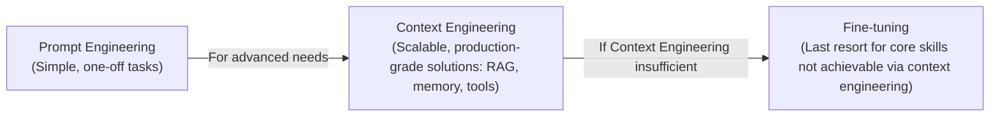
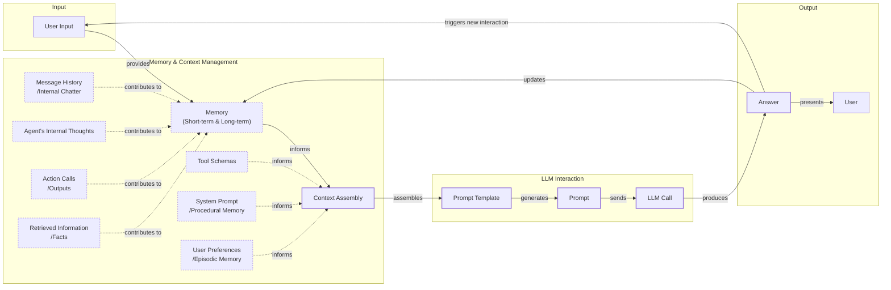
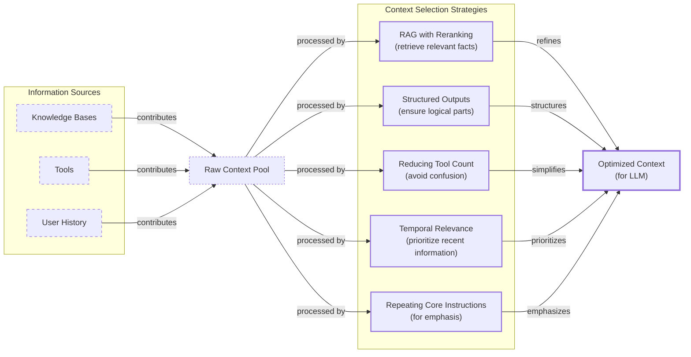
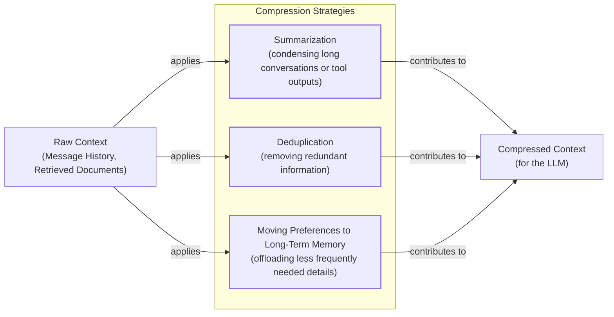
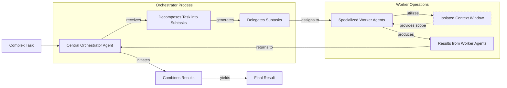

# Context Engineering

## When prompt engineering breaks

AI applications have evolved rapidly. In 2022, we had simple chatbots. By 2023, Retrieval-Augmented Generation (RAG) systems connected LLMs to domain-specific knowledge. Now, we build memory-enabled agents that remember past interactions.

In our last lesson, we explored how to choose between AI agents and LLM workflows. As these applications grow more complex, prompt engineering is showing its limits. It optimizes single LLM calls but fails when managing systems with memory and long interaction histories. The volume of information an agent might need has grown exponentially. A new discipline, context engineering, is required to orchestrate this entire information ecosystem.

## From prompt to context engineering

Prompt engineering, while effective for simple tasks, is designed for single, stateless interactions. This approach breaks down in stateful applications where context must be preserved across multiple turns.

As a conversation progresses, the context grows, and without a strategy to manage it, the LLM’s performance degrades. This is context decay: the model gets confused by the noise of an ever-expanding history. Even with large context windows, every token adds to cost and latency. We will explore these concepts in more detail in upcoming lessons.

We learned this the hard way on a recent project where stuffing everything into the context created a slow, expensive, and underperforming system. Context engineering shifts the focus from static prompts to dynamic systems that manage information flow, making applications accurate, fast, and cost-effective.

## Understanding context engineering

Context engineering is about strategically filling the model’s limited context window with the right information, at the right time, and in the right format [[1]](https://www.llamaindex.ai/blog/context-engineering-what-it-is-and-techniques-to-consider). It is an optimization problem where you retrieve the right parts from memory to solve a task without overwhelming the model [[2]](https://arxiv.org/pdf/2507.13334). For example, a cooking agent retrieves a specific recipe and your allergies, not the entire cookbook.

Andrej Karpathy offered a great analogy: LLMs are like a new kind of operating system, where the model is the CPU and its context window is the RAM [[3]](https://x.com/karpathy/status/1937902205765607626). Context engineering curates what occupies this working memory.

Prompt engineering is a subset of context engineering [[4]](https://blog.langchain.com/the-rise-of-context-engineering/). You still write effective prompts, but you also design a system that feeds the right context into them.

| Dimension | Prompt Engineering | Context Engineering |
| --- | --- | --- |
| Scope | Single interaction optimization | Entire information ecosystem |
| Complexity | Manual string manipulation | System-level, multi-component optimization |
| State Management | Primarily stateless | Inherently stateful, with explicit memory management |
| Focus | How to phrase tasks | What information to provide |

Table 1: A comparison of prompt engineering and context engineering.

Context engineering is the new fine-tuning. While fine-tuning has its place, it is expensive and inflexible. For most enterprise use cases, context engineering delivers better results faster and more cheaply by allowing rapid iteration without altering the core model.

When you start a new AI project, your decision-making process for guiding the LLM should look like the one presented in Image 1.



Image 1: A flowchart illustrating the decision-making workflow for AI application development, showing the progression from Prompt Engineering to Context Engineering and finally to Fine-tuning as a last resort.

For instance, building an agent to process internal Slack messages does not require fine-tuning. It is more effective to use a powerful reasoning model and engineer the context to retrieve specific messages and enable actions. This course will focus on solving problems using context engineering.

## What makes up the context

To master context engineering, you first need to understand what "context" is. It is everything the LLM sees in a single turn, dynamically assembled from various memory components before being passed to the model [[5]](https://www.datacamp.com/blog/context-engineering).

The high-level workflow, as presented in Image 2, begins when a user input triggers the system to pull relevant information from memory. This information is assembled into the final context, inserted into a prompt template, and sent to the LLM. The LLM’s answer then updates the memory, and the cycle repeats.



Image 2: A flowchart illustrating the high-level workflow of an LLM application, including memory, context assembly, prompt generation, LLM call, and output, with a repeat cycle and detailed context components.

These components, illustrated in Image 3, are grouped into two main categories. We will explain them intuitively, as we have future dedicated lessons for all of them.

### Short-Term Working Memory

**Short-term working memory** is the agent's state for the current task. It is volatile and includes the user's input, message history, the agent's internal thoughts, and the results from any action calls.

### Long-Term Memory

**Long-term memory** stores information across sessions. We divide it into three types [[2]](https://arxiv.org/pdf/2507.13334). **Procedural memory** is knowledge encoded in the code, like the system prompt. **Episodic memory** stores specific past experiences, like user preferences. **Semantic memory** is the agent’s general knowledge base, like company documents or data from APIs.

Image 3: Context engineering encompasses a variety of techniques and information sources. (Source [[6]](https://github.com/humanlayer/12-factor-agents/blob/main/content/factor-03-own-your-context-window.md))

These components are not static. They are dynamically re-computed for every interaction. Context engineering involves selecting the right pieces from this memory pool to construct the most effective prompt.

## Production implementation challenges

Now that we understand what makes up the context, let's look at the core challenges of implementing it in production. These all revolve around keeping the context small yet informative.

First is **the context window challenge**. Every AI model has a limited context window, and performance often degrades long before the published limit is reached [[13]](https://arxiv.org/pdf/2509.21361).

Second, **information overload** reduces LLM performance. This is known as the "lost-in-the-middle" problem, where models recall information best at the beginning and end of the prompt, but struggle with details in the middle [[14]](https://www.alphaxiv.org/overview/2603.10123v1).

Third, **context drift** occurs when conflicting information accumulates over time, such as a user changing their budget, making the agent's knowledge base unreliable [[8]](https://www.coforge.com/what-we-know/blog/navigating-the-shifting-sands-understanding-and-mitigating-data-drift-in-llms).

Finally, **tool confusion** arises when an agent has too many actions or poorly written descriptions, causing it to pick the wrong tool or fail tasks [[5]](https://www.datacamp.com/blog/context-engineering).

## Key strategies for context optimization

Modern AI solutions must manage complexity across multiple knowledge bases and tools. This requires a sophisticated approach to context engineering. Here are four popular strategies used across the industry [[9]](https://blog.langchain.com/context-engineering-for-agents/).

### Selecting the Right Context

Retrieving the right information is a critical first step. Instead of providing everything, use RAG to fetch only specific text chunks, define structured outputs to pass only necessary information downstream, and reduce the number of available actions to avoid confusion. For time-sensitive data, rank it by date and filter out irrelevant information. Finally, repeat core instructions at both the start and end of the prompt to leverage the model's tendency to focus on the context edges [[7]](https://www.linkedin.com/pulse/lost-middle-lesson-failing-ai-agents-backwards-anthony-dejohn-01k2e).



Image 4: A diagram illustrating strategies for selecting the right context for an LLM, showing information sources, a raw context pool, various selection strategies, and the resulting optimized context.

### Context Compression

As message history grows, you must manage it to keep the context window in check. You can create summaries of past interactions using an LLM, move user preferences to long-term episodic memory, or use deduplication to remove redundant information [[10]](https://oneuptime.com/blog/post/2026-01-30-context-compression/view). Another approach is observation masking, which hides older tool outputs while preserving the agent's reasoning history. Studies show this simple masking is often more cost-effective than LLM summarization [[17]](https://blog.jetbrains.com/research/2025/12/efficient-context-management/).



Image 5: A diagram illustrating key strategies for context compression, showing raw context as input, various compression strategies, and the resulting compressed context for the LLM.

### Isolating Context

Another powerful strategy is to isolate context. While parallel multi-agent systems can be fragile, a more reliable approach is a single-threaded agent or an orchestrator-worker pattern. A central orchestrator agent breaks down a problem and assigns sub-tasks to specialized worker agents, each with its own focused context window. This prevents interference and improves performance [[18]](https://cognition.ai/blog/dont-build-multi-agents), [[11]](https://gurusup.com/blog/multi-agent-orchestration-guide).



Image 6: A flowchart illustrating the Orchestrator-Worker pattern for isolating context in multi-agent systems.

### Format Optimizations

Finally, the way you format the context matters. Models are sensitive to structure. Using clear delimiters like XML tags can improve performance, and preferring token-efficient formats like YAML over JSON helps save space in your context window [[5]](https://www.datacamp.com/blog/context-engineering).

## Here is an example

Let's connect theory with concrete examples. Context engineering is applied in various domains, including healthcare, finance, project management, and creative fields like autonomous coding [[19]](https://www.sundeepteki.org/blog/context-engineering-a-framework-for-robust-generative-ai-systems).

Let's walk through a query with a healthcare assistant. A user asks: `I have a headache. What can I do to stop it? I would prefer not to take any medicine.` Before the AI answers, a context engineering system retrieves the user's patient history from episodic memory and queries a medical database for non-medicinal remedies from semantic memory [[2]](https://arxiv.org/pdf/2507.13334). It then assembles this information into a structured prompt, calls the LLM, and presents a personalized answer.

Here is a simplified example showing how context elements might be structured in a prompt using XML and YAML:

```
SYSTEM_PROMPT = """
You are a helpful and cautious AI healthcare assistant. Your goal is to provide safe, non-medicinal advice.

<INSTRUCTIONS>
1. Analyze the user's query and the provided context.
2. Use the patient history to understand their health profile and preferences.
3. Use the retrieved medical knowledge to form your recommendation.
</INSTRUCTIONS>

<PATIENT_HISTORY>
{retrieved_patient_history_in_yaml}
</PATIENT_HISTORY>

<MEDICAL_KNOWLEDGE>
{retrieved_medical_articles_in_yaml}
</MEDICAL_KNOWLEDGE>

<USER_QUERY>
{user_query}
</USER_QUERY>

Based on all the information above, provide a helpful response.
"""
```

To build such a system, you need a robust tech stack. An LLM like **Gemini** provides the reasoning engine. An orchestration framework like **LangGraph** is used to define the stateful workflow, managing the flow of information between components. For long-term memory, you might use a combination of databases: a vector database like **Pinecone** for semantic search over medical literature, and a graph database like **Neo4j** to store the patient's episodic history and preferences. Finally, observability platforms like **LangSmith** are essential for tracing the agent's steps, inspecting the context at each turn, and debugging complex interactions.

## Connecting context engineering to AI engineering

Context engineering requires building the intuition to structure prompts, select the right information from memory, and arrange context for optimal results. This discipline helps you determine the minimal yet essential information an LLM needs to perform at its best.

This skill is a multidisciplinary practice that sits at the intersection of several key engineering fields: AI Engineering, Software Engineering, Data Engineering, and MLOps [[12]](https://nlp.elvissaravia.com/p/context-engineering-guide). Our goal with this course is to teach you how to combine these skills to build production-ready AI products. In the next lesson, we will explore structured outputs.

## References

- [1] [Context Engineering - What it is, and techniques to consider](https://www.llamaindex.ai/blog/context-engineering-what-it-is-and-techniques-to-consider)
- [2] [A Survey of Context Engineering for Large Language Models](https://arxiv.org/pdf/2507.13334)
- [3] [Andrej Karpathy on X](https://x.com/karpathy/status/1937902205765607626)
- [4] [The rise of "context engineering"](https://blog.langchain.com/the-rise-of-context-engineering/)
- [5] [Context Engineering: A Guide With Examples](https://www.datacamp.com/blog/context-engineering)
- [6] [Own your context window](https://github.com/humanlayer/12-factor-agents/blob/main/content/factor-03-own-your-context-window.md)
- [7] [Lost in the Middle: A Lesson in Failing AI Agents (Backwards)](https://www.linkedin.com/pulse/lost-middle-lesson-failing-ai-agents-backwards-anthony-dejohn-01k2e)
- [8] [Navigating the Shifting Sands: Understanding and Mitigating Data Drift in LLMs](https://www.coforge.com/what-we-know/blog/navigating-the-shifting-sands-understanding-and-mitigating-data-drift-in-llms)
- [9] [Context Engineering for Agents](https://blog.langchain.com/context-engineering-for-agents/)
- [10] [How to Build Context Compression](https://oneuptime.com/blog/post/2026-01-30-context-compression/view)
- [11] [A Guide to Multi-Agent Orchestration in Production](https://gurusup.com/blog/multi-agent-orchestration-guide)
- [12] [Context Engineering Guide](https://nlp.elvissaravia.com/p/context-engineering-guide)
- [13] [Understanding the Discrepancy Between Maximum and Maximum Effective Context Window in LLMs](https://arxiv.org/pdf/2509.21361)
- [14] [Lost in the Middle at Birth: The U-Shaped Learning Curve is an Inherent Bias in the Transformer Architecture](https://www.alphaxiv.org/overview/2603.10123v1)
- [15] [Building with Production-Ready AI Agent Systems: The Hidden Constraints](https://centricconsulting.com/blog/building-with-production-ready-ai-agent-systems-the-hidden-constraints_ai/)
- [16] [Deep Dive into Context Engineering for AI Agents](https://towardsdatascience.com/deep-dive-into-context-engineering-for-ai-agents/)
- [17] [Cutting Through the Noise: Smarter Context Management for LLM-Powered Agents](https://blog.jetbrains.com/research/2025/12/efficient-context-management/)
- [18] [Don’t Build Multi-Agents](https://cognition.ai/blog/dont-build-multi-agents)
- [19] [Context Engineering: A Framework for Robust Generative AI Systems](https://www.sundeepteki.org/blog/context-engineering-a-framework-for-robust-generative-ai-systems)