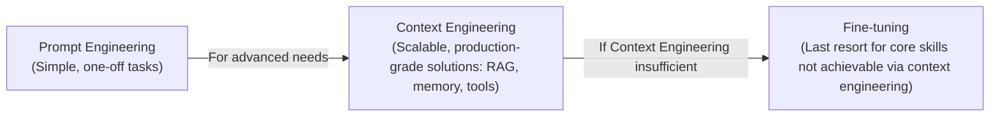
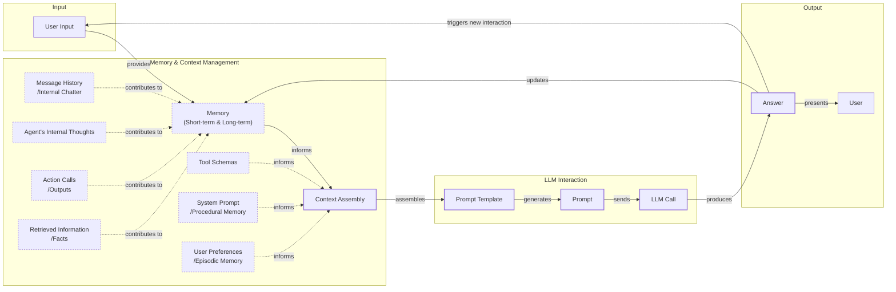
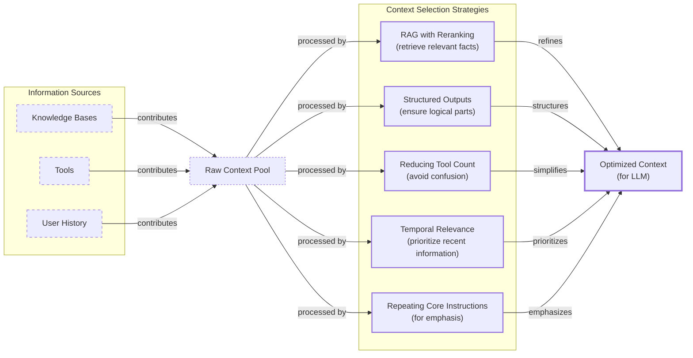
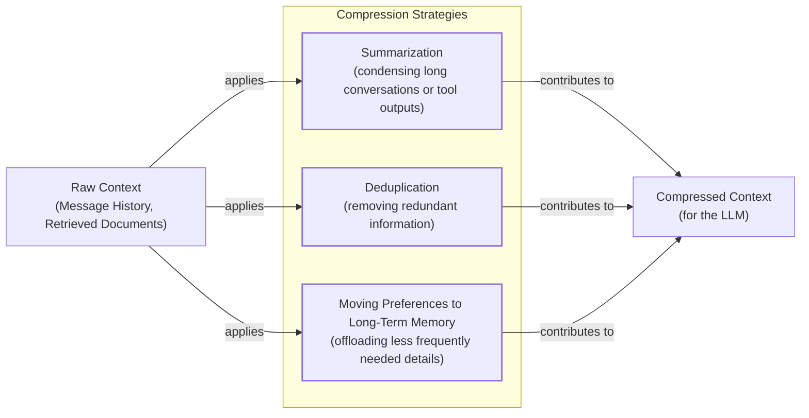
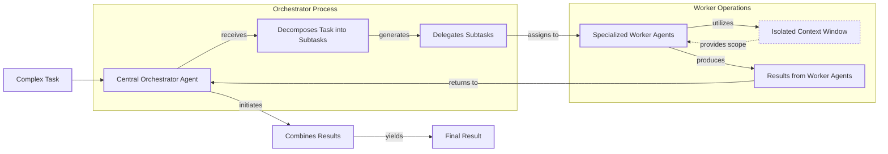

# Context Engineering

AI applications have evolved rapidly. In 2022, we had simple chatbots for question-answering. By 2023, Retrieval-Augmented Generation (RAG) systems connected LLMs to domain-specific knowledge. 2024 brought us tool-using agents that could perform actions. Now, we are building memory-enabled agents that remember past interactions and build relationships over time.

In our last lesson, we explored how to choose between AI agents and LLM workflows when designing a system. As these applications grow more complex, prompt engineering, a practice that once served us well, is showing its limits. It optimizes single LLM calls but fails when managing systems with memory, actions, and long interaction histories. The sheer volume of information an agent might need—past conversations, user data, documents, and action descriptions—has grown exponentially. Simply stuffing all this into a prompt is not a viable strategy. This is where context engineering comes in. It is the discipline of orchestrating this entire information ecosystem to ensure the LLM gets exactly what it needs, when it needs it. This skill is becoming a core foundation for AI engineering.

## From prompt to context engineering

Prompt engineering, while effective for simple tasks, is designed for single, stateless interactions. It treats each call to an LLM as a new, isolated event. This approach breaks down in stateful applications where context must be preserved and managed across multiple turns.

As a conversation or task progresses, the context grows. Without a strategy to manage this growth, the LLM’s performance degrades. This is context decay: the model gets confused by the noise of an ever-expanding history. It starts to lose track of the original instructions or key information.

Even with large context windows, a physical limit exists. Every token also adds to the cost and latency of an LLM call. Simply putting everything into the context creates a slow, expensive, and underperforming system. We will explore these concepts in more detail in upcoming lessons.

On a recent project, we learned this the hard way. We were working with a model that supported a million-token context window, so we thought, "What could go wrong?" We stuffed everything in: our research, guidelines, examples, and user history. The result was an LLM workflow that took 30 minutes to run and produced low-quality outputs.

This is where context engineering becomes essential. It shifts the focus from crafting static prompts to building dynamic systems that manage information flow. As an AI engineer, your job is to select only the most critical pieces of context for each LLM call. This makes your applications accurate, fast, and cost-effective.

## Understanding context engineering

Context engineering is about strategically filling the model’s limited context window with the right information, at the right time, and in the right format [[1]](https://www.llamaindex.ai/blog/context-engineering-what-it-is-and-techniques-to-consider). It is a solution to an optimization problem where you retrieve the right parts from your short-term and long-term memory to solve a specific task without overwhelming the model [[2]](https://arxiv.org/pdf/2507.13334). For example, when you ask a cooking agent for a recipe, you do not give it the entire cookbook. Instead, you retrieve the specific recipe, along with personal context like allergies or taste preferences. This precise selection ensures the model receives only the essential information.

Andrej Karpathy offered a great analogy for this: LLMs are like a new kind of operating system, where the model acts as the CPU and its context window functions as the RAM [[3]](https://x.com/karpathy/status/1937902205765607626). Just as an operating system manages what fits into RAM, context engineering curates what occupies the model’s working memory.

How does context engineering relate to prompt engineering? It's simple. Prompt engineering is a subset of context engineering [[4]](https://blog.langchain.com/the-rise-of-context-engineering/). You still write effective prompts, but you also design a system that feeds the right context into those prompts. This means understanding not just *how* to phrase a task, but *what* information the model needs to perform optimally.

| Dimension | Prompt Engineering | Context Engineering |
| --- | --- | --- |
| Scope | Single interaction optimization | Entire information ecosystem |
| Complexity | Manual string manipulation | System-level, multi-component optimization |
| State Management | Primarily stateless | Inherently stateful, with explicit memory management |
| Focus | How to phrase tasks | What information to provide |

Table 1: A comparison of prompt engineering and context engineering.

Context engineering is the new fine-tuning. While fine-tuning has its place, it is expensive, time-consuming, and inflexible. Data changes constantly, making fine-tuning a last resort. For most enterprise use cases, you get better results faster and more cheaply with context engineering. It allows for rapid iteration and adaptation to evolving data without altering the core model.

When you start a new AI project, your decision-making process for guiding the LLM should look like the one presented in Image 1.



Image 1: A flowchart illustrating the decision-making workflow for AI application development, showing the progression from Prompt Engineering to Context Engineering and finally to Fine-tuning as a last resort.

For instance, if you build an agent to process internal Slack messages, you do not need to fine-tune a model on your company’s communication style. It is more effective to use a powerful reasoning model and engineer the context to retrieve specific messages and enable actions like creating tasks or drafting emails. Throughout this course, we will show you how to solve most industry problems using only context engineering.

## What makes up the context

To master context engineering, you first need to understand what "context" actually is. It is everything the LLM sees in a single turn, dynamically assembled from various memory components before being passed to the model [[5]](https://www.datacamp.com/blog/context-engineering).

The high-level workflow, as presented in Image 2, begins when a user input triggers the system to pull relevant information from both long-term and short-term memory. This information is assembled into the final context, inserted into a prompt template, and sent to the LLM. The LLM’s answer then updates the memory, and the cycle repeats.



Image 2: A flowchart illustrating the high-level workflow of an LLM application, including memory, context assembly, prompt generation, LLM call, and output, with a repeat cycle and detailed context components.

These components, illustrated in Image 3, are grouped into two main categories. We will explain them intuitively for now, as we have future dedicated lessons for all of them.

### Short-Term Working Memory

Short-term working memory is the state of the agent for the current task or conversation. It is volatile and changes with each interaction, helping the agent maintain a coherent dialogue and make immediate decisions. It can include:

*   **User input:** The most recent query or command from the user.
*   **Message history:** The log of the current conversation, allowing the LLM to understand the flow and previous turns.
*   **Agent's internal thoughts:** The reasoning steps the agent takes to decide on its next action.
*   **Action calls and outputs:** The results from any actions the agent has performed, providing information from external systems.

### Long-Term Memory

Long-term memory is more persistent and stores information across sessions, allowing the AI system to remember things beyond a single conversation. We divide it into three types, drawing parallels from human memory [[2]](https://arxiv.org/pdf/2507.13334):

*   **Procedural memory:** This is knowledge encoded directly in the code. It includes the system prompt, which sets the agent's overall behavior. It also includes the definitions of available actions, which tell the agent what it can do, and schemas for structured outputs, which guide the format of its responses. Think of this as the agent's built-in skills.
*   **Episodic memory:** This is memory of specific past experiences, like user preferences or previous interactions. It's used to help the agent personalize its responses based on individual users. We typically store this in vector or graph databases for efficient retrieval.
*   **Semantic memory:** This is the agent’s general knowledge base. It can be internal, like company documents, or external, accessed via the internet through API calls. This memory provides the factual information the agent needs.

Image 3: Context engineering encompasses a variety of techniques and information sources. (Source [[6]](https://github.com/humanlayer/12-factor-agents/blob/main/content/factor-03-own-your-context-window.md))

The key takeaway is that these components are not static. They are dynamically re-computed for every single interaction. Context engineering involves knowing how to select the right pieces from this vast memory pool to construct the most effective prompt.

## Production implementation challenges

Now that we understand what makes up the context, let's look at the core challenges of implementing it in production. These challenges all revolve around a single question: "How can I keep my context as small as possible while providing enough information to the LLM?"

Here are four common issues that come up when building AI applications:

1.  **The context window challenge:** Every AI model has a limited context window, but there is a difference between the *maximum* and the *effective* context window—the point where adding tokens stops improving output. Performance often degrades long before the published limit is reached [[13]](https://arxiv.org/pdf/2509.21361).
2.  **Information overload:** Too much context reduces LLM performance. This is known as the "lost-in-the-middle" problem, a U-shaped bias where models recall information best at the beginning and end of the prompt. Recent studies suggest this is an inherent structural property of the transformer architecture itself, not just a learned behavior [[14]](https://www.alphaxiv.org/overview/2603.10123v1). In long-running agents, this is worsened by *context pollution*, where tool call history and other agent-generated noise dominate the context, distracting the model from the current task [[15]](https://centricconsulting.com/blog/building-with-production-ready-ai-agent-systems-the-hidden-constraints_ai/).
3.  **Context drift and rot:** Context drift occurs when conflicting information accumulates, like a user changing their budget [[8]](https://www.coforge.com/what-we-know/blog/navigating-the-shifting-sands-understanding-and-mitigating-data-drift-in-llms). A related issue is *context rot*, where recall accuracy decreases over extended interactions as the model loses focus amidst an evolving, ever-growing history [[16]](https://towardsdatascience.com/deep-dive-into-context-engineering-for-ai-agents/).
4.  **Tool confusion:** This arises when an agent has too many actions or poorly written descriptions [[5]](https://www.datacamp.com/blog/context-engineering). This is compounded by *rule saturation*, where adding more instructions makes each individual rule less likely to be followed consistently, reducing the agent’s reliability [[15]](https://centricconsulting.com/blog/building-with-production-ready-ai-agent-systems-the-hidden-constraints_ai/).

## Key strategies for context optimization

Initially, most AI applications were chatbots over single knowledge bases. Today, modern AI solutions must manage multiple knowledge bases, tools, and complex conversational histories. Context engineering is about managing this complexity while meeting performance, latency, and cost requirements. A related strategy is semantic caching, which avoids costly LLM calls entirely for repeated or similar queries, but the focus here is on optimizing the context that *is* sent to the model [[17]](https://www.dataquest.io/blog/semantic-caching-and-memory-patterns-for-vector-databases/).

Here are four popular context engineering strategies used across the industry [[9]](https://blog.langchain.com/context-engineering-for-agents/):

### Selecting the Right Context

Retrieving the right information from memory is a critical first step. A common mistake is to provide everything at once. To solve this, consider these approaches:

*   **Use structured outputs:** Define clear schemas for what the LLM should return. This allows you to pass only the necessary, structured information to downstream steps. We will cover this in detail in the next lesson.
*   **Use RAG:** Instead of providing entire documents, use RAG to fetch only the specific chunks of text needed to answer a user's question. This is a core topic we will explore in a future lesson.
*   **Reduce the number of available actions:** Rather than giving an agent access to every available action, use strategies to delegate action subsets to specialized components.
*   **Rank time-sensitive data:** For time-sensitive information, rank it by date and filter out anything no longer relevant.
*   **Repeat core instructions:** For the most important instructions, repeat them at both the start and the end of the prompt. This uses the model's tendency to pay more attention to the context edges [[7]](https://www.linkedin.com/pulse/lost-middle-lesson-failing-ai-agents-backwards-anthony-dejohn-01k2e).



Image 4: A diagram illustrating strategies for selecting the right context for an LLM, showing information sources, a raw context pool, various selection strategies, and the resulting optimized context.

### Context Compression

As message history grows, you must manage it to keep the context window in check. Common approaches include **LLM summarization**, where a separate model call compresses older interactions, and **observation masking**, which hides older, less important tool outputs while keeping the agent’s reasoning history intact. While summarization sounds more sophisticated, studies show simpler masking is often more cost-effective, as summary calls add their own costs and can sometimes obscure signals that an agent should stop working on a failing task [[18]](https://blog.jetbrains.com/research/2025/12/efficient-context-management/).



Image 5: A diagram illustrating key strategies for context compression, showing raw context as input, various compression strategies, and the resulting compressed context for the LLM.

### Isolating Context

Another powerful strategy is to isolate context. While it can be tempting to build multi-agent systems where agents work in parallel, this is often fragile. Agents can develop conflicting assumptions without seeing each other’s work, leading to integration failures. A more reliable approach is a single-threaded linear agent or an orchestrator-worker pattern. Here, a central agent decomposes a task and delegates to specialized workers sequentially, ensuring a continuous, shared context and preventing the "game of telephone" errors common in parallel systems [[19]](https://cognition.ai/blog/dont-build-multi-agents).



Image 6: A flowchart illustrating the Orchestrator-Worker pattern for isolating context in multi-agent systems.

### Format Optimizations

Finally, format matters. Models are sensitive to structure. Using clear delimiters like XML tags to wrap context components or preferring token-efficient formats like YAML over JSON can improve performance [[5]](https://www.datacamp.com/blog/context-engineering).

## Here is an example

Let's connect the theory with a concrete example. Context engineering is applied to build powerful AI systems in various domains like healthcare, finance, project management, and even creative applications like autonomous coding or art generation [[20]](https://www.sundeepteki.org/blog/context-engineering-a-framework-for-robust-generative-ai-systems).

Let's walk through a specific query to see context engineering in action with a healthcare assistant. A user asks: `I have a headache. What can I do to stop it? I would prefer not to take any medicine.`

Before the LLM even sees this query, a context engineering system gets to work:

1.  It retrieves the user's patient history, known allergies, and lifestyle habits from an **episodic memory** store [[2]](https://arxiv.org/pdf/2507.13334).
2.  It queries a **semantic memory** of up-to-date medical literature for non-medicinal headache remedies.
3.  It assembles this information, along with the user's query and the conversation history, into a structured prompt.
4.  We send the prompt to the LLM, which generates a personalized, safe, and relevant recommendation.
5.  We log the interaction and save any new preferences back to the user's episodic memory.

Here’s a simplified example showing how these components might be assembled into a complete system prompt. Notice the clear structure and ordering using XML and YAML.

```
SYSTEM_PROMPT = """
You are a helpful and cautious AI healthcare assistant. Your goal is to provide safe, non-medicinal advice.

<INSTRUCTIONS>
1. Analyze the user's query and the provided context.
2. Use the patient history to understand their health profile and preferences.
3. Use the retrieved medical knowledge to form your recommendation.
4. If you lack sufficient information, ask clarifying questions.
</INSTRUCTIONS>

<PATIENT_HISTORY>
{retrieved_patient_history_in_yaml}
</PATIENT_HISTORY>

<MEDICAL_KNOWLEDGE>
{retrieved_medical_articles_in_yaml}
</MEDICAL_KNOWLEDGE>

<USER_QUERY>
{user_query}
</USER_QUERY>

Based on all the information above, provide a helpful response.
"""
```

To build such a system, you would use a combination of tools. An LLM like Gemini provides the reasoning engine. A framework like LangGraph orchestrates the workflow. Databases such as PostgreSQL or Neo4j serve as long-term memory stores. Observability platforms are essential for debugging complex interactions.

## Connecting context engineering to AI engineering

Mastering context engineering is less about learning a specific algorithm and more about building intuition. It’s the art of knowing how to structure prompts, what information to include, and how to order it for maximum impact.

This skill doesn't exist in a vacuum. It’s a multidisciplinary practice that sits at the intersection of several key engineering fields [[12]](https://nlp.elvissaravia.com/p/context-engineering-guide):

*   **AI Engineering:** Understanding LLMs, RAG, and AI agents is the foundation.
*   **Software Engineering:** You need to build scalable and maintainable systems to aggregate context and wrap agents in robust APIs.
*   **Data Engineering:** Constructing reliable data pipelines for RAG and other memory systems is critical.
*   **MLOps:** Deploying agents on the right infrastructure makes them reproducible, observable, and scalable.

Our goal with this course is to teach you how to combine these skills to build production-ready AI products. In the next lesson, we will explore structured outputs.

## References

- [1] [Context Engineering - What it is, and techniques to consider](https://www.llamaindex.ai/blog/context-engineering-what-it-is-and-techniques-to-consider)
- [2] [A Survey of Context Engineering for Large Language Models](https://arxiv.org/pdf/2507.13334)
- [3] [Andrej Karpathy on X](https://x.com/karpathy/status/1937902205765607626)
- [4] [The rise of "context engineering"](https://blog.langchain.com/the-rise-of-context-engineering/)
- [5] [Context Engineering: A Guide With Examples](https://www.datacamp.com/blog/context-engineering)
- [6] [Own your context window](https://github.com/humanlayer/12-factor-agents/blob/main/content/factor-03-own-your-context-window.md)
- [7] [Lost in the Middle: A Lesson in Failing AI Agents (Backwards)](https://www.linkedin.com/pulse/lost-middle-lesson-failing-ai-agents-backwards-anthony-dejohn-01k2e)
- [8] [Navigating the Shifting Sands: Understanding and Mitigating Data Drift in LLMs](https://www.coforge.com/what-we-know/blog/navigating-the-shifting-sands-understanding-and-mitigating-data-drift-in-llms)
- [9] [Context Engineering for Agents](https://blog.langchain.com/context-engineering-for-agents/)
- [10] [How to Build Context Compression](https://oneuptime.com/blog/post/2026-01-30-context-compression/view)
- [11] [A Guide to Multi-Agent Orchestration in Production](https://gurusup.com/blog/multi-agent-orchestration-guide)
- [12] [Context Engineering Guide](https://nlp.elvissaravia.com/p/context-engineering-guide)
- [13] [Understanding the Discrepancy Between Maximum and Maximum Effective Context Window in LLMs](https://arxiv.org/pdf/2509.21361)
- [14] [Lost in the Middle at Birth: The U-Shaped Learning Curve is an Inherent Bias in the Transformer Architecture](https://www.alphaxiv.org/overview/2603.10123v1)
- [15] [Building with Production-Ready AI Agent Systems: The Hidden Constraints](https://centricconsulting.com/blog/building-with-production-ready-ai-agent-systems-the-hidden-constraints_ai/)
- [16] [Deep Dive into Context Engineering for AI Agents](https://towardsdatascience.com/deep-dive-into-context-engineering-for-ai-agents/)
- [17] [Semantic Caching and Memory Patterns for Vector Databases](https://www.dataquest.io/blog/semantic-caching-and-memory-patterns-for-vector-databases/)
- [18] [Cutting Through the Noise: Smarter Context Management for LLM-Powered Agents](https://blog.jetbrains.com/research/2025/12/efficient-context-management/)
- [19] [Don’t Build Multi-Agents](https://cognition.ai/blog/dont-build-multi-agents)
- [20] [Context Engineering: A Framework for Robust Generative AI Systems](https://www.sundeepteki.org/blog/context-engineering-a-framework-for-robust-generative-ai-systems)