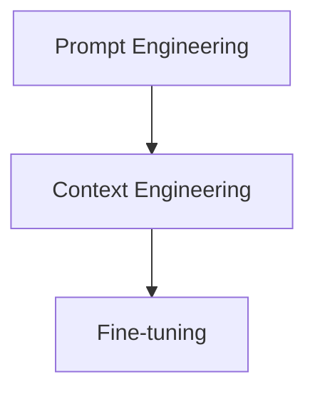
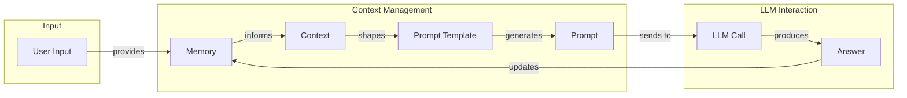
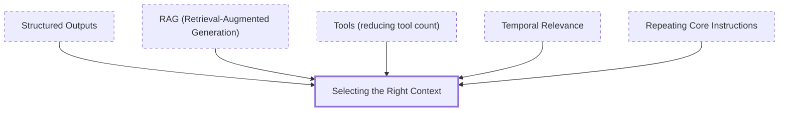
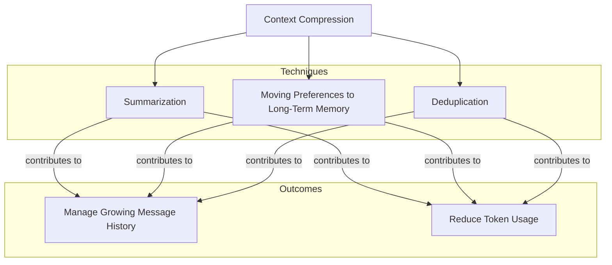
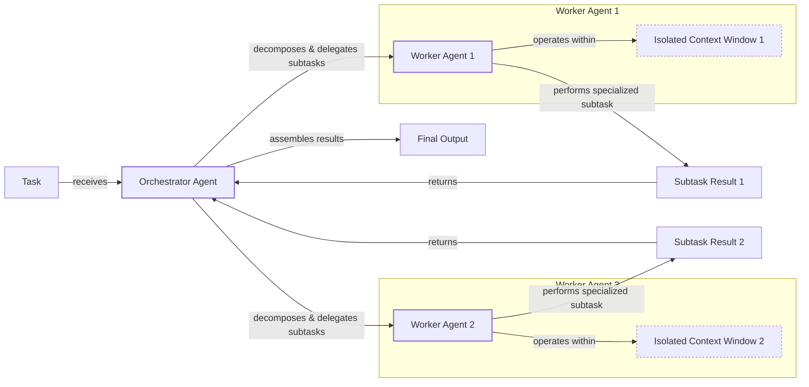

# Lesson 3: Context Engineering

## When prompt engineering breaks

AI applications have evolved rapidly. In 2022, we had simple chatbots for question-answering. By 2023, Retrieval-Augmented Generation (RAG) systems connected LLMs to domain-specific knowledge. 2024 brought us tool-using agents that could perform actions [[26]](https://www.securityindustry.org/2024/07/16/understanding-the-evolution-from-classic-chatbots-to-rag-chatbots-to-ai-powered-assistants/), [[27]](https://pagergpt.ai/ai-chatbot/evolution-of-ai-chatbots). Now, we are building memory-enabled agents that remember past interactions.

In our last lesson, we explored choosing between AI agents and LLM workflows. As these systems grow more complex, prompt engineering is no longer enough. It optimizes single LLM calls but fails to manage the exponentially growing context of memory, actions, and history. A new discipline, context engineering, is required to orchestrate this information ecosystem, ensuring the LLM receives precisely what it needs.

## From Prompt to Context Engineering

Prompt engineering is designed for single, stateless interactions, treating each LLM call as an isolated event. This approach fails in stateful applications where context must be managed across multiple turns. As a conversation progresses, the context grows, leading to performance degradation known as context rot: the model gets confused by the noise of an ever-expanding history [[3]](https://www.trychroma.com/research/context-rot), [[59]](https://atlan.com/know/llm-context-window-limitations/).

Furthermore, every token adds to the cost and latency of an LLM call, making large contexts slow and expensive [[16]](https://www.comet.com/site/blog/context-window/), [[17]](https://datahub.com/blog/context-window-optimization/). We will explore these concepts in more detail in upcoming lessons, including memory in Lesson 9 and RAG in Lesson 10. We learned this firsthand when a project using a million-token context window resulted in a 30-minute workflow with poor outputs. Context engineering solves these issues by building dynamic systems that manage information flow, selecting only critical context for each LLM call to make applications accurate, fast, and cost-effective [[21]](https://packmind.com/context-engineering-ai-coding/what-is-contextops/), [[22]](https://www.mezmo.com/learn-observability/context-engineering-for-observability-how-to-deliver-the-right-data-to-llms/).

## Understanding Context Engineering

Context engineering is the practice of arranging information from memory into the context passed to an LLM. It's an optimization problem: retrieve the right details from memory to solve a task without overwhelming the model. For example, a cooking agent retrieves a specific recipe and user allergies, not the entire cookbook.

Andrej Karpathy provides a useful analogy: the LLM is the CPU, and its context window is the RAM [[31]](https://www.langchain.com/blog/context-engineering-for-agents/), [[32]](https://www.glean.com/perspectives/context-engineering-vs-prompt-engineering-key-differences-explained), [[33]](https://atlan.com/know/working-memory-llms/). Context engineering acts as the operating system, managing what information occupies this limited working memory. This is important because LLMs have a finite "attention budget"; every token consumes attention, so the context must be curated with high-signal information [[66]](https://www.anthropic.com/engineering/effective-context-engineering-for-ai-agents).

Prompt engineering is a subset of context engineering [[25]](https://www.glean.com/blog/context-engineering-ai-the-foundation-of-reliable-high-performing-models), [[55]](https://neo4j.com/blog/agentic-ai/context-engineering-vs-prompt-engineering/). You still write effective prompts, but within a system that feeds them the right context.

| Dimension | Prompt Engineering | Context Engineering |
| --- | --- | --- |
| Scope | Single interaction optimization | Entire information ecosystem |
| State Management | Stateless function | Stateful due to memory |
| Focus | How to phrase tasks | What information to provide |

Table 1: A comparison of prompt engineering and context engineering.

Context engineering is also replacing fine-tuning in many cases. Fine-tuning is expensive, slow, and inflexible for data that changes constantly. Context engineering offers a faster, cheaper, and more agile way to get reliable results, making fine-tuning a last resort [[51]](https://www.linkedin.com/posts/denis-panjuta_prompt-engineering-vs-context-engineering-activity-7363945251180322816-1q_m), [[52]](https://memgraph.com/blog/prompt-engineering-vs-context-engineering/). Your decision-making process should follow the hierarchy in Image 1.



Image 1: A flowchart illustrating the hierarchical decision-making process for AI application development, progressing from Prompt Engineering to Context Engineering and then to Fine-tuning.

For instance, to process Slack messages, you don't need to fine-tune a model. It's more effective to engineer the context to retrieve messages and enable actions. Throughout this course, we will focus on solving problems with context engineering.

## What Makes Up the Context

Context is everything the LLM sees in a single turn, dynamically assembled from various memory components. The high-level workflow, shown in Image 2, is a cycle: user input triggers memory retrieval, which informs the context, which is then assembled into a prompt for the LLM. The LLM's answer updates the memory, and the process repeats.



Image 2: A flowchart depicting the high-level workflow of how context is processed in an LLM application, showing the cyclical nature of context management.

These components fall into two main categories.

### Short-Term Working Memory

This is the agent's volatile state for the current task, helping it maintain coherence. It includes the user's input, message history, the agent's internal thoughts, and the outputs from any actions it has performed [[36]](https://atlan.com/know/working-memory-llms/), [[37]](https://www.datacamp.com/blog/how-does-llm-memory-work), [[39]](https://skymod.tech/why-memory-matters-in-llm-agents-short-term-vs-long-term-memory-architectures/).

### Long-Term Memory

This persistent memory stores information across sessions. It has three types:

-   **Procedural memory:** This is the agent's built-in knowledge, encoded in the code. It includes the system prompt, action definitions, and output schemas [[38]](https://www.analyticsvidhya.com/blog/2026/01/how-does-llm-memory-work/), [[39]](https://skymod.tech/why-memory-matters-in-llm-agents-short-term-vs-long-term-memory-architectures/).
-   **Episodic memory:** This stores specific past experiences, like user preferences, to personalize responses. It is often kept in vector or graph databases [[37]](https://www.datacamp.com/blog/how-does-llm-memory-work), [[40]](https://labelstud.io/learningcenter/episodic-vs-persistent-memory-in-llms/).
-   **Semantic memory:** This is the agent’s general knowledge base, containing factual information from internal documents or external sources [[36]](https://atlan.com/know/working-memory-llms/), [[38]](https://www.analyticsvidhya.com/blog/2026/01/how-does-llm-memory-work/).
Image 3: Context engineering encompasses a variety of techniques and information sources. (Source [humanlayer/12-factor-agents [1]](https://github.com/humanlayer/12-factor-agents/blob/main/content/factor-03-own-your-context-window.md))

These components are dynamic and re-computed for every interaction. Context engineering is the skill of selecting the right pieces from this memory pool to construct the most effective prompt. If this seems like a lot, bear with us. We will cover all these concepts in-depth in future lessons, including structured outputs (Lesson 4), actions (Lesson 6), memory (Lesson 9), and RAG (Lesson 10).

## Production Implementation Challenges

Implementing context engineering in production means tackling the "long-horizon gap," where LLMs struggle to maintain coherence over multi-step workflows [[67]](https://langwatch.ai/blog/the-6-context-engineering-challenges-stopping-ai-from-scaling-in-production). The core challenge is keeping the context small yet informative.

Four common issues arise:

1.  **The context window challenge:** Every model has a limited context window, or token limit, for processing information in a single turn. While these windows are growing, they are not infinite and come with cost and latency trade-offs [[16]](https://www.comet.com/site/blog/context-window/), [[17]](https://datahub.com/blog/context-window-optimization/).
2.  **Information overload:** Too much context degrades performance. Due to the "lost-in-the-middle" problem, information buried in a long prompt is often ignored, as the model's finite attention budget is depleted by irrelevant details [[56]](https://www.linkedin.com/pulse/lost-middle-lesson-failing-ai-agents-backwards-anthony-dejohn-01k2e), [[58]](https://dev.to/thousand_miles_ai/the-lost-in-the-middle-problem-why-llms-ignore-the-middle-of-your-context-window-3al2), [[66]](https://www.anthropic.com/engineering/effective-context-engineering-for-ai-agents).
3.  **Context drift:** Conflicting information accumulates in memory over time, such as a user stating their cat is both black and white in different conversations. This data conflict confuses the LLM and makes its responses unreliable [[6]](https://galileo.ai/blog/production-llm-monitoring-strategies), [[7]](https://www.coforge.com/what-we-know/blog/navigating-the-shifting-sands-understanding-and-mitigating-data-drift-in-llms/), [[8]](https://thenewstack.io/context-rot-enterprise-ai-llms/).
4.  **Tool confusion:** Providing too many actions or poorly described ones can confuse the model, causing it to select the wrong tool for a task [[43]](https://www.mdpi.com/2079-9292/13/15/2961), [[44]](https://www.anthropic.com/engineering/effective-context-engineering-for-ai-agents).

## Key Strategies for Context Optimization

Modern AI solutions must manage complexity across multiple knowledge bases, tools, and conversational histories. Context engineering is about managing this complexity while meeting performance, latency, and cost requirements.

### Selecting the Right Context

To combat information overload, select only relevant information. Use structured outputs to define clear schemas and RAG to fetch specific text chunks. Reduce the number of available actions; studies show that limiting the selection to under 30 tools can triple an agent's selection accuracy [[42]](https://productschool.com/blog/artificial-intelligence/ai-agents-product-managers). You can also rank time-sensitive data and repeat core instructions at the start and end of the prompt to leverage the model's attention bias [[12]](https://www.dailydoseofds.com/llmops-crash-course-part-8/), [[57]](https://promptmetheus.com/resources/llm-knowledge-base/lost-in-the-middle-effect).



Image 4: A conceptual diagram illustrating strategies for selecting the right context to combat information overload.

### Context Compression

As message history grows, compress it to stay within the context window. Techniques include summarizing past interactions, moving user preferences to long-term memory, and deduplicating information [[71]](https://oneuptime.com/blog/post/2026-01-30-context-compression/view). While compression can add latency, this is often outweighed by the performance gains from a smaller context [[68]](https://www.sitepoint.com/optimizing-token-usage-context-compression-techniques/).



Image 5: A conceptual diagram illustrating key methods for context compression and their outcomes.

### Isolating Context

Instead of a single, overloaded LLM call, isolate context by splitting tasks across multiple agents. The orchestrator-worker pattern is a common implementation where a central agent delegates sub-tasks to specialized workers, each with its own focused context [[46]](https://beam.ai/agentic-insights/multi-agent-orchestration-patterns-production), [[47]](https://gurusup.com/blog/multi-agent-orchestration-guide), [[49]](https://www.praetorian.com/blog/deterministic-ai-orchestration-a-platform-architecture-for-autonomous-development/).



Image 6: An architecture diagram illustrating the orchestrator-worker pattern for isolating context.

### Format Optimizations

The structure of your context matters. Use clear delimiters like XML tags to help the model distinguish between information types [[41]](https://www.decodingai.com/p/context-engineering-2025s-1-skill), [[44]](https://www.anthropic.com/engineering/effective-context-engineering-for-ai-agents). For structured data, YAML is often more token-efficient than JSON. Monitoring your application's traces is essential to understand what occupies the context window at each step [[16]](https://www.comet.com/site/blog/context-window/), [[18]](https://www.getmaxim.ai/articles/context-window-management-strategies-for-long-context-ai-agents-and-chatbots/). We will cover structured outputs, RAG, tools, and the orchestrator-worker pattern in detail in upcoming lessons.

## Here Is an Example

Let's connect theory with concrete examples. Context engineering is already being applied across many industries:

-   **Healthcare:** An AI assistant accesses a patient's medical history, symptoms, and medical literature to provide personalized diagnostic support [[41]](https://www.decodingai.com/p/context-engineering-2025s-1-skill).
-   **Financial Services:** AI systems integrate with enterprise tools like CRMs and calendars, combining market data and client information to generate tailored financial advice.
-   **Content Creator Assistant:** An AI agent uses your research, past content, and personality to create content.

Let's walk through the healthcare assistant scenario. A user asks: `I have a headache. What can I do to stop it? I would prefer not to take any medicine.`

Before the AI attempts to answer, a context engineering system performs several steps. It retrieves the user's patient history, known allergies, and lifestyle habits from episodic memory. It then queries a medical database for non-pharmacological headache remedies from semantic memory. This information is assembled into a structured prompt and sent to the LLM for a personalized, context-aware answer [[41]](https://www.decodingai.com/p/context-engineering-2025s-1-skill).

Here is a simplified example showing how you might structure the prompt using XML tags for context elements:

```xml
<system_prompt>
You are a helpful AI medical assistant...
</system_prompt>

<patient_history>
patient:
  name: John Doe
  age: 45
  ...
</patient_history>

<medical_literature>
articles:
  - id: 1
    topic: dehydration_headaches
    ...
</medical_literature>

<user_query>
I have a headache. What can I do to stop it? ...
</user_query>
```

To build such a system, you need a robust tech stack. A potential stack we recommend and will use throughout this course includes:

-   **LLM:** Gemini as a multimodal, reasoning, and cost-effective LLM API provider.
-   **Orchestration:** LangGraph for defining stateful, agentic workflows.
-   **Databases:** PostgreSQL, Qdrant, and Neo4j for various memory types.
-   **Observability:** Opik or LangSmith for evaluation and trace monitoring.

## Connecting Context Engineering to AI Engineering

Context engineering is a practical discipline focused on developing the intuition to select the right information from memory and arrange it for optimal results. It is about determining the minimal yet essential context an LLM needs to perform at its best.

This skill cannot be learned in isolation, as it combines AI Engineering, Software Engineering, Data Engineering, and Operations [[21]](https://packmind.com/context-engineering-ai-coding/what-is-contextops/), [[22]](https://www.mezmo.com/learn-observability/context-engineering-for-observability-how-to-deliver-the-right-data-to-llms), [[23]](https://sombrainc.com/blog/ai-context-engineering-guide). Our goal is to teach you how to integrate these skills to build production-ready AI products, shifting your mindset from a developer to an architect. In the next lesson, we will explore structured outputs.

## References

-   [1] https://github.com/humanlayer/12-factor-agents/blob/main/content/factor-03-own-your-context-window.md
-   [2] https://milvus.io/ai-quick-reference/what-modifications-might-be-needed-to-the-llms-input-formatting-or-architecture-to-best-take-advantage-of-retrieved-documents-for-example-adding-special-tokens-or-segments-to-separate-context
-   [3] https://www.trychroma.com/research/context-rot
-   [4] https://www.confluent.io/blog/event-driven-multi-agent-systems/
-   [5] https://arxiv.org/html/2504.15965v1
-   [6] https://galileo.ai/blog/production-llm-monitoring-strategies
-   [7] https://www.coforge.com/what-we-know/blog/navigating-the-shifting-sands-understanding-and-mitigating-data-drift-in-llms
-   [8] https://thenewstack.io/context-rot-enterprise-ai-llms/
-   [9] https://support.talkdesk.com/hc/en-us/articles/39096730105115--Preview-AI-Agent-Platform-Best-Practices
-   [10] https://www.tabnine.com/blog/your-ai-doesnt-need-more-training-it-needs-context/
-   [11] https://www.tribe.ai/applied-ai/fine-tuning-vs-prompt-engineering
-   [12] https://www.dailydoseofds.com/llmops-crash-course-part-8/
-   [13] https://www.forrester.com/blogs/the-state-of-ai-agents-lots-of-potential-and-confusion/
-   [14] https://blog.jetbrains.com/research/2025/12/efficient-context-management/
-   [15] https://66degrees.com/building-a-business-case-for-ai-in-financial-services/
-   [16] https://www.comet.com/site/blog/context-window/
-   [17] https://datahub.com/blog/context-window-optimization/
-   [18] https://www.getmaxim.ai/articles/context-window-management-strategies-for-long-context-ai-agents-and-chatbots/
-   [19] https://www.unite.ai/why-large-language-models-forget-the-middle-uncovering-ais-hidden-blind-spot/
-   [20] https://promptmetheus.com/resources/llm-knowledge-base/lost-in-the-middle-effect
-   [21] https://packmind.com/context-engineering-ai-coding/what-is-contextops/
-   [22] https://www.mezmo.com/learn-observability/context-engineering-for-observability-how-to-deliver-the-right-data-to-llms
-   [23] https://sombrainc.com/blog/ai-context-engineering-guide
-   [24] https://www.akira.ai/blog/context-engineering
-   [25] https://www.glean.com/blog/context-engineering-ai-the-foundation-of-reliable-high-performing-models
-   [26] https://www.securityindustry.org/2024/07/16/understanding-the-evolution-from-classic-chatbots-to-rag-chatbots-to-ai-powered-assistants/
-   [27] https://pagergpt.ai/ai-chatbot/evolution-of-ai-chatbots
-   [28] https://www.decodingai.com/p/context-engineering-2025s-1-skill
-   [29] https://www.dante-ai.com/news/when-did-ai-chatbots-start
-   [30] https://addyo.substack.com/p/context-engineering-bringing-engineering
-   [31] https://www.langchain.com/blog/context-engineering-for-agents/
-   [32] https://www.glean.com/perspectives/context-engineering-vs-prompt-engineering-key-differences-explained
-   [33] https://atlan.com/know/working-memory-llms/
-   [34] https://www.sundeepteki.org/blog/from-vibe-coding-to-context-engineering-a-blueprint-for-production-grade-genai-systems
-   [35] https://www.linkedin.com/pulse/context-engineering-silent-architecture-behind-every-ai-roychowdhury-lzcec
-   [36] https://atlan.com/know/working-memory-llms/
-   [37] https://www.datacamp.com/blog/how-does-llm-memory-work
-   [38] https://www.analyticsvidhya.com/blog/2026/01/how-does-llm-memory-work/
-   [39] https://skymod.tech/why-memory-matters-in-llm-agents-short-term-vs-long-term-memory-architectures/
-   [40] https://labelstud.io/learningcenter/episodic-vs-persistent-memory-in-llms/
-   [41] https://www.decodingai.com/p/context-engineering-2025s-1-skill
-   [42] https://productschool.com/blog/artificial-intelligence/ai-agents-product-managers
-   [43] https://www.mdpi.com/2079-9292/13/15/2961
-   [44] https://www.anthropic.com/engineering/effective-context-engineering-for-ai-agents
-   [45] https://erikjlarson.substack.com/p/context-drift-and-the-illusion-of
-   [46] https://beam.ai/agentic-insights/multi-agent-orchestration-patterns-production
-   [47] https://gurusup.com/blog/multi-agent-orchestration-guide
-   [48] https://www.vellum.ai/blog/multi-agent-systems-building-with-context-engineering
-   [49] https://www.praetorian.com/blog/deterministic-ai-orchestration-a-platform-architecture-for-autonomous-development/
-   [50] https://arxiv.org/html/2601.13671v1
-   [51] https://www.linkedin.com/posts/denis-panjuta_prompt-engineering-vs-context-engineering-activity-7363945251180322816-1q_m
-   [52] https://memgraph.com/blog/prompt-engineering-vs-context-engineering
-   [53] https://www.mezmo.com/learn-observability/context-engineering-for-observability-how-to-deliver-the-right-data-to-llms
-   [54] https://www.instinctools.com/blog/context-engineering/
-   [55] https://neo4j.com/blog/agentic-ai/context-engineering-vs-prompt-engineering/
-   [56] https://www.linkedin.com/pulse/lost-middle-lesson-failing-ai-agents-backwards-anthony-dejohn-01k2e
-   [57] https://promptmetheus.com/resources/llm-knowledge-base/lost-in-the-middle-effect
-   [58] https://dev.to/thousand_miles_ai/the-lost-in-the-middle-problem-why-llms-ignore-the-middle-of-your-context-window-3al2
-   [59] https://atlan.com/know/llm-context-window-limitations/
-   [60] https://bigdataboutique.com/blog/needle-in-haystack-optimizing-retrieval-and-rag-over-long-context-windows-5dfb3c
-   [61] https://www.codecademy.com/article/context-engineering-in-ai
-   [62] https://blog.stackademic.com/context-engineering-in-llms-and-ai-agents-eb861f0d3e9b
-   [63] https://packmind.com/context-engineering-ai-coding/how-to-implement-context-engineering/
-   [64] https://atlan.com/know/context-engineering-platforms-comparison/
-   [65] https://www.scalablepath.com/machine-learning/langgraph
-   [66] https://www.anthropic.com/engineering/effective-context-engineering-for-ai-agents
-   [67] https://langwatch.ai/blog/the-6-context-engineering-challenges-stopping-ai-from-scaling-in-production
-   [68] https://www.sitepoint.com/optimizing-token-usage-context-compression-techniques/
-   [69] https://arxiv.org/html/2603.29193v1
-   [70] https://www.llamaindex.ai/blog/context-engineering-what-it-is-and-techniques-to-consider
-   [71] https://oneuptime.com/blog/post/2026-01-30-context-compression/view
</article>