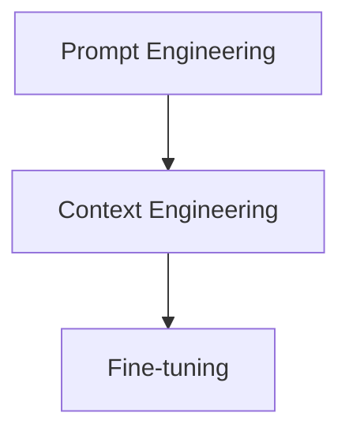
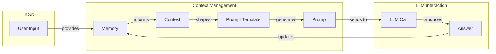
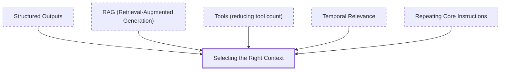
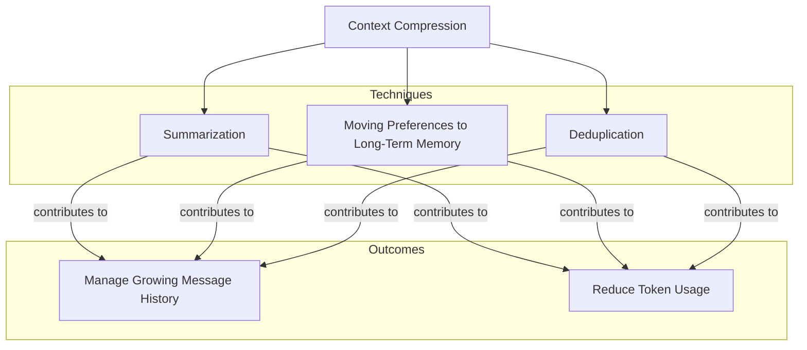
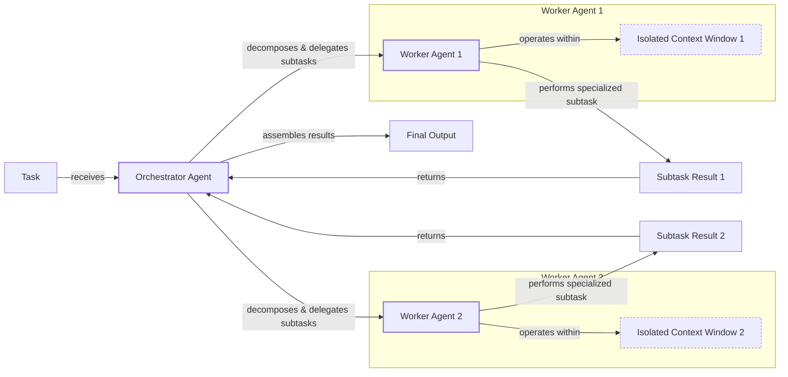

# Lesson 3: Context Engineering

AI applications have evolved rapidly. In 2022, we had simple chatbots for question-answering. By 2023, Retrieval-Augmented Generation (RAG) systems connected LLMs to domain-specific knowledge. 2024 brought us tool-using agents that could perform actions [[26]](https://www.securityindustry.org/2024/07/16/understanding-the-evolution-from-classic-chatbots-to-rag-chatbots-to-ai-powered-assistants/), [[27]](https://pagergpt.ai/ai-chatbot/evolution-of-ai-chatbots). Now, we are building memory-enabled agents that remember past interactions and build relationships over time.

In our last lesson, we explored how to choose between AI agents and LLM workflows when designing a system. As these applications grow more complex, prompt engineering, a practice that once served us well, is showing its limits. It optimizes single LLM calls but fails when managing systems with memory, actions, and long interaction histories. The sheer volume of information an agent might need—past conversations, user data, documents, and action descriptions—has grown exponentially. Simply stuffing all this into a prompt is not a viable strategy. This is where context engineering comes in. It is the discipline of orchestrating this entire information ecosystem to ensure the LLM gets exactly what it needs, when it needs it. This skill is becoming a core foundation for AI engineering.

## From Prompt to Context Engineering

Prompt engineering, while effective for simple tasks, is designed for single, stateless interactions. It treats each call to an LLM as a new, isolated event. This approach breaks down in stateful applications where context must be preserved and managed across multiple turns.

As a conversation or task progresses, the context grows. Without a strategy to manage this growth, the LLM’s performance degrades. This is context rot: the model gets confused by the noise of an ever-expanding history and starts to lose track of the original instructions or key information [[3]](https://www.trychroma.com/research/context-rot), [[59]](https://atlan.com/know/llm-context-window-limitations/).

Even with large context windows, a physical limit exists for what you can include. Also, on the operational side, every token adds to the cost and latency of an LLM call [[16]](https://www.comet.com/site/blog/context-window/). Simply putting everything into the context creates a slow, expensive, and underperforming system. We will explore these concepts in more detail in upcoming lessons, including memory in Lesson 9 and RAG in Lesson 10.

On a recent project, we learned this the hard way. We were working with a model that supported a million-token context window, so we thought, "What could go wrong?" We stuffed everything in: our research, guidelines, examples, and user history. The result was an LLM workflow that took 30 minutes to run and produced low-quality outputs.

This is where context engineering becomes essential. It shifts the focus from crafting static prompts to building dynamic systems that manage information flow. As an AI engineer, your job is to select only the most critical pieces of context for each LLM call. This makes your applications accurate, fast, and cost-effective [[21]](https://packmind.com/context-engineering-ai-coding/what-is-contextops/), [[22]](https://www.mezmo.com/learn-observability/context-engineering-for-observability-how-to-deliver-the-right-data-to-llms).

## Understanding Context Engineering

Context engineering involves finding the optimal way to arrange information from your application's memory into the context passed to an LLM. It is a solution to an optimization problem where you retrieve the right parts from your short-term and long-term memory to solve a specific task without overwhelming the model. For example, when you ask a cooking agent for a recipe, you do not give it the entire cookbook. Instead, you retrieve the specific recipe, along with personal context like allergies or taste preferences. This precise selection ensures the model receives only the essential information.

Andrej Karpathy explains that LLMs are like a new kind of operating system where the model is the CPU and its context window is the RAM [[31]](https://www.langchain.com/blog/context-engineering-for-agents), [[32]](https://www.glean.com/perspectives/context-engineering-vs-prompt-engineering-key-differences-explained), [[33]](https://atlan.com/know/working-memory-llms/). Just as an operating system manages what fits into your computer’s limited RAM, context engineering manages what information occupies the model’s limited context window.

This concept extends to the model's "attention budget." Like humans with limited working memory, LLMs have a finite amount of attention to distribute across the context. Each new piece of information consumes part of this budget, making it essential to curate the context with only high-signal tokens [[66]](https://www.anthropic.com/engineering/effective-context-engineering-for-ai-agents).

How does context engineering relate to prompt engineering? It's simple. Prompt engineering is a subset of context engineering [[25]](https://www.glean.com/blog/context-engineering-ai-the-foundation-of-reliable-high-performing-models), [[55]](https://neo4j.com/blog/agentic-ai/context-engineering-vs-prompt-engineering/). You still write effective prompts, but you also design a system that feeds the right context into those prompts. This means understanding not just *how* to phrase a task, but *what* information the model needs to perform optimally.

| Dimension | Prompt Engineering | Context Engineering |
| --- | --- | --- |
| Scope | Single interaction optimization | Entire information ecosystem |
| State Management | Stateless function | Stateful due to memory |
| Focus | How to phrase tasks | What information to provide |

Table 1: A comparison of prompt engineering and context engineering.

Context engineering is the new fine-tuning. While fine-tuning has its place, it is expensive, slow, and inflexible in a world of constantly changing data, making it a last resort. For most enterprise use cases, context engineering delivers better results faster and more cheaply, allowing for rapid iteration without altering the core model [[51]](https://www.linkedin.com/posts/denis-panjuta_prompt-engineering-vs-context-engineering-activity-7363945251180322816-1q_m), [[52]](https://memgraph.com/blog/prompt-engineering-vs-context-engineering).

When you start a new AI project, your decision-making process for guiding the LLM should look like the one presented in Image 1.



Image 1: A flowchart illustrating the hierarchical decision-making process for AI application development, progressing from Prompt Engineering to Context Engineering and then to Fine-tuning.

For instance, to build an agent that processes Slack messages, you don't need to fine-tune a model on your company's communication style. Instead, you can use a powerful reasoning model and engineer the context to retrieve specific messages and enable actions like creating tasks. Throughout this course, we will show you how to solve most industry problems using only context engineering.

## What Makes Up the Context

To master context engineering, you first need to understand what "context" actually is. It is everything the LLM sees in a single turn, dynamically assembled from various memory components before being passed to the model. The high-level workflow, as presented in Image 2, begins when a user input triggers the system to pull relevant information from both long-term and short-term memory. This information is assembled into the final context, inserted into a prompt template, and sent to the LLM. The LLM’s answer then updates the memory, and the cycle repeats.



Image 2: A flowchart depicting the high-level workflow of how context is processed in an LLM application, showing the cyclical nature of context management.

These components are grouped into two main categories. We will explain them intuitively for now, as we have future dedicated lessons for all of them.

### Short-Term Working Memory

Short-term working memory is the state of the agent for the current task or conversation. It is volatile and changes with each interaction, helping the agent maintain a coherent dialogue and make immediate decisions. It can include some or all of these components [[36]](https://atlan.com/know/working-memory-llms/), [[37]](https://www.datacamp.com/blog/how-does-llm-memory-work), [[39]](https://skymod.tech/why-memory-matters-in-llm-agents-short-term-vs-long-term-memory-architectures/):

-   **User input:** The most recent query or command from the user.
-   **Message history:** The log of the current conversation, allowing the LLM to understand the flow and previous turns.
-   **Agent's internal thoughts:** The reasoning steps the agent takes to decide on its next action.
-   **Action calls and outputs:** The results from any actions the agent has performed, providing information from external systems.

### Long-Term Memory

Long-term memory is more persistent and stores information across sessions, allowing the AI system to remember things beyond a single conversation. We divide it into three types:

-   **Procedural memory:** This is knowledge encoded directly in the code. It includes the system prompt, which sets the agent's overall behavior. It also includes the definitions of available actions, which tell the agent what it can do, and schemas for structured outputs, which guide the format of its responses. Think of this as the agent's built-in skills [[38]](https://www.analyticsvidhya.com/blog/2026/01/how-does-llm-memory-work/), [[39]](https://skymod.tech/why-memory-matters-in-llm-agents-short-term-vs-long-term-memory-architectures/).
-   **Episodic memory:** This is memory of specific past experiences, like user preferences or previous interactions. It's used to help the agent personalize its responses based on individual users. We typically store this in vector or graph databases for efficient retrieval [[37]](https://www.datacamp.com/blog/how-does-llm-memory-work), [[40]](https://labelstud.io/learningcenter/episodic-vs-persistent-memory-in-llms/).
-   **Semantic memory:** This is the agent’s general knowledge base. It can be internal, like company documents stored in a data lake, or external, accessed via the internet through API calls or web scraping. This memory provides the factual information the agent needs to answer questions [[36]](https://atlan.com/know/working-memory-llms/), [[38]](https://www.analyticsvidhya.com/blog/2026/01/how-does-llm-memory-work/).

If this seems like a lot, bear with us. We will cover all these concepts in-depth in future lessons, including structured outputs (Lesson 4), actions (Lesson 6), memory (Lesson 9), and RAG (Lesson 10).

<https://github.com/user-attachments/assets/0f1f193f-8e94-4044-a276-576bd7764fd0> 
Image 3: Context engineering encompasses a variety of techniques and information sources. (Source [humanlayer/12-factor-agents](https://github.com/humanlayer/12-factor-agents/blob/main/content/factor-03-own-your-context-window.md))

The key takeaway is that these components are not static. They are dynamically re-computed for every single interaction. For each conversation turn or new task, the short-term memory grows, or the long-term memory can change. Context engineering involves knowing how to select the right pieces from this vast memory pool to construct the most effective prompt for the task at hand.

## Production Implementation Challenges

Implementing context engineering in production presents several core challenges, many stemming from the "long-horizon gap": LLMs struggle to maintain coherence over multi-step workflows where early actions affect long-term outcomes [[67]](https://langwatch.ai/blog/the-6-context-engineering-challenges-stopping-ai-from-scaling-in-production). The central problem is keeping context small yet informative.

Here are four common issues that come up when building AI applications:

1.  **The context window challenge:** Every AI model has a limited context window, the maximum amount of information (tokens) it can process at once. Think of it like your computer's RAM. While context windows are getting larger, they are not infinite, and treating them as such leads to other problems [[16]](https://www.comet.com/site/blog/context-window/), [[17]](https://datahub.com/blog/context-window-optimization/).
2.  **Information overload:** Too much context reduces LLM performance. This "lost-in-the-middle" problem means information buried in a long context is often ignored [[56]](https://www.linkedin.com/pulse/lost-middle-lesson-failing-ai-agents-backwards-anthony-dejohn-01k2e), [[58]](https://dev.to/thousand_miles_ai/the-lost-in-the-middle-problem-why-llms-ignore-the-middle-of-your-context-window-3al2). Every irrelevant token depletes the model’s finite attention budget, distracting it from critical information [[66]](https://www.anthropic.com/engineering/effective-context-engineering-for-ai-agents).
3.  **Context drift:** This occurs when conflicting views of truth accumulate in the memory over time [[6]](https://galileo.ai/blog/production-llm-monitoring-strategies). For example, the memory might contain two conflicting statements: "*My cat is white*" and "*My cat is black*." This is not a quantum physics experiment; it is a data conflict that confuses the LLM. Without a mechanism to resolve these conflicts, the model's responses become unreliable [[7]](https://www.coforge.com/what-we-know/blog/navigating-the-shifting-sands-understanding-and-mitigating-data-drift-in-llms), [[8]](https://thenewstack.io/context-rot-enterprise-ai-llms/).
4.  **Tool confusion:** This arises when too many actions, or poorly described ones, confuse the LLM. If tool descriptions overlap or are unclear, the model will struggle to choose the right one [[43]](https://www.mdpi.com/2079-9292/13/15/2961), [[44]](https://www.anthropic.com/engineering/effective-context-engineering-for-ai-agents).

## Key Strategies for Context Optimization

Initially, most AI applications were chatbots over single knowledge bases. Today, modern AI solutions must manage multiple knowledge bases, tools, and complex conversational histories. Context engineering is about managing this complexity while meeting performance, latency, and cost requirements.

Here are four popular context engineering strategies used across the industry:

### Selecting the Right Context

To solve the "lost-in-the-middle" problem, you must select the right information from memory. Instead of providing everything, use targeted strategies: structured outputs for necessary data, RAG for specific text chunks, and reducing the action count for better accuracy. You can also rank time-sensitive data and repeat core instructions at the start and end of the prompt to leverage the model's attention bias [[12]](https://www.dailydoseofds.com/llmops-crash-course-part-8/), [[57]](https://promptmetheus.com/resources/llm-knowledge-base/lost-in-the-middle-effect). We will cover structured outputs in Lesson 4 and RAG in Lesson 10.



Image 4: A conceptual diagram illustrating strategies for selecting the right context to combat information overload.

### Context Compression

As message history grows, you must manage it to keep your context window in check. Simple techniques include summarizing past interactions, moving user preferences to long-term memory, and deduplicating information [[11]](https://oneuptime.com/blog/post/2026-01-30-context-compression/view), [[14]](https://blog.jetbrains.com/research/2025/12/efficient-context-management/). However, every compression step adds latency and computational overhead, creating a trade-off between token savings and response time [[68]](https://www.sitepoint.com/optimizing-token-usage-context-compression-techniques/). More advanced adaptive methods can dynamically decide what to summarize, retain, or discard based on importance and the remaining token budget, maintaining conversational coherence more effectively [[69]](https://arxiv.org/html/2603.29193v1).



Image 5: A conceptual diagram illustrating key methods for context compression and their outcomes.

### Isolating Context

Workflows are crucial because they prevent context overload. Instead of cramming everything into a single LLM call, you can isolate context by splitting information across multiple agents or LLM workflows [[70]](https://www.llamaindex.ai/blog/context-engineering-what-it-is-and-techniques-to-consider). We often implement this using an orchestrator-worker pattern, where a central orchestrator agent breaks down a problem and assigns sub-tasks to specialized worker agents [[46]](https://beam.ai/agentic-insights/multi-agent-orchestration-patterns-production), [[47]](https://gurusup.com/blog/multi-agent-orchestration-guide), [[49]](https://www.praetorian.com/blog/deterministic-ai-orchestration-a-platform-architecture-for-autonomous-development/). Each worker operates in its own isolated context, improving focus and allowing for parallel processing. We will cover this pattern in more detail in Lesson 5.



Image 6: An architecture diagram illustrating the orchestrator-worker pattern for isolating context.

### Format Optimizations

Finally, the way you format the context matters. Models are sensitive to structure, and using clear delimiters can improve performance. Common strategies are to use XML tags to wrap different pieces of context, which helps the model distinguish between information types [[41]](https://www.decodingai.com/p/context-engineering-2025s-1-skill), [[44]](https://www.anthropic.com/engineering/effective-context-engineering-for-ai-agents). When providing structured data, YAML is often more token-efficient than JSON, helping save space. Ultimately, understanding what occupies your context window at every step is key to mastering context engineering, which is usually done by monitoring your application's traces [[16]](https://www.comet.com/site/blog/context-window/), [[18]](https://www.getmaxim.ai/articles/context-window-management-strategies-for-long-context-ai-agents-and-chatbots/).

## Here Is an Example

Let's connect the theory with concrete examples. Context engineering is being applied across many industries:

-   **Healthcare:** An AI assistant accesses a patient's medical history, symptoms, and medical literature to provide personalized diagnostic support [[41]](https://www.decodingai.com/p/context-engineering-2025s-1-skill).
-   **Financial Services:** AI systems integrate with CRMs and calendars, combining market data and client information to generate tailored financial advice.
-   **Project Management:** AI systems access enterprise tools like Slack and task managers to automatically understand project requirements and update tasks.
-   **Content Creator Assistant:** An AI agent uses your research, past content, and personality traits to create new content.

Let's walk through the healthcare assistant scenario. A user asks: `I have a headache. What can I do to stop it? I would prefer not to take any medicine.`

Before answering, a context engineering system performs several steps: it retrieves the user's history from episodic memory, queries a medical database for remedies from semantic memory, assembles the key information, formats it into a structured prompt, and calls the LLM for a personalized answer [[41]](https://www.decodingai.com/p/context-engineering-2025s-1-skill).

Here is a simplified example showing how you might structure the prompt using XML tags for context elements:

```xml
<system_prompt>
You are a helpful AI medical assistant...
</system_prompt>

<patient_history>
patient:
  name: John Doe
  age: 45
  ...
</patient_history>

<medical_literature>
articles:
  - id: 1
    topic: dehydration_headaches
    ...
</medical_literature>

<user_query>
I have a headache. What can I do to stop it? ...
</user_query>
```

To build such a system, you need a robust tech stack. Here is a potential stack we recommend and will use throughout this course:

-   **LLM:** Gemini
-   **Orchestration:** LangGraph
-   **Databases:** PostgreSQL, MongoDB, Redis, Qdrant, and Neo4j
-   **Observability:** Opik or LangSmith

## Connecting Context Engineering to AI Engineering

Context engineering is more of an art than a science. It is about developing the intuition to craft effective prompts, select the right information from memory, and arrange context for optimal results. This discipline helps you determine the minimal yet essential information an LLM needs to perform at its best.

It's important to understand that context engineering cannot be learned in isolation. It is a complex field that combines [[21]](https://packmind.com/context-engineering-ai-coding/what-is-contextops/), [[22]](https://www.mezmo.com/learn-observability/context-engineering-for-observability-how-to-deliver-the-right-data-to-llms), [[23]](https://sombrainc.com/blog/ai-context-engineering-guide):

1.  **AI Engineering:** Implementing practical solutions like LLM workflows, RAG, AI Agents, and evaluation pipelines.
2.  **Software Engineering (SWE):** Building scalable and maintainable AI products.
3.  **Data Engineering:** Designing data pipelines that feed curated data into the memory layer.
4.  **Operations (Ops):** Deploying agents on proper infrastructure to ensure they are reproducible, observable, and scalable.

Our goal with this course is to teach you how to combine these skills to build production-ready AI products. We like to say that in the world of AI, we should all think in systems rather than isolated components, having a mindset shift from developers to architects.

In the next lesson, we will explore structured outputs.

## References

-   [1] https://github.com/humanlayer/12-factor-agents/blob/main/content/factor-03-own-your-context-window.md
-   [2] https://milvus.io/ai-quick-reference/what-modifications-might-be-needed-to-the-llms-input-formatting-or-architecture-to-best-take-advantage-of-retrieved-documents-for-example-adding-special-tokens-or-segments-to-separate-context
-   [3] https://www.trychroma.com/research/context-rot
-   [4] https://www.confluent.io/blog/event-driven-multi-agent-systems/
-   [5] https://arxiv.org/html/2504.15965v1
-   [6] https://galileo.ai/blog/production-llm-monitoring-strategies
-   [7] https://www.coforge.com/what-we-know/blog/navigating-the-shifting-sands-understanding-and-mitigating-data-drift-in-llms
-   [8] https://thenewstack.io/context-rot-enterprise-ai-llms/
-   [9] https://support.talkdesk.com/hc/en-us/articles/39096730105115--Preview-AI-Agent-Platform-Best-Practices
-   [10] https://www.tabnine.com/blog/your-ai-doesnt-need-more-training-it-needs-context/
-   [11] https://www.tribe.ai/applied-ai/fine-tuning-vs-prompt-engineering
-   [12] https://www.dailydoseofds.com/llmops-crash-course-part-8/
-   [13] https://www.forrester.com/blogs/the-state-of-ai-agents-lots-of-potential-and-confusion/
-   [14] https://blog.jetbrains.com/research/2025/12/efficient-context-management/
-   [15] https://66degrees.com/building-a-business-case-for-ai-in-financial-services/
-   [16] https://www.comet.com/site/blog/context-window/
-   [17] https://datahub.com/blog/context-window-optimization/
-   [18] https://www.getmaxim.ai/articles/context-window-management-strategies-for-long-context-ai-agents-and-chatbots/
-   [19] https://www.unite.ai/why-large-language-models-forget-the-middle-uncovering-ais-hidden-blind-spot/
-   [20] https://promptmetheus.com/resources/llm-knowledge-base/lost-in-the-middle-effect
-   [21] https://packmind.com/context-engineering-ai-coding/what-is-contextops/
-   [22] https://www.mezmo.com/learn-observability/context-engineering-for-observability-how-to-deliver-the-right-data-to-llms
-   [23] https://sombrainc.com/blog/ai-context-engineering-guide
-   [24] https://www.akira.ai/blog/context-engineering
-   [25] https://www.glean.com/blog/context-engineering-ai-the-foundation-of-reliable-high-performing-models
-   [26] https://www.securityindustry.org/2024/07/16/understanding-the-evolution-from-classic-chatbots-to-rag-chatbots-to-ai-powered-assistants/
-   [27] https://pagergpt.ai/ai-chatbot/evolution-of-ai-chatbots
-   [28] https://www.decodingai.com/p/context-engineering-2025s-1-skill
-   [29] https://www.dante-ai.com/news/when-did-ai-chatbots-start
-   [30] https://addyo.substack.com/p/context-engineering-bringing-engineering
-   [31] https://www.langchain.com/blog/context-engineering-for-agents/
-   [32] https://www.glean.com/perspectives/context-engineering-vs-prompt-engineering-key-differences-explained
-   [33] https://atlan.com/know/working-memory-llms/
-   [34] https://www.sundeepteki.org/blog/from-vibe-coding-to-context-engineering-a-blueprint-for-production-grade-genai-systems
-   [35] https://www.linkedin.com/pulse/context-engineering-silent-architecture-behind-every-ai-roychowdhury-lzcec
-   [36] https://atlan.com/know/working-memory-llms/
-   [37] https://www.datacamp.com/blog/how-does-llm-memory-work
-   [38] https://www.analyticsvidhya.com/blog/2026/01/how-does-llm-memory-work/
-   [39] https://skymod.tech/why-memory-matters-in-llm-agents-short-term-vs-long-term-memory-architectures/
-   [40] https://labelstud.io/learningcenter/episodic-vs-persistent-memory-in-llms/
-   [41] https://www.decodingai.com/p/context-engineering-2025s-1-skill
-   [42] https://productschool.com/blog/artificial-intelligence/ai-agents-product-managers
-   [43] https://www.mdpi.com/2079-9292/13/15/2961
-   [44] https://www.anthropic.com/engineering/effective-context-engineering-for-ai-agents
-   [45] https://erikjlarson.substack.com/p/context-drift-and-the-illusion-of
-   [46] https://beam.ai/agentic-insights/multi-agent-orchestration-patterns-production
-   [47] https://gurusup.com/blog/multi-agent-orchestration-guide
-   [48] https://www.vellum.ai/blog/multi-agent-systems-building-with-context-engineering
-   [49] https://www.praetorian.com/blog/deterministic-ai-orchestration-a-platform-architecture-for-autonomous-development/
-   [50] https://arxiv.org/html/2601.13671v1
-   [51] https://www.linkedin.com/posts/denis-panjuta_prompt-engineering-vs-context-engineering-activity-7363945251180322816-1q_m
-   [52] https://memgraph.com/blog/prompt-engineering-vs-context-engineering
-   [53] https://www.mezmo.com/learn-observability/context-engineering-for-observability-how-to-deliver-the-right-data-to-llms
-   [54] https://www.instinctools.com/blog/context-engineering/
-   [55] https://neo4j.com/blog/agentic-ai/context-engineering-vs-prompt-engineering/
-   [56] https://www.linkedin.com/pulse/lost-middle-lesson-failing-ai-agents-backwards-anthony-dejohn-01k2e
-   [57] https://promptmetheus.com/resources/llm-knowledge-base/lost-in-the-middle-effect
-   [58] https://dev.to/thousand_miles_ai/the-lost-in-the-middle-problem-why-llms-ignore-the-middle-of-your-context-window-3al2
-   [59] https://atlan.com/know/llm-context-window-limitations/
-   [60] https://bigdataboutique.com/blog/needle-in-haystack-optimizing-retrieval-and-rag-over-long-context-windows-5dfb3c
-   [61] https://www.codecademy.com/article/context-engineering-in-ai
-   [62] https://blog.stackademic.com/context-engineering-in-llms-and-ai-agents-eb861f0d3e9b
-   [63] https://packmind.com/context-engineering-ai-coding/how-to-implement-context-engineering/
-   [64] https://atlan.com/know/context-engineering-platforms-comparison/
-   [65] https://www.scalablepath.com/machine-learning/langgraph
-   [66] https://www.anthropic.com/engineering/effective-context-engineering-for-ai-agents
-   [67] https://langwatch.ai/blog/the-6-context-engineering-challenges-stopping-ai-from-scaling-in-production
-   [68] https://www.sitepoint.com/optimizing-token-usage-context-compression-techniques/
-   [69] https://arxiv.org/html/2603.29193v1
-   [70] https://www.llamaindex.ai/blog/context-engineering-what-it-is-and-techniques-to-consider
-   [71] https://oneuptime.com/blog/post/2026-01-30-context-compression/view