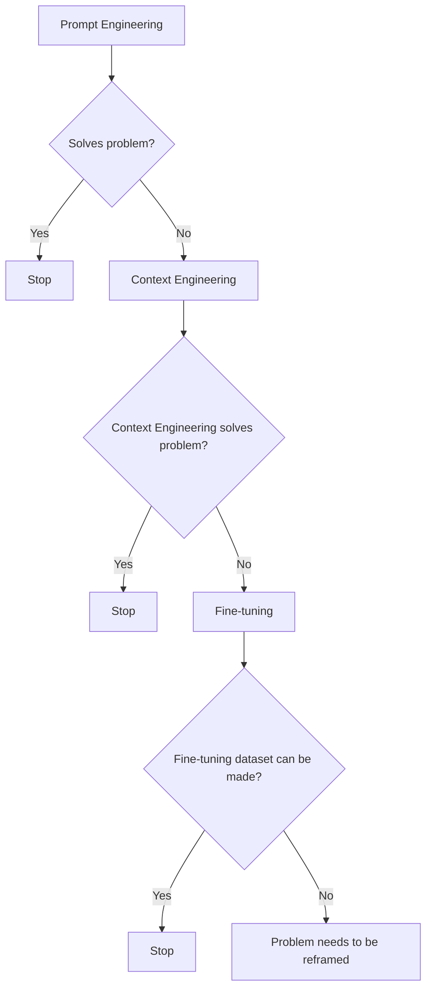
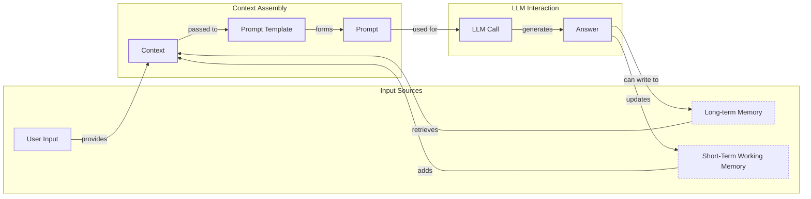
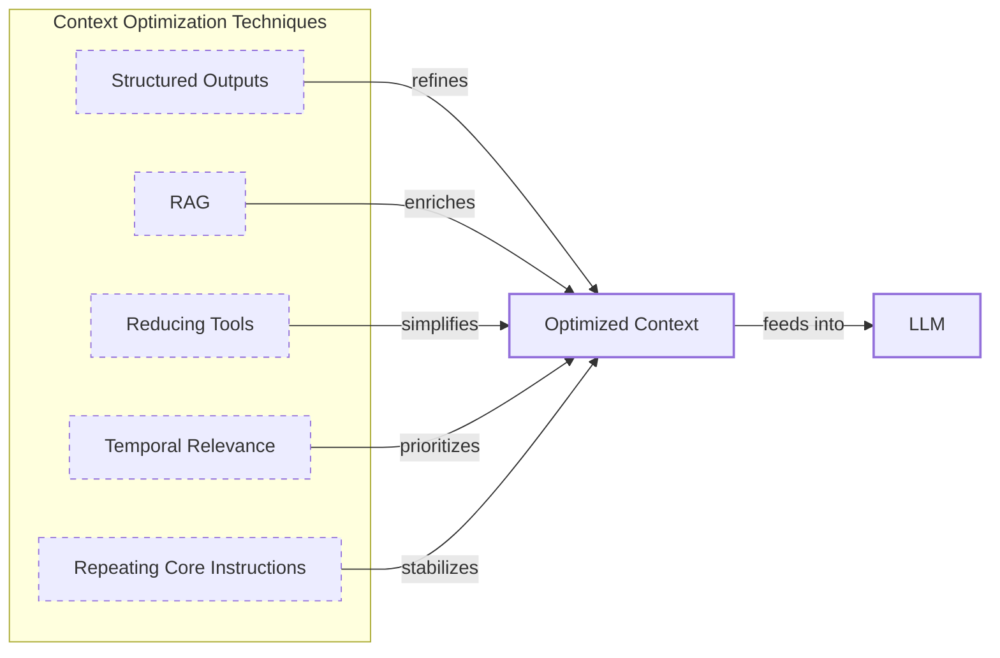
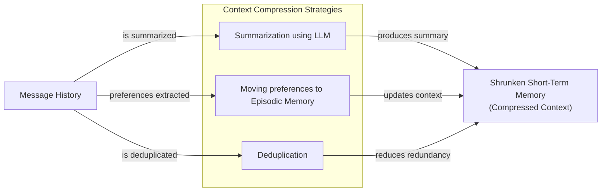
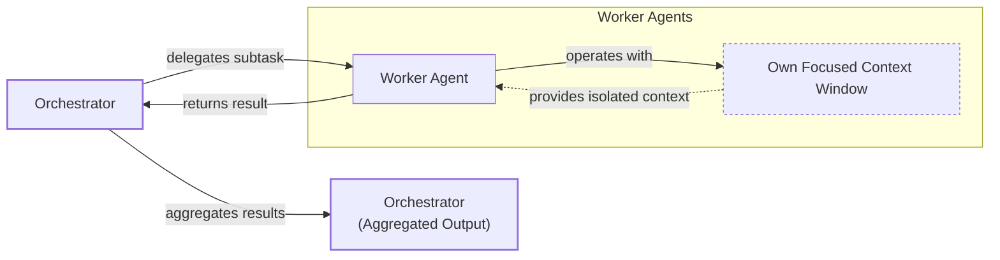

# Context Engineering: 2025’s #1 Skill in AI

## When prompt engineering breaks

AI applications have evolved rapidly. In 2022, we had simple chatbots for question-answering [[26]](https://www.securityindustry.org/2024/07/16/understanding-the-evolution-from-classic-chatbots-to-rag-chatbots-to-ai-powered-assistants/). By 2023, Retrieval-Augmented Generation (RAG) systems connected LLMs to domain-specific knowledge. 2024 brought us tool-using agents that could perform actions [[27]](https://pagergpt.ai/ai-chatbot/evolution-of-ai-chatbots). Now, we are building memory-enabled agents that remember past interactions and build relationships over time [[30]](https://www.linkedin.com/posts/ai-apps-central_most-people-put-all-ai-systems-in-the-same-activity-7438555783077793792-UEUm).

In our last lesson, we explored how to choose between AI agents and LLM workflows when designing a system. As these applications grow more complex, the sheer volume of information an agent might need has grown exponentially. This includes past conversations, user data, documents, and action descriptions. Simply stuffing all this into a prompt is not a viable strategy.

This is where context engineering becomes essential. Unlike prompt engineering, which focuses on single LLM calls, context engineering orchestrates the entire information ecosystem to ensure the LLM gets exactly what it needs, when it needs it. This skill is becoming a core foundation for AI engineering. It is the new fine-tuning for building successful AI agents that manage memory to achieve the best possible performance.

## From Prompt to Context Engineering

Prompt engineering, while effective for simple tasks, is designed for single, stateless interactions. It treats each call to an LLM as a new, isolated event. This approach breaks down in stateful applications where context must be preserved and managed across multiple turns.

As a conversation or task progresses, the context grows. Without a strategy to manage this growth, the LLM’s performance degrades. This is context decay: the model gets confused by the noise of an ever-expanding history, leading to hallucinations or misguided answers [[41]](https://www.decodingai.com/p/context-engineering-2025s-1-skill). It starts to lose track of the original instructions or key information.

Even with large context windows, a physical limit exists for what you can include. Also, on the operational side, every token adds to the cost and latency of an LLM call. Simply putting everything into the context creates a slow, expensive, and underperforming system [[16]](https://www.comet.com/site/blog/context-window/). We will explore these concepts in more detail in upcoming lessons, including memory in Lesson 9 and RAG in Lesson 10.

On a recent project, we learned this the hard way. We were working with a model that supported a two-million-token context window, so we thought, "What could go wrong?" We stuffed everything in: our research, guidelines, examples, and user history. The result was an LLM workflow that took 30 minutes to run and produced low-quality outputs [[41]](https://www.decodingai.com/p/context-engineering-2025s-1-skill).

Context engineering addresses these limitations by treating AI applications not as a series of isolated prompts, but as systems that operate through dynamic context. As AI Engineers, our job is to keep only what's essential in the context when we pass it to the LLM, making it accurate, fast, and cost-effective [[41]](https://www.decodingai.com/p/context-engineering-2025s-1-skill).

## Understanding Context Engineering

Context engineering is about finding the best way to arrange parts of your memory into the context that's passed to the LLM to squeeze out the best results. It is a solution to an optimization problem: you have to retrieve the right parts of both your short and long-term memory to solve a specific task without overwhelming the LLM [[22]](https://arxiv.org/pdf/2507.13334). For example, when asking a cooking agent about a recipe, instead of passing the whole cookbook to the agent, we retrieve just the information about that recipe, together with personal preferences, such as allergies or taste preferences.

Andrej Karpathy offered a great analogy for this. LLMs are like a new kind of operating system, where the model acts as the CPU and its context window functions as the RAM [[31]](https://www.langchain.com/blog/context-engineering-for-agents/), [[33]](https://atlan.com/know/working-memory-llms/). Just as an operating system manages what fits into RAM, context engineering curates what occupies the model’s working memory.

Context engineering is not replacing prompt engineering. Instead, prompt engineering is a subset of context engineering. You still work with prompts, so learning how to write them effectively is still a critical skill. But on top of that, it's important to know how to incorporate the right context into the prompt without compromising the LLM's performance [[41]](https://www.decodingai.com/p/context-engineering-2025s-1-skill), [[52]](https://memgraph.com/blog/prompt-engineering-vs-context-engineering).

| Dimension | Prompt Engineering | Context Engineering |
| :--- | :--- | :--- |
| Scope | Single interaction optimization | Entire information ecosystem |
| State Management | Stateless function | Stateful due to memory |
| Focus | How to phrase tasks | What information to provide |

Table 1: A comparison of prompt engineering and context engineering.

Context engineering is the new fine-tuning. In most use cases, you can go far just by leveraging context engineering techniques. As modern LLMs generalize really well, and because fine-tuning is time-consuming and costly, fine-tuning should always be the last resort if nothing else works [[51]](https://www.linkedin.com/posts/denis-panjuta_prompt-engineering-vs-context-engineering-activity-7363945251180322816-1q_m). When starting a new AI project and deciding what key strategy to use to guide the LLM to answer correctly, your decision-making should look like the workflow in Image 1.


Image 1: A flowchart illustrating the decision-making process for choosing between Prompt Engineering, Context Engineering, and Fine-tuning when solving a problem.

For example, when processing Slack messages from your company, it's sufficient to use a reasoning LLM as the core of the agent. You can then use various mechanisms to retrieve specific Slack messages and take actions based on them, such as creating action points or writing emails. Fine-tuning the LLM on writing emails would, most of the time, be a waste of resources. Throughout this course, we will show you how to solve most industry use cases using the power of context engineering.

## What Makes Up the Context

To better understand what context engineering is, let's look at the core elements that build up the context. The high-level workflow begins when a user input triggers the system to pull relevant information from both long-term and short-term memory. This information is assembled into the final context, inserted into a prompt template, and sent to the LLM. The LLM’s answer then updates the memory, and the cycle repeats, as shown in Image 2.


Image 2: A high-level workflow diagram showing the dynamic assembly of context for an LLM call.

These components are grouped into two main categories. We will explain them intuitively for now, as we have future dedicated lessons for all of them.

**Short-term working memory** is often referred to as the state of the agent or workflow. It is volatile and changes with each interaction, helping the agent maintain a coherent dialogue and make immediate decisions. It can include the user's input, the message history of the current conversation, the agent's internal thoughts, and the results from any actions the agent has performed [[41]](https://www.decodingai.com/p/context-engineering-2025s-1-skill), [[12]](https://www.dailydoseofds.com/llmops-crash-course-part-8/).

**Long-term memory** is more persistent and stores information across sessions. We divide it into three types, drawing parallels to human memory [[37]](https://www.datacamp.com/blog/how-does-llm-memory-work/), [[38]](https://www.analyticsvidhya.com/blog/2026/01/how-does-llm-memory-work/).
*   **Procedural memory** is knowledge encoded directly in the code, such as the system prompt, available tools (actions), and structured output schemas. This is the agent's set of built-in skills.
*   **Episodic memory** is the memory of specific past experiences, like user preferences or previous interactions. It allows for personalization and is typically stored in vector or graph databases for efficient retrieval [[41]](https://www.decodingai.com/p/context-engineering-2025s-1-skill).
*   **Semantic memory** is the agent’s factual knowledge base. It can be internal, like company documents, or external, accessed via the internet through API calls or web scraping. This is the core of RAG [[41]](https://www.decodingai.com/p/context-engineering-2025s-1-skill).

If this seems like a lot, bear with us. We will learn all these concepts in depth in future lessons, such as structured outputs in Lesson 4, tools in Lesson 6, memory in Lesson 9, RAG in Lesson 10, and working with multimodal data in Lesson 11.

 <https://substackcdn.com/image/fetch/w_1456,c_limit,f_auto,q_auto:good,fl_progressive:steep/https%3A%2F%2Fsubstack-post-media.s3.amazonaws.com%2Fpublic%2Fimages%2F39dce26a-e51e-4167-ac9e-ca28c45b53a6_1115x708.png> 
Image 3: An illustration of what makes up the context of an AI agent. (Source [Decoding AI Magazine [41]](https://www.decodingai.com/p/context-engineering-2025s-1-skill))

Even though we talk about what's passed to the LLM in a single turn, most of these elements are preserved across turns within the memory. These are not static components; they are dynamically re-computed on each call. A big part of context engineering is knowing how to pick the right components from memory when building the prompt.

## Production Implementation Challenges

Now that we understand what makes up the context, let's look at the core challenges of implementing it in production. These challenges all revolve around a single question: "How can I keep my context as small as possible while providing enough information to the LLM?"

Here are four common issues that come up when building AI applications:

1.  **The context window challenge:** Every AI model has a limited context window, the maximum amount of information (tokens) it can process at once [[16]](https://www.comet.com/site/blog/context-window/). This is similar to your computer's RAM. If your machine has only 32GB of RAM, that is all it can use at one time. While context windows are getting larger, they are not infinite, and the self-attention mechanism in Transformers imposes quadratic computational overhead as sequence length increases [[22]](https://arxiv.org/pdf/2507.13334).
2.  **Information overload:** Too much context reduces the performance of the LLM by confusing it. This is known as the "lost-in-the-middle" or "needle in the haystack" problem, where LLMs are known for remembering information best at the beginning and end of the context window [[56]](https://www.linkedin.com/pulse/lost-middle-lesson-failing-ai-agents-backwards-anthony-dejohn-01k2e/), [[59]](https://atlan.com/know/llm-context-window-limitations/). Information in the middle is often overlooked, and performance can drop long before the physical context limit is reached, sometimes by over 30% [[41]](https://www.decodingai.com/p/context-engineering-2025s-1-skill), [[59]](https://atlan.com/know/llm-context-window-limitations/).
3.  **Context drift:** This occurs when conflicting views of truth accumulate in the memory over time [[8]](https://thenewstack.io/context-rot-enterprise-ai-llms/), [[9]](https://insightfinder.com/blog/hidden-cost-llm-drift-detection/). For example, the memory might contain two conflicting statements: "My cat is white" and "My cat is black." This is not a quantum physics experiment; it is a data conflict that confuses the LLM and makes its responses unreliable. Without a mechanism to resolve or prune outdated facts, the agent's knowledge base degrades.
4.  **Tool confusion:** This arises in two main ways. First, adding too many actions to an agent can confuse the LLM about the best one for the job. The Gorilla benchmark shows that nearly all models perform worse when given more than one tool [[41]](https://www.decodingai.com/p/context-engineering-2025s-1-skill). Second, confusion can occur when tool descriptions are poorly written or overlap. If the distinctions between actions are unclear, even a human would struggle to choose the right one.

## Key Strategies for Context Optimization

Initially, most AI applications were chatbots over single knowledge bases. Today, modern AI solutions must manage multiple knowledge bases, tools, and complex conversational histories. Context engineering is about managing this complexity while meeting performance, latency, and cost requirements.

Here are four popular context engineering strategies used across the industry.

### Selecting the Right Context

Retrieving the right information from memory is a critical first step. A common mistake is to provide everything at once, assuming that models with large context windows can handle it. As we've discussed, this often leads to poor performance, increased latency, and higher costs [[59]](https://atlan.com/know/llm-context-window-limitations/). To solve this, you can use structured outputs to pass only necessary information downstream, use RAG to fetch specific text chunks, and reduce the number of available tools [[41]](https://www.decodingai.com/p/context-engineering-2025s-1-skill). We will cover these in detail in Lessons 4 and 10.

**Temporal Relevance** is another key selection strategy. For time-sensitive information, you should rank it by date and filter out anything no longer relevant. This ensures the model receives the most current data, which is important for tasks involving recent events or evolving information [[12]](https://www.dailydoseofds.com/llmops-crash-course-part-8/).

Finally, you should **repeat core instructions** at both the start and the end of the prompt. Unintuitively, for the most important instructions, it's recommended to repeat yourself across the prompt, even if it translates into more tokens. This leverages the model's tendency to pay more attention to the context edges, ensuring core instructions are not lost [[41]](https://www.decodingai.com/p/context-engineering-2025s-1-skill).


Image 4: A system diagram illustrating how various context optimization techniques contribute to an optimized context for an LLM.

### Context Compression

As message history grows in short-term working memory, you must manage past interactions to keep your context window in check. You cannot simply drop past conversation turns; instead, you need ways to compress key facts from the past [[11]](https://oneuptime.com/blog/post/2026-01-30-context-compression/view), [[14]](https://blog.jetbrains.com/research/2025/12/efficient-context-management/). You can do this by creating summaries of past interactions using an LLM, moving user preferences to long-term episodic memory, and using deduplication to avoid repetition [[41]](https://www.decodingai.com/p/context-engineering-2025s-1-skill).


Image 5: A process flow diagram illustrating context compression strategies, showing Message History as input, undergoing summarization, preference extraction, and deduplication, resulting in a Shrunken Short-Term Memory or Compressed Context.

### Isolating Context

Another powerful strategy is to isolate context by splitting information across multiple agents or LLM workflows. Instead of one agent with a massive, cluttered context window, you can have a team of agents, each with a smaller, focused context. We often implement this using an orchestrator-worker pattern, where a central agent assigns sub-tasks to specialized worker agents, each operating in its own isolated context [[46]](https://beam.ai/agentic-insights/multi-agent-orchestration-patterns-production), [[47]](https://gurusup.com/blog/multi-agent-orchestration-guide).


Image 6: An architecture diagram illustrating the orchestrator-worker pattern for context isolation.

### Format Optimization

Finally, the way you format the context matters. Models are sensitive to structure, and using clear delimiters can improve performance. Common strategies are to use XML tags to wrap different pieces of context and prefer YAML over JSON when providing structured data as input, as it is often more token-efficient [[41]](https://www.decodingai.com/p/context-engineering-2025s-1-skill).

Ultimately, you always have to understand what is passed to the LLM. Seeing exactly what occupies your context window at every step is key to mastering context engineering. This is usually done by properly monitoring your traces and tracking what happens at each step. As this is a significant step to go from PoC to production, we will have dedicated lessons on this.

## Here is an Example

Let's connect the theory with some concrete examples. AI systems that require context memory are common in several domains.

**Healthcare** systems access patient history, current symptoms, and medical literature to provide personalized diagnostic support [[41]](https://www.decodingai.com/p/context-engineering-2025s-1-skill). In **financial services**, agents integrate with CRMs, calendars, and real-time market data to offer tailored advice. For **project management**, an AI can access enterprise tools like CRMs and task managers to automatically understand project requirements and update tasks. A **content creator assistant** can use your research, past content, and personality traits to generate new material in your style.

Let's walk through the healthcare assistant scenario in more detail. A user asks: `I have a headache. What can I do to stop it? I would prefer not to take any medicine.`

Before the AI attempts to answer, a context engineering system performs several steps:
1.  It retrieves the user's patient history, known allergies, and lifestyle habits from episodic memory [[41]](https://www.decodingai.com/p/context-engineering-2025s-1-skill). This provides the personal context needed for a tailored recommendation.
2.  It queries a medical database for non-medicinal headache remedies from semantic memory. This grounds the response in factual, up-to-date information.
3.  It assembles this information, along with the user's query and the conversation history, into a structured prompt. This is the core assembly step.
4.  We send the prompt to the LLM, which generates a personalized, safe, and relevant recommendation based on the curated context.
5.  We log the interaction and save any new preferences back to the user's episodic memory, refining the system for future interactions.

Here’s a simplified Python example showing how these components might be assembled into a complete system prompt. Notice the clear structure using XML tags and the ordering of context elements.

```python
SYSTEM_PROMPT = """
You are a helpful and cautious AI healthcare assistant. Your goal is to provide safe, non-medicinal advice. Do not provide medical diagnoses.

<INSTRUCTIONS>
1. Analyze the user's query and the provided context.
2. Use the patient history to understand their health profile and preferences.
3. Use the retrieved medical knowledge to form your recommendation.
4. If you lack sufficient information, ask clarifying questions.
5. Always prioritize safety and advise consulting a doctor for serious issues.
</INSTRUCTIONS>

<PATIENT_HISTORY>
{retrieved_patient_history}
</PATIENT_HISTORY>

<MEDICAL_KNOWLEDGE>
{retrieved_medical_articles}
</MEDICAL_KNOWLEDGE>

<CONVERSATION_HISTORY>
{formatted_chat_history}
</CONVERSATION_HISTORY>

<USER_QUERY>
{user_query}
</USER_QUERY>

Based on all the information above, provide a helpful response.
"""
```

The key relies on the system around it that brings in the proper context to populate the system prompt. To build such a system, you would use a combination of tools. An LLM like Gemini provides the reasoning engine. A framework like LangGraph orchestrates the workflow. Databases such as PostgreSQL, MongoDB, Redis, Qdrant, or Neo4j can serve as long-term memory stores [[62]](https://blog.stackademic.com/context-engineering-in-llms-and-ai-agents-eb861f0d3e9b). Specialized tools can manage memory state, and observability platforms like Opik or LangSmith are essential for debugging complex interactions [[18]](https://www.getmaxim.ai/articles/context-window-management-strategies-for-long-context-ai-agents-and-chatbots/).

<aside>
💡
It's often recommended to keep your database setup simple, as you can get very far with only PostgreSQL or MongoDB.
</aside>

## Conclusion - Wrap-up: Connecting context engineering to AI engineering

Mastering context engineering is less about learning a specific algorithm and more about building intuition. It is the practice of knowing how to structure prompts, what information to include, and how to order it for maximum impact. This discipline helps you determine the minimal yet essential information an LLM needs to perform at its best.

This skill does not exist in a vacuum. It is a multidisciplinary practice that sits at the intersection of several key engineering fields:
*   **AI Engineering:** Understanding LLMs, RAG, and AI agents is the foundation.
*   **Software Engineering:** You need to build scalable and maintainable systems to aggregate context and wrap agents in robust APIs.
*   **Data Engineering:** Constructing reliable data pipelines for RAG and other memory systems is critical.
*   **MLOps:** Deploying agents on the right infrastructure and automating Continuous Integration/Continuous Deployment (CI/CD) makes them reproducible, observable, and scalable.

Our goal with this course is to teach you how to combine these skills to build production-ready AI products. In the world of AI, we should all think in systems rather than isolated components, having a mindset shift from developers to architects.

In the next lesson, we will explore structured outputs. Later, we will dig deeper into tools, memory, RAG, and working with multimodal data, all of which are essential components of a robust context engineering strategy.

## References

- [1] https://arxiv.org/pdf/2507.13334
- [2] https://pmc.ncbi.nlm.nih.gov/articles/PMC11751965/
- [3] https://arxiv.org/html/2506.21585v1
- [4] https://www.speakeasy.com/blog/pydantic-vs-dataclasses
- [5] https://codetain.com/blog/validators-approach-in-python-pydantic-vs-dataclasses/
- [6] https://galileo.ai/blog/production-llm-monitoring-strategies
- [7] https://www.coforge.com/what-we-know/blog/navigating-the-shifting-sands-understanding-and-mitigating-data-drift-in-llms
- [8] https://thenewstack.io/context-rot-enterprise-ai-llms/
- [9] https://insightfinder.com/blog/hidden-cost-llm-drift-detection/
- [10] https://www.helicone.ai/blog/how-to-reduce-llm-hallucination
- [11] https://oneuptime.com/blog/post/2026-01-30-context-compression/view
- [12] https://www.dailydoseofds.com/llmops-crash-course-part-8/
- [13] https://arxiv.org/html/2510.22101v1
- [14] https://blog.jetbrains.com/research/2025/12/efficient-context-management/
- [15] https://www.comet.com/site/blog/context-window/
- [16] https://www.comet.com/site/blog/context-window/
- [17] https://datahub.com/blog/context-window-optimization/
- [18] https://www.getmaxim.ai/articles/context-window-management-strategies-for-long-context-ai-agents-and-chatbots/
- [19] https://www.linkedin.com/posts/aditya-santhanam_your-llm-hits-the-token-limit-conversation-activity-7425863566190260224-Pz6v
- [20] https://blog.jetbrains.com/research/2025/12/efficient-context-management/
- [21] https://packmind.com/context-engineering-ai-coding/what-is-contextops/
- [22] https://arxiv.org/pdf/2507.13334
- [23] https://sombrainc.com/blog/ai-context-engineering-guide
- [24] https://www.glean.com/blog/context-engineering-ai-the-foundation-of-reliable-high-performing-models
- [25] https://www.securityindustry.org/2024/07/16/understanding-the-evolution-from-classic-chatbots-to-rag-chatbots-to-ai-powered-assistants/
- [26] https://www.securityindustry.org/2024/07/16/understanding-the-evolution-from-classic-chatbots-to-rag-chatbots-to-ai-powered-assistants/
- [27] https://pagergpt.ai/ai-chatbot/evolution-of-ai-chatbots
- [28] https://www.dante-ai.com/news/when-did-ai-chatbots-start
- [29] https://www.linkedin.com/posts/ai-apps-central_most-people-put-all-ai-systems-in-the-same-activity-7438555783077793792-UEUm
- [30] https://www.linkedin.com/posts/ai-apps-central_most-people-put-all-ai-systems-in-the-same-activity-7438555783077793792-UEUm
- [31] https://www.langchain.com/blog/context-engineering-for-agents
- [32] https://www.glean.com/perspectives/context-engineering-vs-prompt-engineering-key-differences-explained
- [33] https://atlan.com/know/working-memory-llms/
- [34] https://www.sundeepteki.org/blog/from-vibe-coding-to-context-engineering-a-blueprint-for-production-grade-genai-systems
- [35] https://www.linkedin.com/pulse/context-engineering-silent-architecture-behind-every-ai-roychowdhury-lzcec
- [36] https://atlan.com/know/working-memory-llms/
- [37] https://www.datacamp.com/blog/how-does-llm-memory-work
- [38] https://www.analyticsvidhya.com/blog/2026/01/how-does-llm-memory-work/
- [39] https://skymod.tech/why-memory-matters-in-llm-agents-short-term-vs-long-term-memory-architectures/
- [40] https://labelstud.io/learningcenter/episodic-vs-persistent-memory-in-llms/
- [41] https://www.decodingai.com/p/context-engineering-2025s-1-skill
- [42] https://www.mdpi.com/2079-9292/13/15/2961
- [43] https://www.anthropic.com/engineering/effective-context-engineering-for-ai-agents
- [44] https://beam.ai/agentic-insights/multi-agent-orchestration-patterns-production
- [45] https://gurusup.com/blog/multi-agent-orchestration-guide
- [46] https://beam.ai/agentic-insights/multi-agent-orchestration-patterns-production
- [47] https://gurusup.com/blog/multi-agent-orchestration-guide
- [48] https://www.vellum.ai/blog/multi-agent-systems-building-with-context-engineering
- [49] https://www.praetorian.com/blog/deterministic-ai-orchestration-a-platform-architecture-for-autonomous-development/
- [50] https://arxiv.org/html/2601.13671v1
- [51] https://www.linkedin.com/posts/denis-panjuta_prompt-engineering-vs-context-engineering-activity-7363945251180322816-1q_m
- [52] https://memgraph.com/blog/prompt-engineering-vs-context-engineering
- [53] https://www.mezmo.com/learn-observability/context-engineering-for-observability-how-to-deliver-the-right-data-to-llms
- [54] https://www.instinctools.com/blog/context-engineering/
- [55] https://neo4j.com/blog/agentic-ai/context-engineering-vs-prompt-engineering/
- [56] https://www.linkedin.com/pulse/lost-middle-lesson-failing-ai-agents-backwards-anthony-dejohn-01k2e
- [57] https://dev.to/thousand_miles_ai/the-lost-in-the-middle-problem-why-llms-ignore-the-middle-of-your-context-window-3al2
- [58] https://atlan.com/know/llm-context-window-limitations/
- [59] https://atlan.com/know/llm-context-window-limitations/
- [60] https://bigdataboutique.com/blog/needle-in-haystack-optimizing-retrieval-and-rag-over-long-context-windows-5dfb3c
- [61] https://www.codecademy.com/article/context-engineering-in-ai
- [62] https://blog.stackademic.com/context-engineering-in-llms-and-ai-agents-eb861f0d3e9b
- [63] https://packmind.com/context-engineering-ai-coding/how-to-implement-context-engineering/
- [64] https://atlan.com/know/context-engineering-platforms-comparison/
- [65] https://www.scalablepath.com/machine-learning/langgraph

</article>