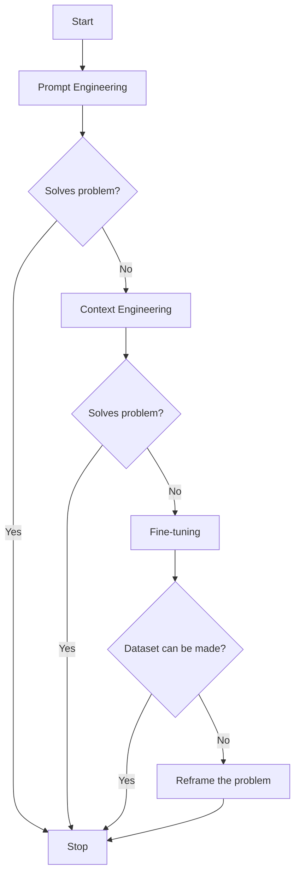
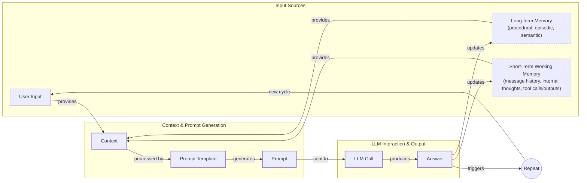
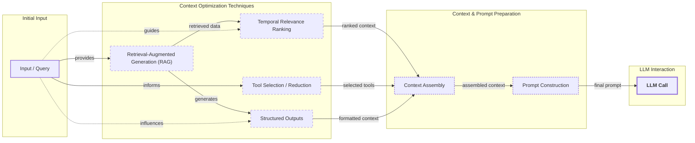
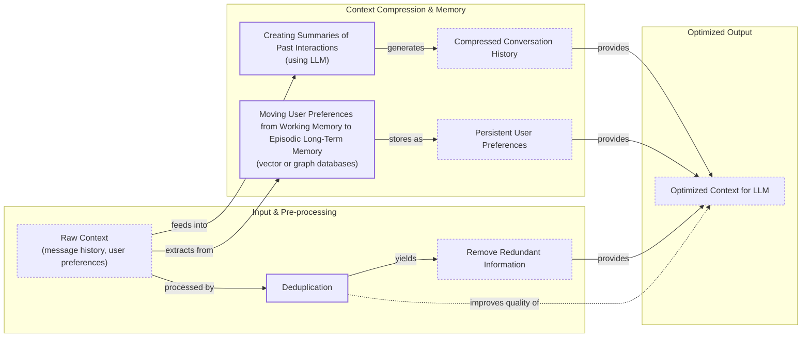
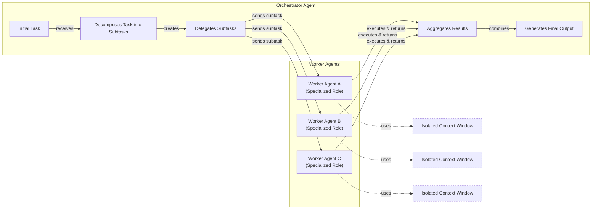

AI applications have evolved rapidly. In 2022, we had simple chatbots that used predefined scripts and decision trees, limiting them to simple queries. By 2023, Retrieval-Augmented Generation (RAG) systems connected LLMs to domain-specific knowledge, but these systems were mainly informational and could not perform actions. 2024 brought us action-using agents that could interact with external systems. Now, we are building memory-enabled agents that remember past interactions and build relationships over time.

In our last lesson, we explored how to choose between AI agents and LLM workflows when designing a system. As these applications grow more complex, prompt engineering, a practice that once served us well, is showing its limits. It optimizes single LLM calls but fails when managing systems with memory, actions, and long interaction histories. The sheer volume of information an agent might need—past conversations, user data, documents, and action descriptions—has grown exponentially. Simply stuffing all this into a prompt is not a viable strategy.

The discipline of orchestrating this entire information ecosystem to ensure the LLM gets exactly what it needs, when it needs it, is called context engineering. This skill is becoming a core foundation for AI engineering [[20]](https://blog.langchain.com/the-rise-of-context-engineering/).

## From Prompt to Context Engineering

Prompt engineering, while effective for simple tasks, is designed for single, stateless interactions. It treats each call to an LLM as a new, isolated event. This approach breaks down in stateful applications where context must be preserved and managed across multiple turns [[22]](https://www.mezmo.com/learn-observability/context-engineering-for-observability-how-to-deliver-the-right-data-to-llms).

As a conversation or task progresses, the context grows. Without a strategy to manage this growth, the LLM’s performance degrades. This is context decay: the model gets confused by the noise of an ever-expanding history and starts to lose track of the original instructions. Even with large context windows, a physical limit exists for what you can include, and every token adds to the cost and latency of an LLM call. For agents, this is worse, as context from action outputs accumulates with each step, quickly leading to failures. A naive approach of "stuffing the window" creates a slow, expensive, and underperforming system [[16]](https://www.comet.com/site/blog/context-window/), [[21]](https://www.datacamp.com/blog/context-engineering).

We will explore these concepts in more detail in upcoming lessons, including memory in Lesson 9 and RAG in Lesson 10.

On a recent project, we learned this the hard way. We were working with a model that supported a two-million-token context window, so we thought, "*What could go wrong?*" We stuffed everything in: our research, guidelines, examples, and user history. The result was an LLM workflow that took 30 minutes to run and produced low-quality outputs.

This need for a more systematic approach is met by context engineering. It shifts the focus from crafting static prompts to building dynamic systems that manage information flow. As an AI engineer, your job is to select only the most critical pieces of context for each LLM call. This makes your applications accurate, fast, and cost-effective [[18]](https://blog.langchain.com/context-engineering-for-agents/).

## Understanding Context Engineering

Context engineering involves finding the optimal way to arrange information from your application's memory into the context passed to an LLM. It is a solution to an optimization problem where you retrieve the right parts from your short-term and long-term memory to solve a specific task without overwhelming the model. For example, when you ask a cooking agent for a recipe, you do not give it the entire cookbook. Instead, you retrieve the specific recipe, along with personal context like allergies or taste preferences. This precise selection ensures the model receives only the essential information [[22]](https://arxiv.org/pdf/2507.13334).

Andrej Karpathy offered a great analogy for this: LLMs are a new kind of operating system, where the model is the CPU and its context window is the RAM. The context window is the fast, limited, active working memory. External knowledge bases, like vector stores or documents, function as disk storage—vast and passive, requiring an explicit load into RAM to be used. Just as an operating system manages what fits into RAM, context engineering curates what occupies the model’s working memory [[31]](https://www.langchain.com/blog/context-engineering-for-agents/), [[33]](https://atlan.com/know/working-memory-llms/).

How does context engineering relate to prompt engineering? It's simple. Prompt engineering is a subset of context engineering. You still write effective prompts, but you also design a system that feeds the right context into those prompts. This means understanding not just *how* to phrase a task, but *what* information the model needs to perform optimally [[21]](https://www.datacamp.com/blog/context-engineering), [[20]](https://blog.langchain.com/the-rise-of-context-engineering/).

<caption_table>
Table 1: A comparison of prompt engineering and context engineering.
</caption_table>
| Dimension | Prompt Engineering | Context Engineering |
|-----------|-------------------|---------------------|
| Scope | Single interaction optimization | Entire information ecosystem |
| State Management | Stateless function | Stateful due to memory |
| Focus | How to phrase tasks | What information to provide |

Context engineering is the new fine-tuning. While fine-tuning has its place, it is expensive, time-consuming, and inflexible. Data changes constantly, making fine-tuning a last resort for teaching a model a new core skill or behavior. For most enterprise use cases where the goal is to ground the model in specific, evolving knowledge, you get better results faster and more cheaply with context engineering. It allows for rapid iteration and adaptation to new information without altering the core model, a key advantage in dynamic environments [[51]](https://www.linkedin.com/posts/denis-panjuta_prompt-engineering-vs-context-engineering-activity-7363945251180322816-1q_m), [[52]](https://memgraph.com/blog/prompt-engineering-vs-context-engineering).

When you start a new AI project, your decision-making process for guiding the LLM should look like the one presented in Image 1.


<caption_diagram>
Image 1: A flowchart illustrating the decision-making process for choosing an AI strategy.
</caption_diagram>

For instance, if you build an agent to process internal Slack messages, you do not need to fine-tune a model on your company’s communication style. It is more effective to use a powerful reasoning model and engineer the context to retrieve specific messages and enable actions like creating tasks or drafting emails. Throughout this course, we will show you how to solve most industry problems using only context engineering [[53]](https://www.mezmo.com/learn-observability/context-engineering-for-observability-how-to-deliver-the-right-data-to-llms).

## What Makes Up the Context

To better understand what context engineering is, let's look at the core elements that build up the context. The high-level workflow begins when a user input triggers the system to pull relevant information from both long-term and short-term memory. This information is assembled into the final context, inserted into a prompt template, and sent to the LLM. The LLM’s answer then updates the memory, and the cycle repeats.


<caption_diagram>
Image 2: A flowchart illustrating the high-level workflow of context assembly for an LLM call.
</caption_diagram>

These components are grouped into two main categories. We will explain them intuitively for now, as we have future dedicated lessons for all of them.

### Short-Term Working Memory

Short-term working memory is the state of the agent for the current task or conversation. It is volatile, session-specific, and changes with each interaction, helping the agent maintain a coherent dialogue and make immediate decisions. Physically, this working memory is managed in the GPU's memory to speed up processing. It can include some or all of these components [[37]](https://www.datacamp.com/blog/how-does-llm-memory-work), [[36]](https://atlan.com/know/working-memory-llms/).

-   **User input:** The most recent query or command from the user.
-   **Message history:** The log of the current conversation, allowing the LLM to understand the flow and previous turns.
-   **Agent's internal thoughts:** The reasoning steps the agent takes to decide on its next action.
-   **Action calls and outputs:** The results from any actions the agent has performed, providing information from external systems.

### Long-Term Memory

Long-term memory is more persistent and stores information across sessions, allowing the AI system to remember things beyond a single conversation. We divide it into three types, drawing parallels from human memory. An AI system can include some or all of them [[37]](https://www.datacamp.com/blog/how-does-llm-memory-work), [[38]](https://www.analyticsvidhya.com/blog/2026/01/how-does-llm-memory-work/).

-   **Procedural memory:** This is knowledge about how to perform tasks, often encoded directly in the code or system prompt. It includes the agent's core instructions, the definitions of available actions, and schemas for structured outputs. This is the agent's set of built-in skills and routines.
-   **Episodic memory:** This is a memory of specific past events and user interactions, like a personal diary. It is used to help the agent personalize its responses by recalling user preferences or previous conversations. We typically store this in vector or graph databases for efficient retrieval.
-   **Semantic memory:** This is the agent’s "textbook" knowledge base. It can be internal, like company documents stored in a database, or external, accessed via the internet through API calls or web scraping. This memory provides the factual information the agent needs to answer questions [[39]](https://skymod.tech/why-memory-matters-in-llm-agents-short-term-vs-long-term-memory-architectures/), [[38]](https://www.analyticsvidhya.com/blog/2026/01/how-does-llm-memory-work/).

If this seems like a lot, bear with us. We will cover all these concepts in-depth in future lessons, including structured outputs in Lesson 4, actions in Lesson 6, memory in Lesson 9, RAG in Lesson 10, and working with multimodal data in Lesson 11.

https://substackcdn.com/image/fetch/w_1456,c_limit,f_auto,q_auto:good,fl_progressive:steep/https%3A%2F%2Fsubstack-post-media.s3.amazonaws.com%2Fpublic%2Fimages%2F39dce26a-e51e-4167-ac9e-ca28c45b53a6_1115x708.png 
<caption_image>
Image 3: An illustration of the components that make up an AI agent's context. (Source [Decoding AI Magazine [41]](https://www.decodingai.com/p/context-engineering-2025s-1-skill))
</caption_image>

These components are not static; they are dynamically re-computed for every single interaction. For each conversation turn or new task, the short-term memory grows, or the long-term memory can change. Context engineering involves knowing how to select the right pieces from this vast memory pool to construct the most effective prompt for the task at hand.

## Production Implementation Challenges

Now that we understand what makes up the context, let's look at the core challenges of implementing it in production. These challenges all revolve around a single question: "How can I keep my context as small as possible while providing enough information to the LLM?"

Here are four common issues that come up when building AI applications:

1.  **The context window challenge:** Every AI model has a limited context window, the maximum amount of information (tokens) it can process at once. This is a physical constraint similar to a computer's RAM. While context windows are getting larger, the working memory required by the model grows with every piece of information, creating a bottleneck that slows down performance [[16]](https://www.comet.com/site/blog/context-window/).
2.  **Information overload:** Too much context reduces the performance of the LLM by confusing it. This is known as the **"lost-in-the-middle"** problem, where LLMs are known for remembering information best at the beginning and end of the context window. The **"needle in a haystack"** test visualizes this by asking a model to find a specific fact (the needle) in a large body of text (the haystack); performance drops when the needle is in the middle. This effect is a symptom of **context rot**, a researched phenomenon where performance degrades as input length increases—even in the latest models [[56]](https://www.linkedin.com/pulse/lost-middle-lesson-failing-ai-agents-backwards-anthony-dejohn-01k2e), [[58]](https://dev.to/thousand_miles_ai/the-lost-in-the-middle-problem-why-llms-ignore-the-middle-of-your-context-window-3al2), [[60]](https://bigdataboutique.com/blog/needle-in-haystack-optimizing-retrieval-and-rag-over-long-context-windows-5dfb3c), [[67]](https://www.morphllm.com/context-rot).
3.  **Context drift:** This occurs when conflicting versions of the truth accumulate in the memory over time. For example, the memory might contain two conflicting statements: "My cat is white" and "My cat is black." This is not Schrodinger's Cat; it is a data conflict that confuses the LLM and makes its knowledge base unreliable. Other related failure modes include **context poisoning**, where incorrect information enters and compounds, and **context clash** from contradictory instructions [[6]](https://galileo.ai/blog/production-llm-monitoring-strategies), [[8]](https://thenewstack.io/context-rot-enterprise-ai-llms/), [[68]](https://weaviate.io/blog/context-engineering).
4.  **Action confusion:** The final challenge is action confusion, which arises in two main ways. First, adding too many actions to an agent can confuse the LLM about the best one for the job. The Gorilla benchmark shows that nearly all models perform worse when given more than one action. Second, confusion can occur when action descriptions are poorly written or overlap. If the distinctions between actions are unclear, even a human would struggle to choose the right one [[21]](https://www.datacamp.com/blog/context-engineering).

## Key Strategies for Context Optimization

Initially, most AI applications were chatbots over single knowledge bases. Today, modern AI solutions must manage multiple knowledge bases, actions, and complex conversational histories. Context engineering is about managing this complexity while meeting performance, latency, and cost requirements.

Here are four popular context engineering strategies used across the industry:

### Selecting the Right Context

Retrieving the right information from memory is a critical first step. A common mistake is to provide everything at once, assuming that models with large context windows can handle it. As we've discussed, the "lost-in-the-middle" problem often leads to poor performance, increased latency, and higher costs. To solve this, you should dynamically select only the most relevant context for each task [[59]](https://atlan.com/know/llm-context-window-limitations/).

This can be achieved through several techniques. Using **structured outputs** allows you to pass only necessary, validated information downstream, a topic for Lesson 4. **RAG** is fundamental for fetching specific text chunks instead of entire documents, which we will explore in Lesson 10. For agents, **reducing the number of available actions** to a relevant subset (e.g., under 30) can triple selection accuracy. In enterprise settings, **using knowledge graphs** provides a structured, semantic layer over your data, allowing retrieval based on relationships, not just text similarity. Finally, **refining user input** with query augmentation can clarify ambiguity and improve retrieval effectiveness [[54]](https://www.instinctools.com/blog/context-engineering/), [[68]](https://weaviate.io/blog/context-engineering), [[69]](https://www.moodys.com/web/en/us/creditview/blog/beyond-prompts-why-enterprise-ai-demands-context-engineering.html).


<caption_diagram>
Image 4: An architecture diagram illustrating context optimization techniques in an AI system, showing the flow from input to LLM call.
</caption_diagram>

### Context Compression

As message history grows in short-term working memory, you must manage past interactions to keep your context window in check. You cannot simply drop past conversation turns, as the LLM still needs to remember what happened. Instead, you need ways to compress key facts from the past. You can do this by creating summaries of past interactions, moving user preferences to long-term memory, and removing redundant information through deduplication [[11]](https://oneuptime.com/blog/post/2026-01-30-context-compression/view), [[12]](https://www.dailydoseofds.com/llmops-crash-course-part-8/).


<caption_diagram>
Image 5: A flowchart illustrating context compression techniques for managing conversation history and user preferences.
</caption_diagram>

### Isolating Context

Another powerful strategy is to isolate context by splitting information across multiple agents or LLM workflows. This technique is similar to action isolation but is more general, referring to the whole context. The key idea is that instead of one agent with a massive, cluttered context window, you can have a team of agents, each with a smaller, focused context [[48]](https://www.vellum.ai/blog/multi-agent-systems-building-with-context-engineering).


<caption_diagram>
Image 6: An architecture diagram illustrating the Orchestrator-Worker pattern for context isolation in multi-agent systems.
</caption_diagram>

We often implement this using an orchestrator-worker pattern, where a central orchestrator agent breaks down a problem and assigns sub-tasks to specialized worker agents. Each worker operates in its own isolated context, improving focus, preventing cross-domain hallucinations, and allowing for parallel processing. We will cover this pattern in more detail in Lesson 5 [[46]](https://beam.ai/agentic-insights/multi-agent-orchestration-patterns-production), [[47]](https://gurusup.com/blog/multi-agent-orchestration-guide).

### Format Optimization

Finally, the way you format the context matters. Models are sensitive to structure, and using clear delimiters can improve performance. Common strategies are to use XML tags to wrap different pieces of context (e.g., `<user_query>`) or prefer YAML over JSON when providing structured data as input, as it is often more token-efficient [[44]](https://www.anthropic.com/engineering/effective-context-engineering-for-ai-agents).

You always have to understand what is passed to the LLM. Seeing exactly what occupies your context window at every step is key to mastering context engineering. This is usually done by properly monitoring your traces, tracking what happens at each step, and understanding the inputs and outputs. As this is a significant step to go from PoC to production, we will have dedicated lessons on this [[16]](https://www.comet.com/site/blog/context-window/), [[18]](https://www.getmaxim.ai/articles/context-window-management-strategies-for-long-context-ai-agents-and-chatbots/).

## Here is an Example

Let's connect the theory and strategies discussed earlier with a concrete example. AI systems with advanced context engineering are already in use across various domains, such as healthcare assistants providing personalized diagnostics, financial agents integrating with CRMs, and project managers that access enterprise tools like Slack and task managers [[41]](https://www.decodingai.com/p/context-engineering-2025s-1-skill).

Let's walk through a specific query to see context engineering in action with the healthcare assistant scenario. A user asks: `I have a headache. What can I do to stop it? I would prefer not to take any medicine.`

Before the AI attempts to answer, a context engineering system performs several steps:

1.  It retrieves the user's patient history, known allergies, and lifestyle habits from **episodic memory**. This applies the strategy of **selecting the right context** to personalize the interaction.
2.  It queries a medical database for non-pharmacological headache remedies from **semantic memory**. This is a classic **RAG** pattern, retrieving only factual knowledge relevant to the query.
3.  It assembles this information, along with a **compressed summary** of the current conversation history, into a structured prompt using XML tags for **format optimization**.
4.  We send the prompt to the LLM, which generates a personalized, safe, and relevant recommendation.
5.  We log the interaction and save any new preferences back to the user's episodic memory, which helps prevent **context drift** in future sessions [[38]](https://www.analyticsvidhya.com/blog/2026/01/how-does-llm-memory-work/).

Here is a simplified Python example showing how you might structure the context and prompt for the LLM, using XML tags to format the different context elements.

```python
SYSTEM_PROMPT = """
You are a helpful and cautious AI healthcare assistant. Your goal is to provide safe, non-medicinal advice. Do not provide medical diagnoses.

<INSTRUCTIONS>
1. Analyze the user's query and the provided context.
2. Use the patient history to understand their health profile and preferences.
3. Use the retrieved medical knowledge to form your recommendation.
4. If you lack sufficient information, ask clarifying questions.
5. Always prioritize safety and advise consulting a doctor for serious issues.
</INSTRUCTIONS>

<PATIENT_HISTORY>
{retrieved_patient_history}
</PATIENT_HISTORY>

<MEDICAL_KNOWLEDGE>
{retrieved_medical_articles}
</MEDICAL_KNOWLEDGE>

<CONVERSATION_HISTORY>
{formatted_chat_history}
</CONVERSATION_HISTORY>

<USER_QUERY>
{user_query}
</USER_QUERY>

Based on all the information above, provide a helpful response.
"""
```

The key relies on the system around it that brings in the proper context to populate the system prompt. To build such a system, you would use a combination of tools. Here is a potential tech stack we recommend and will use throughout this course:

-   **LLM:** Gemini provides a multimodal, reasoning, and cost-effective LLM API.
-   **Orchestration:** LangGraph is an orchestration framework for building stateful, multi-agent systems.
-   **Databases:** PostgreSQL, Qdrant, and Neo4j are good choices for structured data, vector search, and knowledge graphs, respectively. It is often effective to keep it simple, as you can achieve much with only one or two of these.
-   **Observability:** Opik or LangSmith are essential for debugging and monitoring what is in the context window at each step [[41]](https://www.decodingai.com/p/context-engineering-2025s-1-skill), [[62]](https://blog.stackademic.com/context-engineering-in-llms-and-ai-agents-eb861f0d3e9b), [[64]](https://atlan.com/know/context-engineering-platforms-comparison/), [[65]](https://www.scalablepath.com/machine-learning/langgraph).

## Conclusion - Wrap-up: Connecting context engineering to AI engineering

Context engineering is a discipline that blends intuition with systematic practice. It is about developing the ability to craft effective prompts, select the right information from memory, and arrange context for optimal results. This discipline helps you determine the minimal yet essential information an LLM needs to perform at its best. Open research questions remain, such as solving the "comprehension-generation asymmetry," where models understand complex inputs but struggle to generate equally complex outputs.

This skill doesn't exist in a vacuum. It is a multidisciplinary practice that sits at the intersection of several key engineering fields [[72]](https://alphaxiv.org/overview/2507.13334v2).

1.  **AI Engineering:** Implement practical solutions such as LLM workflows, RAG, AI Agents, and evaluation pipelines.
2.  **Software Engineering (SWE):** Build your AI product with code that is not just functional, but also scalable and maintainable. Context engineering is an engineering problem that requires robust APIs and maintainable architectures.
3.  **Data Engineering:** Constructing reliable data pipelines for RAG and other memory systems is critical. Without clean, fresh data, context becomes poisoned.
4.  **Operations (Ops):** Deploy agents on the right infrastructure and automating Continuous Integration/Continuous Deployment (CI/CD) makes them reproducible, observable, and scalable. This includes monitoring for context drift and performance degradation [[22]](https://www.mezmo.com/learn-observability/context-engineering-for-observability-how-to-deliver-the-right-data-to-llms), [[23]](https://sombrainc.com/blog/ai-context-engineering-guide).

Our goal with this course is to teach you how to combine these skills to build production-ready AI products. In the world of AI, we should all think in systems rather than isolated components, having a mindset shift from developers to architects who design the information ecosystems that AI inhabits.

In the next lesson, we will explore structured outputs. We will also revisit context engineering principles when we discuss actions in Lesson 6, memory in Lesson 9, and RAG in Lesson 10 [[73]](https://www.ardoq.com/blog/context-engineering-ai).

## References

- [1] Humanlayer. (n.d.). 12-factor-agents/content/factor-03-own-your-context-window.md at main · humanlayer/12-factor-agents. GitHub. [https://github.com/humanlayer/12-factor-agents/blob/main/content/factor-03-own-your-context-window.md](https://github.com/humanlayer/12-factor-agents/blob/main/content/factor-03-own-your-context-window.md)
- [2] What modifications might be needed to the LLM's input formatting or architecture to best take advantage of retrieved documents (for example, adding special tokens or segments to separate context)? (n.d.). Milvus. [https://milvus.io/ai-quick-reference/what-modifications-might-be-needed-to-the-llms-input-formatting-or-architecture-to-best-take-advantage-of-retrieved-documents-for-example-adding-special-tokens-or-segments-to-separate-context](https://milvus.io/ai-quick-reference/what-modifications-might-be-needed-to-the-llms-input-formatting-or-architecture-to-best-take-advantage-of-retrieved-documents-for-example-adding-special-tokens-or-segments-to-separate-context)
- [3] Baker, G. A., Raut, A., Shaier, S., Hunter, L. E., & Von Der Wense, K. (2024, January 1). Lost in the middle, and In-Between: Enhancing language models' ability to reason over long contexts in Multi-Hop QA. OpenReview. [https://openreview.net/forum?id=5sB6cSblDR](https://openreview.net/forum?id=5sB6cSblDR)
- [4] Falconer, S. (n.d.). Four design patterns for Event-Driven, Multi-Agent systems. Confluent. [https://www.confluent.io/blog/event-driven-multi-agent-systems/](https://www.confluent.io/blog/event-driven-multi-agent-systems/)
- [5] From Human Memory to AI Memory: A survey on Memory Mechanisms in the Era of LLMS. (n.d.). arXiv. [https://arxiv.org/html/2504.15965v1](https://arxiv.org/html/2504.15965v1)
- [6] Galileo. (n.d.). Production LLM Monitoring Strategies. [https://galileo.ai/blog/production-llm-monitoring-strategies](https://galileo.ai/blog/production-llm-monitoring-strategies)
- [7] Coforge. (n.d.). Navigating the Shifting Sands: Understanding and Mitigating Data Drift in LLMs. [https://www.coforge.com/what-we-know/blog/navigating-the-shifting-sands-understanding-and-mitigating-data-drift-in-llms](https://www.coforge.com/what-we-know/blog/navigating-the-shifting-sands-understanding-and-mitigating-data-drift-in-llms)
- [8] The New Stack. (2026, February). Context Rot Is the Silent Killer of Enterprise AI. [https://thenewstack.io/context-rot-enterprise-ai-llms/](https://thenewstack.io/context-rot-enterprise-ai-llms/)
- [9] Talkdesk Support. (n.d.). Preview AI Agent Platform Best Practices. [https://support.talkdesk.com/hc/en-us/articles/39096730105115--Preview-AI-Agent-Platform-Best-Practices](https://support.talkdesk.com/hc/en-us/articles/39096730105115--Preview-AI-Agent-Platform-Best-Practices)
- [10] Tabnine. (2025, April 3). Your AI doesn't need more Training—It needs context. [https://www.tabnine.com/blog/your-ai-doesnt-need-more-training-it-needs-context/](https://www.tabnine.com/blog/your-ai-doesnt-need-more-training-it-needs-context/)
- [11] OneUptime. (2026, January 30). How to Build Context Compression. [https://oneuptime.com/blog/post/2026-01-30-context-compression/view](https://oneuptime.com/blog/post/2026-01-30-context-compression/view)
- [12] Daily Dose of DS. (n.d.). LLMOps Crash Course Part 8: Memory, Temporal Context, and Advanced RAG. [https://www.dailydoseofds.com/llmops-crash-course-part-8/](https://www.dailydoseofds.com/llmops-crash-course-part-8/)
- [13] Forrester. (2025, January 10). The state of AI agents: lots of potential … and confusion. [https://www.forrester.com/blogs/the-state-of-ai-agents-lots-of-potential-and-confusion/](https://www.forrester.com/blogs/the-state-of-ai-agents-lots-of-potential-and-confusion/)
- [14] 66degrees. (2025, April 7). Building a business case for AI in financial Services. [https://66degrees.com/building-a-business-case-for-ai-in-financial-services/](https://66degrees.com/building-a-business-case-for-ai-in-financial-services/)
- [15] Akira AI. (n.d.). Context Engineering: The Complete guide. [https://www.akira.ai/blog/context-engineering](https://www.akira.ai/blog/context-engineering)
- [16] Comet. (2025, December 23). Context Window: What It Is and Why It Matters for AI Agents. [https://www.comet.com/site/blog/context-window/](https://www.comet.com/site/blog/context-window/)
- [17] Promptmetheus. (n.d.). Lost-in-the-Middle effect. [https://promptmetheus.com/resources/llm-knowledge-base/lost-in-the-middle-effect](https://promptmetheus.com/resources/llm-knowledge-base/lost-in-the-middle-effect)
- [18] LangChain Blog. (2025, July 2). Context Engineering for Agents. [https://blog.langchain.com/context-engineering-for-agents/](https://blog.langchain.com/context-engineering-for-agents/)
- [19] LlamaIndex Blog. (n.d.). Context Engineering - What it is, and techniques to consider. [https://www.llamaindex.ai/blog/context-engineering-what-it-is-and-techniques-to-consider](https://www.llamaindex.ai/blog/context-engineering-what-it-is-and-techniques-to-consider)
- [20] LangChain Blog. (2025, June 23). The rise of "context engineering". [https://blog.langchain.com/the-rise-of-context-engineering/](https://blog.langchain.com/the-rise-of-context-engineering/)
- [21] DataCamp. (n.d.). Context Engineering: A Guide With Examples. [https://www.datacamp.com/blog/context-engineering](https://www.datacamp.com/blog/context-engineering)
- [22] Mei, L., et al. (2025, July 17). A survey of context engineering for large language models. arXiv.org. [https://arxiv.org/pdf/2507.13334](https://arxiv.org/pdf/2507.13334)
- [23] Sombra. (n.d.). AI Context Engineering: A Practical Guide for Developers. [https://sombrainc.com/blog/ai-context-engineering-guide](https://sombrainc.com/blog/ai-context-engineering-guide)
- [24] karpathy, A. (n.d.). X. [https://x.com/karpathy/status/1937902205765607626](https://x.com/karpathy/status/1937902205765607626)
- [25] lenadroid. (n.d.). X. [https://x.com/lenadroid/status/1943685060785524824](https://x.com/lenadroid/status/1943685060785524824)
- [26] Security Industry Association. (2024, July 16). Understanding the Evolution from Classic Chatbots to RAG Chatbots to AI-Powered Assistants. [https://www.securityindustry.org/2024/07/16/understanding-the-evolution-from-classic-chatbots-to-rag-chatbots-to-ai-powered-assistants/](https://www.securityindustry.org/2024/07/16/understanding-the-evolution-from-classic-chatbots-to-rag-chatbots-to-ai-powered-assistants/)
- [27] PagerGPT. (n.d.). The Evolution of AI Chatbots: From Basic Scripts to Autonomous Agents. [https://pagergpt.ai/ai-chatbot/evolution-of-ai-chatbots](https://pagergpt.ai/ai-chatbot/evolution-of-ai-chatbots)
- [28] Saravia, E. (2025, July 5). Context Engineering Guide. AI Newsletter. [https://nlp.elvissaravia.com/p/context-engineering-guide](https://nlp.elvissaravia.com/p/context-engineering-guide)
- [29] Dante AI. (n.d.). When Did AI Chatbots Start? A Brief History. [https://www.dante-ai.com/news/when-did-ai-chatbots-start](https://www.dante-ai.com/news/when-did-ai-chatbots-start)
- [30] Pinecone. (n.d.). What is Context Engineering? [https://www.pinecone.io/learn/context-engineering/](https://www.pinecone.io/learn/context-engineering/)
- [31] LangChain Blog. (n.d.). Context Engineering for Agents. [https://blog.langchain.com/context-engineering-for-agents/](https://blog.langchain.com/context-engineering-for-agents/)
- [32] Glean. (n.d.). Context Engineering vs. Prompt Engineering: Key Differences Explained. [https://www.glean.com/perspectives/context-engineering-vs-prompt-engineering-key-differences-explained](https://www.glean.com/perspectives/context-engineering-vs-prompt-engineering-key-differences-explained)
- [33] Atlan. (n.d.). Working Memory in LLMs: How It Works & Why It Matters for Enterprise AI. [https://atlan.com/know/working-memory-llms/](https://atlan.com/know/working-memory-llms/)
- [34] Teki, S. (n.d.). From Vibe Coding to Context Engineering: A Blueprint for Production-Grade GenAI Systems. [https://www.sundeepteki.org/blog/from-vibe-coding-to-context-engineering-a-blueprint-for-production-grade-genai-systems](https://www.sundeepteki.org/blog/from-vibe-coding-to-context-engineering-a-blueprint-for-production-grade-genai-systems)
- [35] Roychowdhury, S. (n.d.). Context Engineering - The silent architecture behind every AI-Agent. LinkedIn. [https://www.linkedin.com/pulse/context-engineering-silent-architecture-behind-every-ai-roychowdhury-lzcec](https://www.linkedin.com/pulse/context-engineering-silent-architecture-behind-every-ai-roychowdhury-lzcec)
- [36] Atlan. (n.d.). Working Memory in LLMs: How It Works & Why It Matters for Enterprise AI. [https://atlan.com/know/working-memory-llms/](https://atlan.com/know/working-memory-llms/)
- [37] DataCamp. (n.d.). How Does LLM Memory Work? [https://www.datacamp.com/blog/how-does-llm-memory-work](https://www.datacamp.com/blog/how-does-llm-memory-work)
- [38] Analytics Vidhya. (2026, January). How Does LLM Memory Work? A Deep Dive. [https://www.analyticsvidhya.com/blog/2026/01/how-does-llm-memory-work/](https://www.analyticsvidhya.com/blog/2026/01/how-does-llm-memory-work/)
- [39] Skymod. (n.d.). Why Memory Matters in LLM Agents: Short-Term vs. Long-Term Memory Architectures. [https://skymod.tech/why-memory-matters-in-llm-agents-short-term-vs-long-term-memory-architectures/](https://skymod.tech/why-memory-matters-in-llm-agents-short-term-vs-long-term-memory-architectures/)
- [40] Label Studio. (n.d.). Episodic vs. Persistent Memory in LLMs: A Practical Guide. [https://labelstud.io/learningcenter/episodic-vs-persistent-memory-in-llms/](https://labelstud.io/learningcenter/episodic-vs-persistent-memory-in-llms/)
- [41] Decoding AI. (2025). Context Engineering: 2025’s #1 Skill in AI. [https://www.decodingai.com/p/context-engineering-2025s-1-skill](https://www.decodingai.com/p/context-engineering-2025s-1-skill)
- [42] Decoding AI. (2025). Context Engineering: 2025’s #1 Skill in AI. [https://www.decodingai.com/p/context-engineering-2025s-1-skill](https://www.decodingai.com/p/context-engineering-2025s-1-skill)
- [43] MDPI. (2025). Prompt Engineering in Healthcare: A Comprehensive Review. [https://www.mdpi.com/2079-9292/13/15/2961](https://www.mdpi.com/2079-9292/13/15/2961)
- [44] Anthropic. (n.d.). Effective context engineering for AI agents. [https://www.anthropic.com/engineering/effective-context-engineering-for-ai-agents](https://www.anthropic.com/engineering/effective-context-engineering-for-ai-agents)
- [45] Atlan. (n.d.). Context Engineering Platforms: A 2026 Comparison. [https://atlan.com/know/context-engineering-platforms-comparison/](https://atlan.com/know/context-engineering-platforms-comparison/)
- [46] Beam.ai. (n.d.). Multi-Agent Orchestration Patterns for Production. [https://beam.ai/agentic-insights/multi-agent-orchestration-patterns-production](https://beam.ai/agentic-insights/multi-agent-orchestration-patterns-production)
- [47] GuruSup. (n.d.). The Definitive Guide to Multi-Agent Orchestration. [https://gurusup.com/blog/multi-agent-orchestration-guide](https://gurusup.com/blog/multi-agent-orchestration-guide)
- [48] Vellum. (n.d.). Building Reliable Multi-Agent Systems with Context Engineering. [https://www.vellum.ai/blog/multi-agent-systems-building-with-context-engineering](https://www.vellum.ai/blog/multi-agent-systems-building-with-context-engineering)
- [49] Praetorian. (n.d.). Deterministic AI Orchestration: A Platform Architecture for Autonomous Development. [https://www.praetorian.com/blog/deterministic-ai-orchestration-a-platform-architecture-for-autonomous-development/](https://www.praetorian.com/blog/deterministic-ai-orchestration-a-platform-architecture-for-autonomous-development/)
- [50] arXiv. (2026). A Framework for Building Production-Ready Multi-Agent Systems. [https://arxiv.org/html/2601.13671v1](https://arxiv.org/html/2601.13671v1)
- [51] Panjuta, D. (n.d.). Prompt Engineering vs. Context Engineering vs. Fine-Tuning. LinkedIn. [https://www.linkedin.com/posts/denis-panjuta_prompt-engineering-vs-context-engineering-activity-7363945251180322816-1q_m](https://www.linkedin.com/posts/denis-panjuta_prompt-engineering-vs-context-engineering-activity-7363945251180322816-1q_m)
- [52] Memgraph. (n.d.). Prompt Engineering vs. Context Engineering: What’s the Difference? [https://memgraph.com/blog/prompt-engineering-vs-context-engineering](https://memgraph.com/blog/prompt-engineering-vs-context-engineering)
- [53] Mezmo. (n.d.). Context Engineering for Observability: How to Deliver the Right Data to LLMs. [https://www.mezmo.com/learn-observability/context-engineering-for-observability-how-to-deliver-the-right-data-to-llms](https://www.mezmo.com/learn-observability/context-engineering-for-observability-how-to-deliver-the-right-data-to-llms)
- [54] Instinctools. (n.d.). Context Engineering: The New Frontier for AI Agents. [https://www.instinctools.com/blog/context-engineering/](https://www.instinctools.com/blog/context-engineering/)
- [55] Neo4j. (n.d.). Agentic AI: Context Engineering vs. Prompt Engineering. [https://neo4j.com/blog/agentic-ai/context-engineering-vs-prompt-engineering/](https://neo4j.com/blog/agentic-ai/context-engineering-vs-prompt-engineering/)
- [56] DeJohn, A. (n.d.). ‘Lost in the Middle’: A Lesson in Failing AI Agents (and How to Fix Them). LinkedIn. [https://www.linkedin.com/pulse/lost-middle-lesson-failing-ai-agents-backwards-anthony-dejohn-01k2e](https://www.linkedin.com/pulse/lost-middle-lesson-failing-ai-agents-backwards-anthony-dejohn-01k2e)
- [57] Promptmetheus. (n.d.). LLM Knowledge Base: Lost-in-the-Middle Effect. [https://promptmetheus.com/resources/llm-knowledge-base/lost-in-the-middle-effect](https://promptmetheus.com/resources/llm-knowledge-base/lost-in-the-middle-effect)
- [58] Thousand Miles AI. (n.d.). The 'Lost in the Middle' Problem: Why LLMs Ignore the Middle of Your Context Window. DEV Community. [https://dev.to/thousand_miles_ai/the-lost-in-the-middle-problem-why-llms-ignore-the-middle-of-your-context-window-3al2](https://dev.to/thousand_miles_ai/the-lost-in-the-middle-problem-why-llms-ignore-the-middle-of-your-context-window-3al2)
- [59] Atlan. (2026). LLM Context Window Limitations: Impacts, Risks, & Fixes in 2026. [https://atlan.com/know/llm-context-window-limitations/](https://atlan.com/know/llm-context-window-limitations/)
- [60] BigData Boutique. (n.d.). Needle in a Haystack: Optimizing Retrieval and RAG over Long Context Windows. [https://bigdataboutique.com/blog/needle-in-haystack-optimizing-retrieval-and-rag-over-long-context-windows-5dfb3c](https://bigdataboutique.com/blog/needle-in-haystack-optimizing-retrieval-and-rag-over-long-context-windows-5dfb3c)
- [61] Codecademy. (n.d.). Context Engineering in AI. [https://www.codecademy.com/article/context-engineering-in-ai](https://www.codecademy.com/article/context-engineering-in-ai)
- [62] Stackademic. (n.d.). Context Engineering in LLMs and AI Agents. [https://blog.stackademic.com/context-engineering-in-llms-and-ai-agents-eb861f0d3e9b](https://blog.stackademic.com/context-engineering-in-llms-and-ai-agents-eb861f0d3e9b)
- [63] Decoding AI. (2025). Context Engineering: 2025’s #1 Skill in AI. [https://www.decodingai.com/p/context-engineering-2025s-1-skill](https://www.decodingai.com/p/context-engineering-2025s-1-skill)
- [64] Atlan. (n.d.). Context Engineering Platforms: A 2026 Comparison. [https://atlan.com/know/context-engineering-platforms-comparison/](https://atlan.com/know/context-engineering-platforms-comparison/)
- [65] Scalable Path. (n.d.). LangGraph: Orchestrating Stateful Multi-Agent Workflows. [https://www.scalablepath.com/machine-learning/langgraph](https://www.scalablepath.com/machine-learning/langgraph)
- [66] Clarifai. (n.d.). LLM Inference Optimization: A Technical Deep Dive. [https://www.clarifai.com/blog/llm-inference-optimization/](https://www.clarifai.com/blog/llm-inference-optimization/)
- [67] Morph. (n.d.). Context Rot. [https://www.morphllm.com/context-rot](https://www.morphllm.com/context-rot)
- [68] Weaviate. (n.d.). Context Engineering, LLM Memory, and Retrieval for AI Agents. [https://weaviate.io/blog/context-engineering](https://weaviate.io/blog/context-engineering)
- [69] Moody's. (n.d.). Beyond Prompts: Why Enterprise AI Demands Context Engineering. [https://www.moodys.com/web/en/us/creditview/blog/beyond-prompts-why-enterprise-ai-demands-context-engineering.html](https://www.moodys.com/web/en/us/creditview/blog/beyond-prompts-why-enterprise-ai-demands-context-engineering.html)
- [70] Emergent Mind. (n.d.). Context Compression Framework. [https://www.emergentmind.com/topics/context-compression-framework](https://www.emergentmind.com/topics/context-compression-framework)
- [71] University of Maryland. (2024, October 23). New Research Helps Robots Grasp Situational Context. [https://robotics.umd.edu/news/story/new-research-helps-robots-grasp-situational-context](https://robotics.umd.edu/news/story/new-research-helps-robots-grasp-situational-context)
- [72] AlphaXiv. (2025). A Survey of Context Engineering for Large Language Models. [https://alphaxiv.org/overview/2507.13334v2](https://alphaxiv.org/overview/2507.13334v2)
- [73] Ardoq. (n.d.). Context Engineering Will Reshape How We Build with AI. [https://www.ardoq.com/blog/context-engineering-ai](https://www.ardoq.com/blog/context-engineering-ai)