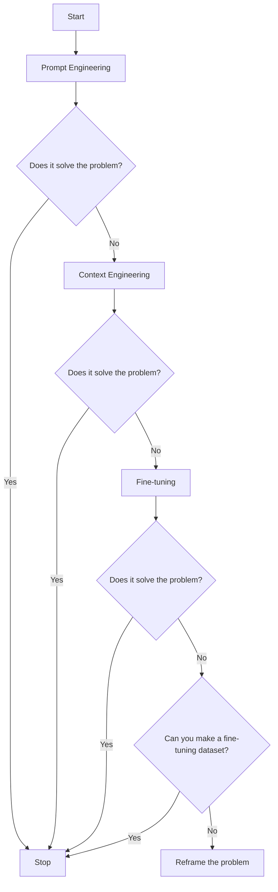
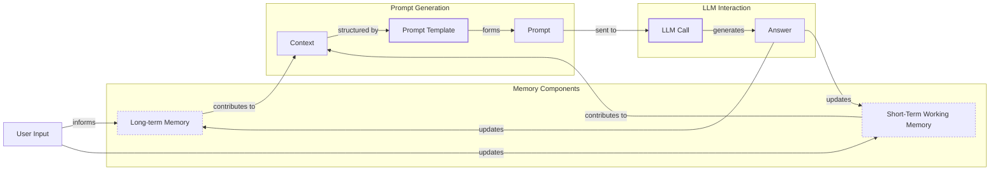
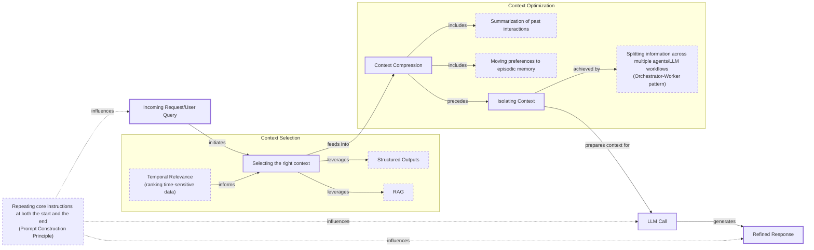
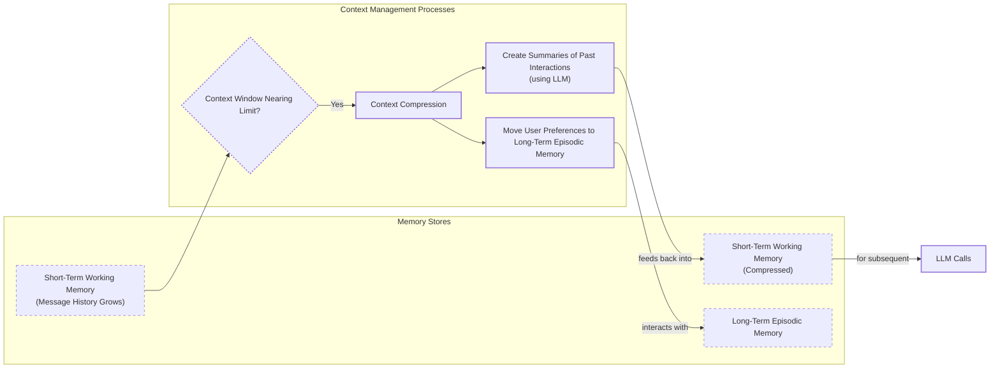
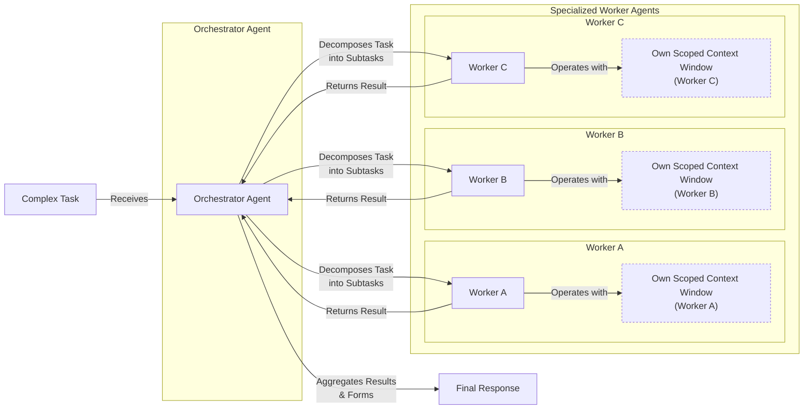

# Context Engineering: The #1 Skill for AI Engineers

AI applications have evolved rapidly. In 2022, we had simple chatbots for question-answering. By 2023, Retrieval-Augmented Generation (RAG) systems connected LLMs to domain-specific knowledge. 2024 brought us tool-using agents that could perform actions. Now, in 2025, we are building memory-enabled agents that remember past interactions and maintain state over time.

In our last lesson, we explored how to choose between AI agents and LLM workflows when designing a system. As these applications grow more complex, prompt engineering, a practice that once served us well, is showing its limits. It optimizes single LLM calls but fails when managing systems with memory, actions, and long interaction histories [[41]](https://www.decodingai.com/p/context-engineering-2025s-1-skill). The sheer volume of information an agent might need—past conversations, user data, documents, and action descriptions—has grown exponentially. Simply stuffing all this into a prompt is not a viable strategy. This is where context engineering comes in. It is the discipline of orchestrating this entire information ecosystem to ensure the LLM gets exactly what it needs, when it needs it [[31]](https://www.langchain.com/blog/context-engineering-for-agents). This skill is becoming a core foundation for AI engineering.

## From Prompt to Context Engineering

Prompt engineering, while effective for simple tasks, is designed for single, stateless interactions. It treats each call to an LLM as a new, isolated event. This approach breaks down in stateful applications where context must be preserved and managed across multiple turns [[52]](https://memgraph.com/blog/prompt-engineering-vs-context-engineering).

As a conversation or task progresses, the context grows. Without a strategy to manage this growth, the LLM’s performance degrades. This is "context decay" or "context rot": the model gets confused by the noise of an ever-expanding history [[59]](https://atlan.com/know/llm-context-window-limitations/). For example, a planner agent might be tasked with researching electric cars, but after a long conversation, it drifts and starts writing about solar panels because the original goal was lost in the noise [[66]](https://medium.com/@umairamin2004/why-multi-agent-systems-fail-in-production-and-how-to-fix-them-3bedbdd4975b). Research shows that even with massive context windows, model performance degrades continuously as input length increases [[3]](https://www.trychroma.com/research/context-rot). It starts to lose track of the original instructions or key information, leading to hallucinations and misguided answers [[41]](https://www.decodingai.com/p/context-engineering-2025s-1-skill).

Even with large context windows, a physical limit exists for what you can include. This is the context window challenge. Also, on the operational side, every token adds to the cost and latency of an LLM call [[41]](https://www.decodingai.com/p/context-engineering-2025s-1-skill). Simply putting everything into the context creates a slow, expensive, and underperforming system. We will explore these concepts in more detail in upcoming lessons, including memory in Lesson 9 and RAG in Lesson 10.

On a recent project, we learned this the hard way. We were working with a model that supported a two-million-token context window, so we thought, "*What could go wrong?*" We stuffed everything in: our research, guidelines, examples, and user history. The result was an LLM workflow that took 30 minutes to run and produced low-quality outputs [[41]](https://www.decodingai.com/p/context-engineering-2025s-1-skill).

This is where context engineering becomes essential. It shifts the focus from crafting static prompts to building dynamic systems that manage information flow [[32]](https://www.glean.com/perspectives/context-engineering-vs-prompt-engineering-key-differences-explained). As an AI engineer, your job is to select only the most critical pieces of context for each LLM call. This makes your applications accurate, fast, and cost-effective.

## Understanding Context Engineering

Context engineering is about finding the best way to arrange parts of your application's memory into the context that is passed to an LLM to get the best results [[22]](https://www.mezmo.com/learn-observability/context-engineering-for-observability-how-to-deliver-the-right-data-to-llms). It is a solution to an optimization problem where you retrieve the right parts from your short-term and long-term memory to solve a specific task without overwhelming the model [[41]](https://www.decodingai.com/p/context-engineering-2025s-1-skill). At a formal level, some researchers are beginning to model this as a probabilistic search for an optimal context, where the goal is to dynamically tune the system’s outcomes without retraining the model [[67]](https://arxiv.org/html/2512.04469v1). For example, when you ask a cooking agent for a recipe, you do not give it the entire cookbook. Instead, you retrieve the specific recipe, along with personal context like allergies or taste preferences. This precise selection ensures the model receives only the essential information.

Andrej Karpathy offered a great analogy for this: LLMs are like a new kind of operating system, where the model acts as the CPU and its context window functions as the RAM [[31]](https://www.langchain.com/blog/context-engineering-for-agents/). Just as an operating system manages what fits into RAM, context engineering curates what occupies the model’s working memory [[33]](https://atlan.com/know/working-memory-llms/).

Context engineering is not replacing prompt engineering. Instead, prompt engineering is a subset of context engineering. You still work with prompts, so learning how to write them effectively is still a critical skill. But on top of that, it is important to know how to incorporate the right context into the prompt without compromising the LLM's performance [[41]](https://www.decodingai.com/p/context-engineering-2025s-1-skill).

| Dimension | Prompt Engineering | Context Engineering |
| --- | --- | --- |
| Scope | Single interaction optimization | Entire information ecosystem |
| State Management | Stateless function | Stateful due to memory |
| Focus | How to phrase tasks | What information to provide |

Table 1: A comparison of prompt engineering and context engineering.

Context engineering is the new fine-tuning. While fine-tuning has its place, it is expensive, time-consuming, and inflexible. Data changes constantly, making fine-tuning a last resort [[51]](https://www.linkedin.com/posts/denis-panjuta_prompt-engineering-vs-context-engineering-activity-7363945251180322816-1q_m). For most use cases, you can get better results faster and more cheaply with context engineering. It allows for rapid iteration and adaptation to evolving data without altering the core model, a key advantage in dynamic environments [[53]](https://www.mezmo.com/learn-observability/context-engineering-for-observability-how-to-deliver-the-right-data-to-llms).

When you start a new AI project, your decision-making process for guiding the LLM should look like the one presented in Image 1. You start with the simplest approach, prompt engineering. If that doesn't solve your problem, you move to the more complex but powerful context engineering. Only if that fails, and you can create a high-quality dataset, should you consider the most resource-intensive option: fine-tuning.


Image 1: Flowchart illustrating the decision-making process for selecting a key strategy (Prompt Engineering, Context Engineering, Fine-tuning) to guide an LLM in a new AI project.

For instance, if you build an agent to process internal Slack messages, you do not need to fine-tune a model on your company’s communication style. It is more effective to use a powerful reasoning model and engineer the context to retrieve specific messages and enable actions like creating tasks or drafting emails. Throughout this course, we will show you how to solve most industry problems using only context engineering.

## What Makes Up the Context

To master context engineering, you first need to understand what "context" is. It is everything the LLM sees in a single turn, dynamically assembled from various memory components before being passed to the model [[41]](https://www.decodingai.com/p/context-engineering-2025s-1-skill).

The high-level workflow, as presented in Image 2, begins when a user input triggers the system to pull relevant information from both long-term and short-term memory. This information is assembled into the final context, inserted into a prompt template, and sent to the LLM. The LLM’s answer then updates the memory, and the cycle repeats.


Image 2: A flowchart illustrating the high-level workflow of how user input is processed through various memory components to form the context for an LLM call, leading to an LLM call and answer, which then updates the memory.

These components are grouped into two main categories. We will explain them intuitively for now, as we have future dedicated lessons for all of them.

### Short-Term Working Memory

Short-term working memory is the state of the agent for the current task or conversation [[39]](https://skymod.tech/why-memory-matters-in-llm-agents-short-term-vs-long-term-memory-architectures/). It is volatile and changes with each interaction, helping the agent maintain a coherent dialogue and make immediate decisions. It can include some or all of these components:

*   **User input:** The most recent query or command from the user.
*   **Message history:** The log of the current conversation, allowing the LLM to understand the flow and previous turns.
*   **Agent's internal thoughts:** The reasoning steps the agent takes to decide on its next action.
*   **Action calls and outputs:** The results from any actions the agent has performed, providing information from external systems.

### Long-Term Memory

Long-term memory is more persistent and stores information across sessions, allowing the AI system to remember things beyond a single conversation [[39]](https://skymod.tech/why-memory-matters-in-llm-agents-short-term-vs-long-term-memory-architectures/). We divide it into three types, drawing parallels from human memory [[41]](https://www.decodingai.com/p/context-engineering-2025s-1-skill). An AI system can include some or all of them:

*   **Procedural memory:** This is knowledge encoded directly in the code. It includes the system prompt, which sets the agent's overall behavior. It also includes the definitions of available actions, which tell the agent what it can do, and schemas for structured outputs, which guide the format of its responses [[38]](https://www.analyticsvidhya.com/blog/2026/01/how-does-llm-memory-work/). Think of this as the agent's built-in skills.
*   **Episodic memory:** This is memory of specific past experiences, like user preferences or previous interactions [[40]](https://labelstud.io/learningcenter/episodic-vs-persistent-memory-in-llms/). It's used to help the agent personalize its responses based on individual users. We typically store this in vector or graph databases for efficient retrieval.
*   **Semantic memory:** This is the agent’s general knowledge base. It can be internal, like company documents stored in a data lake, or external, accessed via the internet through API calls or web scrapers. This memory provides the factual information the agent needs to answer questions [[37]](https://www.datacamp.com/blog/how-does-llm-memory-work).

Another way to view these components is to group them into **Knowledge Context**, which includes facts, memories, and retrieved documents, and **Tools Context**, which contains action descriptions and feedback from external systems [[68]](https://galileo.ai/blog/context-engineering-for-agents). This distinction is useful for debugging where an agent might be failing.

If this seems like a lot, bear with us. We will cover all these concepts in-depth in future lessons, including structured outputs in Lesson 4, actions in Lesson 6, memory in Lesson 9, RAG in Lesson 10, and working with multimodal data in Lesson 11.

https://i.imgur.com/vHq0A6r.png 
Image 3: A detailed illustration of how all the context engineering components work together inside an AI agent (Source [DECODING ML](https://decodingml.substack.com/))

The key takeaway is that these components are not static. They are dynamically re-computed for every single interaction. For each conversation turn or new task, the short-term memory grows, or the long-term memory can change. Context engineering involves knowing how to select the right pieces from this vast memory pool to construct the most effective prompt for the task at hand.

## Production Implementation Challenges

Now that we understand what makes up the context, let's look at the core challenges of implementing it in production. These challenges all revolve around a single question: *"How can I keep my context as small as possible while providing enough information to the LLM?"*

Here are five common issues that come up when building AI applications:

1.  **The context window challenge:** While context windows are getting larger, a more fundamental bottleneck is the computational cost of processing that context. A key component here is the **KV cache**, which stores intermediate calculations for previous tokens to speed up generation. However, this cache grows with the context size, consuming vast amounts of expensive GPU memory [[69]](https://www.digitalocean.com/community/conceptual-articles/bottlenecks-llm-inference-optimization). In agentic workflows, every time an agent calls an external tool, this cache might be evicted, forcing a slow and expensive recomputation of the entire history on the next turn [[70]](https://arxiv.org/html/2604.06296v2).
2.  **Information overload:** Just because you can fit a lot of information into the context does not mean you should. Too much context reduces the performance of the LLM by confusing it. This is known as the "lost-in-the-middle" or "needle in the haystack" problem [[56]](https://www.linkedin.com/pulse/lost-middle-lesson-failing-ai-agents-backwards-anthony-dejohn-01k2e). This phenomenon has a technical explanation: a U-shaped attention distribution where models recall information from the beginning (primacy bias) and end (recency bias) of the context far better than the middle. The initial tokens often act as an "attention sink," absorbing a disproportionate amount of the model's attention, regardless of their relevance [[71]](https://agentpatterns.ai/context-engineering/attention-sinks/).
3.  **Context drift:** This occurs when conflicting versions of the truth accumulate in the memory [[6]](https://galileo.ai/blog/production-llm-monitoring-strategies). For example, the memory might contain "The budget is $500" and later "The budget is $1,000" [[41]](https://www.decodingai.com/p/context-engineering-2025s-1-skill). Without a way to resolve these conflicts, the model's responses become unreliable.
4.  **Tool confusion:** This arises in two ways. First, giving an agent too many actions confuses it about which one to use; model performance often degrades with more than one tool [[41]](https://www.decodingai.com/p/context-engineering-2025s-1-skill). Second, poorly written or overlapping tool descriptions make it impossible for the model to choose correctly.
5.  **Context poisoning:** This is a dangerous feedback loop where an initial hallucination or incorrect piece of information is saved to memory. The agent then uses this "poisoned" context in future reasoning steps, leading to a cascade of errors as one bad output contaminates the entire system [[72]](https://www.mongodb.com/company/blog/technical/why-multi-agent-systems-need-memory-engineering).

## Key Strategies for Context Optimization

Initially, most AI applications were chatbots over single knowledge bases. Today, modern AI solutions must manage multiple knowledge bases, tools, and complex conversational histories. Context engineering is about managing this complexity while meeting performance, latency, and cost requirements.

Here are four popular context engineering strategies used across the industry:


Image 4: System architecture diagram illustrating context optimization techniques in an AI system.

### Selecting the Right Context

Retrieving the right information from memory is a critical first step. A common mistake is providing everything at once, assuming that models with large context windows can handle it. As we've discussed, the "lost-in-the-middle" problem often leads to poor performance, increased latency, and higher costs [[58]](https://dev.to/thousand_miles_ai/the-lost-in-the-middle-problem-why-llms-ignore-the-middle-of-your-context-window-3al2).

To solve this, consider these approaches:

*   **Use structured outputs:** Use clear schemas to pass only necessary, structured information downstream. We will cover this in detail in Lesson 4.
*   **Use RAG:** Instead of providing entire documents, use RAG to fetch only the specific chunks of text needed to answer a user's question. This is a core topic we will explore in Lesson 10. Furthermore, effective retrieval goes beyond semantic similarity, requiring **hybrid retrieval** strategies that also weigh recency, task context, and agent role [[74]](https://www.oreilly.com/radar/why-multi-agent-systems-need-memory-engineering/). In multi-agent systems, this means tailoring memory selection to each agent's capabilities [[75]](https://medium.com/mongodb/why-multi-agent-systems-need-memory-engineering-153a81f8d5be).
*   **Reduce the number of available actions:** Rather than giving an agent access to every available action, use various strategies to delegate action subsets to specialized components. For example, a typical pattern is to leverage the orchestrator-worker pattern to delegate subtasks to specialized agents. Studies have shown that applying RAG to tool descriptions can improve tool selection accuracy by 3-fold [[31]](https://www.langchain.com/blog/context-engineering-for-agents/).
*   **Rank time-sensitive data:** For time-sensitive information, rank it by date and filter out anything no longer relevant [[12]](https://www.dailydoseofds.com/llmops-crash-course-part-8/).
*   **Repeat core instructions:** For the most important instructions, repeat them at both the start and the end of the prompt. This uses the model's tendency to pay more attention to the context edges, ensuring core instructions are not lost [[57]](https://promptmetheus.com/resources/llm-knowledge-base/lost-in-the-middle-effect).

### Context Compression

As message history grows in short-term working memory, you must manage past interactions to keep your context window in check. You cannot simply drop past conversation turns, as the LLM still needs to remember what happened. Instead, you need ways to compress key facts from the past.


Image 5: A flowchart detailing the process of context compression within an AI agent's memory management.

You can do this through:

1.  **Creating summaries of past interactions:** Use an LLM to replace a long, detailed history with a concise overview [[11]](https://oneuptime.com/blog/post/2026-01-30-context-compression/view). However, this approach carries the risk of "summarization drift," where repeated compression cycles cause the agent to slowly lose important details, creating a memory that no longer accurately reflects what happened [[73]](https://towardsdatascience.com/a-practical-guide-to-memory-for-autonomous-llm-agents/).
2.  **Moving user preferences to long-term memory:** Transfer user preferences from working memory to long-term episodic memory. This keeps the working context clean while ensuring preferences are remembered for future sessions [[41]](https://www.decodingai.com/p/context-engineering-2025s-1-skill).
3.  **Deduplication:** Remove redundant information from the context to avoid repetition [[11]](https://oneuptime.com/blog/post/2026-01-30-context-compression/view).

### Isolating Context

Another powerful strategy is to isolate context by splitting information across multiple agents or LLM workflows. This technique is similar to tool isolation but is more general, referring to the whole context. The key idea is that instead of one agent with a massive, cluttered context window, you can have a team of agents, each with a smaller, focused context [[48]](https://www.vellum.ai/blog/multi-agent-systems-building-with-context-engineering).


Image 6: An architecture diagram illustrating the Orchestrator-Worker pattern for isolating context in a multi-agent system.

We often implement this using an orchestrator-worker pattern, where a central orchestrator agent breaks down a problem and assigns sub-tasks to specialized worker agents [[46]](https://beam.ai/agentic-insights/multi-agent-orchestration-patterns-production). Each worker operates in its own isolated context, improving focus and allowing for parallel processing. We will cover this pattern in more detail in Lesson 5.

### Format Optimizations

Finally, the way you format the context matters. Models are sensitive to structure, and using clear delimiters can improve performance. Common strategies are to:

*   **Use XML tags:** Wrap different pieces of context in XML-like tags (e.g., `<user_query>`, `<documents>`). This helps the model distinguish between different types of information, while making it easier for the engineer to reference context elements within the system prompt [[44]](https://www.anthropic.com/engineering/effective-context-engineering-for-ai-agents).
*   **Prefer YAML over JSON:** When providing structured data as input, YAML is often more token-efficient than JSON, which helps save space in your context window [[41]](https://www.decodingai.com/p/context-engineering-2025s-1-skill).

To conclude, you always have to understand what is passed to the LLM. Seeing exactly what occupies your context window at every step is key to mastering context engineering. Usually, this is done by properly monitoring your traces, tracking what happens at each step, and understanding what the inputs and outputs are [[18]](https://www.getmaxim.ai/articles/context-window-management-strategies-for-long-context-ai-agents-and-chatbots/). Specialized observability tools provide a **trace view**, visualizing the complete execution flow and showing exactly how context was used at each decision point [[68]](https://galileo.ai/blog/context-engineering-for-agents). As this is a significant step to go from PoC to production, we will have dedicated lessons on this.

## Here is an Example

Let's connect the theory and strategies discussed earlier with a concrete example. Consider these common real-world scenarios where context engineering is critical:

*   **Healthcare:** An AI assistant accesses a patient's medical history, current symptoms, and relevant medical literature to suggest personalized diagnoses [[41]](https://www.decodingai.com/p/context-engineering-2025s-1-skill).
*   **Financial Services:** An agent integrates with a company's Customer Relationship Management (CRM) system, calendars, and financial data to make decisions based on user preferences.
*   **Project Management:** An AI system accesses enterprise tools like CRMs, Slack, and task managers to automatically understand project requirements and update tasks.
*   **Content Creator Assistant:** An AI agent uses your research, past content, and personality traits to understand what and how to create a given piece of content.

Let's walk through a specific query to see context engineering in action with the healthcare assistant scenario. A user asks: `I have a headache. What can I do to stop it? I would prefer not to take any medicine.`

Before the AI attempts to answer, a context engineering system performs several steps:

1.  It retrieves the user's patient history, known allergies, and lifestyle habits from episodic memory.
2.  It queries a medical database for non-medicinal headache remedies from semantic memory.
3.  It assembles the key units of information from both memory types into the final context.
4.  It formats this information into a structured prompt and calls the LLM.
5.  Finally, it presents a personalized, context-aware answer to the user.

Here is a simplified Python example showing how you might structure the context and prompt for the LLM.

1.  First, we define the user's query.
    ```python
    user_query = "I have a headache. What can I do to stop it? I would prefer not to take any medicine."
    ```
2.  Next, we define the patient's history, which would typically be retrieved from episodic memory.
    ```python
    import yaml
    
    patient_history = {
        "patient": {
            "name": "John Doe",
            "age": 45,
            "gender": "M",
            "conditions": ["mild_hypertension"],
            "allergies": [],
            "preferences": {
                "medication_avoidance": True,
                "preferred_treatments": "natural_remedies"
            },
            "habits": {
                "stress_level": "high",
                "work_related": True,
                "caffeine_intake": "3-4_cups_daily"
            }
        }
    }
    ```
3.  Then, we include relevant medical literature, which would be retrieved from semantic memory.
    ```python
    medical_literature = {
        "articles": [
            {
                "id": 1,
                "topic": "dehydration_headaches",
                "finding": "Dehydration is a common cause of tension headaches",
                "treatment": "Rehydration can alleviate symptoms within 30 minutes to three hours"
            },
            {
                "id": 2,
                "topic": "cold_compress",
                "finding": "Applying a cold compress to the forehead and temples can constrict blood vessels",
                "treatment": "Reduces inflammation, helping to relieve migraine pain"
            },
            {
                "id": 3,
                "topic": "caffeine_withdrawal",
                "finding": "Caffeine withdrawal can trigger headaches",
                "treatment": "For regular caffeine consumers, a small amount may alleviate withdrawal headaches"
            },
            {
                "id": 4,
                "topic": "stress_relief",
                "finding": "Stress-relief techniques are effective for tension headaches",
                "treatment": "Deep breathing, meditation, or short walks can help"
            }
        ]
    }
    ```
4.  Finally, we assemble the complete prompt, using XML tags to delineate different context elements and YAML to format the data collections for token efficiency.
    ```python
    prompt = f"""
    <system_prompt>
    You are a helpful AI medical assistant. Your role is to provide safe, helpful, and personalized health advice based on the provided context. Do not give advice outside of the provided context. Prioritize non-medicinal options as per user preference.
    </system_prompt>
    
    <patient_history>
    {yaml.dump(patient_history)}
    </patient_history>
    
    <medical_literature>
    {yaml.dump(medical_literature)}
    </medical_literature>
    
    <user_query>
    {user_query}
    </user_query>
    
    <instructions>
    Based on all the information above, provide a step-by-step plan for the user to relieve their headache. Structure your response clearly.
    </instructions>
    """
    ```
5.  The final input sent to the LLM would look like this:
    ```xml
    <system_prompt>
    You are a helpful AI medical assistant. Your role is to provide safe, helpful, and personalized health advice based on the provided context. Do not give advice outside of the provided context. Prioritize non-medicinal options as per user preference.
    </system_prompt>
    
    <patient_history>
    patient:
      age: 45
      allergies: []
      conditions:
      - mild_hypertension
      gender: M
      habits:
        caffeine_intake: 3-4_cups_daily
        stress_level: high
        work_related: true
      name: John Doe
      preferences:
        medication_avoidance: true
        preferred_treatments: natural_remedies
    
    </patient_history>
    
    <medical_literature>
    articles:
    - finding: Dehydration is a common cause of tension headaches
      id: 1
      topic: dehydration_headaches
      treatment: Rehydration can alleviate symptoms within 30 minutes to three hours
    - finding: Applying a cold compress to the forehead and temples can constrict blood
        vessels
      id: 2
      topic: cold_compress
      treatment: Reduces inflammation, helping to relieve migraine pain
    - finding: Caffeine withdrawal can trigger headaches
      id: 3
      topic: caffeine_withdrawal
      treatment: For regular caffeine consumers, a small amount may alleviate withdrawal
        headaches
    - finding: Stress-relief techniques are effective for tension headaches
      id: 4
      topic: stress_relief
      treatment: Deep breathing, meditation, or short walks can help
    
    </medical_literature>
    
    <user_query>
    I have a headache. What can I do to stop it? I would prefer not to take any medicine.
    </user_query>
    
    <instructions>
    Based on all the information above, provide a step-by-step plan for the user to relieve their headache. Structure your response clearly.
    </instructions>
    ```

To build such a system, you need a robust tech stack. Here is a potential stack we recommend and will use throughout this course:

*   **LLM:** Gemini for its multimodal, reasoning, and cost-effective capabilities.
*   **Orchestration:** LangGraph for defining stateful, agentic workflows.
*   **Databases:** When choosing a database, a key architectural decision is whether to use a **Split-Stack** (e.g., a dedicated vector database alongside a relational one) or a **Unified Stack** (e.g., a distributed SQL database with integrated vector support). While a split stack is common for RAG-heavy prototypes, stateful multi-agent systems that require transactional guarantees and horizontal scaling often benefit from a unified, distributed SQL architecture [[76]](https://www.pingcap.com/compare/best-database-for-ai-agents/).
*   **Observability:** Opik or LangSmith for evaluation and trace monitoring.

## Connecting Context Engineering to AI Engineering

Context engineering is more of an art than a science. It's about developing the intuition to select the right information from memory and arrange it for optimal results, determining the minimal context an LLM needs to perform at its best.

It's important to understand that context engineering cannot be learned in isolation. It is a complex field that combines:

1.  **AI Engineering:** Implement practical solutions such as LLM workflows, RAG, AI Agents, and evaluation pipelines.
2.  **Software Engineering (SWE):** Build scalable, maintainable AI products and design architectures that can grow, managing technical debt from AI outputs [[77]](https://upsun.com/blog/context-engineering-ai-web-development/).
3.  **Data Engineering:** Design **context pipelines** to feed curated data into memory, adopting a context-first approach [[78]](https://www.cognizant.com/us/en/insights/insights-blog/context-engineering-for-reliable-enterprise-ai).
4.  **Operations (Ops):** Deploy agents on the proper infrastructure to ensure they are reproducible, maintainable, observable, and scalable, including automating processes with CI/CD pipelines while managing governance and costs at scale [[79]](https://www.mezmo.com/learn-observability/context-engineering-for-observability-how-to-deliver-the-right-data-to-llms).

Our goal with this course is to teach you how to combine these skills to build production-ready AI products. This is why many see context engineering as the modern version of Enterprise Architecture: curating an organization's complex reality for intelligent action, only now for machines [[80]](https://www.ardoq.com/blog/context-engineering-ai). We like to say that in the world of AI, we should all think in systems rather than isolated components, having a mindset shift from developers to architects.

In the next lesson, we will explore structured outputs.

## References

- [1] Hong, K., Troynikov, A., & Huber, J. (2025). Context Rot: How Increasing Input Tokens Impacts LLM Performance. Chroma. https://www.trychroma.com/research/context-rot
- [2] Mei, L., Yao, J., Ge, Y., Wang, Y., Bi, B., Cai, Y., Liu, J., Li, M., Li, Z., Zhang, D., Zhou, C., Mao, J., Xia, T., Guo, J., & Liu, S. (2025). A Survey of Context Engineering for Large Language Models. arXiv. https://arxiv.org/pdf/2507.13334
- [3] Hong, K., Troynikov, A., & Huber, J. (2025). Context Rot: How Increasing Input Tokens Impacts LLM Performance. Chroma. https://www.trychroma.com/research/context-rot
- [4] Falconer, S. (n.d.). Four design patterns for Event-Driven, Multi-Agent systems. Confluent. https://www.confluent.io/blog/event-driven-multi-agent-systems/
- [5] From Human Memory to AI Memory: A survey on Memory Mechanisms in the Era of LLMS. (n.d.). arXiv. https://arxiv.org/html/2504.15965v1
- [6] Galileo. (n.d.). Production LLM Monitoring Strategies. https://galileo.ai/blog/production-llm-monitoring-strategies
- [7] Larson, E. J. (2025, July 25). Context, drift, and the illusion of intent. Colligo. https://erikjlarson.substack.com/p/context-drift-and-the-illusion-of
- [8] The New Stack. (n.d.). Context Rot in Enterprise AI LLMs. https://thenewstack.io/context-rot-enterprise-ai-llms/
- [9] InsightFinder. (n.d.). The Hidden Cost of LLM Drift Detection. https://insightfinder.com/blog/hidden-cost-llm-drift-detection/
- [10] Helicone. (n.d.). How to Reduce LLM Hallucination. https://www.helicone.ai/blog/how-to-reduce-llm-hallucination
- [11] OneUptime. (2026, January 30). Context Compression. https://oneuptime.com/blog/post/2026-01-30-context-compression/view
- [12] Daily Dose of DS. (n.d.). LLMOps Crash Course Part 8. https://www.dailydoseofds.com/llmops-crash-course-part-8/
- [13] arXiv. (2025, October). Context Compression via Item Description Summarization. https://arxiv.org/html/2510.22101v1
- [14] JetBrains Research. (2025, December). Efficient Context Management. https://blog.jetbrains.com/research/2025/12/efficient-context-management/
- [15] Comet. (n.d.). Context Window. https://www.comet.com/site/blog/context-window/
- [16] Comet. (n.d.). Context Window. https://www.comet.com/site/blog/context-window/
- [17] DataHub. (n.d.). Context Window Optimization. https://datahub.com/blog/context-window-optimization/
- [18] Maxim.ai. (n.d.). Context Window Management Strategies for Long-Context AI Agents and Chatbots. https://www.getmaxim.ai/articles/context-window-management-strategies-for-long-context-ai-agents-and-chatbots/
- [19] Santhanam, A. (n.d.). Your LLM hits the token limit. LinkedIn. https://www.linkedin.com/posts/aditya-santhanam_your-llm-hits-the-token-limit-conversation-activity-7425863566190260224-Pz6v
- [20] JetBrains Research. (2025, December). Efficient Context Management. https://blog.jetbrains.com/research/2025/12/efficient-context-management/
- [21] Packmind. (n.d.). What is ContextOps? https://packmind.com/context-engineering-ai-coding/what-is-contextops/
- [22] Mezmo. (n.d.). Context Engineering for Observability. https://www.mezmo.com/learn-observability/context-engineering-for-observability-how-to-deliver-the-right-data-to-llms
- [23] Sombra Inc. (n.d.). AI Context Engineering Guide. https://sombrainc.com/blog/ai-context-engineering-guide
- [24] Packmind. (n.d.). Why AI coding assistants fail without context. https://packmind.com/context-engineering-ai-coding/what-is-contextops/
- [25] Glean. (n.d.). Context Engineering: The Foundation of Reliable, High-Performing Models. https://www.glean.com/blog/context-engineering-ai-the-foundation-of-reliable-high-performing-models
- [26] Security Industry Association. (2024, July 16). Understanding the Evolution: From Classic Chatbots to RAG Chatbots to AI-Powered Assistants. https://www.securityindustry.org/2024/07/16/understanding-the-evolution-from-classic-chatbots-to-rag-chatbots-to-ai-powered-assistants/
- [27] PagerGPT. (n.d.). Evolution of AI Chatbots. https://pagergpt.ai/ai-chatbot/evolution-of-ai-chatbots
- [28] Atlan. (n.d.). LLM Context Window Limitations. https://atlan.com/know/llm-context-window-limitations/
- [29] Dante AI. (n.d.). When Did AI Chatbots Start? https://www.dante-ai.com/news/when-did-ai-chatbots-start
- [30] AI Apps Central. (n.d.). Most people put all AI systems in the same activity. LinkedIn. https://www.linkedin.com/posts/ai-apps-central_most-people-put-all-ai-systems-in-the-same-activity-7438555783077793792-UEUm
- [31] LangChain. (2025, July 2). Context Engineering for Agents. https://blog.langchain.com/context-engineering-for-agents/
- [32] Glean. (n.d.). Context Engineering vs. Prompt Engineering: Key Differences Explained. https://www.glean.com/perspectives/context-engineering-vs-prompt-engineering-key-differences-explained
- [33] Atlan. (n.d.). Working Memory in LLMs. https://atlan.com/know/working-memory-llms/
- [34] Teki, S. (n.d.). From Vibe Coding to Context Engineering. https://www.sundeepteki.org/blog/from-vibe-coding-to-context-engineering-a-blueprint-for-production-grade-genai-systems
- [35] Roychowdhury, S. (n.d.). Context Engineering: The Silent Architecture Behind Every AI. LinkedIn. https://www.linkedin.com/pulse/context-engineering-silent-architecture-behind-every-ai-roychowdhury-lzcec
- [36] Atlan. (n.d.). Working Memory in LLMs. https://atlan.com/know/working-memory-llms/
- [37] DataCamp. (n.d.). How Does LLM Memory Work? https://www.datacamp.com/blog/how-does-llm-memory-work
- [38] Analytics Vidhya. (2026, January). How Does LLM Memory Work? https://www.analyticsvidhya.com/blog/2026/01/how-does-llm-memory-work/
- [39] Skymod. (n.d.). Why Memory Matters in LLM Agents. https://skymod.tech/why-memory-matters-in-llm-agents-short-term-vs-long-term-memory-architectures/
- [40] Label Studio. (n.d.). Episodic vs. Persistent Memory in LLMs. https://labelstud.io/learningcenter/episodic-vs-persistent-memory-in-llms/
- [41] Iusztin, P. (2025). Context Engineering: 2025’s #1 Skill in AI. Decoding AI. https://www.decodingai.com/p/context-engineering-2025s-1-skill
- [42] Atlan. (n.d.). LLM Context Window Limitations. https://atlan.com/know/llm-context-window-limitations/
- [43] MDPI. (2025). Prompt Engineering in Healthcare. https://www.mdpi.com/2079-9292/13/15/2961
- [44] Anthropic. (n.d.). Effective Context Engineering for AI Agents. https://www.anthropic.com/engineering/effective-context-engineering-for-ai-agents
- [45] Atlan. (n.d.). LLM Context Window Limitations. https://atlan.com/know/llm-context-window-limitations/
- [46] Beam.ai. (n.d.). Multi-Agent Orchestration Patterns in Production. https://beam.ai/agentic-insights/multi-agent-orchestration-patterns-production
- [47] GuruSup. (n.d.). Multi-Agent Orchestration Guide. https://gurusup.com/blog/multi-agent-orchestration-guide
- [48] Vellum.ai. (n.d.). Multi-Agent Systems: Building with Context Engineering. https://www.vellum.ai/blog/multi-agent-systems-building-with-context-engineering
- [49] Praetorian. (n.d.). Deterministic AI Orchestration. https://www.praetorian.com/blog/deterministic-ai-orchestration-a-platform-architecture-for-autonomous-development/
- [50] arXiv. (2026, January). Specialized Agents. https://arxiv.org/html/2601.13671v1
- [51] Panjuta, D. (n.d.). Prompt Engineering vs. Context Engineering. LinkedIn. https://www.linkedin.com/posts/denis-panjuta_prompt-engineering-vs-context-engineering-activity-7363945251180322816-1q_m
- [52] Memgraph. (n.d.). Prompt Engineering vs. Context Engineering. https://memgraph.com/blog/prompt-engineering-vs-context-engineering
- [53] Mezmo. (n.d.). Context Engineering for Observability. https://www.mezmo.com/learn-observability/context-engineering-for-observability-how-to-deliver-the-right-data-to-llms
- [54] Instinctools. (n.d.). Context Engineering. https://www.instinctools.com/blog/context-engineering/
- [55] Neo4j. (n.d.). Agentic AI: Context Engineering vs. Prompt Engineering. https://neo4j.com/blog/agentic-ai/context-engineering-vs-prompt-engineering/
- [56] DeJohn, A. (n.d.). Lost in the Middle: A Lesson in Failing AI Agents Backwards. LinkedIn. https://www.linkedin.com/pulse/lost-middle-lesson-failing-ai-agents-backwards-anthony-dejohn-01k2e
- [57] Promptmetheus. (n.d.). Lost-in-the-Middle Effect. https://promptmetheus.com/resources/llm-knowledge-base/lost-in-the-middle-effect
- [58] Thousand Miles AI. (n.d.). The Lost in the Middle Problem. dev.to. https://dev.to/thousand_miles_ai/the-lost-in-the-middle-problem-why-llms-ignore-the-middle-of-your-context-window-3al2
- [59] Atlan. (n.d.). LLM Context Window Limitations. https://atlan.com/know/llm-context-window-limitations/
- [60] BigDataBoutique. (n.d.). Needle in a Haystack: Optimizing Retrieval and RAG. https://bigdataboutique.com/blog/needle-in-haystack-optimizing-retrieval-and-rag-over-long-context-windows-5dfb3c
- [61] Codecademy. (n.d.). Context Engineering in AI. https://www.codecademy.com/article/context-engineering-in-ai
- [62] Stackademic. (n.d.). Context Engineering in LLMs and AI Agents. https://blog.stackademic.com/context-engineering-in-llms-and-ai-agents-eb861f0d3e9b
- [63] Packmind. (n.d.). How to Implement Context Engineering. https://packmind.com/context-engineering-ai-coding/how-to-implement-context-engineering/
- [64] Atlan. (n.d.). Context Engineering Platforms Comparison. https://atlan.com/know/context-engineering-platforms-comparison/
- [65] Scalable Path. (n.d.). LangGraph. https://www.scalablepath.com/machine-learning/langgraph
- [66] Amin, U. (2024). Why Multi-Agent Systems Fail in Production (And How to Fix Them). Medium. https://medium.com/@umairamin2004/why-multi-agent-systems-fail-in-production-and-how-to-fix-them-3bedbdd4975b
- [67] arXiv. (2025). Formalization of Collaboration. https://arxiv.org/html/2512.04469v1
- [68] Galileo. (n.d.). Context Engineering for Agents. https://galileo.ai/blog/context-engineering-for-agents
- [69] DigitalOcean. (n.d.). Bottlenecks in LLM Inference and Optimization. https://www.digitalocean.com/community/conceptual-articles/bottlenecks-llm-inference-optimization
- [70] arXiv. (2026). Continuum: Acknowledging and Mitigating the Pauses in LLM-based Agents' Tool-Use. https://arxiv.org/html/2604.06296v2
- [71] Agent Patterns. (n.d.). Attention Sinks. https://agentpatterns.ai/context-engineering/attention-sinks/
- [72] MongoDB. (n.d.). Why Multi-Agent Systems Need Memory Engineering. https://www.mongodb.com/company/blog/technical/why-multi-agent-systems-need-memory-engineering
- [73] Towards Data Science. (n.d.). A Practical Guide to Memory for Autonomous LLM Agents. https://towardsdatascience.com/a-practical-guide-to-memory-for-autonomous-llm-agents/
- [74] O'Reilly. (n.d.). Why Multi-Agent Systems Need Memory Engineering. https://www.oreilly.com/radar/why-multi-agent-systems-need-memory-engineering/
- [75] Medium. (n.d.). Why Multi-Agent Systems Need Memory Engineering. https://medium.com/mongodb/why-multi-agent-systems-need-memory-engineering-153a81f8d5be
- [76] PingCAP. (n.d.). Best Database for AI Agents. https://www.pingcap.com/compare/best-database-for-ai-agents/
- [77] Upsun. (n.d.). Context Engineering: A New Frontier for AI in Web Development. https://upsun.com/blog/context-engineering-ai-web-development/
- [78] Cognizant. (n.d.). Context Engineering for Reliable Enterprise AI. https://www.cognizant.com/us/en/insights/insights-blog/context-engineering-for-reliable-enterprise-ai
- [79] Mezmo. (n.d.). Context Engineering for Observability: How to Deliver the Right Data to LLMs. https://www.mezmo.com/learn-observability/context-engineering-for-observability-how-to-deliver-the-right-data-to-llms
- [80] Ardoq. (n.d.). Context Engineering: The Missing Piece of Your AI Strategy. https://www.ardoq.com/blog/context-engineering-ai