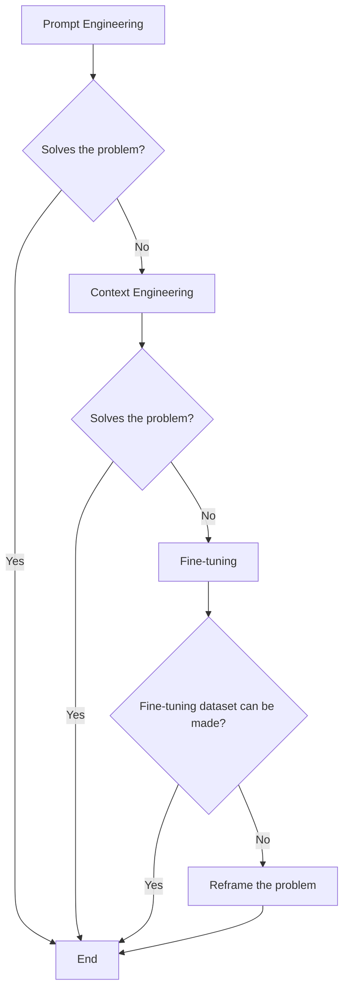
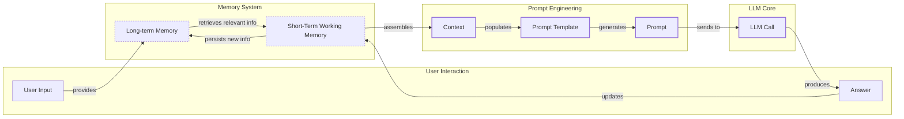
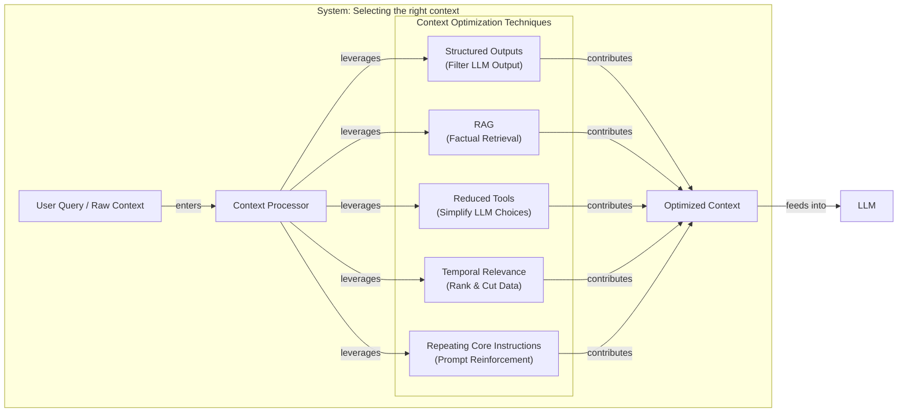
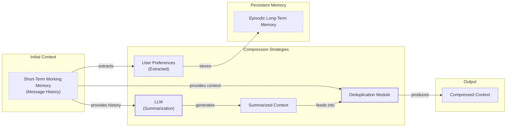
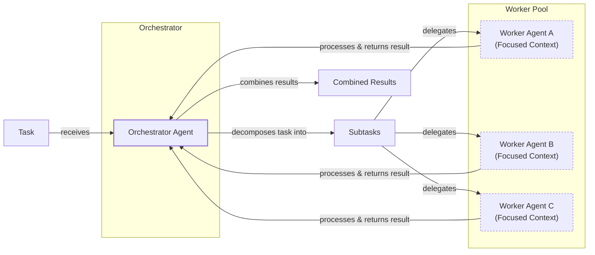

# Context Engineering: The #1 Skill for Building Production-Ready AI

AI applications have evolved rapidly. In 2022, simple chatbots operated on predefined scripts, handling basic Q&A. By 2023, RAG systems revolutionized this by connecting LLMs to external documents, enabling them to answer questions with domain-specific knowledge. 2024 introduced tool-using agents capable of performing actions in other software. Now, we are building memory-enabled agents that maintain context over long conversations, remember user preferences, and build relationships over time [[1]](https://www.securityindustry.org/2024/07/16/understanding-the-evolution-from-classic-chatbots-to-rag-chatbots-to-ai-powered-assistants/), [[2]](https://www.linkedin.com/posts/ai-apps-central_most-people-put-all-ai-systems-in-the-same-activity-7438555783077793792-UEUm).

In our last lesson, we explored how to choose between AI agents and LLM workflows when designing a system. As these applications grow more complex, prompt engineering, a practice that once served us well, is showing its limits. It optimizes single LLM calls but fails when managing systems with memory, actions, and long interaction histories. The sheer volume of information an agent might need has grown exponentially. This includes past conversations, user data, documents, and action descriptions.

Simply stuffing all this into a prompt is not a viable strategy. A new discipline, context engineering, orchestrates this entire information ecosystem to ensure the LLM gets exactly what it needs, when it needs it. This skill is becoming a core foundation for AI engineering.

## From prompt to context engineering

Prompt engineering, while effective for simple tasks, is designed for single, stateless interactions. It treats each call to an LLM as a new, isolated event. This approach breaks down in stateful applications where context must be preserved and managed across multiple turns [[3]](https://memgraph.com/blog/prompt-engineering-vs-context-engineering).

As a conversation or task progresses, the context grows. Without a strategy to manage this growth, the LLM’s performance degrades. This is context decay: the model gets confused by the noise of an ever-expanding history. It starts to lose track of the original instructions or key information.

Even with large context windows, a physical limit exists for what you can include. Also, on the operational side, every token adds to the cost and latency of an LLM call. The self-attention mechanism in most LLMs has a computational cost that grows quadratically with the amount of input, making large contexts very slow and expensive [[4]](https://www.decodingai.com/p/context-engineering-2025s-1-skill). We will explore these concepts in more detail in upcoming lessons, including memory in Lesson 9 and RAG in Lesson 10.

On a recent project, we learned this the hard way. We were working with a model that supported a million-token context window, so we thought, "What could go wrong?" We stuffed everything in: our research, guidelines, examples, and user history. The result was an LLM workflow that took 30 minutes to run and produced low-quality outputs.

This reality necessitates a shift from crafting static prompts to building dynamic systems that manage information flow. As an AI Engineer, your job is to select only the most critical pieces of context for each LLM call. This makes your applications accurate, fast, and cost-effective.

## Understanding context engineering

Context engineering is about finding the best way to arrange parts of your memory into the context that's passed to the LLM to squeeze out the best results. It's a solution to an optimization problem where you have to retrieve the right parts of both your short- and long-term memory to solve a specific task without overwhelming the LLM [[4]](https://www.decodingai.com/p/context-engineering-2025s-1-skill). For example, when you ask a cooking agent for a recipe, you do not give it the entire cookbook. Instead, you retrieve the specific recipe, along with personal context like allergies or taste preferences. This precise selection ensures the model receives only the essential information.

Andrej Karpathy explains that LLMs are like a new kind of operating system where the model is the CPU and its context window is the RAM. Just as an operating system manages what fits into your computer’s limited RAM, context engineering manages what information occupies the model’s limited context window [[5]](https://www.langchain.com/blog/context-engineering-for-agents/), [[6]](https://atlan.com/know/working-memory-llms/).

How does context engineering relate to prompt engineering? It's simple. Prompt engineering is a subset of context engineering. You still write effective prompts, but you also design a system that feeds the right context into those prompts [[4]](https://www.decodingai.com/p/context-engineering-2025s-1-skill). This means understanding not just *how* to phrase a task, but *what* information the model needs to perform optimally.

<table_caption>
Table 1: A comparison of prompt engineering and context engineering.
</table_caption>

| Dimension | Prompt Engineering | Context Engineering |
|-----------|-------------------|---------------------|
| Scope | Single interaction optimization | Entire information ecosystem |
| State Management | Stateless function | Stateful due to memory |
| Focus | How to phrase tasks | What information to provide |

Context engineering is the new fine-tuning. While fine-tuning has its place, it is expensive, time-consuming, and inflexible. Data changes constantly, making fine-tuning a last resort [[7]](https://www.linkedin.com/posts/denis-panjuta_prompt-engineering-vs-context-engineering-activity-7363945251180322816-1q_m). For most enterprise use cases, you get better results faster and more cheaply with context engineering. It allows for rapid iteration and adaptation to evolving data without altering the core model, a key advantage in dynamic environments. This approach avoids the computational resources and specialized expertise required for retraining, offering a more agile path to reliable AI applications.

When you start a new AI project, your decision-making process for guiding the LLM should look like the one presented in Image 1.


<diagram_caption>
Image 1: A flowchart illustrating the decision-making process for choosing a key strategy to guide an LLM.
</diagram_caption>

For instance, if you build an agent to process internal Slack messages, you do not need to fine-tune a model on your company’s communication style. It is more effective to use a powerful reasoning model and engineer the context to retrieve specific messages and enable actions like creating tasks or drafting emails. Throughout this course, we will show you how to solve most industry problems using only context engineering.

## What makes up the context

To master context engineering, you first need to understand what "context" actually is. It is everything the LLM sees in a single turn, dynamically assembled from various memory components before being passed to the model.

The high-level workflow, as presented in Image 2, begins when a user input triggers the system to pull relevant information from both long-term and short-term memory. This information is assembled into the final context, inserted into a prompt template, and sent to the LLM. The LLM’s answer then updates the memory, and the cycle repeats.


<diagram_caption>
Image 2: High-level workflow of context building and usage in an LLM application.
</diagram_caption>

These components are grouped into two main categories. We will explain them intuitively for now, as we have future dedicated lessons for all of them.

### Short-Term Working Memory

Short-term working memory is the state of the agent for the current task or conversation. It is volatile and changes with each interaction, helping the agent maintain a coherent dialogue and make immediate decisions. It can include some or all of these components [[8]](https://skymod.tech/why-memory-matters-in-llm-agents-short-term-vs-long-term-memory-architectures/):

*   **User input:** The user's most recent query or command, which triggers the agent's next action.
*   **Message history:** The log of the current conversation, allowing the LLM to understand the flow and refer to previous turns.
*   **Agent's internal thoughts:** The reasoning steps the agent takes to decide on its next action, often included to guide the model's logic.
*   **Action calls and outputs:** The results from any actions the agent has performed, providing fresh, real-world information from external systems.

### Long-Term Memory

Long-term memory is more persistent and stores information across sessions, allowing the AI system to remember things beyond a single conversation. We divide it into three types, drawing parallels from human memory [[9]](https://www.analyticsvidhya.com/blog/2026/01/how-does-llm-memory-work/):

*   **Procedural memory:** This is knowledge encoded directly in the code. It includes the system prompt, which sets the agent's overall behavior, definitions of available actions, and schemas for structured outputs. This is the agent's set of built-in skills and rules.
*   **Episodic memory:** This is memory of specific past experiences, like user preferences or previous conversations. It's used to help the agent personalize its responses and maintain continuity. We typically store this in vector or graph databases for efficient retrieval [[10]](https://labelstud.io/learningcenter/episodic-vs-persistent-memory-in-llms/).
*   **Semantic memory:** This is the agent’s general knowledge base. It can be internal, like company documents, or external, accessed via the internet through API calls or web scraping. This memory provides the factual information the agent needs.

If this seems like a lot, bear with us. We will cover all these concepts in-depth in future lessons, including structured outputs in Lesson 4, actions in Lesson 6, memory in Lesson 9, RAG in Lesson 10, and working with multimodal data in Lesson 11.

 https://substackcdn.com/image/fetch/w_1456,c_limit,f_auto,q_auto:good,fl_progressive:steep/https%3A%2F%2Fsubstack-post-media.s3.amazonaws.com%2Fpublic%2Fimages%2F39dce26a-e51e-4167-ac9e-ca28c45b53a6_1115x708.png 
<image_caption>Image 3: A detailed illustration of how all the context engineering components work together inside an AI agent. (Source [decodingai.com](https://www.decodingai.com/p/context-engineering-2025s-1-skill))</image_caption>

The key takeaway is that these components are not static. They are dynamically re-computed for every single interaction. For each conversation turn or new task, the short-term memory grows, or the long-term memory can change. Context engineering involves knowing how to select the right pieces from this vast memory pool to construct the most effective prompt for the task at hand.

## Production implementation challenges

Now that we understand what makes up the context, let's look at the core challenges of implementing it in production. These challenges all revolve around a single question: *"How can I keep my context as small as possible while providing enough information to the LLM?"*

Here are four common issues that come up when building AI applications:

### The context window challenge

Every AI model has a limited context window, which is the maximum amount of information (tokens) it can process simultaneously. This is similar to a computer's RAM. If you have only 32GB of RAM on your machine, that's all you can process at one time [[11]](https://www.comet.com/site/blog/context-window/). While context windows are getting larger, they are not infinite. The self-attention mechanism, central to LLMs, imposes quadratic computational and memory overhead as sequence length increases [[4]](https://www.decodingai.com/p/context-engineering-2025s-1-skill). This means every token adds to cost and latency, creating a hard limit on what the agent can "see."

### Information overload

Just because you can fit a lot of information into the context does not mean you should. Too much context reduces the performance of the LLM by confusing it. This is known as the "lost-in-the-middle" or "needle in the haystack" problem, where LLMs are known for remembering information best at the beginning and end of the context window [[12]](https://www.linkedin.com/pulse/lost-middle-lesson-failing-ai-agents-backwards-anthony-dejohn-01k2e). Information in the middle is often overlooked. Performance can drop by over 30% for mid-position info, and this degradation can start long before the physical context limit is reached [[13]](https://dev.to/thousand_miles_ai/the-lost-in-the-middle-problem-why-llms-ignore-the-middle-of-your-context-window-3al2), [[14]](https://atlan.com/know/llm-context-window-limitations/).

### Context drift

This occurs when conflicting views of truth accumulate in the memory over time [[15]](https://galileo.ai/blog/production-llm-monitoring-strategies). For example, the memory might contain two conflicting statements: "The user's budget is $500" and later "The user's budget is $1,000." This is not Schrodinger's Cat quantum physics experiment; it is a data conflict that confuses the LLM. Without a mechanism to resolve or prune outdated facts, the agent's knowledge base becomes unreliable, leading to inconsistent and untrustworthy responses [[16]](https://thenewstack.io/context-rot-enterprise-ai-llms/).

### Tool confusion

The final challenge is tool confusion, which arises in two main ways. First, adding too many actions to an agent can confuse the LLM about the best one for the job. The Gorilla benchmark shows that nearly all models perform worse when given more than one tool [[4]](https://www.decodingai.com/p/context-engineering-2025s-1-skill). Second, confusion can occur when tool descriptions are poorly written or overlap. If the distinctions between actions are unclear, the model may pick the wrong tool or get paralyzed by choice, leading to failed tasks.

## Key strategies for context optimization

Initially, most AI applications were chatbots over single knowledge bases. Today, modern AI solutions must manage multiple knowledge bases, tools, and complex conversational histories. Context engineering is about managing this complexity while meeting performance, latency, and cost requirements.

Here are four popular context engineering strategies used across the industry:

### Selecting the right context

Retrieving the right information from memory is a critical first step. A common mistake is to provide everything at once, assuming that models with large context windows can handle it. As we've discussed, the "lost-in-the-middle" problem often leads to poor performance, increased latency, and higher costs [[14]](https://atlan.com/know/llm-context-window-limitations/).

To solve this, you can use several techniques, as illustrated in Image 4.


<diagram_caption>
Image 4: Architecture diagram showing context optimization techniques working together for selecting the right context.
</diagram_caption>

*   **Use structured outputs:** Define clear schemas for what the LLM should return. This allows you to pass only the necessary, structured information to downstream steps. We will cover this in detail in Lesson 4.
*   **Use RAG:** Instead of providing entire documents, use RAG to fetch only the specific chunks of text needed to answer a user's question. This is a core topic we will explore in Lesson 10.
*   **Reduce the number of available actions:** Rather than giving an agent access to every available action, use various strategies to delegate action subsets to specialized components. Studies have shown that retrieving relevant tools with RAG can improve selection accuracy threefold [[4]](https://www.decodingai.com/p/context-engineering-2025s-1-skill).
*   **Rank time-sensitive data:** For time-sensitive information, rank it by date and filter out anything no longer relevant.
*   **Repeat core instructions:** For the most important instructions, repeat them at both the start and the end of the prompt. This uses the model's "U-shaped" attention curve, ensuring core instructions are not lost in the middle [[13]](https://dev.to/thousand_miles_ai/the-lost-in-the-middle-problem-why-llms-ignore-the-middle-of-your-context-window-3al2).

### Context compression

As message history grows in short-term working memory, you must manage past interactions to keep your context window in check. You cannot simply drop past conversation turns, as the LLM still needs to remember what happened. Instead, you need ways to compress key facts from the past. Image 5 shows a few common strategies.


<diagram_caption>
Image 5: A flowchart illustrating context compression strategies, including summarization, preference extraction, and deduplication.
</diagram_caption>

You can do this through:

1.  **Creating summaries of past interactions:** Use an LLM to replace a long, detailed history with a concise overview. This is a common strategy in agents like OpenHands [[17]](https://blog.jetbrains.com/research/2025/12/efficient-context-management/).
2.  **Moving user preferences to long-term memory:** Transfer user preferences from working memory to long-term episodic memory. This keeps the working context clean while ensuring preferences are remembered for future sessions.
3.  **Deduplication:** Remove redundant information from the context to avoid repetition, using techniques like semantic deduplication to cluster and select representative content [[18]](https://oneuptime.com/blog/post/2026-01-30-context-compression/view).

### Isolating Context

Another powerful strategy is to isolate context by splitting information across multiple agents or LLM workflows. This technique is similar to tool isolation but applies to the entire context. The key idea is that instead of one agent with a massive, cluttered context window, you can have a team of agents, each with a smaller, focused context [[19]](https://www.vellum.ai/blog/multi-agent-systems-building-with-context-engineering).

We often implement this using an orchestrator-worker pattern, as shown in Image 6, where a central orchestrator agent breaks down a problem and assigns sub-tasks to specialized worker agents [[20]](https://gurusup.com/blog/multi-agent-orchestration-guide). Each worker operates in its own isolated context, improving focus and allowing for parallel processing. We will cover this pattern in more detail in Lesson 5.


<diagram_caption>
Image 6: An architecture diagram illustrating the orchestrator-worker pattern for context isolation.
</diagram_caption>

### Format Optimization

Finally, the way you format the context matters. Models are sensitive to structure, and using clear delimiters can improve performance. Common strategies are to use XML tags to wrap different pieces of context (e.g., `<user_query>`, `<documents>`). This helps the model distinguish between different types of information [[21]](https://www.anthropic.com/engineering/effective-context-engineering-for-ai-agents). When providing structured data as input, YAML is often more token-efficient than JSON, which helps save space in your context window [[4]](https://www.decodingai.com/p/context-engineering-2025s-1-skill).

You always have to understand what is passed to the LLM. Seeing exactly what occupies your context window at every step is key to mastering context engineering. Usually this is done by properly monitoring your traces, tracking what happens at each step, and understanding what the inputs and outputs are. As this is a significant step to go from PoC to production, we will have dedicated lessons on this.

## Here is an example

Let's connect the theory and strategies discussed earlier with concrete examples. Several common real-world scenarios require maintaining context between multiple turns or sessions:

*   **Healthcare:** AI systems that access patient data, history, current symptoms, and medical literature to enable more informed and personalized diagnoses [[4]](https://www.decodingai.com/p/context-engineering-2025s-1-skill).
*   **Financial Services:** AI systems that integrate with enterprise tools like Customer Relationship Management (CRM) systems, emails, and calendars, combining real-time market data and client portfolio information to generate tailored financial advice.
*   **Project Management:** AI systems that access enterprise infrastructure like CRMs, Slack, and task managers to automatically understand project requirements, then add and update project tasks.
*   **Content Creator Assistant:** An AI agent that has access to your research, past content, and personality traits to understand what and how to create a given piece of content.

Let's walk through a specific query to see context engineering in action with the healthcare assistant scenario. A user asks: `I have a headache. What can I do to stop it? I would prefer not to take any medicine.`

Before the LLM even sees this query, a context engineering system gets to work:

1.  It retrieves the user's patient history, known allergies, and lifestyle habits from an **episodic memory** store, often a vector or graph database.
2.  It queries a **semantic memory** of up-to-date medical literature for non-medicinal headache remedies [[22]](https://www.mdpi.com/2079-9292/13/15/2961).
3.  It assembles this information, along with the user's query and the conversation history, into a structured prompt.
4.  We send the prompt to the LLM, which generates a personalized, safe, and relevant recommendation.
5.  We log the interaction and save any new preferences back to the user's episodic memory.

Here’s a simplified Python example showing how these components might be assembled into a complete system prompt. Notice the clear structure using XML tags to delineate different context types and the specific ordering to guide the model's attention.

```python
SYSTEM_PROMPT = """
You are a helpful and cautious AI healthcare assistant. Your goal is to provide safe, non-medicinal advice. Do not provide medical diagnoses.

<INSTRUCTIONS>
1. Analyze the user's query and the provided context.
2. Use the patient history to understand their health profile and preferences.
3. Use the retrieved medical knowledge to form your recommendation.
4. If you lack sufficient information, ask clarifying questions.
5. Always prioritize safety and advise consulting a doctor for serious issues.
</INSTRUCTIONS>

<PATIENT_HISTORY>
{retrieved_patient_history}
</PATIENT_HISTORY>

<MEDICAL_KNOWLEDGE>
{retrieved_medical_articles}
</MEDICAL_KNOWLEDGE>

<CONVERSATION_HISTORY>
{formatted_chat_history}
</CONVERSATION_HISTORY>

<USER_QUERY>
{user_query}
</USER_QUERY>

Based on all the information above, provide a helpful response.
"""
```

The key relies on the system around it that brings in the proper context to populate the system prompt. To build such a system, you would use a combination of tools. An LLM like **Gemini** provides the reasoning engine. A framework like **LangGraph** orchestrates the stateful workflow, managing the flow of information between steps [[23]](https://www.scalablepath.com/machine-learning/langgraph). Databases such as **PostgreSQL**, **Qdrant**, or **Neo4j** serve as long-term memory stores, each suited for different data structures [[24]](https://blog.stackademic.com/context-engineering-in-llms-and-ai-agents-eb861f0d3e9b). Finally, observability platforms like **Opik** or **LangSmith** are essential for tracing, debugging, and evaluating these complex interactions.

<aside>
💡
We recommend keeping your database stack simple. You can get very far with just PostgreSQL or MongoDB for many AI applications.
</aside>

## Connecting context engineering to AI engineering

Mastering context engineering is less about learning a specific algorithm and more about building intuition. It’s the art of knowing how to structure prompts, what information to include, and how to order it for maximum impact. This discipline helps you determine the minimal yet essential information an LLM needs to perform at its best.

This skill doesn't exist in a vacuum. It’s a multidisciplinary practice that sits at the intersection of several key engineering fields:

*   **AI Engineering:** Understanding LLMs, RAG, and AI agents is the foundation. This involves implementing practical solutions like LLM workflows and evaluation pipelines.
*   **Software Engineering:** You need to build scalable and maintainable systems to aggregate context and wrap agents in robust APIs. This ensures your AI product is not just a prototype but a production-ready application.
*   **Data Engineering:** Constructing reliable data pipelines for RAG and other memory systems is critical. This involves ensuring data quality, freshness, and efficient retrieval.
*   **MLOps:** Deploying agents on the right infrastructure and automating processes with Continuous Integration/Continuous Deployment (CI/CD) makes them reproducible, observable, and scalable.

Our goal with this course is to teach you how to combine these skills to build production-ready AI products. In the world of AI, we should all think in systems rather than isolated components, having a mindset shift from developers to architects.

In the next lesson, we will explore structured outputs, a key technique for selecting and formatting context. Later, we will dive deeper into other core concepts like actions, memory, and RAG, building on the foundation we have established here.

## References

- [1] [Understanding the Evolution: From Classic Chatbots to AI-Powered Assistants](https://www.securityindustry.org/2024/07/16/understanding-the-evolution-from-classic-chatbots-to-rag-chatbots-to-ai-powered-assistants/)
- [2] [Evolution of AI Systems](https://www.linkedin.com/posts/ai-apps-central_most-people-put-all-ai-systems-in-the-same-activity-7438555783077793792-UEUm)
- [3] [Prompt Engineering vs. Context Engineering](https://memgraph.com/blog/prompt-engineering-vs-context-engineering)
- [4] [Context Engineering: 2025’s #1 Skill in AI](https://www.decodingai.com/p/context-engineering-2025s-1-skill)
- [5] [Context Engineering for Agents](https://www.langchain.com/blog/context-engineering-for-agents)
- [6] [Working Memory in LLMs](https://atlan.com/know/working-memory-llms/)
- [7] [Prompt Engineering vs. Context Engineering](https://www.linkedin.com/posts/denis-panjuta_prompt-engineering-vs-context-engineering-activity-7363945251180322816-1q_m)
- [8] [Why Memory Matters in LLM Agents](https://skymod.tech/why-memory-matters-in-llm-agents-short-term-vs-long-term-memory-architectures/)
- [9] [How Does LLM Memory Work?](https://www.analyticsvidhya.com/blog/2026/01/how-does-llm-memory-work/)
- [10] [Episodic vs. Persistent Memory in LLMs](https://labelstud.io/learningcenter/episodic-vs-persistent-memory-in-llms/)
- [11] [Context Window: What It Is and Why It Matters for AI Agents](https://www.comet.com/site/blog/context-window/)
- [12] [Lost in the Middle: A Lesson from Failing AI Agents](https://www.linkedin.com/pulse/lost-middle-lesson-failing-ai-agents-backwards-anthony-dejohn-01k2e)
- [13] [The "Lost in the Middle" Problem](https://dev.to/thousand_miles_ai/the-lost-in-the-middle-problem-why-llms-ignore-the-middle-of-your-context-window-3al2)
- [14] [LLM Context Window Limitations](https://atlan.com/know/llm-context-window-limitations/)
- [15] [Production LLM Monitoring Strategies](https://galileo.ai/blog/production-llm-monitoring-strategies)
- [16] [Context Rot in Enterprise AI LLMs](https://thenewstack.io/context-rot-enterprise-ai-llms/)
- [17] [Efficient Context Management for LLM-Powered Agents](https://blog.jetbrains.com/research/2025/12/efficient-context-management/)
- [18] [How to Build Context Compression](https://oneuptime.com/blog/post/2026-01-30-context-compression/view)
- [19] [Multi-Agent Systems: Building with Context Engineering](https://www.vellum.ai/blog/multi-agent-systems-building-with-context-engineering)
- [20] [Multi-Agent Orchestration Guide](https://gurusup.com/blog/multi-agent-orchestration-guide)
- [21] [Effective Context Engineering for AI Agents](https://www.anthropic.com/engineering/effective-context-engineering-for-ai-agents)
- [22] [Prompt Engineering in Healthcare](https://www.mdpi.com/2079-9292/13/15/2961)
- [23] [LangGraph](https://www.scalablepath.com/machine-learning/langgraph)
- [24] [Context Engineering in LLMs and AI Agents](https://blog.stackademic.com/context-engineering-in-llms-and-ai-agents-eb861f0d3e9b)