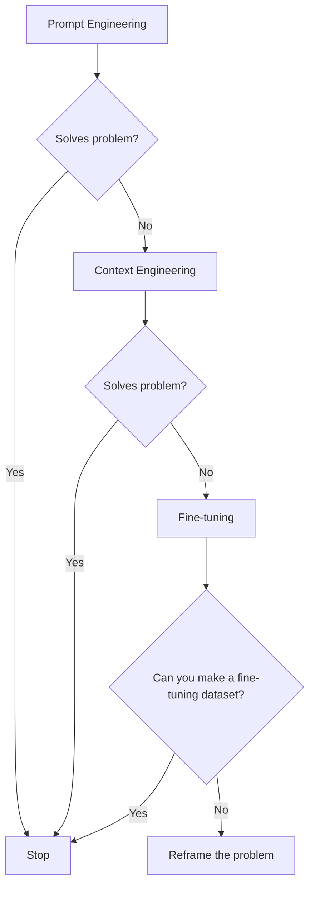
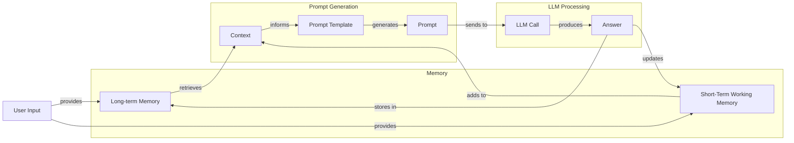
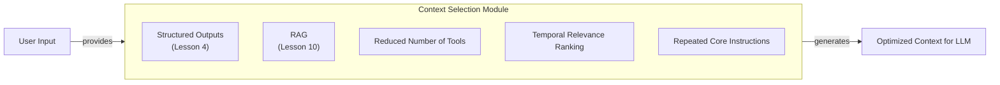
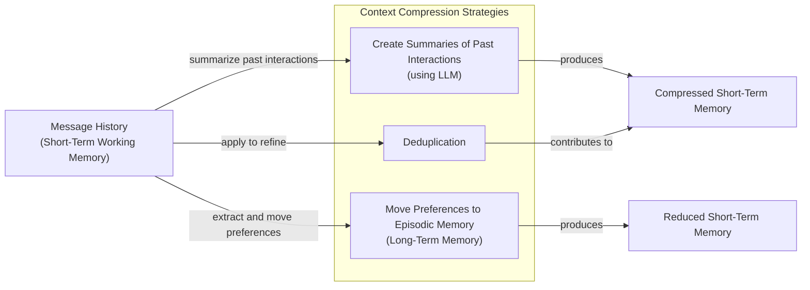
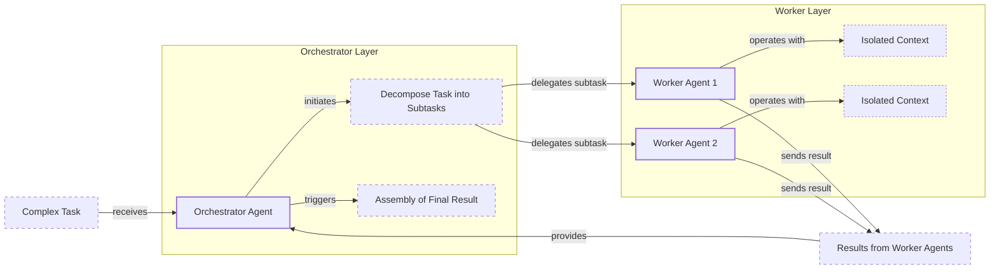

# Lesson 3: Context Engineering

AI applications have evolved rapidly. In 2022, we had simple chatbots for question-answering. By 2023, Retrieval-Augmented Generation (RAG) systems connected LLMs to domain-specific knowledge. 2024 brought us tool-using agents that could perform actions. Now, we are building memory-enabled agents that remember past interactions and build relationships over time [[1]](https://www.securityindustry.org/2024/07/16/understanding-the-evolution-from-classic-chatbots-to-rag-chatbots-to-ai-powered-assistants/), [[2]](https://www.linkedin.com/posts/ai-apps-central_most-people-put-all-ai-systems-in-the-same-activity-7438555783077793792-UEUm).

In our last lesson, we explored how to choose between AI agents and LLM workflows when designing a system. As these applications grow more complex, prompt engineering, a practice that once served us well, is showing its limits. It optimizes single LLM calls but fails when managing systems with memory, actions, and long interaction histories [[3]](https://www.linkedin.com/posts/denis-panjuta_prompt-engineering-vs-context-engineering-activity-7363945251180322816-1q_m). The sheer volume of information an agent might need has grown exponentially. This includes past conversations, user data, documents, and action descriptions. Simply stuffing all this into a prompt is not a viable strategy.

The discipline of context engineering was developed to address this. It orchestrates the entire information ecosystem to ensure the LLM gets exactly what it needs, when it needs it. This skill is becoming a core foundation for AI engineering, and in this lesson, we will explore what it is, why it matters, and how to apply its core principles [[4]](https://packmind.com/context-engineering-ai-coding/what-is-contextops/).

## From Prompt to Context Engineering

Prompt engineering, while effective for simple tasks, is designed for single, stateless interactions. It treats each call to an LLM as a new, isolated event. This approach breaks down in stateful applications where context must be preserved and managed across multiple turns [[5]](https://memgraph.com/blog/prompt-engineering-vs-context-engineering).

As a conversation or task progresses, the context grows. Without a strategy to manage this growth, the LLM’s performance degrades. The model gets confused by the noise of an ever-expanding history and starts to lose track of the original instructions or key information. This performance degradation is a well-documented issue, especially as input length increases [[6]](https://www.trychroma.com/research/context-rot), [[7]](https://thenewstack.io/context-rot-enterprise-ai-llms/).

Even with large context windows, a physical limit exists for what you can include. Also, on the operational side, every token adds to the cost and latency of an LLM call [[8]](https://storage.ghost.io/c/3f/df/3fdf6ed2-17ac-4b12-a693-8078bd13e748/content/images/2026/02/image-122.png), [[9]](https://redis.io/blog/context-window-overflow/). Simply putting everything into the context creates a slow, expensive, and underperforming system. We will explore these concepts in more detail in upcoming lessons, including memory in Lesson 9 and RAG in Lesson 10.

On a recent project, we learned this the hard way. We were working with a model that supported a million-token context window, so we thought, "*What could go wrong*?" We stuffed everything in: our research, guidelines, examples, and user history. The result was an LLM workflow that took 30 minutes to run and produced low-quality outputs.

For this reason, context engineering is essential. It shifts the focus from crafting static prompts to building dynamic systems that manage information flow [[10]](https://blog.langchain.com/the-rise-of-context-engineering/). As an AI engineer, your job is to select only the most critical pieces of context for each LLM call. This makes your applications accurate, fast, and cost-effective.

## Understanding Context Engineering

Context engineering is about finding the best way to arrange parts of your application's memory into the context that is passed to an LLM to get the best results. It is a solution to an optimization problem where you retrieve the right parts from your short-term and long-term memory to solve a specific task without overwhelming the model [[11]](https://arxiv.org/pdf/2507.13334). For example, when you ask a cooking agent for a recipe, you do not give it the entire cookbook. Instead, you retrieve the specific recipe, along with personal context like allergies or taste preferences. This precise selection ensures the model receives only the essential information.

Andrej Karpathy explains that LLMs are like a new kind of operating system where the model is the CPU and its context window is the RAM [[12]](https://www.langchain.com/blog/context-engineering-for-agents/). Just as an operating system manages what fits into your computer’s limited RAM, context engineering manages what information occupies the model’s limited context window [[13]](https://x.com/karpathy/status/1937902205765607626). This involves a systematic process of selecting, structuring, and prioritizing information to maximize output quality while minimizing cost and latency [[14]](https://datahub.com/blog/context-window-optimization/).

How does context engineering relate to prompt engineering? It's simple. Prompt engineering is a subset of context engineering [[10]](https://blog.langchain.com/the-rise-of-context-engineering/). You still write effective prompts, but you also design a system that feeds the right context into those prompts [[15]](https://nlp.elvissaravia.com/p/context-engineering-guide). This means understanding not just *how* to phrase a task, but *what* information the model needs to perform optimally.

| Dimension | Prompt Engineering | Context Engineering |
| :--- | :--- | :--- |
| **Scope** | Single interaction optimization | Entire information ecosystem |
| **State Management** | Stateless function | Stateful due to memory |
| **Focus** | How to phrase tasks | What information to provide |
Table 1: A comparison of prompt engineering and context engineering.

Context engineering is the new fine-tuning. While fine-tuning has its place, it is expensive, time-consuming, and inflexible. Data changes constantly, making fine-tuning a last resort. For most enterprise use cases, you get better results faster and more cheaply with context engineering [[3]](https://www.linkedin.com/posts/denis-panjuta_prompt-engineering-vs-context-engineering-activity-7363945251180322816-1q_m). It allows for rapid iteration and adaptation to evolving data without altering the core model, a key advantage in dynamic environments. This approach avoids the computational resources and specialized expertise required for retraining, offering a more agile path to reliable AI applications.

When you start a new AI project, your decision-making process for guiding the LLM should look like the one presented in Image 1.


Image 1: A flowchart illustrating the decision-making process for choosing between Prompt Engineering, Context Engineering, and Fine-tuning when solving a problem in AI application development.

For instance, if you build an agent to process internal Slack messages, you do not need to fine-tune a model on your company’s communication style. It is more effective to use a powerful reasoning model and engineer the context to retrieve specific messages and enable actions like creating tasks or drafting emails [[16]](https://www.mezmo.com/learn-observability/context-engineering-for-observability-how-to-deliver-the-right-data-to-llms). Throughout this course, we will show you how to solve most industry problems using only context engineering.

## What Makes Up the Context

To master context engineering, you first need to understand what "context" actually is. It is everything the LLM sees in a single turn, dynamically assembled from various memory components before being passed to the model. The high-level workflow, as presented in Image 2, begins when a user input triggers the system to pull relevant information from both long-term and short-term memory. This information is assembled into the final context, inserted into a prompt template, and sent to the LLM. The LLM’s answer then updates the memory, and the cycle repeats.


Image 2: High-level workflow of user input processing through memory and an LLM.

These components are grouped into two main categories. We will explain them intuitively for now, as we have future dedicated lessons for all of them.

### Short-Term Working Memory

Short-term working memory is the state of the agent for the current task or conversation. It is volatile and changes with each interaction, helping the agent maintain a coherent dialogue and make immediate decisions. It can include some or all of these components [[17]](https://storage.ghost.io/c/3f/df/3fdf6ed2-17ac-4b12-a693-8078bd13e748/content/images/2026/02/image-109.png), [[18]](https://atlan.com/know/working-memory-llms/):

*   **User input:** The most recent query or command from the user.
*   **Message history:** The log of the current conversation, allowing the LLM to understand the flow and previous turns.
*   **Agent's internal thoughts:** The reasoning steps the agent takes to decide on its next action.
*   **Action calls and outputs:** The results from any actions the agent has performed, providing information from external systems.

### Long-Term Memory

Long-term memory is more persistent and stores information across sessions, allowing the AI system to remember things beyond a single conversation [[19]](https://storage.ghost.io/c/3f/df/3fdf6ed2-17ac-4b12-a693-8078bd13e748/content/images/2026/02/image-110.png). We divide it into three types, drawing parallels from human memory [[20]](https://www.datacamp.com/blog/how-does-llm-memory-work), [[21]](https://www.analyticsvidhya.com/blog/2026/01/how-does-llm-memory-work/). An AI system can include some or all of them:

*   **Procedural memory:** This memory represents the agent's built-in skills. It includes the system prompt, which sets the agent's overall behavior. It also includes the definitions of available actions, which tell the agent what it can do, and schemas for structured outputs, which guide the format of its responses.
*   **Episodic memory:** This is memory of specific past experiences, like user preferences or previous interactions. It's used to help the agent personalize its responses based on individual users. We typically store this in vector or graph databases for efficient retrieval [[22]](https://labelstud.io/learningcenter/episodic-vs-persistent-memory-in-llms/).
*   **Semantic memory:** This is the agent’s general knowledge base. It can be internal, like company documents stored in a data lake, or external, accessed via the internet through API calls or web scraping. This memory provides the factual information the agent needs to answer questions.

If this seems like a lot, bear with us. We will cover all these concepts in-depth in future lessons, including structured outputs (Lesson 4), actions (Lesson 6), memory (Lesson 9), and RAG (Lesson 10).
Image 3: Context engineering encompasses a variety of techniques and information sources (Source [humanlayer/12-factor-agents](https://github.com/humanlayer/12-factor-agents/blob/main/content/factor-03-own-your-context-window.md))

The key takeaway is that these components are not static. They are dynamically re-computed for every single interaction [[23]](https://i.imgur.com/02330aN.png). For each conversation turn or new task, the short-term memory grows, or the long-term memory can change. Context engineering involves knowing how to select the right pieces from this vast memory pool to construct the most effective prompt for the task at hand [[24]](https://www.llamaindex.ai/blog/context-engineering-what-it-is-and-techniques-to-consider).

## Production Implementation Challenges

Now that we understand what makes up the context, let's look at the core challenges of implementing it in production. These challenges all revolve around a single question: *"How can I keep my context as small as possible while providing enough information to the LLM?"*

Here are four common issues that come up when building AI applications:

1.  **The context window challenge:** Every AI model has a limited context window, the maximum amount of information (tokens) it can process at once. This is analogous to your computer's RAM. While context windows are getting larger, they are not infinite, and treating them as such leads to other problems [[25]](https://www.comet.com/site/blog/context-window/).
2.  **Information overload:** Just because you can fit a lot of information into the context does not mean you should. Too much context reduces the performance of the LLM by confusing it. Performance can degrade as input length grows, particularly for information in the middle of the context [[26]](https://atlan.com/know/llm-context-window-limitations/). This "lost-in-the-middle" or "needle in the haystack" problem is a key symptom, where models remember information best at the beginning and end of the context window [[27]](https://www.linkedin.com/pulse/lost-middle-lesson-failing-ai-agents-backwards-anthony-dejohn-01k2e), [[28]](https://i.imgur.com/7i2r0v7.png).
3.  **Context drift:** This occurs when conflicting views of truth accumulate in the memory over time [[29]](https://galileo.ai/blog/production-llm-monitoring-strategies). For example, the memory might contain two conflicting statements: "*My cat is white*" and "*My cat is black*." This is not a quantum physics experiment; it is a data conflict that confuses the LLM. Without a mechanism to resolve these conflicts, the model's responses become unreliable [[30]](https://www.coforge.com/what-we-know/blog/navigating-the-shifting-sands-understanding-and-mitigating-data-drift-in-llms).
4.  **Tool confusion:** The final challenge is tool confusion, which arises in two main ways. First, adding too many actions to an agent can confuse the LLM about the best one for the job, a problem that often appears with over 100 actions [[31]](https://www.instinctools.com/blog/context-engineering/). Second, confusion can occur when tool descriptions are poorly written or overlap. If the distinctions between actions are unclear, even a human would struggle to choose the right one [[32]](https://www.datacamp.com/blog/context-engineering).

## Key Strategies for Context Optimization

Initially, most AI applications were chatbots over single knowledge bases. Today, modern AI solutions must manage multiple knowledge bases, tools, and complex conversational histories. Context engineering is about managing this complexity while meeting performance, latency, and cost requirements [[24]](https://www.llamaindex.ai/blog/context-engineering-what-it-is-and-techniques-to-consider).

Here are four popular context engineering strategies used across the industry:

### Selecting the Right Context

Retrieving the right information from memory is a critical first step. A common mistake is to provide everything at once, assuming that models with large context windows can handle it. As we have discussed, the "lost-in-the-middle" problem often leads to poor performance, increased latency, and higher costs [[33]](https://atlan.com/know/llm-context-window-limitations/).

To solve this, consider these approaches:

*   **Use structured outputs:** Define clear schemas for what the LLM should return. This allows you to pass only the necessary, structured information to downstream steps. We will cover this in detail in Lesson 4.
*   **Use RAG:** Instead of providing entire documents, use RAG to fetch only the specific chunks of text needed to answer a user's question. This is a core topic we will explore in Lesson 10.
*   **Reduce the number of available actions:** Rather than giving an agent access to every available action, use various strategies to delegate action subsets to specialized components. Studies show that limiting the selection to under 30 tools can triple the agent's selection accuracy [[32]](https://www.datacamp.com/blog/context-engineering). Still, the ideal number of tools an agent can use can be highly dependent on what tools you provide, what LLM you use, and how well the actions are defined.
*   **Rank time-sensitive data:** For time-sensitive information, rank it by date and filter out anything no longer relevant [[34]](https://www.dailydoseofds.com/llmops-crash-course-part-8/).
*   **Repeat core instructions:** For the most important instructions, repeat them at both the start and the end of the prompt. This uses the model's tendency to pay more attention to the context edges, ensuring core instructions are not lost [[35]](https://dev.to/thousand_miles_ai/the-lost-in-the-middle-problem-why-llms-ignore-the-middle-of-your-context-window-3al2).


Image 4: A system diagram illustrating the Context Selection Module and its incorporated context optimization techniques.

### Context Compression

As message history grows in short-term working memory, you must manage past interactions to keep your context window in check. You cannot simply drop past conversation turns, as the LLM still needs to remember what happened. Instead, you need ways to compress key facts from the past [[36]](https://oneuptime.com/blog/post/2026-01-30-context-compression/view).

You can do this through:

1.  **Creating summaries of past interactions:** Use an LLM to replace a long, detailed history with a concise overview [[37]](https://blog.jetbrains.com/research/2025/12/efficient-context-management/).
2.  **Moving user preferences to long-term memory:** Transfer user preferences from working memory to long-term episodic memory. This keeps the working context clean while ensuring preferences are remembered for future sessions [[34]](https://www.dailydoseofds.com/llmops-crash-course-part-8/).
3.  **Deduplication:** Remove redundant information from the context to avoid repetition [[36]](https://oneuptime.com/blog/post/2026-01-30-context-compression/view).


Image 5: A process flow diagram illustrating context compression strategies for managing short-term working memory, including summarization, moving preferences, and deduplication.

### Isolating Context

Another powerful strategy is to isolate context by splitting information across multiple agents or LLM workflows. The key idea is that instead of one agent with a massive, cluttered context window, you can have a team of agents, each with a smaller, focused context [[12]](https://www.langchain.com/blog/context-engineering-for-agents/).

We often implement this using an orchestrator-worker pattern, where a central orchestrator agent breaks down a problem and assigns sub-tasks to specialized worker agents [[38]](https://beam.ai/agentic-insights/multi-agent-orchestration-patterns-production). Each worker operates in its own isolated context, improving focus and allowing for parallel processing. We will cover this pattern in more detail in Lesson 5.


Image 6: An architecture diagram illustrating the orchestrator-worker pattern for context isolation.

### Format Optimizations

Finally, the way you format the context matters. Models are sensitive to structure, and using clear delimiters can improve performance. Common strategies are to:

*   **Use XML tags:** Wrap different pieces of context in XML-like tags (e.g., `<user_query>`, `<documents>`). This helps the model distinguish between different types of information, while making it easier for the engineer to reference context elements within the system prompt [[39]](https://www.anthropic.com/engineering/effective-context-engineering-for-ai-agents).
*   **Prefer YAML over JSON:** When providing structured data as input, YAML is often more token-efficient than JSON, which helps save space in your context window [[40]](https://www.praetorian.com/blog/deterministic-ai-orchestration-a-platform-architecture-for-autonomous-development/).

To conclude, you always have to understand what is passed to the LLM. Seeing exactly what occupies your context window at every step is key to mastering context engineering. Usually, this is done by properly monitoring your traces, tracking what happens at each step, and understanding what the inputs and outputs are [[41]](https://www.getmaxim.ai/articles/context-window-management-strategies-for-long-context-ai-agents-and-chatbots/). As this is a significant step to go from PoC to production, we will have dedicated lessons on this.

## Here Is an Example

Let's connect the theory and strategies discussed earlier with a concrete example. Enterprise AI queries are especially demanding, often consuming 50,000 to 100,000 tokens for schema definitions, data lineage, and governance policies before the model even starts reasoning on the user's question [[26]](https://atlan.com/know/llm-context-window-limitations/). Consider these real-world scenarios where this level of context is critical:

*   **Healthcare:** An AI assistant accesses a patient's medical history, current symptoms, and the latest medical literature to provide personalized diagnostic support [[42]](https://www.decodingai.com/p/context-engineering-2025s-1-skill). This requires careful assembly of sensitive data to ensure safe and relevant advice.
*   **Financial Services:** AI systems integrate with CRMs, emails, and calendars, combining real-time market data and client information to generate tailored financial advice [[42]](https://www.decodingai.com/p/context-engineering-2025s-1-skill). The context must be fresh and accurate to be trustworthy.
*   **Project Management:** AI systems access enterprise infrastructure like CRMs and task managers to automatically understand project requirements, then add and update project tasks. Here, context engineering ensures the agent has the correct project state.
*   **Content Creator Assistant:** An AI agent uses your research, past content, and personality traits to understand what and how to create a given piece of content. The context defines the style, tone, and factual basis for the generated work.

Let's walk through a specific query to see context engineering in action with the healthcare assistant scenario. A user asks: `I have a headache. What can I do to stop it? I would prefer not to take any medicine.`

Before the AI attempts to answer, a context engineering system performs several steps [[42]](https://www.decodingai.com/p/context-engineering-2025s-1-skill):

1.  It retrieves the user's patient history, known allergies, and lifestyle habits from episodic memory. This step personalizes the interaction.
2.  It queries a medical database for non-pharmacological headache remedies from semantic memory. This grounds the response in factual, up-to-date knowledge.
3.  It assembles the key units of information from both memory types into the final context. This is the core orchestration step.
4.  It formats this information into a structured prompt and calls the LLM.
5.  Finally, it presents a personalized, context-aware answer to the user.

Here is a simplified Python example showing how you might structure the context and prompt for the LLM, using XML tags to format the different context elements and YAML to format input data collections.

1.  First, we define the user's query.
    ```python
    import yaml
    
    user_query = "I have a headache. What can I do to stop it? I would prefer not to take any medicine."
    ```
2.  Next, we define the patient's history, which would typically be retrieved from episodic memory.
    ```python
    patient_history = {
        "patient": {
            "name": "John Doe",
            "age": 45,
            "gender": "M",
            "conditions": ["mild_hypertension"],
            "allergies": [],
            "preferences": {
                "medication_avoidance": True,
                "preferred_treatments": "natural_remedies"
            },
            "habits": {
                "stress_level": "high",
                "work_related": True,
                "caffeine_intake": "3-4_cups_daily"
            }
        }
    }
    ```
3.  Then, we include relevant medical literature, which would be retrieved from semantic memory.
    ```python
    medical_literature = {
        "articles": [
            {
                "id": 1,
                "topic": "dehydration_headaches",
                "finding": "Dehydration is a common cause of tension headaches",
                "treatment": "Rehydration can alleviate symptoms within 30 minutes to three hours"
            },
            {
                "id": 2,
                "topic": "cold_compress",
                "finding": "Applying a cold compress to the forehead and temples can constrict blood vessels",
                "treatment": "Reduces inflammation, helping to relieve migraine pain"
            },
            {
                "id": 3,
                "topic": "caffeine_withdrawal",
                "finding": "Caffeine withdrawal can trigger headaches",
                "treatment": "For regular caffeine consumers, a small amount may alleviate withdrawal headaches"
            },
            {
                "id": 4,
                "topic": "stress_relief",
                "finding": "Stress-relief techniques are effective for tension headaches",
                "treatment": "Deep breathing, meditation, or short walks can help"
            }
        ]
    }
    ```
4.  Finally, we assemble the complete prompt. Notice how we format the patient history and medical literature as YAML instead of passing them directly as plain Python dictionaries, which are equivalent to JSON.
    ```python
    prompt = f"""
    <system_prompt>
    You are a helpful AI medical assistant. Your role is to provide safe, helpful, and personalized health advice based on the provided context. Do not give advice outside of the provided context. Prioritize non-medicinal options as per user preference.
    </system_prompt>
    
    <patient_history>
    {yaml.dump(patient_history)}
    </patient_history>
    
    <medical_literature>
    {yaml.dump(medical_literature)}
    </medical_literature>
    
    <user_query>
    {user_query}
    </user_query>
    
    <instructions>
    Based on all the information above, provide a step-by-step plan for the user to relieve their headache. Structure your response clearly.
    </instructions>
    """
    ```
5.  Ultimately, let's merge everything together and take a look at the final input sent to the LLM.
    ```xml
    <system_prompt>
    You are a helpful AI medical assistant. Your role is to provide safe, helpful, and personalized health advice based on the provided context. Do not give advice outside of the provided context. Prioritize non-medicinal options as per user preference.
    </system_prompt>
    
    <patient_history>
    patient:
      name: John Doe
      age: 45
      gender: M
      conditions:
        - mild_hypertension
      allergies: []
      preferences:
        medication_avoidance: true
        preferred_treatments: natural_remedies
      habits:
        stress_level: high
        work_related: true
        caffeine_intake: 3-4_cups_daily
    </patient_history>
    
    <medical_literature>
    articles:
      - id: 1
        topic: dehydration_headaches
        finding: "Dehydration is a common cause of tension headaches"
        treatment: "Rehydration can alleviate symptoms within 30 minutes to three hours"
      - id: 2
        topic: cold_compress
        finding: "Applying a cold compress to the forehead and temples can constrict blood vessels"
        treatment: "Reduces inflammation, helping to relieve migraine pain"
      - id: 3
        topic: caffeine_withdrawal
        finding: "Caffeine withdrawal can trigger headaches"
        treatment: "For regular caffeine consumers, a small amount may alleviate withdrawal headaches"
      - id: 4
        topic: stress_relief
        finding: "Stress-relief techniques are effective for tension headaches"
        treatment: "Deep breathing, meditation, or short walks can help"
    </medical_literature>
    
    <user_query>
    I have a headache. What can I do to stop it? I would prefer not to take any medicine.
    </user_query>
    
    <instructions>
    Based on all the information above, provide a step-by-step plan for the user to relieve their headache. Structure your response clearly.
    </instructions>
    ```

To build such a system, you need a robust tech stack. Here is a potential stack we recommend and will use throughout this course [[43]](https://blog.stackademic.com/context-engineering-in-llms-and-ai-agents-eb861f0d3e9b), [[44]](https://atlan.com/know/context-engineering-platforms-comparison/):

*   **LLM:** Gemini as a multimodal, reasoning, and cost-effective LLM API provider.
*   **Orchestration:** LangGraph for defining stateful, agentic workflows. It provides the control needed to implement the context engineering strategies we have discussed.
*   **Databases:** PostgreSQL, MongoDB, Redis, Qdrant, and Neo4j. Often, it is effective to keep it simple, as you can achieve much with only PostgreSQL or MongoDB.
*   **Observability:** Opik or LangSmith for evaluation and trace monitoring. These tools are essential for inspecting what is in your context window at each step.

## Connecting Context Engineering to AI Engineering

Context engineering combines both art and science. It is about developing the intuition to craft effective prompts, select the right information from memory, and arrange context for optimal results. This discipline helps you determine the minimal yet essential information an LLM needs to perform at its best [[13]](https://x.com/karpathy/status/1937902205765607626).

It's important to understand that context engineering cannot be learned in isolation. It is a complex field that combines [[45]](https://www.mezmo.com/learn-observability/context-engineering-for-observability-how-to-deliver-the-right-data-to-llms), [[46]](https://sombrainc.com/blog/ai-context-engineering-guide):

1.  **AI Engineering:** You implement practical solutions such as LLM workflows, RAG, AI Agents, and evaluation pipelines.
2.  **Software Engineering (SWE):** You build your AI product with code that is not just functional, but also scalable and maintainable, and design architectures that can grow with your product's needs.
3.  **Data Engineering:** You design data pipelines that feed curated and validated data into the memory layer.
4.  **Operations (Ops):** You deploy agents on the proper infrastructure to ensure they are reproducible, maintainable, observable, and scalable, including automating processes with CI/CD pipelines.

Our goal with this course is to teach you how to combine these skills to build production-ready AI products. In the world of AI, we should all think in systems rather than isolated components, having a mindset shift from developers to architects. The emergence of open standards like the Model Context Protocol (MCP) for delivering structured, governed context to LLMs further formalizes these engineering practices [[26]](https://atlan.com/know/llm-context-window-limitations/).

In the next lesson, we will explore structured outputs, a key technique for controlling the information that flows out of an LLM and into the rest of your system.

## References

- [1] https://www.securityindustry.org/2024/07/16/understanding-the-evolution-from-classic-chatbots-to-rag-chatbots-to-ai-powered-assistants/
- [2] https://www.linkedin.com/posts/ai-apps-central_most-people-put-all-ai-systems-in-the-same-activity-7438555783077793792-UEUm
- [3] https://www.linkedin.com/posts/denis-panjuta_prompt-engineering-vs-context-engineering-activity-7363945251180322816-1q_m
- [4] https://packmind.com/context-engineering-ai-coding/what-is-contextops/
- [5] https://memgraph.com/blog/prompt-engineering-vs-context-engineering
- [6] https://www.trychroma.com/research/context-rot
- [7] https://thenewstack.io/context-rot-enterprise-ai-llms/
- [8] https://storage.ghost.io/c/3f/df/3fdf6ed2-17ac-4b12-a693-8078bd13e748/content/images/2026/02/image-122.png
- [9] https://redis.io/blog/context-window-overflow/
- [10] https://blog.langchain.com/the-rise-of-context-engineering/
- [11] https://arxiv.org/pdf/2507.13334
- [12] https://www.langchain.com/blog/context-engineering-for-agents/
- [13] https://x.com/karpathy/status/1937902205765607626
- [14] https://datahub.com/blog/context-window-optimization/
- [15] https://nlp.elvissaravia.com/p/context-engineering-guide
- [16] https://www.mezmo.com/learn-observability/context-engineering-for-observability-how-to-deliver-the-right-data-to-llms
- [17] https://storage.ghost.io/c/3f/df/3fdf6ed2-17ac-4b12-a693-8078bd13e748/content/images/2026/02/image-109.png
- [18] https://atlan.com/know/working-memory-llms/
- [19] https://storage.ghost.io/c/3f/df/3fdf6ed2-17ac-4b12-a693-8078bd13e748/content/images/2026/02/image-110.png
- [20] https://www.datacamp.com/blog/how-does-llm-memory-work
- [21] https://www.analyticsvidhya.com/blog/2026/01/how-does-llm-memory-work/
- [22] https://labelstud.io/learningcenter/episodic-vs-persistent-memory-in-llms/
- [23] https://i.imgur.com/02330aN.png
- [24] https://www.llamaindex.ai/blog/context-engineering-what-it-is-and-techniques-to-consider
- [25] https://www.comet.com/site/blog/context-window/
- [26] https://atlan.com/know/llm-context-window-limitations/
- [27] https://www.linkedin.com/pulse/lost-middle-lesson-failing-ai-agents-backwards-anthony-dejohn-01k2e
- [28] https://i.imgur.com/7i2r0v7.png
- [29] https://galileo.ai/blog/production-llm-monitoring-strategies
- [30] https://www.coforge.com/what-we-know/blog/navigating-the-shifting-sands-understanding-and-mitigating-data-drift-in-llms
- [31] https://www.instinctools.com/blog/context-engineering/
- [32] https://www.datacamp.com/blog/context-engineering
- [33] https://atlan.com/know/llm-context-window-limitations/
- [34] https://www.dailydoseofds.com/llmops-crash-course-part-8/
- [35] https://dev.to/thousand_miles_ai/the-lost-in-the-middle-problem-why-llms-ignore-the-middle-of-your-context-window-3al2
- [36] https://oneuptime.com/blog/post/2026-01-30-context-compression/view
- [37] https://blog.jetbrains.com/research/2025/12/efficient-context-management/
- [38] https://beam.ai/agentic-insights/multi-agent-orchestration-patterns-production
- [39] https://www.anthropic.com/engineering/effective-context-engineering-for-ai-agents
- [40] https://www.praetorian.com/blog/deterministic-ai-orchestration-a-platform-architecture-for-autonomous-development/
- [41] https://www.getmaxim.ai/articles/context-window-management-strategies-for-long-context-ai-agents-and-chatbots/
- [42] https://www.decodingai.com/p/context-engineering-2025s-1-skill
- [43] https://blog.stackademic.com/context-engineering-in-llms-and-ai-agents-eb861f0d3e9b
- [44] https://atlan.com/know/context-engineering-platforms-comparison/
- [45] https://www.mezmo.com/learn-observability/context-engineering-for-observability-how-to-deliver-the-right-data-to-llms
- [46] https://sombrainc.com/blog/ai-context-engineering-guide