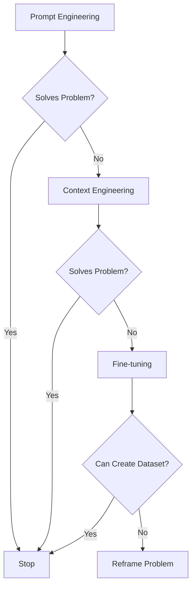
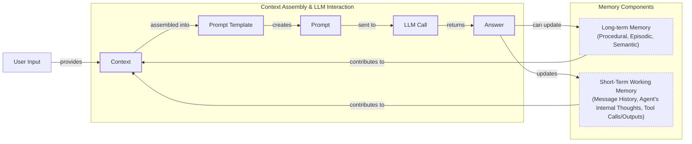
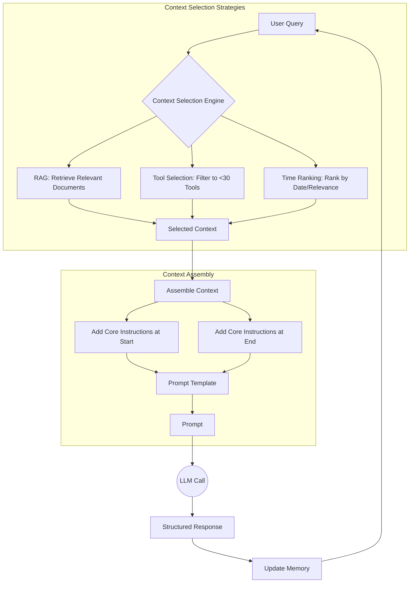
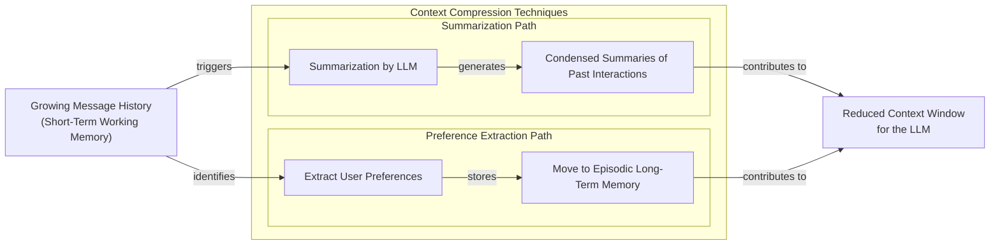
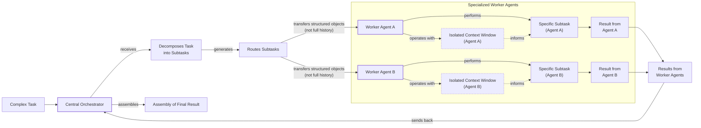

# Context Engineering: The #1 Skill for AI Engineers in 2025

AI applications have evolved rapidly. In 2022, we had simple chatbots for question-answering. By 2023, RAG systems connected LLMs to domain-specific knowledge. 2024 brought us tool-using agents that could perform actions. Now, we are building memory-enabled agents that remember past interactions and build relationships over time.

In our last lesson, we explored how to choose between AI agents and LLM workflows when designing a system. As these applications grow more complex, prompt engineering, a practice that once served us well, is showing its limits. It optimizes single LLM calls but fails when managing systems with memory, actions, and long interaction histories. The sheer volume of information an agent might need has grown exponentially, including past conversations, user data, and documents. Simply stuffing all this into a prompt is not a viable strategy.

This challenge requires a new discipline: context engineering. It is the practice of orchestrating this entire information ecosystem to ensure the LLM gets exactly what it needs, when it needs it. This skill is becoming a core foundation for AI engineering, often replacing the need for more complex and costly solutions like fine-tuning.

## From Prompt to Context Engineering

Prompt engineering, while effective for simple tasks, is designed for single, stateless interactions. It treats each call to an LLM as a new, isolated event. This approach breaks down in stateful applications where context must be preserved and managed across multiple turns.

As a conversation or task progresses, the context grows. Without a strategy to manage this growth, the LLM’s performance degrades. This is **context decay**: the model gets confused by the noise of an ever-expanding history. It starts to lose track of the original instructions or key information [[1]](https://blog.langchain.com/context-engineering-for-agents/). This information loss can also trigger hallucinations, as models attempt to fill in perceived gaps [[2]](https://www.decodingai.com/p/context-engineering-2025s-1-skill).

Even with large context windows, a physical limit exists for what you can include. Also, on the operational side, every token adds to the cost and latency of an LLM call. Simply putting everything into the context creates a slow, expensive, and underperforming system. We will explore these concepts in more detail in upcoming lessons, including memory in Lesson 9 and RAG in Lesson 10.

On a recent project, we learned this the hard way. We were working with a model that supported a two-million-token context window, so we thought, "*What could go wrong?*" We stuffed everything in: our research, guidelines, examples, and user history. The result was an LLM workflow that took 30 minutes to run and produced low-quality outputs [[2]](https://www.decodingai.com/p/context-engineering-2025s-1-skill).

This is why context engineering is essential. It shifts the focus from crafting static prompts to building dynamic systems that manage information flow. As an AI engineer, your job is to select only the most critical pieces of context for each LLM call. This makes your applications accurate, fast, and cost-effective.

## Understanding Context Engineering

Context engineering is about finding the best way to arrange parts of your memory into the context that's passed to the LLM to squeeze out the best results. It's a solution to an optimization problem in which you have to retrieve the right parts of both your short- and long-term memory to solve a specific task without overwhelming the LLM [[3]](https://arxiv.org/pdf/2507.13334). For example, when asking a cooking agent for a recipe, instead of passing the whole cookbook to the agent, we retrieve just the information about that recipe, together with personal preferences, such as allergies or taste preferences.

Andrej Karpathy offered a great analogy for this: LLMs are like a new kind of operating system, where the model acts as the CPU and its context window functions as the RAM [[4]](https://x.com/karpathy/status/1937902205765607626). Just as an operating system manages what fits into RAM, context engineering curates what occupies the model’s working memory. It is important to note that the context is a *subset* of the system's total working memory; you can hold information without passing it to the LLM on every turn.

Context engineering is not replacing prompt engineering. Instead, you can intuitively see prompt engineering as a part of context engineering. You still need to learn how to write good prompts while gathering the right context and stuffing it into your prompt without breaking the LLM [[2]](https://www.decodingai.com/p/context-engineering-2025s-1-skill).

| Dimension | Prompt Engineering | Context Engineering |
| --- | --- | --- |
| Scope | Single interaction optimization | Entire information ecosystem |
| State Management | Primarily stateless | Inherently stateful, with explicit memory management |
| Focus | How to phrase tasks | What information to provide |

Table 1: A comparison of prompt engineering and context engineering.

Context engineering is the new fine-tuning. While fine-tuning has its place, it is expensive, time-consuming, and inflexible. Data changes constantly, making fine-tuning a last resort. For most enterprise use cases, you get better results faster and more cheaply with context engineering. It allows for rapid iteration and adaptation to evolving data without altering the core model, a key advantage in dynamic environments [[5]](https://www.linkedin.com/posts/denis-panjuta_prompt-engineering-vs-context-engineering-activity-7363945251180322816-1q_m). Fine-tuning is best reserved for teaching a model a core, unchangeable skill, like adhering to a specific JSON format, rather than providing it with ever-changing task knowledge.

When you start a new AI project, your decision-making process for guiding the LLM should look like the one presented in Image 1.


Image 1: A flowchart illustrating the decision-making process for choosing an AI strategy, progressing from simpler to more complex solutions.

For instance, if you build an agent to process internal Slack messages, you do not need to fine-tune a model on your company’s communication style. It is more effective to use a powerful reasoning model and engineer the context to retrieve specific messages and enable actions like creating tasks or drafting emails. Throughout this course, we will show you how to solve most industry problems using only context engineering.

## What Makes Up the Context

To master context engineering, you first need to understand what "context" actually is. It is everything the LLM sees in a single turn, dynamically assembled from various memory components before being passed to the model.

The high-level workflow begins when a user input triggers the system to pull relevant information from both long-term and short-term memory. This information is assembled into the final context, inserted into a prompt template, and sent to the LLM. The LLM’s answer then updates the memory, and the cycle repeats.


Image 2: A flowchart depicting the high-level workflow of how context is assembled and used in an LLM application, highlighting its dynamic and cyclical nature.

These components can also be viewed by their function: **Knowledge Context** (facts, memories, documents) informs decisions, while **Tools Context** (action descriptions, outputs) enables interaction with external systems [[6]](https://galileo.ai/blog/context-engineering-for-agents). They are grouped into two main categories. We will explain them intuitively for now, as we have future dedicated lessons for all of them.

### Short-Term Working Memory

Short-term working memory is the state of the agent for the current task or conversation. It is volatile and changes with each interaction, helping the agent maintain a coherent dialogue and make immediate decisions. It can include some or all of these components [[1]](https://blog.langchain.com/context-engineering-for-agents/):

*   **User input:** The most recent query or command from the user.
*   **Message history:** The log of the current conversation, allowing the LLM to understand the flow and previous turns.
*   **Agent's internal thoughts:** The reasoning steps the agent takes to decide on its next action.
*   **Action calls and outputs:** The results from any actions the agent has performed, providing information from external systems.

### Long-Term Memory

Long-term memory is more persistent and stores information across sessions, allowing the AI system to remember things beyond a single conversation. We divide it into three types, drawing parallels from human memory [[7]](https://www.datacamp.com/blog/how-does-llm-memory-work), [[8]](https://www.analyticsvidhya.com/blog/2026/01/how-does-llm-memory-work/). An AI system can include some or all of them:

*   **Procedural memory:** This is knowledge encoded directly in the code. It includes the system prompt, which sets the agent's overall behavior. It also includes the definitions of available actions, which tell the agent what it can do, and schemas for structured outputs, which guide the format of its responses. This represents the agent's built-in skills.
*   **Episodic memory:** This is memory of specific past experiences, like user preferences or previous interactions. It's used to help the agent personalize its responses based on individual users. We typically store this in vector or graph databases for efficient retrieval [[2]](https://www.decodingai.com/p/context-engineering-2025s-1-skill).
*   **Semantic memory:** This is the agent’s general knowledge base. It can be internal, like company documents stored in a data lake, or external, accessed via the internet through API calls or web scraping. This memory provides the factual information the agent needs to answer questions.

If this seems like a lot, bear with us. We will cover all these concepts in-depth in future lessons, including structured outputs (Lesson 4), actions (Lesson 6), memory (Lesson 9), RAG (Lesson 10), and working with multimodal data in Lesson 11.
Image 3: A detailed illustration of how all the context engineering components work together inside an AI agent. (Source [Decoding AI [2]](https://www.decodingai.com/p/context-engineering-2025s-1-skill))

The key takeaway is that these components are not static. They are dynamically re-computed for every single interaction. For each conversation turn or new task, the short-term memory grows, or the long-term memory can change. Context engineering involves knowing how to select the right pieces from this vast memory pool to construct the most effective prompt for the task at hand.

## Production Implementation Challenges

Now that we understand what makes up the context, let's look at the core challenges of implementing it in production. These challenges all revolve around a single question: *"How can I keep my context as small as possible while providing enough information to the LLM?"*

Here are four common issues that come up when building AI applications:

1.  **The context window challenge:** Every model has a limited context window, which is the maximum information (tokens) it can process at once. This is similar to a computer's RAM [[9]](https://www.datacamp.com/blog/context-engineering). The self-attention mechanism in transformers has a quadratic computational and memory overhead, making long contexts extremely expensive and slow [[3]](https://arxiv.org/pdf/2507.13334).
2.  **Information overload:** Too much context reduces the performance of the LLM by confusing it. This is known as the *"lost-in-the-middle"* problem. It is a result of a bias in transformer models called **attention sinks**, which causes them to recall information best at the beginning and end of the context window [[10]](https://www.linkedin.com/pulse/lost-middle-lesson-failing-ai-agents-backwards-anthony-dejohn-01k2e), [[11]](https://dev.to/thousand_miles_ai/the-lost-in-the-middle-problem-why-llms-ignore-the-middle-of-your-context-window-3al2), [[12]](https://agentpatterns.ai/context-engineering/attention-sinks/). Information in the middle is often overlooked, and accuracy can drop by over 30% long before the physical context limit is reached [[33]](https://atlan.com/know/working-memory-llms/).
3.  **Context drift:** This occurs when conflicting versions of the truth accumulate in the memory over time [[13]](https://galileo.ai/blog/production-llm-monitoring-strategies). For example, the memory might contain two conflicting statements: "The user's budget is $500" and later "The user's budget is $1,000." This data conflict confuses the LLM and erodes user trust, making its responses unreliable without a mechanism to resolve them [[14]](https://thenewstack.io/context-rot-enterprise-ai-llms/), [[34]](https://www.coforge.com/what-we-know/blog/navigating-the-shifting-sands-understanding-and-mitigating-data-drift-in-llms).
4.  **Tool confusion:** The final challenge is tool confusion, which arises in two main ways. First, adding too many tools to an agent can confuse the LLM about the best one for the job. The Gorilla benchmark shows that nearly all models perform worse when given more than one tool [[2]](https://www.decodingai.com/p/context-engineering-2025s-1-skill). Second, confusion can occur when tool descriptions are poorly written or overlap. If action distinctions are unclear, even a human would struggle to choose correctly.

## Key Strategies for Context Optimization

Modern AI solutions must manage multiple knowledge bases, tools, and conversational histories. Context engineering is about managing this complexity while meeting performance, latency, and cost requirements.

Here are four popular context engineering strategies used across the industry:


Image 4: A workflow showing how context selection strategies work together to optimize information retrieval and assembly.

### Selecting the Right Context

Retrieving the right information from memory is a critical first step. A common mistake is to provide everything at once, assuming that models with large context windows can handle it. As we've discussed, the "lost-in-the-middle" problem often leads to poor performance, increased latency, and higher costs. To solve this, consider these approaches:

*   **Use structured outputs:** Define clear schemas for what the LLM should return. This allows you to pass only the necessary, structured information to downstream steps. We will cover this in detail in Lesson 4.
*   **Use RAG with reranking:** Instead of providing entire documents, use RAG to fetch only the specific chunks of text needed to answer a user's question, and then rerank them to place the most relevant information where the model will see it [[16]](https://www.dailydoseofds.com/llmops-crash-course-part-8/). This is a core topic we will explore in Lesson 10.
*   **Reduce the number of available actions:** Instead of giving an agent access to every available action, use patterns like the orchestrator-worker to delegate subsets to specialized components. Studies show that applying RAG to tool descriptions and keeping the selection under 30 can triple selection accuracy [[9]](https://www.datacamp.com/blog/context-engineering).
*   **Rank time-sensitive data:** For time-sensitive information, rank it by date and filter out anything no longer relevant [[16]](https://www.dailydoseofds.com/llmops-crash-course-part-8/).
*   **Repeat core instructions:** For the most important instructions, repeat them at both the start and the end of the prompt. This uses the model's tendency to pay more attention to the context edges, ensuring core instructions are not lost [[17]](https://promptmetheus.com/resources/llm-knowledge-base/lost-in-the-middle-effect).

### Context Compression

As message history grows in short-term working memory, you must manage past interactions to keep your context window in check. You cannot simply drop past conversation turns, as the LLM still needs to remember what happened. Instead, you need ways to compress key facts from the past.


Image 5: A flowchart detailing context compression techniques for managing short-term working memory.

You can do this through techniques like creating summaries of old conversation turns, moving key facts to long-term memory, or using deduplication to remove redundant information [[18]](https://oneuptime.com/blog/post/2026-01-30-context-compression/view), [[16]](https://www.dailydoseofds.com/llmops-crash-course-part-8/). However, this process is not without risk. Repeatedly summarizing conversation history can lead to **summarization drift**, where crucial details are gradually lost with each compression, causing the agent’s memory to no longer match what actually happened [[19]](https://towardsdatascience.com/a-practical-guide-to-memory-for-autonomous-llm-agents/).

### Isolating Context

Another powerful strategy is to isolate context by splitting information across multiple agents or LLM workflows. The key idea is that instead of one agent with a massive, cluttered context window, you can have a team of agents, each with a smaller, focused context.


Image 6: Architecture diagram illustrating the orchestrator-worker pattern for context isolation in multi-agent systems.

We often implement this using an orchestrator-worker pattern, where a central orchestrator agent breaks down a problem and assigns sub-tasks to specialized worker agents [[20]](https://beam.ai/agentic-insights/multi-agent-orchestration-patterns-production), [[21]](https://gurusup.com/blog/multi-agent-orchestration-guide). Each worker operates in its own isolated context, improving focus and allowing for parallel processing. We will cover this pattern in more detail in Lesson 5.

### Format Optimization

Finally, the way you format the context matters. Models are sensitive to structure, and using clear delimiters can improve performance. Common strategies are to use XML tags to wrap different pieces of context (e.g., `<user_query>`, `<documents>`) and to prefer YAML over JSON when providing structured data as input, as it is often more token-efficient [[2]](https://www.decodingai.com/p/context-engineering-2025s-1-skill).

You always have to understand what is passed to the LLM. Seeing exactly what occupies your context window at every step is key to mastering context engineering. Usually, this is done by properly monitoring your traces, tracking what happens at each step, and understanding what the inputs and outputs are [[22]](https://www.comet.com/site/blog/context-window/), [[23]](https://www.getmaxim.ai/articles/context-window-management-strategies-for-long-context-ai-agents-and-chatbots/). As this is a significant step to go from PoC to production, we will have dedicated lessons on this.

## Here Is an Example

Let's connect the theory and strategies with a concrete example. Consider these real-world scenarios:

*   **Healthcare:** An AI assistant accesses a patient's medical history, current symptoms, and relevant medical literature to suggest personalized diagnoses [[24]](https://www.decodingai.com/p/context-engineering-2025s-1-skill).
*   **Financial Services:** An agent integrates with a company's CRM, calendars, and financial data to make decisions based on user preferences.
*   **Project Management:** An AI system accesses enterprise tools like CRMs and task managers to automatically understand project requirements and update tasks.
*   **Content Creator Assistant:** An AI agent uses your research, past content, and personality traits to understand what and how to create a given piece of content.
*   **Web Development:** An AI assistant helps maintain code quality by enforcing architectural patterns and security practices, reducing technical debt and accelerating developer productivity [[25]](https://upsun.com/blog/context-engineering-ai-web-development/).

Let's walk through a specific query with the healthcare assistant. A user asks: `I have a headache. What can I do to stop it? I would prefer not to take any medicine.`

Before the LLM even sees this query, a context engineering system gets to work [[24]](https://www.decodingai.com/p/context-engineering-2025s-1-skill):

1.  It retrieves the user's patient history, known allergies, and lifestyle habits from an **episodic memory** store.
2.  It queries a **semantic memory** of up-to-date medical literature for non-medicinal headache remedies.
3.  It assembles this information, along with the user's query and the conversation history, into a structured prompt.
4.  We send the prompt to the LLM, which generates a personalized, safe, and relevant recommendation.
5.  We log the interaction and save any new preferences back to the user's episodic memory.

Here’s a simplified Python example showing how these components might be assembled into a complete system prompt. Notice the clear structure using XML tags and the ordering of context elements.

```python
SYSTEM_PROMPT = """
You are a helpful and cautious AI healthcare assistant. Your goal is to provide safe, non-medicinal advice. Do not provide medical diagnoses.

<INSTRUCTIONS>
1. Analyze the user's query and the provided context.
2. Use the patient history to understand their health profile and preferences.
3. Use the retrieved medical knowledge to form your recommendation.
4. If you lack sufficient information, ask clarifying questions.
5. Always prioritize safety and advise consulting a doctor for serious issues.
</INSTRUCTIONS>

<PATIENT_HISTORY>
{retrieved_patient_history}
</PATIENT_HISTORY>

<MEDICAL_KNOWLEDGE>
{retrieved_medical_articles}
</MEDICAL_KNOWLEDGE>

<CONVERSATION_HISTORY>
{formatted_chat_history}
</CONVERSATION_HISTORY>

<USER_QUERY>
{user_query}
</USER_QUERY>

Based on all the information above, provide a helpful response.
"""
```

To build such a system, you would use a combination of tools. An LLM like **Gemini** provides the reasoning engine. A framework like **LangGraph** orchestrates the workflow [[26]](https://www.scalablepath.com/machine-learning/langgraph). Databases such as **PostgreSQL**, **Qdrant**, or **Neo4j** serve as long-term memory stores. Observability platforms like **Opik** or **LangSmith** are essential for debugging complex interactions [[27]](https://atlan.com/know/context-engineering-platforms-comparison/). When choosing a database architecture, a key decision is between a **Split-Stack** (using separate vector, relational, and cache databases) and a **Unified Stack** (using a distributed SQL database that handles all memory layers). While a split-stack is good for prototypes, stateful multi-agent systems often benefit from a unified stack to ensure transactional guarantees and simpler operations at scale [[28]](https://www.pingcap.com/compare/best-database-for-ai-agents/). Often, it is effective to keep it simple, as you can achieve much with only PostgreSQL or MongoDB.

## Connecting Context Engineering to AI Engineering

Mastering context engineering is about building the intuition to craft effective prompts, select the right information from memory, and arrange context for optimal results. This discipline helps you determine the minimal yet essential information an LLM needs to perform at its best.

This skill doesn't exist in a vacuum. It’s a multidisciplinary practice that sits at the intersection of several key engineering fields [[29]](https://www.mezmo.com/learn-observability/context-engineering-for-observability-how-to-deliver-the-right-data-to-llms), [[30]](https://sombrainc.com/blog/ai-context-engineering-guide):

*   **AI Engineering:** Understanding LLMs, RAG, and AI agents is the foundation.
*   **Software Engineering:** You need to build scalable and maintainable systems to aggregate context and wrap agents in robust APIs.
*   **Data Engineering:** Constructing reliable data pipelines for RAG and other memory systems is critical.
*   **MLOps:** Deploying agents on the right infrastructure and automating Continuous Integration/Continuous Deployment (CI/CD) makes them reproducible, observable, and scalable.
*   **Knowledge & Enterprise Architecture:** Structuring business context and capturing "tribal knowledge" to create a reliable information ecosystem for the AI [[31]](https://medium.com/data-agents-dojo/context-engineering-for-system-of-record-agents-why-enterprise-ai-needs-a-different-playbook-6a52a50a92f0), [[32]](https://www.ardoq.com/blog/context-engineering-ai).

This growing importance is why major consultancies are now hiring thousands of dedicated context engineers, cementing it as a core enterprise capability [[32]](https://www.ardoq.com/blog/context-engineering-ai). Our goal with this course is to teach you how to combine these skills to build production-ready AI products. We like to say that in the world of AI, we should all think in systems rather than isolated components, having a mindset shift from developers to architects.

In the next lesson, we will explore structured outputs, a key technique for controlling what information flows out of an LLM and into the rest of your system. By mastering strategies like context selection, compression, and isolation, you can overcome the inherent limitations of LLMs and build truly intelligent systems. This discipline connects AI, software, data, and operations, forming the backbone of modern AI engineering.

## References

- [1] LangChain. (n.d.). Context Engineering for Agents. https://blog.langchain.com/context-engineering-for-agents/
- [2] Iusztin, P. (2025). Context Engineering: 2025’s #1 Skill in AI. Decoding AI. https://www.decodingai.com/p/context-engineering-2025s-1-skill
- [3] Mei, L., Yao, J., Ge, Y., et al. (2025). A Survey of Context Engineering for Large Language Models. arXiv. https://arxiv.org/pdf/2507.13334
- [4] karpathy. (n.d.). +1 for "context engineering" over "prompt engineering". X. https://x.com/karpathy/status/1937902205765607626
- [5] Panjuta, D. (n.d.). Prompt Engineering vs. Context Engineering. LinkedIn. https://www.linkedin.com/posts/denis-panjuta_prompt-engineering-vs-context-engineering-activity-7363945251180322816-1q_m
- [6] Galileo. (n.d.). Context Engineering for Agents. https://galileo.ai/blog/context-engineering-for-agents
- [7] DataCamp. (n.d.). How Does LLM Memory Work? https://www.datacamp.com/blog/how-does-llm-memory-work
- [8] Analytics Vidhya. (n.d.). How Does LLM Memory Work? https://www.analyticsvidhya.com/blog/2026/01/how-does-llm-memory-work/
- [9] DataCamp. (n.d.). Context Engineering: A Guide With Examples. https://www.datacamp.com/blog/context-engineering
- [10] DeJohn, A. (n.d.). Lost in the Middle: A Lesson in Failing AI Agents Backwards. LinkedIn. https://www.linkedin.com/pulse/lost-middle-lesson-failing-ai-agents-backwards-anthony-dejohn-01k2e
- [11] dev.to. (n.d.). The Lost in the Middle Problem. https://dev.to/thousand_miles_ai/the-lost-in-the-middle-problem-why-llms-ignore-the-middle-of-your-context-window-3al2
- [12] Agent Patterns. (n.d.). Attention Sinks. https://agentpatterns.ai/context-engineering/attention-sinks/
- [13] Galileo. (n.d.). Production LLM Monitoring Strategies. https://galileo.ai/blog/production-llm-monitoring-strategies
- [14] The New Stack. (n.d.). Context Rot in Enterprise AI LLMs. https://thenewstack.io/context-rot-enterprise-ai-llms/
- [15] MongoDB. (n.d.). Why Multi-Agent Systems Need Memory Engineering. https://www.mongodb.com/company/blog/technical/why-multi-agent-systems-need-memory-engineering
- [16] Daily Dose of DS. (n.d.). LLMOps Crash Course Part 8. https://www.dailydoseofds.com/llmops-crash-course-part-8/
- [17] Promptmetheus. (n.d.). Lost-in-the-Middle Effect. https://promptmetheus.com/resources/llm-knowledge-base/lost-in-the-middle-effect
- [18] OneUptime. (n.d.). Context Compression. https://oneuptime.com/blog/post/2026-01-30-context-compression/view
- [19] Towards Data Science. (n.d.). A Practical Guide to Memory for Autonomous LLM Agents. https://towardsdatascience.com/a-practical-guide-to-memory-for-autonomous-llm-agents/
- [20] Beam.ai. (n.d.). Multi-agent Orchestration Patterns in Production. https://beam.ai/agentic-insights/multi-agent-orchestration-patterns-production
- [21] GuruSup. (n.d.). Multi-agent Orchestration Guide. https://gurusup.com/blog/multi-agent-orchestration-guide
- [22] Comet. (2025). Context Window: What It Is and Why It Matters for AI Agents. https://www.comet.com/site/blog/context-window/
- [23] Maxim. (n.d.). Context Window Management Strategies. https://www.getmaxim.ai/articles/context-window-management-strategies-for-long-context-ai-agents-and-chatbots/
- [24] Decoding AI. (n.d.). Context Engineering: 2025’s #1 Skill in AI. https://www.decodingai.com/p/context-engineering-2025s-1-skill
- [25] upsun. (n.d.). Context Engineering in AI for Web Development and Enterprise Teams. https://upsun.com/blog/context-engineering-ai-web-development/
- [26] Scalable Path. (n.d.). LangGraph. https://www.scalablepath.com/machine-learning/langgraph
- [27] Atlan. (n.d.). Context Engineering Platforms Comparison. https://atlan.com/know/context-engineering-platforms-comparison/
- [28] PingCAP. (n.d.). Best Database for AI Agents. https://www.pingcap.com/compare/best-database-for-ai-agents/
- [29] Mezmo. (n.d.). Context Engineering for Observability. https://www.mezmo.com/learn-observability/context-engineering-for-observability-how-to-deliver-the-right-data-to-llms
- [30] Sombra. (n.d.). AI Context Engineering Guide. https://sombrainc.com/blog/ai-context-engineering-guide
- [31] Data Agents Dojo. (n.d.). Context Engineering for System-of-Record Agents. https://medium.com/data-agents-dojo/context-engineering-for-system-of-record-agents-why-enterprise-ai-needs-a-different-playbook-6a52a50a92f0
- [32] Ardoq. (n.d.). Context Engineering is What Enterprise Architects Have Always Done. https://www.ardoq.com/blog/context-engineering-ai
- [33] Atlan. (n.d.). Working Memory in LLMs: The Context Window as Cognitive Architecture. https://atlan.com/know/working-memory-llms/
- [34] Coforge. (n.d.). Navigating the Shifting Sands: Understanding and Mitigating Data Drift in LLMs. https://www.coforge.com/what-we-know/blog/navigating-the-shifting-sands-understanding-and-mitigating-data-drift-in-llms